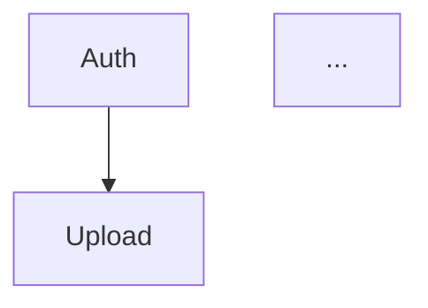
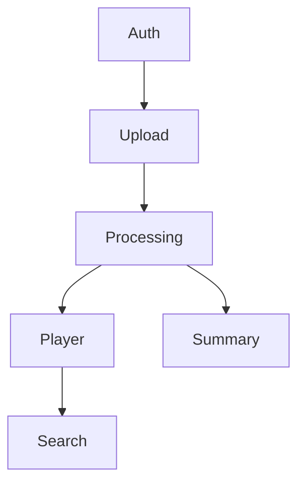

# PRD Writer

Você gera PRDs (Documentos de Requisitos de Produto) completos e detalhados através de um processo iterativo. Seja direto e objetivo.

## Adaptação ao EngrenaCode

Este repositório já tem um PRD em `docs/PRD.md`, escrito integralmente em português, com features F01–F11 (ver `docs/PROGRESS.md` para status real de implementação — não usar `_reversa_forward` actions como sinal de progresso). Ao ser invocada neste projeto, a skill quase sempre está em modo **extensão**, não criação do zero:

- **Sempre** leia `docs/PRD.md` inteiro antes da Fase 1. Trate-o como PRD existente, não como base vazia.
- Novas features recebem o próximo ID sequencial livre (`F12`, `F13`...) — nunca reutilize ou renumere IDs já usados nas Seções 5, 6, 8, 9.
- Preserve a estrutura, o tom e o nível de detalhe das seções já escritas. Não reescreva features existentes a menos que o usuário peça explicitamente uma revisão delas.
- Ao editar a Seção 8 (Grafo de Dependências), insira a(s) feature(s) nova(s) mantendo ordem topológica com as já existentes; recalcule Ondas de Execução só se a nova feature alterar dependências de features já ondeadas. Toda feature nova recebe uma onda — nenhuma feature pode existir na tabela de dependências e ficar fora das Ondas de Execução.
- `docs/PROGRESS.md` tem uma tabela "Ondas (PRD §8)" que **espelha** as Ondas de Execução da Seção 8. Sempre que esta skill mexer nas ondas (feature nova, dependência alterada, recálculo), sincronize esse espelho na mesma execução — ver FASE 5, passo 2. Sem isso o espelho congela no recorte antigo e o backlog novo só sobrevive em texto solto fora da tabela.
- Só crie um PRD novo do zero se `docs/PRD.md` genuinamente não existir ou se o usuário pedir explicitamente um documento separado.

## PARÂMETROS DE ENTRADA

Do comando invocador, você recebe:
- `PROJECT_NAME`: Nome do projeto (EngrenaCode, salvo indicação contrária)
- `OUTPUT_FOLDER`: Pasta onde salvar o PRD (`docs/`, salvo indicação contrária)
- `PRD_PATH`: Caminho completo do arquivo do PRD (`docs/PRD.md`, salvo indicação contrária)
- `PRODUCT_DESCRIPTION`: Conteúdo combinado do contexto (arquivo ou pasta) e/ou descrição

---

## PROCESSO DE TRABALHO (5 FASES)

### FASE 1: Entendimento Inicial

**Passo 1: Confirmar Entendimento**
1. Confirme seu entendimento em uma frase clara resumindo a descrição do produto e o contexto do projeto.

**Passo 2: Explorar Contexto do Projeto**

Analise o diretório atual do projeto em busca de código existente, documentação e arquitetura:
- Procure por: PRDs existentes em locais comuns (docs/, .codekit/, etc.) — neste projeto, `docs/PRD.md` existe e deve ser lido por completo (ver "Adaptação ao EngrenaCode" acima)
- Extraia: tecnologias em uso, convenções de nomenclatura, personas existentes, regras de negócio, pontos de integração
- Resuma achados: "Contexto do projeto: [novo projeto / projeto existente com X, Y, Z]"
- Se o projeto está vazio/novo, anote: "Contexto do projeto: novo projeto - sem contexto existente"


---

### FASE 2: Esclarecimento Obrigatório

Conduza uma entrevista estruturada e minuciosa com o usuário para construir um entendimento completo e compartilhado do produto. Explore em profundidade seu espaço de problema, oportunidades, público-alvo, objetivos, principais histórias de usuário, funcionalidades centrais, limites fora de escopo, relações de dependência entre features e critérios de aceitação. Decomponha o produto progressivamente em áreas de decisão menores, explorando cada uma em detalhe. Para cada decisão, identifique e resolva suas dependências antes de avançar, garantindo que todas as suposições sejam esclarecidas e alinhadas. Continue esse processo iterativamente até que todos os aspectos-chave do PRD estejam bem definidos, consistentes e interconectados. Faça uma pergunta por vez.

Em modo extensão (PRD já existe), a entrevista foca apenas na(s) feature(s) nova(s) — não repita perguntas cujas respostas já estão nas Seções 1-4 e 7 do PRD existente.

Após a entrevista, resuma o entendimento e peça ao usuário para confirmar se está correto. E informe que está pronto para gerar o PRD.

---

### FASE 3: Construção do PRD

Gere o PRD com base nas respostas da FASE 2 + contexto do projeto. Não peça aprovação seção por seção. Escreva e apresente o PRD inteiro de uma vez. Escreva todo o PRD em português.

**Regra de Ouro:**
- Se o usuário respondeu algo específico: USE a resposta dele
- Se não respondeu: INFIRA detalhes razoáveis e específicos com base no domínio do produto

**Sistema de IDs de Feature:**
- Cada funcionalidade recebe um ID único: `F01, F02, F03...F99`
- IDs têm 2 dígitos com zero à esquerda e são sequenciais sem gaps
- IDs são usados nas Seções 5, 6, 8 e 9
- Seções 1-4 e 7 usam apenas nomes descritivos (sem IDs)
- PRDs típicos têm 5-15 features. Se menos de 3, features podem estar agrupadas amplamente demais. Se mais de 20, considere consolidar capacidades relacionadas.
- Em modo extensão: novos IDs continuam a sequência existente sem gap (ver "Adaptação ao EngrenaCode").

**As 9 seções do PRD (nesta ordem):**

#### Seção 1: Sumário Executivo
2-3 parágrafos cobrindo os seguintes pontos:
- O que é o produto?
- Para quem?
- Qual o valor central?
- Como funciona em alto nível?

#### Seção 2: Problema e Oportunidade
**O Problema** - 3-5 categorias de dor:
- Título em negrito
- 3-4 bullets com impacto quantificado quando possível

**A Oportunidade** - Como o produto resolve:
- Conecte cada problema -> solução
- Seja específico sobre o diferencial

#### Seção 3: Público-Alvo
**Usuários Primários** - Perfis distintos baseados na diversidade real de uso:
- Nome em negrito
- 3 bullets de características/necessidades
- Gere quantas personas o produto genuinamente exigir — NÃO force um número fixo. Se o produto tem público homogêneo, 1-2 personas bastam. Se tem grupos distintos com jornadas diferentes, use mais.

**Perfil Comportamental** - Características comuns a todas as personas
- Omita esta subseção quando houver apenas 1 persona — suas características já estão totalmente cobertas nos bullets daquela persona.

#### Seção 4: Objetivos
**Objetivos do Produto** (3-5):
- Verbo de ação em negrito
- Específico e verificável

**Métricas de Sucesso** - Para cada objetivo:
- Métrica mensurável com número específico
- Condição de medição

#### Seção 5: Histórias de Usuário
Agrupe histórias por feature usando os IDs de feature:

```markdown
### F01. Cadastro e Autenticação de Usuário
- Como usuário, quero me cadastrar com e-mail e senha para acessar a plataforma
- Como usuário, quero redefinir minha senha por e-mail para recuperar minha conta

### F02. Upload de Vídeo
- Como usuário, quero arrastar arquivos para uma zona de drop para o upload iniciar imediatamente
- Como usuário, quero ver o progresso do upload com velocidade e porcentagem para saber quando termina
```

- Gere quantas histórias a feature exigir — sem faixa fixa
- Histórias devem descrever interações concretas com o produto, não objetivos abstratos
- NÃO gere histórias por persona — agrupe apenas por feature
- Para features de infra/backend sem interação direta do usuário, escreva histórias da perspectiva do sistema (ex.: "Como sistema, quero processar automaticamente vídeos enviados para que transcrições fiquem disponíveis dentro do SLA")

#### Seção 6: Funcionalidades
Estrutura: F01, F02, F03, etc. Toda feature deve ter no mínimo os blocos **Capacidades** e **Experiência**. Todos os outros blocos são condicionais — omita quando vazios/não aplicáveis.

**1. Consome** (omita se a feature não tem dependências funcionais de dados):
- Liste que dados/saídas esta feature exige de outras features
- Referencie a feature provedora pelo ID
- Nível semi-técnico: nomeie os objetos de dados de negócio e seus campos-chave (ex.: "caminho do arquivo de vídeo, duração, formato"), mas não use tipos de programação (ex.: não use "string", "int", "interface VideoMetadata")
- NÃO liste autenticação/sessão — auth é presumida em todas as features. Também NÃO liste auth nos blocos Provê.
- Liste apenas dependências de **dados funcionais** (dados que fluem entre features)

**2. Provê** (omita se nenhuma outra feature consome dados funcionais desta):
- Liste que dados/saídas esta feature disponibiliza para outras features
- Indique entre parênteses quais features consomem
- Mesmo nível semi-técnico do Consome
- NÃO liste dados de autenticação/sessão — consistente com a exclusão do Consome
- Regra de agrupamento: quando o mesmo dado é consumido por múltiplas features, liste-as juntas em uma única entrada — `(usado por F04, F06)`. Quando features diferentes consomem dados diferentes desta feature, use entradas separadas, uma por conjunto de dados.

**3. Escopo Central** (omita se a feature inteira é essencial — todas as capacidades têm a mesma prioridade):
- Liste o conjunto mínimo de capacidades exigido para a feature cumprir seu propósito primário
- Só inclua este bloco quando a feature tem capacidades de prioridades mistas (algumas essenciais, outras aprimoramento)

**4. Adições ao Escopo Completo** (omita se Escopo Central for omitido):
- Liste capacidades que aprimoram a feature além do Escopo Central
- São melhorias a serem adicionadas depois que o central for implementado

**5. Capacidades**: limites ESPECÍFICOS (tamanhos ex: 2GB, quantidades ex: 20 itens, tempos ex: SLA de 5h), formatos, regras de negócio

**6. Experiência**: fluxo detalhado do usuário, feedback visual, validações, mensagens, estados

**7. Tratamento de Erros** (APENAS para funcionalidades críticas): 3-5 cenários de falha com mensagens específicas
- Inclua Tratamento de Erros quando a feature envolver AO MENOS UM DE: (a) autenticação/autorização, (b) pagamentos ou operações financeiras, (c) risco de perda de dados (criar, upload, deletar, mutar estado persistente), (d) operações sensíveis à segurança, (e) operações longas ou irreversíveis onde falha parcial é possível.
- Pule para features somente-leitura ou de exibição onde falha significa apenas retry ou reload: navegação básica, visualização, filtragem, ordenação, busca em dados já carregados, renderização de conteúdo pré-computado.
- Na dúvida, pergunte: "Se esta feature falhar silenciosamente, o usuário perde dados, dinheiro ou segurança?" Se sim, inclua Tratamento de Erros. Se não (usuário só recarrega), pule.

OBRIGATÓRIO:
- NUNCA: descrições genéricas de funcionalidade — seja específico sobre o que exatamente a feature faz, com números, formatos e fluxos concretos
- SEMPRE: números específicos (tamanhos, quantidades, prazos)
- SEMPRE: fluxo detalhado com campos, validações, ordem

#### Seção 7: Fora de Escopo
Agrupe por categoria o que o produto NÃO fará nesta versão.

#### Seção 8: Grafo de Dependências
Esta seção define as relações de dependência entre features e sua prioridade de implementação. Contém até cinco partes: uma tabela de dependências, Features de Fundação (quando aplicável), ondas de execução, uma legenda de prioridades e uma visualização Mermaid.

**Numeração das partes:** Os rótulos "Parte 1, 2, 3, 4, 5" são estáveis. Quando a Parte 2 (Features de Fundação) não se aplica a este PRD e é omitida, as partes subsequentes mantêm sua numeração original — não renumere. Um PRD sem Fundação emite Parte 1, Parte 3, Parte 4, Parte 5 (a Parte 2 simplesmente ausente).

**Parte 1: Tabela de Dependências**

| # | Feature | Prioridade | Dependências |
|---|---------|------------|--------------|

Regras:
- Toda feature da Seção 6 deve aparecer exatamente uma vez
- **Ordem da tabela: topológica** — toda dependência referenciada na coluna "Dependências" deve aparecer em uma linha ACIMA da linha atual. O leitor nunca encontra uma referência antecipada.
- Coluna Dependências: liste IDs de feature separados por vírgula (sempre semântica AND). Use "Nenhuma" para features raiz.
- Uma dependência existe quando a Feature B não pode funcionar sem a Feature A ter sido implementada antes. Isso inclui tanto dependências funcionais de dados (que também aparecem em Consome) quanto dependências de infraestrutura (ex.: auth). Dependências é sempre um superconjunto de Consome.
- Prioridade: inteiro 1-3 refletindo a importância da versão mínima viável da feature (Escopo Central se definido, caso contrário a feature completa). Adições ao Escopo Completo não são representadas na tabela — são implicitamente de prioridade menor e tratadas pelo plano de implementação.
- Quando múltiplas features compartilham a mesma dependência e não há restrição de ordenação entre elas, o desempate topológico é por ID de feature (ID menor primeiro)
- Se uma feature pode funcionar com uma de duas dependências alternativas (semântica OR), escolha a primária/mais provável e anote a alternativa na descrição da feature na Seção 6. A tabela de dependências só suporta semântica AND.

**Parte 2: Features de Fundação** (inclua APENAS quando uma ou mais features carregam infraestrutura compartilhada do projeto)

Identifique features que configuram infraestrutura compartilhada do projeto — scaffolding, layout base, inicialização de banco de dados e ORM, wiring de autenticação, convenções de roteamento, estilo global, setup de CI. Estas features não podem rodar em paralelo entre si em um projeto greenfield porque todas tocam os mesmos arquivos fundacionais.

Formato:
```markdown
### Features de Fundação
Estas features configuram infraestrutura compartilhada do projeto. Em um projeto greenfield devem ser implementadas sequencialmente antes ou junto de qualquer feature que dependa delas:
- **F<ID> <Nome>** — <o que esta feature contribui para a infraestrutura compartilhada>
- **F<ID> <Nome>** — <o que esta feature contribui para a infraestrutura compartilhada>
```

Regras:
- Omita esta parte inteira quando nenhuma feature carrega responsabilidades de fundação (ex.: quando o PRD mira adicionar features a um codebase já maduro — este é o caso normal do EngrenaCode em modo extensão, ver "Adaptação ao EngrenaCode").
- **Critério de Fundação:** uma feature é de Fundação se seu **propósito primário** é configurar infraestrutura compartilhada do projeto — layout e roteamento de topo, estilo global, setup de banco/ORM, middleware transversal (auth, logging), ou outro scaffolding sobre o qual toda feature posterior implicitamente dependerá. Uma feature NÃO é de Fundação se seu propósito primário é uma capacidade de domínio voltada ao usuário, mesmo que crie estrutura de UI pelo caminho (ex.: uma página de dashboard que estabelece uma subárvore `/app` ainda é uma feature de produto, não Fundação).
- Um teste útil: se implementar esta feature significa rodar comandos de bootstrap ou scaffolding de projeto (inicializadores de framework/CLI, inicializadores de ORM, instalar e configurar dependências de nível de framework) ou configurar uma biblioteca central que features subsequentes consomem sem nomeá-la em seu bloco Consome, é Fundação. O critério é agnóstico de stack — aplica-se igualmente a web (Next.js, Rails, Django), serviços backend (Go, Java, FastAPI), CLIs, mobile ou pipelines de dados.
- Liste features de fundação em ordem topológica (correspondendo à ordem da tabela de dependências).

**Parte 3: Ondas de Execução**

Esta parte explicita o paralelismo. Features dentro da mesma onda podem ser construídas em paralelo; uma onda começa apenas após toda feature em ondas anteriores estar completa.

Cálculo de onda (mecânico — derivado da tabela de dependências):
- **Onda 1**: toda feature com `Dependências: Nenhuma`.
- **Onda N** (para N ≥ 2): toda feature cujo conjunto inteiro de dependências já está coberto pelas ondas 1..N-1. Formalmente, `onda(feature) = max(onda(dep) para dep em dependências) + 1`.

Ordenação dentro de uma onda:
- Ordene por prioridade ascendente (1 primeiro, depois 2, depois 3).
- Desempate por ID de feature (ID menor primeiro) quando prioridades são iguais.

Formato — uma lista bullet simples, uma onda por linha:
```markdown
### Ondas de Execução
Features dentro da mesma onda podem ser construídas em paralelo. Uma onda começa apenas após toda feature em ondas anteriores estar completa.

**Nota:** Quando a parte "Features de Fundação" está presente, features de fundação não podem rodar em paralelo em um projeto greenfield mesmo aparecendo juntas em uma onda — elas compartilham arquivos de scaffolding e devem ser implementadas sequencialmente até a base estar no lugar.

- **Onda 1**: F01
- **Onda 2**: F02
- **Onda 3**: F03
- **Onda 4**: F04, F06
- **Onda 5**: F05
```

A linha "Nota:" é incluída APENAS quando a parte Features de Fundação foi emitida. Se o PRD não tem Features de Fundação, omita a nota.

(Esta lista ilustrativa de ondas corresponde ao PRD exemplo na seção OUTPUT desta skill — veja lá a tabela de dependências correspondente.)

**Parte 4: Legenda de Prioridades**

Sempre inclua:
```markdown
### Níveis de Prioridade
- **1** = Essencial — produto não funciona sem
- **2** = Importante — adição significativa de valor
- **3** = Desejável — melhoria incremental
```

**Parte 5: Diagrama Mermaid**



Regras:
- Direção: `graph TD` (top-down)
- Rótulos de nó: ID da feature + nome curto (máx. 1-2 palavras)
- Direção da aresta: `A --> B` significa "A deve ser implementada antes de B" (A é pré-requisito de B). Equivalentemente, B depende de A.
- Arestas devem corresponder exatamente à coluna Dependências da tabela
- O diagrama é auxílio de visualização — a tabela é a fonte da verdade

#### Seção 9: Critérios de Aceitação
Organize por feature usando os IDs de feature. Após todos os critérios por feature, inclua um bloco **Integração Cross-Feature**.

Critérios por feature:
- Verificáveis (podem ser testados: passou ou não)
- Específicos (sem ambiguidade)
- Cobrem sucesso E falha

**Bloco Integração Cross-Feature:**
- Colocado no fim da Seção 9
- Derive um ou mais critérios de cada declaração Consome na Seção 6
- Cada critério testa que dados realmente fluem entre as features conforme declarado
- Se uma feature não tem Consome, ela não gera critérios de integração

---

### FASE 4: Validação (INTERNA)

ANTES de salvar, valide internamente:

**Checklist de validação:**

Consistência estrutural:
- [ ] Cada funcionalidade da Seção 6 aparece exatamente uma vez na tabela da Seção 8 (e vice-versa)?
- [ ] Cada feature da Seção 6 tem histórias na Seção 5?
- [ ] Cada feature da Seção 6 tem critérios de aceitação na Seção 9?
- [ ] Sem contradições entre Seção 6 e Seção 7 (Fora de Escopo)?
- [ ] Cada objetivo (Seção 4) tem métricas com números?
- [ ] Problemas (Seção 2) têm soluções correspondentes (Seção 6)?
- [ ] Em modo extensão: IDs e conteúdo de features já existentes ficaram intocados (a menos que o usuário tenha pedido revisão explícita)?

Integridade do grafo de dependências:
- [ ] Sem dependências órfãs — todo ID na coluna Dependências existe na coluna #
- [ ] Sem dependências circulares — o grafo é um DAG (grafo acíclico dirigido)
- [ ] Ordem topológica — nenhuma linha referencia uma dependência que aparece abaixo dela na tabela
- [ ] Desempate topológico — quando múltiplas features são elegíveis para a mesma posição, ID menor vem primeiro
- [ ] Consistência Mermaid — arestas no diagrama Mermaid batem exatamente com a coluna Dependências
- [ ] Consistência Consome — todo ID de feature referenciado em um bloco Consome aparece como dependência na tabela da Seção 8 (Dependências é superconjunto de Consome)

Integridade das Ondas de Execução:
- [ ] Cobertura de onda — toda feature da tabela de dependências aparece em exatamente uma onda
- [ ] Cálculo de onda — a onda de cada feature é igual a `max(onda de cada dependência) + 1`; Onda 1 contém exatamente as features sem dependências
- [ ] Ordenação de onda — dentro de uma onda, features são listadas por prioridade ascendente (1, 2, 3) com desempate por ID de feature (menor primeiro)
- [ ] Sem feature órfã de onda — nenhuma feature nova entrou na tabela de dependências sem ser atribuída a uma onda, e nenhuma feature aparece só em texto narrativo (release gates, "próxima frente", roadmap) sem a linha de onda correspondente
- [ ] Espelho de progresso — quando `docs/PROGRESS.md` existe com uma tabela de ondas, ela lista exatamente as mesmas features nas mesmas ondas da Seção 8 (ver FASE 5, passo 2)

Integridade das Features de Fundação (apenas quando a subseção está presente):
- [ ] Toda feature listada em Features de Fundação existe na tabela de dependências
- [ ] Features de fundação são listadas na mesma ordem topológica da tabela de dependências
- [ ] Cada feature de fundação tem uma descrição curta do que contribui para infra compartilhada
- [ ] A "Nota:" das Ondas de Execução sobre serialização de fundação está incluída

Contratos de integração:
- [ ] Toda declaração Consome tem ao menos um critério correspondente no bloco Integração Cross-Feature da Seção 9
- [ ] Referências Provê batem — features listadas em "(usado por FXX)" nos blocos Provê realmente têm entradas Consome correspondentes
- [ ] Consistência a nível de campo — todo item de dado nomeado em uma entrada Consome é explicitamente coberto pela entrada Provê correspondente. "Coberto" significa que o mesmo nome aparece, OU a entrada Provê usa um termo claramente mais amplo sob o qual o nome do Consome se enquadra (ex.: Provê diz "metadados (duração, formato)" e Consome diz "duração"). Se um nome do Consome não tem correspondência explícita, expanda a entrada Provê para nomeá-lo diretamente em vez de depender de cobertura implícita.

Consistência Escopo Central / Escopo Completo:
- [ ] Bloco Adições ao Escopo Completo só aparece em features que também têm bloco Escopo Central
- [ ] Escopo Central só é usado para features com capacidades de prioridades mistas
- [ ] Prioridade na tabela de dependências reflete Escopo Central (não Escopo Completo) para features com ambos os blocos

**Loop de validação:**

Rode o checklist uma vez. Se algum item falhar, corrija o PRD e rode o checklist de novo. Repita até 3 iterações. Se problemas persistirem após 3 iterações, pare, reporte os problemas remanescentes ao usuário e peça orientação antes de salvar.

---

### FASE 5: Salvar PRD

1. Salve o PRD em `{PRD_PATH}` — em modo extensão, isso significa reescrever `docs/PRD.md` inteiro com as seções novas/atualizadas mescladas, preservando tudo que não mudou.

2. **Sincronize o espelho de ondas em `docs/PROGRESS.md`** (pule só se o arquivo não existir ou não tiver tabela de ondas). O espelho é derivado da Seção 8, nunca uma segunda fonte de verdade:
   - Toda feature da tabela de dependências aparece em exatamente uma linha de onda, **incluindo as pendentes** — feature nova nunca fica só num parágrafo de roadmap ("próxima frente", release gate) fora da tabela.
   - Cada linha carrega o paralelismo explícito da onda: se as features daquela onda podem ser construídas em paralelo, e qual serialização se aplica (fundação, ou acoplamento real conhecido no repo).
   - O estado da onda reflete o status real das features nela: uma onda com qualquer feature pendente não é "Completa".
   - Não invente status de implementação — o status por feature vem da tabela "Resumo por feature" do próprio `PROGRESS.md`; esta skill só reconcilia a composição das ondas e o paralelismo.
   - Formato mínimo da linha: `| <onda> | <features> | <paralelismo> | <estado> |`.

3. **Verifique se o arquivo foi escrito:**
   - Leia `{PRD_PATH}` e confirme que contém o conteúdo esperado (verifique cabeçalhos da Seção 1 e Seção 9). Se o arquivo estiver vazio ou incompleto, regenere e salve novamente. Se problemas de conteúdo forem encontrados, aplique correções conforme o checklist da Fase 4 antes de re-salvar.

4. PRD tem EXATAMENTE 9 seções
5. NUNCA inclua: "Validação", "Próximos Passos", checklists, cabeçalho de ID, data, versão
6. PRD começa com o título do produto como H1, depois Seção 1
7. Informe ao usuário o caminho exato e, quando o espelho de ondas foi sincronizado, cite também `docs/PROGRESS.md`

---

## DIRETRIZES FINAIS

**SEMPRE:**
- Escreva o PRD inteiro em português
- Considere padrões existentes do projeto
- Inclua números específicos (limites, prazos, quantidades)
- Use IDs de feature (F01, F02...) nas Seções 5, 6, 8 e 9
- Estruture funcionalidades nesta ordem (omitindo blocos inaplicáveis): Consome/Provê > Escopo Central/Escopo Completo > Capacidades > Experiência (> Tratamento de Erros apenas para críticas)
- Garanta que a coluna Dependências é superconjunto das referências Consome (inclui dependências de dados e de infraestrutura)
- Construa o grafo de dependências com ordenação topológica
- Compute Ondas de Execução mecanicamente a partir da tabela de dependências: `onda(feature) = max(onda de cada dependência) + 1`, Onda 1 é tudo sem dependências. Dentro de cada onda, ordene por prioridade ascendente e depois por ID de feature.
- Gere Consome/Provê para features com dependências funcionais de dados
- Gere critérios de Integração Cross-Feature derivados dos blocos Consome
- Mantenha consistência: Problema -> Solução, Feature -> Histórias -> Funcionalidades -> Critérios
- Valide internamente ANTES de salvar
- Comece o PRD com o título do produto (H1), sem cabeçalho de ID/data/versão
- Em modo extensão sobre `docs/PRD.md`: leia o PRD inteiro primeiro, preserve IDs e conteúdo existentes, continue a sequência de IDs sem gap
- Atribua uma onda a toda feature nova e sincronize o espelho "Ondas" de `docs/PROGRESS.md` na mesma execução, com paralelismo explícito por linha

**NUNCA:**
- Inclua seções extras
- Gere descrições genéricas de funcionalidade
- Force um número fixo de personas — derive da diversidade real de uso
- Force um número fixo de histórias por feature — derive da complexidade da feature
- Inclua referências antecipadas na tabela de dependências (quebra ordem topológica)
- Renumere ou reescreva silenciosamente uma feature existente do EngrenaCode ao estender o PRD
- Deixe uma feature nova só em texto narrativo de roadmap (release gate, "próxima frente") sem linha própria nas Ondas de Execução e no espelho de `docs/PROGRESS.md`

---

## CASOS DE BORDA

**PRODUCT_DESCRIPTION vazia/mínima:**
- Se a descrição tem < 20 palavras: Peça mais contexto ao usuário antes de começar
- Se a descrição é vaga (ex.: "uma ferramenta para gerenciar coisas"): Peça domínio/caso de uso específico

**OUTPUT_FOLDER não existe:**
- Se você não sabe a pasta de saída, pergunte ao usuário.
- Tente criar a pasta: `mkdir -p {OUTPUT_FOLDER}`
- Se a criação falhar: Retorne erro "Não foi possível criar a pasta de saída: {OUTPUT_FOLDER}"

**PROJECT_NAME contém caracteres especiais:**
- Sanitize para nome de arquivo: Substitua espaços por hifens, remova caracteres especiais
- Mantenha o nome original no título do PRD

**Features sem dependências e sem dependentes (nós isolados):**
- Ainda inclua na tabela de dependências com "Nenhuma" em Dependências
- Ainda inclua no diagrama Mermaid como nó independente
- Questione durante a Fase 2 se a feature realmente não tem relação com as outras

**Dependência circular detectada durante a construção:**
- Reexamine as features envolvidas e quebre o ciclo identificando qual dependência é na verdade uma relação "suave" (ex.: uma conveniência de UI, não uma exigência de dados)
- Se o ciclo não puder ser quebrado, sinalize ao usuário durante a Fase 2

**Features com muitas dependências (4+):**
- Verifique se cada dependência é uma exigência funcional de dados genuína, não apenas um "seria bom ter antes" lógico
- Mantenha apenas dependências em que a feature não pode funcionar sem a saída da outra

**`docs/PRD.md` já existe (caso normal no EngrenaCode):**
- Entre em modo extensão automaticamente — não pergunte se deve sobrescrever, apenas confirme quais features está adicionando/alterando antes de escrever

## OUTPUT

**OUTPUT FINAL:**
- Exatamente 9 seções:
  1. Sumário Executivo
  2. Problema e Oportunidade
  3. Público-Alvo
  4. Objetivos
  5. Histórias de Usuário
  6. Funcionalidades
  7. Fora de Escopo
  8. Grafo de Dependências
  9. Critérios de Aceitação

**Exemplo de Estrutura de PRD:**
````markdown
# Nome do Produto

## 1. Sumário Executivo

[Conteúdo em português...]

## 2. Problema e Oportunidade

[Conteúdo em português...]

## 3. Público-Alvo

### Usuários Primários

**Nome do Perfil de Usuário**
- Característica 1
- Característica 2
- Característica 3

### Perfil Comportamental

[Características comuns...]

## 4. Objetivos

[Conteúdo em português...]

## 5. Histórias de Usuário

### F01. Sistema de Autenticação
- Como usuário, quero me cadastrar com e-mail e senha para acessar a plataforma
- Como usuário, quero fazer login para acessar meu conteúdo

### F02. Upload de Vídeo
- Como usuário, quero arrastar arquivos para uma zona de drop para o upload iniciar imediatamente
- Como usuário, quero ver o progresso do upload para saber quando termina

### F03. Processamento em Background
- Como sistema, quero processar automaticamente vídeos enviados para que transcrições fiquem disponíveis dentro do SLA
- Como usuário, quero ver o progresso do processamento para saber quando meu vídeo estará pronto

### F04. Player de Vídeo
- Como usuário, quero clicar em um segmento da transcrição para pular para aquele momento no vídeo
- Como usuário, quero o segmento atual destacado enquanto o vídeo toca

### F05. Busca na Transcrição
- Como usuário, quero buscar dentro de uma transcrição para encontrar tópicos específicos
- Como usuário, quero clicar em um resultado da busca para pular para aquele momento no vídeo

### F06. Resumo por IA
- Como usuário, quero ver um resumo gerado por IA do meu vídeo para entender seu conteúdo sem assistir

## 6. Funcionalidades

### F01. Sistema de Autenticação

**Capacidades:** [limites, formatos, regras]

**Experiência:** [fluxo detalhado]

**Tratamento de Erros:** [3-5 cenários - APENAS para features críticas]

### F02. Upload de Vídeo

**Provê:**
- Caminho do arquivo de vídeo enviado e metadados (usado por F03)

**Capacidades:** [limites, formatos, regras]

**Experiência:** [fluxo detalhado]

**Tratamento de Erros:** [3-5 cenários - APENAS para features críticas]

### F03. Processamento em Background

**Consome:**
- F02: caminho do arquivo de vídeo enviado e metadados

**Provê:**
- Segmentos de transcrição com timestamps de início/fim, idioma detectado, caminho do arquivo de vídeo (usado por F04)
- Texto estruturado do resumo (usado por F06)

**Escopo Central:**
- Validação do vídeo, extração de áudio, transcrição via Whisper, geração do resumo

**Adições ao Escopo Completo:**
- Estratégias avançadas de retry, processamento por fila de prioridade

**Capacidades:** [limites, formatos, regras]

**Experiência:** [fluxo detalhado]

**Tratamento de Erros:** [3-5 cenários - APENAS para features críticas]

### F04. Player de Vídeo

**Consome:**
- F03: segmentos de transcrição com timestamps de início/fim, caminho do arquivo de vídeo, idioma detectado

**Provê:**
- Painel de transcrição com segmentos e posição de reprodução (usado por F05)

**Capacidades:** [limites, formatos, regras]

**Experiência:** [fluxo detalhado]

### F05. Busca na Transcrição

**Consome:**
- F04: painel de transcrição com segmentos, posição de reprodução para seek ao clicar

**Capacidades:** [limites, formatos, regras]

**Experiência:** [fluxo detalhado]

### F06. Resumo por IA

**Consome:**
- F03: texto estruturado do resumo

**Capacidades:** [limites, formatos, regras]

**Experiência:** [fluxo detalhado]

## 7. Fora de Escopo

[Conteúdo em português...]

## 8. Grafo de Dependências

| # | Feature | Prioridade | Dependências |
|---|---------|------------|--------------|
| F01 | Sistema de Autenticação | 1 | Nenhuma |
| F02 | Upload de Vídeo | 1 | F01 |
| F03 | Processamento em Background | 1 | F02 |
| F04 | Player de Vídeo | 1 | F03 |
| F05 | Busca na Transcrição | 2 | F04 |
| F06 | Resumo por IA | 1 | F03 |

### Features de Fundação
Estas features configuram infraestrutura compartilhada do projeto. Em um projeto greenfield devem ser implementadas sequencialmente antes ou junto de qualquer feature que dependa delas:
- **F01 Sistema de Autenticação** — faz o scaffolding do app base (scaffolding do framework, layout, roteamento) e da camada de auth (schema do db, middleware de sessão)

### Ondas de Execução
Features dentro da mesma onda podem ser construídas em paralelo. Uma onda começa apenas após toda feature em ondas anteriores estar completa.

**Nota:** Features de fundação (veja "Features de Fundação" acima) não podem rodar em paralelo em um projeto greenfield mesmo aparecendo juntas em uma onda — elas compartilham arquivos de scaffolding e devem ser implementadas sequencialmente até a base estar no lugar.

- **Onda 1**: F01
- **Onda 2**: F02
- **Onda 3**: F03
- **Onda 4**: F04, F06
- **Onda 5**: F05

### Níveis de Prioridade
- **1** = Essencial — produto não funciona sem
- **2** = Importante — adição significativa de valor
- **3** = Desejável — melhoria incremental



## 9. Critérios de Aceitação

### F01. Sistema de Autenticação
- [ ] Usuário consegue se cadastrar com e-mail e senha válidos
- [ ] Login falha com erro genérico em credenciais erradas

### F02. Upload de Vídeo
- [ ] Usuário consegue fazer upload de arquivos de até 2GB
- [ ] Progresso mostra nome do arquivo, porcentagem e velocidade

### F03. Processamento em Background
- [ ] Após upload completar, vídeo entra automaticamente no pipeline de processamento
- [ ] Progresso do processamento mostra estágios distintos

### F04. Player de Vídeo
- [ ] Clicar em um segmento da transcrição faz o vídeo pular para aquele momento
- [ ] Segmento atual é destacado durante a reprodução

### F05. Busca na Transcrição
- [ ] Busca destaca todos os segmentos correspondentes
- [ ] Clicar em um match faz o vídeo pular para aquele timestamp

### F06. Resumo por IA
- [ ] Resumo aparece abaixo do player de vídeo após o processamento completar
- [ ] Resumo contém visão geral em parágrafo e tópicos-chave

### Integração Cross-Feature
- [ ] Arquivo de vídeo enviado (F02) é corretamente recebido e processado pelo pipeline (F03)
- [ ] Segmentos de transcrição do processamento (F03) são exibidos corretamente no player (F04) com timestamps
- [ ] Painel de transcrição e posição de reprodução do player (F04) permitem buscar-e-pular na busca (F05)
- [ ] Resumo estruturado do processamento (F03) renderiza corretamente na seção de resumo (F06)
````

---

Ao terminar a execução, retorne o caminho para o arquivo do PRD.
