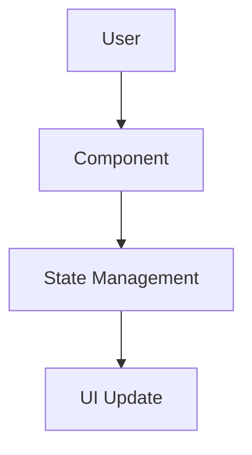
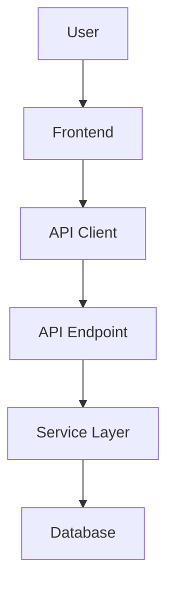
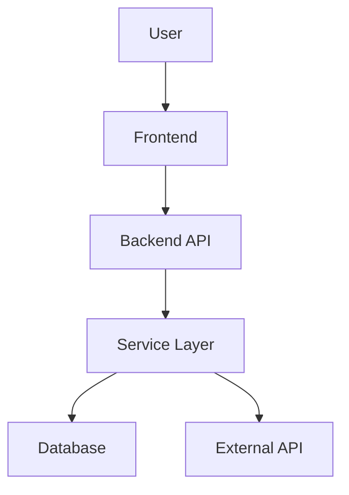

## Visão Geral do Documento

Cada feature produz DOIS arquivos em uma subpasta:

| Arquivo | Propósito | Foco de Conteúdo |
|---------|-----------|------------------|
| `spec.md` | Especificação técnica | Arquitetura, contratos de API, modelos de dados, estratégia de testes |
| `plan.md` | Roteiro de implementação | Fases, passos numerados com descrições alto-nível |

**Fonte de padrões (Two-phase batch):** em Modo Lote, a autoridade de stack/convenções é `docs/_shared/codebase-patterns.md` (gerado pelo Research, Phase A). Schema: `references/research-brief-template.md`. A spec **cita** o brief e documenta só o delta da feature; não recopiar Camada 1. Em single-feature sem brief fresco, a Descoberta 1.3 ainda roda inline.

**UI da feature (`ui.md` / `copy.md`):** quando a feature tem superfície visual, o EngrenaCode escreve `docs/<feature-id>-<kebab-name>/ui.md` (anatomia, tokens, aceite visual) e `docs/<feature-id>-<kebab-name>/copy.md` (catálogo de strings literais por id) como processo separado, ANTES ou em paralelo à spec técnica. Quando esses arquivos já existem, são a fonte de verdade para UX/copy: a spec **cita** os caminhos e usa os ids de copy declarados, nunca reinventa texto ou reordena a anatomia documentada. Quando não existem ainda, a spec anota a lacuna em Assumptions ("`ui.md`/`copy.md` ainda não escritos — pendente do processo de design") em vez de inventar layout/copy.

---

## Níveis de Complexidade

Classifique features antes de gerar documentos:

| Complexidade | Critérios |
|--------------|-----------|
| `trivial` | Componente único, sem mudanças de API, sem mudanças de DB, sem integrações |
| `simples` | Poucos componentes, 1-10 endpoints, leves mudanças de schema DB, sem integrações |
| `médio` | Múltiplos componentes, 11-30 endpoints, mudanças regulares de schema DB, integrações básicas |
| `complexo` | Múltiplas camadas, 30+ endpoints, migrações DB complexas, serviços externos |

**Escalabilidade de profundidade por complexidade:**

| Seção | trivial | simples | médio | complexo |
|-------|---------|---------|-------|----------|
| 1. Visão Geral | 2-3 parágrafos | 2-3 parágrafos | 3-4 parágrafos | 4-5 parágrafos |
| 2. Arquitetura | 1-2 componentes | 2-4 componentes | 4-8 componentes | 8+ componentes |
| 3. Decisões | 1 decisão | 1-2 decisões | 2-4 decisões | 4-6 decisões |
| 4. Componentes | 2-4 arquivos | 4-6 arquivos | 6-10 arquivos | 10+ arquivos |
| 5. Contratos de API | Pular | 1-2 endpoints | 3-5 endpoints | 5+ endpoints |
| 6. Modelo de Dados | Pular | Schema básico | Schema completo + índices | Schema completo + migração |
| 7. Testes | Testes básicos | Arquivos de teste + funções | Abrangente | Matriz de testes completa |

**Escalabilidade do documento plan:**

| Complexidade | Fases | Passos | Detalhe da Descrição |
|--------------|-------|--------|----------------------|
| trivial | 1 | 1 | Alto-nível (1-2 frases) |
| simples | 2 | 3 | Alto-nível (1-3 frases) |
| médio | 3-4 | 4-5 | Alto-nível (1-3 frases) |
| complexo | 5-7 | 5-10 | Alto-nível (1-3 frases) |

---

## Estrutura do Documento SPEC (7 Seções)

### Seção 1: Visão Geral Técnica

**Conteúdo:**
- **O quê:** Descrição breve do que será implementado
- **Por quê:** Motivação técnica (não justificação comercial)
- **Escopo:** O que está incluído vs excluído
- Se a feature tem UI e `ui.md`/`copy.md` já existem: cite os dois caminhos aqui como fonte de verdade de UX/copy

### Seção 2: Impacto na Arquitetura

**Conteúdo:**
- Lista de componentes afetados com caminhos de arquivo
- Diagrama Mermaid mostrando componentes e fluxo de dados

**Regra de quoting de rótulo Mermaid (deve ser seguida):**

Envolva qualquer rótulo de nó em aspas duplas quando contiver delimitadores de forma ou caracteres de aresta: `/`, `\`, `(`, `)`, `[`, `]`, `{`, `}`, `|`, ou `"`. Caso contrário o parser Mermaid os trata como modificadores de forma e quebra o diagrama.

- Errado: `A[/login page]` — a barra inicial abre uma forma trapezoide que nunca fecha
- Correto: `A["/login page"]`
- Errado: `B[src/app/page.tsx (RSC)]` — barra mais parênteses dentro do rótulo
- Correto: `B["src/app/page.tsx (RSC)"]`
- Identificadores ASCII simples ficam bem sem aspas: `[SiteHeader]`, `[Hero]`, `[Database]`

Regra de ouro: se um rótulo contém um caminho, anotação de tipo, clarificador entre parênteses, ou qualquer pontuação além de espaços e hífens, envolva em aspas.

**Padrões de diagrama:**

Apenas frontend:


Fullstack:


Com serviços externos:


### Seção 3: Decisões Técnicas

Separe herdado (brief/docs) do específico da feature. Em Modo Lote, **3.3 é obrigatório** para cada padrão Auto-Aceitar aplicado.

#### 3.1 Herdadas do brief / docs canônicos

Cite o path; não recopiar o checklist Camada 1.

```markdown
Padrões herdados de `docs/_shared/codebase-patterns.md` (e docs canônicos listados no brief).
Desvios desta feature: nenhum | [listar].
```

#### 3.2 Específicas da feature

**Formato:**

| Decisão | Abordagem Escolhida | Alternativa Considerada | Trade-off |
|---------|-------------------|-------------------------|-----------|
| [Decisão] | [Escolha] | [Alternativa] | [O que aceitamos] |

#### 3.3 Assumptions / Auto-Aceitar

Obrigatório em Modo Lote quando o PRD não respondeu a decisão. Nomeie a linha da política. Também usado para registrar a ausência de `ui.md`/`copy.md` quando a feature tem UI e esses arquivos ainda não existem.

| Assumption | Origem | Pode sobrescrever? |
|------------|--------|--------------------|
| [Decisão aplicada] | Auto-Aceitar: [linha] \| entrevista \| brief \| ui.md/copy.md ausente | sim |

### Seção 4: Visão Geral de Componentes

**Tabelas por camada:**

**Frontend:**

| Caminho do Arquivo | Novo/Modificado | Propósito | Responsabilidades-Chave |
|-------------------|-----------------|-----------|------------------------|
| `src/components/Feature.tsx` | Novo | Propósito | 2-3 responsabilidades |

**Backend:**

| Caminho do Arquivo | Novo/Modificado | Propósito | Responsabilidades-Chave |
|-------------------|-----------------|-----------|------------------------|
| `app/services/feature.py` | Novo | Lógica de negócio | 2-3 responsabilidades |

**Banco de Dados:**

| Arquivo de Migração | Tabelas Afetadas | Operação | Notas |
|-------------------|------------------|----------|-------|
| `YYYYMMDD_create_table.sql` | `table_name` | CREATE | Propósito |

### Seção 5: Contratos de API

**Para cada endpoint inclua:**

- Método, Caminho, Autenticação
- Tabela de requisição com: Campo, Tipo, Obrigatório, Validação, Descrição
- Exemplo JSON de requisição
- Tabela de resposta com: Campo, Tipo, Descrição
- Exemplo JSON de resposta
- Tabela de códigos de erro com: Código, Status HTTP, Descrição

**Exemplo:**

**Endpoint: Registrar Uso de Token**
- **Método:** POST
- **Caminho:** `/api/v1/analytics/token-usage`
- **Autenticação:** JWT Bearer

**Requisição:**

| Campo | Tipo | Obrigatório | Validação | Descrição |
|-------|------|-------------|-----------|-----------|
| `video_id` | `uuid` | Sim | UUID válido | Referência ao vídeo |
| `service` | `string` | Sim | enum: openai, anthropic | Provedor de IA |
| `tokens_input` | `integer` | Sim | min: 0 | Tokens de entrada |

**Exemplo de Requisição:**
```json
{
  "video_id": "550e8400-e29b-41d4-a716-446655440000",
  "service": "openai",
  "tokens_input": 1500
}
```

**Resposta (Sucesso - 201):**

| Campo | Tipo | Descrição |
|-------|------|-----------|
| `status` | `string` | Sempre "success" |
| `data.id` | `uuid` | ID do registro criado |
| `data.video_id` | `uuid` | Referência de vídeo |
| `data.tokens_total` | `integer` | Total de tokens computado |
| `data.cost_usd` | `decimal` | Custo calculado |

**Exemplo de Resposta:**
```json
{
  "status": "success",
  "data": {
    "id": "660e8400-e29b-41d4-a716-446655440001",
    "video_id": "550e8400-e29b-41d4-a716-446655440000",
    "service": "openai",
    "tokens_input": 1500,
    "tokens_total": 1500,
    "cost_usd": 0.0045
  }
}
```

**Códigos de Erro:**

| Código | Status HTTP | Descrição |
|--------|-------------|-----------|
| `TOKEN001` | 400 | Provedor de serviço inválido |
| `TOKEN002` | 404 | Vídeo não encontrado |

### Seção 6: Modelo de Dados

**Para cada tabela inclua:**

**Tabela: `table_name`**

| Coluna | Tipo | Nullable | Padrão | Descrição |
|--------|------|----------|--------|-----------|
| `id` | `uuid` | Não | `gen_random_uuid()` | Chave primária |
| `field` | `varchar(255)` | Não | - | Descrição |

**Índices:**

| Nome do Índice | Colunas | Tipo | Propósito |
|----------------|---------|------|-----------|
| `ix_table_field` | `field` | btree | Otimização de consulta |

**Constraints:**

| Constraint | Tipo | Definição | Propósito |
|-----------|------|-----------|-----------|
| `pk_table` | PRIMARY KEY | `id` | Identificador único |
| `fk_table_ref` | FOREIGN KEY | `ref_id REFERENCES other(id)` | Integridade referencial |

**Notas Cross-Database:**
- Use `uuid` com helper GUID para compatibilidade PostgreSQL/SQLite
- Use `decimal(10,4)` em vez de tipo `money`
- Use padrão `varchar(N)` enum em vez de ENUM nativo para SQLite
- Use `timestamptz` (PostgreSQL) com fallback para `datetime` (SQLite)

**Exemplo de Migração:**
```sql
CREATE TABLE table_name (
    id UUID PRIMARY KEY DEFAULT gen_random_uuid(),
    field VARCHAR(255) NOT NULL,
    created_at TIMESTAMPTZ NOT NULL DEFAULT NOW()
);

CREATE INDEX ix_table_field ON table_name(field);
```

### Seção 7: Estratégia de Testes

A seção DEVE cobrir três blocos:

#### 7.1 Unitário / Integração

**Estrutura de Arquivo de Teste:**

| Arquivo de Teste | Tipo de Teste | Alvo | Objetivo de Cobertura |
|-----------------|--------------|------|----------------------|
| `tests/unit/test_service.py` | Unitário | `service` | 90% |
| `tests/integration/test_api.py` | Integração | endpoints de API | 80% |

**Para cada arquivo de teste, liste funções:**

| Função de Teste | Descrição | Assertions |
|-----------------|-----------|-----------|
| `test_create_success` | Criação válida | Retorna objeto, registro de DB existe |
| `test_create_invalid` | Falha de validação | Lança ValidationError |

Se o codebase ainda **não** tem runner de testes: declare assumption explícita e liste as funções que existirão após o bootstrap (o plan terá um passo de bootstrap).

#### 7.2 Smoke / Aceitação manual

Checklist executável pós-implementação (fluxo feliz + 2–3 erros). Cada item deve ser verificável sem ler código. Features com UI: inclua um item que confere aceite visual (light/dark) contra `ui.md` e strings literais contra `copy.md`, quando esses arquivos existirem.

| # | Passo | Resultado esperado |
|---|-------|-------------------|
| 1 | [Ação do usuário / chamada API] | [Estado / status / mensagem] |
| 2 | [Caso de erro] | [Feedback / código HTTP] |

#### 7.3 Cross-feature

Critérios de integração com outras features. Se a dependência ainda não está implementada, marque **deferred** com a feature alvo (ex.: `deferred até F04`). Peers da mesma onda no lote atual (ainda sem spec no disco): use status `peer no lote` e o índice Consome/Provê do brief.

| Critério | Status | Nota |
|----------|--------|------|
| [Integração X] | deferred / ready / peer no lote | [F0N] |

---

## Estrutura do Documento PLAN

### Cabeçalho

```markdown
# Plano de Implementação: [Nome da Feature]

**Pré-requisitos:**
- Herdar stack/tooling de `docs/_shared/codebase-patterns.md` quando o brief existir; listar só o que esta feature adiciona
- Ferramentas/bibliotecas com versões (somente deltas vs brief)
- Variáveis de ambiente
- Arquivos de configuração
```

### Fases e Passos

**Formato:**
```markdown
### Fase N: [Nome da Fase]

**1. Nome do Componente** - Descrição alto-nível do que precisa ser feito. Referencie a spec para detalhes técnicos.

**2. Próximo Componente** - Outra descrição alto-nível...
```

**Numeração:** Contínua através de todas as fases (1, 2, 3, 4...)

**Fase final obrigatória — Validação e fechamento:**

```markdown
### Fase N: Validação e fechamento

**K. Validação e fechamento** - Executar a estratégia de testes da spec (unitário + smoke). Confirmar critérios de aceitação do PRD. Features com UI: verificar light/dark, anatomia vs `ui.md` e strings literais vs `copy.md` quando existirem. Gate: suite e build verdes.
```

- médio/complexo: fase dedicada
- trivial/simples: pelo menos o passo K acima
- Se não houver runner: um passo alto-nível de bootstrap **antes** do gate
- Plan descreve ORDEM/O QUÊ; nomes de funções, asserts e mocks ficam só na spec

**Requisitos de descrição de passo:**
- 1-3 frases descrevendo O QUÊ precisa ser feito
- Foco no resultado, não em detalhes de implementação
- Referencie a spec para detalhes técnicos
- A spec contém todos os detalhes técnicos; o plan guia a ordem de execução

**Evite em descrições de passo:**
- Tipos de dados específicos, nomes de colunas, assinaturas de método
- Regras de validação, constraints, comportamentos de cascade
- Snippets de código ou pseudo-código
- Implementação de testes (signatures, asserts, mocks, listas de funções) — o gate de Validação e fechamento é permitido; o detalhe não

---

## Diretrizes de Conteúdo

### Documento SPEC - FAÇA:

1. Inclua caminhos de arquivo completos com responsabilidades
2. Inclua exemplos JSON detalhados de requisição/resposta
3. Inclua tipos de campo, regras de validação, códigos de erro
4. Inclua schemas de tabela completos com índices, constraints
5. Inclua exemplos de migração SQL
6. Inclua nomes de arquivos de teste e funções específicas
7. Inclua smoke/aceitação manual e cross-feature (ou deferred / peer no lote)
8. Use diagramas Mermaid para arquitetura
9. Apresente trade-offs para decisões feature-local (Seção 3.2)
10. Referencie padrões do brief (`docs/_shared/codebase-patterns.md`), docs canônicos do repo, e specs anteriores: "Siga padrão X"
11. Em Modo Lote: preencha Seção 3.1 (herdadas) e 3.3 (Assumptions / Auto-Aceitar)
12. Features com UI: cite `ui.md`/`copy.md` da feature quando existirem — nunca redescreva anatomia ou strings que já estão lá

### Documento SPEC - NÃO FAÇA:

1. Inclua implementação de código real
2. Inclua instruções passo-a-passo
3. Repita requisitos de produto do PRD
4. Inclua estimativas de tempo
5. Adicione histórias de usuário ou justificação comercial
6. Recopie o checklist Camada 1 do brief na Visão Geral ou Decisões — cite o path e desvie só o delta da feature
7. Recopie a anatomia/tokens de `ui.md` ou a tabela de strings de `copy.md` — cite os caminhos

### Documento PLAN - FAÇA:

1. Use lista numerada através de todas as fases
2. Formato: **Número. Nome do Componente** - Parágrafo alto-nível
3. Descreva O QUÊ precisa ser feito (1-3 frases)
4. Referencie spec para detalhes técnicos
5. Agrupe em fases
6. Termine com fase **Validação e fechamento** (gate smoke + aceitação + build/test)
7. Features com UI: mencione light/dark, anatomia vs `ui.md` e copy vs `copy.md` no fechamento quando esses arquivos existirem

### Documento PLAN - NÃO FAÇA:

1. Inclua snippets de código ou pseudo-código
2. Inclua detalhes de implementação (tipos de dados, colunas, métodos)
3. Detalhe implementação de testes (signatures, asserts, mocks, nomes de funções) dentro dos passos
4. Repita decisões de arquitetura da spec
5. Adicione estimativas de tempo
6. Use bullet points dentro de passos
7. Inclua níveis de prioridade
8. Omita a fase Validação e fechamento

---

## Exemplos

### Passo Correto do Plan (Alto-Nível)

```markdown
**1. Modelo e Migração de Uso de Token** - Crie o modelo de banco de dados e migração para rastrear o uso de token de API por vídeo. Configure relacionamentos com usuários e vídeos com índices apropriados para desempenho de consulta.
```

### Passo Errado do Plan (Muito Detalhado)

```markdown
**1. Modelo e Migração de Uso de Token** - Crie o modelo SQLAlchemy para a tabela `token_usage` com campos incluindo `user_id` (uuid, FK para users, ON DELETE CASCADE), `video_id` (uuid, FK para videos), `service` (varchar(50), enum: openai/anthropic/google)...
```

### Passo Errado do Plan (Muito Vago)

```markdown
**1. Modelo de Uso de Token** - Crie um modelo para rastrear uso de token com os campos necessários.
```
