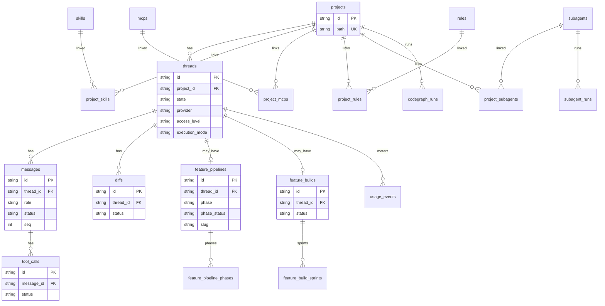

# Arquitetura — sistema legado

> Gerado pelo Architect (Reversa) em 2026-07-28  
> Nível: **essencial** · Artefatos extras (containers/components/ERD completo/matriz) omitidos neste nível  
> Ver também: `c4-context.md`, `domain.md`, `state-machines.md`, `code-analysis.md`

---

## 1. Visão geral

O sistema legado é uma **IDE desktop local-first** (Electron) que orquestra agentes de IA sobre repositórios locais: conversa (threads), tools, diffs/git, catálogo (skills/MCPs/rules/subagents/commands), memória de projeto, codegraph, feature pipeline (`/featdevelop`) e feature build (`/featbuild`).

```
┌─────────────────────────────────────────────────────────┐
│  Electron Shell (main)                                   │
│   ├─ Renderer (React/Vite)  ←app:// / HTTP+WS→           │
│   └─ Server local (Node HTTP+WS + SQLite + vault)        │
│         ├─ Runner / Providers / Git / MCP / Memory / …   │
│         └─ spawn → mcp-servers/* + CLIs dos providers    │
└─────────────────────────────────────────────────────────┘
```

**Confiança:** 🟢 CONFIRMADO

---

## 2. C4 Contexto (resumo)

Sistema no centro; dono local; providers de IA; GitHub; MCPs first-party e 3rd-party.

Diagrama completo: [`c4-context.md`](./c4-context.md).

---

## 3. Containers (texto — nível essencial)

| Container | Tecnologia | Responsabilidade | Confiança |
|-----------|------------|------------------|-----------|
| **Shell** | Electron 33 | Processo main: sobe server, janela, preload IPC (token, dialog, vault locked) | 🟢 |
| **Renderer** | React 18 + Vite + Tailwind | UI: vault gate, workspace, streaming, catálogos, consumo | 🟢 |
| **Server** | Node HTTP + WS | Domínio, rotas (~88), dispatch, SQLite, vault, PTY | 🟢 |
| **Shared** | TS types only | Contratos únicos (`@sistema-legado/shared`) | 🟢 |
| **SQLite** | better-sqlite3 | Persistência local (64 migrations) | 🟢 |
| **Vault store** | ficheiros cifrados | Chaves/tokens (não SQLite) | 🟢 |
| **MCP processes** | stdio MCP | Catálogo bundled + 3rd-party | 🟢 |
| **Provider CLIs/SDKs** | externos | Claude Agent SDK, Codex, ACP (Grok/Kimi), etc. | 🟢 |

### Comunicação

| De → Para | Canal | Confiança |
|-----------|-------|-----------|
| Renderer → Server | HTTP + WebSocket `localhost` (+ header sessão) | 🟢 |
| Shell ↔ Renderer | IPC mínimo (`window.sistemaLegado`) | 🟢 |
| Shell → Server | mesmo processo / spawn bootstrap | 🟢 |
| Server → Provider | SDK/CLI subprocess | 🟢 |
| Server → MCP | spawn + secret-wrapper / bridge loopback | 🟢 |
| Server → Git | `git` CLI + locks por projeto | 🟢 |

*(Diagramas C4 Containers/Components separados: só em doc_level completo+.)*

---

## 4. Componentes lógicos (mapa)

| Área | Onde | Papel |
|------|------|-------|
| HTTP router + middleware | `server` http/routes | vaultGuard, sessionAuth, projectScope, rate limit |
| Dispatch / runner | `runner/` | Turno, pipeline, build, subagents, validators |
| Providers | `providers/` | Drivers por provider |
| Git flow | `git/` | status, commit, PR, worktree, lease |
| Vault | `vault/` | unlock, secrets, provider keys |
| MCP catalog | `mcp/` + rotas | OAuth, vínculos projeto, vault refs |
| Memory | `memory/` | journal/memory + dreaming |
| CodeGraph | `codegraph/` | engine + tools `repo_graph_*` |
| Terminal | `terminal/` | one-shot + PTY |
| Metrics | `metrics/` | usage/pricing |
| UI workspace | `renderer` | composer, timeline, diffs, terminal dock |

---

## 5. ERD resumido (núcleo)

> Schema real tem dezenas de tabelas (migrations 001–062). Abaixo só o **núcleo conversacional + catálogo + pipeline/build**. ERD completo: nível completo+.



### Outras entidades (lista)

| Grupo | Tabelas (amostra) | Confiança |
|-------|-------------------|-----------|
| Catálogo | `skills`, `mcps`, `rules`, `subagents`, `commands` + pivôs `project_*` | 🟢 |
| Métricas | `usage_events`, `model_pricing`, snapshots de context window | 🟢 |
| Git review | `git_review_baselines` | 🟢 |
| Config | `app_config`, `data_seeds`, `quick_actions`, `log_entries` | 🟢 |
| Pipeline extra | `feature_pipeline_rounds`, concurrent/recollects | 🟢 |
| Build extra | rounds, interventions, validator audits | 🟢 |
| Codegraph | `codegraph_runs` (+ ficheiros `.codegraph/` no disco) | 🟢 |
| Fora do SQLite | vault cifrado; `docs/features/<slug>/`; `.sistema-legado/audio/`; memory md | 🟢 |

---

## 6. Integrações externas

| Integração | Como | Confiança |
|------------|------|-----------|
| Claude | `@anthropic-ai/claude-agent-sdk` | 🟢 |
| Codex | CLI `codex exec` + MCP TOML + bridge `sistema-legado` | 🟢 |
| GLM / MiniMax | drivers no server | 🟢 |
| Grok / Kimi | `@agentclientprotocol/sdk` | 🟢 |
| GitHub | git + API PR/OAuth (vault VCS) | 🟢 |
| Slack / Linear / n8n | MCP first-party | 🟢 |
| Cartesia / ElevenLabs | MCP TTS → payload áudio | 🟢 |
| MCP genéricos | spawn + secret-wrapper (token file + loopback spec) | 🟢 |

API **produzida**: HTTP+WS loopback (não é produto SaaS público). OpenAPI formal: fora do nível essencial (Writer pode gerar se aplicável).

---

## 7. Decisões / invariantes arquiteturais

| Decisão | Impacto | Confiança |
|---------|---------|-----------|
| Local-first, single-user | Sem RBAC multi-tenant | 🟢 |
| Renderer nunca toca SQLite | Todo I/O via server | 🟢 |
| Shared como fonte de contratos | Evita drift UI/server | 🟢 |
| Pipeline fases no código | Determinismo vs modelo | 🟢 |
| Artefatos pipeline no repo | DB só estado/orquestração | 🟢 |
| allocate-then-emit (seq) | Replay WS consistente | 🟢 |
| Lease por projeto | Serializa git/build/dispatch | 🟢 |

---

## 8. Dívidas técnicas (amostra)

| Item | Evidência | Confiança |
|------|-----------|-----------|
| `awaiting-review` legado na thread | domain / dispatch | 🟢 |
| `cancelled` no build read-only | `feature-build.ts` | 🟢 |
| `terminalRunning` sempre false no WorkspaceContext | code-analysis renderer | 🟢 |
| Histórico Git público raso | 3 commits | 🟢 |
| Schema SQLite grande / muitas migrations | 64 ficheiros | 🟢 |
| Rebuild nativo Electron (sqlite, node-pty) | scripts `rebuild:*` | 🟢 |

---

## 9. Spec Impact Matrix (resumo essencial)

*(Matriz completa em `traceability/` só no nível completo+.)*

| Mudança em… | Impacta tipicamente… |
|-------------|----------------------|
| `shared` contratos | server + renderer + mcp-servers |
| `dispatch` / runner | providers, WS, pipeline, build, UI timeline |
| vault | unlock, providers, MCP secrets, UI login |
| git | diffs, PR, worktree, lease |
| feature-pipeline / build | commands, docs/features, UI stepper |
| codegraph engine | tools MCP bridge, UI oferta |
| mcp-servers | catálogo, vault keys, renderer players (TTS) |

---

## Lacunas 🔴

- Topologia exata de deployment empacotado (instaladores por OS) não detalhada neste nível
- Inventário completo de ~88 rotas HTTP (Writer / nível completo)
- Diagrama de componentes Mermaid por container (nível completo+)
