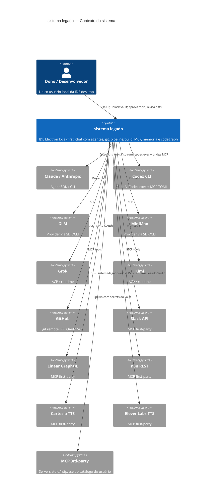

# C4 — Contexto (Nível 1)

> Gerado pelo Architect (Reversa) em 2026-07-28  
> Confiança: 🟢 CONFIRMADO (inventário + superfície)

## Diagrama

## Personas

| Persona | Relação | Confiança |
|---------|---------|-----------|
| Dono local | Único operador; unlock do cofre; AccessLevel do agente; aprovação de tools | 🟢 |

## Sistemas externos

| Sistema | Protocolo | Direção | Confiança |
|---------|-----------|---------|-----------|
| Providers (claude…kimi) | SDK / CLI / ACP + stdio MCP | sistema legado → | 🟢 |
| GitHub / VCS | git + HTTP API | sistema legado → | 🟢 |
| Slack / Linear / n8n / TTS | MCP stdio + APIs HTTP/GraphQL | sistema legado → (via MCP) | 🟢 |
| MCP 3rd-party | stdio / http / sse | sistema legado spawna | 🟢 |

## Notas

- Não há backend multi-tenant na nuvem: tudo roda no host do usuário (Electron + server loopback).
- Segredos nunca vão em argv; vault → env no spawn (secret-wrapper para MCPs).
