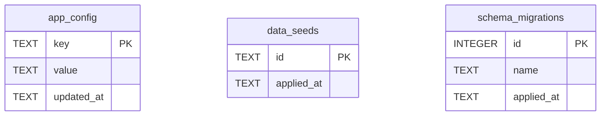
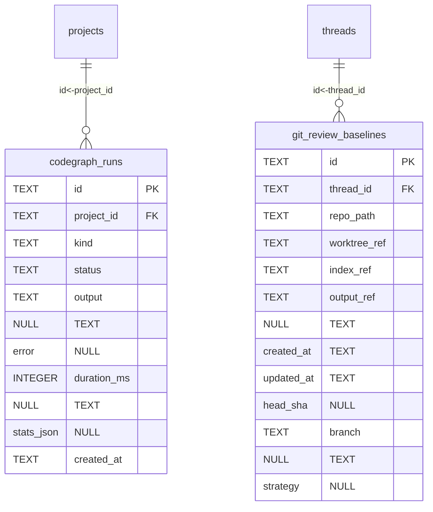

# ERD — sistema-legado.db

> Fonte: DDL live `c:\Users\Me\AppData\Roaming\@sistema-legado\shell\sistema-legado.db` (somente leitura). Confianca: 🟢
> Snapshot: 2026-07-29 | 31 tabelas | 8 triggers | 28 FKs

## Visao geral (simplificada)

```mermaid
erDiagram
  app_config {
    TEXT key PK
    TEXT value
    TEXT updated_at
  }
  codegraph_runs {
    TEXT id PK
    TEXT project_id
    TEXT kind
    TEXT status
    TEXT output
    TEXT error
    TEXT _more_ "+3 cols"
  }
  commands {
    TEXT id PK
    TEXT name
    TEXT description
    TEXT prompt_template
    TEXT skill_refs
    TEXT subagent_refs
    TEXT _more_ "+12 cols"
  }
  data_seeds {
    TEXT id PK
    TEXT applied_at
  }
  diffs {
    TEXT id PK
    TEXT thread_id
    TEXT file
    INTEGER additions
    INTEGER deletions
    TEXT hunks
    TEXT _more_ "+9 cols"
  }
  feature_build_rounds {
    TEXT build_id PK
    INTEGER sprint_index PK
    INTEGER round PK
    TEXT dev_output_json
    TEXT verification_json
    TEXT validator_json
    TEXT _more_ "+4 cols"
  }
  feature_build_sprints {
    TEXT build_id PK
    INTEGER sprint_index PK
    TEXT build_sprint_id
    TEXT status
    INTEGER round
    INTEGER det_fixes
    TEXT _more_ "+5 cols"
  }
  feature_builds {
    TEXT id PK
    TEXT project_id
    TEXT thread_id
    TEXT slug
    TEXT status
    INTEGER wave
    TEXT _more_ "+10 cols"
  }
  feature_pipeline_phases {
    TEXT pipeline_id PK
    TEXT phase PK
    TEXT status
    INTEGER rounds
    TEXT detail
    TEXT artifact_hashes_json
    TEXT _more_ "+2 cols"
  }
  feature_pipeline_rounds {
    TEXT pipeline_id PK
    TEXT phase PK
    INTEGER round PK
    TEXT collected_json
    TEXT artifact_hashes_json
    TEXT decision_json
    TEXT _more_ "+5 cols"
  }
  feature_pipelines {
    TEXT id PK
    TEXT project_id
    TEXT thread_id
    TEXT slug
    TEXT title
    TEXT phase
    TEXT _more_ "+6 cols"
  }
  git_review_baselines {
    TEXT id PK
    TEXT thread_id
    TEXT repo_path
    TEXT worktree_ref
    TEXT index_ref
    TEXT output_ref
    TEXT _more_ "+5 cols"
  }
  log_entries {
    TEXT id PK
    TEXT thread_id
    TEXT kind
    TEXT event
    TEXT timestamp
  }
  mcps {
    TEXT id PK
    TEXT name
    TEXT description
    TEXT transport
    TEXT command
    TEXT args_json
    TEXT _more_ "+11 cols"
  }
  messages {
    TEXT id PK
    TEXT thread_id
    TEXT role
    TEXT content
    INTEGER seq
    TEXT created_at
    TEXT _more_ "+3 cols"
  }
  model_pricing {
    TEXT id PK
    TEXT provider
    TEXT model
    REAL input_per_mtok
    REAL output_per_mtok
    REAL cache_read_per_mtok
    TEXT _more_ "+5 cols"
  }
  project_mcps {
    TEXT project_id PK
    TEXT mcp_id PK
    INTEGER enabled
    INTEGER sort_order
    TEXT created_at
  }
  project_rules {
    TEXT project_id PK
    TEXT rule_id PK
    INTEGER enabled
    INTEGER sort_order
    TEXT created_at
  }
  project_skills {
    TEXT project_id PK
    TEXT skill_id PK
    INTEGER enabled
    INTEGER sort_order
    TEXT created_at
  }
  project_subagents {
    TEXT project_id PK
    TEXT subagent_id PK
    INTEGER enabled
    INTEGER sort_order
    TEXT created_at
  }
  projects {
    TEXT id PK
    TEXT name
    TEXT path
    TEXT created_at
    TEXT updated_at
    TEXT codegraph_status
    TEXT _more_ "+4 cols"
  }
  quick_actions {
    TEXT id PK
    TEXT project_id
    TEXT label
    TEXT command
    TEXT keybinding
    TEXT created_at
  }
  rules {
    TEXT id PK
    TEXT name
    TEXT description
    TEXT content
    TEXT category
    INTEGER is_global
    TEXT _more_ "+3 cols"
  }
  schema_migrations {
    INTEGER id PK
    TEXT name
    TEXT applied_at
  }
  skills {
    TEXT id PK
    TEXT name
    TEXT description
    TEXT content
    TEXT category
    INTEGER enabled
    TEXT _more_ "+4 cols"
  }
  subagent_runs {
    TEXT child_thread_id PK
    TEXT parent_thread_id
    TEXT parent_tool_call_id
    INTEGER anchor_seq
    TEXT subagent_name
    TEXT provider
    TEXT _more_ "+15 cols"
  }
  subagents {
    TEXT id PK
    TEXT name
    TEXT description
    TEXT prompt
    TEXT provider
    TEXT model
    TEXT _more_ "+11 cols"
  }
  thread_context_window_snapshots {
    TEXT thread_id PK
    INTEGER used_tokens
    INTEGER max_tokens
    INTEGER total_processed_tokens
    INTEGER input_tokens
    INTEGER output_tokens
    TEXT _more_ "+5 cols"
  }
  threads {
    TEXT id PK
    TEXT project_id
    TEXT title
    TEXT provider
    TEXT state
    TEXT reasoning_level
    TEXT _more_ "+17 cols"
  }
  tool_calls {
    TEXT id PK
    TEXT thread_id
    TEXT message_id
    TEXT tool_name
    TEXT params
    TEXT result
    TEXT _more_ "+3 cols"
  }
  usage_events {
    INTEGER order_id PK
    TEXT id
    TEXT turn_id
    TEXT project_id
    TEXT thread_id
    TEXT source
    TEXT _more_ "+20 cols"
  }
  projects ||--o{ codegraph_runs : "id<-project_id"
  threads ||--o{ diffs : "id<-thread_id"
  feature_builds ||--o{ feature_build_rounds : "id<-build_id"
  feature_builds ||--o{ feature_build_sprints : "id<-build_id"
  threads ||--o{ feature_builds : "id<-thread_id"
  projects ||--o{ feature_builds : "id<-project_id"
  feature_pipelines ||--o{ feature_pipeline_phases : "id<-pipeline_id"
  feature_pipelines ||--o{ feature_pipeline_rounds : "id<-pipeline_id"
  threads ||--o{ feature_pipelines : "id<-thread_id"
  projects ||--o{ feature_pipelines : "id<-project_id"
  threads ||--o{ git_review_baselines : "id<-thread_id"
  threads ||--o{ log_entries : "id<-thread_id"
  threads ||--o{ messages : "id<-thread_id"
  mcps ||--o{ project_mcps : "id<-mcp_id"
  projects ||--o{ project_mcps : "id<-project_id"
  rules ||--o{ project_rules : "id<-rule_id"
  projects ||--o{ project_rules : "id<-project_id"
  skills ||--o{ project_skills : "id<-skill_id"
  projects ||--o{ project_skills : "id<-project_id"
  subagents ||--o{ project_subagents : "id<-subagent_id"
  projects ||--o{ project_subagents : "id<-project_id"
  projects ||--o{ quick_actions : "id<-project_id"
  threads ||--o{ subagent_runs : "id<-parent_thread_id"
  threads ||--o{ thread_context_window_snapshots : "id<-thread_id"
  projects ||--o{ threads : "id<-project_id"
  messages ||--o{ tool_calls : "id<-message_id"
  threads ||--o{ tool_calls : "id<-thread_id"
  projects ||--o{ usage_events : "id<-project_id"
```



## ERDs por dominio

### Agents & tools catalog

```mermaid
erDiagram
  commands {
    TEXT id PK
    TEXT name
    TEXT description
    TEXT prompt_template
    TEXT skill_refs NULL
    TEXT subagent_refs NULL
    TEXT params NULL
    TEXT provider NULL
    TEXT model NULL
    TEXT reasoning_level NULL
    TEXT access_level NULL
    TEXT mode_chat_plan NULL
    TEXT execution_strategy
    TEXT category NULL
    INTEGER enabled
    TEXT created_at
    TEXT updated_at
    TEXT plan_json NULL
  }
  mcps {
    TEXT id PK
    TEXT name
    TEXT description NULL
    TEXT transport
    TEXT command NULL
    TEXT args_json NULL
    TEXT env_json NULL
    TEXT url NULL
    TEXT headers_json NULL
    TEXT category NULL
    INTEGER enabled
    TEXT created_at
    TEXT updated_at
    TEXT preset_id NULL
    TEXT auth_mode
    TEXT oauth_status NULL
    TEXT oauth_client_json NULL
  }
  project_mcps {
    TEXT project_id PK,FK
    TEXT mcp_id PK,FK
    INTEGER enabled
    INTEGER sort_order
    TEXT created_at
  }
  project_rules {
    TEXT project_id PK,FK
    TEXT rule_id PK,FK
    INTEGER enabled
    INTEGER sort_order
    TEXT created_at
  }
  project_skills {
    TEXT project_id PK,FK
    TEXT skill_id PK,FK
    INTEGER enabled
    INTEGER sort_order
    TEXT created_at
  }
  project_subagents {
    TEXT project_id PK,FK
    TEXT subagent_id PK,FK
    INTEGER enabled
    INTEGER sort_order
    TEXT created_at
  }
  quick_actions {
    TEXT id PK
    TEXT project_id FK
    TEXT label
    TEXT command
    TEXT keybinding NULL
    TEXT created_at
  }
  rules {
    TEXT id PK
    TEXT name
    TEXT description NULL
    TEXT content
    TEXT category NULL
    INTEGER is_global
    INTEGER enabled
    TEXT created_at
    TEXT updated_at
  }
  skills {
    TEXT id PK
    TEXT name
    TEXT description
    TEXT content
    TEXT category NULL
    INTEGER enabled
    TEXT created_at
    TEXT updated_at
    TEXT trigger
    INTEGER locked
  }
  subagent_runs {
    TEXT child_thread_id PK
    TEXT parent_thread_id FK
    TEXT parent_tool_call_id NULL
    INTEGER anchor_seq
    TEXT subagent_name
    TEXT provider
    TEXT model NULL
    TEXT status
    TEXT text NULL
    TEXT usage_json NULL
    TEXT created_at
    TEXT reasoning_level NULL
    INTEGER duration_ms NULL
    TEXT isolation NULL
    TEXT stage_id NULL
    TEXT apply_status NULL
    TEXT patch_files NULL
    TEXT patch_ref NULL
    TEXT retry_of NULL
    TEXT actions_json NULL
    INTEGER action_count
  }
  subagents {
    TEXT id PK
    TEXT name
    TEXT description
    TEXT prompt
    TEXT provider
    TEXT model NULL
    TEXT reasoning_level NULL
    TEXT tools_json NULL
    TEXT category NULL
    INTEGER enabled
    TEXT created_at
    TEXT updated_at
    TEXT skills_json NULL
    TEXT mcps_json NULL
    INTEGER network_access
    INTEGER idle_timeout_minutes NULL
    TEXT kind
  }
  mcps ||--o{ project_mcps : "id<-mcp_id"
  projects ||--o{ project_mcps : "id<-project_id"
  rules ||--o{ project_rules : "id<-rule_id"
  projects ||--o{ project_rules : "id<-project_id"
  skills ||--o{ project_skills : "id<-skill_id"
  projects ||--o{ project_skills : "id<-project_id"
  subagents ||--o{ project_subagents : "id<-subagent_id"
  projects ||--o{ project_subagents : "id<-project_id"
  projects ||--o{ quick_actions : "id<-project_id"
  threads ||--o{ subagent_runs : "id<-parent_thread_id"
```

### App & meta



### Core / workspace

```mermaid
erDiagram
  diffs {
    TEXT id PK
    TEXT thread_id FK
    TEXT file
    INTEGER additions
    INTEGER deletions
    TEXT hunks
    TEXT provider
    TEXT status
    TEXT worktree_path NULL
    TEXT created_at
    TEXT review_cycle_id NULL
    TEXT snapshot_ref NULL
    TEXT review_head NULL
    TEXT review_branch NULL
    TEXT strategy NULL
  }
  log_entries {
    TEXT id PK
    TEXT thread_id FK
    TEXT kind
    TEXT event
    TEXT timestamp
  }
  messages {
    TEXT id PK
    TEXT thread_id FK
    TEXT role
    TEXT content
    INTEGER seq
    TEXT created_at
    TEXT status
    TEXT images_json NULL
    TEXT synthetic NULL
  }
  projects {
    TEXT id PK
    TEXT name
    TEXT path
    TEXT created_at
    TEXT updated_at
    TEXT codegraph_status
    TEXT codegraph_indexed_commit NULL
    TEXT codegraph_last_indexed_at NULL
    TEXT codegraph_stats_json NULL
    INTEGER codegraph_offer_suppressed
  }
  threads {
    TEXT id PK
    TEXT project_id FK
    TEXT title
    TEXT provider
    TEXT state
    TEXT reasoning_level NULL
    TEXT mode_chat_plan NULL
    TEXT mode_full_supervised NULL
    TEXT access_level NULL
    INTEGER fast_mode NULL
    TEXT system_prompt NULL
    TEXT branch NULL
    TEXT pr_url NULL
    TEXT error_message NULL
    TEXT model NULL
    TEXT session_id NULL
    TEXT created_at
    TEXT updated_at
    INTEGER context_window NULL
    TEXT execution_mode
    TEXT worktree_path NULL
    TEXT session_cwd NULL
    TEXT command_name NULL
  }
  tool_calls {
    TEXT id PK
    TEXT thread_id FK
    TEXT message_id FK,NULL
    TEXT tool_name
    TEXT params NULL
    TEXT result NULL
    INTEGER seq
    TEXT created_at
    TEXT status
  }
  threads ||--o{ diffs : "id<-thread_id"
  threads ||--o{ log_entries : "id<-thread_id"
  threads ||--o{ messages : "id<-thread_id"
  projects ||--o{ threads : "id<-project_id"
  messages ||--o{ tool_calls : "id<-message_id"
  threads ||--o{ tool_calls : "id<-thread_id"
```

### Feature pipeline & build

```mermaid
erDiagram
  feature_build_rounds {
    TEXT build_id PK,FK
    INTEGER sprint_index PK
    INTEGER round PK
    TEXT dev_output_json NULL
    TEXT verification_json NULL
    TEXT validator_json NULL
    TEXT status
    TEXT created_at
    TEXT updated_at
    TEXT run_refs_json
  }
  feature_build_sprints {
    TEXT build_id PK,FK
    INTEGER sprint_index PK
    TEXT build_sprint_id
    TEXT status
    INTEGER round
    INTEGER det_fixes
    TEXT checkpoint NULL
    TEXT quality
    TEXT state_json NULL
    TEXT started_at NULL
    TEXT finished_at NULL
  }
  feature_builds {
    TEXT id PK
    TEXT project_id FK
    TEXT thread_id FK
    TEXT slug
    TEXT status
    INTEGER wave
    TEXT quality
    TEXT review_status
    TEXT reviewed_at NULL
    TEXT commands_hash NULL
    TEXT error_detail NULL
    TEXT created_at
    TEXT updated_at
    INTEGER intervention_attempts
    TEXT error_fact NULL
    TEXT authorized_artifacts NULL
  }
  feature_pipeline_phases {
    TEXT pipeline_id PK,FK
    TEXT phase PK
    TEXT status
    INTEGER rounds
    TEXT detail NULL
    TEXT artifact_hashes_json NULL
    TEXT started_at NULL
    TEXT finished_at NULL
  }
  feature_pipeline_rounds {
    TEXT pipeline_id PK,FK
    TEXT phase PK
    INTEGER round PK
    TEXT collected_json
    TEXT artifact_hashes_json
    TEXT decision_json NULL
    TEXT fix_report_json NULL
    TEXT status
    TEXT created_at
    TEXT updated_at
    INTEGER recollects
  }
  feature_pipelines {
    TEXT id PK
    TEXT project_id FK
    TEXT thread_id FK
    TEXT slug
    TEXT title
    TEXT phase
    TEXT phase_status
    TEXT pending_resume NULL
    TEXT quality
    TEXT error_detail NULL
    TEXT created_at
    TEXT updated_at
  }
  feature_builds ||--o{ feature_build_rounds : "id<-build_id"
  feature_builds ||--o{ feature_build_sprints : "id<-build_id"
  threads ||--o{ feature_builds : "id<-thread_id"
  projects ||--o{ feature_builds : "id<-project_id"
  feature_pipelines ||--o{ feature_pipeline_phases : "id<-pipeline_id"
  feature_pipelines ||--o{ feature_pipeline_rounds : "id<-pipeline_id"
  threads ||--o{ feature_pipelines : "id<-thread_id"
  projects ||--o{ feature_pipelines : "id<-project_id"
```

### Git & codegraph



### Models & usage

```mermaid
erDiagram
  model_pricing {
    TEXT id PK
    TEXT provider
    TEXT model
    REAL input_per_mtok
    REAL output_per_mtok
    REAL cache_read_per_mtok NULL
    REAL cache_write_per_mtok NULL
    INTEGER approximate
    TEXT source NULL
    TEXT created_at
    TEXT updated_at
  }
  thread_context_window_snapshots {
    TEXT thread_id PK,FK
    INTEGER used_tokens
    INTEGER max_tokens NULL
    INTEGER total_processed_tokens NULL
    INTEGER input_tokens NULL
    INTEGER output_tokens NULL
    INTEGER cache_read_tokens NULL
    INTEGER compacts_automatically NULL
    INTEGER compacted
    TEXT updated_at
    INTEGER revision
  }
  usage_events {
    INTEGER order_id PK
    TEXT id
    TEXT turn_id
    TEXT project_id FK
    TEXT thread_id
    TEXT source
    TEXT child_thread_id NULL
    TEXT subagent_name NULL
    TEXT parent_tool_call_id NULL
    TEXT provider
    TEXT model
    TEXT billing_mode
    TEXT reasoning_level NULL
    INTEGER fast_mode NULL
    INTEGER context_window NULL
    INTEGER input_tokens
    INTEGER cache_read_tokens NULL
    INTEGER cache_creation_tokens NULL
    INTEGER output_tokens
    INTEGER total_tokens
    REAL cost_usd NULL
    TEXT cost_source
    INTEGER cost_approximate
    TEXT created_at
    INTEGER reasoning_tokens NULL
    TEXT repo_graph_calls NULL
  }
  threads ||--o{ thread_context_window_snapshots : "id<-thread_id"
  projects ||--o{ usage_events : "id<-project_id"
```
