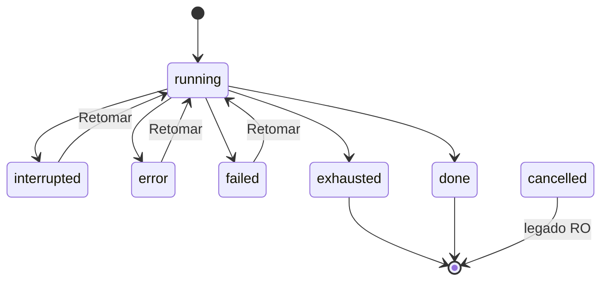
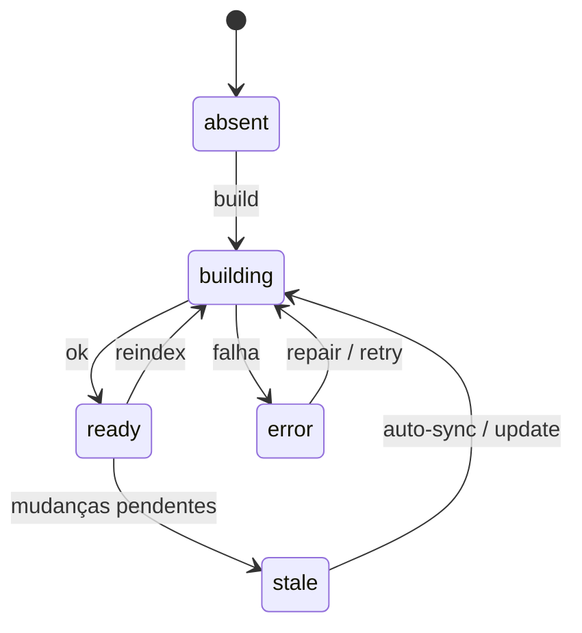

# Máquinas de estado — sistema legado

> Gerado pelo Detective (Reversa) em 2026-07-28  
> Nível: **essencial** (entidades centrais com múltiplos status)  
> Confiança: 🟢 contratos em `shared/` · 🟡 detalhes de transição no runner

---

## 1. Thread (`ThreadState`)

Fonte: `shared/src/thread.ts` · persistência `threads.state` · runtime em `dispatch.ts` / rotas git-PR.

| Estado | Significado | Confiança |
|--------|-------------|-----------|
| `idle` | Pronta / turno encerrado | 🟢 |
| `running` | Dispatch em andamento | 🟢 |
| `awaiting-review` | Legado; review de diff **não** bloqueia o retorno a `idle` | 🟢 |
| `committed` | Diffs aceitos (accept-diff) | 🟢 |
| `pr-open` | PR aberto | 🟢 |
| `pr-merged` | PR merged | 🟡 transição runtime pouco evidenciada |
| `pr-closed` | PR fechado | 🟡 idem |
| `error` | Falha / erro de scheduler | 🟢 |

```mermaid
stateDiagram-v2
  [*] --> idle
  idle --> running: dispatch start
  running --> idle: sucesso / cancel
  running --> error: falha
  error --> running: novo dispatch
  idle --> committed: accept-diff
  committed --> pr-open: open-pr
  pr-open --> pr-merged: merge (🟡)
  pr-open --> pr-closed: close (🟡)
  note right of awaiting-review
    Estado no enum/CHECK;
    fim de turno não depende dele
  end note
```

**Regras:** lease por projeto (`409 thread_busy`); git mutável bloqueado em `running`.

---

## 2. Feature Pipeline (global + fases)

Fonte: `shared/src/feature-pipeline.ts` · motor/reducer no runner · migration 047.

### 2.1 Status global (`FeaturePipelineStatus`)

| Status | Papel |
|--------|--------|
| `running` | Ativo |
| `awaiting-approval` | Gate humano / aprovação |
| `interrupted` | Pausado; retomável |
| `error` | Erro operacional |
| `done` | Terminal |
| `cancelled` | Terminal |

Ativos (índices parciais): `running | awaiting-approval | interrupted | error` — **≤1 por thread e por projeto**.

```mermaid
stateDiagram-v2
  [*] --> running: /featdevelop start
  running --> awaiting-approval: gate
  awaiting-approval --> running: approve / resume
  running --> interrupted: interrupt
  interrupted --> running: resume
  running --> error: falha
  error --> running: resume (se aplicável)
  running --> done: finalize
  awaiting-approval --> cancelled: cancel
  running --> cancelled: cancel
  interrupted --> cancelled: cancel
  error --> cancelled: cancel
  done --> [*]
  cancelled --> [*]
```

### 2.2 Fases (ordem fixa no código)

`prd → prd-gate → tech → spec → spec-validation → sprints → sprint-validation`

Status por fase: `pending | running | done | error | interrupted`.

Transições de fase/status global são **atômicas** via `TransitionTarget` + `FeaturePipelinesRepository.transition` (persistir → emitir WS).

Artefatos: `docs/features/<slug>/` (repo), não DB.

---

## 3. Feature Build (global + sprint)

Fonte: `shared/src/feature-build.ts` · matriz normativa `FEATURE_BUILD_STATUS_TRANSITIONS`.

### 3.1 Status global

| De | Para (legais) |
|----|----------------|
| `running` | `interrupted`, `error`, `failed`, `exhausted`, `done` |
| `interrupted` / `error` / `failed` | `running` (Retomar) |
| `exhausted` / `done` / `cancelled` | ∅ (terminais) |

`failed` = ≥1 sprint failed/blocked (funcional) · `error` = falha operacional do motor · `cancelled` = legado read-only.



### 3.2 Sprint (`SprintItemStatus`)

| De | Para |
|----|------|
| `pending` | `in-progress` |
| `in-progress` | `done`, `failed`, `aborted` |
| `failed` / `aborted` | `in-progress` (Retomar) |
| `done` | ∅ (não regride) |

Review final: `pending | accepted | rejected` (reject restaura código ao baseline; metadados de build fora da restauração).

---

## 4. CodeGraph (efetivo)

Fonte: `shared/src/codegraph.ts` · engine server-side.

| Status | Significado |
|--------|-------------|
| `absent` | Sem graph |
| `building` | Job em curso |
| `ready` | Usável |
| `stale` | Desatualizado (auto-sync possível) |
| `error` | Falha |

Runs: `running | done | error | cancelled` · kinds: `build | reindex | update | repair`.  
**Invariante:** graph não se remove (`repair` no lugar de uninit).



---

## 5. Diff / Message / ToolCall (resumo)

| Entidade | Estados | Nota |
|----------|---------|------|
| Diff | `pending → accepted \| rejected` | accept pode levar thread a `committed` |
| Message | `complete \| interrompido` | persistência |
| ToolCall | `done \| interrompido` | status explícito na UI |

---

## 6. MCP OAuth (conexão)

`disconnected | pending | connected | needs-reauth | needs-client-id`  
(`pending` tipicamente in-memory.)

---

## Lacunas 🔴

- Gatilhos exatos `pr-merged` / `pr-closed` no runtime
- Diagrama fino de gates adversarial do pipeline (partição `PipelineDecision`) — ver reducer; aqui só o envelope de status
