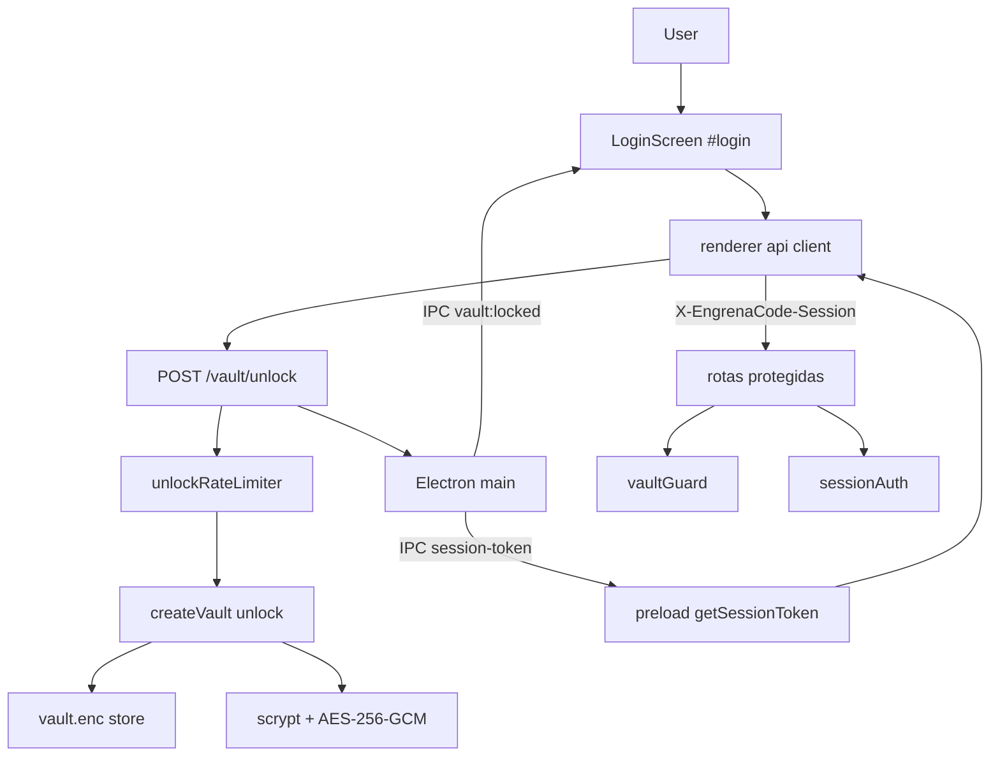

# Spec: Vault e Sessão Local

**Complexidade:** médio  
**Fonte PRD:** `docs/prd-engrenacode.md` → F01  
**Modo:** spec alvo EngrenaCode (contratos `engrenacode`, copy PRD); o código legado ainda usa nomes antigos — o plan de convergência cobre a renomeação

## Assumptions / Decisions

| Decisão | Origem | Escolha |
|---------|--------|---------|
| Paths/IPC/header internos | Entrevista R1 | Renomear para `engrenacode:vault:*`, `X-EngrenaCode-Session`; manter `vault.enc` |
| Forma da spec | Entrevista R2 | Spec alvo EngrenaCode; plan = migração desde legado + aceitação |
| Copy UI F01 | Entrevista R3 | 100% EngrenaCode + mensagens PRD (pt-BR acentuado) |
| Rate limit global | Entrevista R4 | Documentar junto ao backoff por workspace |
| Crypto / KDF | Codebase | scrypt + AES-256-GCM (sem mudança) |

---

## 1. Visão Geral Técnica

**O quê:** Gate local de desbloqueio do cofre cifrado (`vault.enc`), emissão de token de sessão via IPC Electron, e middleware que bloqueia rotas HTTP/WS protegidas enquanto o cofre estiver travado. Primeiro unlock de um workspace inicializa o cofre com a senha informada.

**Por quê:** Credenciais de providers e tokens VCS não podem viver em claro no SQLite; o app é single-user loopback e precisa de um gate antes de qualquer superfície de produto (config, workspace, catálogo).

**Escopo — Incluído:**

- Derivação de chave (scrypt), cifra AES-256-GCM, persistência `vault.enc`
- `POST /vault/unlock` (público), backoff por workspace, rate limit global
- `vaultGuard` + `sessionAuth` (`X-EngrenaCode-Session`)
- IPC shell ↔ renderer (`engrenacode:vault:session-token`, `engrenacode:vault:locked`)
- UI `#login` (LoginScreen) com copy EngrenaCode alinhada ao PRD
- Contratos de saída: armazenamento cifrado disponível para F02, F09, F10

**Escopo — Excluído:**

- Renomeação de diretórios/pacotes do monorepo (`packages/...` permanecem)
- Recuperação de senha, multi-usuário, sync remoto
- Superfícies de Config, Workspace, MCPs (features posteriores)
- Varredura de strings de branding legado fora do gate F01

---

## 2. Impacto na Arquitetura



**Componentes afetados:**

| Camada | Caminho |
|--------|---------|
| Crypto | `packages/server/src/vault/crypto.ts` |
| Store | `packages/server/src/vault/store.ts` |
| Vault API | `packages/server/src/vault/vault.ts`, `index.ts` |
| Route | `packages/server/src/routes/vault-unlock.ts` |
| Rate limit | `packages/server/src/http/rate-limiter.ts`, `config.ts` |
| Middleware | `packages/server/src/middleware/vault-guard.ts`, `session-auth.ts` |
| Errors | `packages/server/src/errors.ts` |
| Shared DTO | `shared/src/vault.ts` |
| Shell IPC | `packages/shell/src/main.ts`, `preload.ts` |
| UI | `packages/renderer/src/screens/LoginScreen.tsx`, `App.tsx`, router |

---

## 3. Decisões Técnicas

| Decisão | Abordagem Escolhida | Alternativa Considerada | Trade-off |
|---------|---------------------|-------------------------|-----------|
| Identidade de contratos internos | Renomear para `engrenacode` em IPC/header | Manter nomes legado em IPC/header/arquivo | Branding interno alinhado ao produto EngrenaCode vs esforço de renomeação e atualização de testes/cofres existentes |
| Forma da documentação | Spec alvo EngrenaCode + plan de migração desde legado | Spec delta-only | Onboarding mais longo na escrita; contrato único para ondas seguintes |
| Anti-abuso | Backoff workspace (5→60s) + rate limit global (10/60s) | Só backoff do PRD | Spec espelha código; UI unifica mensagem |
| Copy | Mensagens PRD EngrenaCode | Manter branding legado / sem acento | Diff só em strings; critérios de aceitação testáveis |

---

## 4. Visão Geral de Componentes

### Backend

| Caminho do Arquivo | Novo/Modificado | Propósito | Responsabilidades-Chave |
|--------------------|----------------|-----------|-------------------------|
| `packages/server/src/vault/crypto.ts` | Existente | KDF + cifra | scrypt (N=2^15,r=8,p=1,keylen=32); AES-256-GCM; salt 16B; IV 12B |
| `packages/server/src/vault/store.ts` | Existente | Persistência | Ler/gravar envelope `vault.enc` sob userData |
| `packages/server/src/vault/vault.ts` | Existente | Estado runtime | unlock/init, isUnlocked, session token 32B, lock, secrets |
| `packages/server/src/routes/vault-unlock.ts` | Existente | Endpoint público | Validar body; rate limit; chamar vault.unlock |
| `packages/server/src/middleware/vault-guard.ts` | Existente | Gate HTTP | 423 `vault_locked` se não public e travado |
| `packages/server/src/middleware/session-auth.ts` | Existente | Sessão | Verificar `X-EngrenaCode-Session` pós-unlock |
| `packages/server/src/http/rate-limiter.ts` | Existente | Anti-abuso global | Janela 60s / 10 tentativas (default) |
| `shared/src/vault.ts` | Existente | Contratos | `VaultUnlockRequest` / `VaultUnlockResponse` |

### Frontend / Shell

| Caminho do Arquivo | Novo/Modificado | Propósito | Responsabilidades-Chave |
|--------------------|----------------|-----------|-------------------------|
| `packages/renderer/src/screens/LoginScreen.tsx` | Modificado (copy) | Gate `#login` | Workspace+senha; backoff UI; mensagens PRD EngrenaCode |
| `packages/renderer/src/App.tsx` | Existente | Bootstrap | Pós-unlock: obter token IPC; setar cliente HTTP |
| `packages/shell/src/preload.ts` | Existente | Bridge | `getSessionToken`, `onVaultLocked` |
| `packages/shell/src/main.ts` | Modificado (branding) | IPC | Canais `engrenacode:vault:*`; título app EngrenaCode |

### Banco de Dados

Sem migração SQLite para F01. Segredos **não** entram no `engrenacode.db`.

| Arquivo | Tabelas | Operação | Notas |
|---------|---------|----------|-------|
| — | — | — | Cofre é arquivo cifrado, não tabela |

---

## 5. Contratos de API

### Endpoint: Desbloquear cofre

- **Método:** POST  
- **Caminho:** `/vault/unlock`  
- **Autenticação:** pública (`public: true`); sem sessão  
- **Surface:** único endpoint liberado com cofre travado (além de health/public se existirem)

**Requisição:**

| Campo | Tipo | Obrigatório | Validação | Descrição |
|-------|------|-------------|-----------|-----------|
| `workspace` | `string` | Sim | trim não vazio | Identificador local do workspace |
| `password` | `string` | Sim | não vazio | Senha do cofre; só runtime |

**Exemplo de Requisição:**

```json
{
  "workspace": "~/dev",
  "password": "********"
}
```

**Resposta (Sucesso - 200):**

| Campo | Tipo | Descrição |
|-------|------|-----------|
| `unlocked` | `boolean` | `true` se desbloqueou ou inicializou |
| `retryAfterMs` | `number` | Opcional; presente em falha com backoff ativo |

**Exemplo de Resposta (sucesso):**

```json
{
  "unlocked": true
}
```

**Exemplo de Resposta (senha inválida / anti-enumeração):**

```json
{
  "unlocked": false,
  "retryAfterMs": 1000
}
```

**Códigos de Erro:**

| Código | Status HTTP | Descrição |
|--------|-------------|-----------|
| `validation_error` (ou equivalente do server) | 400 | `workspace`/`password` ausentes ou vazios |
| `rate_limited` | 429 | Rate limit global (10 / 60s); `details.retryAfterMs` |
| `vault_corrupted` | 422 | Envelope ilegível/danificado |
| *(body 200 unlocked:false)* | 200 | Senha incorreta — sem distinguir existência do workspace |

### Comportamento pós-unlock (não-HTTP)

1. Shell obtém token de sessão (32 bytes hex) e entrega via IPC ao renderer.  
2. Renderer anexa `X-EngrenaCode-Session` em todas as chamadas protegidas.  
3. Lock do cofre emite `engrenacode:vault:locked`; renderer volta a `#login`.

### Rotas protegidas (contrato negativo)

Qualquer rota não-`public` com cofre travado:

```json
{
  "error": {
    "code": "vault_locked",
    "message": "Cofre local travado. Desbloqueie antes de continuar."
  }
}
```

Status: **423**.

Sessão inválida/ausente: **401** (código de sessão do middleware existente).

---

## 6. Modelo de Dados

F01 não cria tabelas SQLite. Modelo do **envelope em disco**:

### Artefato: `vault.enc` (userData do app)

| Campo lógico | Tipo | Nullable | Descrição |
|--------------|------|----------|-----------|
| `salt` | bytes (16) | Não | Salt do scrypt |
| `kdf` | objeto | Não | `{ algo: "scrypt", N, r, p, keylen }` |
| `iv` | bytes (12) | Não | Nonce AES-GCM |
| `ciphertext` + `authTag` | bytes | Não | Payload cifrado (provider keys, VCS tokens, etc.) |
| `workspace` (metadata envelope) | string | — | Associado ao unlock |

**Payload em claro (só em memória após unlock):** inclui `ProviderKeys`, tokens VCS, secrets MCP/OAuth, modo Claude auth, etc. (consumidores F02/F09/F10). Spec F01 exige: **nada disso em claro no SQLite**.

**Índices / Constraints:** N/A (arquivo único por instalação/userData).

**Parâmetros de segurança (congelados nesta spec):**

| Parâmetro | Valor |
|-----------|-------|
| KDF | scrypt N=32768, r=8, p=1, keylen=32 |
| Cipher | aes-256-gcm |
| Backoff workspace | threshold 5, baseMs 1000, maxMs 60000 |
| Rate limit global | maxAttempts 10, windowMs 60000 |
| Session token | 32 bytes aleatórios |

---

## 7. Estratégia de Testes

### Estrutura de Arquivo de Teste

| Arquivo de Teste | Tipo | Alvo | Objetivo |
|------------------|------|------|----------|
| `packages/server/test/vault*.test.ts` (ou equivalente existente) | Integração | unlock, backoff, corrupt | 90% fluxos vault |
| `packages/server/test/*.test.ts` (middleware) | Integração | vault_locked / session | 80% gates |
| `packages/renderer/src/screens/LoginScreen*.test.tsx` ou `*.logic` | Unitário | copy + backoff UI | Mensagens PRD |
| Aceitação manual / Playwright hermetic | E2E | `#login` | Critérios PRD §9 F01 |

### Funções / cenários de aceite (PRD §9 F01)

| Função / cenário | Descrição | Assertions |
|------------------|-----------|------------|
| `test_first_unlock_creates_vault` | Primeiro uso com workspace+senha | `unlocked:true`; `vault.enc` criado |
| `test_subsequent_unlock_requires_password` | Reabertura | Senha correta desbloqueia; errada → `unlocked:false` |
| `test_invalid_credentials_generic_message` | UI | Texto “Workspace ou senha inválidos.”; sem vazar qual campo |
| `test_backoff_after_five_failures` | 5+ falhas | Botão bloqueado; “Muitas tentativas. Tente novamente em Xs.”; teto 60s |
| `test_global_rate_limit` | 10 tentativas / 60s | 429 `rate_limited`; UI mesma família de mensagem |
| `test_vault_locked_blocks_protected` | Cofre travado | 423 `vault_locked` em rota protegida; UI volta ao gate |
| `test_corrupted_vault_message` | Envelope inválido | 422 + “O cofre local está danificado ou ilegível…” |
| `test_network_down_message` | Server offline | “Não foi possível contatar o servidor local. Verifique se o EngrenaCode está em execução.” |
| `test_session_via_ipc_only` | Pós-unlock | Token não viaja em query string; header `X-EngrenaCode-Session` |

### Integração Cross-Feature (PRD §9)

| Teste | Descrição |
|-------|-----------|
| `test_vault_store_ready_for_config` | Após unlock, F02 consegue gravar/ler segredos no vault sem plaintext no DB |
| `test_locked_vault_blocks_downstream` | Com cofre travado, superfícies que dependem de F01 (config/workspace) não operam |

### Copy checklist (convergência EngrenaCode)

| String PRD | Superfície |
|------------|------------|
| Workspace ou senha inválidos. | LoginScreen erro genérico |
| O cofre local está danificado ou ilegível. Restaure um backup ou recrie o workspace. | LoginScreen corrupted |
| Muitas tentativas. Tente novamente em Xs. | Backoff / rate limit |
| Não foi possível contatar o servidor local. Verifique se o EngrenaCode está em execução. | Network |
| Copy 100% EngrenaCode (sem referências a branding legado) | LoginScreen + shell gate |
