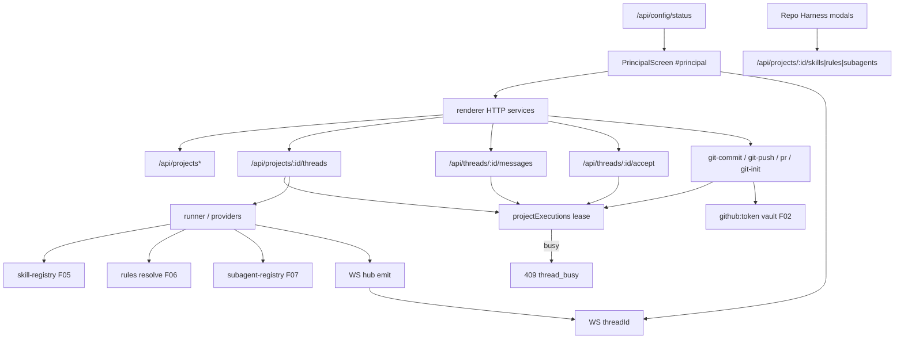

# Spec: Workspace (`#principal`)

**Feature:** F03 Workspace  
**Complexidade:** complexo  
**Escopo:** Escopo Central apenas (Adições ao Escopo Completo adiadas)  
**Fonte PRD:** `docs/PRD.md` → F03  
**UI:** [`ui.md`](./ui.md) · Copy: [`copy.md`](./copy.md) · Ref: [`ui/principal-referencia.png`](./ui/principal-referencia.png)  
**Última atualização:** 2026-08-04 (regenerada via spec-writer)

---

## 1. Visão Geral Técnica

**O quê:** Workspace `#principal` do EngrenaCode: cadastrar pastas locais como projetos, criar threads (Claude \| Codex \| Kimi + access + execution), streamar turnos via WebSocket no loopback, persistir histórico/diffs em SQLite, revisar diffs **por arquivo** (subset de `ids`), commit/push/PR no GitHub com lease, e integrar Skills/Rules/SubAgents reais no turno e no Repo Harness.

**Por quê:** Único lugar onde o usuário pede, revisa e promove mudanças; F01/F02 desbloqueiam cofre e providers; F05–F07 alimentam o harness do turno.

**Fonte de verdade UX/copy:** anatomia, tokens, estados e aceite visual em [`ui.md`](./ui.md); strings literais por id em [`copy.md`](./copy.md). Esta spec não recopiá-los.

**Escopo — Incluído (Central):**

- UI 3 colunas + overlays conforme [`ui.md`](./ui.md)
- Projetos locais; `git init` opcional (`POST /api/projects` sem exigir `.git`; gate no composer / `git-init`)
- Threads: provider/modelo/access/execution; execution travado após 1º envio; provider imutável após criar
- Dispatch + follow-up + fila local quando `running`; cancel; PermissionPrompt (Supervised)
- Streaming WS por `threadId` no mesmo server `127.0.0.1:5174`
- Diffs `pending` \| `accepted` \| `rejected` por arquivo; accept/reject por subset de `ids` (omitir = todos pending)
- Git: commit, push, PR; **todos** com lease server-side + UI disabled quando running
- Lease HTTP 409 `thread_busy` (1 execução longa / projeto)
- Composer gated por saúde F02; injeta `prompt:global` se não vazio
- Repo Harness: monta `ProjectSkillsModal` / `ProjectRulesModal` / `ProjectSubagentsModal` e counts reais; no dispatch resolve skill-registry, rules e call_subagent

**Escopo — Adiado (Escopo Completo / fora):**

- Contadores de MCPs na sidebar (F09); chips Minimax (F10)
- Terminal PTY, CodeGraph, Memória, Pipeline/Build, providers GLM/Grok
- Dashboard F04 (só consome dados que F03 provê)
- Superfície rica SubagentActivity / UsageLimits / voz / anexos (fora do aceite Central em `ui.md`)

---

## 2. Impacto na Arquitetura



**Componentes afetados (greenfield `src/`):**

| Camada | Caminhos |
|--------|----------|
| UI shell | `src/renderer/screens/PrincipalScreen.tsx`, `usePrincipalWorkspace.ts` (ou equivalente) |
| Tree / modal | `ProjectTree`, `AddProjectModal` |
| Chat / composer | `ChatHistory`, `TaskComposer`, `ComposerControlsMenu` |
| Diff | `DiffViewer` (+ parts/hooks) |
| Git / sidebar | `GitActions`, `WorkspaceSidebar`, `PermissionPrompt` |
| Harness | Montar `ProjectSkillsModal`, `ProjectRulesModal`, `ProjectSubagentsModal` |
| Services | `src/renderer/services/projects-service.ts`, `threads-service.ts`, `ws-client.ts` |
| HTTP | `src/services/http/projects-handler.ts`, `threads-handler.ts`, `git-handler.ts`, upgrade WS em `unlock-handler` / server |
| Runner | `src/services/runner/*` (dispatch, lease, apply-diff) |
| DB | migration workspace + repos em `src/services/db/` |
| App | `src/renderer/App.tsx` → rota `#principal` |

---

## 3. Decisões Técnicas

### 3.1 Herdadas do codebase / docs canônicos

Padrões herdados de F01/F01.1/F02/F05–F07 neste repo (sem brief `_shared` fresco):

- Electron + Vite + React 19 + TS ESM; HTTP `node:http` loopback `127.0.0.1:5174`
- Sessão: header `x-engrenacode-session`; erro `{ error: { code, message } }`
- Persistência compartilhada: `node:sqlite` → `engrenacode.db` via `getDb()` / `schema_migrations`
- Skills: JSON + endpoints `/api/skills*` e vínculos `/api/projects/:id/skills*`
- Rules/SubAgents: SQLite + handlers existentes
- Vitest; tokens/tema F01.1; marca EngrenaCode

Desvios desta feature: **novo** WebSocket no mesmo server; **nova** migration workspace; UI `#principal` ainda inexistente.

### 3.2 Específicas da feature

| Decisão | Abordagem escolhida | Alternativa | Trade-off |
|---------|---------------------|-------------|-----------|
| Escopo | Central only | Central + Completo | MCP/Minimax adiados até F09/F10 |
| Persistência | Mesma `engrenacode.db` + migrations workspace | JSON ou 2º DB | Alinha F06/F07; sem `better-sqlite3` |
| Streaming | WS nativo no loopback 5174; auth com `sessionToken` (subprotocol ou query) | SSE / polling | Paridade com legado; sem Express |
| Rota | Hash `#principal` canônico | `#workspace` | Alinha `ui.md`/`copy.md`; §9 trata “workspace” como nome de produto |
| Catálogo | Integração real F05–F07 no Harness + dispatch | Stubs zeros | Cumpre PRD Consome; exige registries estáveis |
| Lease git | Commit **e** push **e** PR **e** accept sob lease | Push só na UI (gap legado) | Fecha race; PRD “git mutável bloqueado” |
| Diff subset | `ids?` \| `paths?`; omitir = todos pending; apply/restore só do subset | All-or-nothing legado | PRD + `ui.md` fechados |
| Thread pós-subset | `committed` só se zero pending após accept; senão `idle` | Sempre `committed` | Review arquivo a arquivo |
| Add project | Sem exigir `.git`; gate `git-init` / composer | Exigir `.git` no add | PRD `git init` opcional |
| Prefixos API | Sempre `/api/...` | Rotas sem prefixo do legado | Consistente com F02/F05 |
| Fila follow-up | Local no renderer sempre que a thread está ocupada; drena sozinha no fim da execução (§3.4) | Só 409 no server | UX `ui.md`; lease ainda cobre 2º dispatch longo |
| Decisão de permissão | Chip concede no clique **e** texto no composer concede; convergem em `PermissionDecisionKind` (§3.5) | Chip só preenche o composer (contrato até 2026-08-17); ou chip escrevendo texto e disparando o envio | Paridade Claude Code/Cursor sem duplicar a rota até o POST |

### 3.3 Assumptions / Decisions (entrevista)

| Assumption | Origem | Pode sobrescrever? |
|------------|--------|--------------------|
| Escopo Central only; Completo adiado | Entrevista | sim |
| `engrenacode.db` + migrations | Entrevista | sim |
| WS no 5174 com sessionToken | Entrevista | sim |
| Rota `#principal` | Entrevista | sim |
| Integração real F05–F07 (não stub) | Entrevista | sim |
| Lease server em todo git mutável incl. push | Entrevista | sim |
| Diff `ids` / omit = all; apply parcial | `ui.md` + PRD (já fechado) | sim |
| Header canônico `x-engrenacode-session` (não inventar casing novo) | Codebase F01 | não sem migração |
| Fila localStorage prefixo `engrenacode.message-queue.v1` | Entrevista / fechamento ui.md | sim |
| Ortografia `thread_busy` da API espelha `copy.md` `principal.error.threadBusy` | `copy.md` + fechamento ui.md | sim |
| CTA git unificado `Inicializar Git` | Fechamento ui.md/copy.md | sim |
| Add project soft (sem exigir `.git`) | Entrevista + fechamento ui.md | sim |
| Auth WS: subprotocol `engrenacode-session.<token>` com fallback query `?token=` | Recomendação engenharia (legado usava subprotocol) | sim |

**Rastreabilidade PRD → spec:** Consome/Provê → §1–2; Escopo Central → Incluído; Completo → Adiado; Capacidades → §5–6; Experiência → cita `ui.md`; Erros → §5 + §7; Aceitação §9 F03 + cross-feature → §7.

---

### 3.4 Fila de mensagens do composer

A fila é o destino de toda mensagem escrita enquanto a thread está ocupada — é o comportamento que
o usuário já conhece do Cursor e do Claude Code, e o contrato aqui é curto:

| Regra | Detalhe |
|---|---|
| **Um lugar só** | A fila vive no painel acima do composer (`ComposerQueuePanel`), com ordem, editar (✎), priorizar e remover (×). Item na fila **não** vira bolha na timeline: repetir a mesma mensagem em dois lugares da mesma tela, um deles sem nenhuma das ações, é ruído. |
| **Sempre enfileira** | Thread ocupada (`running`, `waiting_user`, `waiting_permission`) → o texto vai para a fila. Vale inclusive com card de permissão aberto: só palavra de decisão (`sim`/`não`/`permitir`/`permitir todos`) resolve o gate pelo composer; o resto é mensagem e vai para a fila. O chip do card resolve direto, sem passar por aqui (§3.5) — clicar nele não toca no que está sendo digitado. |
| **Ordem é do usuário** | Com a fila não-vazia, mensagem nova entra **atrás** mesmo com a thread parada (`routeComposerSend` recebe `queueLength`). Sem isso ela furava a fila e rodava antes de quem já esperava. |
| **Drena sozinha** | Todo assentamento (`idle`, `committed`, `error`, `cancelled`) despacha o próximo item — `TURN_RECONCILED_STATES` = `SETTLED_THREAD_STATES`. Não há botão de "executar agora": a fila anda quando a execução termina, qualquer que seja o desfecho. |
| **Parar ≠ descartar** | **Parar** encerra o turno em andamento; não é ordem de esvaziar o que já estava na fila. Para descartar existe o × de cada item. |
| **Rótulo** | O botão é sempre **Enviar** — a fila é o destino, não a ação. O verbo "enfileirar" não aparece na UI. |

**Por que a drenagem inclui `cancelled`.** A primeira versão excluía cancelamento, com o argumento
de que despachar logo depois de um Parar contrariaria o usuário. O efeito real foi pior: a fila
congelava sem nada que a movesse e o item só saía quando outra mensagem qualquer terminasse —
rodando **depois** dela e fora de ordem. A tentativa de contornar com um CTA "Executar agora" só
transferiu para o usuário um trabalho que o app tem como saber fazer.

**Persistência.** A fila mora em `localStorage` por `queueKey` (thread, ou projeto antes da thread
existir) e sobrevive ao F5. Falha no despacho recoloca o item no topo (`dispatchQueueHead`); envio
recusado devolve o texto ao composer, nunca o descarta.

---

### 3.5 Decisão de permissão: dois gatilhos, uma rota

O `PermissionPrompt` é card inline da timeline (nunca modal — o pedido nasce no meio do turno e
pertence à conversa). O usuário tem duas maneiras de responder, e as duas valem sempre:

| Gatilho | Gesto | Efeito |
|---|---|---|
| **Chip** | clique em Permitir / Permitir todos / Sempre neste projeto / Negar | Concede ou nega **na hora**. Não escreve no composer, não pinta bolha, não mexe no rascunho que estava sendo digitado. Os quatro chips ficam `disabled` enquanto o POST voa (`gateApi.busy`) — é o que trava o duplo clique. |
| **Texto** | digitar `sim` / `não` / `permitir todos` / `sempre neste projeto` (e sinônimos) e **Enviar** | Mesma concessão. Aqui há bolha e limpeza do composer, porque o texto saiu da tela e precisa de eco. |

Qualquer outro texto com o card aberto é mensagem, não decisão: vai para a fila (§3.4).

**Uma rota só.** Os dois gatilhos convergem em `PermissionDecisionKind`, não em texto. O chip já
nasce com o `kind`; o texto chega a ele por `interpretPermissionChatReply`. Daí para a frente há um
caminho único: `permissionResolveArgs(kind)` monta o corpo e
`usePrincipalWorkspace.decidePermission` faz o `POST /gate/:gateId/resolve` — por `gateId`, o do
gate em tela, nunca "o pedido mais recente da thread".

Convergir em **texto** (o chip escrevendo no composer e disparando o envio) foi considerado e
recusado: obrigaria a reparsear uma string que nós mesmos acabamos de gerar, criando acoplamento
invisível entre rótulo de UI e os sets do parser — renomear um chip faria o clique cair em
`blocked` e virar mensagem enfileirada, sem erro nenhum em tela. Além disso destruiria o rascunho
em andamento e criaria bolha onde não há o que ecoar. O teste de ponte em
`permissionComposer.logic.test.ts` mantém os rótulos digitáveis sem que o chip dependa disso para
funcionar.

**Reversão consciente.** Até 2026-08-17 o contrato era o oposto: o clique **só preenchia** o
composer e a concessão era o Enviar. O motivo original tinha duas partes — simetria com o
`AskUserQuestionCard` e evitar que o agente escrevesse em prosa "clique no botão para permitir",
quando o botão não concedia. A segunda deixou de existir junto com a mudança (o botão passa a
conceder), e a primeira foi trocada de propósito por paridade com Claude Code e Cursor: o turno
está parado esperando, e um clique a menos nesse ponto vale mais que a simetria entre os cards. O
`AskUserQuestionCard` **continua** opção → composer → Enviar: lá a resposta costuma ser editada
antes de sair, aqui não há o que editar.

**Sem confirmação extra nos chips persistentes.** `Permitir todos` (allowlist da thread, sessão do
processo) e `Sempre neste projeto` (persistida em disco) concedem no primeiro clique, como no
Claude Code. É decisão consciente do produto: não há UI para limpar a allowlist de projeto, e o
`title` de cada chip diz o alcance antes do clique.

**A allowlist é por comando, não pela ferramenta inteira.** "Permitir todos" gravava a chave `Bash`:
autorizar um `git status` autorizava `rm -rf` pelo resto da thread — e, com "Sempre neste projeto",
pelo resto da vida do projeto. A chave passou a ser o verbo do comando (`Bash(git *)`), derivada em
`bash-command-scope.ts`, que o broker usa para gravar e o card usa para escrever o rótulo do chip —
a mesma função nos dois lados, para o card não prometer diferente do que a allowlist grava. Regras:

| Regra | Detalhe |
|---|---|
| **Todos os segmentos contam** | `cd "<proj>" && printf x > a.txt` concede `cd` **e** `printf`. Derivar só do começo da linha daria `Bash(cd *)`, e qualquer coisa encadeada depois de um `cd` passaria sem card |
| **Um segmento ilegível reprova a linha** | `./deploy.sh`, `$(…)`, `(subshell)`: sem verbo nomeável a concessão cai na chave larga (`Bash`), o comportamento antigo |
| **Chave larga continua válida** | Quem concedeu `Bash` antes desta mudança segue coberto; nada de migração de dados |
| **Não é fronteira de segurança** | `git` liberado libera `git push`, e composição contorna prefixo. A doc do Claude Code diz o mesmo do mecanismo dela. O que se ganha é alcance menor e um rótulo honesto no card |


## 4. Visão Geral de Componentes

### Frontend

| Caminho | Novo/Modificado | Propósito |
|---------|-----------------|-----------|
| `src/renderer/App.tsx` | Modificado | Hash `#principal` + nav |
| `src/renderer/screens/PrincipalScreen.tsx` | Novo | Shell 3 colunas |
| `src/renderer/hooks/usePrincipalWorkspace.ts` | Novo | Estado elevado (projetos, thread, fila, VCS) |
| `src/renderer/components/workspace/ProjectTree.tsx` | Novo | Árvore projetos/threads |
| `src/renderer/components/workspace/AddProjectModal.tsx` | Novo | Modal path + browse IPC |
| `src/renderer/components/workspace/TaskComposer.tsx` | Novo | Pills, send/stop, fila |
| `src/renderer/components/workspace/ChatHistory.tsx` | Novo | Histórico + tool status |
| `src/renderer/components/workspace/DiffViewer.tsx` | Novo | Review por arquivo + subset |
| `src/renderer/components/workspace/GitActions.tsx` | Novo | Commit/push/PR |
| `src/renderer/components/workspace/WorkspaceSidebar.tsx` | Novo | Ambiente / Thread / Repo / Harness |
| `src/renderer/components/workspace/PermissionPrompt.tsx` | Novo | Access Supervised |
| `src/renderer/services/projects-service.ts` | Novo | Cliente HTTP projetos/git |
| `src/renderer/services/threads-service.ts` | Novo | Dispatch, messages, diffs, accept, cancel |
| `src/renderer/services/ws-client.ts` | Novo | Subscribe `threadId` + rehydrate |
| Modais F05–F07 existentes | Modificado (mount) | Abrir a partir do Repo Harness |

### Backend

| Caminho | Novo/Modificado | Propósito |
|---------|-----------------|-----------|
| `src/services/db/migrations/002_workspace_core.ts` | Novo | Tabelas projects/threads/messages/tool_calls/diffs |
| `src/services/db/client.ts` | Modificado | Registrar migration |
| `src/services/db/repositories/projects.ts` | Novo | CRUD projetos |
| `src/services/db/repositories/threads.ts` | Novo | Threads + state |
| `src/services/db/repositories/messages.ts` | Novo | Histórico |
| `src/services/db/repositories/diffs.ts` | Novo | Diffs por arquivo + status |
| `src/services/http/projects-handler.ts` | Novo | `/api/projects*` |
| `src/services/http/threads-handler.ts` | Novo | threads/messages/history/diffs/accept/cancel/permission |
| `src/services/http/git-handler.ts` | Novo | git-init/commit/push/pr |
| `src/services/http/unlock-handler.ts` | Modificado | Montar handlers + upgrade WS |
| `src/services/runner/project-execution.ts` | Novo | Lease in-memory por repo/projeto |
| `src/services/runner/dispatch.ts` | Novo/estender | Turno + F02 prompt + F05–F07 |
| `src/services/runner/ws-hub.ts` | Novo | Emit `StreamEvent` por thread |
| `src/services/runner/apply-diff.ts` | Novo | Accept/reject subset de paths |
| `src/main` IPC browse folder | Modificado/novo | Dialog de diretório para AddProject |

### Banco de Dados

| Migração | Tabelas | Operação |
|----------|---------|----------|
| `002_workspace_core` | `projects`, `threads`, `messages`, `tool_calls`, `diffs` | CREATE + índices |
| Lease | — | **In-memory** (não persistir) |

`project_skills` / `project_rules` / `project_subagents` já existem (F05–F07); `project_id` passa a referenciar `projects.id` logicamente (FK opcional se migrations anteriores não tiverem FK rígida).

---

## 5. Contratos de API

Autenticação: header `x-engrenacode-session` (vault desbloqueado). Formato de erro: `{ "error": { "code": string, "message": string, "details"?: object } }`.

### 5.1 Projetos

**POST `/api/projects`** → 201 `{ project }`

| Campo | Tipo | Obrigatório | Validação |
|-------|------|-------------|-----------|
| `path` | string | sim | diretório existente legível |
| `name` | string | não | default basename(`path`) |

**Não** retornar `not_git_repo` no add. Erros: `project_path_invalid` 400 (`not_found` \| `not_directory` \| `permission_denied` \| `access_error`); `project_duplicate` 409.

**GET `/api/projects`** → `{ projects: Project[] }`  
**DELETE `/api/projects/:id`** → 204 (threads apagadas; disco intacto)  
**POST `/api/projects/:id/git-init`** → `{ branch, sha }`  
**GET `/api/projects/:id/vcs-status`** (ou equivalente) → estado git para sidebar/composer gate

### 5.2 Dispatch (criar thread + 1º turno)

**POST `/api/projects/:id/threads`** → 201

```json
{
  "prompt": "…",
  "provider": "claude",
  "model": null,
  "accessLevel": "supervised",
  "executionMode": "main"
}
```

`provider`: `claude` \| `codex` \| `kimi` (obrigatório no Central).

```json
{
  "thread": {
    "id": "thr_…",
    "projectId": "prj_…",
    "state": "running",
    "provider": "claude",
    "accessLevel": "supervised",
    "executionMode": "main"
  },
  "stream": { "ws": "/?threadId=thr_…" }
}
```

Comportamento: adquire lease; injeta `prompt:global` (F02); resolve skills/rules/subagents do projeto; inicia runner; publica no WS hub.

Erros: `thread_busy` 409; `git_repository_required` 409 se sem HEAD e gate ativo; `validation_error` 400; provider unhealthy → 422/`provider_unavailable` (ou UI só desabilita send via F02 status).

### 5.3 Follow-up

**POST `/api/threads/:id/messages`** → 201  
Body: `{ prompt, model?, accessLevel?, … }` **sem** `provider` (400 se enviado).  
Response: mesma forma (`thread` + `stream.ws`).  
UI: se já `running`, enfileira localmente (não depende de 409 na mesma thread).

### 5.4 Histórico, diffs, cancel, permission

| Método | Caminho | Notas |
|--------|---------|-------|
| GET | `/api/threads/:id/history` | mensagens/blocks persistidos |
| GET | `/api/threads/:id/diffs` | `{ diffs: Diff[] }` |
| POST | `/api/threads/:id/cancel` | `stopping` → `idle`/`error` |
| POST | `/api/threads/:id/permission` | Supervised: body `{ requestId, allow, always? }`. `always: true` exige `allow: true` e marca a ferramenta para não perguntar de novo nesta thread (Claude Code “don’t ask again”, escopo sessão do processo) |

### 5.5 Accept / reject diff (delta vs legado)

**POST `/api/threads/:id/accept`**

```ts
interface AcceptDiffRequest {
  action?: 'accept' | 'reject' // default 'accept'
  ids?: string[]   // subset pending; proibido []
  paths?: string[] // XOR com ids; match em diff.file
}
```

Semântica:

1. Sem `ids`/`paths` → todos `pending` da thread.
2. Accept: apply **só** paths do subset; marca `accepted`; demais pending intactos.
3. Reject: restore **só** subset; marca `rejected`; demais intactos.
4. Thread: após accept → `committed` se zero pending restam, senão `idle`; após reject → `idle`.
5. Atomicidade do subset sob repo lock; falha → nenhum status do subset muda.
6. `running` ou lease → 409 `thread_busy`.

```json
{ "applied": true, "acceptedIds": ["diff_01", "diff_02"] }
```

Erros: `validation_error` 400; `diff_not_found` 404; `diff_apply_conflict` / `diff_apply_failed`; `thread_busy` 409.

### 5.6 Git mutável

| Rota | Body | Busy |
|------|------|------|
| `POST /api/threads/:id/git-commit` | `{ subject, body? }` | lease + running → 409 |
| `POST /api/threads/:id/git-push` | — | **idem** (fecha gap legado) |
| `POST /api/threads/:id/pr` | `{ branch?, allowHostOverride? }` | idem |

PAT: `github:token` do vault (F02). Falha de token → erro no fluxo git (não no save da config).

### 5.7 WebSocket

- Upgrade no mesmo `127.0.0.1:5174`
- Inscrição: `?threadId=` (URL de `stream.ws`)
- Auth: sessionToken no handshake (subprotocol `engrenacode-session.<token>` ou `?token=`)
- Eventos Central mínimos: `message.delta`, `tool_call.start` / `tool_call.result`, `diff.ready`, `state.change`, `error`, `permission.*`, `subagent.*` (quando F07 delega)

### 5.8 Lease `thread_busy`

```json
{
  "error": {
    "code": "thread_busy",
    "message": "Thread {threadId} esta em execucao ou o projeto esta ocupado; tente novamente.",
    "details": {
      "threadId": "…",
      "ownerType": "agent|git",
      "operation": "…",
      "ownerThreadId": "…",
      "startedAt": "…"
    }
  }
}
```

HTTP **409**. UI: `principal.error.threadBusy` ([`copy.md`](./copy.md)).

### 5.9 Catálogo (já existente; F03 consome)

- Skills: `/api/skills/counts`, `/api/projects/:id/skills*`
- Rules / SubAgents: handlers F06/F07 sob `/api/projects/:id/...`
- Runner: `createSkillSnapshot`, resolve rules block, `call_subagent` + gate Codex `full-access`

---

## 6. Modelo de Dados

Tipos SQLite: `TEXT` ids (ulid/uuid string), `INTEGER` timestamps ms, JSON em `TEXT`.

### `projects`

| Coluna | Tipo | Nullable | Descrição |
|--------|------|----------|-----------|
| `id` | TEXT PK | Não | |
| `path` | TEXT | Não | path absoluto normalizado UNIQUE |
| `name` | TEXT | Não | display |
| `created_at` | INTEGER | Não | |
| `updated_at` | INTEGER | Não | |

### `threads`

| Coluna | Tipo | Nullable | Descrição |
|--------|------|----------|-----------|
| `id` | TEXT PK | Não | |
| `project_id` | TEXT | Não | FK lógica → projects |
| `provider` | TEXT | Não | `claude`\|`codex`\|`kimi` |
| `model` | TEXT | Sim | |
| `access_level` | TEXT | Não | supervised \| auto-accept-edits \| full-access |
| `execution_mode` | TEXT | Não | main \| worktree |
| `worktree_path` | TEXT | Sim | |
| `state` | TEXT | Não | running \| idle \| committed \| error \| stopping |
| `created_at` / `updated_at` | INTEGER | Não | |

Índices: `ix_threads_project_id`, filtro por `state` para F04.

### `messages` / `tool_calls`

Persistência de histórico e tool status suficientes para `GET …/history` e rehydrate WS (colunas alinhadas ao runner: role, content/blocks JSON, seq, timestamps).

### `diffs`

| Coluna | Tipo | Nullable | Descrição |
|--------|------|----------|-----------|
| `id` | TEXT PK | Não | chave do subset |
| `thread_id` | TEXT | Não | |
| `file` | TEXT | Não | path relativo |
| `additions` / `deletions` | INTEGER | Não | |
| `hunks_json` | TEXT | Não | |
| `provider` | TEXT | Não | |
| `status` | TEXT | Não | pending \| accepted \| rejected |
| `worktree_path` | TEXT | Sim | |
| `created_at` | INTEGER | Não | |

Índice: `(thread_id, status)`.

### Exemplo de migração (ilustrativo)

```sql
CREATE TABLE projects (
  id TEXT PRIMARY KEY,
  path TEXT NOT NULL UNIQUE,
  name TEXT NOT NULL,
  created_at INTEGER NOT NULL,
  updated_at INTEGER NOT NULL
);

CREATE TABLE threads (
  id TEXT PRIMARY KEY,
  project_id TEXT NOT NULL,
  provider TEXT NOT NULL,
  model TEXT,
  access_level TEXT NOT NULL,
  execution_mode TEXT NOT NULL,
  worktree_path TEXT,
  state TEXT NOT NULL,
  created_at INTEGER NOT NULL,
  updated_at INTEGER NOT NULL
);

CREATE INDEX ix_threads_project_id ON threads(project_id);

CREATE TABLE diffs (
  id TEXT PRIMARY KEY,
  thread_id TEXT NOT NULL,
  file TEXT NOT NULL,
  additions INTEGER NOT NULL,
  deletions INTEGER NOT NULL,
  hunks_json TEXT NOT NULL,
  provider TEXT NOT NULL,
  status TEXT NOT NULL,
  worktree_path TEXT,
  created_at INTEGER NOT NULL
);

CREATE INDEX ix_diffs_thread_status ON diffs(thread_id, status);
```

(`messages` / `tool_calls` na mesma migration; detalhes de colunas no implement plan referenciando esta spec.)

---

## 7. Estratégia de Testes

### 7.1 Unitário / Integração

| Arquivo | Tipo | Alvo |
|---------|------|------|
| `src/services/db/repositories/projects.test.ts` | Unit | add sem `.git`, duplicate path |
| `src/services/db/repositories/diffs.test.ts` | Unit | status por arquivo |
| `src/services/runner/project-execution.test.ts` | Unit | lease acquire/release / busy |
| `src/services/runner/apply-diff.test.ts` | Unit | subset accept/reject; idle vs committed |
| `src/services/http/threads-handler.test.ts` | Integração | dispatch, follow-up, busy, accept ids |
| `src/services/http/git-handler.test.ts` | Integração | push com lease; PAT ausente |
| `src/renderer/components/workspace/*.logic.test.ts` | Unit | fila, locks execution, payload ids |

| Função | Assertions |
|---------|------------|
| `test_add_project_without_git` | 201; sem erro `not_git_repo` |
| `test_dispatch_creates_thread_and_ws` | 201; `stream.ws`; state `running` |
| `test_execution_locked_after_first_send` | executionMode imutável |
| `test_provider_immutable_on_followup` | 400 se `provider` no body |
| `test_accept_single_file_by_id` | só aquele `accepted`; outros `pending`; state `idle` |
| `test_accept_all_when_ids_omitted` | todos accepted; `committed` |
| `test_reject_subset_keeps_other_pending` | subset `rejected` |
| `test_accept_while_running_409` | `thread_busy`; status intactos |
| `test_git_push_busy_409` | push sob lease/running → 409 |
| `test_composer_gated_by_f02` | provider unhealthy → send disabled |
| `test_global_prompt_injected` | turno inclui prompt global |
| `test_skills_rules_subagents_resolved_on_dispatch` | registries consultados para projectId |
| `test_codex_parent_requires_full_access_for_subagent` | gate F07 |

### 7.2 Smoke / Aceitação manual

| # | Passo | Resultado esperado |
|---|-------|-------------------|
| 1 | Unlock → `#principal` | Grid 3 colunas vs `ui/principal-referencia.png` |
| 2 | Adicionar pasta (com ou sem `.git`) | Projeto na tree; se sem git, gate Inicializar Git |
| 3 | Nova Thread → 1º envio Claude | Thread `running`; streaming; histórico persiste |
| 4 | Follow-up com running | Enfileira; após idle processa |
| 5 | Diffs pending → Aceitar 1 arquivo | Badge aceito; outros pending |
| 6 | Commit/push/PR com PAT | Sucesso; com running → disabled + 409 se forçar |
| 7 | 2º dispatch longo no mesmo projeto | 409 + `principal.error.threadBusy` |
| 8 | Harness Skills/Rules/SubAgents | Counts reais; modais abrem; vínculos afetam turno |
| 9 | Tema light/dark | Legível; copy vs `copy.md`; sem marca legado |
| E1 | Provider CLI ausente | Composer disabled com motivo F02 |
| E2 | Accept com `ids` + `paths` juntos | 400 `validation_error` |
| E3 | Push sem PAT | Erro no fluxo git |

### 7.3 Cross-feature

| Critério | Status | Nota |
|----------|--------|------|
| Tokens/tema/Shiki/xterm/markdown F01.1 no Workspace | ready | PRD §9 |
| Preferência `engrenacode:theme` ao navegar `#principal` | ready | |
| Status F02 alimenta composer / git | ready | |
| Prompt global F02 no próximo turno | ready | |
| Skills F05 via load_skill no turno | ready | |
| Rules F06 bloco no turno | ready | depende registries F06 estáveis |
| SubAgents F07 resultado + diffs no pai | ready | depende F07; Codex full-access |
| Projetos/threads/diffs → Dashboard F04 | deferred | até F04 |
| Eventos → Registros F08 | deferred | até F08 |
| MCP tools F09 | deferred | Completo / F09 |
| API keys / Minimax F10 | deferred | Completo / F10 |
| usage_events → Consumo F11 | deferred | até F11 |

---

## Relacionados

| Doc | Papel |
|------|-------|
| [`ui.md`](./ui.md) / [`copy.md`](./copy.md) | UX / microcopy |
| `docs/PRD.md` § F03 / §9 | Produto e aceite |
| `docs/F02-configuracao-mvp/spec.md` | Providers, prompt, PAT |
| `docs/F05-skills/spec.md` | load_skill + vínculos |
| `docs/F06-rules/spec.md` | Bloco rules |
| `docs/F07-subagents/spec.md` | call_subagent |
| Sistema legado `packages/server` / `PrincipalScreen` | Baseline comportamental (não copiar marca/paths) |
