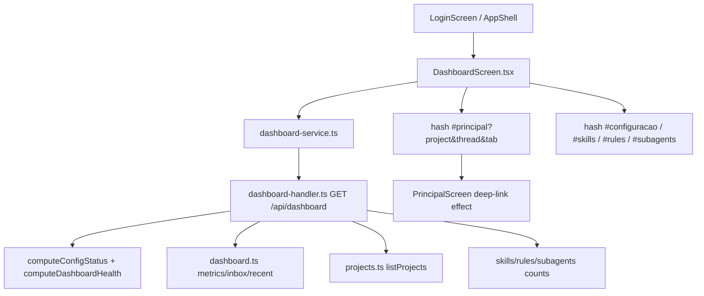

# Spec Técnica: F04. Dashboard

## 1. Visão Geral Técnica

**O quê:** Tela `#dashboard` pós-unlock, somente leitura, que agrega saúde da configuração (F02), métricas/inbox/atividade (F03) e contagens globais de catálogo (F05–F07) num único `GET /api/dashboard`, com navegação por hash para workspace, config e catálogo.

**Por quê:** O workspace (F03) é operacional por projeto/thread; o Dashboard é a visão multi-projeto do que precisa de atenção sem mutar threads, diffs ou git. Esta spec é **as-built**: documenta o contrato e o comportamento já shipados (`PROGRESS.md` marca F04 como Feito).

**Escopo:** PRD F04 sem divisão Central/Completo — escopo completo da feature.

**Incluído:**
- Rota `#dashboard` como primeira tela pós-unlock (`LoginScreen` → `#dashboard`)
- Endpoint agregado `GET /api/dashboard` (health, metrics, inbox ≤ 20, projects, catalog, recent ≤ 10)
- UI: strip de saúde, banner de setup incompleto, 4 metric cards, inbox, grade de projetos, resumo de catálogo, atividade recente
- Refresh ao montar + botão Atualizar + poll opcional 30s com `document.hidden === false`
- Deep-link `#principal?project=&thread=&tab=diff|history` consumido por `PrincipalScreen`
- Zero mutações de turno/diff/git a partir do Dashboard

**Adiado / fora:**
- Paginação da inbox além do corte de 20
- Cards clicáveis (métricas são display-only)

**UI/copy:** `docs/F04-dashboard/ui.md` e `docs/F04-dashboard/copy.md` são a fonte de verdade de anatomia/tokens/estados e strings (ids `dashboard.*`). A UI shipada usa um objeto `COPY` local em `DashboardScreen.tsx` alinhado a esses ids. Não recopiar anatomia nem tabela de copy aqui.

**Excluído:** disparar turno; aceitar/rejeitar diff; commit/push/PR; edição inline de catálogo; persistência de estado próprio do Dashboard além do que já vive em F02/F03/F05–F07.

## 2. Impacto na Arquitetura



## 3. Decisões Técnicas

### 3.1 Herdadas do codebase / docs canônicos

Padrões observados no repo (brief `docs/_shared/codebase-patterns.md` está stale para outra onda; para F04 as-built vale o código + specs irmãs): HTTP loopback `127.0.0.1:5174`, `guard` 423→401, handlers `handle*Request → boolean`, validação manual tipada (sem Zod), SQLite `node:sqlite`, Vitest co-local, renderer só via service HTTP (sem Node), tema/tokens F01.1.

Desvios desta feature: nenhum de stack — F04 só lê agregados e navega por hash.

### 3.2 Específicas da feature (as-built)

| Decisão | Abordagem Escolhida | Alternativa Considerada | Trade-off |
|---------|---------------------|--------------------------|-----------|
| Forma de agregação | Um único `GET /api/dashboard` montando health + metrics + inbox + projects + catalog + recent no handler | Vários endpoints no renderer e merge no cliente | Um round-trip; handler reutiliza `computeConfigStatus` (F02) e repos existentes |
| Classificação da inbox (DB) | Um item por thread; kind = `pendingDiff` se há diff `pending`, senão `error` se `state=error`, senão `running`; idle/committed/stopping sem pending saem | Um item por diff ou lista separada por kind | Precedência `pendingDiff > error > running` evita duplicar a mesma thread |
| Ordenação da inbox (DB) | Tier `error > pendingDiff > running`, desempate `updated_at DESC`, `LIMIT` | Só por `updated_at` | Erros ficam no topo mesmo se o pendingDiff for mais recente |
| Item `setupIncomplete` | Handler prepende um item sintético (campos null) quando `health.setupIncomplete`, depois `inbox.slice(0, 20)` | Só banner, sem linha na inbox | Inbox e banner reforçam o mesmo sinal; o item conta no teto de 20 |
| Definição de `setupIncomplete` | Sem provider disponível entre **claude/codex/kimi** OU GitHub token ausente | Incluir minimax/glm/grok na regra de “algum provider” | As-built: dots e flag ainda não tratam API-key-only providers como “setup ok”; documentar para não parecer regressão |
| Dot `clis` | `ok` se codex **ou** kimi available | Dot por CLI | PRD fala “CLIs” no plural; um único dot agrega |
| Contagens de catálogo | Só globais (`skillsRepository.getCounts().global`, `getRulesCounts().global`, `getSubagentCounts().global`) | Incluir vínculos por projeto | Dashboard é visão de catálogo global; vínculos ficam no Repo Harness |
| Deep-link no workspace | Query na hash `#principal?project=&thread=&tab=`; efeito one-shot em `PrincipalScreen` (`deepLinkAppliedRef`) | Estado em memória / IPC | F03 não lia query; F04 adicionou o consumidor sem mudar o contrato HTTP |
| Poll | `setInterval` 30s; skip se `document.hidden` | Só refresh manual | Alinha ao PRD “opcional a cada 30s com tela visível” |
| Empty de atividade recente | Reusa string `dashboard.empty.inbox` (“Nada pendente…”) | Copy dedicado | Quirk as-built; copy.md não tem empty separado para recent |

### 3.3 Assumptions / Decisions (entrevista)

| Assumption | Origem | Pode sobrescrever? |
|------------|--------|---------------------|
| Spec/plan são as-built do código shipado, não redesign | Entrevista Q1 | sim |
| Plan retrospectivo enxuto (fases espelhando o entregue) + Validação | Entrevista Q2 | sim |
| SDD gerado via `screen-ui-spec` a partir do as-built; screenshots em `docs/F04-dashboard/ui/` capturadas 2026-08-08 | Entrevista Q3 + screen-ui-spec 2026-08-08 | sim |
| Desvios/contratos reais (setupIncomplete, deep-link, slice inbox, empty recent) entram em 3.2 | Entrevista Q4 | sim |
| `ui.md`/`copy.md` canônicos; strings e anatomia não reinventadas na spec técnica | `docs/F04-dashboard/ui.md`, `copy.md` | sim |
| Sem migração SQLite nova — só queries sobre `projects` / `threads` / `diffs` e counts de catálogo | Codebase as-built | sim |

## 4. Visão Geral de Componentes

**Frontend:**

| Caminho | Novo/Modificado | Propósito | Responsabilidades-chave |
|---------|-----------------|-----------|-------------------------|
| `src/renderer/screens/DashboardScreen.tsx` | Entregue | Tela `#dashboard` | Load/poll, health/banner/cards/inbox/projetos/catálogo/recent, navegação hash |
| `src/renderer/services/dashboard-service.ts` | Entregue | Cliente HTTP | `getDashboard()` → `GET /api/dashboard` + tipos de resposta |
| `src/renderer/screens/PrincipalScreen.tsx` | Modificado (F04) | Consumidor do deep-link | Lê `project`/`thread`/`tab` na hash uma vez após `projects` carregarem |
| `src/renderer/App.tsx` / `LoginScreen.tsx` | Modificado | Roteamento | Default/pós-unlock → `#dashboard` |
| `src/renderer/components/{StatusDot,MetricCard,Skeleton,Button*,InlineFeedback}` | Reuso | Primitives F01.1 | Visual da strip, cards, loading, erros |

**Backend:**

| Caminho | Novo/Modificado | Propósito | Responsabilidades-chave |
|---------|-----------------|-----------|-------------------------|
| `src/services/http/dashboard-handler.ts` | Entregue | Endpoint + health puro | `computeDashboardHealth`, `handleDashboardRequest`, agregação |
| `src/services/http/config-handler.ts` | Modificado | Reuso F02 | `computeConfigStatus()` exportado para o dashboard |
| `src/services/db/repositories/dashboard.ts` | Entregue | Queries agregadas | `getDashboardMetrics`, `listDashboardInbox`, `listRecentActivity` |
| Repos `projects` / `skills` / `rules` / `subagents` | Reuso | Fonte de grade e catalog | Sem schema novo |

**Banco de Dados:**

| Migração | Tabelas | Operação | Notas |
|----------|---------|----------|-------|
| Nenhuma nova | `projects`, `threads`, `diffs` (+ stores de catálogo) | SELECT agregados | Índices/constraints herdados de F03/F05–F07 |

## 5. Contratos de API

### GET `/api/dashboard`

- **Autenticação:** header `x-engrenacode-session`; `guard` — vault locked → 423 `vault_locked`; sessão inválida → 401 `unauthorized`
- **Body:** nenhum

**Resposta 200:**

| Campo | Tipo | Descrição |
|-------|------|-----------|
| `health.claude` / `clis` / `github` | `'ok' \| 'warn'` | Dots da strip |
| `health.prompt` | `'ok' \| 'off'` | Prompt global vazio → `off` |
| `health.setupIncomplete` | `boolean` | Ver decisão 3.2 |
| `metrics.projects` / `running` / `pendingDiffs` / `errors` | `number` | Cards |
| `inbox[]` | items | Até 20; pode incluir `kind: 'setupIncomplete'` sintético |
| `projects[]` | lista F03 | Grade |
| `catalog.skills` / `rules` / `subagents` | `number` | Contagens globais |
| `recent[]` | threads | Até 10 por `updated_at` desc |

**Exemplo (forma):**

```json
{
  "health": {
    "claude": "ok",
    "clis": "warn",
    "github": "ok",
    "prompt": "ok",
    "setupIncomplete": false
  },
  "metrics": { "projects": 2, "running": 1, "pendingDiffs": 3, "errors": 0 },
  "inbox": [
    {
      "kind": "pendingDiff",
      "threadId": "th_1",
      "projectId": "pr_1",
      "projectName": "app",
      "title": "Fix login",
      "provider": "claude",
      "updatedAt": 1720000000000
    }
  ],
  "projects": [
    {
      "id": "pr_1",
      "path": "C:\\repos\\app",
      "name": "app",
      "createdAt": 1710000000000,
      "updatedAt": 1720000000000
    }
  ],
  "catalog": { "skills": 4, "rules": 2, "subagents": 1 },
  "recent": [
    {
      "threadId": "th_1",
      "projectId": "pr_1",
      "projectName": "app",
      "title": "Fix login",
      "provider": "claude",
      "state": "idle",
      "updatedAt": 1720000000000
    }
  ]
}
```

**Inbox item sintético (`setupIncomplete`):** `threadId`/`projectId`/`projectName`/`title`/`provider`/`updatedAt` são `null`.

**Códigos de erro:**

| Código | Status | Descrição |
|--------|--------|-----------|
| `unauthorized` | 401 | Sessão ausente/inválida |
| `vault_locked` | 423 | Cofre travado |
| `internal_error` | 500 | Falha não tratada no handler |

### Navegação (não-HTTP)

| Origem UI | Destino |
|-----------|---------|
| Banner / strip / inbox `setupIncomplete` | `#configuracao` |
| Inbox `pendingDiff` | `#principal?project=&thread=&tab=diff` |
| Inbox `running` / `error` | `#principal?project=&thread=&tab=history` |
| Card de projeto | `#principal?project=` |
| Empty projetos CTA | `#principal` |
| Catalog skills/rules/subagents | `#skills` / `#rules` / `#subagents` |
| Atividade recente | `#principal?project=&thread=&tab=history` |

## 6. Modelo de Dados

Sem tabelas novas. Contratos de leitura:

**Métricas (`getDashboardMetrics`):**

| Contador | Fonte |
|----------|--------|
| `projects` | `COUNT(*)` em `projects` |
| `running` | `threads.state = 'running'` |
| `pendingDiffs` | `diffs.status = 'pending'` |
| `errors` | `threads.state = 'error'` |

**Inbox (`listDashboardInbox`):** join `threads` × `projects`; `CASE` de kind; `ORDER BY` tier + `updated_at DESC`; `LIMIT ?`.

**Recent (`listRecentActivity`):** join `threads` × `projects`; qualquer `state`; `ORDER BY updated_at DESC`; `LIMIT ?`.

## 7. Estratégia de Testes

### 7.1 Unitário / Integração

| Arquivo | Tipo | Alvo |
|---------|------|------|
| `src/services/db/repositories/dashboard.test.ts` | Unitário (SQLite memory/temp) | métricas, classificação, ordenação, limites |
| `src/services/http/dashboard-handler.test.ts` | Integração HTTP | health puro + guardas + agregação 200 |

**Funções (já existentes — as-built):**

| Função | Assertions-chave |
|--------|------------------|
| `counts projects, running threads, pending diffs and error threads across all projects` | Quatro contadores corretos cross-project |
| `classifies a thread with pending diff as pendingDiff even when state=error` | Precedência pendingDiff |
| `sorts by kind tier (error > pendingDiff > running), tie-broken by updatedAt desc` | Ordem da inbox |
| `excludes idle and committed threads without a pending diff` | Filtro |
| `respects the limit` (inbox e recent) | `LIMIT` |
| `orders threads by updatedAt desc across projects, including running` | Recent |
| `marks setupIncomplete when no provider is available…` / `…GitHub token is missing` / `…false with at least one provider…` | Regras de health |
| `reports prompt=off only when the global prompt is explicitly emptied` | Dot prompt |
| `returns 401 without a valid session` / `returns 423 when the vault is locked` | Guard |
| `aggregates health, metrics, inbox, projects, catalog and recent in one 200 response` | Shape agregado |

### 7.2 Smoke / Aceitação manual

| # | Passo | Resultado esperado |
|---|-------|-------------------|
| 1 | Unlock → primeira tela | `#dashboard` com saúde + 4 cards |
| 2 | Com running / pendingDiff / error / setup incompleto | Inbox ≤ 20; kinds na ordem correta; banner se setup incompleto |
| 3 | Clique em diff pendente | `#principal` com projeto/thread e aba Diff |
| 4 | Clique em contagem de SubAgents | `#subagents` |
| 5 | Confirmar que Dashboard não aceita diff nem dispara turno | Sem CTAs de mutação |
| 6 | Light/dark + strings | Tema ok; anatomia vs `ui.md`; copy vs `copy.md` (PNG de referência em `docs/F04-dashboard/ui/`) |
| 7 | Erro de load (servidor down) | `dashboard.error.network` + retry |
| 8 | Vault locked na API | 423 `vault_locked` (cliente autenticado sem unlock) |

### 7.3 Cross-feature

| Critério (PRD §9) | Como verificar |
|-------------------|----------------|
| Tokens F01.1 no Dashboard | Smoke light/dark / superfícies |
| Status F02 alimenta saúde | `computeDashboardHealth` + strip |
| Projetos/threads/diffs F03 alimentam cards/inbox | `dashboard.test.ts` + smoke deep-link |
| Contagens F05/F06/F07 no resumo | Response `catalog` + clique → rotas |
| Seeds F17 nas contagens | Contagens globais pós primeiro unlock (já coberto no gate F17/F04) |

---

### Requisitos / Regras de Negócio (PRD Capacidades)

- Dashboard é a primeira superfície pós-unlock; separado do workspace
- Widgets obrigatórios: saúde; 4 cards; inbox ≤ 20; grade de projetos; catálogo; recent ≤ 10
- Refresh: abrir + Atualizar + poll 30s se visível
- Não dispara turno, não aceita diff, não faz commit/PR

### Fluxos de UX (PRD Experiência + copy ids)

- Inbox → workspace (tab por kind); setup → `#configuracao` (`dashboard.cta.completeSetup`, `dashboard.banner.setupIncomplete`)
- Empty: `dashboard.empty.inbox`, `dashboard.empty.projects`
- Catálogo: `dashboard.catalog.skills|rules|subagents`
)
