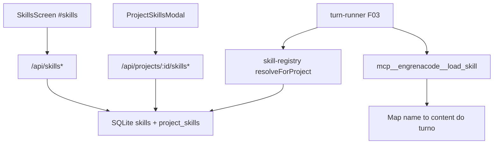

# F05. Skills — Especificação Técnica

**Feature:** F05 Skills  
**Complexidade:** médio  
**Escopo:** feature completa (PRD sem divisão Central/Completo; itens de pipeline/`locked`/`trigger=command` fora)  
**UI:** [`ui.md`](./ui.md) · Copy: [`copy.md`](./copy.md)  
**Última atualização:** 2026-08-03

---

## 1. Visão Geral Técnica

**O quê:** Catálogo global de skills markdown com CRUD em `#skills`, vínculo por projeto (enabled + ordem), e entrega sob demanda via tool `mcp__engrenacode__load_skill` no turno (F03). Skill **não executa código**; só orienta o agente.

**Por quê:** Instruções reutilizáveis entram no contexto só quando o modelo decide carregar, sem poluir todo turno.

**Escopo:**

### Incluído

- CRUD: `name` único global, `description` (obrigatória; soft warn >200 chars), `content` markdown (hard ~1 MiB), `category?`, `enabled`
- Vínculo `project_skills`: linked, `enabled` no projeto, `sort_order`; catálogo do turno = linked ∧ enabled global ∧ enabled projeto
- Trigger MVP fixo `auto` (sem UI; sem path `command`)
- Soft warning UI se >30 skills vinculadas no projeto (não bloqueia API)
- Contagens para F04 (`GET /api/skills/counts` ou agregação documentada)
- Tool `load_skill`: catálogo (name+description) no turno; content só no invoke
- Tela `#skills` + overlay vínculo (Repo Harness F03) conforme ui.md/copy.md

### Adiado / fora

- `locked` / template pipeline; `trigger=command`; marketplace; execução de código
- Layout dos cards de contagem no Dashboard (F04 consumidor)
- Materialização Codex-specific de arquivos `.md` (pode seguir em F03 provider wiring; contrato Central = MCP load_skill)

---

## 2. Impacto na Arquitetura

| Área | Caminhos |
|------|----------|
| Renderer | `SkillsScreen`, `SkillFormModal`, `ProjectSkillsModal`, `skillForm.logic`, `skills-service`, `#skills` em `App.tsx` |
| HTTP | `src/services/http/skills-handler.ts` |
| DB | `skills`, `project_skills` em `engrenacode.db` |
| Runner | `skill-registry` + tool `mcp__engrenacode__load_skill` no turn-runner F03 |



---

## 3. Decisões Técnicas

### 3.1 Herdadas

F01 sessão `x-engrenacode-session`; F01.1 tokens; F02 padrões HTTP/erro; SQLite alinhado a F03/F06; Vitest; marca EngrenaCode.

### 3.2 Específicas

| Decisão | Escolhida | Alternativa | Trade-off |
|---------|-----------|-------------|-----------|
| Cap ≤30 | Soft warn UI `skillsLink.warn.cap` | Hard 400 | PRD “recomendação” |
| Description 200 | Soft warn | Hard max | Catálogo barato vs UX |
| Content 1 MiB | Hard block UI+server | Soft | Protege body HTTP |
| Trigger | Só `auto` implícito | Coluna + UI command | MVP simples |
| `locked` | Omitir | Campo legado | Fora PRD |
| load_skill | Snapshot por turno | Read DB a cada call | Consistência no turno |
| Copy | PT-BR acentuado (`copy.md`) | Byte-a-byte legado | Produto EngrenaCode |

### 3.3 Assumptions (recomendações)

| Assumption | Origem |
|------------|--------|
| Pasta `docs/F05-skills/` (kebab PRD Skills) — já correta, sem rename | skill |
| Frontend = ui.md + copy.md | pedido usuário |
| Soft cap 30 + omit locked + PT-BR | Auto-Aceitar + agente sistema legado |
| Substitui stubs F03 §5.5 de skills | handoff F03 |
| Wiring tool no runner deferred até F03 runner existir | Onda 2/3 |

---

## 4. Visão Geral de Componentes

### Frontend (ui.md + copy.md)

| Caminho | Novo/Mod | Propósito |
|---------|----------|-----------|
| `src/renderer/screens/SkillsScreen.tsx` | Novo | Lista CRUD `#skills` |
| `src/renderer/components/skills/SkillFormModal.tsx` | Novo | Create/edit |
| `src/renderer/components/skills/skillForm.logic.ts` | Novo | 200 warn, 1 MiB gate |
| `src/renderer/components/skills/ProjectSkillsModal.tsx` | Novo | Vínculo F03 |
| `src/renderer/services/skills-service.ts` | Novo | HTTP client |
| `src/renderer/App.tsx` | Mod | Hash `#skills` + nav |

Copy: importar ids de [`copy.md`](./copy.md) (`skills.*`, `skillsForm.*`, `skillsLink.*`).

### Backend

| Caminho | Novo/Mod | Propósito |
|---------|----------|-----------|
| `src/services/db/migrations/00N_skills.sql` | Novo | `skills` + `project_skills` |
| `src/services/db/repositories/skills.ts` | Novo | CRUD, links, resolve |
| `src/services/http/skills-handler.ts` | Novo | Rotas §5 |
| `src/services/runner/skill-registry.ts` | Novo | `resolveForProject` |
| `src/services/runner/turn-runner.ts` | Mod | Registrar tool load_skill |
| Router HTTP | Mod | Registrar `/api/skills*` |

---

## 5. Contratos de API

Auth: `x-engrenacode-session`. Prefixo `/api`.

### CRUD

| Método | Path | Notas |
|--------|------|-------|
| GET | `/api/skills` | `{ skills: Skill[] }` |
| POST | `/api/skills` | 201 `{ skill }` |
| PUT | `/api/skills/:id` | parcial `{ skill }` |
| DELETE | `/api/skills/:id` | cascade vínculos `{ deleted: true }` |

**Body create:**

| Campo | Tipo | Obrigatório | Validação |
|-------|------|-------------|-----------|
| `name` | string | sim | non-empty; UNIQUE |
| `description` | string | sim | non-empty; soft >200 só UI |
| `content` | string | sim | non-empty; ≤ ~1 MiB (`1048576`) |
| `category` | string\|null | não | |
| `enabled` | boolean | não | default true |

**Erros:** `validation_error` 400, `skill_not_found` 404, `skill_name_conflict` 409, `unauthorized` 401, `vault_locked` 423, `too_long` 400 se content > teto.

### Projeto

| Método | Path | Body |
|--------|------|------|
| GET | `/api/projects/:id/skills` | — → `SkillLinkState[]` |
| PUT | `/api/projects/:id/skills/:skillId` | `{ enabled?, sortOrder? }` upsert |
| DELETE | `/api/projects/:id/skills/:skillId` | unlink |
| PUT | `/api/projects/:id/catalog-order` | `{ kind: "skills", items: [{ id, enabled, sortOrder }] }` |

### Contagens (F04)

**GET `/api/skills/counts`** → `{ global: number, linkedByProject: Record<string, number> }`  
(`linked` = rows em `project_skills`; opcionalmente `activeByProject` = linked∧enabled∧skill.enabled).

### Tipos

```typescript
interface Skill {
  id: string
  name: string
  description: string
  content: string
  category: string | null
  enabled: boolean
  createdAt: number
  updatedAt: number
}

interface SkillLinkState extends Omit<Skill, 'content'> {
  linked: boolean
  enabledInProject: boolean | null
  sortOrder: number | null
}
```

Lista anotada do projeto **omitir `content`** (payload leve); content só no CRUD global / load_skill.

### `load_skill` (runtime, não REST)

- Nome da tool: `mcp__engrenacode__load_skill`
- Input: `{ name: string }` (enum dos names do catálogo do turno)
- Catálogo no turno: skills com `linked ∧ project.enabled ∧ skill.enabled` (trigger auto)
- Description da tool lista name+description para o modelo decidir
- Resultado: markdown `content` do snapshot do turno (não re-lê DB mid-turn se skill mudar)
- Skill **nunca** executa código no host

---

## 6. Modelo de Dados

### `skills`

| Coluna | Tipo | Nullable | Padrão | Descrição |
|--------|------|----------|--------|-----------|
| `id` | TEXT | Não | — | PK |
| `name` | TEXT | Não | — | UNIQUE |
| `description` | TEXT | Não | — | catálogo |
| `content` | TEXT | Não | — | markdown |
| `category` | TEXT | Sim | — | |
| `enabled` | INTEGER | Não | 1 | |
| `created_at` | INTEGER | Não | — | |
| `updated_at` | INTEGER | Não | — | |

Não persistir `locked`. `trigger` opcional omitido (sempre auto).

### `project_skills`

| Coluna | Tipo | Nullable | Descrição |
|--------|------|----------|-----------|
| `project_id` | TEXT | Não | PK composta; FK CASCADE |
| `skill_id` | TEXT | Não | PK composta; FK CASCADE |
| `enabled` | INTEGER | Não | default 1 |
| `sort_order` | INTEGER | Não | default 0 |
| `created_at` | INTEGER | Não | |

Índice: `ix_project_skills_project`.

---

## 7. Estratégia de Testes

### 7.1 Unitário / Integração

| Arquivo | Alvo |
|---------|------|
| `src/services/db/repositories/skills.test.ts` | CRUD, conflict, resolve filter |
| `src/services/http/skills-handler.test.ts` | 409 name, 400 content too long |
| `src/renderer/components/skills/skillForm.logic.test.ts` | 200 warn, 1 MiB block |

| Função | Assertions |
|--------|------------|
| `rejects_duplicate_name` | 409 `skill_name_conflict` |
| `rejects_content_over_1mib` | 400 |
| `resolve_excludes_unlinked` | fora do catálogo |
| `resolve_excludes_disabled_project` | fora |
| `resolve_excludes_disabled_global` | fora |
| `description_long_does_not_block_save` | 201/200 |

### 7.2 Smoke / Aceitação

| # | Passo | Esperado |
|---|-------|----------|
| 1 | `#skills` → Nova skill | card na grid; copy `copy.md` |
| 2 | Description >200 | aviso âmbar; salva |
| 3 | Content >1 MiB | submit bloqueado |
| 4 | Name duplicado | `skillsForm.error.nameConflict` |
| 5 | Vincular + Ativo no projeto | entra no catálogo (quando runner) |
| 6 | Desativar no projeto | some do catálogo |
| 7 | >30 vínculos | `skillsLink.warn.cap`; API ok |
| 8 | Light/dark vs ui.md | EngrenaCode, sem sistema legado |

### 7.3 Cross-feature

| Critério | Status | Nota |
|----------|--------|------|
| Tokens F01.1 em `#skills` | ready | |
| Catálogo/load_skill no turno F03 | deferred | até turn-runner |
| Contagens F04 | deferred | até F04 |
| Overlay no Workspace F03 | deferred/peer | |
| Stub F03 skills counts → real | ready ao implementar | |

### Critérios PRD §9

- [ ] CRUD global com name único; conflito rejeitado
- [ ] Vínculo por projeto controla presença no catálogo do turno
- [ ] load_skill entrega content sob demanda; skill não roda sozinha
