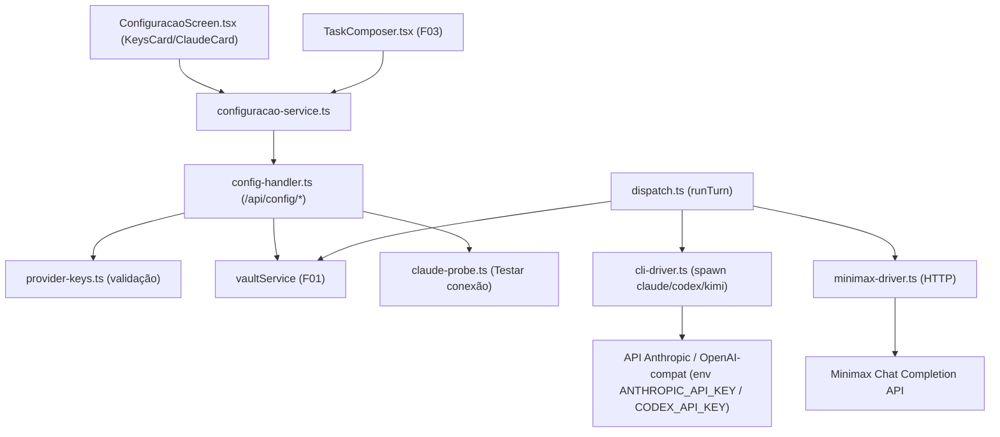

# Spec Técnica: F10. API Keys dos Providers

## 1. Visão Geral Técnica

**O quê:** Bloco "API keys dos providers" em `#configuracao` (Claude/Codex/Minimax) + toggle real Assinatura↔API key do Claude, substituindo o segmento `api-key` hoje hardcoded `disabled: true` em `ConfiguracaoScreen.tsx:139`. Estende o vault (F01) com três novos secrets, o handler HTTP `/api/config/*` com endpoints de save/status, e o runner (F03) com um branch de execução via API HTTP para Minimax (que não tem CLI) e injeção de API key no spawn CLI para Claude (modo api-key) e Codex.

**Por quê:** Hoje `claude:mode` já existe no vault mas nunca é lido pelo runner — o modo "API key" é inatingível na UI e não tem efeito no dispatch mesmo se atingido. `ThreadProvider` (`src/services/db/repositories/threads.ts:4`) não inclui Minimax, e `cli-driver.ts` só sabe spawnar binários CLI — Minimax exige uma chamada HTTP direta. F10 fecha essas duas lacunas arquiteturais que bloqueiam o release 1.0.

**Escopo:** PRD não define blocos Escopo Central / Adições ao Escopo Completo para F10 — escopo é a feature inteira (Capacidades + Experiência + Tratamento de Erros do PRD §F10, `docs/PRD.md:459-484`).

**Incluído:**
- Vault: 3 novos secrets (`keys:claude`, `keys:codex`, `keys:minimax`); leitura de `claude:mode` pelo runner (hoje write-only)
- Endpoints: salvar keys, expor presença em status, guard de modo Claude, teste de conexão ciente de modo
- Validação client + server (prefixo/whitespace/tamanho) por provider
- `ThreadProvider` += `'minimax'`; branch HTTP no runner; injeção de API key no spawn CLI (Claude api-key, Codex)
- Composer (F03/`TaskComposer.tsx`) passa a gatear disponibilidade por presença de key, não só por CLI instalado
- UI: `Card`/`Field`/`Badge` extraídos como componentes compartilhados (`src/renderer/components/`); novo `KeysCard`; `ClaudeCard` com gating real

**UI/copy — fonte de verdade:** `docs/F10-api-keys-providers/ui.md` (anatomia, tokens, aceite visual) e `docs/F10-api-keys-providers/copy.md` (strings por id). Esta spec cita ids de copy e a anatomia documentada ali — não redescreve layout nem recopia texto.

**Excluído:** contratos de GLM (fora do PRD F10); tool-calling paridade completa para Minimax (ver Decisão 3.2); path manual de CLI; ditado/STT.

## 2. Impacto na Arquitetura



## 3. Decisões Técnicas

### 3.1 Herdadas do codebase

- Transporte: HTTP loopback `127.0.0.1:5174`, roteado por prefixo em `src/services/http/unlock-handler.ts:94` até `handleConfigRequest`. `/api/config/` já cai nesse handler — nenhum novo wiring de rota é necessário lá.
- Envelope de erro: `{ error: { code, message, details? } }`; auth via header `x-engrenacode-session` checado com `isAuthorized()` em cada handler (`config-handler.ts:26-31`).
- Vault: `vaultService.setSecret/getSecret/deleteSecret(key: string, value: string)` (`src/services/vault/vault-service.ts:96-116`), string plana, namespace `namespace:field` (`claude:mode`, `prompt:global`, `github:token`).
- Padrão de validador: função pura com union `{ok:true,...} | {ok:false,message}`, colocada com o domínio (`src/services/http/github-token.ts`), testada table-driven em `*.test.ts` (`github-token.test.ts`).
- Runner: `dispatch.ts:runTurn` monta `ProviderTurnInput` e chama `runCliTurnImpl` (injetável para testes, `dispatch.ts:51-61`); único ponto de execução do provider.
- Desvios desta feature: nenhum.

### 3.2 Específicas da feature

| Decisão | Abordagem Escolhida | Alternativa Considerada | Trade-off |
|---------|---------------------|--------------------------|-----------|
| Validação de formato das keys | Server-side (novo `provider-keys.ts`) + client-side (espelho em `ConfiguracaoScreen.tsx`, mesmo padrão do GitHub token) | Só client-side (como a fonte legada) | Mais código duplicado cliente/servidor, mas fecha o gap de clientes não-UI enviando key malformada direto pro `/api/config/keys/save` |
| Wiring de Minimax no runner | `ThreadProvider` ganha `'minimax'`; `cli-driver.ts` ganha mapa `PROVIDER_KIND` (`cli` \| `http`) e delega a `minimax-driver.ts` quando `http`; `dispatch.ts` resolve a API key do vault e injeta em `ProviderTurnInput.apiKey` | F10 só expor status, wiring adiado | PRD exige "Minimax disponível como provider de thread" como Provê de F10; adiar deixaria a feature sem valor executável |
| "Testar conexão" (Claude) | Reusa `spawn` do `cli-driver.ts` num probe dedicado (`claude-probe.ts`), sem nova dependência; env `ANTHROPIC_API_KEY` injetado só no modo api-key | Dependência nova `@anthropic-ai/claude-agent-sdk` (como a fonte) | Probe fica acoplado ao parsing `stream-json` do CLI (já usado em `cli-driver.ts`) em vez de uma API de SDK dedicada — aceitável pois já é o único caminho de execução do Claude no projeto |
| Primitives de UI | Extrai `Card`, `Field`, `Badge` para `src/renderer/components/` | Manter inline por card (convenção atual de `ConfiguracaoScreen.tsx`) | Novo custo de abstração agora, mas `ClaudeCard` + `KeysCard` (2 cards, 3 rows) já justificam reuso; `GithubCard` existente não é migrado nesta feature (fora do escopo, ver Assumption) |
| Tool-use para Minimax | Turno Minimax é texto-only na 1.0 (sem loop `tool_use`) | Paridade completa de tool-calling com Claude/Codex/Kimi | PRD não especifica ferramentas MCP/tools para Minimax; `minimax-driver.ts` não tem precedente de execução HTTP com tools no runner atual — paridade fica como follow-up pós-1.0 |
| Env var da API key do Codex | `CODEX_API_KEY` (nome assumido) | — | Nenhum precedente no codebase (Codex hoje só usa CLI login); nome deve ser confirmado contra a doc oficial do Codex CLI durante a implementação |

### 3.3 Assumptions

| Assumption | Origem | Pode sobrescrever? |
|------------|--------|--------------------|
| Nome dos secrets do vault: `keys:claude`, `keys:codex`, `keys:minimax` | Convenção `namespace:field` observada em `claude:mode`/`prompt:global`/`github:token` | sim |
| Endpoint Minimax e shape exato do payload da Chat Completion API ficam como constante a confirmar contra a doc oficial Minimax na implementação (não fixados nesta spec) | Sem precedente no codebase; nova integração externa | sim |
| Strings `composer.minimax.unavailable` / `composer.claude.apiKey.unavailable` (hoje `TODO` em `copy.md:76-77`) propostas como: "Minimax sem key salva — configure em #configuracao." / "Claude em modo API key sem key salva — configure em #configuracao." | `copy.md` §Lacunas marca os dois ids como pendentes | sim — formalizar em `copy.md` antes/durante implementação |
| `GithubCard` não é migrado para os novos primitives `Card`/`Field`/`Badge` nesta feature | Escopo F10 é Claude/Codex/Minimax; migrar Github é refactor não pedido pelo PRD | sim |
| Guard server-side no `POST /api/config/claude/mode`: rejeita `mode:'api-key'` sem `keys:claude` salva | PRD Capacidades: "key não vence assinatura sozinha"; UI já teria essa regra client-side via `disabledHint` | sim |

## 4. Visão Geral de Componentes

**Frontend:**

| Caminho do Arquivo | Novo/Modificado | Propósito | Responsabilidades-Chave |
|---------------------|------------------|-----------|--------------------------|
| `src/renderer/components/Card.tsx` | Novo | Card + CardHeader compartilhados | Substitui os locais `Card`/`CardHeader` de `ConfiguracaoScreen.tsx:89-116` |
| `src/renderer/components/Field.tsx` | Novo | label + input password + reveal + hint/erro | Usado por `KeysCard` (rows Claude/Codex/Minimax) |
| `src/renderer/components/Badge.tsx` | Novo | pill "configurada" / "não configurada" | Usado por `KeysCard` |
| `src/renderer/screens/ConfiguracaoScreen.tsx` | Modificado | Remove disable hardcoded do segmento api-key (`:139`); adiciona `KeysCard`; `ClaudeCard` usa `keys.claude` do status para habilitar segmento e mostrar `noKey` copy | Anatomia/copy conforme `docs/F10-api-keys-providers/ui.md` §Anatomia e `copy.md` |
| `src/renderer/services/configuracao-service.ts` | Modificado | `ConfigStatus.keys`, `ConfigStatus.providers`; `saveProviderKeys()`; `testClaude()` sem mudança de assinatura (servidor decide o modo) | Tipos espelham resposta do handler |
| `src/renderer/components/workspace/TaskComposer.tsx` | Modificado | `PROVIDERS` += `'minimax'`; gating via `configStatus.providers[provider]` em vez de `configStatus.clis[provider]` | Composer indisponível com motivo (`composer.*.unavailable`) |
| `src/renderer/services/threads-service.ts` | Modificado | `ThreadProvider` += `'minimax'` (linha 25) | Espelha o tipo do backend |

**Backend:**

| Caminho do Arquivo | Novo/Modificado | Propósito | Responsabilidades-Chave |
|---------------------|------------------|-----------|--------------------------|
| `src/services/vault/provider-keys.ts` | Novo | Validadores puros Claude/Codex/Minimax | Espelha `github-token.ts`: prefixo, whitespace, tamanho mínimo 8, vazio = preserva |
| `src/services/http/config-handler.ts` | Modificado | `GET /api/config/status` inclui `keys`/`providers`; `POST /api/config/keys/save`; `POST /api/config/claude/mode` com guard; `POST /api/config/claude/test` ciente de modo | Reusa `isAuthorized`/`sendJson`/`parseBody` já existentes no arquivo |
| `src/services/http/claude-probe.ts` | Novo | Probe "Testar conexão" (subscription e api-key) | Reusa `spawn` + parsing `stream-json` no estilo de `cli-driver.ts`; timeout via `AbortController` |
| `src/services/runner/providers/cli-driver.ts` | Modificado | `PROVIDER_KIND` (`cli`\|`http`); `ProviderTurnInput.apiKey?: string`; injeta env `ANTHROPIC_API_KEY`/`CODEX_API_KEY` no spawn quando presente; delega a `minimax-driver.ts` quando `kind==='http'` | `runCliTurn` vira o ponto único que `dispatch.ts` continua chamando |
| `src/services/runner/providers/minimax-driver.ts` | Novo | `runHttpTurn(input, apiKey)` | Chamada HTTP à Minimax Chat Completion API; sem tool-use (ver Decisão 3.2) |
| `src/services/runner/dispatch.ts` | Modificado | `resolveProviderApiKey(thread)` lê `claude:mode`+`keys:claude` (só se api-key), `keys:codex`, `keys:minimax` do vault e popula `turnInput.apiKey` antes de `runCliTurnImpl` | Único ponto que já lê vault para `buildSystemPrompt` (`dispatch.ts:81`) |
| `src/services/db/repositories/threads.ts` | Modificado | `ThreadProvider` += `'minimax'` (linha 4) | Sem migração — coluna `provider TEXT NOT NULL` sem CHECK constraint (`migrations/002_workspace_core.ts:16`) |
| `src/services/http/threads-handler.ts` | Modificado | `PROVIDERS` (linha 19) += `'minimax'` | Guarda de validação em `POST /api/threads` |

**Banco de Dados:** nenhuma migração — `threads.provider` já é `TEXT NOT NULL` sem enum/CHECK a nível SQL; a validação de provider é só TypeScript (`ThreadProvider` union) + runtime array (`threads-handler.ts:19`, `TaskComposer.tsx:33`). Vault não tem schema versionado — `secrets: Record<string,string>` plano (§6).

## 5. Contratos de API

Todas as rotas abaixo já caem em `handleConfigRequest` via prefixo `/api/config/` roteado em `unlock-handler.ts:94-97` — nenhuma mudança em `unlock-handler.ts`. Auth: header `x-engrenacode-session` (igual às rotas existentes).

### Endpoint: Salvar keys dos providers

- **Método:** POST
- **Caminho:** `/api/config/keys/save`
- **Autenticação:** `x-engrenacode-session`

**Requisição** (campos ausentes = não tocados; string vazia = preserva o secret atual, igual ao contrato de merge observado na referência legada):

| Campo | Tipo | Obrigatório | Validação | Descrição |
|-------|------|-------------|-----------|-----------|
| `claude` | `string` | Não | vazio preserva; senão `sk-ant-`, sem espaços, ≥8 chars (`provider-keys.ts`) | Key Claude |
| `codex` | `string` | Não | vazio preserva; senão `sk-` ou `sk-codex-`, sem espaços, ≥8 chars | Key Codex |
| `minimax` | `string` | Não | vazio preserva; senão sem espaços, ≥8 chars (validator loose, sem prefixo) | Key Minimax |

```json
{ "claude": "sk-ant-...", "codex": "", "minimax": "mm-..." }
```

**Resposta (200):**

| Campo | Tipo | Descrição |
|-------|------|-----------|
| `saved` | `boolean` | sempre `true` em 200 |
| `keys.claude` | `boolean` | presença após o save |
| `keys.codex` | `boolean` | presença após o save |
| `keys.minimax` | `boolean` | presença após o save |
| `message` | `string` | `keys.success` (copy.md) |

```json
{ "saved": true, "keys": { "claude": true, "codex": false, "minimax": true }, "message": "Chaves salvas localmente (não validadas com o provider)." }
```

**Códigos de Erro:**

| Código | Status HTTP | Descrição |
|--------|-------------|-----------|
| `unauthorized` | 401 | sessão inválida |
| `invalid_json` | 400 | corpo não parseável |
| `validation_error` | 400 | um ou mais campos com formato inválido; `details: { claude?, codex?, minimax? }` com a mensagem de `provider-keys.ts` por campo (ids `keys.error.*.format` / `keys.error.spaces` / `keys.error.short`) |
| `internal_error` | 500 | falha ao persistir (disco/permissão) — mapeia para `keys.error.write` no client |

### Endpoint: Status de configuração (extensão)

- **Método:** GET
- **Caminho:** `/api/config/status` (existente, `config-handler.ts:95`)
- **Autenticação:** `x-engrenacode-session`

**Resposta (200) — campos novos além dos já existentes (`claude`, `clis`, `prompt`, `github`):**

| Campo | Tipo | Descrição |
|-------|------|-----------|
| `keys.claude` | `boolean` | presença de `keys:claude` |
| `keys.codex` | `boolean` | presença de `keys:codex` |
| `keys.minimax` | `boolean` | presença de `keys:minimax` |
| `providers.claude.available` | `boolean` | `clis.claude.loggedIn===true` (subscription) OU `keys.claude===true` (api-key) |
| `providers.codex.available` | `boolean` | `clis.codex.installed===true` OU `keys.codex===true` |
| `providers.kimi.available` | `boolean` | igual ao `clis.kimi` atual (sem key) |
| `providers.minimax.available` | `boolean` | `keys.minimax===true` (sem CLI) |
| `providers.<provider>.reason` | `string?` | presente só quando `available===false`; usa `composer.claude.apiKey.unavailable` / `composer.minimax.unavailable` (ver Assumption 3.3) |

```json
{
  "claude": { "mode": "api-key", "subscriptionOk": false },
  "keys": { "claude": true, "codex": false, "minimax": true },
  "providers": {
    "claude": { "available": true },
    "codex": { "available": false, "reason": "..." },
    "kimi": { "available": false, "reason": "não instalado" },
    "minimax": { "available": true }
  }
}
```

### Endpoint: Modo de autenticação do Claude (extensão)

- **Método:** POST
- **Caminho:** `/api/config/claude/mode` (existente, `config-handler.ts:129`)

**Requisição:** inalterada (`{ "mode": "subscription" | "api-key" }`).

**Novo comportamento:** se `mode==='api-key'` e `keys:claude` ausente → 400 `validation_error`, mensagem `claude.mode.api-key.disabledHint` (copy.md). Caso contrário, comportamento existente mantido.

**Códigos de Erro (novo):**

| Código | Status HTTP | Descrição |
|--------|-------------|-----------|
| `validation_error` | 400 | `mode==='api-key'` sem key Claude salva |

### Endpoint: Testar conexão do Claude (extensão)

- **Método:** POST
- **Caminho:** `/api/config/claude/test` (existente, `config-handler.ts:148`)

**Novo comportamento:** delega a `claude-probe.ts`. Se `claude:mode==='subscription'`: mantém o check atual (`~/.claude.json` + `claude --version`). Se `claude:mode==='api-key'`: spawna `claude -p "..." --output-format stream-json --verbose` com env `ANTHROPIC_API_KEY=<keys:claude>`, timeout 45s.

**Resposta (200) — shape inalterado (`{success, detail, retryAfterSeconds?}`), `detail` passa a diferenciar:**

| Cenário | `success` | `detail` (id copy.md) |
|---------|-----------|------------------------|
| Subscription ok | `true` | `claude.verify.ok.subscription` |
| Subscription sem login | `false` | `claude.status.subscription.missing` |
| API key ok | `true` | `claude.verify.ok.api-key` |
| API key inválida/erro genérico | `false` | `claude.verify.fail.api-key` |
| Rate limit (qualquer modo) | `false`, status 429 | `claude.verify.rateLimit` |
| Timeout (45s) | `false` | `claude.verify.timeout` |

## 6. Modelo de Dados (Vault — sem SQL)

Vault não tem schema versionado (`VaultData.secrets: Record<string,string>`, `vault-service.ts:5-9`). Novos secrets:

| Chave | Tipo | Nullable (ausente = não configurada) | Escrito por | Lido por |
|-------|------|----------------------------------------|-------------|----------|
| `keys:claude` | `string` (texto plano dentro do envelope cifrado do vault) | Sim | `POST /api/config/keys/save` | `GET /api/config/status`, `POST /api/config/claude/mode` (guard), `claude-probe.ts`, `dispatch.ts` |
| `keys:codex` | `string` | Sim | `POST /api/config/keys/save` | `GET /api/config/status`, `dispatch.ts` |
| `keys:minimax` | `string` | Sim | `POST /api/config/keys/save` | `GET /api/config/status`, `dispatch.ts`, `TaskComposer.tsx` (via `providers.minimax.available`) |

**Notas Cross-Database:** N/A — vault é arquivo único (`vault.enc`) cifrado, não SQL. Nenhuma migração de banco necessária (§4).

## 7. Estratégia de Testes

### 7.1 Unitário / Integração

| Arquivo de Teste | Tipo de Teste | Alvo | Objetivo de Cobertura |
|-------------------|----------------|------|--------------------------|
| `src/services/vault/provider-keys.test.ts` | Unitário | `validateClaudeKey`/`validateCodexKey`/`validateMinimaxKey` | 100% dos branches de validação |
| `src/services/http/config-handler.test.ts` | Integração HTTP (novo — primeiro teste de nível handler do arquivo) | `POST /api/config/keys/save`, `GET /api/config/status`, `POST /api/config/claude/mode` | Save parcial preserva; validation_error com `details` por campo; guard api-key sem key; unauthorized |
| `src/services/http/claude-probe.test.ts` | Unitário (spawn mockado via injeção, seguindo `setRunCliTurnForTesting` de `dispatch.ts`) | `runClaudeProbe` | ok/fail/rateLimit/timeout por modo |
| `src/services/runner/providers/minimax-driver.test.ts` | Unitário (fetch mockado) | `runHttpTurn` | sucesso, erro de rede, resposta malformada |
| `src/services/runner/providers/cli-driver.test.ts` | Unitário (existente, estender) | branch `PROVIDER_KIND`, env injetado no spawn | env `ANTHROPIC_API_KEY` presente só quando `apiKey` fornecido; delega a `minimax-driver` quando `kind==='http'` |
| `src/services/runner/dispatch.test.ts` | Unitário (existente, estender) | `resolveProviderApiKey` | resolve certo por `thread.provider` + `claude:mode` |

**Funções de teste (tabela-driven, modelo `github-token.test.ts`):**

| Função de Teste | Descrição | Assertions |
|-------------------|-----------|------------|
| `validateClaudeKey` `it.each` prefixo válido/inválido | espelha `it.each` de `github-token.test.ts:30-39` | `{ok:true, action:'save', key}` / `{ok:false, message}` |
| `config-handler.test.ts::saves_partial_keeps_previous` | envia só `minimax`, confere `claude`/`codex` intactos | `GET /api/config/status` reflete presença anterior |
| `config-handler.test.ts::rejects_api_key_mode_without_key` | `POST /api/config/claude/mode {mode:'api-key'}` sem `keys:claude` | 400 `validation_error` |

### 7.2 Smoke / Aceitação manual

| # | Passo | Resultado esperado |
|---|-------|----------------------|
| 1 | Unlock → `#configuracao` → salvar `keys.claude=sk-ant-...` | Badge "configurada"; segmento "API key" do Claude habilita |
| 2 | Alternar Claude para "API key" → "Testar conexão" | ✓ `claude.verify.ok.api-key` |
| 3 | Salvar `keys.minimax=mm-...` → abrir `#workspace` → composer | Minimax selecionável no picker de provider |
| 4 | Salvar key Claude com prefixo errado (`xk-...`) | `keys.error.claude.format` sob o campo, save não envia request |
| 5 | Salvar `keys.codex=""` (campo vazio) após já ter uma key salva | badge "configurada" permanece (preserva) |
| 6 | Selecionar Minimax sem key salva no composer | indisponível + `composer.minimax.unavailable` |
| 7 | Aceite visual | Bate com `docs/F10-api-keys-providers/ui/api-keys-referencia.png` em light/dark/system; strings conferidas contra `copy.md` |

### 7.3 Cross-feature

| Critério | Status | Nota |
|----------|--------|------|
| API keys (F10) tornam Claude modo key / Codex key / Minimax resolvíveis no Workspace (F03) | ready | `dispatch.ts` + `TaskComposer.tsx` nesta feature (PRD §9 Integração Cross-Feature) |
| Minimax aparece como provider de thread quando key válida (PRD §9 F10) | ready | `providers.minimax.available` + `PROVIDERS` em `TaskComposer.tsx` |
| Tokens/tema/padrões de superfície de F01.1 renderizam cards de API key (F10) (PRD §9 Integração) | ready | `Card`/`Field`/`Badge` usam tokens do Design Lock, mesmos de `ConfiguracaoScreen.tsx` |
