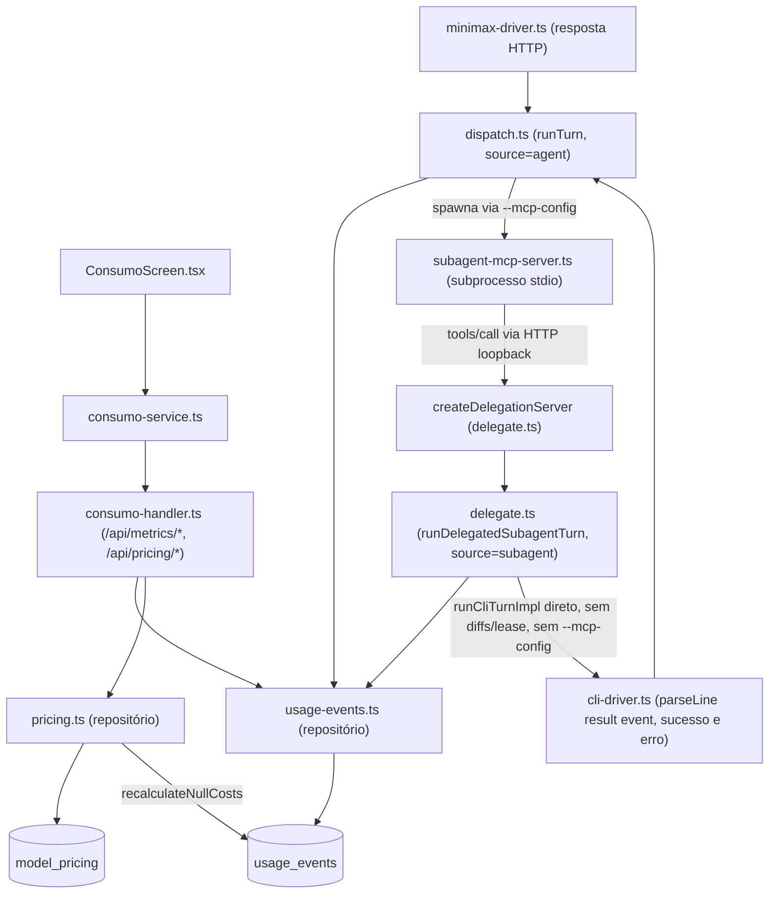

# Spec Técnica: F11. Consumo

## 1. Visão Geral Técnica

**O quê:** Tela global `#consumo` (tokens/custo por período, drill-down projeto → thread → evento, tabela de preços editável); o write path completo que a alimenta (duas tabelas novas, extração real de tokens/custo do resultado de cada turno, agente e subagent); e a execução real de `call_subagent` — hoje um esqueleto morto — via um MCP interno (`engrenacode`) que o EngrenaCode registra em `--mcp-config` para cada turno, fechando o gap F03/F07 em vez de deixá-lo pra depois.

**Por quê:** Hoje o EngrenaCode não grava nenhum dado de consumo e a delegação de subagent nunca roda de verdade. `CALL_SUBAGENT_TOOL_NAME = 'mcp__engrenacode__call_subagent'` (`subagent-registry.ts`) é citado no system prompt (`dispatch.ts:buildSystemPrompt`) mas **nunca registrado como MCP real** em `--mcp-config` — a CLI não tem essa ferramenta pra chamar. `startDelegatedRun`/`completeDelegatedRun`/`checkIdleTimeout` (`delegate.ts`) já existem e já são testados (`delegate.idle.test.ts`), mas nada no turno real os invoca; o branch `if (event.name === CALL_SUBAGENT_TOOL_NAME)` em `dispatch.ts` só reage a um `tool-start` que jamais acontece fora de teste. `subagent_runs.usage_json` é um blob opaco. Sem fechar isso, "F07: usage_events source=subagent" (Consome do PRD) e "share subagents > 0 após delegação" (PRD §9) são inatingíveis — não é possível medir o que nunca executa.

**Escopo:** PRD não define blocos Escopo Central / Adições ao Escopo Completo para F11 (`docs/PRD.md:485-509`) — escopo é a feature inteira (Capacidades + Experiência + Tratamento de Erros do PRD §F11 + critérios §9 linhas 698-706), **incluindo** fechar o gap de execução de `call_subagent` (ver §2/§3.2) e a captura de usage/custo em todo turno válido, sucesso ou erro (ver §3.2).

**Incluído:**
- Migração `005_consumo.ts`: tabelas `usage_events` e `model_pricing`.
- `ProviderTurnResult`/`ProviderError` ganham `usage`/`costUsd` opcionais; `cli-driver.ts` extrai do evento `result` do stream-json em **todo caminho** — sucesso e o `reject()` que carrega o payload de erro; `minimax-driver.ts` extrai da resposta HTTP.
- `dispatch.ts` grava `usage_event source='agent'` no turno concluído (sucesso ou `ProviderError` com usage anexado).
- Execução real de `call_subagent`: MCP interno `engrenacode` (subprocesso stdio, protocolo mínimo) + servidor de delegação loopback por turno (`delegate.ts`) que faz o gate, spawna o turno filho via `runCliTurnImpl`, aplica watchdog/idle, persiste `subagent_runs` + `usage_event source='subagent'`, e devolve o texto ao pai.
- Repositório `usage-events.ts` (agregações + `recalculateNullCosts`) e `pricing.ts` (CRUD `model_pricing`).
- Handler `consumo-handler.ts`: `GET /api/metrics/summary`, `GET /api/metrics/projects`, `GET /api/metrics/projects/:id`, `GET /api/metrics/threads/:id`, `GET /api/pricing`, `POST /api/pricing`, `PUT /api/pricing/:id`.
- Frontend: `ConsumoScreen.tsx` + `consumo-service.ts` conforme anatomia/tokens/copy já documentados.

**UI/copy — fonte de verdade:** `docs/F11-consumo/ui.md` (anatomia, tokens, estados, aceite visual) e `docs/F11-consumo/copy.md` (catálogo de strings por id `consumo.*`). Esta spec cita ids de copy e a anatomia documentada ali — não redescreve layout nem recopia texto.

**Excluído:** fatura real, budget alerts, export, repricing de eventos já custados (`sdk` ou `cost_usd` não-null), delete de preço, delegação com profundidade > 1 (estruturalmente impossível — ver §3.2), MCPs externos do projeto (F09) disponíveis para o subagent filho (ver §3.2), paralelismo entre `call_subagent` concorrentes no mesmo turno (serializados — ver §3.2).

## 2. Impacto na Arquitetura



Componentes afetados:
- `src/services/db/migrations/005_consumo.ts` (novo)
- `src/services/db/client.ts` (modificado — registra a migração)
- `src/services/db/repositories/usage-events.ts` (novo)
- `src/services/db/repositories/pricing.ts` (novo)
- `src/services/http/consumo-handler.ts` (novo)
- `src/services/http/unlock-handler.ts` (modificado — wiring de rota)
- `src/services/runner/providers/provider-types.ts` (modificado — `ProviderTurnResult`/`ProviderError` ganham `usage`/`costUsd`)
- `src/services/runner/providers/cli-driver.ts` (modificado — parse de `usage`/`total_cost_usd` no sucesso **e** no erro)
- `src/services/runner/providers/minimax-driver.ts` (modificado — parse de `usage` da resposta HTTP)
- `src/services/runner/subagent-mcp-server.ts` (novo — fonte do MCP stdio interno, mesmo padrão de `WRAPPER_SOURCE` em `mcp-secrets.ts`)
- `src/services/runner/delegate.ts` (modificado — `createDelegationServer`, `runDelegatedSubagentTurn`; mantém `startDelegatedRun`/`completeDelegatedRun`/`checkIdleTimeout` como estão)
- `src/services/runner/dispatch.ts` (modificado — `resolveBillingMode`, `turnId`, registra o MCP interno em `--mcp-config` quando há catálogo de subagents, persiste `usage_event source='agent'`, remove o branch morto `CALL_SUBAGENT_TOOL_NAME`)
- `src/services/runner/subagent-caller-gate.ts` (sem mudança de lógica — só muda o chamador, de `dispatch.ts` para `delegate.ts`)
- `src/renderer/screens/ConsumoScreen.tsx` (novo)
- `src/renderer/services/consumo-service.ts` (novo)
- `src/renderer/App.tsx` (modificado — rota `#consumo`)

## 3. Decisões Técnicas

### 3.1 Herdadas do codebase

Levantadas por exploração direta (sem `docs/_shared/codebase-patterns.md` — modo single-feature, sem lote):
- SQLite via `node:sqlite` (`DatabaseSync`), migrações numeradas registradas em `client.ts:MIGRATIONS`, tabela `schema_migrations` de controle, `PRAGMA foreign_keys = ON`.
- Migração: `CREATE TABLE IF NOT EXISTS` + `CREATE INDEX IF NOT EXISTS`, `CHECK (col IN (...))` para enums, PKs `TEXT` prefixadas (`log_<uuid>`), timestamps sempre `INTEGER NOT NULL` (epoch ms).
- Repositório: funções soltas, SQL cru via `.prepare().run/get/all()`, `RowType` snake_case → `toX()`; paginação `LIMIT @limit OFFSET @offset`.
- Handler HTTP: `guard()` (423/401), `sendJson`/`sendError` (`{error:{code,message}}`), roteamento por `url.split('?')[0]` + `method`, todas as rotas sob `/api/`.
- MCP: `--mcp-config` (schema oficial da Claude Code CLI, já confirmado via Context7 em F09) é o único canal de ferramentas externas para os providers CLI; `mcp-secrets.ts` já estabelece o padrão "wrapper stdio + servidor HTTP loopback com token aleatório por turno" para não vazar segredo em disco — F11 reusa a mesma forma (wrapper stdio + loopback) pra um propósito novo (executar delegação, não injetar segredo).
- Teste: vitest, `ENGRENACODE_USER_DATA` em `mkdtempSync` + imports dinâmicos, `fakeReq`/`fakeRes`, fixtures via repositórios reais.

Desvios desta feature: nenhum.

### 3.2 Específicas da feature

| Decisão | Abordagem Escolhida | Alternativa Considerada | Trade-off |
|---------|---------------------|--------------------------|-----------|
| Mapeamento provider → `billingMode` | `claude`: lê `claude:mode` do vault; `codex`: `'api-key'` se `keys:codex` salva, senão `'subscription'`; `kimi`: sempre `'subscription'`; `minimax`: sempre `'api-key'` | Minimax como `'token-plan'` | Confirmado com o usuário (entrevista). Card "Token plan" do `ui.md` fica sempre zerado neste MVP — não há provider `compat` no EngrenaCode |
| `cost_source='sdk'` só quando o CLI reporta custo válido | Só `provider==='claude'` E `total_cost_usd` numérico finito ≥0 no evento `result` (`ResultMessage`: `total_cost_usd`, `usage.{input_tokens,output_tokens,cache_read_input_tokens,cache_creation_input_tokens}` — confirmado via doc oficial Anthropic/Context7 `/anthropics/claude-code`) | Aplicar a mesma heurística a Codex/Kimi | Sem doc oficial confirmando que os CLIs Codex/Kimi populam os mesmos campos — Codex/Kimi/Minimax sempre calculam via `model_pricing` (`cost_source='table'`) |
| **Usage/custo capturados em todo turno válido, sucesso ou erro** | `ProviderError` ganha `usage?`/`costUsd?`; `cli-driver.ts` anexa esses campos no único `reject()` com acesso ao payload (`payload.type==='result' && payload.is_error===true`, que já carrega `usage`/`total_cost_usd` — confirmado via doc oficial: "Both success and error result messages include usage and total_cost_usd"); `dispatch.ts` persiste `usage_event source='agent'` no `catch`, antes de emitir `error`, quando `err instanceof ProviderError && err.usage` | Só capturar no caminho de sucesso | Descartado — "todo turno válido" (PRD §9) inclui turnos que falham no meio mas consumiram tokens reais; a doc oficial confirma que o payload já carrega isso, então não capturar seria simplesmente jogar dado fora que já está disponível |
| Coluna `model` em `usage_events` aceita `NULL` | Diverge do schema fonte (`NOT NULL`) | Fallback de nome fabricado | `Thread.model` já é opcional no EngrenaCode; UI trata ausência como `—` |
| `usage` ausente no `result` (Codex/Kimi sem o campo) | Turno completa normalmente; nenhum `usage_event` é gravado; `console.warn` loga | Bloquear o turno ou gravar tokens=0 | `input_tokens`/`output_tokens` são `NOT NULL` — gravar 0 mentiria; bloquear violaria a função central do app |
| **Execução real de `call_subagent` via MCP interno `engrenacode`** | `dispatch.ts`, quando `resolveSubagentCatalog(project.id)` não é vazio e o provider aceita `--mcp-config` (mesma exclusão de `MCP_UNSUPPORTED_PROVIDERS` do F09 — hoje só `minimax`), soma um `ResolvedMcpDef` stdio apontando pro script `subagent-mcp-server.ts` aos MCPs já resolvidos do projeto (F09) antes de `buildMcpConfigFile` | Continuar como esqueleto (branch morto) | É exatamente o gap que o usuário pediu pra fechar — sem isso `source='subagent'` nunca existe em produção |
| Protocolo do MCP interno: handshake mínimo à mão (`initialize`, `notifications/initialized`, `tools/list`, `tools/call`), stdio newline-delimited JSON-RPC | Confirmado contra a spec oficial do protocolo (Context7 `/modelcontextprotocol/modelcontextprotocol`: mensagens newline-delimited, sem newline embutido, servidor nunca escreve não-MCP em stdout, stderr livre pra log) | Dependência `@modelcontextprotocol/sdk` | Nenhuma outra parte do codebase tem dependência de SDK MCP (F09 só *consome* MCPs externos via `--mcp-config`, nunca implementou um); handshake mínimo é ~4 métodos, custo de manutenção baixo, zero dependência nova |
| `tools/call` do MCP interno reenvia para um servidor HTTP loopback efêmero por turno (`createDelegationServer`, `delegate.ts`) — mesmo padrão de `createSecretServer`/token aleatório de `mcp-secrets.ts` | Executar a delegação dentro do próprio subprocesso MCP (spawnando o filho ali) | O subprocesso MCP roda isolado (spawn próprio), sem acesso direto às conexões SQLite/vault/`emit` do processo principal do Electron — teria que reabrir tudo isso por subprocesso. O loopback devolve o `tools/call` pro processo principal, que já tem tudo isso montado |
| Gate de permissão (`canDelegateSubagent`) movido pra dentro do handler de delegação | Antes era checado em `dispatch.ts`'s `onEvent` **depois** que o `tool-start` já tinha acontecido — tarde demais pra impedir a chamada de verdade (dead code, só gerava a linha de `tool_call` como erro) | Manter o gate em `dispatch.ts` | Bloqueio real só é possível dentro do `tools/call` handler (retorna `isError:true`, a CLI reporta como `tool_result` de erro); o branch especial `CALL_SUBAGENT_TOOL_NAME` no `onEvent` de `dispatch.ts` é removido — o tratamento genérico de `tool-start`/`tool-result` já cobre bookkeeping (via `isErrorBlock`) |
| Filho roda via `runCliTurnImpl` direto, não via `runTurn` | Sem diffs, sem `acquireLease` própria, sem `--mcp-config` (nenhum MCP externo F09, nenhum `call_subagent` recursivo) | Reusar `runTurn` completo pro filho | `runTurn` é dono de diffs/lease/estado do turno **pai**; o filho é efêmero (mesmo raciocínio da fonte: "não reusa runDispatch — o filho é efêmero"). Omitir `--mcp-config` no filho é o mecanismo estrutural que impede profundidade > 1 |
| Timeout/idle do filho reusa `DelegatedRun`/`checkIdleTimeout` já implementados | `createDelegationServer` roda um `setInterval` de 30s chamando `checkIdleTimeout`; estouro aborta via o mesmo `AbortSignal` que `ProviderTurnInput`/`runCliTurnImpl` já suportam (mata o processo filho) | Implementar um watchdog novo (como o da fonte, mais elaborado) | `DelegatedRun`/`checkIdleTimeout`/`isHardCapped` já existem e já são testados (`delegate.idle.test.ts`) — só faltava alguém chamar em produção |
| `call_subagent`s do mesmo turno são **serializados** (fila FIFO no servidor de delegação), não paralelos | RW-lock por `cwd` como a fonte (leitores concorrentes, escritores exclusivos) | O sistema legado distingue subagent "read-only" (sem tools de escrita) de "write" pra permitir paralelismo seguro; o EngrenaCode não tem essa classificação de allowlist de tools hoje — replicar o RW-lock exigiria construir essa classificação primeiro. Serializar é simples, correto (zero risco de escrita concorrente na mesma working tree) e aceita o custo de turnos multi-subagent ficarem um pouco mais lentos |
| Filho não recebe MCPs externos do projeto (F09) | Herdar os MCPs do projeto pro filho | Fonte não é explícita sobre negar MCPs externos ao filho (só nega `subagents`/`delegate`) | Simplificação deliberada: herdar MCPs externos pro filho reabriria o mecanismo de wrapper de segredo (`mcp-secrets.ts`) recursivamente por child — custo de implementação alto pra um caso de uso (subagent usando MCP externo) que o PRD não pede explicitamente |
| Nome do MCP interno fixo: `engrenacode` | — | — | Já é o namespace hardcoded em `CALL_SUBAGENT_TOOL_NAME`; se um MCP externo (F09) com o mesmo nome existir no projeto, o interno é injetado por último em `buildMcpConfigFile` e vence — edge case aceito e documentado, não é bug |
| Rotas públicas sob `/api/metrics/*` + `/api/pricing/*`, um único `consumo-handler.ts` | Segue o prefixo `/api/` do EngrenaCode e o padrão de handler único multi-rota (`mcps-handler.ts`) | Handler por sub-recurso | Metrics e Pricing compartilham leitura (banner de preço ausente lê `usage_events`) |
| `id` de `model_pricing` determinístico: `` `price_${provider}_${model}` `` | `id` via `randomUUID()` | `(provider, model)` já é `UNIQUE` — id determinístico barateia idempotência de retry client-side |
| `turnId` gerado 1x por `runTurn()`, propagado ao filho como `parentTurnId` | Não introduzir `turnId` agora | Schema e critério PRD ("ligado a project/thread/turnId") exigem o conceito já nesta feature; agora a propagação é usada de verdade (delegação real existe) |

### 3.3 Assumptions

| Assumption | Origem | Pode sobrescrever? |
|------------|--------|--------------------|
| Mapeamento `billingMode` por provider (tabela 3.2) | Entrevista (usuário confirmou a opção recomendada) | sim |
| `usage`/`total_cost_usd` do Claude Code CLI seguem `ResultMessage` (`type:'result'`) | Doc oficial Anthropic via Context7 (`/anthropics/claude-code`) | sim, se a CLI mudar de versão/schema |
| Handshake stdio do MCP interno (`initialize`/`notifications/initialized`/`tools/list`/`tools/call`, newline-delimited JSON-RPC) | Spec oficial MCP via Context7 (`/modelcontextprotocol/modelcontextprotocol`) — **não testado neste ambiente contra um binário real da Claude Code CLI** (CLI não instalada aqui); comportamento assumido a partir do protocolo + precedente de sucesso do mecanismo de MCP externo do F09 (mesmo `--mcp-config`) | sim, se o smoke real (§7.2) revelar divergência |
| Minimax retorna `usage` no formato OpenAI-compat (`prompt_tokens`/`completion_tokens`/`total_tokens`) | Sem doc oficial confirmada — mesma ressalva já registrada em `docs/F10-api-keys-providers/spec.md` §3.3 | sim — confirmar contra doc oficial Minimax na implementação |
| Codex/Kimi CLI podem não popular `usage`/`total_cost_usd` no evento `result` | Sem precedente no codebase; `parseLine`/`buildArgs` assumem o mesmo formato pros três binários sem confirmação | sim |
| `ui.md`/`copy.md` já existem para F11 — anatomia e strings tratadas como respondidas | Passo 1.5b (arquivos lidos por completo) | não aplicável |

## 4. Visão Geral de Componentes

**Backend:**

| Caminho do Arquivo | Novo/Modificado | Propósito | Responsabilidades-Chave |
|---------------------|------------------|-----------|--------------------------|
| `src/services/db/migrations/005_consumo.ts` | Novo | Schema `usage_events` + `model_pricing` | Índices de agregação e do `recalculateNullCosts` (§6) |
| `src/services/db/client.ts` | Modificado | Registra `005_consumo` em `MIGRATIONS` | — |
| `src/services/db/repositories/usage-events.ts` | Novo | Leitura agregada + escrita de eventos | `createUsageEvent`, `getSummary`, `listProjects`, `getProjectDetail`, `getThreadEvents` (paginado), `recalculateNullCosts`, `distinctUnpricedModels` |
| `src/services/db/repositories/pricing.ts` | Novo | CRUD `model_pricing` | `createPricing`, `updatePricing`, `listPricing`, `findPricing`, `calculateTableCost` |
| `src/services/http/consumo-handler.ts` | Novo | `handleConsumoRequest(req,res): Promise<boolean>` | Roteia `/api/metrics/*` e `/api/pricing/*`; guard 423/401; validação `from`/`to`/`limit`/`offset` |
| `src/services/http/unlock-handler.ts` | Modificado | Wiring de `handleConsumoRequest` | Mesmo padrão de `handleLogsRequest`/`handleMcpsRequest` |
| `src/services/runner/providers/provider-types.ts` | Modificado | `ProviderTurnResult`/`ProviderError` ganham `usage?: {inputTokens,outputTokens,cacheReadTokens,cacheCreationTokens}` e `costUsd?: number \| null` | Contrato único consumido por `dispatch.ts` e `delegate.ts` |
| `src/services/runner/providers/cli-driver.ts` | Modificado | Extrai `usage`/`total_cost_usd` do evento `result` no sucesso **e** anexa ao `ProviderError` no `reject()` de erro | Único parser de stream-json |
| `src/services/runner/providers/minimax-driver.ts` | Modificado | Extrai `usage` da resposta HTTP | `costUsd` sempre `undefined` |
| `src/services/runner/subagent-mcp-server.ts` | Novo | Fonte do MCP stdio interno (`ensureSubagentMcpServerScript()`, análogo a `WRAPPER_SOURCE`) + `SubagentMcpToolSchema` (nome/descrição/`inputSchema` de `call_subagent`) | Lê stdin linha a linha, responde `initialize`/`tools/list`/`tools/call`; `tools/call` faz `POST` no loopback e devolve `{content:[{type:'text',text}]}` ou `{content:[...], isError:true}` |
| `src/services/runner/delegate.ts` | Modificado | `createDelegationServer(project, thread, turnId, subagentCatalog)` (loopback HTTP efêmero, token aleatório); `runDelegatedSubagentTurn(...)` (gate → `startDelegatedRun` → `runCliTurnImpl` do filho → watchdog `setInterval` 30s → `completeDelegatedRun` → `createUsageEvent source='subagent'` → `emit(subagent.start/result)`) | Mantém `startDelegatedRun`/`completeDelegatedRun`/`checkIdleTimeout`/`DelegatedRun` como estão — só ganham chamador real |
| `src/services/runner/dispatch.ts` | Modificado | `resolveBillingMode(provider)`; `turnId` por turno; quando há catálogo de subagents e o provider aceita `--mcp-config`, cria o servidor de delegação e injeta o MCP interno em `mcpsPrepared.resolved` antes de `buildMcpConfigFile`; persiste `usage_event source='agent'` (sucesso e erro); remove o branch morto `CALL_SUBAGENT_TOOL_NAME` do `onEvent` | Único ponto de escrita do lado agente; único ponto que monta `--mcp-config` |

**Frontend:**

| Caminho do Arquivo | Novo/Modificado | Propósito | Responsabilidades-Chave |
|---------------------|------------------|-----------|--------------------------|
| `src/renderer/screens/ConsumoScreen.tsx` | Novo | Tela `#consumo` | Anatomia/tokens/estados conforme `docs/F11-consumo/ui.md`; strings via `docs/F11-consumo/copy.md` (`consumo.*`) |
| `src/renderer/services/consumo-service.ts` | Novo | Client HTTP tipado | Espelha os 7 endpoints de `consumo-handler.ts`; converte seletor de período em `from`/`to` ISO |
| `src/renderer/App.tsx` | Modificado | Rota `#consumo` | Mesmo padrão das demais rotas de tela |

**Banco de Dados:**

| Arquivo de Migração | Tabelas Afetadas | Operação | Notas |
|-----------------------|-------------------|----------|-------|
| `005_consumo.ts` | `usage_events`, `model_pricing` | CREATE | Ver Seção 6 |

## 5. Contratos de API

Todas as rotas públicas exigem header `x-engrenacode-session`; guard idêntico ao resto do app: cofre travado → 423 `vault_locked`; sessão ausente/inválida → 401 `unauthorized`. Envelope de erro: `{ "error": { "code": "...", "message": "..." } }`. (O servidor de delegação do §3.2/§4 é loopback interno por turno, autenticado por token aleatório de processo — não é uma rota pública e não entra nesta seção.)

Query comum a todo endpoint de métricas: `from`/`to` (opcionais, ISO 8601 com timezone; ausentes = sem filtro de período). `from > to` → 400 `validation_error`.

### 5.1 Métricas

**Endpoint: Resumo do período**
- **Método:** GET
- **Caminho:** `/api/metrics/summary`

**Requisição (query):**

| Campo | Tipo | Obrigatório | Validação | Descrição |
|-------|------|-------------|-----------|-----------|
| `from` | `string` (ISO 8601) | Não | timezone obrigatório se presente | Início do período |
| `to` | `string` (ISO 8601) | Não | timezone obrigatório se presente; `from <= to` | Fim do período |

**Resposta (200):**

| Campo | Tipo | Descrição |
|-------|------|-----------|
| `byBillingMode.subscription.costUsd` / `.apiKey.costUsd` / `.tokenPlan.costUsd` | `number \| null` | Custo por modo (`null` se sem custo disponível no recorte) |
| `tokens.input` / `.output` | `integer` | Totais |
| `cacheReadPercent` | `number \| null` | `cacheReadTokens / totalTokens * 100`, `null` se `totalTokens=0` |
| `threads.active` / `.total` | `integer` | Threads com evento no período (`active` = `state IN ('running','stopping')`) |
| `partial` | `boolean` | `true` se houver evento com `cost_usd IS NULL` no recorte |

```json
{
  "byBillingMode": {
    "subscription": { "costUsd": 4.21, "approximate": false },
    "apiKey": { "costUsd": 1.03, "approximate": false },
    "tokenPlan": { "costUsd": null, "approximate": false }
  },
  "tokens": { "input": 128400, "output": 34210 },
  "cacheReadPercent": 42.3,
  "threads": { "active": 2, "total": 11 },
  "partial": false
}
```

**Endpoint: Lista de projetos**
- **Método:** GET
- **Caminho:** `/api/metrics/projects`

**Resposta (200):** array de `{ projectId, projectName, costUsd, costPartial, totalTokens, threadCount, cacheReadPercent, lastEventAt }`, ordenado por `totalTokens DESC`.

**Endpoint: Detalhe de projeto (threads)**
- **Método:** GET
- **Caminho:** `/api/metrics/projects/:id`

**Resposta (200):** array de `{ threadId, threadTitle, providers[], models[], agentTokens, subagentTokens, agentCostUsd, subagentCostUsd, agentPricingComplete, subagentPricingComplete, lastEventAt }` — `share = subagentCostUsd / (agentCostUsd + subagentCostUsd)` calculado no frontend só quando ambos `*PricingComplete=true` (`ui.md` §Formatação de custo).

**Endpoint: Eventos de uma thread (paginado)**
- **Método:** GET
- **Caminho:** `/api/metrics/threads/:id`

**Requisição (query):** `from`/`to` (igual acima) + paginação:

| Campo | Tipo | Obrigatório | Validação | Descrição |
|-------|------|-------------|-----------|-----------|
| `limit` | `integer` | Não | inteiro 1–500 (default 100) | Página |
| `offset` | `integer` | Não | inteiro ≥0 (default 0) | Offset |

**Resposta (200):**

| Campo | Tipo | Descrição |
|-------|------|-----------|
| `events[]` | `array` | `{ id, createdAt, turnId, source, subagentName, provider, model, billingMode, inputTokens, outputTokens, cacheReadTokens, cacheCreationTokens, totalTokens, costUsd, costSource, costApproximate }` |
| `page.limit` / `.offset` | `integer` | Ecoa a paginação pedida |
| `page.hasMore` | `boolean` | `offset + events.length < totalCount` |

**Códigos de erro (todos os endpoints de métricas):**

| Código | Status HTTP | Descrição |
|--------|-------------|-----------|
| `vault_locked` | 423 | Cofre travado |
| `unauthorized` | 401 | Sessão ausente/inválida |
| `validation_error` | 400 | `from`/`to` malformado, `from > to`, `limit` fora de 1–500, `offset < 0` ou não-inteiro |
| `not_found` | 404 | `projectId`/`threadId` inexistente (rotas `:id`) |
| `internal_error` | 500 | Erro não tratado |

### 5.2 Preços

**Endpoint: Listar preços**
- **Método:** GET
- **Caminho:** `/api/pricing`
- **Resposta (200):** `{ pricing: [{ id, provider, model, inputPerMTok, outputPerMTok, cacheReadPerMTok, cacheWritePerMTok, approximate, source, updatedAt }], unpricedModels: [{ provider, model }] }` — `unpricedModels` = pares `(provider, model)` distintos observados em `usage_events` sem linha correspondente em `model_pricing`.

**Endpoint: Cadastrar preço**
- **Método:** POST
- **Caminho:** `/api/pricing`

**Requisição:**

| Campo | Tipo | Obrigatório | Validação | Descrição |
|-------|------|-------------|-----------|-----------|
| `provider` | `string` | Sim | não vazio | Provider observado |
| `model` | `string` | Sim | não vazio | Modelo observado |
| `inputPerMTok` | `number` | Sim | ≥0 | USD por milhão de tokens de entrada |
| `outputPerMTok` | `number` | Sim | ≥0 | USD por milhão de tokens de saída |
| `cacheReadPerMTok` | `number` | Não | ≥0 se presente | vazio → `null` |
| `cacheWritePerMTok` | `number` | Não | ≥0 se presente | vazio → `null` |
| `approximate` | `boolean` | Não | — | default `false` |
| `source` | `string` | Não | trim; vazio → `null` | anotação livre |

```json
{ "provider": "anthropic", "model": "claude-sonnet-4-6", "inputPerMTok": 3, "outputPerMTok": 15, "approximate": false }
```

**Resposta (201):** `{ pricing: {...}, recalculatedEvents: number }` — `recalculatedEvents` = linhas de `usage_events` com `cost_usd IS NULL AND cost_source='table'` para esse `(provider, model)` que foram preenchidas (§6).

**Endpoint: Atualizar preço**
- **Método:** PUT
- **Caminho:** `/api/pricing/:id`
- **Requisição:** mesmos campos do POST, todos opcionais (merge parcial) exceto `provider`/`model` (imutáveis após criação).
- **Resposta (200):** `{ pricing: {...}, recalculatedEvents: number }`

**Códigos de erro:**

| Código | Status HTTP | Descrição |
|--------|-------------|-----------|
| `validation_error` | 400 | Campos obrigatórios ausentes ou negativos |
| `pricing_conflict` | 409 | `(provider, model)` já existe (só no POST) |
| `not_found` | 404 | `id` inexistente (PUT) |
| `vault_locked` / `unauthorized` / `internal_error` | 423 / 401 / 500 | Igual §5.1 |

## 6. Modelo de Dados

**Tabela: `usage_events`**

| Coluna | Tipo | Nullable | Padrão | Descrição |
|--------|------|----------|--------|-----------|
| `id` | `TEXT` | Não | — | `usage_<uuid>` |
| `turn_id` | `TEXT` | Não | — | 1 `turnId` por `runTurn()`; agente e seus subagents compartilham o mesmo |
| `project_id` | `TEXT` | Não | — | FK `projects(id)` |
| `thread_id` | `TEXT` | Não | — | FK `threads(id)` |
| `source` | `TEXT` | Não | — | `'agent'` \| `'subagent'` |
| `subagent_name` | `TEXT` | Sim | `NULL` | Preenchido só quando `source='subagent'` |
| `provider` | `TEXT` | Não | — | `ThreadProvider` |
| `model` | `TEXT` | Sim | `NULL` | `Thread.model`/`Subagent.model` já são opcionais |
| `billing_mode` | `TEXT` | Não | — | `'subscription'` \| `'api-key'` \| `'token-plan'` |
| `input_tokens` | `INTEGER` | Não | — | |
| `output_tokens` | `INTEGER` | Não | — | |
| `cache_read_tokens` | `INTEGER` | Sim | `NULL` | |
| `cache_creation_tokens` | `INTEGER` | Sim | `NULL` | |
| `total_tokens` | `INTEGER` | Não | — | Somado na escrita |
| `cost_usd` | `REAL` | Sim | `NULL` | `NULL` = sem preço disponível para o recorte |
| `cost_source` | `TEXT` | Não | `'table'` | `'sdk'` \| `'table'` |
| `cost_approximate` | `INTEGER` | Não | `0` | booleano SQLite |
| `created_at` | `INTEGER` | Não | — | epoch ms |

**Índices:**

| Nome do Índice | Colunas | Tipo | Propósito |
|----------------|---------|------|-----------|
| `ix_usage_events_project` | `(project_id, created_at)` | btree | `GET /api/metrics/projects` |
| `ix_usage_events_thread` | `(thread_id, created_at)` | btree | `GET /api/metrics/threads/:id` (paginação) |
| `ix_usage_events_turn` | `(thread_id, turn_id)` | btree | Agrupar agente + subagents do mesmo turno |
| `ix_usage_events_nullcost` | `(provider, model)` WHERE `cost_usd IS NULL AND cost_source='table'` | parcial | `recalculateNullCosts` e `distinctUnpricedModels` sem full scan |

**Constraints:**

| Constraint | Tipo | Definição | Propósito |
|-----------|------|-----------|-----------|
| `pk_usage_events` | PRIMARY KEY | `id` | Identificador único |
| `fk_usage_events_project` | FOREIGN KEY | `project_id REFERENCES projects(id) ON DELETE CASCADE` | Limpeza em cascata |
| `fk_usage_events_thread` | FOREIGN KEY | `thread_id REFERENCES threads(id) ON DELETE CASCADE` | Idem |
| `ck_usage_events_source` | CHECK | `source IN ('agent','subagent')` | Enum |
| `ck_usage_events_billing_mode` | CHECK | `billing_mode IN ('subscription','api-key','token-plan')` | Enum |
| `ck_usage_events_cost_source` | CHECK | `cost_source IN ('sdk','table')` | Enum |

**Tabela: `model_pricing`**

| Coluna | Tipo | Nullable | Padrão | Descrição |
|--------|------|----------|--------|-----------|
| `id` | `TEXT` | Não | — | `price_<provider>_<model>` sanitizado |
| `provider` | `TEXT` | Não | — | |
| `model` | `TEXT` | Não | — | |
| `input_per_mtok` | `REAL` | Não | — | USD |
| `output_per_mtok` | `REAL` | Não | — | USD |
| `cache_read_per_mtok` | `REAL` | Sim | `NULL` | Fallback: `input_per_mtok` no cálculo |
| `cache_write_per_mtok` | `REAL` | Sim | `NULL` | Fallback: `input_per_mtok` no cálculo |
| `approximate` | `INTEGER` | Não | `0` | booleano SQLite |
| `source` | `TEXT` | Sim | `NULL` | Anotação livre |
| `created_at` | `INTEGER` | Não | — | epoch ms |
| `updated_at` | `INTEGER` | Não | — | epoch ms; setado manualmente pelo repositório no `UPDATE` (sem trigger) |

**Constraints:**

| Constraint | Tipo | Definição | Propósito |
|-----------|------|-----------|-----------|
| `pk_model_pricing` | PRIMARY KEY | `id` | |
| `uq_model_pricing_provider_model` | UNIQUE | `(provider, model)` | 1 preço por par; base de `pricing_conflict` (409) |

**Exemplo de Migração (`005_consumo.ts`):**
```sql
CREATE TABLE IF NOT EXISTS usage_events (
  id TEXT PRIMARY KEY,
  turn_id TEXT NOT NULL,
  project_id TEXT NOT NULL REFERENCES projects(id) ON DELETE CASCADE,
  thread_id TEXT NOT NULL REFERENCES threads(id) ON DELETE CASCADE,
  source TEXT NOT NULL CHECK (source IN ('agent','subagent')),
  subagent_name TEXT,
  provider TEXT NOT NULL,
  model TEXT,
  billing_mode TEXT NOT NULL CHECK (billing_mode IN ('subscription','api-key','token-plan')),
  input_tokens INTEGER NOT NULL,
  output_tokens INTEGER NOT NULL,
  cache_read_tokens INTEGER,
  cache_creation_tokens INTEGER,
  total_tokens INTEGER NOT NULL,
  cost_usd REAL,
  cost_source TEXT NOT NULL DEFAULT 'table' CHECK (cost_source IN ('sdk','table')),
  cost_approximate INTEGER NOT NULL DEFAULT 0,
  created_at INTEGER NOT NULL
);

CREATE INDEX IF NOT EXISTS ix_usage_events_project ON usage_events(project_id, created_at);
CREATE INDEX IF NOT EXISTS ix_usage_events_thread ON usage_events(thread_id, created_at);
CREATE INDEX IF NOT EXISTS ix_usage_events_turn ON usage_events(thread_id, turn_id);
CREATE INDEX IF NOT EXISTS ix_usage_events_nullcost ON usage_events(provider, model)
  WHERE cost_usd IS NULL AND cost_source = 'table';

CREATE TABLE IF NOT EXISTS model_pricing (
  id TEXT PRIMARY KEY,
  provider TEXT NOT NULL,
  model TEXT NOT NULL,
  input_per_mtok REAL NOT NULL,
  output_per_mtok REAL NOT NULL,
  cache_read_per_mtok REAL,
  cache_write_per_mtok REAL,
  approximate INTEGER NOT NULL DEFAULT 0,
  source TEXT,
  created_at INTEGER NOT NULL,
  updated_at INTEGER NOT NULL,
  UNIQUE(provider, model)
);
```

**`recalculateNullCosts(provider, model, pricing)`** (em `usage-events.ts`, chamada por `pricing.ts` logo após criar/atualizar preço, dentro de transação):
1. `SELECT id, input_tokens, output_tokens, cache_read_tokens, cache_creation_tokens FROM usage_events WHERE provider=? AND model=? AND cost_usd IS NULL AND cost_source='table'`.
2. Para cada linha: `costUsd = (uncachedInput * inputPerMTok + cacheReadTokens * (cacheReadPerMTok ?? inputPerMTok) + cacheCreationTokens * (cacheWritePerMTok ?? inputPerMTok) + outputTokens * outputPerMTok) / 1_000_000`, `uncachedInput = max(0, inputTokens - cacheReadTokens - cacheCreationTokens)`.
3. `UPDATE usage_events SET cost_usd=@costUsd, cost_approximate=@costApproximate WHERE id=@id AND cost_usd IS NULL AND cost_source='table'` (cláusula dupla = guarda contra corrida).
4. Retorna a contagem de linhas afetadas.

Congelamento: linhas com `cost_source='sdk'` OU `cost_usd` já não-null nunca são tocadas.

## 7. Estratégia de Testes

### 7.1 Unitário / Integração

| Arquivo de Teste | Tipo | Alvo | Objetivo de Cobertura |
|-------------------|------|------|------------------------|
| `src/services/db/repositories/usage-events.test.ts` | Integração (DB temp real) | `usage-events.ts` | Agregações, paginação, `recalculateNullCosts` |
| `src/services/db/repositories/pricing.test.ts` | Idem | `pricing.ts` | CRUD, unicidade `(provider,model)` |
| `src/services/http/consumo-handler.test.ts` | Idem | `consumo-handler.ts` | 401/423, validação, 404, `pricing_conflict` |
| `src/services/runner/providers/cli-driver.test.ts` (estendido) | Unitário | `parseLine`/`runCliTurn` | Extração de `usage`/`total_cost_usd` no sucesso; **novo:** `ProviderError` carrega `usage`/`costUsd` quando o `result` de erro os inclui; ausência de `usage` não quebra o turno |
| `src/services/runner/providers/minimax-driver.test.ts` (estendido) | Unitário | `runHttpTurn` | Extração de `usage`; `costUsd` sempre `undefined` |
| `src/services/runner/subagent-mcp-server.test.ts` (novo) | Unitário | Protocolo stdio | `initialize`/`tools/list`/`tools/call` respondem no formato esperado; `tools/call` sem servidor de delegação disponível → erro tratado, não crash |
| `src/services/runner/delegate.test.ts` (novo, ao lado de `delegate.idle.test.ts`) | Integração (DB temp real) | `createDelegationServer`/`runDelegatedSubagentTurn` | Gate bloqueia (Codex sem full-access) → `isError:true`, nenhum `usage_event`; sucesso → `subagent_runs` + `usage_event source='subagent'` gravados, `parentTurnId` correto; timeout idle aborta via signal e marca `status='timeout'`; 2 chamadas concorrentes no mesmo turno são serializadas (segunda só inicia após a primeira concluir) |
| `src/services/runner/dispatch.test.ts` (estendido/reescrito) | Integração | `runTurn` | `resolveBillingMode` por provider; grava `usage_event source='agent'` no sucesso **e** no erro com `usage` anexado; quando há subagents, `buildMcpConfigFile` recebe o MCP interno; teste antigo "blocks call_subagent for a Codex parent" migra pra `delegate.test.ts` (gate mudou de lugar — ver §3.2) |

**Funções de teste representativas:**

| Função de Teste | Descrição | Assertions |
|-------------------|-----------|-----------|
| `recalculateNullCosts atualiza só linhas table+null` | Preço cadastrado com eventos `sdk`/`table` misturados | Só `table`+`null` recalcula |
| `getThreadEvents pagina 1–500` | `limit=501`/`0`, `offset=-1` | 400 `validation_error` |
| `POST /api/pricing rejeita par duplicado` | Cria 2x o mesmo `(provider,model)` | 409 `pricing_conflict` |
| `resolveBillingMode('codex')` sem key | `keys:codex` ausente | `'subscription'` |
| `runCliTurn com is_error e usage no payload` | `result` com `is_error:true` + `usage`/`total_cost_usd` | `ProviderError.usage`/`.costUsd` populados |
| `runDelegatedSubagentTurn grava source=subagent` | Filho completa com `usage` no resultado | `usage_events` ganha 1 linha `source='subagent'`, `subagent_name` correto, `turn_id = parentTurnId` |
| `runDelegatedSubagentTurn bloqueia Codex sem full-access` | `canDelegateSubagent` retorna `allowed:false` | `tools/call` retorna `isError:true`; nenhuma linha em `subagent_runs`/`usage_events` |
| `2 call_subagent concorrentes serializam` | Duas chamadas simultâneas no mesmo turno | Segunda só inicia (`startDelegatedRun`) após `completeDelegatedRun` da primeira |

### 7.2 Smoke / Aceitação manual

| # | Passo | Resultado esperado |
|---|-------|---------------------|
| 1 | Unlock → rodar 1 turno real com Claude (assinatura) em projeto fixture → abrir `#consumo` | Card "Assinatura (estimado)" e "Tokens in/out" refletem o turno; `cost_source='sdk'` na linha (inspeção do DB do fixture) |
| 2 | Projeto fixture com 1 subagent cadastrado e linkado → turno que dispara `call_subagent` de verdade | `subagent_runs` ganha linha `completed`; `usage_events` ganha linha `source='subagent'` com `subagent_name`; `#consumo` mostra share subagent > 0 no drill-down da thread |
| 3 | Turno com Codex + access level `supervised` que tenta `call_subagent` | Tool result vem com erro (bloqueio do gate); nenhuma linha nova em `subagent_runs`/`usage_events`; turno pai continua normalmente |
| 4 | Trocar período 7d/30d/Tudo | Cards e tabela Projetos repropagam sem reload |
| 5 | Clicar projeto → thread → evento | Drill-down abre na ordem `ui.md`; paginação só com `hasMore=true` |
| 6 | Cadastrar preço para par sem preço (banner) | Banner some, `recalculatedEvents` > 0 refletido nos totais |
| 7 | Editar preço de par já custado | Total do evento já existente não muda (congelamento) |
| 8 | Cofre travado ao abrir `#consumo` | `consumo.error.generic` + retry; reconecta após unlock |
| 9 | Light/dark em `#consumo` | Bate com `docs/F11-consumo/ui.md`; copy 100% vs `docs/F11-consumo/copy.md` |

### 7.3 Cross-feature

| Critério | Status | Nota |
|----------|--------|------|
| Tokens/padrões de superfície F01.1 renderizam `#consumo` | ready | F01.1 implementada |
| `usage_events` do Workspace (F03) agregam em `#consumo` (`source='agent'`) | ready | Turno normal via `dispatch.ts` |
| `usage_events` de SubAgents (F07) agregam em `#consumo` (`source='subagent'`), share > 0 após delegação | **ready** | Gap de execução real de `call_subagent` fechado nesta feature (§2/§3.2/§4) — `delegate.ts` agora spawna o filho de verdade |
| Claude com custo SDK grava `cost_source='sdk'`; demais usam `table` ou `null` | ready | §3.2, confirmado via doc oficial Claude Code |
| Editar preço preenche só `null`s de `table`; eventos `sdk` e já precificados intactos | ready | `recalculateNullCosts` (§6) |

## Relacionados

| Doc | Papel |
|-----|-------|
| `docs/F11-consumo/ui.md` | Anatomia, tokens, estados, aceite visual da tela `#consumo` |
| `docs/F11-consumo/copy.md` | Catálogo de strings literais `consumo.*` |
| `docs/F11-consumo/plan.md` | Ordem de implementação |
| `docs/F03-workspace/spec.md` | `dispatch.ts`/`runTurn`, origem dos `usage_events source='agent'` |
| `docs/F07-subagents/spec.md` | `delegate.ts`/`subagent_runs`, origem dos `usage_events source='subagent'` — execução real fechada por F11 |
| `docs/F09-mcps/spec.md` | `--mcp-config`, `mcp-secrets.ts` (padrão wrapper stdio + loopback reusado por `subagent-mcp-server.ts`) |
| `docs/F10-api-keys-providers/spec.md` | `resolveProviderApiKey`, `claude:mode`, secrets do vault reusados por `resolveBillingMode` |
| `docs/PRD.md` §F11 (linhas 172-176, 485-509), §9 (linhas 698-720) | Capacidades e critérios de aceite de produto |
