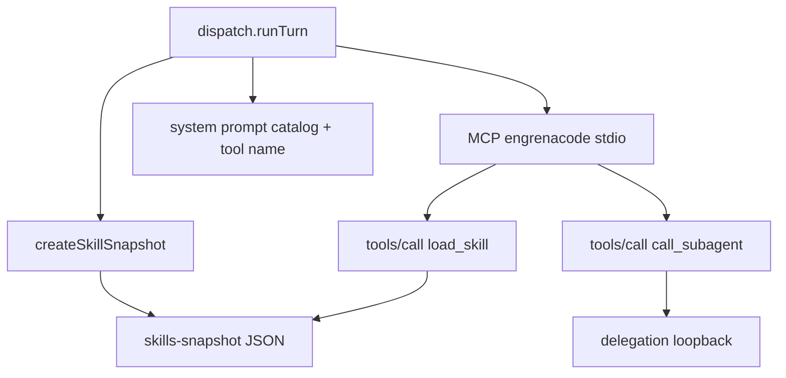

# F12. Runtime de Skills (load_skill) — Especificação Técnica

**Feature:** F12 Runtime de Skills (load_skill)  
**Complexidade:** simples  
**Escopo:** fechar o gap de F05 — registrar a tool `load_skill` de verdade no turno  
**UI:** sem tela nova (`ui.md`/`copy.md` N/A — só notice WS reutilizando padrão `mcp.notice`)  
**Última atualização:** 2026-08-06  
**Auditoria:** [`docs/AUDIT-PRD-S9-MIGRATION.md`](../AUDIT-PRD-S9-MIGRATION.md)

---

## 1. Visão Geral Técnica

**O quê:** Registrar a tool `mcp__engrenacode__load_skill` no ambiente MCP do turno, lendo o content de um **snapshot imutável** criado no início do turno a partir das skills vinculadas/habilitadas (F05). O agente deixa de ver só nomes no system prompt e passa a carregar markdown sob demanda.

**Por quê:** Hoje `createSkillSnapshot` existe e o catálogo é injetado no prompt, mas `loadSkill()` nunca é exposto como tool — critério F05/F12 falha na prática.

**Escopo:**

### Incluído

- Estender o MCP interno `engrenacode` (já usado por `call_subagent`) com a tool `load_skill`
- Snapshot JSON em disco por turno; tool só resolve nomes do snapshot
- Wiring em `dispatch.ts` quando `catalog.length ≥ 1` e o provider aceita `--mcp-config`
- Notice âmbar (`mcp.notice`) se o provider for `MCP_UNSUPPORTED` (hoje `minimax`) e houver skills
- Atualizar o bloco do system prompt para citar a tool pelo nome estável
- Testes unitários + subprocesso MCP real (mesmo padrão F11)

### Fora

- Compactação agressiva de tool result no histórico (opcional PRD; defer se não couber na fase)
- UI dedicada / banner além de `mcp.notice`
- Seeds (F17), worktree (F13), inline Codex-only paths separados (Codex usa o mesmo `--mcp-config` quando suportado)
- Materializar skills como arquivos `.md` no cwd

---

## 2. Impacto na Arquitetura

| Área | Caminhos |
|------|----------|
| Runner MCP | `src/services/runner/subagent-mcp-server.ts` (estender → tools dual) |
| Registry | `src/services/runner/skill-registry.ts` (const tool name + helper write snapshot) |
| Dispatch | `src/services/runner/dispatch.ts` |
| Testes | `skill-mcp` / extensão `subagent-mcp-server.test.ts`, `dispatch.test.ts`, `skill-registry.test.ts` |



---

## 3. Decisões Técnicas

| Decisão | Escolhida | Alternativa | Trade-off |
|---------|-----------|-------------|-----------|
| Namespace MCP | Reusar `engrenacode` + tool `load_skill` | MCP `engrenacode-skills` separado | Evita colisão de dois servers com o mesmo nome no `--mcp-config` |
| Snapshot | Arquivo JSON temp por turno (`--skills-snapshot`) | HTTP loopback | Simples, imutável, sem segundo server |
| Providers sem MCP | `minimax` → notice + catálogo só no prompt | Inline content no prompt | Alinhado a F09 `MCP_UNSUPPORTED_PROVIDERS` |
| Unificar MCP | Um `ResolvedMcpDef` se skills **ou** subagents | Dois servers | Obrigatório: nome único `engrenacode` |
| Compactação result | Defer (soft) | Stub imediato | Foco no AC de entrega de content |

### Assumptions

- F05 catálogo/CRUD e `createSkillSnapshot` já existem e estão corretos
- F03/F11 MCP interno + `prepareMcpsForDispatch` / `runCliTurnImpl` já aceitam `mcpServers`
- `ui.md`/`copy.md` não necessários (sem tela nova)

---

## 4. Visão Geral de Componentes

| Caminho | Novo/Mod | Propósito |
|---------|----------|-----------|
| `src/services/runner/skill-registry.ts` | Mod | `LOAD_SKILL_TOOL_NAME`, `writeSkillSnapshotFile(snapshot) → path` |
| `src/services/runner/subagent-mcp-server.ts` | Mod | Script lista/chama `load_skill` e/ou `call_subagent`; `buildEngrenaCodeMcpDef` |
| `src/services/runner/dispatch.ts` | Mod | Snapshot + MCP wiring unificado; prompt cita tool |
| `src/services/runner/subagent-mcp-server.test.ts` | Mod | Casos `load_skill` sucesso/erro |
| `src/services/runner/dispatch.test.ts` | Mod | Assert `mcpServers` inclui engrenacode quando há skill vinculada |
| `src/services/runner/skill-registry.test.ts` | Mod | write snapshot round-trip |

---

## 5. Contratos

### Tool `load_skill` (MCP)

- **Nome MCP tool:** `load_skill` → nome completo no harness Claude: `mcp__engrenacode__load_skill`
- **Input:** `{ name: string }` (required)
- **Sucesso:** `{ content: [{ type: 'text', text: '<markdown>' }], isError: false }`
- **Erro (nome ausente):** `{ content: [{ type: 'text', text: 'Skill não encontrada neste projeto' }], isError: true }`

### Snapshot file

```json
{ "skills": { "<name>": "<content markdown>" } }
```

Escrito sob `ENGRENACODE_USER_DATA` / `userData` com mode `0o600`; path passado via `--skills-snapshot`.

### `buildEngrenaCodeMcpDef` (evolução de `buildSubagentMcpDef`)

```ts
buildEngrenaCodeMcpDef(opts: {
  skillsSnapshotPath?: string
  port?: number
  token?: string
}): ResolvedMcpDef
```

Pelo menos um de `skillsSnapshotPath` ou (`port`+`token`) deve estar presente.

### WS notice (provider unsupported)

Reusa `mcp.notice` com `mcpName: 'engrenacode'`, `reason` estável (ex.: `provider_unsupported`) e mensagem clara de que `load_skill` não está disponível neste provider.

---

## 6. Modelo de Dados

Sem migração SQLite. Snapshot é artefato efêmero de turno (arquivo), não tabela.

---

## 7. Testes

| Caso | Onde |
|------|------|
| `tools/list` inclui `load_skill` quando `--skills-snapshot` | subprocesso MCP |
| `tools/call load_skill` devolve content do snapshot | subprocesso MCP |
| Nome inexistente → `isError: true` + mensagem PT | subprocesso MCP |
| `tools/list` inclui ambos quando snapshot + port/token | subprocesso MCP |
| Dispatch com skill vinculada passa MCP `engrenacode` ao driver | `dispatch.test.ts` |
| Dispatch minimax + skill emite notice e **não** registra MCP interno de skills | `dispatch.test.ts` |
| Snapshot file round-trip | `skill-registry.test.ts` |

**Gate:** `pnpm test` (área runner) + `tsc -b` verdes.

**Smoke E2E com binário claude real:** desejável mas não bloqueante se unitário de protocolo + dispatch mock cobrirem o wiring (mesmo critério residual de F11 para `call_subagent`).
