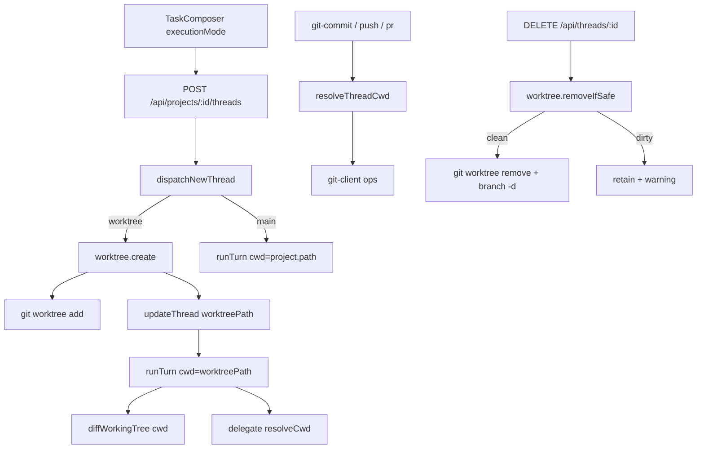

# Spec: Isolamento Worktree

**Feature:** F13 Isolamento Worktree  
**Complexidade:** médio  
**Escopo:** completo (PRD sem divisão Central/Completo)  
**Fonte PRD:** `docs/PRD.md` → F13  
**UI:** `ui.md`/`copy.md` presentes — fonte de verdade de anatomia/copy citada por path (ver §4 Frontend)  
**Última atualização:** 2026-08-06

---

## 1. Visão Geral Técnica

**O quê:** Fechar o gap em que `executionMode=worktree` já é aceito e o dispatch já *consumiria* `worktreePath` se existisse, mas nenhum `git worktree` é criado. No primeiro envio com mode worktree, criar árvore isolada sob userData, persistir `worktreePath` na thread e usá-lo como cwd de agent, subagent, diffs e git. Em `main`, continuar em `project.path`. Ao apagar a thread, limpar worktree/branch quando seguro.

**Por quê:** Hoje um dispatch com `executionMode=worktree` cai em `project.path` porque `worktreePath` fica `null` — o isolamento é fantasma. Critérios §9 F13 e cross-feature F03↔F13 falham até haver criação real + cwd unificado + cleanup.

**Escopo:**

### Incluído

- Criação de `git worktree` no primeiro envio com `executionMode=worktree`
- Persistência de `worktreePath` na thread; `executionMode` continua travado após o 1º envio (já F03)
- Cwd unificado: dispatch, delegate (subagent), `diffWorkingTree`, accept/reject e handlers git usam `worktreePath` quando mode=worktree
- `executionMode=main` sem criar worktree
- `DELETE /api/threads/:id` com cleanup de worktree/branch (seguro vs sujo)
- Contratos de erro HTTP alinhados ao Tratamento de Erros do PRD
- Frontend: badge “Worktree” no `ProjectTree` (linha da thread, ao lado do state dot) e seletor Execution só pré-1º envio, conforme anatomia/copy de `ui.md`/`copy.md`

### Fora

- Write-parallel de filhos em worktrees separados (PRD §7 / fora F13)
- Merge-tree / workflows multi-estágio
- Anatomia visual ou strings finais de UI (pendente `ui.md`/`copy.md`)
- Textgen de commit/PR (F14)
- Alteração do schema SQLite (`worktree_path` já existe em `002_workspace_core`)

### Consome (PRD)

- F01.1: tokens/mensagens de erro no composer/workspace (superfície; copy final via design)
- F03: thread com `executionMode`, dispatch, diffs, lease e git

### Provê (PRD)

- `worktreePath` persistido e cwd de agent/subagent/diffs/git quando `executionMode=worktree` (consumido por F03 e F15)

---

## 2. Impacto na Arquitetura

| Área | Caminhos |
|------|----------|
| Git worktree | `src/services/git/git-client.ts`, `src/services/git/worktree.ts` (novo) |
| Dispatch | `src/services/runner/dispatch.ts` |
| Delegate cwd | `src/services/runner/delegate.ts` (já herda; regressão) |
| Diffs | `src/services/runner/apply-diff.ts` (já usa `diff.worktreePath`) |
| HTTP threads | `src/services/http/threads-handler.ts` |
| HTTP git | `src/services/http/git-handler.ts` |
| Repo threads | `src/services/db/repositories/threads.ts` |
| Renderer (contrato) | `src/renderer/services/threads-service.ts`, `src/renderer/components/workspace/TaskComposer.tsx`, `src/renderer/components/workspace/WorkspaceSidebar.tsx` |
| Testes | `*.test.ts` co-localizados nos módulos acima |



---

## 3. Decisões Técnicas

### 3.1 Herdadas do brief / docs canônicos

Padrões herdados de `docs/_shared/codebase-patterns.md` (e docs canônicos listados no brief).

**Desvios / delta desta feature:**

- Schema `threads.worktree_path` / `diffs.worktree_path` já existe — sem nova migration
- `dispatch.ts` já resolve `cwd = worktreePath ?? project.path` quando mode=worktree; falta *criar* e persistir o path antes de `runTurn`
- `delegate.ts` já herda cwd do pai; manter e cobrir com regressão
- `git-handler.ts` ainda usa sempre `project.path` — gap a fechar
- Não há API `DELETE` de thread nem helpers `git worktree` no client
- Composer já expõe pill `main` \| `worktree`; badge dedicado e copy final ficam para design

### 3.2 Específicas da feature

| Decisão | Abordagem Escolhida | Alternativa Considerada | Trade-off |
|---------|-------------------|-------------------------|-----------|
| Momento da criação | Após `createThread` + lease; criar worktree; persistir path; só então `runTurn`. Falha → thread `error`, lease liberado, sem spawn no `project.path` | Criar worktree antes do INSERT com id pré-gerado | Id gerado no repo já (`thr_<uuid>`); fluxo pós-create evita divergência de id |
| Path em disco | `{userData}/worktrees/<projectId>/<threadId>` via `ENGRENACODE_USER_DATA` / `app.getPath('userData')` | Pasta irmã do projeto | Isola artefatos do app; alinhado ao exemplo do PRD |
| Branch | `engrenacode/<threadId>` a partir de HEAD do repo principal | Branch efêmera sem prefixo | Prefixo estável e auditável |
| Helper de módulo | `src/services/git/worktree.ts` + primitivos em `git-client.ts` | Toda lógica só em `dispatch.ts` | Testável sem HTTP; reuso no delete |
| Cwd git HTTP | Helper `resolveThreadCwd(thread, project)` compartilhado | Duplicar if em cada handler | Um ponto de verdade com dispatch/delegate |
| Delete thread | Novo `DELETE /api/threads/:id` + `deleteThread` no repo | Cleanup só sob delete de projeto | PRD exige cleanup ao apagar thread; endpoint ainda não existe |
| “Seguro” no cleanup | Working tree não dirty (`getVcsStatus.dirty === false`) | Exigir branch merged | Simples, alinhado a “working tree limpa” do PRD |
| Falha parcial cleanup | Log + resposta com warning; nunca tocar `project.path` | Best-effort force remove | Preferir retenção a apagar dados do usuário |

### 3.3 Assumptions / Auto-Aceitar

| Assumption | Origem | Pode sobrescrever? |
|------------|--------|--------------------|
| Escopo = feature completa (sem Central/Completo no PRD) | Auto-Aceitar: Escopo | sim |
| `ui.md`/`copy.md` presentes; execution pill mantém `PillGroup` toggle já existente em `TaskComposer.tsx` (paridade Provider/Access) em vez do popover `ExecutionModePill` descrito na fonte LionCodeLabs — evita componente novo hand-rolled e mantém os 3 pills do composer consistentes | Decisão do usuário (spec-writer F13) | sim, se popover for pedido depois |
| Badge “Worktree” renderiza no `ProjectTree.tsx` (linha da thread, ao lado do `STATE_DOT`, `:131`) — não no `WorkspaceSidebar` | Decisão do usuário (spec-writer F13); resolve pergunta em aberto do `ui.md` | sim |
| Strings TODO de `copy.md` (`composer.error.worktree.gitRequired`, `composer.error.worktree.createFailed`, `thread.delete.worktree.retained`) preenchidas com o texto literal do bloco Tratamento de Erros do PRD F13 (§ acima) | Auto-Aceitar: PRD já fornece o texto literal | sim |
| Path `userData/worktrees/<projectId>/<threadId>` e branch `engrenacode/<threadId>` | Auto-Aceitar: Partial PRD specs + exemplo PRD | sim |
| Introdução de `DELETE /api/threads/:id` como superfície mínima para o AC de limpeza | Auto-Aceitar: Vague description / best-practice | sim |
| Cleanup em delete de **projeto** (CASCADE threads) fica best-effort opcional nesta feature; AC PRD fala só apagar thread | Auto-Aceitar: Partial PRD specs | sim |
| Sem nova dependência npm — usa `git` via `execFile` já presente | Auto-Aceitar: New tech / codebase pattern | sim |
| Mensagens de erro literais do bloco Tratamento de Erros do PRD são o contrato HTTP; UI final cita esses códigos/mensagens após `copy.md` | Auto-Aceitar: ui.md/copy.md ausentes + PRD | sim |
| Diffs sem FK CASCADE: `deleteThread` apaga rows de `diffs` (e demais filhos sem cascade) antes do DELETE da thread | Auto-Aceitar: codebase pattern | sim |

---

## 4. Visão Geral de Componentes

### Backend

| Caminho do Arquivo | Novo/Modificado | Propósito | Responsabilidades-Chave |
|-------------------|-----------------|-----------|------------------------|
| `src/services/git/git-client.ts` | Modificado | Primitivos git | `git worktree add/remove`, listagem/remoção de branch auxiliar se necessário |
| `src/services/git/worktree.ts` | Novo | Ciclo de vida worktree | Path resolution, create, removeIfSafe, erros tipados |
| `src/services/git/worktree.test.ts` | Novo | Unitários worktree | Create/fail/cleanup com repo temp |
| `src/services/runner/dispatch.ts` | Modificado | 1º envio worktree | Criar+persistir antes de `runTurn`; falha sem cwd principal |
| `src/services/runner/dispatch.test.ts` | Modificado | Regressão dispatch | Worktree path set; fail não usa project.path |
| `src/services/runner/delegate.ts` | Modificado (se preciso) | Cwd filho | Manter herança; só ajustar se helper centralizar |
| `src/services/http/git-handler.ts` | Modificado | Git da thread | `resolveThreadCwd` em commit/push/PR |
| `src/services/http/git-handler.test.ts` | Modificado | Regressão git HTTP | Ops usam worktreePath |
| `src/services/http/threads-handler.ts` | Modificado | API threads | DELETE + erros worktree no create |
| `src/services/http/threads-handler.test.ts` | Modificado | HTTP threads | Create worktree + delete cleanup |
| `src/services/db/repositories/threads.ts` | Modificado | Persistência | `deleteThread` + deletes de filhos sem CASCADE |
| `src/services/db/repositories/threads.test.ts` | Modificado | Repo | Delete + worktree_path round-trip |

### Frontend (anatomia via `ui.md`, copy via `copy.md`)

| Caminho do Arquivo | Novo/Modificado | Propósito | Responsabilidades-Chave |
|-------------------|-----------------|-----------|------------------------|
| `src/renderer/services/threads-service.ts` | Modificado | Client HTTP | `remove(threadId)` (`DELETE /api/threads/:id`); tipagem `worktreePath` já existe |
| `src/renderer/components/workspace/TaskComposer.tsx` | Modificado (mínimo) | Seletor mode + erros | `PillGroup` Execution já trava pós-1º envio (`ui.md` §Anatomia 1–3); exibir `composer.error.worktree.gitRequired`/`createFailed` (`copy.md`) no slot de erro existente quando o create de worktree falhar |
| `src/renderer/components/workspace/ProjectTree.tsx` | Modificado (mínimo) | Badge da thread | Badge `Worktree` (id `thread.badge.worktree`) na linha da thread (`:122-134`) quando `thread.executionMode === 'worktree'`, ao lado do `STATE_DOT` |
| `src/renderer/components/workspace/WorkspaceSidebar.tsx` | Sem alteração | — | Já expõe `executionMode` na linha meta da seção Thread (`:117`); suficiente, sem badge duplicado |

### Banco de Dados

| Arquivo de Migração | Tabelas Afetadas | Operação | Notas |
|-------------------|------------------|----------|-------|
| _(nenhuma)_ | `threads`, `diffs` | — | Colunas `worktree_path` já em `002_workspace_core` |

---

## 5. Contratos de API

### Endpoint: Criar thread (1º envio) — comportamento F13

- **Método:** POST  
- **Caminho:** `/api/projects/:projectId/threads`  
- **Autenticação:** header `x-engrenacode-session` (vault unlocked)

**Requisição:**

| Campo | Tipo | Obrigatório | Validação | Descrição |
|-------|------|-------------|-----------|-----------|
| `prompt` | `string` | Sim | não vazio | Prompt inicial |
| `provider` | `string` | Sim | enum providers | Provider da thread |
| `accessLevel` | `string` | Sim | supervised \| auto-accept-edits \| full-access | Access |
| `executionMode` | `string` | Sim | `main` \| `worktree` | Mode travado após sucesso |
| `model` | `string` | Não | — | Modelo opcional |

**Exemplo de Requisição (`worktree`):**
```json
{
  "prompt": "adicione um README",
  "provider": "claude",
  "accessLevel": "auto-accept-edits",
  "executionMode": "worktree"
}
```

**Resposta (Sucesso - 200/201):**

| Campo | Tipo | Descrição |
|-------|------|-----------|
| `thread.id` | `string` | Id `thr_…` |
| `thread.executionMode` | `string` | `worktree` |
| `thread.worktreePath` | `string` | Path absoluto do worktree criado |
| `thread.state` | `string` | `running` após create bem-sucedido |

**Exemplo de Resposta:**
```json
{
  "thread": {
    "id": "thr_550e8400-e29b-41d4-a716-446655440000",
    "projectId": "prj_…",
    "provider": "claude",
    "executionMode": "worktree",
    "worktreePath": "C:/Users/…/worktrees/prj_…/thr_…",
    "state": "running",
    "accessLevel": "auto-accept-edits",
    "model": null,
    "title": null
  }
}
```

**Códigos de Erro (F13):**

| Código | Status HTTP | Descrição |
|--------|-------------|-----------|
| `worktree_git_required` | 400 | Repo sem HEAD / não-git — message: `Inicialize o Git antes de usar Worktree.` |
| `worktree_create_failed` | 400 | Path ocupado / `git worktree` falhou — message: `Não foi possível criar o worktree: {motivo}.` |
| `thread_busy` | 409 | Lease (existente F03) |
| `validation_error` | 400 | Campos inválidos (existente) |

**Regra crítica:** em qualquer erro de criação de worktree, o turno **não** inicia com cwd=`project.path`. Thread criada fica `error` (ou é removida) e lease liberado.

---

### Endpoint: Apagar thread

- **Método:** DELETE  
- **Caminho:** `/api/threads/:threadId`  
- **Autenticação:** session header

**Requisição:** sem body.

**Resposta (Sucesso - 200):**

| Campo | Tipo | Descrição |
|-------|------|-----------|
| `deleted` | `boolean` | Sempre `true` se a row foi removida |
| `worktreeCleanup` | `string` | `removed` \| `retained` \| `none` |
| `warning` | `string \| null` | Aviso PT-BR se retained / cleanup parcial |

**Exemplo — removido com sucesso:**
```json
{
  "deleted": true,
  "worktreeCleanup": "removed",
  "warning": null
}
```

**Exemplo — worktree sujo retido:**
```json
{
  "deleted": true,
  "worktreeCleanup": "retained",
  "warning": "Worktree retido com alterações locais; remova manualmente quando seguro."
}
```

**Códigos de Erro:**

| Código | Status HTTP | Descrição |
|--------|-------------|-----------|
| `thread_not_found` | 404 | Thread inexistente |
| `thread_busy` | 409 | Lease ativo no projeto (opcional se delete exigir idle) |
| `unauthorized` / `vault_locked` | 401 / 423 | Sessão/vault (padrão F01) |

---

### Contrato interno: `resolveThreadCwd`

Usado por dispatch, delegate e git-handler (não é rota HTTP).

| Input | Output |
|-------|--------|
| `thread.executionMode === 'worktree' && thread.worktreePath` | `thread.worktreePath` |
| caso contrário | `project.path` |

Se mode=worktree e `worktreePath` null após create bem-sucedido → bug interno; não degradar silenciosamente para `project.path` em turnos novos.

---

## 6. Modelo de Dados

### Tabela existente: `threads` (sem migration)

| Coluna | Tipo | Nullable | Padrão | Descrição |
|--------|------|----------|--------|-----------|
| `id` | TEXT | Não | `thr_<uuid>` | PK |
| `project_id` | TEXT | Não | — | FK projects CASCADE |
| `execution_mode` | TEXT | Não | — | `main` \| `worktree` |
| `worktree_path` | TEXT | Sim | NULL | Path absoluto; preenchido só em worktree após create |
| `state` | TEXT | Não | — | Inclui `error` se create worktree falhar pós-insert |

**Índices:** existentes (`ix_threads_project_id`, `ix_threads_state`).

**Constraints:** existentes (PK, FK project).

### Tabela existente: `diffs`

| Coluna | Tipo | Nullable | Descrição |
|--------|------|----------|-----------|
| `worktree_path` | TEXT | Sim | Cwd usado na captura do diff (já preenchido por dispatch com `cwd`) |

### Layout em disco (não-SQLite)

```
{userData}/worktrees/
  <projectId>/
    <threadId>/          # git worktree checkout
```

Branch associada no repo principal: `engrenacode/<threadId>`.

**Notas:**

- Sem exemplo de migration SQL nova
- `deleteThread` deve apagar `diffs` da thread explicitamente (sem FK CASCADE na migration atual), além de depender de CASCADE em `messages` / `tool_calls`

---

## 7. Estratégia de Testes

### 7.1 Unitário / Integração

**Estrutura de Arquivo de Teste:**

| Arquivo de Teste | Tipo de Teste | Alvo | Objetivo de Cobertura |
|-----------------|--------------|------|----------------------|
| `src/services/git/worktree.test.ts` | Unitário | create/remove | create path/branch; fail no-git; remove clean vs dirty |
| `src/services/runner/dispatch.test.ts` | Integração | dispatchNewThread | persiste path; fail não spawna em project.path |
| `src/services/http/git-handler.test.ts` | Integração | git HTTP | commit usa worktreePath |
| `src/services/http/threads-handler.test.ts` | Integração | HTTP | erros worktree; DELETE cleanup |
| `src/services/db/repositories/threads.test.ts` | Unitário | deleteThread | remove row + diffs |

**Funções:**

| Função de Teste | Descrição | Assertions |
|-----------------|-----------|------------|
| `test_create_worktree_persists_path_and_branch` | `git worktree add` sob userData | path existe; branch `engrenacode/<id>`; HEAD válido |
| `test_create_worktree_rejects_non_git_repo` | projeto sem `.git` | erro `worktree_git_required`; message PRD |
| `test_create_worktree_rejects_missing_head` | repo sem commit | mesmo código/mensagem de init |
| `test_create_worktree_fails_occupied_path` | path destino ocupado | `worktree_create_failed` com motivo |
| `test_remove_worktree_when_clean` | WT limpa | diretório removido; branch apagada |
| `test_retain_worktree_when_dirty` | WT com mudanças | path permanece; status retained |
| `test_dispatch_worktree_sets_cwd_before_turn` | 1º envio worktree | `worktreePath` set; mock CLI recebe cwd do worktree |
| `test_dispatch_worktree_create_failure_does_not_use_project_path` | falha create | CLI não chamado com `project.path`; state ≠ running no principal |
| `test_dispatch_main_skips_worktree_create` | mode main | sem pasta worktrees; cwd=`project.path` |
| `test_git_commit_uses_thread_worktree_path` | commit HTTP | `gitCommit` cwd = worktreePath |
| `test_delete_thread_removes_clean_worktree` | DELETE | `worktreeCleanup=removed`; row ausente |
| `test_delete_thread_retains_dirty_worktree` | DELETE sujo | `retained` + warning; row ausente |
| `test_delegate_inherits_parent_worktree_cwd` | regressão F15-ready | resolveCwd = worktreePath do pai |

### 7.2 Smoke / Aceitação manual

| # | Passo | Resultado esperado |
|---|-------|-------------------|
| 1 | Projeto git com HEAD; composer mode Worktree; enviar prompt | Thread criada; `worktreePath` preenchido; agente escreve só no worktree (working tree principal intacta) |
| 2 | Mesmo fluxo com mode Main | Nenhuma pasta sob `userData/worktrees/…`; mudanças no `project.path` |
| 3 | Projeto sem git / sem HEAD + Worktree | Mensagem `Inicialize o Git antes de usar Worktree.`; turno não roda no path principal |
| 4 | Forçar falha de create (path ocupado) | Mensagem `Não foi possível criar o worktree: …`; sem writes no principal |
| 5 | Apagar thread com worktree limpo | Worktree e branch removidos |
| 6 | Apagar thread com worktree sujo | Thread some da lista; aviso de retenção; pasta permanece |
| 7 | Criar thread worktree; verificar badge “Worktree” no `ProjectTree` ao lado do state dot, light + dark, texto exato de `copy.md` (`thread.badge.worktree`) | Badge visível, sem hex fora do token; some se thread não é worktree |
| 8 | Forçar erro de create (path ocupado); verificar slot de erro do composer usa texto literal `error.worktree.createFailed` do PRD/`copy.md`, `role="alert"` | Mensagem exata `Não foi possível criar o worktree: {motivo}.` |

### 7.3 Cross-feature

| Critério | Status | Nota |
|----------|--------|------|
| WorktreePath (F13) isola cwd de dispatch/diffs/git do Workspace (F03) quando executionMode=worktree (§9 integração) | ready (F03 existe) | Cobrir em dispatch + git-handler tests |
| F15 consome cwd do pai em worktree | peer no lote | `delegate` já herda; regressão nomeada; E2E filho fica F15 |
| F14 GitActions usa mesmo cwd resolvido | peer no lote | Helper `resolveThreadCwd` evita regressão quando F14 expandir textgen |
| Badge/composer copy (F01.1 superfície) | ready | `ui.md` + `copy.md` presentes; badge no `ProjectTree`, pill mantido em `TaskComposer` |
