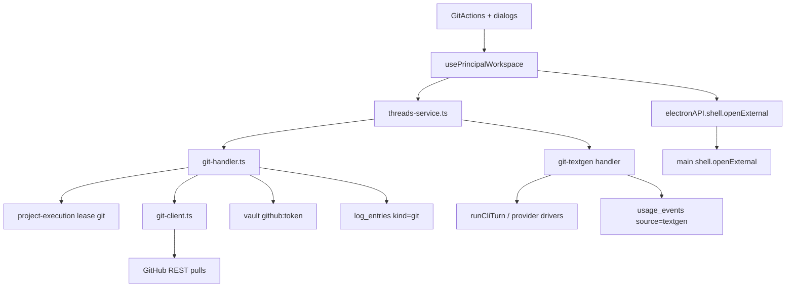

# Spec Técnica: F14. Fluxo Git Completo

**Feature:** F14 Fluxo Git Completo  
**Complexidade:** complexo  
**Escopo:** feature inteira (PRD sem divisão Central/Completo)  
**Fonte PRD:** `docs/PRD.md` → F14 (§6 Capacidades/Experiência/Erros; §8 deps; §9 critérios + cross-feature GitActions)  
**UI:** `ui.md`/`copy.md` **ainda não escritos** — esta spec cobre só contratos de dados/estado; anatomia e copy finais ficam para o processo de design (ver §3.3)  
**Última atualização:** 2026-08-06 (spec-writer Phase B / Auto-Aceitar)

---

## 1. Visão Geral Técnica

**O quê:** Completar o fluxo GitHub no Workspace (`#principal`): superfície `GitActions` com **Commit**, **Commit & push** e **Commit, push & PR**; textgen editável (subject / title+body de PR) via provider/model da thread; gate de token GitHub (F02); abertura da URL do PR no browser; auditoria `kind=git` para F08; custo de textgen como `usage_event` do projeto/thread.

**Por quê:** F03 já entregou stubs HTTP (`git-commit` / `git-push` / `pr`), `git-client.ts` e um `GitActions` parcial (Commit / Commit & push / Push solto, sem textgen, sem botão composto de PR, sem “Ver PR”). O gap 1.2 (PROGRESS + PRD §9) exige o fluxo completo com confirmação humana e textgen cobrado.

**Escopo:**

### Incluído (Consome → contratos de entrada)

| Consome (PRD) | Contrato nesta feature |
|---------------|------------------------|
| F01.1 superfícies | Tokens/tema existentes; UI final após `ui.md`/`copy.md` |
| F02 `github:token` | Vault key `github:token`; erro acionável `github_token_missing` em push **e** PR |
| F03 thread/diffs/vcs/lease | `threadId`, provider/model/title/state, `vcs-status`, lease `ownerType=git`, bloqueio UI+HTTP quando `running`/`stopping` |

### Incluído (Provê → contratos de saída)

| Provê (PRD) | Contrato nesta feature |
|-------------|------------------------|
| Ações Commit / Commit&push / Commit+push+PR | Orquestração no renderer sobre endpoints existentes + campos editáveis; nunca auto-commit |
| Eventos git PR sucesso/falha | `log_entries kind=git` (já parcial; completar push/PR e mensagens estáveis) |
| Textgen + usage | `POST …/git-textgen` + `usage_events.source='textgen'` |

### Incluído (capacidades)

- Três ações na mesma superfície; estados de estágio Commitando… / Pushando… / Abrindo PR…
- Textgen sob demanda (“Gerar com IA”); subject com orientação ≤ 72 chars (soft); PR: title + body markdown
- Fallback de título PR se textgen falhar / campos vazios: `EngrenaCode: {thread.title ?? thread.id}`
- PR: head = branch atual → base = `default_branch` do remote GitHub (já em `createPullRequest`)
- Abrir URL do PR no browser após sucesso; link “Ver PR” no estado de sucesso
- Sem multi-VCS (só GitHub)

### Fora

- Anatomia/copy finais de diálogos (pendente `ui.md`/`copy.md` F14)
- Multi-provider VCS (GitLab/Bitbucket)
- Pull/rebase/merge UI; force-push; multi-remote
- Alterar save de token em F02 (só consumir)
- Criação de worktree (F13 peer); F14 só **resolve cwd** como o dispatch

**Delta codebase (exploração 1.3):** handlers/client já existem; gaps = textgen, gate push sem token, body title/body no PR, cwd worktree, UI composta + open-external, `usage_events` CHECK sem `textgen`, bloqueio HTTP por `thread.state`.

---

## 2. Impacto na Arquitetura



**Componentes afetados:**

| Camada | Caminhos |
|--------|----------|
| Git domain | `src/services/git/git-client.ts` |
| HTTP | `src/services/http/git-handler.ts`, `src/services/http/unlock-handler.ts` (wiring se novo módulo) |
| Textgen | `src/services/git/git-textgen.ts` (novo) — prompt + parse + chamada provider |
| Usage / DB | `src/services/db/migrations/006_usage_source_textgen.ts` (novo), `src/services/db/client.ts`, `src/services/db/repositories/usage-events.ts` |
| Provider reuse | `src/services/runner/providers/cli-driver.ts` / `provider-resolution.ts` (sem mudar contrato de turno longo; textgen usa one-shot) |
| IPC | `src/main/index.ts`, `src/preload/index.ts` |
| Renderer | `src/renderer/components/workspace/GitActions.tsx`, `WorkspaceSidebar.tsx`, `PrincipalScreen.tsx`, `src/renderer/hooks/usePrincipalWorkspace.ts`, `src/renderer/services/threads-service.ts` |

---

## 3. Decisões Técnicas

### 3.1 Herdadas do brief / docs canônicos

Padrões herdados de `docs/_shared/codebase-patterns.md` (wave 4, `git_sha` 4870688, `foundation_state=complete`) e docs canônicos listados no brief (§4): HTTP loopback + `guard`, lease por projeto, vault secrets, Vitest co-local, `log_entries`, renderer `*-service.ts`.

Desvios desta feature: nenhum vs brief. Delta local: estender `UsageSource` com `textgen`; IPC `openExternal` (OAuth já usa `shell.openExternal` no main — expor ao renderer).

### 3.2 Específicas da feature

| Decisão | Abordagem Escolhida | Alternativa Considerada | Trade-off |
|---------|---------------------|-------------------------|-----------|
| Orquestração Commit+push+PR | Sequência no renderer (commit → push → pr), espelhando Commit&push atual | Endpoint atômico server-side | Falha de push/PR não desfaz commit local (PRD); mensagens por estágio mais claras |
| Textgen runtime | One-shot via `runCliTurn` com prompt curto, `accessLevel` mínimo read-only / sem tools MCP, **sem** lease `agent` | HTTP dedicado por provider | Reusa billing/key resolution F10/F11; evita segundo stack de auth |
| `usage_events.source` | Novo valor `'textgen'` + migração 006 | Reusar `source='agent'` | Consome distingue textgen de turnos; agregações totais F11 já somam sem filtrar source |
| `turnId` textgen | `textgen_${uuid}` gerado no handler | `turnId` null / coluna opcional | Schema exige `turn_id NOT NULL`; prefixo evita colidir com turnos de dispatch |
| Cwd git/textgen | Mesma regra do dispatch: `worktreePath` se `executionMode=worktree` e path setado; senão `project.path` | Sempre `project.path` | Alinha F13 peer; evita commit no tree errado |
| Gate token | Push e PR exigem `github:token`; código `github_token_missing` + mensagem apontando Configuração | Push via credential helper do SO | PRD: falha acionável; F02 é a fonte |
| Bloqueio busy | UI disable + HTTP 409 se `thread.state ∈ {running,stopping}` **ou** lease `thread_busy` | Só lease | PRD exige bloqueio com thread running |
| Abrir PR | IPC `engrenacode:shell:open-external` (allowlist `https:` only) | `window.open` | `shell.openExternal` já usado em OAuth; sandbox renderer seguro |
| Subject 72 chars | Soft guidance na UI/estado; server não rejeita >72 | Hard 400 | PRD diz “orientação”; Conventional Commits longos ainda possíveis |
| Confirmacão | Nenhuma mutação git sem subject (e title PR) confirmados pelo usuário nos campos; textgen só preenche, não executa | Auto-commit pós-textgen | PRD: never auto-commit |

### 3.3 Assumptions / Auto-Aceitar

| Assumption | Origem | Pode sobrescrever? |
|------------|--------|--------------------|
| Escopo = feature inteira (sem Central/Completo) | Auto-Aceitar: Escopo (contrato writer: full) | sim |
| `docs/F14-fluxo-git-completo/ui.md` e `copy.md` ausentes — spec só contratos de dados/estado; sem inventar anatomia nem strings finais de UI | Auto-Aceitar: ui.md/copy.md ausentes | sim (quando design escrever) |
| Stubs F03 (`GitActions.tsx`, ids `git.*` em `docs/F03-workspace/copy.md`) são **delta exploratório**; design F14 pode substituir/estender | Auto-Aceitar: Vague + lacuna UI | sim |
| Mensagens de **erro HTTP** citadas no PRD (token / textgen fail / stderr resumido) são contrato de API; copy de botões/diálogos fica para `copy.md` | Auto-Aceitar: Partial PRD specs | sim |
| Textgen usa provider/model da thread via `runCliTurn` one-shot; falha → campos intactos + código `textgen_failed` | Auto-Aceitar: Technical recommendation | sim |
| Migração 006 amplia CHECK `source IN ('agent','subagent','textgen')` (recreate table SQLite) | Auto-Aceitar: New tech / Partial PRD | sim |
| Consumo F11: totais incluem textgen; colunas share agent/subagent **não** incluem textgen até eventual ajuste F11 (*deferred*) | Auto-Aceitar: Partial PRD specs | sim |
| Sem endpoint atômico commit+push+pr | Auto-Aceitar: Technical recommendation | sim |
| Push sem token → mesmo `github_token_missing` que PR (hoje push degrada para credential helper) | Auto-Aceitar: Technical recommendation | sim |

**Rastreabilidade PRD → spec:** Consome/Provê → §1; Capacidades/Experiência → §1 Incluído + §5; Tratamento de Erros → §5 códigos; §9 F14 + cross-feature GitActions → §7.

---

## 4. Visão Geral de Componentes

### Frontend

| Caminho do Arquivo | Novo/Modificado | Propósito | Responsabilidades-Chave |
|--------------------|-----------------|-----------|------------------------|
| `src/renderer/components/workspace/GitActions.tsx` | Modificado | Superfície git | Três ações; campos subject/body/title; estágio; erro; sucesso PR; dispara textgen; contratos de props tipados |
| `src/renderer/components/workspace/GitConfirmDialog.tsx` | Novo (opcional se design unificar) | Confirmação default-branch / PR fields | Estado de formulário pré-mutação; **só após ui.md** — até lá pode ser painel inline com o mesmo contrato de estado |
| `src/renderer/components/workspace/WorkspaceSidebar.tsx` | Modificado | Wiring props | Passar callbacks PR/textgen/open |
| `src/renderer/screens/PrincipalScreen.tsx` | Modificado | Shell workspace | Ligar hooks a GitActions |
| `src/renderer/hooks/usePrincipalWorkspace.ts` | Modificado | Orquestração | `gitCommit` / `gitPush` / `openPr` / `gitTextgen` / refresh vcs; sequência commit→push→pr |
| `src/renderer/services/threads-service.ts` | Modificado | Cliente HTTP | Métodos textgen + body PR estendido |

### Backend

| Caminho do Arquivo | Novo/Modificado | Propósito | Responsabilidades-Chave |
|--------------------|-----------------|-----------|------------------------|
| `src/services/http/git-handler.ts` | Modificado | Rotas git + textgen | resolve cwd; busy check; token gate; PR title/body; audit; textgen route |
| `src/services/git/git-client.ts` | Modificado (mínimo) | Git/GitHub | Expor stderr resumido em `GitError` quando útil; `createPullRequest` já aceita title/body |
| `src/services/git/git-textgen.ts` | Novo | Geração de texto | Montar prompt (status/diff resumido); chamar provider; parse subject/title/body; mapear usage |
| `src/services/db/migrations/006_usage_source_textgen.ts` | Novo | Schema | Permitir `source='textgen'` |
| `src/services/db/client.ts` | Modificado | Registry migrations | Registrar 006 |
| `src/services/db/repositories/usage-events.ts` | Modificado | Tipos + insert | `UsageSource` inclui `textgen` |
| `src/main/index.ts` | Modificado | IPC open external | Handler allowlist https |
| `src/preload/index.ts` | Modificado | Bridge | `electronAPI.shell.openExternal(url)` |

### Banco de Dados

| Arquivo de Migração | Tabelas Afetadas | Operação | Notas |
|---------------------|------------------|----------|-------|
| `src/services/db/migrations/006_usage_source_textgen.ts` | `usage_events` | Recreate + copy (SQLite) | Amplia CHECK de `source` |

---

## 5. Contratos de API

Autenticação comum: header `x-engrenacode-session` + cofre desbloqueado (401 `unauthorized` / 423 `vault_locked`).  
Busy comum: se `thread.state ∈ {running,stopping}` → **409** `thread_busy` (details alinhados ao lease). Lease git continua via `acquireLease(..., 'git', ...)`.

### 5.1 POST `/api/threads/:threadId/git-commit`

**Requisição:**

| Campo | Tipo | Obrigatório | Validação | Descrição |
|-------|------|-------------|-----------|-----------|
| `subject` | `string` | Sim | trim não vazio | Assunto do commit |
| `body` | `string` | Não | — | Corpo opcional |

**Exemplo:**
```json
{ "subject": "feat: adiciona filtro de logs", "body": "Inclui teste de regressão." }
```

**Resposta 200:**
```json
{ "sha": "a1b2c3d4e5f6789012345678abcdef0123456789" }
```

**Erros:** `validation_error` 400; `thread_not_found` / `project_not_found` 404; `thread_busy` 409; `git_commit_failed` 500.

**Audit (sucesso):** `log_entries` `kind=git` — evento contendo sha + subject.

---

### 5.2 POST `/api/threads/:threadId/git-push`

Sem body. Exige `github:token`.

**Resposta 200:**
```json
{ "branch": "feat/logs-filter" }
```

**Erros:** `github_token_missing` 400 — mensagem acionável apontando Configuração; `thread_busy` 409; `git_push_failed` 500 com stderr resumido quando disponível (commit local **não** é revertido).

**Audit (sucesso):** push da branch para origin.

---

### 5.3 POST `/api/threads/:threadId/pr`

**Requisição:**

| Campo | Tipo | Obrigatório | Validação | Descrição |
|-------|------|-------------|-----------|-----------|
| `title` | `string` | Não | se ausente/vazio → fallback EngrenaCode | Título do PR |
| `body` | `string` | Não | markdown | Corpo do PR |
| `branch` | `string` | Não | head override | Default: branch atual |
| `allowHostOverride` | `boolean` | Não | reservado | Mantido por compat F03; sem multi-host nesta feature |

**Exemplo:**
```json
{
  "title": "feat: filtro de logs",
  "body": "## Summary\n- filtro por kind\n"
}
```

**Resposta 200:**
```json
{
  "url": "https://github.com/org/repo/pull/42",
  "number": 42,
  "existing": false
}
```

**Erros:** `github_token_missing` 400; `pr_no_remote` / `pr_not_github` / `pr_create_failed` 500; `thread_busy` 409.

**Audit:** sucesso **e** falha `GitError` (já parcial — manter).

---

### 5.4 POST `/api/threads/:threadId/git-textgen`

Gera texto editável; **não** muta git.

**Requisição:**

| Campo | Tipo | Obrigatório | Validação | Descrição |
|-------|------|-------------|-----------|-----------|
| `mode` | `string` | Sim | enum: `commit` \| `pr` | Escopo da geração |

**Exemplo:**
```json
{ "mode": "pr" }
```

**Resposta 200 (`mode=commit`):**
```json
{
  "subject": "feat: adiciona filtro de logs",
  "body": "Cobertura de regressão para kind=git."
}
```

**Resposta 200 (`mode=pr`):**
```json
{
  "title": "feat: filtro de logs",
  "body": "## Summary\n- …\n",
  "subject": "feat: adiciona filtro de logs"
}
```

(`subject` em mode=pr preenche também o campo de commit da sequência composta.)

**Side effect:** se o provider reportar usage → `usage_events` com `source='textgen'`, `provider`/`model` da thread, `billingMode`/`cost_*` via mesma regra F11 (`provider-resolution` / table|sdk).

**Erros:** `validation_error` 400; `textgen_failed` 502/500 — mensagem estável alinhada ao PRD (“Não foi possível gerar o texto. Escreva manualmente.”); `thread_busy` 409; 404 thread/project. **Não** grava usage se não houver tokens reportados.

---

### 5.5 IPC `engrenacode:shell:open-external`

- Input: `{ url: string }`
- Validação: só `https:` (rejeitar outros schemes)
- Efeito: `shell.openExternal(url)` no main
- Usado após PR sucesso (e CTA “Ver PR”)

---

## 6. Modelo de Dados

### 6.1 `usage_events` (evolução)

Nenhuma coluna nova. Ampliar enum lógico:

| Coluna | Tipo | Nullable | Padrão | Descrição |
|--------|------|----------|--------|-----------|
| `source` | `TEXT` | Não | — | CHECK ∈ `agent`, `subagent`, **`textgen`** |

Demais colunas inalteradas (ver F11 / `005_consumo.ts`).

**Índices:** existentes (`ix_usage_events_*`) preservados na recreate.

**Constraints:**

| Constraint | Tipo | Definição | Propósito |
|------------|------|-----------|-----------|
| CHECK source | CHECK | `source IN ('agent','subagent','textgen')` | Distinguir textgen git |
| FK project/thread | FOREIGN KEY | ON DELETE CASCADE | Integridade |

**Migração (estratégia SQLite):** criar tabela nova com CHECK ampliado → `INSERT SELECT` → drop old → rename; recriar índices; registar id `006_usage_source_textgen` em `schema_migrations`.

**Notas:** `turn_id` para textgen = `textgen_<uuid>`; `subagent_name` sempre null.

### 6.2 Sem tabelas novas para git

Estado de UI (subject, title, body, stage, lastPrUrl, errors) é **efêmero no renderer**.  
`log_entries` e vault `github:token` inalterados em schema.

### 6.3 Contrato de estado UI (dados — sem anatomia)

Estado mínimo consumido por `GitActions` / diálogos (design preencherá layout):

| Campo de estado | Tipo | Notas |
|-----------------|------|-------|
| `subject` / `body` | string | editáveis; textgen preenche |
| `prTitle` / `prBody` | string | mode PR / fluxo composto |
| `stage` | `null \| 'textgen' \| 'commit' \| 'push' \| 'pr'` | labels de busy |
| `error` | string \| null | token / textgen / stderr |
| `lastPrUrl` | string \| null | habilita “Ver PR” + openExternal |
| `busy` | boolean | thread running/stopping ∨ stage ≠ null ∨ detached/no-thread gates |

Inputs externos: `vcsStatus`, `selectedThread` (provider, model, title, state, executionMode/worktreePath só no server).

---

## 7. Estratégia de Testes

### 7.1 Unitário / Integração

| Arquivo de Teste | Tipo | Alvo | Objetivo |
|------------------|------|------|----------|
| `src/services/http/git-handler.test.ts` | Integração HTTP | commit/push/pr/textgen | 80%+ caminhos F14 |
| `src/services/git/git-textgen.test.ts` | Unitário | prompt/parse/usage map | parse + falhas |
| `src/services/db/repositories/usage-events.test.ts` | Unitário | `source=textgen` | insert + list |
| `src/services/git/git-client.test.ts` (se existir / estender) | Unitário | PR title/body passthrough | regressão |

| Função de Teste | Descrição | Assertions |
|-----------------|-----------|------------|
| `test_git_commit_uses_worktree_cwd_when_set` | Thread worktree | commit afeta worktree, não `project.path` |
| `test_git_commit_rejects_when_thread_running` | state=running | 409 `thread_busy` |
| `test_git_push_requires_github_token` | sem token | 400 `github_token_missing` |
| `test_git_push_failure_preserves_local_commit` | remote rejeita | commit HEAD intacto; erro com message |
| `test_pr_accepts_title_and_body` | body custom | GitHub payload / mock axios recebe title/body |
| `test_pr_fallback_title_from_thread` | title omitido | `EngrenaCode: {title\|id}` |
| `test_pr_success_and_failure_log_entries` | audit F08 | kind=git sucesso e falha |
| `test_git_textgen_commit_mode_returns_subject` | mode=commit | 200 + subject; usage source=textgen quando usage presente |
| `test_git_textgen_failure_does_not_block_manual_commit` | provider throw | 5xx `textgen_failed`; commit manual ainda 200 |
| `test_usage_events_accepts_source_textgen` | migração 006 | insert não viola CHECK |

### 7.2 Smoke / Aceitação manual

| # | Passo | Resultado esperado |
|---|-------|-------------------|
| 1 | Thread idle, working tree dirty, token GitHub ok → Commit com subject manual | Commit criado; vcs limpa/ahead; log kind=git |
| 2 | “Gerar com IA” (commit) → editar subject → Commit & push | Campos preenchidos editáveis; push ok; usage textgen em Consumo/totais se provider reportou tokens |
| 3 | Commit, push & PR → sucesso | Estágios visíveis; URL; “Ver PR” abre browser; log PR |
| 4 | Remover token → Push ou PR | Erro apontando Configuração; sem mutação remota |
| 5 | Textgen com provider falho | Mensagem de falha de geração; commit manual ainda possível |
| 6 | Thread `running` | Três ações + textgen desabilitados; HTTP 409 se chamado |

*(Aceite visual light/dark e copy literal: **após** `ui.md`/`copy.md` F14.)*

### 7.3 Cross-feature

| Critério | Status | Nota |
|----------|--------|------|
| GitActions consome token GitHub (F02) e estado da thread (F03) para Commit/push/PR com textgen (PRD §9) | ready (deps F02/F03 implementadas) | Smoke §7.2 |
| Eventos git PR sucesso/falha visíveis em Registros (F08) | ready | `test_pr_success_and_failure_log_entries` |
| usage_events textgen agregam em Consumo (F11) totais | ready (totais); share agent/subagent *deferred* | Ajuste UI share opcional |
| cwd git usa `worktreePath` quando F13 ativo | peer no lote / deferred até F13 | Mesma regra de resolução já especificada; teste com fixture worktree mesmo antes da UI F13 |
| Tokens/tema F01.1 nas superfícies GitActions | deferred até ui.md F14 | Design Lock aplica-se na implementação visual |
