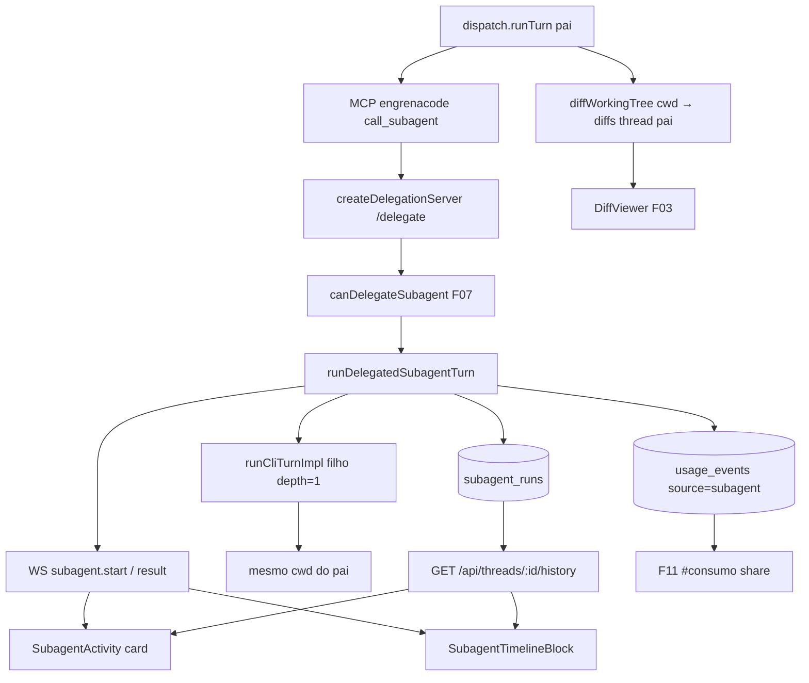

# F15. Runtime de SubAgents — Especificação Técnica

**Feature:** F15 Runtime de SubAgents  
**Complexidade:** complexo  
**Escopo:** full feature (PRD sem divisão Central/Completo)  
**UI:** `ui.md`/`copy.md` ainda não existem para F15 — spec cobre contratos de dados/estado; anatomia e strings finais ficam no processo de design (ver §3.3)  
**Brief:** `docs/_shared/codebase-patterns.md`  
**Última atualização:** 2026-08-06

---

## 1. Visão Geral Técnica

**O quê:** Fechar o runtime comprovado de `call_subagent` ponta a ponta: run efêmero com status/duração/idle na timeline e no card Subagents da sidebar, diffs do filho na mesma revisão Diff do pai, `usage_event source=subagent` com share > 0 em Consumo, e smoke E2E obrigatório contra binário real (`claude` ou `codex`) com ≥ 1 delegação bem-sucedida documentada.

**Por quê:** A infraestrutura de execução já existe (F11: MCP interno `engrenacode`, `createDelegationServer`, `runDelegatedSubagentTurn`, watchdog idle, persistência `subagent_runs` + usage). F07 entregou catálogo, gate Codex e componentes de observação (`SubagentActivity`, `SubagentTimelineBlock`, audit). O gap que impede os critérios §9 de F07/F15/cross-feature é a **prova E2E + wiring UI ao vivo + endurecimento do idle/duração/histórico** — não reescrever o broker de delegação.

**Escopo — Incluído:**

- Endurecer o runtime existente: `recordActivity` no stream do filho (idle = silêncio), `durationMs` no terminal do run, correlação `parentToolCallId`, payload WS suficiente para UI sem refresh
- Expor runs no contrato de history da thread (`subagentRuns`) e consumir WS `subagent.start` / `subagent.result` no workspace
- Garantir unificação de diffs: alterações do filho no mesmo cwd entram na lista `pending` do `threadId` do pai (DiffViewer F03)
- Contratos de dados/estado para badges de timeline (`running` | `completed` | `error` | `timeout`), card sidebar Subagents ao vivo, badge âmbar de timeout idle
- Smoke E2E contra binário real com delegação bem-sucedida + share subagent em `#consumo`
- Critérios §9 F15 + cross-feature F07↔F03 e usage F03/F07/F15→F11

**Escopo — Excluído:**

- `write-parallel` / merge-tree / `kind=pipeline` (PRD §7)
- Profundidade > 1, MCPs do usuário no filho, paralelismo entre `call_subagent` no mesmo turno (já serializado em F11; não reabrir)
- CRUD/catálogo `#subagents` (F07 feito)
- Tela Consumo / pricing (F11 feito) — só garantir write path `source=subagent` pós-delegação real
- Inventar anatomia/copy final de badges/card (pendente `ui.md`/`copy.md` de F15; reutilizar ids F07 `subagentsRun.*` como baseline de contrato)

**Consome (PRD):** F01.1 tokens timeline/badges/idle; F03 dispatch/DiffViewer/lease/WS; F07 defs `kind=dev`, gate Codex full-access, `idleTimeoutMinutes`.  
**Provê (PRD):** runs efêmeros E2E com resultado no pai, idle/timeout UI, diffs na revisão unificada; `usage_events source=subagent` com share > 0.

---

## 2. Impacto na Arquitetura

| Área | Caminhos | Papel em F15 |
|------|----------|--------------|
| Delegação | `src/services/runner/delegate.ts` | Endurecer idle/activity/duração; correlacionar tool call; manter gate/spawn/usage |
| MCP interno | `src/services/runner/subagent-mcp-server.ts` | Já expõe `call_subagent` (F11/F12); sem redesign |
| Gate / registry | `src/services/runner/subagent-caller-gate.ts`, `src/services/runner/subagent-registry.ts` | Reusar; F15 só prova + erros estruturados no pai |
| Dispatch / diffs | `src/services/runner/dispatch.ts`, `src/services/git/git-client.ts` | Pai coleta `diffWorkingTree(cwd)` pós-turno (inclui edits do filho); lease permanece no pai |
| WS | `src/services/runner/ws-hub.ts`, `src/renderer/services/ws-client.ts` | Eventos `subagent.*` → UI live |
| HTTP history | `src/services/http/threads-handler.ts` | Incluir `subagentRuns` (contrato F07 nunca ligado) |
| DB | `src/services/db/repositories/subagents.ts`, migração `001_subagents.ts` (existente) | Sem migração nova; popular `duration_ms` / `parent_tool_call_id` |
| Usage | `src/services/db/repositories/usage-events.ts` | Já grava `source=subagent` em `runDelegatedSubagentTurn` |
| UI workspace | `src/renderer/screens/PrincipalScreen.tsx`, `src/renderer/components/workspace/ChatHistory.tsx`, `src/renderer/components/workspace/WorkspaceSidebar.tsx`, `src/renderer/components/workspace/DiffViewer.tsx` | Montar activity/timeline; refresh runs; Diff unificado |
| UI subagents | `src/renderer/components/subagents/SubagentActivity.tsx`, `SubagentTimelineBlock.tsx`, `SubagentRunAuditModal.tsx`, `subagentRun.format.ts`, `copy.ts` | Consumir estado; badge timeout; audit on click |
| Services renderer | `src/renderer/services/threads-service.ts`, `src/renderer/services/subagents-service.ts` | Tipar `subagentRuns` no history; helpers de refetch |



---

## 3. Decisões Técnicas

### 3.1 Herdadas do brief / docs canônicos

Padrões herdados de `docs/_shared/codebase-patterns.md` (Camada 1 + Camada 2: dispatch/cwd, lease por projeto, MCP `engrenacode`, delegação `delegate.ts`, drivers CLI, renderer HTTP clients, tema, audit, isolamento smoke). Docs canônicos: `docs/F07-subagents/spec.md`, `docs/F11-consumo/spec.md`, `docs/F03-workspace/spec.md`, `docs/F12-runtime-de-skills/spec.md`, `CLAUDE.md` (smoke Electron / access level / vault session).

Desvios desta feature: nenhum na stack; F15 é fechamento de gaps sobre o runtime F11 e superfícies F07/F03.

### 3.2 Específicas da feature

| Decisão | Abordagem Escolhida | Alternativa Considerada | Trade-off |
|---------|---------------------|-------------------------|-----------|
| Escopo F15 vs F11 | Não reescrever MCP/delegação; endurecer + provar E2E + ligar UI | Novo broker / segundo MCP | Infra já existe; risco de regressão se duplicar |
| Idle = silêncio | Chamar `DelegatedRun.recordActivity` em todo `text-delta` (e tool events se o driver expuser) do filho | Idle por wall-clock desde `createdAt` (comportamento atual sem `recordActivity`) | Alinha PRD/F07 (“silêncio de stream”); evita timeout de filho ativo |
| Diffs do filho | Unificação implícita: filho edita o mesmo cwd; ao fim do turno pai (após tool bloquear), `diffWorkingTree` persiste diffs com `threadId` do pai | Snapshot de árvore pré/pós filho + merge explícito | Sem merge-tree (§7); `call_subagent` é bloqueante → coleta do pai já inclui writes do filho |
| History de runs | Estender `GET /api/threads/:id/history` com `subagentRuns: SubagentRun[]` (contrato F07) | Endpoint REST separado `/api/threads/:id/subagent-runs` | Um fetch hidrata timeline + sidebar; menos round-trips |
| Live UI | WS `subagent.start`/`subagent.result` dispara refetch (ou patch local) da lista de runs; sem polling obrigatório | Só polling HTTP | Já emitido pelo delegate; evita refresh manual (AC timeout) |
| Badge timeout | Estado `status === 'timeout'` → badge âmbar; literal “Timeout (idle)” é intenção PRD — string final via design (`ui.md`/`copy.md` F15 ou ajuste id F07) | Copiar string PRD direto no TSX | Lacuna UI explícita; contrato de estado é estável |
| Correlação timeline | Persistir `parentToolCallId` quando o tool-call do pai for conhecido; UI troca a linha genérica `call_subagent` por `SubagentTimelineBlock` | Só casar por nome/ordem | Audit + anti-duplicação no work log (F07) |
| `durationMs` | Calcular `Date.now() - createdAt` (ou `run.createdAt`) em complete/timeout/error/cancel e persistir | Deixar null e formatar só no client | Sidebar/timeline e audit ficam estáveis após reload |
| Smoke E2E | Obrigatório vs binário real; access level Auto-accept edits; sem `ANTHROPIC_API_KEY` herdada; `ENGRENACODE_USER_DATA` isolado | Só subprocesso MCP mock (F11) | PRD §9 F15 + métrica paridade 1.2 |

### 3.3 Assumptions / Auto-Aceitar

| Assumption | Origem | Pode sobrescrever? |
|------------|--------|--------------------|
| Escopo = feature inteira (sem split Central/Completo) | Auto-Aceitar: Escopo | sim |
| Infra `call_subagent` F11/F12 é base; F15 fecha gaps E2E/UI/idle/diffs/usage share | Auto-Aceitar: Clear tech recommendations + brief §2/§6 | sim |
| Diff unificado via cwd compartilhado + `diffWorkingTree` do pai (sem merge-tree) | Auto-Aceitar: Clear tech recommendations + PRD §7 out-of-scope | sim |
| Idle default 20 min / hard cap 2 h já em `delegate.ts`; F15 só liga `recordActivity` + UI | brief + código existente | sim |
| Serialização FIFO de delegações no mesmo turno permanece (F11) | brief / F11 spec | sim |
| `ui.md`/`copy.md` ausentes para F15 — só contratos de dados/estado; não inventar anatomia/copy final; baseline de ids em `docs/F07-subagents/copy.md` (`subagentsRun.*`) | Auto-Aceitar: ui.md/copy.md absent | sim (design) |
| String PRD “Timeout (idle)” é requisito de produto; implementação visual/copy aguarda design (pode atualizar id F07 ou novo id F15) | Auto-Aceitar: Partial PRD + ui absent | sim |
| Processo de design UI é pré-requisito antes da implementação visual final do card/badges | CLAUDE.md Design · Processo | sim |
| Smoke usa Claude ou Codex já logado; `full-access` só se pai Codex; Auto-accept edits | CLAUDE.md Smoke rules + Auto-Aceitar Vague/best-practice | sim |
| Sem migração SQL nova — schema `subagent_runs` / `usage_events` suficiente | Codebase pattern + assumption | sim |

---

## 4. Visão Geral de Componentes

### Backend / runner

| Caminho do Arquivo | Novo/Modificado | Propósito | Responsabilidades-Chave |
|-------------------|-----------------|-----------|------------------------|
| `src/services/runner/delegate.ts` | Modificado | Runtime de delegação | `recordActivity` no stream; `durationMs` no terminal; `parentToolCallId` quando disponível; manter usage/`subagent.*` WS |
| `src/services/runner/dispatch.ts` | Modificado (mínimo) | Pai | Passar tool-call id à delegação se necessário; garantir coleta de diffs pós-tool; sem reabrir MCP |
| `src/services/runner/subagent-mcp-server.ts` | Sem mudança funcional | MCP `call_subagent` | Já F11/F12 |
| `src/services/runner/subagent-caller-gate.ts` | Sem mudança | Gate Codex | Mensagem existente no pai |
| `src/services/runner/subagent-registry.ts` | Sem mudança | Catálogo do turno | `kind=dev` vinculado |
| `src/services/runner/ws-hub.ts` | Modificado (opcional enrich) | Eventos WS | Manter tipos; opcional incluir `status`/`name` já presentes |
| `src/services/http/threads-handler.ts` | Modificado | History | Incluir `subagentRuns` via `listRunsForParentThread` |
| `src/services/db/repositories/subagents.ts` | Modificado se preciso | Runs | Helpers de update com duração; listagem já existe |
| `src/services/db/repositories/usage-events.ts` | Sem mudança | Share Consumo | Já agrega `source=subagent` |
| `src/services/git/git-client.ts` | Sem mudança | Diffs | `diffWorkingTree` usado pelo pai |

### Frontend

| Caminho do Arquivo | Novo/Modificado | Propósito | Responsabilidades-Chave |
|-------------------|-----------------|-----------|------------------------|
| `src/renderer/services/threads-service.ts` | Modificado | Cliente history | Tipar `subagentRuns` |
| `src/renderer/services/ws-client.ts` | Já tipado | WS | Consumir `subagent.start`/`result` no hook/workspace |
| Hook/estado do workspace (ex. módulo usado por `PrincipalScreen.tsx`) | Modificado | Estado vivo | Manter lista de runs; refetch/patch em WS; abrir audit |
| `src/renderer/components/workspace/WorkspaceSidebar.tsx` | Modificado | Card Subagents | Montar `SubagentActivity` com runs da thread |
| `src/renderer/components/workspace/ChatHistory.tsx` | Modificado | Timeline | Renderizar `SubagentTimelineBlock` no lugar da tool `call_subagent` correlacionada |
| `src/renderer/components/workspace/DiffViewer.tsx` | Sem mudança de API | Revisão unificada | Continua listando diffs do `threadId` pai |
| `src/renderer/components/subagents/SubagentActivity.tsx` | Modificado leve | Card | Badge/estado timeout âmbar (token); live duration |
| `src/renderer/components/subagents/SubagentTimelineBlock.tsx` | Modificado leve | Bloco aninhado | Status incl. timeout; duração se contrato exigir |
| `src/renderer/components/subagents/SubagentRunAuditModal.tsx` | Reusar | Audit do run | Abrir no clique do card/timeline |
| `src/renderer/components/subagents/subagentRun.format.ts` | Modificado se preciso | Formatação | Duração + helpers de status visual |
| `src/renderer/components/subagents/copy.ts` | Só se design liberar ids | Microcopy | Não inventar strings F15 aqui |

### Banco de Dados

| Arquivo de Migração | Tabelas Afetadas | Operação | Notas |
|-------------------|------------------|----------|-------|
| `src/services/db/migrations/001_subagents.ts` | `subagent_runs` | Nenhuma (já existe) | Popular `duration_ms`, `parent_tool_call_id` |
| `src/services/db/migrations/005_consumo.ts` | `usage_events` | Nenhuma | `source='subagent'` já suportado |

### Testes

| Caminho | Novo/Modificado |
|---------|-----------------|
| `src/services/runner/delegate.test.ts` | Modificado |
| `src/services/runner/delegate.idle.test.ts` | Modificado |
| `src/services/http/threads-handler.test.ts` | Modificado |
| `src/renderer/components/subagents/subagentRun.format.test.ts` | Modificado se badge/format mudar |
| `docs/F15-runtime-de-subagents/smoke-results.md` | Novo (após smoke) |

---

## 5. Contratos de API

Auth: header `x-engrenacode-session`. Vault locked → 423 `vault_locked`. Erros JSON `{ error: { code, message } }`.

### 5.1 `GET /api/threads/:id/history` (estendido)

- **Método:** GET  
- **Caminho:** `/api/threads/:threadId/history`  
- **Autenticação:** session  

**Resposta (sucesso — 200):**

| Campo | Tipo | Descrição |
|-------|------|-----------|
| `messages` | `Message[]` | Existente F03 |
| `toolCalls` | `ToolCall[]` | Existente F03 |
| `subagentRuns` | `SubagentRun[]` | Novo — runs do pai, ordem `created_at ASC` |

**Exemplo de Resposta:**
```json
{
  "messages": [],
  "toolCalls": [
    {
      "id": "tc_01",
      "threadId": "thr_parent",
      "name": "mcp__engrenacode__call_subagent",
      "status": "completed",
      "seq": 3
    }
  ],
  "subagentRuns": [
    {
      "childThreadId": "child_9f2c",
      "parentThreadId": "thr_parent",
      "parentToolCallId": "tc_01",
      "subagentName": "revisor-seguranca",
      "provider": "claude",
      "model": "claude-haiku-4-5",
      "status": "completed",
      "text": "Revisão concluída.",
      "usageJson": "{\"inputTokens\":120,\"outputTokens\":40}",
      "reasoningLevel": null,
      "durationMs": 18420,
      "actionCount": 2,
      "createdAt": 1723000000000
    }
  ]
}
```

**Códigos de Erro:**

| Código | Status HTTP | Descrição |
|--------|-------------|-----------|
| `unauthorized` | 401 | Sessão inválida |
| `vault_locked` | 423 | Cofre travado |
| `thread_not_found` | 404 | Thread inexistente |

### 5.2 Runtime MCP `call_subagent` (já previsto; contrato F15)

- **Nome estável:** `mcp__engrenacode__call_subagent` (tool MCP `call_subagent` no server `engrenacode`)
- **Input:** `{ name: string, task: string, context?: string }`
- **Comportamento:** gate F07 → `startDelegatedRun` → filho `runCliTurnImpl` (depth=1, sem row em `threads`, sem `--mcp-config` do usuário) → watchdog idle/hard → resultado texto ao pai; `isError` só em falhas de gate/catálogo/transporte
- **Idle:** silêncio ≥ `idleTimeoutMinutes` (null → 20) → `status: 'timeout'`, abort do filho, texto estruturado ao pai (`[subagent '…' interrompido por timeout: …]`)
- **Hard cap:** 2 h → mesmo caminho `timeout`
- **Usage:** se o filho reportar `usage`, gravar `usage_event` com `source: 'subagent'`, `threadId` = pai, `turnId` = turno pai, `subagentName` preenchido

**Exemplo de resultado MCP (sucesso):**
```json
{
  "content": [{ "type": "text", "text": "Arquivo X revisado; 2 achados." }],
  "isError": false
}
```

**Exemplo de resultado MCP (gate Codex):**
```json
{
  "content": [{
    "type": "text",
    "text": "Codex só delega subagents com access level full-access. Ajuste o access level da thread para habilitar call_subagent."
  }],
  "isError": true
}
```

### 5.3 WebSocket (thread pai)

| Evento | Campos | Quando |
|--------|--------|--------|
| `subagent.start` | `threadId`, `childThreadId`, `name` | Run criado / filho iniciado |
| `subagent.result` | `threadId`, `childThreadId`, `status` (`completed`\|`error`\|`timeout`\|…) | Run terminal |

UI **deve** atualizar card/timeline sem refresh manual ao receber esses eventos (refetch history ou patch da lista).

### 5.4 Diffs (sem endpoint novo)

`GET /api/threads/:id/diffs` continua listando diffs do pai. Após turno com delegação que alterou ficheiros, a lista inclui as mudanças do filho (mesmo `thread_id`). Accept/reject permanece F03.

---

## 6. Modelo de Dados

Sem migração nova. Contratos já existentes; F15 exige popular campos hoje omitidos no write path.

### Tabela: `subagent_runs` (existente — `001_subagents.ts`)

| Coluna | Tipo | Nullable | Padrão | Descrição |
|--------|------|----------|--------|-----------|
| `child_thread_id` | TEXT | Não | — | PK lógica (sem row em `threads`) |
| `parent_thread_id` | TEXT | Não | — | Thread pai de revisão |
| `parent_tool_call_id` | TEXT | Sim | — | Correlação timeline (F15 popula) |
| `subagent_name` | TEXT | Não | — | Nome do catálogo |
| `provider` | TEXT | Não | — | Provider efetivo do filho |
| `model` | TEXT | Sim | — | |
| `status` | TEXT | Não | — | `running` \| `completed` \| `cancelled` \| `error` \| `timeout` |
| `text` | TEXT | Sim | — | Saída / erro / parcial timeout |
| `usage_json` | TEXT | Sim | — | Blob opaco do usage do filho |
| `reasoning_level` | TEXT | Sim | — | |
| `duration_ms` | INTEGER | Sim | — | F15 popula no terminal |
| `actions_json` | TEXT | Sim | — | Opcional / cap legado |
| `action_count` | INTEGER | Não | 0 | |
| `created_at` | INTEGER | Não | — | epoch ms |

**Índices:** `ix_subagent_runs_parent` on `parent_thread_id`.

**Constraints:** PK `child_thread_id`; status validado na app (`SubagentRunStatus`).

### Tabela: `usage_events` (existente — `005_consumo.ts`)

Campos relevantes: `source CHECK IN ('agent','subagent')`, `subagent_name`, `thread_id` (= pai), `turn_id` (= turno pai). F15 não altera schema; exige evento real pós-delegação com tokens/custo agregáveis (share > 0 no drill-down F11).

### Estado de UI (contrato — sem anatomia inventada)

| Superfície | Estado / dados | Notas |
|------------|----------------|-------|
| Card sidebar Subagents | Lista `SubagentRun[]` da thread; seções ativos/concluídos; duração; status | Componente `SubagentActivity` já modela; falta wiring |
| Timeline | Por run: nome, provider/model, status, abertura de audit | `SubagentTimelineBlock`; correlacionar tool call |
| Badge timeout | `status === 'timeout'` → tom âmbar (token Design Lock); label final via design | PRD: “Timeout (idle)” |
| Diff tab | `Diff[]` do pai após turno | Sem campo `childThreadId` obrigatório nesta versão |
| Audit modal | Run completo (texto, usage, status, duração) | `SubagentRunAuditModal` |

---

## 7. Estratégia de Testes

### 7.1 Unitário / Integração

| Arquivo de Teste | Tipo | Alvo | Objetivo |
|-----------------|------|------|----------|
| `src/services/runner/delegate.idle.test.ts` | Unitário | idle + activity | Silêncio vs activity reset |
| `src/services/runner/delegate.test.ts` | Integração DI | `runDelegatedSubagentTurn` | Gate, complete, timeout, usage, duration, WS |
| `src/services/http/threads-handler.test.ts` | HTTP | history | `subagentRuns` embutido |
| `src/services/runner/subagent-mcp-server.test.ts` | Subprocesso | MCP | Regressão `call_subagent` (já F11/F12) |
| `src/renderer/components/subagents/subagentRun.format.test.ts` | Unitário | format/status | Duração + timeout ativo |

**Funções (delegate / idle):**

| Função de Teste | Descrição | Assertions |
|-----------------|-----------|------------|
| `idle_silence_marks_timeout` | Sem activity → timeout no limiar | `status === 'timeout'` |
| `recordActivity_resets_idle_window` | Activity atrasa timeout | ainda `running` no limiar antigo |
| `runDelegated_records_activity_on_stream` | Stream do filho chama activity | idle não dispara durante deltas |
| `runDelegated_persists_duration_ms_on_complete` | Sucesso | `durationMs > 0` |
| `runDelegated_persists_duration_ms_on_timeout` | Abort idle | `status=timeout`, `durationMs` set |
| `runDelegated_writes_usage_source_subagent` | Filho com usage mock | row `source=subagent`, `subagentName` |
| `runDelegated_gate_codex_without_full_access` | Pai Codex supervised | `isError`, sem run persistido (ou sem spawn) |
| `runDelegated_emits_ws_start_and_result` | Happy path | eventos com `childThreadId`/`status` |

**Funções (HTTP history):**

| Função de Teste | Descrição | Assertions |
|-----------------|-----------|------------|
| `history_includes_subagent_runs_ordered` | Runs do pai | array ASC, shape `SubagentRun` |
| `history_empty_subagent_runs_when_none` | Sem runs | `subagentRuns: []` |

### 7.2 Smoke / Aceitação manual (binário real obrigatório)

Pré-condições: `.env.local` ok; Vite na porta de `VITE_DEV_SERVER_URL` (≠ 5174); unlock `127.0.0.1:5174`; `pnpm dev` com `dangerouslyDisableSandbox:true`; **sem** `ANTHROPIC_API_KEY` no shell; `ENGRENACODE_USER_DATA` isolado; access level **Auto-accept edits**; subagent `kind=dev` vinculado ao projeto.

| # | Passo | Resultado esperado |
|---|-------|-------------------|
| 1 | Unlock → projeto → vincular subagent → thread Claude (ou Codex full-access) → prompt que force `call_subagent` | Tool real invocada; run `running`→`completed` no card Subagents **sem refresh** |
| 2 | Abrir aba Diff do pai | Diffs criados pelo filho listados no mesmo thread; accept/reject F03 funciona |
| 3 | Abrir `#consumo` drill-down da thread | Share subagent > 0 (`source=subagent` visível) |
| 4 | (Erro) Codex pai sem full-access tenta delegar | Tool falha com mensagem de gate; pai continua |
| 5 | (Erro) Subagent não vinculado / nome inválido | Erro estruturado ao pai; sem crash do turno |
| 6 | (Erro/idle) Idle curto de teste (ex. definição 1 min) + silêncio forçado **ou** simulação controlada em harness se binário não cooperar; UI deve mostrar `timeout` âmbar sem refresh | Run `timeout`; badge/estado idle visível na sidebar e timeline |
| 7 | Documentar em `docs/F15-runtime-de-subagents/smoke-results.md` | ≥ 1 delegação bem-sucedida vs binário real |

Quando `ui.md`/`copy.md` F15 existirem: conferir light/dark + strings. Até lá: verificar tokens Design Lock (âmbar timeout) e ids F07 `subagentsRun.*` se reutilizados.

### 7.3 Cross-feature

| Critério | Status | Nota |
|----------|--------|------|
| SubAgents (F07) delegados no Workspace devolvem resultado ao pai e diffs na mesma revisão (F15) | ready (esta feature) | PRD §9 Integração |
| usage_events Workspace (F03) + SubAgents (F07/F15) agregam em Consumo (F11) | ready | Provar share > 0 no smoke |
| F03 §9: skills/rules/subagents no turno — `call_subagent` E2E | ready | Fecha item aberto do F03 |
| F07 §9: call_subagent run efêmero + diffs pai; idle UI | ready | Fecha itens abertos do F07 |
| WorktreePath (F13) isola cwd de subagent | deferred até F13 | `resolveChildCwd` já lê `worktreePath`; prova E2E worktree fica F13 |
| write-parallel / merge-tree / `kind=pipeline` | N/A | Fora de escopo §7 |

---

## Rastreabilidade PRD → Spec

| Bloco PRD | Destino |
|-----------|---------|
| Consome F01.1 / F03 / F07 | §1 Escopo, §2, §4 |
| Provê runs + usage | §1, §5, §6 |
| Capacidades | §3.2, §5.2, §6 |
| Experiência (card live, badge timeout) | §6 estado UI, §7.2 |
| Tratamento de Erros | §5.2 exemplos, §7.2 #4–6 |
| §9 F15 | §7.2 + §7.1 |
| §9 Cross-feature call_subagent / usage | §7.3 |
| §7 out-of-scope | §1 Excluído |
