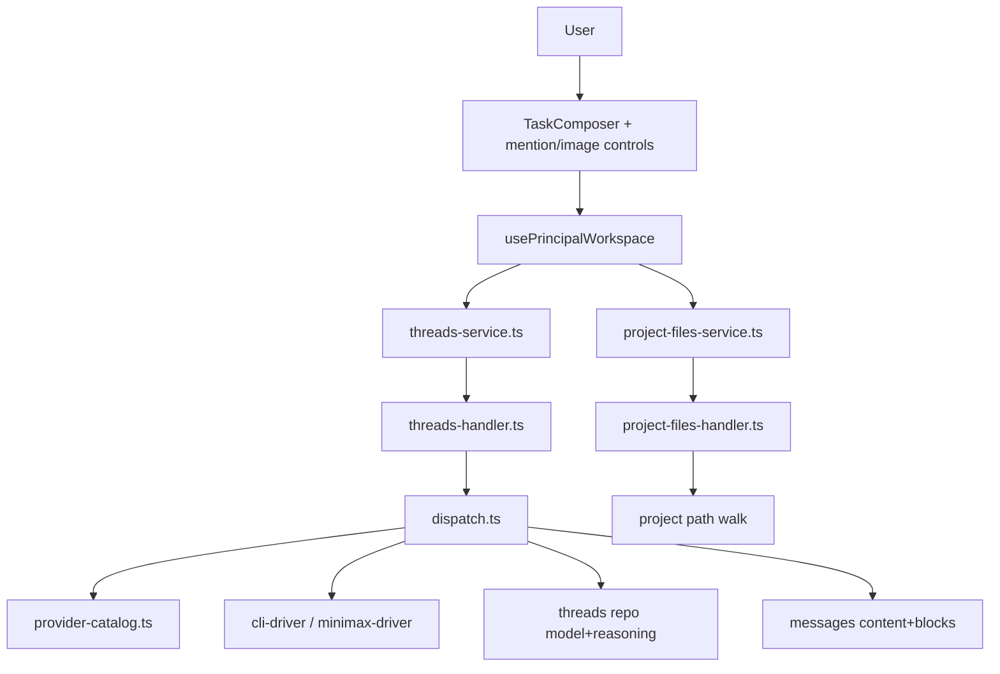

# Spec: F16. Composer Avançado

## 1. Visão Geral Técnica

**O quê:** Estender o composer do Workspace (`#principal`) com controles de modelo e reasoning level (editáveis no 1º envio e no follow-up), menção `@file` com busca de arquivos do projeto, e anexos de imagem quando o provider da thread declarar suporte multimodal. O provider da thread permanece imutável após a criação.

**Por quê:** Hoje `TaskComposer` já trava o provider após criar a thread e `ComposerDraft.model` / `POST …/threads` aceitam `model`, mas a UI não expõe modelo/reasoning, o follow-up não reenvia `model`, `threads` não persiste `reasoning_level`, não há API de listagem de arquivos para `@`, e o runner não carrega imagens no turno. F16 fecha o gap de paridade do composer avançado sem reabrir troca de provider mid-thread.

**Escopo:**

**Incluído:**
- Catálogo estático de modelos/reasoning/multimodal por provider (Claude/Codex/Kimi/Minimax), alinhado a disponibilidade F10
- Controles de modelo e reasoning no composer; provider locked com tooltip após criar thread
- Persistência e patch de `model` + `reasoningLevel` na thread; envio no create e no follow-up
- `@` abre menu de arquivos do projeto (limit 50, debounce ≥ 150 ms); insere path relativo; rejeita fora do projeto
- Anexos de imagem: até 5 por mensagem, ≤ 4 MiB, `image/png` | `image/jpeg` | `image/webp` | `image/gif`; CTA desabilitado se provider não multimodal
- Prompt enriquecido (`@file` no texto + imagens no turno) e histórico com menções/anexos visíveis via `blocks`
- Integração com fila local do composer (itens enfileirados carregam texto + anexos + snapshot model/reasoning)

**Excluído (PRD §7 / Auto-Aceitar out of scope):**
- Voz / STT / TTS
- Slash commands e command palette
- Troca de provider mid-thread
- Anatomia final / copy final (dependem de `ui.md`/`copy.md` ainda ausentes)

**UI:** `docs/F16-composer-avancado/ui.md` e `docs/F16-composer-avancado/copy.md` **ainda não existem**. Esta spec define só contratos de dados/estado. Implementação visual exige o processo Design · Processo (`CLAUDE.md`) antes de fechar superfícies.

**Rastreabilidade PRD:** Consome/Provê/Capacidades/Experiência/Tratamento de Erros (PRD §6 F16) → Scope + Requisitos + Erros; critérios §9 F16 + linha cross-feature Composer→Workspace → Testing Strategy §7.

---

## 2. Impacto na Arquitetura

Componentes afetados (delta sobre F03/F10):

| Área | Paths |
|------|-------|
| Composer UI | `src/renderer/components/workspace/TaskComposer.tsx`, novos controles/menus sob `src/renderer/components/workspace/` |
| Workspace hook | `src/renderer/hooks/usePrincipalWorkspace.ts` |
| Screen | `src/renderer/screens/PrincipalScreen.tsx` (wiring props) |
| Chat history | `src/renderer/components/workspace/ChatHistory.tsx` (render de blocks de imagem/menção) |
| HTTP clients | `src/renderer/services/threads-service.ts`, novo `src/renderer/services/project-files-service.ts` |
| Catálogo provider | novo `src/services/runner/providers/provider-catalog.ts` (e espelho tipado no renderer ou import compartilhado via contrato HTTP) |
| Threads HTTP/dispatch | `src/services/http/threads-handler.ts`, `src/services/runner/dispatch.ts` |
| Drivers | `src/services/runner/providers/provider-types.ts`, `cli-driver.ts`, `minimax-driver.ts` |
| Files API | novo `src/services/http/project-files-handler.ts` (+ registro no unlock server) |
| DB | `src/services/db/migrations/006_composer_avancado.ts`, `src/services/db/repositories/threads.ts`, `messages.ts` |



---

## 3. Decisões Técnicas

### 3.1 Herdadas do brief / docs canônicos

Padrões herdados de `docs/_shared/codebase-patterns.md` (e docs canônicos listados no brief §4: F03 workspace, F10 providers, F01.1 superfícies).

Desvios desta feature:
- Introduz catálogo estático de modelos/reasoning/multimodal (F10 cobre keys/modo/status, não lista de modelos de composer).
- Introduz endpoint de listagem de arquivos do projeto (não existia no baseline).
- Estende `ProviderTurnInput` com `reasoningLevel` e `images` (drivers hoje só usam `model` textual).

### 3.2 Específicas da feature

| Decisão | Abordagem Escolhida | Alternativa Considerada | Trade-off |
|---------|-------------------|-------------------------|-----------|
| Catálogo model/reasoning/multimodal | Módulo estático `provider-catalog.ts` por `ThreadProvider`, defaults seguros; UI lê via GET ou bundle tipado espelhado | Descoberta dinâmica via CLI/`model_pricing` | Catálogo versionado no app é previsível e testável; preços F11 permanecem separados |
| Persistência reasoning | Coluna `reasoning_level` em `threads` (migração `006_…`) | Só no payload do turno / localStorage | Follow-up e rehydrate da thread precisam do valor atual |
| Transporte de imagens | Body JSON com `images: [{ mimeType, dataBase64, name? }]` no create/follow-up; persistir em `messages.blocks_json`; temp files no main para CLI quando necessário | Multipart upload separado | Alinha ao HTTP JSON existente; limite 5×4 MiB mantém payload aceitável no loopback |
| `@file` search | `GET /api/projects/:id/files?q=&limit=50` walk no `project.path` (não worktree), ignore dirs comuns | Só IPC `dialog` / tree client-side | Server valida path dentro do projeto; debounce fica no renderer |
| Multimodal flags | `claude`/`codex` = multimodal; `kimi`/`minimax` = não (Minimax já é text-only) | Todos true | Evita CTA ativo em providers sem caminho de imagem no runner |

### 3.3 Assumptions / Auto-Aceitar

| Assumption | Origem | Pode sobrescrever? |
|------------|--------|--------------------|
| Escopo = feature completa (PRD sem divisão Central/Completo) | Auto-Aceitar: Escopo | sim |
| `ui.md`/`copy.md` ausentes — spec só contratos de dados/estado; sem inventar anatomia/copy final | Auto-Aceitar: ui.md/copy.md ausentes | sim (quando design escrever os docs) |
| Fora de escopo: voz/STT, slash commands, command palette, troca de provider mid-thread | Auto-Aceitar: Out of scope (contrato writer) + PRD §7 | sim |
| Reasoning levels reutilizam o conjunto já usado em subagents: `low` \| `medium` \| `high` \| `extra-high` \| `max` (e `null` = default do provider) | Auto-Aceitar: Partial PRD + codebase | sim |
| Defaults de modelo seguros: Claude `claude-sonnet-4-6`; Codex `gpt-5-codex`; Kimi `kimi-latest` (placeholder estável); Minimax `abab6.5s-chat` (já em `minimax-driver`) | Auto-Aceitar: Vague/best-practice | sim |
| Multimodal: Claude + Codex true; Kimi + Minimax false até haver wiring comprovado | Auto-Aceitar: Partial PRD + codebase (Minimax text-only) | sim |
| `@file` lista a partir de `project.path` (não `worktreePath`); paths relativos com `/`; exclui `.git`, `node_modules`, `.engrenacode` | Auto-Aceitar: Clear recommendation | sim |
| Debounce do menu `@` = 150 ms (piso do PRD); limit = 50 | PRD Capacidades + Auto-Aceitar | sim |
| Imagens na fila local: `QueueItem` ganha `images` + snapshot `model`/`reasoningLevel` | Auto-Aceitar: Clear recommendation | sim |
| CLI: imagens viram ficheiros temporários sob userData/temp do turno e são referenciadas no prompt/args do provider; HTTP Minimax continua a rejeitar imagens (400) | Auto-Aceitar: industry + codebase | sim |
| Mensagens de toast/erro usam strings estáveis documentadas como contrato (não copy final de UI) até existir `copy.md` | Auto-Aceitar: ui.md/copy.md ausentes | sim |

---

## 4. Visão Geral de Componentes

### Frontend

| Caminho do Arquivo | Novo/Modificado | Propósito | Responsabilidades-Chave |
|-------------------|-----------------|-----------|------------------------|
| `src/renderer/components/workspace/TaskComposer.tsx` | Modificado | Composer avançado | Controles model/reasoning; mention menu; thumbnails; CTA imagem gated por multimodal |
| `src/renderer/components/workspace/ComposerModelControls.tsx` | Novo | Selects model/reasoning | Consome catálogo do provider da draft/thread; provider pill locked |
| `src/renderer/components/workspace/FileMentionMenu.tsx` | Novo | Menu `@` | Debounce ≥150 ms; limit 50; teclado; callback insert path |
| `src/renderer/components/workspace/ComposerImageAttachments.tsx` | Novo | Anexos | Validação mime/size/count; previews; remove |
| `src/renderer/components/workspace/composer.logic.ts` | Novo | Regras testáveis | Detectar `@` query; validar imagens; clamp catálogo |
| `src/renderer/components/workspace/ChatHistory.tsx` | Modificado | Histórico | Renderizar blocks `image` / texto com paths mencionados |
| `src/renderer/hooks/usePrincipalWorkspace.ts` | Modificado | Estado | Draft com `reasoningLevel` + `images`; send/follow-up/queue |
| `src/renderer/screens/PrincipalScreen.tsx` | Modificado | Wiring | Props novas do composer |
| `src/renderer/services/threads-service.ts` | Modificado | Cliente HTTP | `reasoningLevel` + `images` em create/followUp; tipo Thread |
| `src/renderer/services/project-files-service.ts` | Novo | Cliente files | `GET /api/projects/:id/files` |

### Backend

| Caminho do Arquivo | Novo/Modificado | Propósito | Responsabilidades-Chave |
|-------------------|-----------------|-----------|------------------------|
| `src/services/runner/providers/provider-catalog.ts` | Novo | Catálogo | models[], defaultModel, reasoningLevels[], multimodal |
| `src/services/http/project-files-handler.ts` | Novo | Listagem | Walk + filtro `q` + limit 50 + path escape check |
| `src/services/http/threads-handler.ts` | Modificado | Dispatch HTTP | Aceitar/validar `reasoningLevel` + `images`; rejeitar provider no follow-up (já) |
| `src/services/runner/dispatch.ts` | Modificado | Turno | Patch model/reasoning; montar prompt+images; blocks na mensagem user |
| `src/services/runner/providers/provider-types.ts` | Modificado | Contrato driver | `reasoningLevel?`, `images?` |
| `src/services/runner/providers/cli-driver.ts` | Modificado | CLI | Encaminhar model/reasoning/imagens conforme flags do provider |
| `src/services/runner/providers/minimax-driver.ts` | Modificado | HTTP | Rejeitar images se enviadas; model default inalterado |
| `src/services/db/repositories/threads.ts` | Modificado | Thread | Campo `reasoningLevel`; create/update |
| `src/services/db/repositories/messages.ts` | Modificado | Blocks | Tipagem auxiliar de blocks de imagem (sem mudar schema) |
| Unlock server dispatch | Modificado | Roteamento | Registrar `project-files-handler` |

### Banco de Dados

| Arquivo de Migração | Tabelas Afetadas | Operação | Notas |
|-------------------|------------------|----------|-------|
| `src/services/db/migrations/006_composer_avancado.ts` | `threads` | ALTER ADD `reasoning_level` | Nullable TEXT; default NULL |

---

## 5. Contratos de API

### 5.1 Catálogo de provider (composer)

**Endpoint: Listar capacidades de composer**
- **Método:** GET
- **Caminho:** `/api/composer/catalog`
- **Autenticação:** session (`x-engrenacode-session`)

**Resposta (200):**

| Campo | Tipo | Descrição |
|-------|------|-----------|
| `providers` | `object` | Mapa por provider |
| `providers.<id>.models` | `string[]` | Modelos selecionáveis |
| `providers.<id>.defaultModel` | `string` | Default seguro |
| `providers.<id>.reasoningLevels` | `string[]` | Níveis; pode ser `[]` |
| `providers.<id>.defaultReasoningLevel` | `string \| null` | Default ou null |
| `providers.<id>.multimodal` | `boolean` | Habilita CTA de imagem |

**Exemplo de Resposta:**
```json
{
  "providers": {
    "claude": {
      "models": ["claude-sonnet-4-6", "claude-opus-4-1", "claude-haiku-4-5"],
      "defaultModel": "claude-sonnet-4-6",
      "reasoningLevels": ["low", "medium", "high", "extra-high", "max"],
      "defaultReasoningLevel": null,
      "multimodal": true
    },
    "codex": {
      "models": ["gpt-5-codex", "gpt-5.1-codex"],
      "defaultModel": "gpt-5-codex",
      "reasoningLevels": ["low", "medium", "high", "extra-high", "max"],
      "defaultReasoningLevel": "medium",
      "multimodal": true
    },
    "kimi": {
      "models": ["kimi-latest"],
      "defaultModel": "kimi-latest",
      "reasoningLevels": ["low", "medium", "high"],
      "defaultReasoningLevel": null,
      "multimodal": false
    },
    "minimax": {
      "models": ["abab6.5s-chat"],
      "defaultModel": "abab6.5s-chat",
      "reasoningLevels": [],
      "defaultReasoningLevel": null,
      "multimodal": false
    }
  }
}
```

### 5.2 Listar arquivos do projeto (`@file`)

**Endpoint: Buscar arquivos**
- **Método:** GET
- **Caminho:** `/api/projects/:projectId/files`
- **Autenticação:** session

**Query:**

| Campo | Tipo | Obrigatório | Validação | Descrição |
|-------|------|-------------|-----------|-----------|
| `q` | string | Não | trim; max 256 | Prefixo/substring case-insensitive no path relativo |
| `limit` | integer | Não | 1–50; default 50 | Máximo de resultados |

**Exemplo de Resposta:**
```json
{
  "files": [
    { "path": "src/renderer/App.tsx" },
    { "path": "src/services/runner/dispatch.ts" }
  ]
}
```

**Códigos de Erro:**

| Código | Status HTTP | Descrição |
|--------|-------------|-----------|
| `project_not_found` | 404 | Projeto inexistente |
| `validation_error` | 400 | `limit` inválido |
| `unauthorized` | 401 | Sessão inválida |
| `vault_locked` | 423 | Vault trancado |

### 5.3 Criar thread (delta F03)

**Endpoint: POST `/api/projects/:projectId/threads`**
- **Autenticação:** session

**Requisição (campos F16):**

| Campo | Tipo | Obrigatório | Validação | Descrição |
|-------|------|-------------|-----------|-----------|
| `prompt` | string | Sim | non-empty trim | Texto (pode conter `@path`) |
| `provider` | string | Sim | enum providers | Imutável depois |
| `model` | string\|null | Não | ∈ catálogo do provider ou null→default | Modelo do 1º turno |
| `reasoningLevel` | string\|null | Não | ∈ levels do provider ou null | Reasoning do 1º turno |
| `accessLevel` | string | Sim | enum F03 | Access |
| `executionMode` | string | Sim | enum F03 | Execution |
| `images` | array | Não | ≤5; cada item mime+base64; ≤4 MiB decodificado | Só se `multimodal` |

**Exemplo de Requisição:**
```json
{
  "prompt": "Revise @src/renderer/App.tsx",
  "provider": "claude",
  "model": "claude-sonnet-4-6",
  "reasoningLevel": "high",
  "accessLevel": "auto-accept-edits",
  "executionMode": "main",
  "images": [
    {
      "mimeType": "image/png",
      "name": "screenshot.png",
      "dataBase64": "iVBORw0KGgoAAAANSUhEUgAA..."
    }
  ]
}
```

**Códigos de Erro (F16):**

| Código | Status HTTP | Descrição |
|--------|-------------|-----------|
| `validation_error` | 400 | model/reasoning fora do catálogo; imagem inválida |
| `image_not_supported` | 400 | Provider sem multimodal com `images` não vazio |
| `image_too_large` | 400 | Alguma imagem > 4 MiB |
| `image_limit_exceeded` | 400 | Mais de 5 imagens |
| `image_type_invalid` | 400 | MIME fora da allowlist |

### 5.4 Follow-up (delta F03)

**Endpoint: POST `/api/threads/:threadId/messages`**
- **Autenticação:** session

**Requisição:**

| Campo | Tipo | Obrigatório | Validação | Descrição |
|-------|------|-------------|-----------|-----------|
| `prompt` | string | Sim | non-empty | Texto do turno |
| `model` | string\|null | Não | catálogo do **provider da thread** | Atualiza thread.model |
| `reasoningLevel` | string\|null | Não | levels do provider da thread | Atualiza thread.reasoningLevel |
| `accessLevel` | string | Não | enum F03 | Como F03 |
| `images` | array | Não | mesmas regras de 5.3 | Anexos deste turno |
| `provider` | — | Proibido | — | 400 se presente (imutável) |
| `executionMode` | — | Proibido | — | 400 se presente (F03) |

**Exemplo de Resposta (201):** mesma forma F03 `{ thread, stream: { ws } }` com `thread.model` e `thread.reasoningLevel` atualizados.

### 5.5 Contrato de blocks de mensagem (histórico)

User message persistida:

| Campo | Tipo | Descrição |
|-------|------|-----------|
| `content` | string | Prompt textual (com paths `@` já inseridos como texto) |
| `blocks` | array\|null | Opcional; imagens e metadados |

Block de imagem:
```json
{
  "type": "image",
  "mimeType": "image/png",
  "name": "screenshot.png",
  "dataBase64": "…"
}
```

Contrato de estado do composer (renderer, não API):

```ts
interface ComposerDraft {
  provider: ThreadProvider
  model: string | null
  reasoningLevel: string | null
  accessLevel: ThreadAccessLevel
  executionMode: ThreadExecutionMode
  text: string
  images: ComposerImage[]
}

interface ComposerImage {
  id: string
  mimeType: 'image/png' | 'image/jpeg' | 'image/webp' | 'image/gif'
  name: string
  dataBase64: string
  byteLength: number
}

interface QueueItem {
  id: string
  text: string
  images: ComposerImage[]
  model: string | null
  reasoningLevel: string | null
}
```

---

## 6. Modelo de Dados

### Tabela: `threads` (delta)

| Coluna | Tipo | Nullable | Padrão | Descrição |
|--------|------|----------|--------|-----------|
| `reasoning_level` | TEXT | Sim | NULL | Nível atual; editável no follow-up |

Colunas existentes reutilizadas: `provider` (imutável), `model` (editável).

**Índices:** nenhum novo.

**Constraints:** sem CHECK enum no SQLite (validação no handler, padrão do brief).

### Tabela: `messages`

Sem migração. Reusar `content` + `blocks_json` para anexos.

### Exemplo de Migração

```sql
-- 006_composer_avancado
ALTER TABLE threads ADD COLUMN reasoning_level TEXT;
```

### Tipos de domínio (repositório)

```ts
interface Thread {
  // …campos F03
  model: string | null
  reasoningLevel: string | null
}
```

---

## 7. Estratégia de Testes

### 7.1 Unitário / Integração

| Arquivo de Teste | Tipo | Alvo | Objetivo |
|-----------------|------|------|----------|
| `src/services/runner/providers/provider-catalog.test.ts` | Unitário | catálogo | defaults, multimodal flags, membership |
| `src/services/http/project-files-handler.test.ts` | Integração HTTP | files API | q/limit/escape/404 |
| `src/services/http/threads-handler.test.ts` | Integração HTTP | create/follow-up | model/reasoning/images validation |
| `src/services/runner/dispatch.test.ts` | Unitário | dispatch | patch reasoning; blocks image; reject non-multimodal |
| `src/services/db/repositories/threads.test.ts` | Unitário | repo | persist/read reasoningLevel |
| `src/renderer/components/workspace/composer.logic.test.ts` | Unitário | logic | debounce query extract; image validators; @ insert |

| Função de Teste | Descrição | Assertions |
|-----------------|-----------|------------|
| `test_catalog_defaults_per_provider` | Defaults seguros | defaultModel ∈ models; multimodal flags esperadas |
| `test_files_search_respects_limit_50` | Limit | length ≤ 50; default 50 |
| `test_files_rejects_path_escape` | Segurança | não retorna paths fora do project root |
| `test_create_thread_persists_reasoning_and_model` | Create | thread.model/reasoningLevel gravados |
| `test_follow_up_updates_model_and_reasoning` | Follow-up | UPDATE aplicado; provider rejeitado se enviado |
| `test_follow_up_rejects_provider_field` | Imutabilidade | 400 validation_error |
| `test_images_rejected_when_not_multimodal` | Minimax/Kimi | 400 `image_not_supported` |
| `test_images_reject_oversize_and_bad_mime` | Validação | `image_too_large` / `image_type_invalid` |
| `test_images_reject_more_than_five` | Limite | `image_limit_exceeded` |
| `test_user_message_persists_image_blocks` | Histórico | `blocks` contém type image |
| `test_extract_mention_query_debounce_contract` | `@` logic | query após `@`; limit helper 50 |
| `test_validate_composer_images` | Client rules | mime/size/count |

### 7.2 Smoke / Aceitação manual

| # | Passo | Resultado esperado |
|---|-------|-------------------|
| 1 | Nova thread Claude: escolher model ≠ default + reasoning; enviar texto | Thread criada com model/reasoning; histórico mostra prompt |
| 2 | Follow-up: mudar model/reasoning e enviar | Thread atualizada; provider continua locked (tooltip) |
| 3 | Digitar `@` + debounce; escolher arquivo; enviar | Path relativo inserido; aparece no histórico/prompt do turno |
| 4 | Provider multimodal: anexar ≤5 imagens válidas e enviar | Thumbnails no composer; anexos no histórico; turno aceita |
| 5 | Provider sem multimodal (Minimax): CTA imagem | Desabilitado com motivo |
| 6 | Erro: imagem > 4 MiB ou tipo inválido | Rejeição com mensagem específica (toast/alert) |
| 7 | Erro: tentar inserir path fora do projeto via menção | Não insere; feedback “Arquivo fora do projeto.” |
| 8 | Quando `ui.md`/`copy.md` existirem: light/dark + strings | Conferir anatomia/copy (pendente design) |

### 7.3 Cross-feature

| Critério | Status | Nota |
|----------|--------|------|
| Tokens/markdown/superfícies F01.1 no composer | ready | Consome F01.1; visual final após ui.md |
| Thread/follow-up/fila/access/execution F03 | ready | Extende create/follow-up/queue existentes |
| Disponibilidade providers/modelos F10 | ready | Health F02/F10 desabilita send; catálogo F16 escolhe model |
| Composer envia model/reasoning/@file/imagens no follow-up do Workspace (PRD §9) | ready | Critério de aceitação F16 + integração |
| Worktree F13 cwd vs `@file` em `project.path` | peer no lote | Files API usa project.path; dispatch cwd continua regra F03/F13 |
| Git textgen F14 lê model/reasoning da thread | peer no lote | Após F16, thread.reasoningLevel disponível |
| Sem voz/slash/palette/provider switch | ready | Explicitamente fora |
