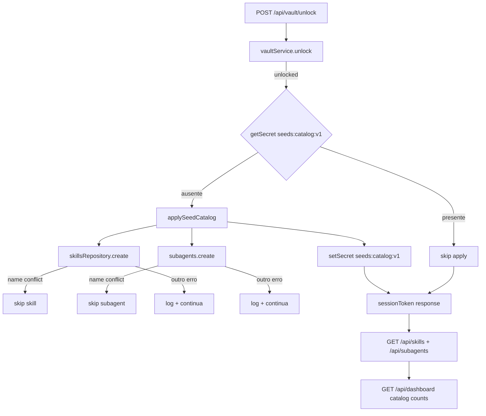

# Spec: Catálogo Seed de Onboarding

**Feature:** F17 Catálogo Seed de Onboarding  
**Complexidade:** médio  
**Escopo:** completo (PRD sem divisão Central/Completo)  
**Fonte PRD:** `docs/PRD.md` → F17 (Consome/Provê/Capacidades/Experiência/Tratamento de Erros) + §8 + §9 F17 e cross-feature Seeds  
**UI:** `ui.md`/`copy.md` ausentes e **não obrigatórios** — seeds aparecem nas telas F05 (`#skills`) e F07 (`#subagents`); sem wizard dedicado  
**Última atualização:** 2026-08-06

---

## 1. Visão Geral Técnica

**O quê:** Empacotar um catálogo versionado de skills e subagents `kind=dev` no app e aplicá-lo **uma vez por cofre** no caminho de unlock bem-sucedido (F01), via os repositórios existentes de F05 (`skillsRepository` → `skills.json`) e F07 (SQLite `subagents`). Itens entram no catálogo global como registros normais (editáveis/desabilitáveis/excluíveis); names já existentes são skipped; nenhum vínculo automático a projetos.

**Por quê:** Vault novo deixa `#skills` / `#subagents` vazios; o PRD exige um pacote inicial curado (marca EngrenaCode) para onboarding, sem sobrescrever customizações e sem bloquear unlock em falha parcial.

**Escopo:**

### Incluído

- Módulo de catálogo estático versionado (`SEED_CATALOG_VERSION = v1`) com contagens no intervalo PRD: **12 skills** e **8 subagents** (dentro de ≥8≤20 / ≥5≤12)
- Aplicador idempotente no pós-unlock: lê/grava flag vault secret `seeds:catalog:v1`
- Insert via `skillsRepository.create` e `createSubagentsRepository(db).create` (schemas F05/F07)
- Skip em `SkillNameConflictError` / `SubagentNameConflictError`; demais falhas → log + continua
- Flag marcada após a passagem de apply (mesmo com skips/falhas parciais) para não repetir em re-unlock
- Unlock HTTP continua respondendo `unlocked` + `sessionToken` mesmo se seeds falharem em parte
- Testes unitários do aplicador + integração no unlock; smoke: primeiro unlock lista seeds; re-unlock sem dupes

### Fora

- Wizard / modal / tela dedicada F17
- Anatomia ou copy finais inventados (`ui.md`/`copy.md` N/A por desenho do PRD)
- Auto-vínculo a projetos (`project_skills` / `project_subagents`)
- Seed de rules, MCPs, threads ou pricing
- Migração DDL / tabela `app_settings` / flag em `schema_migrations`
- Reescrita do storage de skills para SQLite (permanece `skills.json` via brief)
- Conteúdo legado Lion* / LionCode / LionClaw em qualquer seed

### Consome (PRD)

- F01: momento de unlock / cofre para disparo idempotente
- F01.1: sem UI dedicada; itens usam superfícies F05/F07
- F05: schema e repositório de skills
- F07: schema e repositório de subagents `kind=dev` (implícito no schema atual)

### Provê (PRD)

- Conjunto inicial editável de skills e subagents no catálogo global (contagens F04 / `#skills` / `#subagents`)

---

## 2. Impacto na Arquitetura

| Área | Caminhos |
|------|----------|
| Catálogo seed | `src/services/seeds/catalog.ts` (novo) |
| Aplicador | `src/services/seeds/apply-catalog.ts` (novo) |
| Unlock HTTP | `src/services/http/unlock-handler.ts` (mod) |
| Vault KV | `src/services/vault/vault-service.ts` (uso de `getSecret`/`setSecret`; sem API nova) |
| Skills store | `src/services/db/repositories/skills.ts` (reuse `create` / conflict) |
| Subagents store | `src/services/db/repositories/subagents.ts` (reuse `create` / conflict) |
| Dashboard / UI | sem mudança de contrato — contagens e listagens existentes passam a incluir seeds |
| Testes | `src/services/seeds/*.test.ts`, extensão `unlock-handler.test.ts` |



---

## 3. Decisões Técnicas

### 3.1 Herdadas do brief / docs canônicos

Padrões herdados de `docs/_shared/codebase-patterns.md` (e docs canônicos listados no brief).

**Desvios / delta desta feature:**

- Skills seeds → `skillsRepository` (`skills.json`), **não** SQLite nem migração `skills`
- Flag idempotente → vault secret `seeds:catalog:v1` (não `schema_migrations`)
- Hook no sucesso de `POST /api/vault/unlock` após `vaultService.unlock` OK e **antes** da resposta; falha parcial não aborta unlock
- `kind=dev` implícito (sem coluna); seeds de subagent usam schema `SubagentInput` atual
- Sem stubs de onboarding seed no código hoje (só helpers de teste com nome `seed*`); F17 introduz o módulo
- `createLogEntry` exige `threadId` e `LogKind` ∈ task|tool|git — inadequado para falha de seed sem thread; ver §3.3

### 3.2 Específicas da feature

| Decisão | Abordagem Escolhida | Alternativa Considerada | Trade-off |
|---------|-------------------|-------------------------|-----------|
| Momento do apply | Após unlock OK, antes de `res.end` com `sessionToken` | Job assíncrono pós-resposta | Garante listas prontas na primeira navegação; ainda sem bloquear unlock em erro parcial |
| Flag | Vault secret `seeds:catalog:v1` = `"1"` | Linha em `schema_migrations` / tabela settings | Alinhado ao brief e ao PRD “por cofre” |
| Contagens do pacote v1 | 12 skills + 8 subagents | Mínimo 8/5 ou máximo 20/12 | Meio da faixa PRD; curadoria estável |
| Skip vs overwrite | Catch conflict por name → skip | Upsert / merge content | Preserva customizações do usuário |
| Flag após parcial | Sempre seta após a passagem completa | Só seta se 100% inserted | Evita loop infinito de retry em unlock; seeds falhos ficam para CRUD manual |
| Logging de falha | `console.error` estruturado (`[seeds] …`) | Estender `log_entries` | Sem thread; não polui audit de task/tool/git |
| Shape do catálogo | Arrays tipados espelhando `SkillCreateInput` / `SubagentInput` (estilo `mcps/catalog.ts`) | JSON em disco no userData | Versionado no app; imutável até bump de versão |
| Auto-link | Nunca chamar `linkSkill` / link de subagent | Link a um projeto default | PRD: usuário vincula no Repo Harness |

### 3.3 Assumptions / Auto-Aceitar

| Assumption | Origem | Pode sobrescrever? |
|------------|--------|--------------------|
| Escopo = feature completa (PRD sem Central/Completo) | Auto-Aceitar: Escopo | sim |
| `ui.md`/`copy.md` ausentes — OK; sem UI dedicada; seeds só via F05/F07; não inventar anatomia/copy | Auto-Aceitar: ui.md/copy.md ausentes + PRD Experiência | sim |
| Skills via `skillsRepository` / `skills.json`; flag `seeds:catalog:v1` no vault — herdar brief, não reescolher | Auto-Aceitar: Important brief conflict / Multiple patterns | sim (só com refresh do Research) |
| Pacote v1 = **12 skills** + **8 subagents**; nomes/descrições marca **EngrenaCode** apenas (nunca Lion*) | Auto-Aceitar: Partial PRD + Clear recommendation | sim |
| Conteúdo markdown/prompt dos seeds é stub curado útil (orientação curta), não cópia de legado externo inexistente neste repo | Auto-Aceitar: Vague / best-practice | sim |
| Subagents seed: `provider: 'inherit'`, `enabled: true`, `idleTimeoutMinutes: 20` (default F07), `category: 'onboarding'` opcional | Auto-Aceitar: Partial PRD | sim |
| Skills seed: `enabled: true`, `category: 'onboarding'` | Auto-Aceitar: Partial PRD | sim |
| Falha parcial → `console.error` + continua; unlock não bloqueia; flag setada ao fim da passagem | Auto-Aceitar: Clear recommendation + PRD Tratamento de Erros | sim |
| Sem endpoints HTTP novos; verificação via GET existentes de skills/subagents/dashboard | Auto-Aceitar: codebase pattern | sim |
| Bump futuro (`seeds:catalog:v2`) fora de escopo desta feature | Auto-Aceitar: Escopo | sim |

---

## 4. Visão Geral de Componentes

### Backend

| Caminho do Arquivo | Novo/Modificado | Propósito | Responsabilidades-Chave |
|-------------------|-----------------|-----------|------------------------|
| `src/services/seeds/catalog.ts` | Novo | Dados versionados | Exportar `SEED_CATALOG_VERSION`, arrays `SEED_SKILLS`, `SEED_SUBAGENTS` tipados |
| `src/services/seeds/apply-catalog.ts` | Novo | Aplicador idempotente | Checar flag; inserir com skip/log; setar flag; retornar resumo |
| `src/services/seeds/catalog.test.ts` | Novo | Contrato do pacote | Contagens nos ranges; layout campos; marca EngrenaCode; sem Lion* |
| `src/services/seeds/apply-catalog.test.ts` | Novo | Unitário apply | Idempotência, skip name, falha parcial, sem links de projeto |
| `src/services/http/unlock-handler.ts` | Modificado | Hook pós-unlock | Chamar apply em sucesso; nunca falhar a resposta por seed |
| `src/services/http/unlock-handler.test.ts` | Modificado | Integração unlock | 1º unlock aplica; 2º não duplica; unlock OK com falha parcial simulada |

### Frontend

| Caminho do Arquivo | Novo/Modificado | Propósito | Responsabilidades-Chave |
|-------------------|-----------------|-----------|------------------------|
| _(nenhum)_ | — | Sem UI F17 | Telas F05/F07 e dashboard F04 já listam/contam o catálogo global |

### Banco de Dados

| Arquivo de Migração | Tabelas Afetadas | Operação | Notas |
|-------------------|------------------|----------|-------|
| _(nenhuma)_ | `subagents` (rows) | INSERT via repo | Sem DDL; skills em `skills.json` |

---

## 5. Contratos de API

F17 **não** adiciona rotas. O contrato é o side-effect de unlock + leitura pelas APIs existentes.

### 5.1 Side-effect: Unlock aplica seeds

- **Método:** POST  
- **Caminho:** `/api/vault/unlock`  
- **Autenticação:** pública (fluxo F01)

**Requisição:** (inalterada)

| Campo | Tipo | Obrigatório | Validação | Descrição |
|-------|------|-------------|-----------|-----------|
| `workspace` | `string` | Sim | não vazio | Workspace do cofre |
| `password` | `string` | Sim | não vazio | Senha do vault |

**Exemplo de Requisição:**
```json
{
  "workspace": "default",
  "password": "senha-forte-123"
}
```

**Comportamento F17 (quando `unlocked: true`):**

1. Se `vaultService.getSecret('seeds:catalog:v1')` estiver definido → não aplica.
2. Caso contrário → `applySeedCatalog()` (skills depois subagents, ou ordem documentada no módulo).
3. Por item: `create`; conflict → skip; outro erro → log + continua.
4. `vaultService.setSecret('seeds:catalog:v1', '1')`.
5. Resposta HTTP de unlock **inalterada** (não inclui payload de seeds).

**Resposta (Sucesso - 200):** (formato F01 existente)

| Campo | Tipo | Descrição |
|-------|------|-----------|
| `unlocked` | `boolean` | `true` quando senha OK |
| `sessionToken` | `string` | Token de sessão (quando unlocked) |
| `retryAfterMs` | `number` | Presente só em rate-limit / falha com backoff |

**Exemplo de Resposta:**
```json
{
  "unlocked": true,
  "sessionToken": "sess_…"
}
```

**Códigos de Erro:** (sem códigos novos F17; unlock permanece F01)

| Código | Status HTTP | Descrição |
|--------|-------------|-----------|
| `validation_error` | 400 | Body incompleto |
| `internal_error` | 500 | Erro inesperado no unlock (não usado para falha parcial de seed) |

### 5.2 Verificação: listagens existentes

Após o primeiro unlock com apply:

- `GET /api/skills` (auth session) → inclui os names do pacote (exceto skipped)
- `GET /api/subagents` → idem
- `GET /api/dashboard` → `catalog.skills` / `catalog.subagents` ≥ contagens inseridas

**Exemplo (skill seed na listagem — campos relevantes):**
```json
{
  "id": "…",
  "name": "code-review",
  "description": "Revisão de código com foco em regressões e clareza (EngrenaCode).",
  "category": "onboarding",
  "enabled": true
}
```

### 5.3 Resumo interno do aplicador (não HTTP)

Tipo de retorno sugerido para testes:

```json
{
  "applied": true,
  "skillsInserted": 12,
  "skillsSkipped": 0,
  "skillsFailed": 0,
  "subagentsInserted": 8,
  "subagentsSkipped": 0,
  "subagentsFailed": 0
}
```

Quando a flag já existe: `{ "applied": false, …zeros }`.

---

## 6. Modelo de Dados

### 6.1 Flag no vault (não é tabela)

| Chave | Valor | Nullable | Descrição |
|-------|-------|----------|-----------|
| `seeds:catalog:v1` | `"1"` | — | Presente ⇒ pacote v1 já processado neste cofre |

Persistência: envelope cifrado do vault (`vault.enc`) via `setSecret`/`getSecret`.

### 6.2 Catálogo estático (código)

**Skills (`SEED_SKILLS`)** — cada item satisfaz `SkillCreateInput`:

| Campo | Tipo | Obrigatório | Notas |
|-------|------|-------------|-------|
| `name` | `string` | Sim | Único no pacote e no catálogo global |
| `description` | `string` | Sim | Curta; marca EngrenaCode quando citar produto |
| `content` | `string` | Sim | Markdown de orientação; ≤ 1 MiB |
| `category` | `string` | Não | `"onboarding"` |
| `enabled` | `boolean` | Não | default `true` |

**Pacote v1 — 12 skills (names canônicos):**

| name | Propósito (1 linha) |
|------|---------------------|
| `code-review` | Revisar diff com foco em bugs e clareza |
| `explain-diff` | Explicar mudanças para o revisor humano |
| `write-tests` | Propor testes unitários alinhados ao repo |
| `refactor-safe` | Refatorar sem mudar comportamento observável |
| `debug-root-cause` | Isolar causa raiz com evidência |
| `commit-message` | Sugerir mensagem de commit convencional |
| `pr-description` | Rascunhar descrição de PR |
| `api-design` | Revisar contratos de API |
| `docs-from-code` | Documentar módulos a partir do código |
| `security-checklist` | Checklist rápido de segurança |
| `performance-pass` | Passada de performance óbvia |
| `onboarding-repo-map` | Mapear estrutura do repositório no onboarding |

**Subagents (`SEED_SUBAGENTS`)** — cada item satisfaz `SubagentInput` (`kind=dev` implícito):

| Campo | Tipo | Obrigatório | Notas |
|-------|------|-------------|-------|
| `name` | `string` | Sim | Único |
| `description` | `string` | Sim | Curta; EngrenaCode only |
| `prompt` | `string` | Sim | Instrução do subagent; ≤ 1 MiB |
| `provider` | `string` | Sim | `"inherit"` no pacote v1 |
| `model` | `string\|null` | Não | `null` |
| `reasoningLevel` | `string\|null` | Não | `null` |
| `tools` | `string[]\|null` | Não | `null` (todas) |
| `category` | `string\|null` | Não | `"onboarding"` |
| `idleTimeoutMinutes` | `number\|null` | Não | `20` |
| `enabled` | `boolean` | Não | `true` |

**Pacote v1 — 8 subagents (names canônicos):**

| name | Propósito (1 linha) |
|------|---------------------|
| `explorer` | Explorar codebase e reportar mapa |
| `implementer` | Implementar mudança pequena e focada |
| `reviewer` | Revisar patch do pai |
| `tester` | Escrever/rodar testes relevantes |
| `docs-writer` | Atualizar docs do escopo |
| `debugger` | Diagnosticar falha com evidência |
| `refactorer` | Refatorar com segurança |
| `planner` | Quebrar tarefa em passos |

### 6.3 Persistência resultante

- Skills: rows em `userData/skills.json` (mesma forma F05); **sem** entradas em `projectSkills` pelo apply
- Subagents: rows na tabela `subagents`; **sem** rows em `project_subagents` pelo apply

**Índices / constraints:** os já existentes (UNIQUE `name` em subagents; unicidade de name em skills no repo).

**Migração SQL:** nenhuma.

---

## 7. Estratégia de Testes

### 7.1 Unitário / Integração

| Arquivo de Teste | Tipo | Alvo | Objetivo |
|-----------------|------|------|----------|
| `src/services/seeds/catalog.test.ts` | Unitário | catálogo | Contagens, shape, marca |
| `src/services/seeds/apply-catalog.test.ts` | Unitário | aplicador | Idempotência, skip, falha parcial, sem links |
| `src/services/http/unlock-handler.test.ts` | Integração | unlock + seeds | Hook no POST unlock |

**`catalog.test.ts`**

| Função de Teste | Descrição | Assertions |
|-----------------|-----------|-----------|
| `test_seed_skills_count_in_prd_range` | Contagem skills | `≥ 8` e `≤ 20`; pacote v1 === 12 |
| `test_seed_subagents_count_in_prd_range` | Contagem subagents | `≥ 5` e `≤ 12`; pacote v1 === 8 |
| `test_seed_names_unique_within_catalog` | Unicidade interna | Sem names duplicados |
| `test_seed_brand_engrenacode_only` | Marca | Strings do pacote não contêm `Lion` / `lioncode` / `LionClaw` / `LionLabs` / `LionSprite`; EngrenaCode ok onde citar produto |
| `test_seed_skill_fields_valid` | Shape skill | name/description/content não vazios; content ≤ 1 MiB |
| `test_seed_subagent_fields_valid` | Shape subagent | provider `inherit`; prompt não vazio; idle 1..480 ou default |

**`apply-catalog.test.ts`** (isolamento via `ENGRENACODE_USER_DATA` + vault de teste)

| Função de Teste | Descrição | Assertions |
|-----------------|-----------|-----------|
| `test_apply_inserts_skills_and_subagents_once` | 1ª aplicação | Contagens globais += pacote; flag `seeds:catalog:v1` === `"1"` |
| `test_apply_is_noop_when_flag_set` | 2ª aplicação | Zero inserts; lists estáveis |
| `test_apply_skips_existing_skill_name` | Name skill pré-existente | Skip; demais inseridos; sem overwrite de content |
| `test_apply_skips_existing_subagent_name` | Name subagent pré-existente | Skip; demais inseridos |
| `test_apply_partial_failure_continues` | Create lança erro genérico num item | Log path exercitado; outros items ok; flag setada; unlock caller não vê throw |
| `test_apply_does_not_create_project_links` | Pós-apply | `projectSkills` / `project_subagents` vazios para os ids seed |
| `test_apply_requires_unlocked_vault_for_flag` | Flag só com vault unlocked | Alinha a `setSecret` existente |

**`unlock-handler.test.ts` (extensões)**

| Função de Teste | Descrição | Assertions |
|-----------------|-----------|-----------|
| `test_unlock_applies_seed_catalog_on_first_success` | POST unlock fresco | `unlocked` + token; GET skills/subagents contém names do pacote |
| `test_unlock_does_not_duplicate_seeds_on_relock` | Unlock → lock/re-unlock ou segundo unlock | Contagens estáveis; sem dupes por name |
| `test_unlock_succeeds_when_seed_apply_partially_fails` | Mock/stub falha parcial | HTTP 200 `unlocked: true` + `sessionToken` |

### 7.2 Smoke / Aceitação manual

| # | Passo | Resultado esperado |
|---|-------|-------------------|
| 1 | UserData isolado (`ENGRENACODE_USER_DATA`); cofre novo; unlock via UI ou `POST /api/vault/unlock` | Sessão OK; app não trava |
| 2 | Abrir `#skills` | Lista contém as 12 skills seed (names da §6); empty state deixa de ser o único caminho |
| 3 | Abrir `#subagents` | Lista contém os 8 subagents seed |
| 4 | Abrir `#dashboard` | `catalog.skills` / `catalog.subagents` refletem as contagens (F04) |
| 5 | Lock + unlock de novo (ou restart + unlock) | Sem duplicatas por name; contagens estáveis |
| 6 | Editar/desabilitar/excluir uma skill seed em `#skills` | Comporta-se como item normal F05 |
| 7 | Criar skill manual com name igual a um seed **antes** do primeiro apply (cenário avançado / teste) | Seed correspondente skipped; demais aplicados |
| 8 | Inspecionar vínculos de projeto | Nenhum seed auto-vinculado |

### 7.3 Cross-feature

| Critério | Status | Nota |
|----------|--------|------|
| Seeds aparecem nas contagens do Dashboard (F04) após primeiro unlock (F01) | ready | PRD §9 Integração Cross-Feature |
| Seeds listados em telas F05 / F07 após primeiro unlock | ready | Experiência F17 + §9 F17 |
| Contagens F05/F07 → dashboard (já existente) continuam válidas com seeds | ready | Regressão via `getCounts().global` |
| Re-unlock F01 não duplica seeds | ready | Idempotência `seeds:catalog:v1` |
| Seeds não criam links de projeto (Repo Harness continua o único vínculo) | ready | §9 F17 |
| load_skill (F12) / runtime subagents (F15) | deferred | Seeds só no catálogo global até o usuário vincular; fora do AC direto F17 |

---

## Rastreabilidade PRD → Spec

| Bloco PRD | Destino |
|-----------|---------|
| Consome F01/F01.1/F05/F07 | §1 Consome + §2 unlock/repos |
| Provê pacote inicial | §1 Provê + §6 catálogo |
| Capacidades (contagens, flag, skip, editável, sem auto-link) | §3 + §6 + §7 |
| Experiência (listas F05/F07; sem wizard) | §1 Fora + §3.3 UI N/A |
| Tratamento de Erros | §3.2 logging + §5.1 + §7.1 partial failure |
| §9 F17 | §7.1–7.2 |
| §9 Cross-feature Seeds↔F04/F05/F07/F01 | §7.3 |
