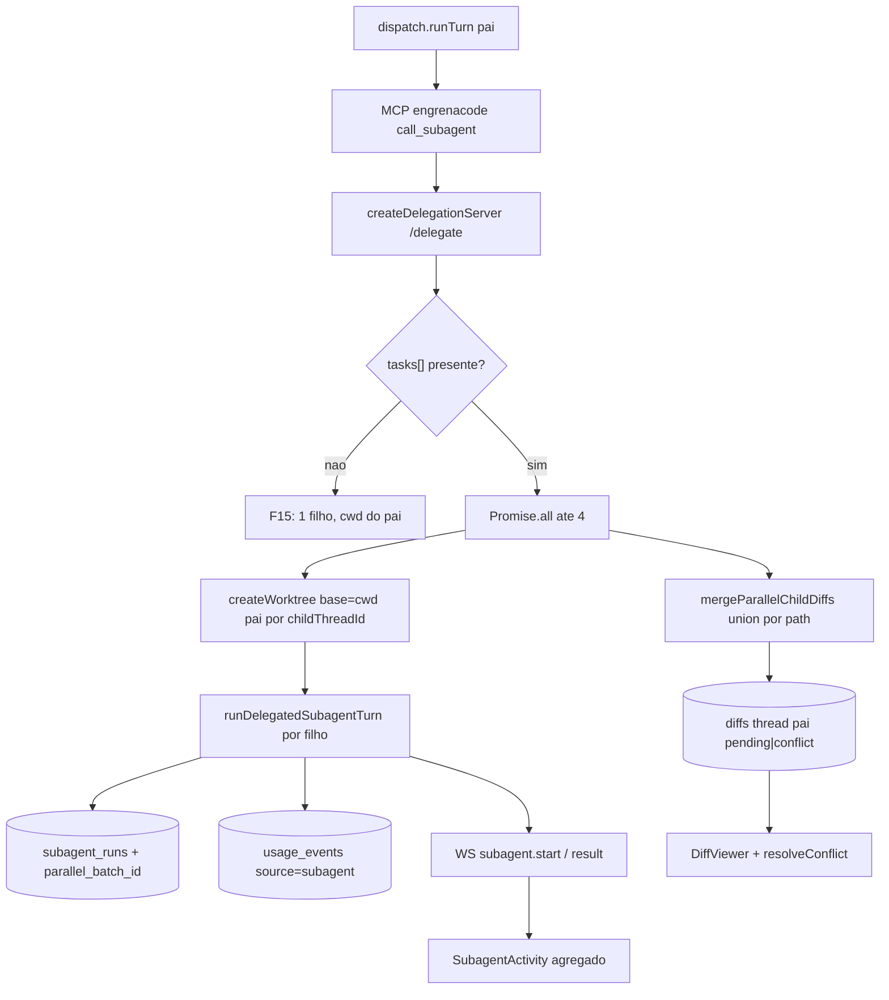

# Spec Técnica: F18. Subagents em Paralelo (Write-Parallel)

## 1. Visão Geral Técnica

**O quê:** Estender `call_subagent` para aceitar até 4 tarefas simultâneas no mesmo tool call (`tasks[]`), cada filho em worktree isolado derivado do cwd do pai; agregar diffs por union de path numa única revisão no pai; marcar path tocado por ≥2 filhos como `conflict` (accept/reject bloqueados até o usuário escolher o vencedor); falha/timeout de um filho não aborta os demais. Introduzir `kind` no catálogo (`dev` | `pipeline`) para F22.

**Por quê:** Hoje a delegação em `delegate.ts` é FIFO e os filhos compartilham o cwd do pai (`resolveThreadCwd` do parent). Sem paralelismo isolado, tarefas grandes não podem dividir escrita sem colisão, e o merge/conflito não existe no modelo de diffs (`pending|accepted|rejected`).

**Escopo:** PRD define `Escopo Central` e `Adições ao Escopo Completo` (`docs/PRD.md` F18). Esta spec cobre **Central only**. Completo está sinalizado no PRD como **Versão 2.0** (não entra em 1.3).

**Incluído:**
- Schema MCP: `call_subagent` com `tasks?: { name, task, context? }[]` (1–4); sem `tasks` = comportamento F15 (1×1 serial)
- Spawn paralelo dos itens de `tasks` (até 4); gate Codex / idle / hard-cap 2h / `usage_events source=subagent` reusados por filho (F07/F15)
- Worktree próprio por filho paralelo, base = cwd resolvido do pai (F13)
- Merge por union de path → diffs no `threadId` do pai; path colidente → `status=conflict`
- Resolução manual de conflito: escolher vencedor (filho) por path; promove a `pending`
- Coluna `kind` em `subagents` (`dev` default | `pipeline`); serial F15 e CRUD F07 continuam válidos
- Card/timeline: status individual + progresso agregado do batch (contrato de dados; UI visual aguarda design)
- Relatório final ao pai com status por filho (sucesso/erro/timeout/skip de worktree)

**Adiado (Escopo Completo → Versão 2.0):**
- Estratégias de merge configuráveis (preferir filho X)
- Comparação lado a lado dos diffs dos filhos antes do merge

**UI/copy:** [`ui.md`](./ui.md) · [`copy.md`](./copy.md) (2026-08-08, `/screen-ui-spec`). Spec cobre contrato de dados/estado; anatomia/copy de batch, conflitos e `kind` citam esses docs. Baseline de ids de run: `docs/F07-subagents/copy.md` (`subagentsRun.*`) e superfícies F15.

**Excluído:** merge-tree / merge de hunks; profundidade > 1; Completo v2.0; mudança do path serial F15 (cwd compartilhado permanece).

**Consome (PRD):** F03 dispatch/DiffViewer/lease/WS; F07 defs + gate; F13 worktree; F15 runtime `call_subagent`.  
**Provê (PRD):** runs paralelos + diff mergeado; `kind=pipeline` para F22.

---

## 2. Impacto na Arquitetura



---

## 3. Decisões Técnicas

### 3.1 Herdadas do brief / docs canônicos

Padrões herdados de `docs/_shared/codebase-patterns.md` (baseline Camada 1) e docs canônicos: F15 (`delegate.ts`, MCP `engrenacode`), F13 (`worktree.ts`), F07 (gate/UI runs), F03 (DiffViewer/WS), validação manual tipada, Vitest co-local, migrações numeradas SQLite.

Desvios: (1) filhos **paralelos** ganham worktree próprio (F15 serial continua cwd do pai); (2) `DiffStatus` ganha `conflict`; (3) delegação deixa de ser só FIFO quando `tasks[]` está presente.

O brief em disco é da Onda 4 (`features_in_batch` F20/F21/F23/F26; `git_sha` pode estar stale vs HEAD). Camada 1 permanece válida; decisões F18 vêm da entrevista + código atual (`delegate.ts` FIFO, sem `kind`, sem merge).

### 3.2 Específicas da feature

| Decisão | Abordagem Escolhida | Alternativa Considerada | Trade-off |
|---------|---------------------|-------------------------|-----------|
| Shape da tool | Estender `call_subagent` com `tasks[]` opcional (1–4). Sem array = F15 | Nova tool `call_subagents_parallel` | Menos superfície pro modelo; F22 reusa o mesmo contrato |
| Quem pode paralelizar | Qualquer `call_subagent` com `tasks[]`; `kind=pipeline` é rótulo de catálogo (F22), não gate | Só `kind=pipeline` pode usar `tasks[]` | PRD amarra paralelismo ao shape da chamada, não ao kind do filho |
| Merge | Union por path: paths exclusivos → `pending` no pai; path em ≥2 filhos → `conflict` | `git merge-tree` / merge de hunks | Cobre AC §9; Completo v2.0 fica para estratégia/lado a lado |
| Worktree do filho paralelo | Base = `resolveThreadCwd(pai)`; path `userData/worktrees/<projectId>/<childThreadId>`; branch `engrenacode/<childThreadId>` | Sempre HEAD de `project.path` | Herda isolamento do pai; irmãos não colidem em disco |
| Conflito (Central) | Usuário escolhe vencedor (run/filho) por path → vira `pending`; accept/reject bloqueados enquanto `conflict` | Só rejeitar o grupo até v2.0 | Desbloqueia fluxo sem UI Completo |
| `kind` | Coluna `kind TEXT NOT NULL DEFAULT 'dev'` com CHECK/`dev`\|`pipeline` | Reusar `category='pipeline'` | `category` é rótulo livre do usuário; kind semântico quebra F07/F17 se misturado |
| Correlação de batch | `parallel_batch_id` em `subagent_runs` (UUID por invocação `tasks[]`); null no path serial | Só inferir por `created_at` | UI agregada e relatório estáveis após reload |
| Concorrência no loopback | Com `tasks[]`, spawn paralelo (`Promise.all` limitado a len(tasks)≤4); path serial permanece FIFO | Sempre FIFO mesmo com `tasks[]` | AC exige simultâneos |

### 3.3 Assumptions / Decisões de entrevista

| Assumption | Origem | Pode sobrescrever? |
|------------|--------|--------------------|
| Escopo = Central only; Completo → Versão 2.0 (já no PRD §6/§7) | entrevista + edição PRD | sim |
| `tasks[]` estende `call_subagent` (não tool nova) | entrevista | sim |
| Merge = union por path (não merge-tree) | entrevista | sim |
| Coluna `kind` (`dev`\|`pipeline`) | entrevista | sim |
| Paralelo não exige `kind=pipeline` | entrevista | sim |
| Worktree filho = derivado do cwd do pai | entrevista | sim |
| Resolução de conflito = escolher vencedor por path | entrevista | sim |
| Path serial F15 (sem `tasks`) **não** cria worktree por filho — cwd compartilhado permanece | entrevista + codebase F15 | sim |
| Falha ao criar worktree de um filho → esse item `skipped`/`error`; demais continuam | PRD Tratamento de Erros | sim |
| `ui.md`/`copy.md` ausentes — só contrato de dados/estado | Auto-Aceitar: ui.md/copy.md ausente | sim |
| Índice de migração `00N` = próximo livre na implementação (F20 reserva `008_memory` na sua spec) | codebase + peer specs | sim |

---

## 4. Visão Geral de Componentes

**Backend — runner / git:**

| Caminho do Arquivo | Novo/Modificado | Propósito | Responsabilidades-Chave |
|---------------------|------------------|-----------|--------------------------|
| `src/services/runner/subagent-mcp-server.ts` | Modificado | Schema + handler paralelo | Aceitar `tasks[]` (validar 1–4); serializar POST ao loopback com batch ou item único; resposta agregada ao modelo |
| `src/services/runner/delegate.ts` | Modificado | Spawn paralelo + merge | Detectar batch; criar worktrees filhos; `Promise.all` dos runs; chamar merge; relatório parcial; cleanup worktree filho quando seguro |
| `src/services/runner/parallel-merge.ts` | Novo | Union por path | Coletar diffs/arquivos alterados por filho; emitir `pending` ou `conflict` no thread do pai; anexar candidatos (childThreadId / run) |
| `src/services/git/worktree.ts` | Modificado | Base alternativa | API para criar worktree a partir de um repo/cwd base (pai) + `childThreadId` (reusa path/branch naming F13) |
| `src/services/runner/subagent-caller-gate.ts` | Reusado | Gate por filho | Mesma regra Codex full-access por item do batch |
| `src/services/runner/apply-diff.ts` | Modificado | Bloquear conflict | `accept`/`reject` recusam `status=conflict`; novo path `resolveConflict({ diffId, winningChildThreadId })` |
| `src/services/runner/ws-hub.ts` | Modificado | Eventos de batch | Opcional: enriquecer `subagent.*` com `parallelBatchId`; ou evento `subagent.batch` com contagens |

**Backend — DB / HTTP:**

| Caminho do Arquivo | Novo/Modificado | Propósito | Responsabilidades-Chave |
|---------------------|------------------|-----------|--------------------------|
| `src/services/db/migrations/00N_write_parallel.ts` | Novo | Schema F18 | `subagents.kind`; `subagent_runs.parallel_batch_id`; `diffs.status` inclui `conflict`; metadados de candidatos de conflito (coluna JSON ou tabela auxiliar — ver §6) |
| `src/services/db/repositories/subagents.ts` | Modificado | CRUD kind + runs | `Subagent.kind`; create/update validam enum; `createSubagentRun` aceita `parallelBatchId` |
| `src/services/db/repositories/diffs.ts` | Modificado | DiffStatus + conflict | Estender union; list/get; helpers de conflito |
| `src/services/http/subagents-handler.ts` | Modificado | API kind | Aceitar/devolver `kind` no CRUD |
| `src/services/http/threads-handler.ts` / diffs handler | Modificado | Resolve conflict | Endpoint ou ação no fluxo de diffs existente para escolher vencedor |

**Frontend (contrato; UI final após design):**

| Caminho do Arquivo | Novo/Modificado | Propósito | Responsabilidades-Chave |
|---------------------|------------------|-----------|--------------------------|
| `src/renderer/components/subagents/SubagentActivity.tsx` | Modificado | Progresso agregado | Agrupar runs pelo `parallelBatchId`; status por filho |
| `src/renderer/components/workspace/DiffViewer.tsx` | Modificado | Seção conflitos | Bloquear accept/reject em `conflict`; CTA escolher vencedor (copy via design) |
| `src/renderer/screens/SubagentsScreen.tsx` + form | Modificado | Campo kind | Expor `dev`/`pipeline` no formulário quando `ui.md` existir |
| `src/renderer/services/subagents-service.ts` / diffs service | Modificado | Tipos + resolve | Tipar `kind`, `parallelBatchId`, `conflict`; chamar resolve |

**Banco de Dados:**

| Arquivo de Migração | Tabelas Afetadas | Operação | Notas |
|---------------------|------------------|----------|-------|
| `00N_write_parallel.ts` | `subagents`, `subagent_runs`, `diffs` (+ opcional `diff_conflict_candidates`) | ALTER / CREATE | N = próximo livre |

---

## 5. Contratos de API

### 5.1 MCP tool `call_subagent` (estendido)

**Input (serial — F15, inalterado):**

| Campo | Tipo | Obrigatório | Validação | Descrição |
|-------|------|-------------|-----------|-----------|
| `name` | `string` | Sim* | non-empty | Nome do subagent (*obrigatório se sem `tasks`) |
| `task` | `string` | Sim* | non-empty | Tarefa (*se sem `tasks`) |
| `context` | `string` | Não | — | Contexto opcional |

**Input (paralelo):**

| Campo | Tipo | Obrigatório | Validação | Descrição |
|-------|------|-------------|-----------|-----------|
| `tasks` | `array` | Sim (modo paralelo) | length 1–4; cada item `{ name, task, context? }` | Batch paralelo |

Se `tasks` e `name`/`task` top-level coexistirem → `validation_error` (ambíguo).  
Se `tasks.length > 4` → erro estruturado ao modelo (`isError: true`), nenhum filho inicia.

**Exemplo (paralelo):**
```json
{
  "tasks": [
    { "name": "implementer-a", "task": "Adicionar endpoint X em src/a.ts" },
    { "name": "implementer-b", "task": "Adicionar testes em src/a.test.ts" }
  ]
}
```

**Resultado (texto agregado ao modelo):** lista por filho com `status` (`completed`|`error`|`timeout`|`skipped`), `subagent_name`, `child_thread_id`, resumo curto; nota se houve `conflict` no merge.

### 5.2 HTTP — escolher vencedor de conflito

- **Método:** POST  
- **Caminho:** `/api/threads/:threadId/diffs/:diffId/resolve-conflict`  
- **Autenticação:** session + guard vault (423/401 como demais handlers)

**Requisição:**

| Campo | Tipo | Obrigatório | Validação | Descrição |
|-------|------|-------------|-----------|-----------|
| `winningChildThreadId` | `string` | Sim | deve ser candidato do conflito | Filho vencedor |

**Exemplo:**
```json
{
  "winningChildThreadId": "thread_child_abc"
}
```

**Resposta 200:**
```json
{
  "diff": {
    "id": "diff_…",
    "threadId": "thread_parent",
    "file": "src/a.ts",
    "status": "pending",
    "additions": 12,
    "deletions": 3
  }
}
```

**Erros:**

| Código | Status HTTP | Descrição |
|--------|-------------|-----------|
| `validation_error` | 400 | Body inválido / vencedor não é candidato |
| `diff_not_found` | 404 | Diff inexistente ou de outra thread |
| `diff_not_conflict` | 409 | Diff não está em `conflict` |
| `thread_busy` | 409 | Lease / turno running no projeto |
| `unauthorized` / `vault_locked` | 401 / 423 | Guard padrão |

### 5.3 HTTP — CRUD subagents (`kind`)

Estender create/update/list existentes:

| Campo | Tipo | Obrigatório | Validação |
|-------|------|-------------|-----------|
| `kind` | `'dev' \| 'pipeline'` | Não (default `dev`) | enum |

Seeds F17 e rows existentes migram para `dev`.

### 5.4 WS / history (contrato de dados)

- `subagent_runs` expostos em history incluem `parallelBatchId: string | null`
- UI agrupa por `parallelBatchId` para progresso agregado (`completedCount/total`)
- Accept/reject de diff com `status=conflict` → 409 `diff_conflict` (ou equivalente) até resolve

---

## 6. Modelo de Dados

### Tabela: `subagents` (ALTER)

| Coluna | Tipo | Nullable | Padrão | Descrição |
|--------|------|----------|--------|-----------|
| `kind` | `TEXT` | Não | `'dev'` | `dev` \| `pipeline` |

**Constraints:** CHECK `kind IN ('dev','pipeline')` (ou validação só na app se SQLite legado impedir CHECK em ALTER — preferir CHECK na migração quando possível).

### Tabela: `subagent_runs` (ALTER)

| Coluna | Tipo | Nullable | Padrão | Descrição |
|--------|------|----------|--------|-----------|
| `parallel_batch_id` | `TEXT` | Sim | `NULL` | UUID do batch; null = serial F15 |

**Índices:** `ix_subagent_runs_batch` em `parallel_batch_id`.

### Tabela: `diffs` (ALTER status)

`DiffStatus` = `'pending' | 'accepted' | 'rejected' | 'conflict'`.

**Candidatos de conflito** (escolher uma na implementação; preferir A):

**A — coluna JSON em `diffs`:**
| Coluna | Tipo | Nullable | Descrição |
|--------|------|----------|-----------|
| `conflict_candidates_json` | `TEXT` | Sim | `[{ childThreadId, subagentName, hunks, additions, deletions }]` |

**B — tabela `diff_conflict_candidates`:** FK `diff_id`, `child_thread_id`, hunks_json, …

Assumption: **A** (menos joins; volume baixo).

**Migração (exemplo, N provisório):**
```sql
ALTER TABLE subagents ADD COLUMN kind TEXT NOT NULL DEFAULT 'dev';
-- validar kind na app e/ou CHECK via rebuild se necessário

ALTER TABLE subagent_runs ADD COLUMN parallel_batch_id TEXT;
CREATE INDEX IF NOT EXISTS ix_subagent_runs_batch ON subagent_runs(parallel_batch_id);

ALTER TABLE diffs ADD COLUMN conflict_candidates_json TEXT;
-- status 'conflict' passa a ser valor válido escrito pela app
```

---

## 7. Estratégia de Testes

### 7.1 Unitário / Integração

| Arquivo de Teste | Tipo | Alvo | Objetivo |
|------------------|------|------|----------|
| `src/services/runner/parallel-merge.test.ts` | Unitário | merge | Union, conflict, vencedor |
| `src/services/runner/delegate.test.ts` | Unitário | batch spawn | Paralelo ≤4; skip worktree; falha parcial |
| `src/services/runner/subagent-mcp-server` (via testes existentes / extensão) | Unitário | schema | `tasks` 1–4; ambiguidade; >4 |
| `src/services/db/repositories/subagents.test.ts` | Unitário | kind + batch id | Default `dev`; persistência batch |
| `src/services/db/repositories/diffs.test.ts` | Unitário | conflict | Status + candidates |
| `src/services/runner/apply-diff.test.ts` | Unitário | gate | Accept/reject bloqueados; resolve OK |
| `src/services/http/*` (threads/diffs/subagents) | Integração | HTTP | resolve-conflict 200/409; CRUD kind |

| Função de Teste | Descrição | Assertions |
|-----------------|-----------|------------|
| `test_merge_disjoint_paths_pending` | Dois filhos, paths distintos | Ambos `pending` no pai |
| `test_merge_same_path_conflict` | Mesmo path em 2 filhos | Um diff `conflict` + 2 candidates |
| `test_resolve_conflict_promotes_winner` | Escolhe child A | Status `pending`; hunks de A |
| `test_accept_conflict_rejected` | Accept com conflict | Erro / 409 |
| `test_parallel_one_child_worktree_fail` | createWorktree falha num item | Esse skipped; outro completa |
| `test_parallel_child_timeout_others_continue` | Idle/timeout num filho | Demais terminam; relatório parcial |
| `test_tasks_over_limit` | 5 tasks | Erro; zero runs |
| `test_serial_call_unchanged` | Sem `tasks` | Um filho; cwd pai; `parallel_batch_id` null |
| `test_kind_default_dev` | Create sem kind | `kind=dev` |
| `test_usage_events_per_child` | Batch 2 completed | 2 events `source=subagent` |

### 7.2 Smoke / Aceitação manual

| # | Passo | Resultado esperado |
|---|-------|-------------------|
| 1 | Unlock → projeto git → thread → prompt que force `call_subagent` com `tasks` de 2 subagents em paths distintos | 2 runs `running`→`completed`; 2 worktrees sob userData; diffs `pending` no pai; usage share subagent > 0 |
| 2 | Repetir forçando o mesmo arquivo nos 2 tasks | Diff `conflict`; accept/reject bloqueados; escolher vencedor → `pending` → accept aplica no cwd do pai |
| 3 | Batch com 1 nome inválido + 1 válido | Inválido erro; válido completa; relatório parcial |
| 4 | (UI pós-design) light/dark: card com progresso agregado + seção conflitos vs `ui.md`/`copy.md` | Aceite visual |

### 7.3 Cross-feature

| Critério | Status | Nota |
|----------|--------|------|
| `call_subagent` paralelo reusa gate/idle/usage_events F07/F15 e worktree F13 por filho (`docs/PRD.md` §9 integração) | ready (deps feitas) | Provar no smoke |
| ACs §9 F18 (4 itens) | ready | Cobertos por 7.1/7.2 |
| F22 consome `kind=pipeline` + paralelo | deferred até F22 | Provê kind + `tasks[]` |
| Completo merge configurável / lado a lado | deferred Versão 2.0 | PRD §7 |

---

**Complexidade:** complexo (runtime paralelo, schema, merge, UI contratos, smoke E2E).
