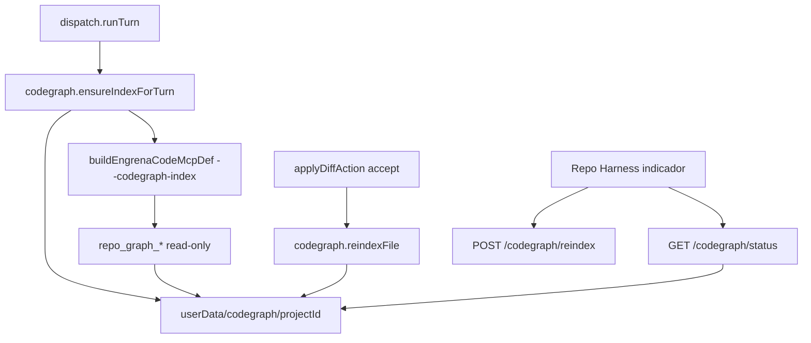

# Spec Técnica: F19. CodeGraph e Navegação Estrutural

## 1. Visão Geral Técnica

**O quê:** Índice estrutural local por projeto (TS/JS via TypeScript Compiler API), persistido em `userData/codegraph/<projectId>/`, exposto no turno pelas tools MCP `repo_graph_find_definition`, `repo_graph_find_references` e `repo_graph_module_deps` no server interno `engrenacode`. Reindexação incremental no accept de diff; reindex completo manual ou por idade (>24h). Indicador de status no Repo Harness (contrato de dados). Linguagens não-TS/JS caem para busca textual sem quebrar a tool.

**Por quê:** Hoje o agente só navega por `@file`/leitura bruta. Sem índice, definition/references/module deps exigem colar código no prompt. F12 já padroniza tools condicionais no MCP `engrenacode` + artefato em disco por flag — F19 estende o mesmo padrão.

**Escopo:** PRD F19 sem split Central/Completo → **feature inteira**.

**Incluído:**
- Indexador TS/JS (`typescript` em `dependencies`) sobre `project.path`
- Cache em disco: `index.json` + `meta.json` por `projectId`; nunca enviado a servidor externo
- Build lazy no **primeiro turno** do projeto (antes do spawn do provider) se cache ausente ou `indexedAt` > 24h
- Tools MCP read-only via `--codegraph-index <path>`
- Reindex incremental quando `applyDiffAction(accept)` altera arquivo sob o root indexado
- `GET /api/projects/:id/codegraph/status` e `POST /api/projects/:id/codegraph/reindex`
- Fallback textual para arquivos/linguagens fora de TS/JS
- Contrato de dados para indicador: `indexed` | `indexing` | `unsupported`

**Excluído:**
- Tela dedicada de grafo / mapa visual interativo
- Parsers além de TS/JS (Python, Go, etc.) — só fallback textual
- Indexar `worktreePath` como segunda fonte de verdade
- Type-checker completo / resolução de monorepo via `tsconfig` project references (v1: parse por arquivo com `createSourceFile`, sem programa completo obrigatório)

**UI/copy:** `docs/F19-codegraph-e-navegacao-estrutural/ui.md` e `copy.md` (2026-08-07, `/screen-ui-spec` a partir de LionCodeLabs). Anatomia/copy da seção sidebar + consent; slots CLI externa marcados fora do escopo Engrena F19.

**Consome (PRD):** F01.1 tokens; F03 cwd/dispatch; F12 MCP `engrenacode`.  
**Provê (PRD):** tools `repo_graph_*` no turno (F03/F22).

---

## 2. Impacto na Arquitetura



---

## 3. Decisões Técnicas

### 3.1 Herdadas do brief / docs canônicos

Padrões de `docs/_shared/codebase-patterns.md` (Camada 1) e F12: MCP `engrenacode` com tools condicionais por flag, `ELECTRON_RUN_AS_NODE=1`, snapshot em disco, dispatch monta `buildEngrenaCodeMcpDef`, walk de arquivos F16 (`IGNORED_DIRS`, `MAX_SCAN`), `userData` com override `ENGRENACODE_USER_DATA`.

Desvios: (1) `typescript` sobe para `dependencies` (hoje só `devDependencies`); (2) índice persistente por projeto (não efêmero por turno como skill snapshot — o path passado ao MCP aponta ao cache estável, atualizado no ensure/accept).

Brief Onda 4 pode estar stale vs HEAD; Camada 1 permanece válida. Delta F19 confirmado: zero AST/`repo_graph_*` em `src/` hoje.

### 3.2 Específicas da feature

| Decisão | Abordagem Escolhida | Alternativa Considerada | Trade-off |
|---------|---------------------|-------------------------|-----------|
| Parser TS/JS | TypeScript Compiler API (`createSourceFile` + walk) | tree-sitter / `@babel/parser` | Já no repo; sem native addon no Electron |
| Momento do index | Lazy no 1º turno (pré-spawn), se ausente ou >24h | Lazy na 1ª tool call | Tools já úteis; alinhado ao PRD “primeiro turno” |
| Raiz | Sempre `project.path` | `resolveThreadCwd` / worktree | Cache por `projectId`; alinhado ao `@file` F16 |
| Acesso MCP | Arquivo + `--codegraph-index` | Loopback HTTP de query | Read-only simples; mesmo padrão F12 |
| Status | `meta.json` + GET/POST HTTP | Colunas em `projects` | Sem migração SQLite; artefato junto do índice |
| AST vs texto | Extensões `.ts/.tsx/.js/.jsx` → AST; demais → grep textual no walk | Falhar tool em não-TS | AC §9 “não quebra — cai para textual” |
| Programa TS | Parse por arquivo (sem `createProgram` obrigatório na v1) | Type-checker full com tsconfig | Mais rápido/robusto a repos sem tsconfig válido; defs/refs por nome simbólico + file/line |

### 3.3 Assumptions / Decisões de entrevista

| Assumption | Origem | Pode sobrescrever? |
|------------|--------|--------------------|
| Escopo = feature inteira (sem Central/Completo no PRD) | PRD | sim |
| Parser = TypeScript Compiler API; `typescript` em `dependencies` | entrevista | sim |
| Index no 1º turno pré-spawn | entrevista | sim |
| Raiz = `project.path` | entrevista | sim |
| MCP lê índice via flag/arquivo | entrevista | sim |
| Status em `meta.json` + GET status / POST reindex | entrevista | sim |
| Reusar `IGNORED_DIRS` (`.git`, `node_modules`, `.engrenacode`) + teto de scan (~`MAX_SCAN` 20k) | codebase F16 | sim |
| Accept em worktree: reindex tenta o path relativo sob `project.path` após apply; se arquivo só existir no worktree e ainda não no root, skip incremental sem falhar o accept (log); full reindex/manual cobre depois | entrevista + F13 | sim |
| `unsupported` = nenhum arquivo TS/JS no walk (tools ainda respondem via fallback textual se invocadas) | PRD Experiência | sim |
| `ui.md`/`copy.md` presentes — citar paths; não recopiar anatomia/copy; CLI/consent-download da fonte fora do escopo Engrena F19 | screen-ui-spec 2026-08-07 | sim |
| Sem migração SQLite | decisão status em disco | sim |

---

## 4. Visão Geral de Componentes

**Backend:**

| Caminho do Arquivo | Novo/Modificado | Propósito | Responsabilidades-Chave |
|---------------------|------------------|-----------|--------------------------|
| `src/services/codegraph/indexer.ts` | Novo | Build/reindex | Walk root; AST TS/JS; fallback textual; escrever `index.json`/`meta.json` |
| `src/services/codegraph/store.ts` | Novo | Paths + I/O | `userData/codegraph/<projectId>/`; load/save; TTL 24h; status |
| `src/services/codegraph/query.ts` | Novo | Consultas | `findDefinition`, `findReferences`, `moduleDeps` sobre o índice carregado |
| `src/services/runner/subagent-mcp-server.ts` | Modificado | 3 tools + flag | `listTools` se `--codegraph-index`; handlers read-only; estender `buildEngrenaCodeMcpDef` |
| `src/services/runner/dispatch.ts` | Modificado | Ensure + wire | `ensureIndexForTurn(project)` antes do spawn; passar path do índice ao MCP |
| `src/services/runner/apply-diff.ts` | Modificado | Incremental | Após accept bem-sucedido, `reindexFile(projectId, relativePath)` best-effort |
| `src/services/http/codegraph-handler.ts` | Novo | Status/reindex | `handleCodegraphRequest`; guard sessão/vault |
| `src/services/http/unlock-handler.ts` (cadeia) | Modificado | Registrar handler | Incluir na cadeia do server loopback |
| `package.json` | Modificado | Dep runtime | Mover `typescript` para `dependencies` |

**Frontend (contrato):**

| Caminho do Arquivo | Novo/Modificado | Propósito | Responsabilidades-Chave |
|---------------------|------------------|-----------|--------------------------|
| `src/renderer/services/codegraph-service.ts` | Novo | Cliente HTTP | status + reindex |
| `src/renderer/components/workspace/WorkspaceSidebar.tsx` | Modificado | Indicador | Consumir status (quando `ui.md` existir) |

**Banco:** nenhuma migração.

---

## 5. Contratos de API

### 5.1 MCP tools (read-only)

Expostas quando `--codegraph-index` aponta para `index.json` válido (ou meta com path). Tools **nunca** executam código do projeto.

**`repo_graph_find_definition`**

| Campo | Tipo | Obrigatório | Descrição |
|-------|------|-------------|-----------|
| `symbol` | `string` | Sim | Nome do símbolo |
| `hintFile` | `string` | Não | Path relativo para desambiguar |

**Resultado (sucesso):** lista de hits `{ file, line, kind, snippet }` (definition real no índice AST; ou melhor match textual).  
**Não encontrado:** texto claro, `isError: false` (degradação útil, não crash).

**`repo_graph_find_references`**

| Campo | Tipo | Obrigatório | Descrição |
|-------|------|-------------|-----------|
| `symbol` | `string` | Sim | Nome |
| `hintFile` | `string` | Não | Escopo opcional |

**Resultado:** lista de usos `{ file, line, kind }` do índice / textual.

**`repo_graph_module_deps`**

| Campo | Tipo | Obrigatório | Descrição |
|-------|------|-------------|-----------|
| `file` | `string` | Sim | Path relativo do módulo |

**Resultado:** imports/exports conhecidos `{ imports: string[], importedBy: string[] }` (AST para TS/JS; textual `import`/`require` no fallback).

### 5.2 HTTP — status

- **GET** `/api/projects/:id/codegraph/status`
- Auth: session + vault guard

**Resposta 200:**
```json
{
  "status": "indexed",
  "indexedAt": 1723000000000,
  "ageHours": 3,
  "fileCount": 420,
  "symbolCount": 8100,
  "root": "C:/path/to/project"
}
```

`status`: `indexed` | `indexing` | `unsupported` | `missing` (nunca indexou).

### 5.3 HTTP — reindex manual

- **POST** `/api/projects/:id/codegraph/reindex`
- Body: `{}` (full rebuild)

**Resposta 200:** mesmo shape de status com `status: "indexed"` (ou `unsupported`).  
**Erros:** `404` projeto; `401`/`423` guard; falha de I/O → `500` `codegraph_index_failed` sem derrubar o app.

### 5.4 Exemplo tool result (definition)
```json
{
  "content": [
    {
      "type": "text",
      "text": "Definition: Foo\n- src/foo.ts:12 (function)\n  export function Foo() {"
    }
  ],
  "isError": false
}
```

---

## 6. Modelo de Dados

Sem tabelas SQLite. Artefatos em disco:

**`userData/codegraph/<projectId>/meta.json`**

| Campo | Tipo | Descrição |
|-------|------|-----------|
| `projectId` | `string` | Id |
| `root` | `string` | `project.path` absoluto na última indexação |
| `indexedAt` | `number` | epoch ms |
| `status` | `string` | `indexed` \| `indexing` \| `unsupported` |
| `fileCount` | `number` | Arquivos considerados |
| `symbolCount` | `number` | Símbolos AST (+ opcional textual) |
| `ttlHours` | `number` | Default `24` |

**`userData/codegraph/<projectId>/index.json`** (shape lógico; detalhe interno na implementação):

| Campo | Tipo | Descrição |
|-------|------|-----------|
| `version` | `number` | Schema do índice (começar em `1`) |
| `files` | `Record<path, FileEntry>` | hash/mtime, language (`ts`\|`js`\|`text`), symbols, imports |
| `symbols` | `Record<name, SymbolHit[]>` | índice invertido nome → defs/refs |

**Nota:** tools no MCP leem o JSON; main atualiza no ensure/accept/reindex. Escrita atômica (temp + rename) para evitar leitura parcial.

---

## 7. Estratégia de Testes

### 7.1 Unitário / Integração

| Arquivo de Teste | Tipo | Alvo |
|------------------|------|------|
| `src/services/codegraph/indexer.test.ts` | Unitário | AST + textual + unsupported |
| `src/services/codegraph/query.test.ts` | Unitário | definition / references / module_deps |
| `src/services/codegraph/store.test.ts` | Unitário | TTL, paths, atomic write |
| `src/services/runner/subagent-mcp-server.test.ts` | Integração subprocesso | tools list/call com fixture index |
| `src/services/runner/apply-diff.test.ts` | Unitário | accept dispara reindexFile |
| `src/services/runner/dispatch.test.ts` | Unitário | ensureIndexForTurn + flag MCP |
| `src/services/http/codegraph-handler.test.ts` | Integração HTTP | status / reindex / guards |

| Função de Teste | Descrição | Assertions |
|-----------------|-----------|------------|
| `test_index_ts_finds_function_definition` | Fixture com `export function Foo` | Hit file/line corretos |
| `test_find_references_lists_usages` | Def + 2 usos | 2+ refs |
| `test_module_deps_imports` | `import { x } from './a'` | `imports` contém `./a` |
| `test_python_file_textual_fallback` | `.py` com `def Foo` | Tool não throw; hit textual ou vazio útil |
| `test_ttl_expired_triggers_rebuild` | `indexedAt` antigo | ensure reconstrói |
| `test_unsupported_no_ts_js` | Só `.md` | status `unsupported` |
| `test_accept_reindexes_changed_file` | accept path indexado | símbolo novo aparece |
| `test_mcp_tools_listed_with_flag` | `--codegraph-index` | 3 tools presentes |
| `test_status_and_reindex_http` | GET/POST | 200 + shape |

### 7.2 Smoke / Aceitação manual

| # | Passo | Resultado esperado |
|---|-------|-------------------|
| 1 | Unlock → projeto TS → 1º turno com prompt pedindo `repo_graph_find_definition` de símbolo real | Índice criado em userData; tool devolve definição real; timeline mostra tool call |
| 2 | Editar símbolo via agente → accept diff | Reindex incremental; nova `find_references` reflete mudança sem POST manual |
| 3 | Projeto só markdown / sem TS-JS | Status `unsupported` ou tools degradam a textual sem erro duro |
| 4 | POST reindex manual + GET status | `indexedAt` atualiza; indicador (pós-design) “indexado (0h atrás)” |
| 5 | (UI pós-design) light/dark do indicador vs `ui.md`/`copy.md` | Aceite visual |

### 7.3 Cross-feature

| Critério | Status | Nota |
|----------|--------|------|
| Tools `repo_graph_*` no mesmo MCP `engrenacode` de F12 (`docs/PRD.md` §9) | ready | Flag adicional em `buildEngrenaCodeMcpDef` |
| ACs §9 F19 (4 itens) | ready | 7.1/7.2 |
| F22 usa CodeGraph como contexto | deferred até F22 | Provê tools |
| Worktree F13 não vira root do índice | ready | Decisão raiz = `project.path` |

---

**Complexidade:** médio–complexo (indexer + MCP + HTTP + hook accept; sem UI dedicada). Plan em 4 fases.
