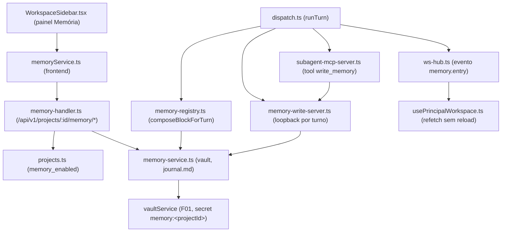

# Spec Técnica: F20. Memória Persistente (Memory)

## 1. Visão Geral Técnica

**O quê:** Journal por projeto (`journal.md`, markdown) cifrado no vault, com uma entrada curta escrita pelo próprio provider ao fim de cada turno (via nova tool `write_memory` no MCP interno `engrenacode`) e o conteúdo mais recente do journal injetado no system prompt do turno seguinte do mesmo projeto — mesmo mecanismo de precedência do bloco de Rules (F06). Inclui toggle "Memória" por projeto (ligado por padrão) e um painel de leitura (view-only) no Repo Harness.

**Por quê:** Hoje cada turno começa sem memória de sessões anteriores do mesmo projeto — só Rules (F06, permanente) e Skills (F05, sob demanda) alimentam o system prompt. F20 fecha essa lacuna com um mecanismo de contexto que persiste decisões/contexto de produto entre turnos sem exigir uma chamada extra de LLM fora do ciclo normal de dispatch (a própria thread gera seu resumo como parte do turno, via tool call).

**Escopo:** PRD define `Escopo Central` e `Adições ao Escopo Completo` para F20 (`docs/PRD.md:837-845`). Esta spec cobre **Central only** (Auto-Aceitar — ver 3.3).

**Incluído:**
- Escrita de 1 entrada de journal ao fim de cada turno, resumo curto gerado pelo próprio provider da thread via tool `write_memory` (sem chamada extra fora do turno)
- Leitura do conteúdo mais recente do journal injetada no system prompt do turno seguinte do mesmo projeto, com teto de ~2000 tokens
- Toggle "Memória" por projeto (ligado por padrão); desligar para leitura/escrita sem apagar o journal existente
- Limite de 256 KiB por journal, com truncamento das entradas mais antigas quando o limite é atingido (ver Decisão 3.2 — sem dreaming real nesta spec)
- Painel "Memória" no Repo Harness: toggle + link para **ver** (somente leitura) o journal; nova entrada aparece sem reload
- Tratamento de erros: falha de escrita não derruba o turno; journal corrompido é tratado como vazio com aviso; nunca grava segredos/credenciais no journal

**Adiado (Adições ao Escopo Completo — fora desta spec):**
- "Dreaming": job periódico (idle do app por N minutos) que consolida entradas antigas num resumo mais compacto
- Edição manual do journal pelo usuário numa tela dedicada

**UI/copy:** `docs/F20-memoria-persistente/ui.md` e `copy.md` **não existem ainda** — processo de design separado (`CLAUDE.md` → "Design · Processo"). Esta spec descreve apenas o contrato de dados/estado (endpoints, eventos, shape de resposta) que a UI vai consumir; não define anatomia de tela nem strings finais. Isso é bloqueante para a fase visual do plan (ver `plan.md`).

**Excluído:** dreaming/consolidação periódica; edição manual do journal; memória cross-projeto; qualquer resumo gerado por chamada de LLM fora do turno da própria thread.

## 2. Impacto na Arquitetura



## 3. Decisões Técnicas

### 3.1 Herdadas do brief / docs canônicos

Padrões herdados de `docs/_shared/codebase-patterns.md` (Camada 1 + Camada 2) e dos docs canônicos que ele lista — runtime Electron/TS ESM, SQLite via `node:sqlite` com migrations numeradas, vault AES com `setSecret`/`getSecret`, handlers HTTP `handle*Request(req,res)→boolean` no server loopback único, validação manual tipada (sem Zod), Vitest co-local, MCP interno `engrenacode` com tools condicionais por flag, e o padrão de bloco injetado no prompt (`composeRulesBlock`, F06).

Desvios desta feature: nenhum. F20 segue à risca o padrão de F06 (`rules-block.ts`/`rule-registry.ts`) para o bloco de memória, e o padrão de F11/F15 (`delegate.ts:createDelegationServer`) para o servidor loopback por turno da nova tool `write_memory`.

### 3.2 Específicas da feature

| Decisão | Abordagem Escolhida | Alternativa Considerada | Trade-off |
|---------|---------------------|--------------------------|-----------|
| Mecanismo de escrita da entrada de journal | Nova tool MCP `mcp__engrenacode__write_memory`, exposta condicionalmente (mesmo padrão de `listTools()`/`handleToolsCall` de `subagent-mcp-server.ts` usado por `load_skill`/`call_subagent`); chamada pelo próprio provider dentro do turno via servidor loopback efêmero (`memory-write-server.ts`, mesmo padrão de `delegate.ts:createDelegationServer` — porta 0 + token aleatório por turno) | (a) Parsear um bloco marcado no texto final do assistente; (b) chamada extra de LLM só para sumarizar ao fim do turno | (a) mistura texto de sistema com a resposta visível ao usuário e é frágil a variação de formatação do provider; (b) viola explicitamente o requisito do PRD "sem chamada extra fora do turno" e dobra custo/latência por turno. Tool call é o único caminho consistente com o resto do MCP interno e com o requisito do PRD |
| Forma de armazenamento do journal | 1 secret no vault por projeto (`memory:<projectId>`) guardando o `journal.md` inteiro como string (entradas concatenadas `### <ISO ts>\n<resumo>\n\n`); leitura/escrita via `vaultService.getSecret/setSecret` (`memory-service.ts` como camada fina sobre o vault, mesmo papel de `provider-keys.ts` para as API keys) | 1 secret por entrada (`memory:<projectId>:<entryId>`) | Vault é um `Record<string,string>` plano sem operação de "listar por prefixo" — múltiplos secrets por projeto exigiriam um índice separado. Um blob único casa com "journal.md cifrado" do PRD e mantém o cálculo do limite de 256 KiB trivial (tamanho de uma única string) |
| Seleção do bloco injetado no prompt sem dreaming implementado | Cauda do `journal.md` truncada a ~2000 tokens (heurística `chars/4`, remove as entradas mais antigas primeiro) — cada entrada já É um resumo curto escrito pelo provider, então a cauda recente já funciona como "resumo consolidado" para o Escopo Central | Aguardar a feature de dreaming (Adiado) antes de injetar qualquer coisa | PRD pede leitura do "resumo consolidado mais recente" já no Escopo Central; como as entradas individuais já são resumos (não transcript bruto), truncar a cauda satisfaz o requisito sem depender do job de consolidação, que fica para o Escopo Completo |
| Limite de 256 KiB sem job de consolidação disponível | Ao ultrapassar 256 KiB numa escrita, `memory-service.ts` remove entradas mais antigas (FIFO, por marcador `### `) até caber, e loga um `log_entries` (`kind='task'`, `event='memory: journal truncado (limite 256 KiB)'`) — a escrita da nova entrada nunca falha por causa do limite | Rejeitar a escrita quando o limite é atingido | PRD deixa claro que consolidação "completa" trata o limite (Adições ao Escopo Completo); Central precisa de um comportamento seguro até lá — truncar preserva as decisões mais recentes (as mais relevantes) e nunca derruba o turno, alinhado a "Falha ao escrever entrada → log; turno não falha" |
| `LogKind` para falhas/avisos de memória | Reaproveitar `'task'` (união fechada `'task' \| 'tool' \| 'git'` em `log-entries.ts`), prefixando a mensagem com `memory:` | Estender a união com `'memory'` | Estender a união tocaria filtros/UI de Registros (F08), fora do escopo desta feature; reaproveitar `'task'` é suficiente para os 3 casos do PRD (falha de escrita, journal corrompido, falha de consolidação — este último N/A em Central) |
| Entrega "sem reload" da nova entrada no painel | Novo variant `memory.entry` em `StreamEvent` (`ws-hub.ts`), emitido para o `threadId` do turno que gravou a entrada (mesmo padrão de `diff.ready`); `usePrincipalWorkspace.ts` trata o evento em `handleStreamEvent` disparando um refetch do status de memória do projeto | Canal de pub/sub novo escopado por `projectId` | O brief deixou esta decisão em aberto (`ws-hub.ts` é hoje só por-thread). O painel de Memória só é acionável com um workspace/thread aberto para o projeto (mesmo ciclo de vida dos painéis de Rules/Skills/Diffs), então reusar o hub por-thread evita infraestrutura nova só para F20 |

### 3.3 Assumptions / Auto-Aceitar

| Assumption | Origem | Pode sobrescrever? |
|------------|--------|---------------------|
| Escopo cobre apenas Central; dreaming e edição manual ficam Adiado | Auto-Aceitar: linha "Escopo (Central vs Central+Completo)" | sim |
| Namespace do vault: `memory:<projectId>` guardando o `journal.md` como string única | Auto-Aceitar: linha "Múltiplos padrões conflitantes" — fixado pelo brief §3 ("Journal de memória (F20)...") | sim |
| `ui.md`/`copy.md` ainda não existem para F20 — spec cobre só o contrato de dados/estado, sem anatomia/copy final | Auto-Aceitar: linha "`ui.md`/`copy.md` ausentes para uma feature com UI" | sim |
| Escrita da entrada via nova tool MCP `write_memory` (servidor loopback por turno), não via parsing de texto nem chamada extra de LLM | Auto-Aceitar: linha "Decisões técnicas com recomendação clara de spec-writer" (aplicando o padrão já usado por `load_skill`/`call_subagent` do brief Camada 2) | sim |
| Bloco injetado = cauda do journal truncada a ~2000 tokens (heurística `chars/4`), sem sumarização real, até o Escopo Completo (dreaming) existir | Auto-Aceitar: linha "Especificações PRD parciais" (PRD define o teto de tokens mas não o algoritmo de seleção) | sim |
| Ao atingir 256 KiB, `memory-service.ts` trunca as entradas mais antigas (FIFO) em vez de rejeitar a escrita | Auto-Aceitar: linha "Especificações PRD parciais" (PRD define o limite mas não o comportamento ao atingi-lo sem dreaming) | sim |
| `LogKind` de falhas de memória reaproveita `'task'` em vez de estender a união | Auto-Aceitar: linha "Decisões técnicas com recomendação clara de spec-writer" (evita tocar escopo de F08) | sim |
| Evento "sem reload" reusa `ws-hub.ts` por-thread (`memory.entry`) em vez de um canal novo por-projeto | Auto-Aceitar: linha "Múltiplos padrões conflitantes" — brief deixou em aberto, resolvido aqui | sim |

## 4. Visão Geral de Componentes

**Backend — runtime/dispatch:**

| Caminho do Arquivo | Novo/Modificado | Propósito | Responsabilidades-Chave |
|---------------------|------------------|-----------|--------------------------|
| `src/services/vault/memory-service.ts` | Novo | Camada fina sobre o vault para o journal | Ler/escrever `journal.md` por projeto (`memory:<projectId>`); aplicar cap de 256 KiB (truncar mais antigas); detectar conteúdo corrompido/ilegível e tratar como vazio |
| `src/services/runner/memory-block.ts` | Novo | Formata o bloco de memória para o system prompt | Compor preâmbulo + seção delimitada + rodapé (mesmo padrão sanitizado de `rules-block.ts`); truncar cauda a ~2000 tokens |
| `src/services/runner/memory-registry.ts` | Novo | Fachada de leitura para o dispatch | `resolveForTurn(projectId)` (respeita toggle `memory_enabled`); `composeBlockForTurn(projectId)` (mesmo papel de `RuleRegistry`) |
| `src/services/runner/memory-write-server.ts` | Novo | Servidor HTTP loopback efêmero por turno | Abre porta 0 + token aleatório (mesmo padrão de `delegate.ts:createDelegationServer`); recebe `POST /memory-entry { summary }` da tool MCP e delega a `memory-service.ts` |
| `src/services/runner/subagent-mcp-server.ts` | Modificado | Expor a tool `write_memory` no MCP interno | `WRITE_MEMORY_SCHEMA` + `handleWriteMemory`; tool listada condicionalmente quando `--memory-port`/`--memory-token` são passados (mesmo padrão condicional de `load_skill`/`call_subagent`) |
| `src/services/runner/dispatch.ts` | Modificado | Wiring do bloco no prompt + do servidor por turno | `buildSystemPrompt` injeta `MemoryRegistry.composeBlockForTurn(project.id)`; `runTurn` abre `memory-write-server` quando `memory_enabled`, registra os flags em `buildEngrenaCodeMcpDef`, fecha o servidor no `finally`, emite `memory.entry` após a escrita |
| `src/services/db/repositories/log-entries.ts` | Modificado | Registrar falhas de memória sem novo `LogKind` | Nenhuma mudança de schema — só novos call sites em `dispatch.ts`/`memory-service.ts` usando `kind: 'task'` |
| `src/services/runner/ws-hub.ts` | Modificado | Novo evento de stream | Adicionar variant `{ type: 'memory.entry'; threadId: string; projectId: string }` à união `StreamEvent` |

**Backend — HTTP/DB:**

| Caminho do Arquivo | Novo/Modificado | Propósito | Responsabilidades-Chave |
|---------------------|------------------|-----------|--------------------------|
| `src/services/db/migrations/008_memory.ts` | Novo | Coluna de toggle por projeto | `ALTER TABLE projects ADD COLUMN memory_enabled INTEGER NOT NULL DEFAULT 1` |
| `src/services/db/repositories/projects.ts` | Modificado | Expor/gravar o toggle | `Project.memoryEnabled: boolean`; `setMemoryEnabled(id, enabled)` |
| `src/services/http/memory-handler.ts` | Novo | Endpoints REST de memória | `handleMemoryRequest(req,res)→boolean` no mesmo server loopback (guard de sessão igual a `rules-handler.ts`); status/toggle/journal (view-only) |
| `src/services/http/unlock-handler.ts` | Modificado | Registrar o novo handler | Adicionar `handleMemoryRequest` à cadeia de handlers do server único |

**Frontend (contrato de dados/estado — anatomia final pendente de `ui.md`):**

| Caminho do Arquivo | Novo/Modificado | Propósito | Responsabilidades-Chave |
|---------------------|------------------|-----------|--------------------------|
| `src/renderer/services/memoryService.ts` | Novo | Cliente HTTP do painel de Memória | `getStatus(projectId)`, `setEnabled(projectId, enabled)`, `getJournal(projectId)` — mesmo padrão de `rulesService.ts` |
| `src/renderer/components/workspace/WorkspaceSidebar.tsx` | Modificado | Seção "Memória" no Repo Harness | Estado `memoryStatus` (contagem/última entrada/toggle), busca via `memoryService.counts()`-equivalente no mesmo `useEffect` das demais seções; anatomia final aguarda `ui.md` |
| `src/renderer/hooks/usePrincipalWorkspace.ts` | Modificado | Atualização sem reload | `handleStreamEvent` trata `memory.entry` disparando refetch do status de memória do projeto ativo (mesmo padrão de `diff.ready` → `loadDiffs`) |

## 5. Contratos de API

Todos os endpoints seguem o padrão do server loopback único (`unlock-handler.ts` + `handle*Request`), guard de sessão igual a `rules-handler.ts` (`423 vault_locked`, `401 unauthorized`), e resposta de erro `{ error: { code, message } }`.

**Endpoint: Status de Memória do Projeto**
- **Método:** GET
- **Caminho:** `/api/v1/projects/:projectId/memory/status`
- **Autenticação:** sessão (`x-engrenacode-session`)

**Resposta (Sucesso - 200):**

| Campo | Tipo | Descrição |
|-------|------|-----------|
| `enabled` | `boolean` | Toggle "Memória" do projeto |
| `entryCount` | `integer` | Número de entradas no journal atual (contagem de marcadores `### `) |
| `lastEntryAt` | `string \| null` | ISO timestamp da última entrada, ou `null` se vazio |
| `sizeBytes` | `integer` | Tamanho atual do `journal.md` em bytes |
| `corrupted` | `boolean` | `true` se o conteúdo do vault não pôde ser lido como journal válido (tratado como vazio) |

**Exemplo de Resposta:**
```json
{
  "enabled": true,
  "entryCount": 12,
  "lastEntryAt": "2026-08-07T14:32:00.000Z",
  "sizeBytes": 8421,
  "corrupted": false
}
```

**Endpoint: Alternar Memória do Projeto**
- **Método:** PATCH
- **Caminho:** `/api/v1/projects/:projectId/memory/status`
- **Autenticação:** sessão

**Requisição:**

| Campo | Tipo | Obrigatório | Validação | Descrição |
|-------|------|--------------|-----------|-----------|
| `enabled` | `boolean` | Sim | `true`/`false` | Liga/desliga leitura e escrita; nunca apaga o journal |

**Exemplo de Requisição:**
```json
{ "enabled": false }
```

**Resposta (Sucesso - 200):** mesmo shape do GET status, refletindo o novo `enabled`.

**Endpoint: Ver Journal (somente leitura)**
- **Método:** GET
- **Caminho:** `/api/v1/projects/:projectId/memory/journal`
- **Autenticação:** sessão

**Resposta (Sucesso - 200):**

| Campo | Tipo | Descrição |
|-------|------|-----------|
| `content` | `string` | Conteúdo markdown bruto do `journal.md` (vazio se `corrupted` ou nunca escrito) |
| `corrupted` | `boolean` | Igual ao status |

**Códigos de Erro (todos os 3 endpoints):**

| Código | Status HTTP | Descrição |
|--------|-------------|-----------|
| `vault_locked` | 423 | Cofre local travado |
| `unauthorized` | 401 | Sessão inválida/ausente |
| `project_not_found` | 404 | Projeto não existe |
| `validation_error` | 400 | `enabled` ausente/tipo errado no PATCH |

Sem endpoint de escrita/edição de entrada nesta spec — a única escrita é a tool `write_memory` dentro do turno (não é HTTP público, é o loopback efêmero descrito em 3.2/§4). Edição manual do journal é Adiado.

## 6. Modelo de Dados

**Tabela: `projects` (ALTER)**

| Coluna | Tipo | Nullable | Padrão | Descrição |
|--------|------|----------|--------|-----------|
| `memory_enabled` | `INTEGER` | Não | `1` | Toggle "Memória" do projeto (0/1, mesmo padrão booleano de `rules.is_global`) |

**Migração (`src/services/db/migrations/008_memory.ts`, registrada em `client.ts` junto às demais):**
```sql
ALTER TABLE projects ADD COLUMN memory_enabled INTEGER NOT NULL DEFAULT 1;
```

Sem tabela nova — o conteúdo do journal não vive no SQLite. Ele é uma string única no vault (`memory:<projectId>` → `journal.md` cifrado via `vaultService.setSecret/getSecret`, já parte do envelope `vault.enc` existente de F01). Formato interno do conteúdo (não é schema SQL, é a convenção de `memory-service.ts`):

```
### 2026-08-07T14:32:00.000Z
Resumo curto da decisão/contexto deste turno.

### 2026-08-07T09:10:00.000Z
Entrada anterior...
```

Entradas mais recentes no topo (prepend); truncamento por 256 KiB e seleção do bloco de prompt (~2000 tokens) operam removendo o final da string (entradas mais antigas).

## 7. Estratégia de Testes

### 7.1 Unitário / Integração

| Arquivo de Teste | Tipo de Teste | Alvo | Objetivo de Cobertura |
|--------------------|----------------|------|--------------------------|
| `src/services/vault/memory-service.test.ts` | Unitário | `memory-service.ts` | 90% |
| `src/services/runner/memory-block.test.ts` | Unitário | `memory-block.ts` | 90% |
| `src/services/runner/memory-registry.test.ts` | Unitário | `memory-registry.ts` | 85% |
| `src/services/runner/dispatch.test.ts` (extensão) | Integração | `dispatch.ts` (`buildSystemPrompt`, `runTurn`) | 80% |
| `src/services/runner/subagent-mcp-server.test.ts` (extensão) | Integração | tool `write_memory` | 80% |
| `src/services/http/memory-handler.test.ts` | Integração | endpoints `/memory/*` | 85% |
| `src/services/db/repositories/projects.test.ts` (extensão) | Unitário | `memoryEnabled`/`setMemoryEnabled` | 90% |

| Função de Teste | Descrição | Assertions |
|-------------------|-----------|-----------|
| `appendEntry_prependsNewestFirst` | Nova entrada vai para o topo do journal | Conteúdo lido começa com o timestamp mais recente |
| `appendEntry_truncatesAt256KiB` | Escrita que estoura o limite remove entradas mais antigas | Tamanho final ≤ 256 KiB; entrada nova preservada |
| `readJournal_corruptedReturnsEmptyWithFlag` | Secret ilegível/JSON-quebrado (simulação) | `corrupted: true`, `content: ''`, não lança |
| `composeMemoryBlock_truncatesToTokenBudget` | Journal maior que ~2000 tokens | Bloco retornado ≤ teto; entradas mais antigas cortadas primeiro |
| `composeMemoryBlock_emptyReturnsEmptyString` | Journal vazio | Retorna `''` (nenhum bloco injetado, mesmo padrão de `composeRulesBlock`) |
| `buildSystemPrompt_includesMemoryBlockWhenEnabled` | `memory_enabled=1` e journal não vazio | Prompt final contém o bloco de memória |
| `buildSystemPrompt_omitsMemoryBlockWhenDisabled` | `memory_enabled=0` | Prompt final não contém o bloco, mesmo com journal preenchido |
| `runTurn_writeMemoryToolAppendsEntry` | Provider chama `write_memory` durante o turno | `memory-service.ts` recebe a entrada; nenhuma chamada de LLM extra é disparada |
| `runTurn_writeMemoryFailureDoesNotFailTurn` | `memory-service.ts` lança ao gravar | Turno finaliza normalmente; `log_entries` recebe `kind='task'`, evento prefixado `memory:` |
| `memoryHandler_getStatus_returnsCountsAndToggle` | Fluxo feliz GET status | 200 com `enabled/entryCount/lastEntryAt/sizeBytes/corrupted` |
| `memoryHandler_patchStatus_togglesWithoutErasingJournal` | PATCH `enabled:false` | `enabled=false` persistido; GET journal ainda retorna conteúdo anterior |
| `memoryHandler_guard_returns423WhenLocked` | Vault travado | 423 `vault_locked` |
| `memoryHandler_guard_returns401WhenSessionInvalid` | Sessão ausente/errada | 401 `unauthorized` |

Runner de testes já existe (Vitest, `pnpm test`) — sem bootstrap necessário.

### 7.2 Smoke / Aceitação manual

| # | Passo | Resultado esperado |
|---|-------|----------------------|
| 1 | Rodar um turno num projeto com Memória ligada (padrão) e prompt qualquer | Ao fim do turno, `GET /memory/status` mostra `entryCount` incrementado e `lastEntryAt` atualizado |
| 2 | Rodar um segundo turno no mesmo projeto | `systemPrompt` enviado ao provider inclui o bloco de memória com a entrada do turno anterior (verificável via log/registro do turno em F08) |
| 3 | Desligar o toggle "Memória" (`PATCH enabled:false`) e rodar um turno | Nenhuma nova entrada é escrita; bloco de memória não aparece no prompt; `GET /memory/journal` continua retornando o conteúdo anterior (não apagado) |
| 4 | Corromper manualmente o secret `memory:<projectId>` (fixture de teste) e rodar um turno | Turno completa normalmente; `GET /memory/status` retorna `corrupted:true`; nenhum erro bloqueia o dispatch |
| 5 | Simular falha de escrita em `memory-service.ts` (fixture) durante um turno | Turno finaliza com sucesso (`state=idle`); `log_entries` recebe entrada `kind='task'` referenciando a falha |

Item de UI (light/dark, anatomia vs `ui.md`, copy vs `copy.md`) **fica pendente** até esses dois arquivos existirem — não incluído neste checklist (ver §1 "UI/copy").

### 7.3 Cross-feature

| Critério | Status | Nota |
|----------|--------|------|
| Bloco de memória (F20) é injetado no system prompt do Workspace (F03) com a mesma precedência de Rules (F06) | ready | `docs/PRD.md:1414`; `buildSystemPrompt` em `dispatch.ts` já injeta o bloco de Rules na mesma função — F20 adiciona o bloco de memória logo em seguida, mesma composição |
| Cofre (F01) armazena o journal cifrado junto dos demais segredos do projeto | ready | F01 já implementada; `memory-service.ts` só usa `vaultService.getSecret/setSecret` existentes |
| Tokens de superfície (F01.1) para o painel de memória | ready | F01.1 já implementada; painel segue o Design Lock quando `ui.md` for escrito |
| Ciclo de dispatch (F03): leitura no início, escrita/consolidação no fim do turno | ready | F03 já implementada; hooks em `buildSystemPrompt`/`runTurn` |
| Pipeline (F22, Onda 6) consome memória do projeto como contexto de entrada por estágio | deferred até F22 | F22 ainda não implementada (Onda 6); nenhuma integração adicional necessária desta spec — F22 consumirá o mesmo `MemoryRegistry.composeBlockForTurn` |
