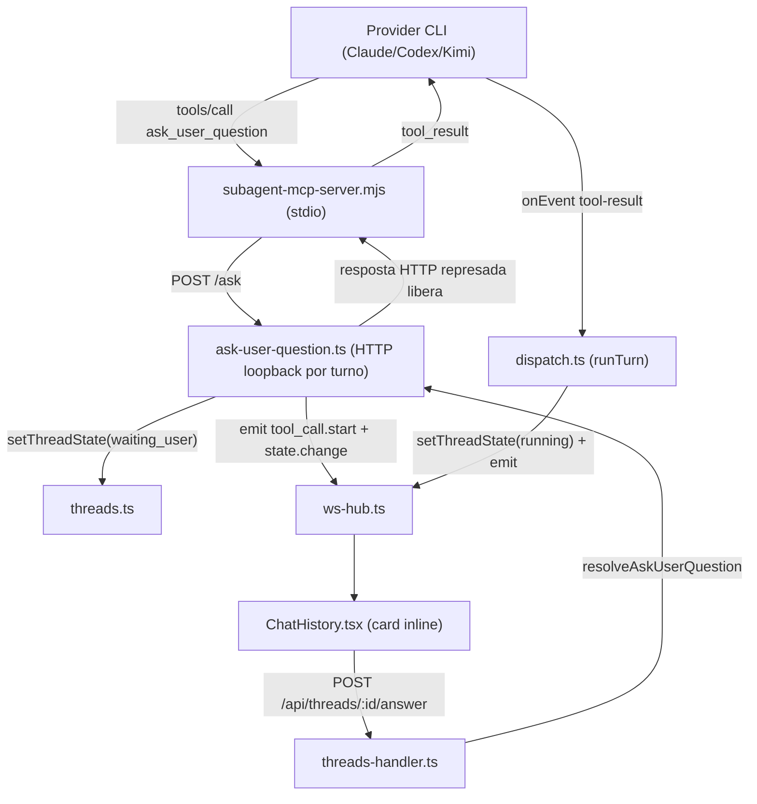

## Seção 1: Visão Geral Técnica

**O quê:** Uma nova tool MCP interna `ask_user_question`, exposta a todo turno do Workspace (F03) via o servidor `engrenacode` já existente (`subagent-mcp-server.ts`), que permite ao agente pausar o turno e pedir uma decisão ao usuário — até 4 opções de múltipla escolha (com suporte a seleção múltipla via `multiSelect`) mais um rótulo de resposta livre sempre disponível no client. A thread entra em um novo estado `waiting_user` enquanto aguarda; a resposta do usuário retoma o turno automaticamente, sem reabrir a thread.

**Por quê:** O ciclo de dispatch atual (F03) não tem um mecanismo para o agente interromper um turno e aguardar input humano estruturado — hoje o agente só pode presumir a decisão ambígua ou parar o turno inteiro. F21 fecha esse gap adicionando um ponto de pausa genuíno no meio do turno, reaproveitando o padrão de tool MCP interna + servidor HTTP loopback já validado por `call_subagent` (F15), mas com uma diferença estrutural: a resposta não vem de outra execução automática, vem de um segundo request HTTP desacoplado, disparado pelo usuário na UI.

**Escopo:** o PRD não define blocos `Escopo Central`/`Adições ao Escopo Completo` para F21 — esta spec cobre a feature inteira, conforme "PRD sem blocos Escopo Central / Adições ao Escopo Completo" (política padrão do spec-writer).

**Incluído:**
- Tool MCP `ask_user_question` (schema, registro condicional por suporte do provider, sempre ativa — não depende de catálogo como `load_skill`/`call_subagent`)
- Novo estado de thread `waiting_user` (`ThreadState`) e sua integração com lease/`thread_busy`, boot reconciliation e os pontos do codebase que hoje tratam `state === 'running'` como proxy de "thread ocupada"
- Servidor HTTP loopback dedicado que segura o tool call em aberto até uma resposta chegar por um endpoint HTTP separado
- Endpoint `POST /api/threads/:id/answer` para o usuário responder
- Degradação Minimax (provider sem suporte a `--mcp-config`) com `mcp.notice`, sem quebrar o turno
- Contrato de dados/estado que a UI (card inline na timeline) vai consumir — anatomia final e copy ficam fora desta spec (ver Assumptions §3.3)

**Adiado:** nenhum item do PRD F21 foi adiado — a feature não tem bloco de Adições ao Escopo Completo.

**UI da feature:** `docs/F21-askuserquestion/ui.md` e `copy.md` **ainda não existem**. Esta spec documenta apenas o contrato de dados/estado (evento WS, payload da tool, corpo do `POST /answer`) que a UI vai consumir; anatomia de tela e strings literais ficam pendentes do processo de design separado (`CLAUDE.md` → "Design · Processo").

---

## Seção 2: Impacto na Arquitetura

**Componentes afetados:**
- `src/services/db/repositories/threads.ts` — novo valor de `ThreadState`; boot reconciliation
- `src/services/runner/ask-user-question.ts` (novo) — registro de perguntas pendentes + servidor HTTP loopback
- `src/services/runner/subagent-mcp-server.ts` — nova tool no script MCP embutido
- `src/services/runner/dispatch.ts` — registro incondicional da tool, transições de estado, cleanup
- `src/services/http/threads-handler.ts` — endpoint `POST /api/threads/:id/answer`
- `src/services/http/git-handler.ts`, `src/renderer/components/workspace/GitActions.tsx`, `src/renderer/components/workspace/TaskComposer.tsx`, `src/renderer/hooks/usePrincipalWorkspace.ts` — pontos que hoje checam `state === 'running'` como proxy de thread ocupada
- `src/renderer/services/threads-service.ts`, `src/renderer/components/workspace/ChatHistory.tsx` — client HTTP + render do card inline



---

## Seção 3: Decisões Técnicas

### 3.1 Herdadas do brief / docs canônicos

Padrões herdados de `docs/_shared/codebase-patterns.md` (wave 4, git_sha `5908e27678e93fc833cfae92974cfa04b7dffa2e`): MCP interno `engrenacode` como servidor stdio único com tools condicionais por flag (`listTools()`/`handleToolsCall` roteando por `params.name`), obrigatoriedade de `ELECTRON_RUN_AS_NODE=1` no `env` do `ResolvedMcpDef`, wiring único por turno em `dispatch.ts:268-293`, `ThreadState` como union fechado (mesmo padrão de `ThreadProvider`), `subagent-caller-gate.ts`/idle timeout de `delegate.ts` como referência conceitual de "pausa sem contar como erro", e validação manual tipada (sem Zod) em todo o codebase.

Desvios desta feature: a tool `ask_user_question` é registrada **incondicionalmente** (quando o provider suporta MCP), diferente de `load_skill`/`call_subagent` que só entram quando há catálogo não-vazio — ver 3.2.

### 3.2 Específicas da feature

| Decisão | Abordagem Escolhida | Alternativa Considerada | Trade-off |
|---------|-------------------|-------------------------|-----------|
| Onde armazenar o novo valor de estado `ThreadState` | Estender o union TypeScript `'running'\|'idle'\|'committed'\|'error'\|'stopping'\|'waiting_user'` em `threads.ts:7` — **sem migração SQL**, pois a coluna `state` em `002_workspace_core.ts` é `TEXT NOT NULL` sem `CHECK` constraint | Adicionar `CHECK (state IN (...))` na migração agora | Nenhuma validação de enum em nível de banco (mesma exposição que os 5 valores já existentes têm hoje); ganho é zero migração e zero risco de quebrar rows existentes |
| Mecanismo de bloqueio do tool call até resposta humana | Servidor HTTP loopback dedicado (`ask-user-question.ts`), efêmero por turno, que **segura a resposta HTTP em aberto** até um segundo request (`POST /api/threads/:id/answer`) resolver um `Promise` guardado num `Map<threadId, resolver>` — mesmo padrão estrutural de `createDelegationServer` (F15), mas com resolução assíncrona externa em vez de imediata | Reaproveitar `resolvePermission`/evento `permission-request` já declarados em `ProviderTurnInput` (`provider-types.ts:8,40`) | `resolvePermission` é um campo de tipo declarado mas **nunca chamado** por `cli-driver.ts` nem por nenhum driver de provider (achado da exploração desta feature) — não é um precedente funcional, só scaffolding; o fluxo de permissão real hoje é só WS `permission.resolved` sem lado de escuta no backend. Usar `ask-user-question.ts` dedicado evita depender de um mecanismo não implementado |
| Condição de registro da tool `ask_user_question` no MCP interno | Sempre ativa quando `providerSupportsMcp` é true (independe de skills/subagents vinculados ao projeto) — o bloco `if ((wantsLoadSkill \|\| wantsCallSubagent) && providerSupportsMcp)` em `dispatch.ts:267` passa a incluir `wantsAskUserQuestion = true` sempre no OR | Tool condicional a alguma flag de projeto (ex.: "habilitar perguntas") | PRD Capacidades diz "disponível a todo turno" sem opt-in — trade-off aceito é que o MCP interno agora sempre inicia um processo filho por turno, mesmo sem skills/subagents vinculados (custo de spawn extra, mitigado por ser um processo Node leve já usado hoje) |
| Reconciliação de boot para threads presas em `waiting_user` após reinício do app | Estender `recoverRunningThreads()` (spec F08 §3.2) para também reconciliar `state = 'waiting_user'` → `error`, no mesmo `UPDATE ... RETURNING *` | Deixar `waiting_user` intocado no boot, como o PRD sugere ("cancelamento manual") | O resolver pendente (`ask-user-question.ts`) e o `AbortController` de `cancelThread` (`dispatch.ts` `activeControllers`) são estado em memória — não sobrevivem a um restart do processo Electron. Sem essa extensão, uma thread presa em `waiting_user` após restart não pode ser respondida (`no_pending_question`) nem cancelada (`cancelled: false`), violando o AC "thread abandonada pode ser cancelada manualmente". Reconciliar no boot preserva a garantia do AC ao custo de tratar "abandono por crash/restart" igual a "abandono por falha de turno", que já é o comportamento de `running` hoje |
| Pontos que tratam `state === 'running'` como proxy de "thread ocupada" | Estender os 4 checks existentes (`git-handler.ts:75`, `GitActions.tsx:51`, `TaskComposer.tsx:90`, `usePrincipalWorkspace.ts:455`) para também considerar `state === 'waiting_user'` como ocupada | Introduzir um helper central `isThreadBusy(state)` | Nenhum helper centralizado existe hoje para esse check (cada site repete a comparação inline) — estender os 4 pontos existentes segue o padrão atual do codebase em vez de introduzir uma abstração nova só para esta feature |

### 3.3 Assumptions / Auto-Aceitar

| Assumption | Origem | Pode sobrescrever? |
|------------|--------|--------------------|
| Escopo cobre a feature F21 inteira (sem divisão Central/Completo) | PRD sem blocos Escopo Central/Completo para F21 | sim |
| `ui.md`/`copy.md` ainda não existem — spec cobre só contrato de dados/estado, anatomia do card inline e strings ficam pendentes do processo de design | `ui.md`/`copy.md` ausentes para uma feature com UI | sim |
| Boot reconciliation estende `recoverRunningThreads()` para também reconciliar `waiting_user` → `error` | Especificação PRD parcial — PRD não define o que acontece com `waiting_user` num restart do app; aplicado padrão já existente (F08) por consistência | sim |
| Quando o usuário envia `freeText` não-vazio junto com `selectedOptions`, `freeText` prevalece como texto do `tool_result`; senão o texto é a junção de `selectedOptions` | Especificação PRD parcial — PRD não define precedência entre opção marcada e texto livre | sim |
| `POST /api/threads/:id/answer` valida no backend (não confia só no bloqueio client-side) que ao menos `selectedOptions` não-vazio ou `freeText` não-vazio foi enviado | Especificação PRD parcial — PRD só descreve o bloqueio client-side ("bloqueado no client antes de enviar"); validação backend segue o padrão de defesa em profundidade já usado em todo handler HTTP do codebase | sim |

---

## Seção 4: Visão Geral de Componentes

**Backend / Runner:**

| Caminho do Arquivo | Novo/Modificado | Propósito | Responsabilidades-Chave |
|-------------------|-----------------|-----------|------------------------|
| `src/services/db/repositories/threads.ts` | Modificado | Estado de thread | Estender `ThreadState` com `'waiting_user'`; estender `recoverRunningThreads()` para reconciliar `waiting_user` → `error` no boot |
| `src/services/runner/ask-user-question.ts` | Novo | Ponte pergunta↔resposta | `ASK_USER_QUESTION_TOOL_NAME`; registro `Map<threadId, resolver>` de perguntas pendentes; `createAskUserQuestionServer(ctx)` (HTTP loopback, rota `POST /ask`, resposta represada); `resolveAskUserQuestion(threadId, answer)`; `rejectAskUserQuestion(threadId, reason)` para cleanup em cancel/erro |
| `src/services/runner/subagent-mcp-server.ts` | Modificado | Script MCP embutido | Adicionar `ASK_USER_QUESTION_SCHEMA` (prompt, options ≤4, multiSelect) a `listTools()`; `handleAskUserQuestion` roteando `tools/call` para `POST /ask` no mesmo servidor loopback usado por `call_subagent` |
| `src/services/runner/dispatch.ts` | Modificado | Orquestração do turno | `wantsAskUserQuestion` sempre true quando `providerSupportsMcp`; cria `createAskUserQuestionServer` sempre que o MCP interno é registrado; especializa `onEvent` para `tool-start`/`tool-result` de `ask_user_question` (transição `waiting_user`↔`running` + `emit state.change`); estende o branch `mcp.notice` de provider não suportado para sempre disparar (hoje só dispara se `wantsLoadSkill`); cleanup no `finally` fecha o ask-server e rejeita pergunta pendente |
| `src/services/http/threads-handler.ts` | Modificado | HTTP API | Nova rota `POST /api/threads/:id/answer`; valida corpo e `thread.state === 'waiting_user'`; chama `resolveAskUserQuestion` |
| `src/services/http/git-handler.ts` | Modificado | Gate de ações git | Checagem de thread ocupada inclui `waiting_user` |

**Frontend:**

| Caminho do Arquivo | Novo/Modificado | Propósito | Responsabilidades-Chave |
|-------------------|-----------------|-----------|------------------------|
| `src/renderer/services/threads-service.ts` | Modificado | Client HTTP | Novo método `answerQuestion(threadId, body)` → `POST /api/threads/:id/answer` (mesmo padrão de `permission(...)`) |
| `src/renderer/hooks/usePrincipalWorkspace.ts` | Modificado | Estado do Workspace | Deriva pergunta pendente do `tool_call` mais recente com `name === 'ask_user_question'` e `status` pendente quando `selectedThread.state === 'waiting_user'`; expõe `answerQuestion(...)`; check de "thread ocupada" (linha 455) inclui `waiting_user` |
| `src/renderer/components/workspace/askUserQuestion.logic.ts` | Novo | Validação pura | `validateAnswer(selectedOptions, freeText): boolean` — mesmo bloqueio client-side descrito no PRD, no mesmo padrão de `composer.logic.ts` |
| `src/renderer/components/workspace/AskUserQuestionCard.tsx` | Novo | Card inline na timeline | Renderiza pergunta + opções + campo de texto livre; anatomia/tokens/copy pendentes de `ui.md`/`copy.md` (ver Assumptions §3.3) — só o contrato de props (pergunta, opções, multiSelect, callback de resposta) está nesta spec |
| `src/renderer/components/workspace/GitActions.tsx`, `TaskComposer.tsx` | Modificado | Gates de UI | Checks de thread ocupada incluem `waiting_user` |
| `src/renderer/components/workspace/ChatHistory.tsx` | Modificado | Timeline | Renderiza `AskUserQuestionCard` quando a thread está `waiting_user` |

**Banco de Dados:** nenhuma migração — ver 3.2 (coluna `threads.state` já é `TEXT NOT NULL` sem `CHECK`; `tool_calls.params_json`/`result_json` já cobrem o payload da pergunta/resposta).

---

## Seção 5: Contratos de API

### Tool MCP: `ask_user_question` (via `engrenacode` interno)

Exposta no `tools/call` do script `subagent-mcp-server.mjs`, mesmo transporte stdio de `call_subagent`/`load_skill`.

**Schema de entrada:**

| Campo | Tipo | Obrigatório | Validação | Descrição |
|-------|------|-------------|-----------|-----------|
| `prompt` | `string` | Sim | não-vazio | Pergunta a exibir ao usuário |
| `options` | `string[]` | Não | máx. 4 itens | Opções de múltipla escolha |
| `multiSelect` | `boolean` | Não | default `false` | Permite selecionar mais de uma opção |

**Exemplo de chamada (`tools/call` params.arguments):**
```json
{
  "prompt": "Qual estratégia de migração devo usar?",
  "options": ["Big bang", "Incremental por módulo", "Feature flag"],
  "multiSelect": false
}
```

**Resultado (tool_result, após resposta do usuário):**

| Campo | Tipo | Descrição |
|-------|------|-----------|
| `content[0].text` | `string` | `freeText` se não-vazio; senão `selectedOptions.join(', ')` |
| `isError` | `boolean` | Sempre `false` no fluxo normal (falha vira texto explicativo, não erro) |

### Endpoint: Responder pergunta pendente

- **Método:** POST
- **Caminho:** `/api/threads/:id/answer`
- **Autenticação:** header `x-engrenacode-session` (mesmo guard de todo `threads-handler.ts`)

**Requisição:**

| Campo | Tipo | Obrigatório | Validação | Descrição |
|-------|------|-------------|-----------|-----------|
| `selectedOptions` | `string[]` | Não* | itens ⊆ opções da pergunta pendente | Opções marcadas pelo usuário |
| `freeText` | `string` | Não* | trim não-vazio se enviado | Resposta livre ("Outra") |

*Ao menos um dos dois deve estar presente e não-vazio (`validation_error` caso contrário).

**Exemplo de Requisição:**
```json
{
  "selectedOptions": ["Incremental por módulo"],
  "freeText": null
}
```

**Resposta (Sucesso - 200):**

| Campo | Tipo | Descrição |
|-------|------|-----------|
| `answered` | `boolean` | Sempre `true` |

**Exemplo de Resposta:**
```json
{ "answered": true }
```

**Códigos de Erro:**

| Código | Status HTTP | Descrição |
|--------|-------------|-----------|
| `thread_not_found` | 404 | Thread não existe |
| `thread_not_waiting` | 409 | `thread.state !== 'waiting_user'` — nada pendente para essa thread |
| `no_pending_question` | 409 | Estado é `waiting_user` mas o resolver em memória não existe (ex.: app reiniciado; ver 3.2) |
| `validation_error` | 400 | Nenhuma opção nem texto livre enviados, ou `selectedOptions` fora das opções da pergunta |

---

## Seção 6: Modelo de Dados

Sem migração nova. A feature reaproveita:

- `threads.state` (`TEXT NOT NULL`, `002_workspace_core.ts`, sem `CHECK`) — novo valor `waiting_user` é só uma extensão do union TypeScript `ThreadState`, nenhuma alteração de schema SQL.
- `tool_calls` (`002_workspace_core.ts`) — a chamada da tool `ask_user_question` já é persistida pelo caminho genérico existente em `dispatch.ts` (`createToolCall`/`updateToolCall`, linhas 339-355): `params_json` guarda `{ prompt, options, multiSelect }`, `result_json` guarda o texto final da resposta quando o turno retoma. Nenhuma coluna nova é necessária.
- `log_entries` — evento `kind='tool'` já é gravado genericamente para qualquer tool call completada (`dispatch.ts:352`), satisfazendo "evento visível em F08 Registros" do PRD sem código adicional em F08.

**Notas Cross-Database:** não aplicável — nenhuma alteração de schema.

---

## Seção 7: Estratégia de Testes

### 7.1 Unitário / Integração

| Arquivo de Teste | Tipo de Teste | Alvo | Objetivo de Cobertura |
|-----------------|--------------|------|----------------------|
| `src/services/db/repositories/threads.test.ts` | Unitário | `setThreadState`, `recoverRunningThreads` | 90% dos novos branches |
| `src/services/runner/ask-user-question.test.ts` (novo) | Unitário | `createAskUserQuestionServer`, `resolveAskUserQuestion`, `rejectAskUserQuestion` | 90% |
| `src/services/runner/subagent-mcp-server.test.ts` | Unitário | `listTools()`/`handleToolsCall` do script embutido | 85% do delta |
| `src/services/runner/dispatch.test.ts` | Integração | `runTurn` com tool `ask_user_question` simulada | 80% do delta |
| `src/services/http/threads-handler.test.ts` | Integração | `POST /api/threads/:id/answer` | 85% |
| `src/renderer/components/workspace/askUserQuestion.logic.test.ts` (novo) | Unitário | `validateAnswer` | 90% |

**Funções de teste por arquivo:**

| Função de Teste | Descrição | Assertions |
|-----------------|-----------|-----------|
| `test_setThreadState_waiting_user` | Thread aceita `waiting_user` como estado válido | `getThread(id).state === 'waiting_user'` |
| `test_recoverRunningThreads_reconciles_waiting_user` | Boot reconciliation também reconcilia `waiting_user` | Thread presa em `waiting_user` vira `error` após `recoverRunningThreads()` |
| `test_askUserQuestionServer_holds_response_until_resolved` | `/ask` não responde antes de `resolveAskUserQuestion` ser chamado | Promise da requisição HTTP só resolve após a chamada externa |
| `test_resolveAskUserQuestion_unknown_thread_noop` | Resolver para thread sem pergunta pendente não lança | Chamada é no-op silencioso |
| `test_rejectAskUserQuestion_on_cancel` | Cancelamento de turno libera a requisição `/ask` pendente com erro | `tool_result.isError === true`, servidor fecha |
| `test_dispatch_toolStart_askUserQuestion_sets_waiting_user` | `onEvent('tool-start', {name:'ask_user_question'})` transiciona a thread | `thread.state === 'waiting_user'`, `state.change` emitido via ws-hub |
| `test_dispatch_toolResult_askUserQuestion_restores_running` | Resposta do usuário retoma o turno | `thread.state === 'running'` após `tool-result`, depois `idle` ao fim natural do turno |
| `test_dispatch_minimax_notice_mentions_ask_user_question` | Provider sem suporte a MCP emite `mcp.notice` | Evento `mcp.notice` com `reason: 'provider_unsupported'` mesmo sem skills vinculadas |
| `test_answer_happy_path` | `POST /answer` com `selectedOptions` válido | 200, `{answered:true}`, tool_result contém a opção |
| `test_answer_thread_not_waiting` | Thread em `running`/`idle` | 409 `thread_not_waiting` |
| `test_answer_no_pending_question` | `waiting_user` sem resolver em memória | 409 `no_pending_question` |
| `test_answer_validation_error_empty_body` | Corpo sem `selectedOptions` nem `freeText` | 400 `validation_error` |
| `test_validateAnswer_blocks_empty` | Nenhuma opção e texto vazio | retorna `false` |
| `test_validateAnswer_accepts_freeText_only` | Só `freeText` preenchido | retorna `true` |

### 7.2 Smoke / Aceitação manual

| # | Passo | Resultado esperado |
|---|-------|-------------------|
| 1 | Disparar turno Claude que chama `ask_user_question` com 3 opções | Thread muda para `waiting_user`; card inline aparece na timeline com as 3 opções + campo "Outra" |
| 2 | Clicar em uma opção e enviar | `POST /answer` retorna 200; thread volta a `running` e depois `idle`; turno continua sem reabrir a thread |
| 3 | Repetir com `multiSelect: true` e marcar 2 opções | Resposta enviada contém as 2 opções selecionadas |
| 4 | Tentar enviar sem marcar opção e sem texto livre | Botão de enviar bloqueado no client (nenhum `POST /answer` disparado) |
| 5 | Disparar turno em thread com provider Minimax | `mcp.notice` aparece informando que `ask_user_question` está fora do turno; turno segue sem a tool |
| 6 | Com thread em `waiting_user`, tentar Commit/push (F14) ou enviar follow-up no composer | Ações bloqueadas como "thread ocupada" (mesmo tratamento de `running`) |
| 7 | Cancelar manualmente uma thread presa em `waiting_user` | Thread vai a `error`/`cancelled`; card de pergunta sai da timeline |
| 8 | Light/dark (quando `ui.md`/`copy.md` existirem) | Card segue tokens do Design Lock em ambos os temas; strings batem `copy.md` |

### 7.3 Cross-feature

| Critério | Status | Nota |
|----------|--------|------|
| `ask_user_question` (F21) pausa e retoma o dispatch do Workspace (F03) sem quebrar lease/thread_busy | ready | Seção 9 PRD, linha 1415 — lease permanece atrelada ao ciclo de vida do `runTurn` (inalterada); os checks de UI/HTTP que usavam `state === 'running'` como proxy passam a incluir `waiting_user` |
| Evento de `ask_user_question` visível em Registros (F08) | ready | Reaproveita o caminho genérico `createLogEntry(kind:'tool')` já existente em `dispatch.ts:352` — nenhuma mudança em F08 |
| Tokens de superfície do card inline (F01.1) | deferred | `ui.md`/`copy.md` ainda não escritos — anatomia final depende do processo de design |
| Pipeline (F22) consome `ask_user_question` para checkpoints de aprovação entre estágios | deferred até F22 | F22 está na Onda 6 e depende de F18/F19/F20/F21 completos |
