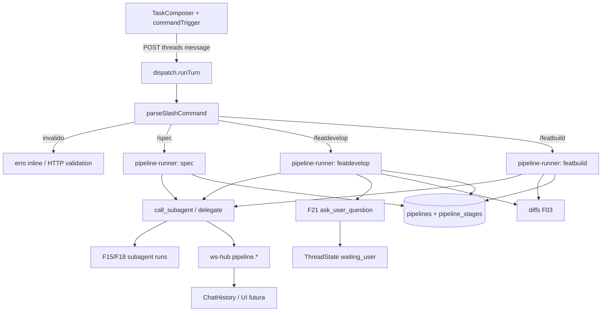

# Spec Técnica: F22. Automação por Slash Commands (Pipeline)

## 1. Visão Geral Técnica

**O quê:** Reconhecer no composer os comandos nativos `/spec`, `/featdevelop` e `/featbuild` (prefixo `/`, autocomplete); ao enviar, o dispatch valida o comando e orquestra estágios via `call_subagent` (F15/F18), com checkpoints F21 (`ask_user_question`) antes de aplicar diffs em `/featdevelop` e checkpoints de revisão F03 em `/featbuild`; progresso de estágio emitido por WS para a timeline.

**Por quê:** Hoje o composer trata `/…` como texto livre; não há orquestração multi-estágio. O catálogo F17 já tem `planner` / `implementer` / `reviewer` / `tester`, F18 tem `kind=pipeline` + `tasks[]`, F21 tem pausa `waiting_user` — falta o glue de produto dos três slash.

**Escopo:** **Central only** (entrevista: seguir recomendações). Completo (slash custom + retomar do último checkpoint) → Adiado / Versão 2.0 (já no PRD §7).

**Incluído:**
- Catálogo estático dos 3 comandos nativos + detecção de gatilho `/` no composer (âncora de início, espelho do padrão LionCodeLabs `commandTrigger`)
- Parse/validação no envio (renderer + server autoritativo)
- `/spec {descrição}` → uma delegação ao subagent `planner` (nome canônico F17); resposta estruturada na thread; **não** grava ficheiros
- `/featdevelop {descrição}` → estágios sequenciais planner → implementer → reviewer → tester; checkpoint F21 antes de aplicar diffs acumulados do estágio de implementação
- `/featbuild {plano}` → executa plano (corpo markdown após o token) sem replanejar; checkpoints = fluxo DiffViewer F03 entre estágios de escrita
- Persistência SQLite do run de pipeline + estágios (progresso, status, hard-cap agregado 2h)
- Eventos WS de estágio para a timeline consumir quando `ui.md` existir
- Integração F19/F20: estágios herdam o mesmo turno/MCP/memória já injetados pelo dispatch (sem wiring extra além do contexto passado na task)

**Adiado (Escopo Completo → Versão 2.0):**
- Slash customizáveis pelo usuário
- Retomar pipeline interrompido a partir do último checkpoint

**UI/copy:** `docs/F22-automacao-por-slash-commands-pipeline/ui.md` e `copy.md` (2026-08-08) — anatomia do menu `/`, painel 4 estágios, timeline e ids de copy; gap fonte (7 fases/Aprovar PRD) vs Central documentado no SDD.

**Excluído:** novos `kind` além de `dev`/`pipeline` (F07/F18); TTS; pipelines definidos fora dos 3 nativos.

**Consome (PRD):** F03, F07, F15, F18, F19, F20, F21.  
**Provê (PRD):** nenhuma outra feature consome nesta versão.

---

## 2. Impacto na Arquitetura



---

## 3. Decisões Técnicas

### 3.1 Herdadas do brief / docs canônicos

Padrões de `docs/_shared/codebase-patterns.md` (Camada 1) + specs F03/F15/F18/F21: HTTP loopback + guard 423/401, MCP `engrenacode`, `delegate.ts`, `waiting_user`, Vitest co-local, migrações numeradas, validação manual tipada.

Brief do lote Onda 4 está **stale** vs HEAD (`git_sha` antigo; lote F20/F21/F23/F26). Delta desta feature: zero slash no Engrena; referência LionCodeLabs `commandTrigger.ts` + scheduler de pipeline no server legado (não portar featbuild/sprint completo — só o contrato Central).

### 3.2 Específicas da feature

| Decisão | Abordagem Escolhida | Alternativa Considerada | Trade-off |
|---------|---------------------|-------------------------|-----------|
| Escopo | Central only | Central+Completo | Menos superfície; retomar/custom ficam v2.0 |
| Onde detectar `/` | Renderer (`commandTrigger` + menu) **e** parse autoritativo no `dispatch` no envio | Só server | UX de autocomplete exige client; server evita bypass |
| Orquestração | Módulo `pipeline-runner.ts` chamado por `dispatch` quando o prompt é slash nativo | Orquestrar só via subagent `kind=pipeline` sem host | Host garante hard-cap, checkpoints e status persistido |
| Ordem `/featdevelop` | Sempre **sequencial** no Central | Paralelo F18 entre estágios | PRD permite paralelo “quando não conflitam”; Central evita heurística de conflito — F18 continua disponível **dentro** de um estágio via `tasks[]` se o subagent chamar |
| Nomes dos estágios | Resolver subagents pelo **name** canônico F17: `planner`, `implementer`, `reviewer`, `tester` (devem estar vinculados ao projeto) | Exigir `kind=pipeline` | Seeds F17 já existem como `dev`; vínculo de projeto já é o gate F07 |
| `/spec` | Uma `call_subagent` a `planner` com prompt pedindo blocos `spec.md` + `plan.md` no texto; sem write de ficheiro | Tool nova / write direto em disco | Alinha PRD “usuário decide salvar” |
| `/featbuild` plano | Corpo = resto da mensagem após `/featbuild` (markdown colado); mínimo 1 heading de passo | Referência a ficheiro `@path` obrigatória | F16 `@` pode complementar depois; Central não exige |
| Checkpoint featdevelop | Após estágio que gera diffs pendentes: o runner instrui/usa `ask_user_question` (F21) antes de `accept` automático — **não** auto-aplica; usuário confirma; só então segue | Só DiffViewer F03 | PRD exige F21 neste fluxo |
| Checkpoint featbuild | DiffViewer F03 (accept/reject) entre estágios de escrita; sem F21 obrigatório | Mesmo F21 | PRD diferencia os dois |
| Hard-cap 2h | Relógio de parede desde `pipelines.started_at`; ao estourar, cancela estágio atual (mesmo mecanismo cancel F15), marca pipeline `timeout`, mantém estágios concluídos | Soma de `durationMs` só | Simples e previsível |
| Persistência | Tabelas `pipelines` + `pipeline_stages` (migração `010_…`) | Só eventos WS | Sobrevive reload; Completo “retomar” fica preparado sem implementá-lo |
| ThreadState | Continua `running` durante estágios; `waiting_user` nos checkpoints F21; sem novo enum | `pipeline_running` | Menos churn nos gates `thread_busy` |
| Comando inválido | Client: não envia + erro inline; Server: `400 slash_invalid` se chegar | Só client | Defesa em profundidade |

### 3.3 Assumptions / Decisions (recomendadas — usuário: “siga sempre”)

| Assumption | Origem | Pode sobrescrever? |
|------------|--------|--------------------|
| Escopo = Central only | recomendação + confirmação | sim |
| Menu `/` âncora no início do texto (como LionCodeLabs) | recomendação / fonte | sim |
| Slash disponível quando o composer pode enviar (thread não busy) | recomendação | sim |
| Estágios featdevelop sequenciais no Central | recomendação | sim |
| Names `planner`/`implementer`/`reviewer`/`tester` do seed F17 | recomendação + catalog.ts | sim |
| `/spec` não escreve ficheiros | PRD | não (PRD) |
| `ui.md`/`copy.md` ausentes — só contrato | Auto-Aceitar lacuna UI | sim |
| Índice migração `010_*` (009 = write_parallel) | codebase | sim se houver peer |
| F19/F20 entram “de graça” via dispatch/MCP/memória já ligados | PRD Consome + codebase | sim |

**Rastreabilidade PRD → spec:** Consome/Provê → §1–2; Central → Incluído; Completo → Adiado; Capacidades → §3/§5; Experiência → contrato WS + nota UI; Erros → §5/§7; ACs §9 → §7.

---

## 4. Visão Geral de Componentes

**Backend — runner / parse:**

| Caminho do Arquivo | Novo/Modificado | Propósito | Responsabilidades-Chave |
|---------------------|------------------|-----------|--------------------------|
| `src/services/runner/slash-commands.ts` | Novo | Catálogo + parse | Nomes nativos, args, erros `slash_invalid` / `slash_unknown` / `slash_missing_args` |
| `src/services/runner/pipeline-runner.ts` | Novo | Orquestração | Rodar spec/featdevelop/featbuild; hard-cap; persistir estágios; checkpoints; emitir WS |
| `src/services/runner/dispatch.ts` | Modificado | Entrada do turno | Se prompt é slash nativo → `pipeline-runner` em vez de (ou antes de) turno provider “livre”; cancel propaga ao pipeline |
| `src/services/runner/delegate.ts` / MCP | Reusado | Delegação | Estágios chamam o mesmo path F15/F18 |
| `src/services/runner/ws-hub.ts` | Modificado | Eventos | `pipeline.stage`, `pipeline.state` (payload mínimo) |
| `src/services/runner/ask-user-question.ts` | Reusado | Checkpoint | featdevelop pausa via F21 |

**Backend — DB / HTTP:**

| Caminho do Arquivo | Novo/Modificado | Propósito | Responsabilidades-Chave |
|---------------------|------------------|-----------|--------------------------|
| `src/services/db/migrations/010_slash_pipeline.ts` | Novo | Schema | `pipelines`, `pipeline_stages` |
| `src/services/db/repositories/pipelines.ts` | Novo | CRUD | create/update/list por thread; stages |
| `src/services/http/threads-handler.ts` | Modificado | Opcional GET | Expor pipeline ativo no detail da thread (para rehydrate UI) |

**Frontend (contrato; UI final após design):**

| Caminho do Arquivo | Novo/Modificado | Propósito | Responsabilidades-Chave |
|---------------------|------------------|-----------|--------------------------|
| `src/renderer/lib/commandTrigger.ts` (ou sob `composer/`) | Novo | Gatilho `/` | Portar lógica LionCodeLabs (âncora + multiplex com `@`) |
| `src/renderer/components/workspace/composer.logic.ts` | Modificado | Validação pré-envio | Detectar slash inválido; ids de erro estáveis |
| `src/renderer/components/workspace/TaskComposer.tsx` | Modificado | Menu + erro inline | Autocomplete; não enviar se inválido (copy via design) |
| `src/renderer/hooks/usePrincipalWorkspace.ts` / ChatHistory | Modificado | Eventos | Persistir/exibir estágios quando UI existir |
| `src/renderer/services/…` | Modificado | Tipos WS | Tipar `pipeline.*` |

**Banco de Dados:**

| Arquivo de Migração | Tabelas Afetadas | Operação | Notas |
|---------------------|------------------|----------|-------|
| `010_slash_pipeline.ts` | `pipelines`, `pipeline_stages` | CREATE | ver §6 |

---

## 5. Contratos de API

### 5.1 Catálogo de comandos (estático)

| name | Uso | Args |
|------|-----|------|
| `spec` | `/spec {descrição}` | `descrição` non-empty após trim |
| `featdevelop` | `/featdevelop {descrição}` | idem |
| `featbuild` | `/featbuild {plano}` | corpo markdown non-empty |

Parse: texto começa com `/<name>` + whitespace ou fim; resto = args. Desconhecido → `slash_unknown`. Sem args → `slash_missing_args`.

### 5.2 Envio de mensagem (existente, comportamento estendido)

- **Método/rota:** os endpoints atuais de create/follow-up thread (F03)  
- Se `prompt` casa slash nativo válido → dispatch entra em `pipeline-runner` (thread `running`)  
- Se casa `/` mas inválido → **400** `{ error: { code: "slash_invalid" \| "slash_unknown" \| "slash_missing_args", message } }` — nenhum estágio inicia  
- Prompt sem `/` inicial → turno normal inalterado

### 5.3 Eventos WS (contrato de dados para UI)

`pipeline.state`:

```json
{
  "type": "pipeline.state",
  "threadId": "…",
  "pipelineId": "…",
  "command": "featdevelop",
  "status": "running",
  "stageIndex": 2,
  "stageTotal": 4
}
```

`pipeline.stage`:

```json
{
  "type": "pipeline.stage",
  "threadId": "…",
  "pipelineId": "…",
  "stageId": "implementer",
  "index": 2,
  "total": 4,
  "phase": "start",
  "subagentName": "implementer",
  "status": "running"
}
```

`phase`: `start` | `waiting_checkpoint` | `done` | `error` | `timeout`.  
Status de pipeline: `running` | `waiting_checkpoint` | `completed` | `failed` | `timeout` | `cancelled`.

### 5.4 Resolução de subagent por estágio

| Estágio | Subagent name (catálogo projeto) |
|---------|-----------------------------------|
| plan / spec | `planner` |
| implement | `implementer` |
| review | `reviewer` |
| test | `tester` |

Se name ausente/desabilitado/não vinculado → falha o estágio (e o pipeline) com código `pipeline_subagent_missing` **antes** de spawn; estágios anteriores permanecem.

### 5.5 `/spec` — formato esperado na resposta

O prompt da task pede ao `planner` devolver markdown com duas secções claramente delimitadas (ex. headings `## spec.md` e `## plan.md`). O runner **não** valida schema YAML/JSON além de presença textual best-effort; AC §9 = texto estruturado na thread.

---

## 6. Modelo de Dados

### `pipelines`

| Coluna | Tipo | Constraints | Descrição |
|--------|------|-------------|-----------|
| `id` | TEXT | PK | UUID |
| `thread_id` | TEXT | NOT NULL, FK threads | |
| `project_id` | TEXT | NOT NULL | |
| `command` | TEXT | NOT NULL | `spec` \| `featdevelop` \| `featbuild` |
| `status` | TEXT | NOT NULL | ver §5.3 |
| `args_text` | TEXT | NOT NULL | descrição/plano |
| `started_at` | TEXT | NOT NULL | ISO |
| `finished_at` | TEXT | NULL | |
| `error_code` | TEXT | NULL | |
| `error_message` | TEXT | NULL | |

Índice: `(thread_id, started_at DESC)`.

### `pipeline_stages`

| Coluna | Tipo | Constraints | Descrição |
|--------|------|-------------|-----------|
| `id` | TEXT | PK | UUID |
| `pipeline_id` | TEXT | NOT NULL, FK | |
| `stage_id` | TEXT | NOT NULL | ex. `planner` |
| `index` | INTEGER | NOT NULL | 1-based |
| `subagent_name` | TEXT | NOT NULL | |
| `status` | TEXT | NOT NULL | `pending`\|`running`\|`completed`\|`failed`\|`timeout`\|`skipped` |
| `subagent_run_id` | TEXT | NULL | FK lógica a `subagent_runs` |
| `started_at` / `finished_at` | TEXT | NULL | |

Unique `(pipeline_id, index)`.

**Migração:** `010_slash_pipeline.ts`.

---

## 7. Estratégia de Testes

### 7.1 Unitário

| Arquivo | Funções / casos |
|---------|-----------------|
| `slash-commands.test.ts` | parse válido dos 3; unknown; missing args; não confundir `/specx`; trim |
| `pipeline-runner.test.ts` | `/spec` chama planner; featdevelop ordem 4 estágios; para no primeiro failed; hard-cap marca timeout; subagent missing; featbuild não chama planner de novo |
| `commandTrigger.test.ts` | âncora início; fecha após espaço; multiplex com `@` |
| `composer.logic.test.ts` | pré-envio bloqueia slash inválido |

### 7.2 Integração

| Arquivo | Casos |
|---------|-------|
| `dispatch` + HTTP threads | slash válido inicia pipeline; inválido 400 sem lease presa; cancel cancela pipeline |
| `pipelines` repo | persistência stages; list por thread |
| Cross F21 | featdevelop entra `waiting_user` no checkpoint e retoma |
| Cross F18 | (opcional) estágio que usa `tasks[]` não quebra o runner host |

### 7.3 Smoke / Aceitação manual

1. **Feliz `/spec`:** `/spec Adicionar X` → resposta com blocos spec/plan na timeline; sem ficheiro novo no repo.  
2. **Feliz `/featdevelop` (curto):** pipeline passa estágios; checkpoint pergunta antes de apply; após responder, diffs seguem fluxo F03.  
3. **Erro:** `/foo` → erro inline, nada dispara.  
4. **Erro estágio:** forçar subagent missing → pipeline `failed`; estágios anteriores intactos.  
5. Quando `ui.md`/`copy.md` existirem: light/dark + anatomia/copy.

### 7.4 Aceitação PRD §9

| AC | Cobertura |
|----|-----------|
| `/spec` devolve spec/plan estruturados | 7.1 + smoke |
| `/featdevelop` sequência + checkpoint antes apply | 7.1/7.2 + smoke |
| `/featbuild` plano aprovado até o fim com checkpoints F03 | 7.1 + smoke |
| Falha de estágio interrompe; concluídos permanecem | 7.1 |
| Slash inválido → erro inline, nada dispara | 7.1 + composer |

### 7.5 Cross-feature §9

| Critério | Status |
|----------|--------|
| Pipeline usa `call_subagent` F15/F18 | ready |
| Checkpoint usa F21 | ready |
| Diffs/revisão F03 | ready |
| Memória F20 / CodeGraph F19 no contexto do turno | ready (herdado do dispatch) — smoke opcional |

---

## Tratamento de Erros (mapa)

| Situação | Código / status | Comportamento |
|----------|-----------------|---------------|
| Slash desconhecido/malformado | `slash_unknown` / `slash_invalid` / `slash_missing_args` | 400 + UI inline; zero estágios |
| Subagent de estágio ausente | `pipeline_subagent_missing` | pipeline `failed`; anteriores ok |
| Estágio error/timeout | stage `failed`/`timeout` | pipeline para; diffs já aceitos permanecem |
| Hard-cap 2h | pipeline `timeout` | cancela estágio atual |
| Cancel usuário | pipeline `cancelled` | igual cancel thread |
| Checkpoint F21 abandonado | F21 cancel/`cancelled` | pipeline `failed` ou `cancelled` (alinhar a `cancelThread`) |
