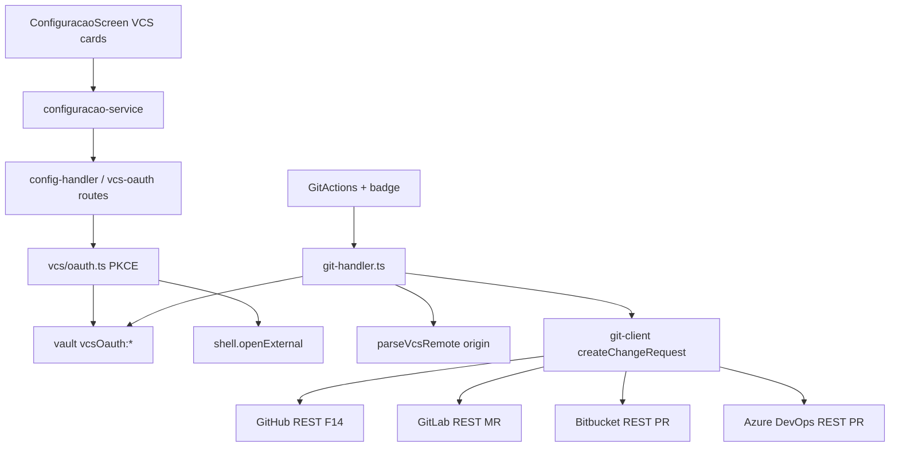

# Spec Técnica: F24. Multi-VCS (GitLab/Bitbucket/Azure)

## 1. Visão Geral Técnica

**O quê:** Conectar GitLab, Bitbucket e Azure DevOps via OAuth PKCE (tokens só no vault); detectar o provider VCS do projeto pela URL do `origin`; estender push/PR de F14 para abrir Pull Request ou Merge Request na API correta; cards em `#configuracao` e badge + terminologia PR/MR no painel Repositório. GitHub continua via PAT F02 (`github:token`) quando o remote for GitHub.

**Por quê:** F14 só fala com `api.github.com` e `parseGithubRemote` rejeita qualquer outro host (`pr_not_github`). Sem F24, projetos GitLab/Bitbucket/Azure não conseguem Commit/push/PR no mesmo fluxo.

**Escopo:** PRD sem Central/Completo — feature inteira (§5, §6 Consome/Capacidades/Experiência/Erros, §9 ACs + cross-feature com F14).

**Incluído:**
- OAuth PKCE (padrão F09) para `gitlab` | `bitbucket` | `azure` — nuvens públicas apenas
- Vault keys `vcsOauth:<provider>`; status sem vazar token
- Cards VCS em `#configuracao` + badge no painel Repositório + labels PR/MR (`ui.md` / `copy.md`)
- `parseVcsRemote` + `createChangeRequest` por provider; inject de token no push HTTPS por host
- Gates de token ausente/expirado com mensagem apontando Configuração; OAuth cancelado sem token parcial
- GitHub: **mantém** contrato F02/F14 (PAT `github:token`); card PAT permanece; não migra GitHub para OAuth nesta feature

**UI/copy — fonte de verdade:** `docs/F24-multi-vcs/ui.md` e `copy.md` (2026-08-08). Spec cita paths e ids `vcs.*`. Lacunas `subtitle.oauth` / `error.*` → provisório só em §3.3.

**Excluído:**
- Self-hosted GitLab / Bitbucket Server / Azure Server (PRD)
- Múltiplos VCS simultâneos no mesmo repo
- Migrar GitHub de PAT para OAuth
- Alterar textgen F14 (continua agnóstico ao host)
- Publish-to-GitHub mini-form (só GitHub / F14)

**Consome (PRD):** F01 (vault), F02 (Configuração), F09 (OAuth PKCE + loopback), F14 (`GitActions` / git-handler / git-client).  
**Provê (PRD):** VCS conectado consumido por `GitActions` (F14) para escolher a API de PR/MR.

---

## 2. Impacto na Arquitetura



---

## 3. Decisões Técnicas

### 3.1 Herdadas do brief / docs canônicos

Padrões de `docs/_shared/codebase-patterns.md` (Camada 1; brief Onda 4 stale — só checklist de stack) + specs F02/F09/F14:

- Vault `setSecret`/`getSecret`/`deleteSecret`; nunca token no SQLite
- HTTP loopback + `guard()` 423→401; validação manual tipada
- OAuth PKCE: `src/services/mcps/oauth.ts` (S256, loopback `127.0.0.1:5180–5199`, `shell.openExternal`, status `pending` em memória, tokens JSON no vault)
- Git F14: `git-handler` + `git-client` REST axios; `github_token_missing`; `stderrTail` / `githubErrorSummary`; open-external https-only
- Migração máxima registrada: `011_usage_limits` — F24 **não** precisa de `012` se status for vault-derived

**Delta:** só GitHub hoje; sem detect multi-host; sem cards OAuth VCS.

### 3.2 Específicas da feature

| Decisão | Abordagem Escolhida | Alternativa Considerada | Trade-off |
|---------|---------------------|-------------------------|-----------|
| GitHub nesta entrega | Manter PAT F02 (`github:token`) e fluxo F14 intactos | Migrar GitHub para OAuth junto | Menos risco de regressão F14; ui.md pergunta fica fechada: PAT + cards OAuth dos três novos |
| Binding projeto ↔ VCS | Detectar `kind` pela URL do `origin` em runtime (`parseVcsRemote`); sem coluna em `projects` | Persistir `projects.vcs_provider` | Um remote = um kind; evita drift com `git remote set-url`; badge lê detect + tokenPresent |
| Um VCS por projeto | Se `origin` não for host suportado → erro acionável (estender `pr_not_github` → `vcs_unsupported_remote`) | Permitir escolher provider na UI independente do remote | PRD: um provider por repo; remote é a fonte de verdade |
| Vault keys | `vcsOauth:gitlab` \| `vcsOauth:bitbucket` \| `vcsOauth:azure` → JSON `{ accessToken, refreshToken?, expiresAt?, tokenType }` (espelho `mcpOauth:`) | Reusar `github:token` genérico | Isola providers; clear por Desconectar sem tocar PAT GitHub |
| OAuth engine | Novo `src/services/vcs/oauth.ts` clonando o fluxo F09 (PKCE + loopback + pending map); **não** misturar com `mcps.oauth_status` | Generalizar oauth.ts único MCP+VCS | Escopo menor; evita acoplar catálogo MCP a VCS |
| Client IDs | Constantes em `vcs-oauth-config.ts` para GitLab/Bitbucket (app público PKCE do EngrenaCode); Azure: se client_id ausente → status `needs-client-id` + `PUT …/client` (padrão F09) | Exigir client_id manual sempre | Desktop apps costumam shippar client_id; Azure é mais restrito |
| Portas loopback | Mesma faixa 5180–5199 de F09 (`findFreePort`) | Porta fixa nova | Evita conflito documentando mutex por flow ativo (um OAuth VCS por vez, como MCP) |
| Push HTTPS | Inject por kind: GitHub `x-access-token` (F14); GitLab `oauth2:{token}@`; Bitbucket `x-token-auth:{token}@`; Azure `:{token}@` (PAT/OAuth DevOps) | Sempre mesmo prefixo | Cada host exige forma distinta |
| Change request API | `createChangeRequest(cwd, token, kind, input)` despacha: GitHub = `createPullRequest` atual; GitLab `POST /projects/:id/merge_requests`; Bitbucket `POST /repositories/{ws}/{repo}/pullrequests`; Azure `POST /{org}/{project}/_apis/git/repositories/{repo}/pullrequests` | CLI `gh`/`glab` | Repo já usa REST axios; sem CLIs extras |
| Erros de token | GitHub: manter `github_token_missing` (compat F14). Outros: `vcs_token_missing`. Expirado/401 API: `vcs_token_expired` + copy apontando reconectar | Unificar tudo em um código | Menos churn nos testes/UI F14 já shipados |
| Labels UI | Helper `changeRequestLabels(kind)` → ids `vcs.cr.*` (MR só `gitlab`) | Hardcode “PR” | Fecha gap fonte × PRD no `ui.md` |
| Badge | Linha no painel Repositório (acima de `GitActions`): kind + connected/needs-reauth | Só tooltip | PRD Experience |
| Schema SQLite | Nenhuma migração | `012_vcs` | Status deriva do vault + pending memória + probe opcional; alinhado a `github:token` |

### 3.3 Assumptions / Auto-Aceitar

| Assumption | Origem | Pode sobrescrever? |
|------------|--------|--------------------|
| GitHub permanece PAT; OAuth só GitLab/Bitbucket/Azure | Auto-Aceitar + fecha pergunta `ui.md` | sim |
| Detect por `origin`; sem coluna `projects` | Auto-Aceitar: recomendação clara | sim |
| Client IDs GitLab/Bitbucket shippados; Azure pode `needs-client-id` | Auto-Aceitar: PRD parcial / F09 | sim — registrar apps OAuth reais na implementação |
| Endpoints REST cloud públicos (hosts fixos `gitlab.com`, `bitbucket.org`, `dev.azure.com`) | PRD: sem self-hosted | sim |
| Copy provisório: `vcs.gitlab.subtitle.oauth` / bitbucket / azure = “Conecte via OAuth (nuvem pública). Um VCS por projeto, detectado pelo remote.”; `vcs.error.oauthFailed` = “Não foi possível conectar. Tente de novo.”; `vcs.error.tokenExpired` = “Sessão VCS expirada. Reconecte em Configuração.” | Auto-Aceitar: copy TODO | sim — design atualiza `copy.md` |
| `ui.md`/`copy.md` são fonte de verdade de anatomia/ids | Passo 1.5b | não aplicável |

---

## 4. Visão Geral de Componentes

**Backend:**

| Caminho do Arquivo | Novo/Modificado | Propósito | Responsabilidades-Chave |
|-------------------|-----------------|-----------|------------------------|
| `src/services/vcs/oauth.ts` | Novo | PKCE VCS | start/callback/disconnect/refresh; vault `vcsOauth:*`; pending map |
| `src/services/vcs/oauth-config.ts` | Novo | Client IDs / authorize+token URLs | Por provider cloud |
| `src/services/vcs/remote.ts` | Novo | `parseVcsRemote` | kind + owner/repo (e org/project Azure) |
| `src/services/http/config-handler.ts` | Modificado | Rotas `/api/config/vcs/*` | status, oauth start/disconnect/client |
| `src/services/git/git-client.ts` | Modificado | Push inject + change request | Despacho por kind; manter GitHub path |
| `src/services/http/git-handler.ts` | Modificado | Escolher token + API | Detect remote; gates `vcs_token_*` |

**Frontend:**

| Caminho do Arquivo | Novo/Modificado | Propósito | Responsabilidades-Chave |
|-------------------|-----------------|-----------|------------------------|
| `src/renderer/screens/ConfiguracaoScreen.tsx` | Modificado | Cards VCS | Anatomia `ui.md` §A; ids `vcs.*` |
| `src/renderer/components/config/VcsOauthCard.tsx` (ou similar) | Novo | Card OAuth reutilizável | Estados F09-like |
| `src/renderer/services/configuracao-service.ts` | Modificado | Client HTTP VCS | Espelha rotas |
| `src/renderer/components/workspace/GitActions.tsx` | Modificado | Labels PR/MR + stages | `vcs.cr.*` |
| `src/renderer/components/workspace/WorkspaceSidebar.tsx` (ou repo panel) | Modificado | Badge provider | `vcs.badge.*` |
| `src/renderer/lib/changeRequestLabels.ts` | Novo | Helper labels | Espelho `threadVisuals` fonte |

**Banco de Dados:** nenhuma migração.

---

## 5. Contratos de API

Auth: `x-engrenacode-session`; guard 423→401; envelope `{ error: { code, message } }`.

### 5.1 Status VCS (config)

- **GET** `/api/config/vcs/status`  
- **Resposta 200:**

```json
{
  "providers": [
    { "kind": "github", "auth": "pat", "status": "connected", "tokenPresent": true },
    { "kind": "gitlab", "auth": "oauth", "status": "disconnected", "tokenPresent": false },
    { "kind": "bitbucket", "auth": "oauth", "status": "pending", "tokenPresent": false },
    { "kind": "azure", "auth": "oauth", "status": "needs-client-id", "tokenPresent": false }
  ]
}
```

`status`: `disconnected` | `pending` | `connected` | `needs-reauth` | `needs-client-id` (só OAuth). GitHub `auth:'pat'` mapeia connected ↔ `tokenPresent`.

### 5.2 OAuth start / disconnect / client

- **POST** `/api/config/vcs/:kind/oauth/start` — `kind ∈ gitlab|bitbucket|azure`  
  - 200: `{ authorizeUrl }` (renderer abre via `openExternal` ou main já abre — espelhar F09)  
  - 409 se flow ativo; 400 se kind inválido; 400 `needs_client_id` se Azure sem client  
- **POST** `/api/config/vcs/:kind/oauth/disconnect` — apaga vault key; status disconnected; **nunca** deixa token parcial  
- **PUT** `/api/config/vcs/:kind/oauth/client` — `{ clientId }` quando `needs-client-id`  
- Callback: loopback HTTP interno (não rota `/api` pública), igual F09

**Cancelamento:** disconnect ou timeout do pending limpa verifier/state em memória e **não** grava vault.

### 5.3 Status VCS do projeto (workspace)

- **GET** `/api/projects/:id/vcs` (ou estender `vcs-status` existente)  
- **Resposta 200:**

```json
{
  "kind": "gitlab",
  "remoteUrl": "https://gitlab.com/acme/app.git",
  "tokenStatus": "connected",
  "changeRequestShort": "MR"
}
```

Se sem remote: `kind: null`. Se host não suportado: `kind: "unknown"`.

### 5.4 Git push / PR (extensão F14)

Rotas existentes `POST …/git-push` e `POST …/pr` passam a:

1. Ler `origin` → `parseVcsRemote`  
2. Selecionar token (`github:token` ou `vcsOauth:<kind>.accessToken`)  
3. Push com inject por kind  
4. PR/MR via API do kind  

**Erros novos / estendidos:**

| Código | Status | Quando |
|--------|--------|--------|
| `github_token_missing` | 400 | kind=github sem PAT (F14) |
| `vcs_token_missing` | 400 | kind oauth sem token |
| `vcs_token_expired` | 401 ou 400 | API 401; copy `vcs.error.tokenExpired` |
| `vcs_unsupported_remote` | 400 | host fora de github/gitlab/bitbucket/azure clouds |
| `pr_create_failed` / `git_push_failed` | 4xx/5xx | stderr/API summary (F14) |

OAuth falha no connect: UI volta `disconnected`; HTTP do start pode 400 com `vcs.error.oauthFailed` — **sem** escrever vault.

---

## 6. Modelo de Dados

**SQLite:** sem mudanças.

**Vault (lógico):**

| Key | Valor | Notas |
|-----|-------|-------|
| `github:token` | string PAT | F02 — intocado |
| `vcsOauth:gitlab` | JSON tokens | F24 |
| `vcsOauth:bitbucket` | JSON tokens | F24 |
| `vcsOauth:azure` | JSON tokens | F24 |
| `vcsOauthClient:azure` (opcional) | `clientId` string | se needs-client-id |

**Remote parse (conceitual):**

| Host | kind | Identidade |
|------|------|------------|
| `github.com` | `github` | owner/repo |
| `gitlab.com` | `gitlab` | path com namespaces (URL-encode project) |
| `bitbucket.org` | `bitbucket` | workspace/repo |
| `dev.azure.com` / `visualstudio.com` | `azure` | org/project/repo |

---

## 7. Estratégia de Testes

### 7.1 Unitário / Integração

| Arquivo de Teste | Tipo | Alvo |
|-----------------|------|------|
| `src/services/vcs/remote.test.ts` | Unitário | parse hosts / unknown |
| `src/services/vcs/oauth.test.ts` | Unitário | PKCE start, cancel sem vault, disconnect |
| `src/services/git/git-client.test.ts` | Unitário | inject por kind; createChangeRequest mock HTTP |
| `src/services/http/config-handler.test.ts` | Integração | status/start/disconnect/guard |
| `src/services/http/git-handler.test.ts` | Integração | gitlab MR path; token missing; unsupported remote |
| `src/renderer/lib/changeRequestLabels.test.ts` | Unitário | PR vs MR |

| Função de Teste | Assertions |
|-----------------|------------|
| `parse_gitlab_https_and_ssh` | kind=gitlab + path |
| `parse_unknown_host` | null/unknown |
| `oauth_cancel_leaves_no_vault` | getSecret undefined |
| `push_inject_gitlab_oauth2` | URL contém `oauth2:` |
| `create_mr_gitlab_success` | URL MR retornada |
| `pr_github_unchanged` | path F14 ainda verde |
| `git_handler_vcs_token_missing` | 400 `vcs_token_missing` |
| `labels_gitlab_uses_mr` | short=MR |

### 7.2 Smoke / Aceitação manual

| # | Passo | Resultado esperado |
|---|-------|-------------------|
| 1 | `#configuracao`: Conectar GitLab OAuth completo | pill Conectado; token só no vault |
| 2 | Cancelar OAuth no browser / Cancelar na UI | disconnected; vault sem key parcial |
| 3 | Projeto com `origin` gitlab.com + token: Commit, push & MR | MR criado; CTA/label MR; open-external |
| 4 | Token revogado → push/PR | falha com apontar Configuração (`vcs.error.tokenExpired`) |
| 5 | Projeto GitHub com PAT | fluxo F14 inalterado |
| 6 | Light/dark: cards + badge + labels vs `ui.md`/`copy.md` | aceite visual; sem Lion* |

### 7.3 Cross-feature

| Critério | Status | Nota |
|----------|--------|------|
| VCS conectado consumido por GitActions (F14) para API correta | ready | AC PRD §9 |
| Tokens só no vault (F01) | ready | |
| Cards em Configuração (F02) + padrão OAuth F09 | ready | |
| GitHub PAT F02/F14 sem regressão | ready | |
| Self-hosted | deferred | Fora de escopo PRD |
