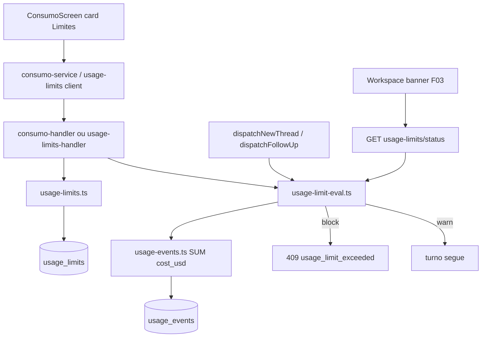

# Spec Técnica: F25. Limites de Consumo (UsageLimits)

## 1. Visão Geral Técnica

**O quê:** Limite mensal configurável em USD (global e/ou por projeto), modos **Avisar** / **Bloquear**, card em `#consumo` com barra do gasto do período, banner no workspace em 80%/100%, e gate no dispatch do F03 que recusa novo turno quando o modo é Bloquear e o teto foi estourado — tudo sobre os mesmos `usage_events` / `cost_source` do F11, sem segundo motor de custo.

**Por quê:** F11 já agrega gasto; falta o teto decidível pelo usuário e o sinal consumido pelo Workspace antes de `acquireLease`. Sem isso o AC cross-feature “limite usa os mesmos `usage_events`” e os 4 ACs de F25 ficam inatingíveis.

**Escopo:** PRD sem blocos Central/Completo para F25 — feature inteira (§5 histórias, §6 Consome/Provê/Capacidades/Experiência/Tratamento de Erros, §9 ACs + integração).

**Incluído:**
- Migração `011_usage_limits`: tabela `usage_limits`
- Repositório + serviço de avaliação (mês civil, fuso do SO; fail-open)
- HTTP: CRUD/upsert de limites + status para UI/gate
- Gate em `dispatchNewThread` / `dispatchFollowUp` antes de `acquireLease` (só modo Bloquear em ≥100%)
- Card “Limites de consumo” em `ConsumoScreen` + banners no workspace (F03)
- Reuso de `SUM(cost_usd)` / regra “`cost_usd` null não conta” do F11

**UI/copy — fonte de verdade:** `docs/F25-limites-de-consumo/ui.md` e `copy.md` (2026-08-08). Spec cita paths e ids `limits.*`; não redescreve anatomia nem recopia strings. Lacunas `limits.dest.hint` / `banner*` / `blockedTurn` (TODO no `copy.md`) → strings provisórias só em §3.3 até o design fechar.

**Excluído:**
- Card sidebar “Limites” da fonte (cotas de assinatura por provider / `GET /usage-limits` legado) — gap documentado no `ui.md`
- Fatura real, projeção, export CSV/PDF (PRD §7 / Fora de Escopo)
- Interromper turno `running` quando o limite muda mid-flight
- Cálculo de custo paralelo ao F11

**Consome (PRD):** F01.1 (tokens de superfície), F11 (`usage_events` agregados).  
**Provê (PRD):** sinal “limite atingido” para F03 (bloquear ou só avisar).

---

## 2. Impacto na Arquitetura



Componentes afetados (caminhos): ver §4.

---

## 3. Decisões Técnicas

### 3.1 Herdadas do brief / docs canônicos

Padrões de `docs/_shared/codebase-patterns.md` (Camada 1; brief Onda 4 **stale** vs HEAD `744c0af3` — usado só como checklist de stack) + spec F11 e handlers existentes:

- HTTP loopback `127.0.0.1:5174`, `guard()` 423→401, `{ error: { code, message } }`
- SQLite `node:sqlite`, migrações numeradas em `client.ts`, PKs `TEXT`, timestamps epoch ms
- Repos: funções de módulo, SQL cru, snake→camel em `toX()`
- Validação manual tipada (sem Zod)
- Vitest co-local; `ENGRENACODE_USER_DATA` + `openDb(':memory:')`
- Agregação de custo: `SUM(cost_usd)` já ignora `NULL` (eventos sem preço / `cost_source` sem `cost_usd`)

**Delta desta feature (exploração inline):** não existe settings/KV genérico; próxima migração livre = `011_*` (após `010_slash_pipeline`); gate de turno é `dispatchNewThread`/`dispatchFollowUp` + `handleDispatchError` em `threads-handler.ts`; `#consumo` anatomia F11 fixa Resumo → Projetos → … → Preços.

Desvios: nenhum vs Camada 1.

### 3.2 Específicas da feature

| Decisão | Abordagem Escolhida | Alternativa Considerada | Trade-off |
|---------|---------------------|-------------------------|-----------|
| Persistência | Tabela SQLite `usage_limits` (migração `011_usage_limits`) | Vault secret / JSON em ficheiro | Alinha a F11 (dados de consumo no DB); query e testes simples; não é segredo |
| Escopos coexistentes | Uma linha `scope='global'` + N linhas `scope='project'` (`project_id` NOT NULL, UNIQUE) | Só um limite ativo no app inteiro | PRD permite projeto **ou** global; UI edita um de cada vez, DB guarda vários |
| Avaliação no turno do projeto P | Aplica **todos** os limites aplicáveis: global (se configurado) **e** projeto P (se configurado); estado efetivo = pior entre eles (`at100-block` > `at100-warn` > `warn80` > `ok`) | Projeto sobrescreve global | Mais protetor; evita burlar teto global com projeto sem limite |
| Período | Mês civil: `[início do dia 1 00:00:00, agora)` no fuso do processo Node/SO | Alinhar aos chips 7d/30d/Tudo do F11 | PRD fixa mensal + reset dia 1; chips F11 continuam só para métricas |
| Contagem USD | `SUM(cost_usd)` em `usage_events` no período; filtro `project_id` só no limite de projeto; global = todos os projetos | Replicar lógica de billing mode | Zero cálculo paralelo; `cost_usd IS NULL` não entra no SUM (AC + Tratamento de Erros) |
| Gate | `evaluateUsageLimitsForProject(projectId)` **antes** de `acquireLease` em create + follow-up; só bloqueia se algum limite aplicável está ≥100% **e** `mode='block'` | Checar só no renderer | Server autoritativo; evita bypass |
| Fail-open | Qualquer throw/erro na agregação ou leitura de limites → trata como “sem bloqueio” + `console.error` / log opcional | Fail-closed | PRD: não travar usuário por bug de agregação |
| Mid-turno | Mudança de limite com thread `running`/`waiting_user`/`stopping` **não** aborta; próximo `dispatch*` reavalia | Cancelar turno atual | PRD explícito |
| HTTP surface | Estender `consumo-handler.ts` com `/api/usage-limits` (+ status) | Handler novo só para limits | Mesmo domínio de consumo; um wiring em `unlock-handler` |
| Erro de bloqueio | `UsageLimitExceededError` → HTTP **409** `usage_limit_exceeded` (espelha família `thread_busy`) + details `{ spentUsd, limitUsd, scope, projectId?, adjustHash: '#consumo' }` | 402 / 403 | Consistente com conflitos de política já usados no dispatch |
| Persistência na UI | Botão Salvar no card (upsert explícito) | Autosave a cada keystroke | Evita writes parciais; alinhado a forms de Configuração |
| Posição do card | Após Resumo (MetricCards), **antes** da seção Projetos (fecha TODO do `ui.md`) | Antes de Preços | Limite é decisão de teto, não de pricing; fica visível sem scroll até Preços |
| Escopo Projeto na tela global | Quando Escopo = Projeto, select de projeto (lista já usada em F11 / projects API) | Só no drill-down | `#consumo` é global; sem select o escopo projeto seria ambíguo |
| Sidebar cotas fonte | Fora de F25 | Portar como feature extra | Produto diferente (assinatura %); `ui.md` já exclui |

### 3.3 Assumptions / Auto-Aceitar

| Assumption | Origem | Pode sobrescrever? |
|------------|--------|--------------------|
| Escopos coexistentes + pior estado (tabela 3.2) | Auto-Aceitar: “Decisões técnicas com recomendação clara” + standing “siga sempre as recomendações” | sim |
| Migração `011_usage_limits` / extensão do `consumo-handler` | idem | sim |
| Posição do card após Resumo; select de projeto para escopo Projeto | idem + fecha perguntas abertas do `ui.md` | sim |
| HTTP 409 `usage_limit_exceeded` | Auto-Aceitar: “Especificações PRD parciais” | sim |
| Strings provisórias (até fechar `copy.md`): `limits.dest.hint` = texto da fixture (“Limite em USD no período mensal…”); `limits.dest.banner80` = “Você atingiu 80% do limite de consumo deste período.”; `limits.dest.banner100` = “Você atingiu o limite de consumo deste período.”; `limits.dest.blockedTurn` = “Limite de consumo atingido. Ajuste o limite em Consumo para continuar.”; link = `limits.dest.link.adjust` | Auto-Aceitar: PRD parcial / copy TODO | sim — design deve atualizar `copy.md` e a UI só troca literal |
| `ui.md`/`copy.md` existem; anatomia e ids são fonte de verdade; TODOs de copy cobertos só por provisório acima | Passo 1.5b | não aplicável |

---

## 4. Visão Geral de Componentes

**Backend:**

| Caminho do Arquivo | Novo/Modificado | Propósito | Responsabilidades-Chave |
|-------------------|-----------------|-----------|------------------------|
| `src/services/db/migrations/011_usage_limits.ts` | Novo | Schema `usage_limits` | CREATE + índices/UNIQUE |
| `src/services/db/client.ts` | Modificado | Registrar migração `011` | — |
| `src/services/db/repositories/usage-limits.ts` | Novo | CRUD limites | upsert, getGlobal, getForProject, list, delete/clear |
| `src/services/db/repositories/usage-events.ts` | Modificado | Soma do período mensal | `sumCostUsdInPeriod({ fromMs, toMs, projectId? })` reutilizando regra F11 |
| `src/services/runner/usage-limit-eval.ts` | Novo | Avaliação pura | bounds do mês, pct, nível, `blocked`, fail-open wrapper |
| `src/services/http/consumo-handler.ts` | Modificado | Rotas `/api/usage-limits*` | guard, validação, upsert/list/status |
| `src/services/runner/dispatch.ts` | Modificado | Gate pré-lease | chama eval; lança `UsageLimitExceededError` se block |
| `src/services/http/threads-handler.ts` | Modificado | Mapear erro | 409 `usage_limit_exceeded` em `handleDispatchError` |

**Frontend:**

| Caminho do Arquivo | Novo/Modificado | Propósito | Responsabilidades-Chave |
|-------------------|-----------------|-----------|------------------------|
| `src/renderer/screens/ConsumoScreen.tsx` | Modificado | Card Limites | Anatomia `ui.md` §A; ids `limits.dest.*` |
| `src/renderer/screens/consumoScreen.logic.ts` | Modificado | Helpers UI | pct, cor da barra, validação USD |
| `src/renderer/services/consumo-service.ts` | Modificado | Client HTTP | GET/PUT limits + status |
| `src/renderer/components/workspace/*` (banner) | Novo ou Modificado | Banner aviso/bloqueio | `ui.md` §B; consome status por `projectId` ativo |

**Banco de Dados:**

| Arquivo de Migração | Tabelas Afetadas | Operação | Notas |
|-------------------|------------------|----------|-------|
| `011_usage_limits.ts` | `usage_limits` | CREATE | Ver §6 |

---

## 5. Contratos de API

Todas as rotas: header `x-engrenacode-session`; guard 423 `vault_locked` → 401 `unauthorized`; envelope `{ error: { code, message } }`.

### 5.1 Listar limites configurados

- **Método:** GET  
- **Caminho:** `/api/usage-limits`

**Resposta (200):**

| Campo | Tipo | Descrição |
|-------|------|-----------|
| `limits[]` | `array` | Linhas persistidas |

Item:

| Campo | Tipo | Descrição |
|-------|------|-----------|
| `id` | `string` | PK |
| `scope` | `'global' \| 'project'` | Escopo |
| `projectId` | `string \| null` | Obrigatório se `project` |
| `limitUsd` | `number` | Teto > 0 |
| `mode` | `'warn' \| 'block'` | Modo |
| `updatedAt` | `number` | epoch ms |

```json
{
  "limits": [
    { "id": "ulim_global", "scope": "global", "projectId": null, "limitUsd": 100, "mode": "warn", "updatedAt": 1723123200000 },
    { "id": "ulim_proj_abc", "scope": "project", "projectId": "proj_abc", "limitUsd": 50, "mode": "block", "updatedAt": 1723123200000 }
  ]
}
```

### 5.2 Upsert limite

- **Método:** PUT  
- **Caminho:** `/api/usage-limits`

**Requisição:**

| Campo | Tipo | Obrigatório | Validação | Descrição |
|-------|------|-------------|-----------|-----------|
| `scope` | `string` | Sim | `global` \| `project` | Escopo |
| `projectId` | `string` | Se `project` | projeto existe | Ignorado/null se global |
| `limitUsd` | `number \| null` | Sim | `null` = remover limite; senão finito > 0, máx. 1e9 | Teto USD |
| `mode` | `string` | Sim se `limitUsd != null` | `warn` \| `block` | Modo |

```json
{ "scope": "project", "projectId": "proj_abc", "limitUsd": 50, "mode": "block" }
```

**Resposta (200):** `{ "limit": { ... } }` se upsert; `{ "limit": null }` se remoção.

**Erros:**

| Código | Status | Descrição |
|--------|--------|-----------|
| `validation_error` | 400 | scope/mode/USD inválidos |
| `not_found` | 404 | `projectId` inexistente |

### 5.3 Status (UI + pré-check)

- **Método:** GET  
- **Caminho:** `/api/usage-limits/status`

**Query:**

| Campo | Tipo | Obrigatório | Validação | Descrição |
|-------|------|-------------|-----------|-----------|
| `projectId` | `string` | Não | se presente, projeto existe | Avalia limites aplicáveis a esse projeto; sem id = só global |

**Resposta (200):**

| Campo | Tipo | Descrição |
|-------|------|-----------|
| `period.fromMs` / `.toMs` | `number` | Bounds do mês civil |
| `level` | `'none' \| 'ok' \| 'warn80' \| 'at100'` | Pior nível (sem considerar se block ou warn) |
| `blocked` | `boolean` | `true` só se algum aplicável ≥100% e `mode=block` |
| `failOpen` | `boolean` | `true` se a avaliação degradou por erro interno |
| `items[]` | `array` | Um por limite aplicável |

Item de `items[]`:

| Campo | Tipo | Descrição |
|-------|------|-----------|
| `scope` / `projectId` / `mode` / `limitUsd` | — | Ecoa config |
| `spentUsd` | `number` | Soma precificada no período |
| `pct` | `number` | `floor(spent/limit*100)` cap visual opcional |
| `level` | `'ok' \| 'warn80' \| 'at100'` | Por item |

```json
{
  "period": { "fromMs": 1722470400000, "toMs": 1723123456789 },
  "level": "warn80",
  "blocked": false,
  "failOpen": false,
  "items": [
    { "scope": "global", "projectId": null, "mode": "warn", "limitUsd": 100, "spentUsd": 82.5, "pct": 82, "level": "warn80" }
  ]
}
```

### 5.4 Gate no dispatch (não é rota nova)

Quando `dispatchNewThread` / `dispatchFollowUp` recebe `UsageLimitExceededError`:

- **Status:** 409  
- **Código:** `usage_limit_exceeded`  
- **Message:** string alinhada a `limits.dest.blockedTurn` (provisória até `copy.md`)  
- **Details:** `{ spentUsd, limitUsd, scope, projectId, adjustHash: "#consumo" }`

Modo Avisar em 80%/100%: dispatch **não** falha; UI usa GET status para banner.

---

## 6. Modelo de Dados

**Tabela: `usage_limits`**

| Coluna | Tipo | Nullable | Padrão | Descrição |
|--------|------|----------|--------|-----------|
| `id` | `TEXT` | Não | — | PK (`ulim_global` ou `ulim_<projectId>`) |
| `scope` | `TEXT` | Não | — | `global` \| `project` |
| `project_id` | `TEXT` | Sim | `NULL` | FK lógica a `projects.id`; NULL se global |
| `limit_usd` | `REAL` | Não | — | > 0 |
| `mode` | `TEXT` | Não | — | `warn` \| `block` |
| `updated_at` | `INTEGER` | Não | — | epoch ms |

**Índices / constraints:**

| Nome | Tipo | Definição | Propósito |
|------|------|-----------|-----------|
| `pk_usage_limits` | PRIMARY KEY | `id` | Identidade |
| `chk_usage_limits_scope` | CHECK | `scope IN ('global','project')` | Enum |
| `chk_usage_limits_mode` | CHECK | `mode IN ('warn','block')` | Enum |
| `chk_usage_limits_usd` | CHECK | `limit_usd > 0` | Teto válido |
| `chk_usage_limits_project_shape` | CHECK | `(scope='global' AND project_id IS NULL) OR (scope='project' AND project_id IS NOT NULL)` | Forma |
| `uq_usage_limits_global` | UNIQUE partial / app-enforced | um global | Idempotência upsert |
| `uq_usage_limits_project` | UNIQUE | `project_id` WHERE not null | Um limite por projeto |

SQLite: UNIQUE em `project_id` (NULLs distintos) + id determinístico `ulim_global` para o global.

**Migração (exemplo):**

```sql
CREATE TABLE IF NOT EXISTS usage_limits (
  id TEXT PRIMARY KEY,
  scope TEXT NOT NULL CHECK (scope IN ('global', 'project')),
  project_id TEXT,
  limit_usd REAL NOT NULL CHECK (limit_usd > 0),
  mode TEXT NOT NULL CHECK (mode IN ('warn', 'block')),
  updated_at INTEGER NOT NULL,
  CHECK (
    (scope = 'global' AND project_id IS NULL) OR
    (scope = 'project' AND project_id IS NOT NULL)
  )
);

CREATE UNIQUE INDEX IF NOT EXISTS uq_usage_limits_project
  ON usage_limits(project_id) WHERE project_id IS NOT NULL;
```

Não altera `usage_events` / `model_pricing`.

---

## 7. Estratégia de Testes

### 7.1 Unitário / Integração

| Arquivo de Teste | Tipo | Alvo | Objetivo |
|-----------------|------|------|----------|
| `src/services/db/repositories/usage-limits.test.ts` | Unitário | repo | upsert/clear/unique |
| `src/services/runner/usage-limit-eval.test.ts` | Unitário | eval | pct, níveis, pior estado, fail-open, mês |
| `src/services/db/repositories/usage-events.test.ts` | Unitário | soma período | null cost ignorado; filtro projeto |
| `src/services/http/consumo-handler.test.ts` | Integração | HTTP limits | guard, PUT/GET/status, 404 projeto |
| `src/services/runner/dispatch.test.ts` | Integração | gate | block vs warn; mid-config não afeta turno já leased |
| `src/renderer/screens/consumoScreen.logic.test.ts` | Unitário | UI helpers | barra/pct |

| Função de Teste | Descrição | Assertions |
|-----------------|-----------|------------|
| `upsert_global_and_project` | Dois escopos | Ambos listados; unique por projeto |
| `clear_limit_removes_row` | `limitUsd: null` | Linha ausente; status `level=none` |
| `sum_ignores_null_cost_usd` | Eventos mistos | Soma só precificados |
| `eval_warn80_does_not_block` | 80–99%, mode warn | `blocked=false`, `level=warn80` |
| `eval_at100_block` | ≥100%, mode block | `blocked=true` |
| `eval_worst_of_global_and_project` | Global ok, projeto at100 block | `blocked=true` |
| `eval_fail_open_on_throw` | Repo quebra | `blocked=false`, `failOpen=true` |
| `http_put_validation` | USD ≤0 / mode inválido | 400 |
| `dispatch_block_returns_409` | Follow-up com teto | `usage_limit_exceeded` |
| `dispatch_warn_allows_turn` | Mesmo gasto, mode warn | 201 / lease ok |

### 7.2 Smoke / Aceitação manual

| # | Passo | Resultado esperado |
|---|-------|-------------------|
| 1 | Em `#consumo`, salvar limite global USD + modo Avisar; gerar gasto ≥80% (ou fixture) | Card mostra barra; banner 80% (`limits.dest.banner80`); novo turno **não** bloqueia |
| 2 | Subir a 100% com Avisar | Banner 100%; turno ainda permitido |
| 3 | Trocar para Bloquear com gasto ≥100% | Novo turno → mensagem/`usage_limit_exceeded` + link `#consumo` (`limits.dest.blockedTurn` / `link.adjust`) |
| 4 | Evento só com `cost_usd` null | Barra/gasto do limite **não** sobe |
| 5 | Light/dark: card + banners vs `ui.md`; strings vs `copy.md` (ou provisório §3.3) | Aceite visual; sem Lion* |

### 7.3 Cross-feature

| Critério | Status | Nota |
|----------|--------|------|
| Limite usa mesmos `usage_events`/`cost_source` de F11 sem cálculo paralelo | ready | AC PRD §9 |
| Tokens/superfície F01.1 no card e banners | ready | `ui.md` |
| Sinal consumido por F03 (gate + banner no workspace) | ready | Provê F25 |
| Sidebar cotas de assinatura (fonte) | deferred | Fora de F25 / produto separado |
