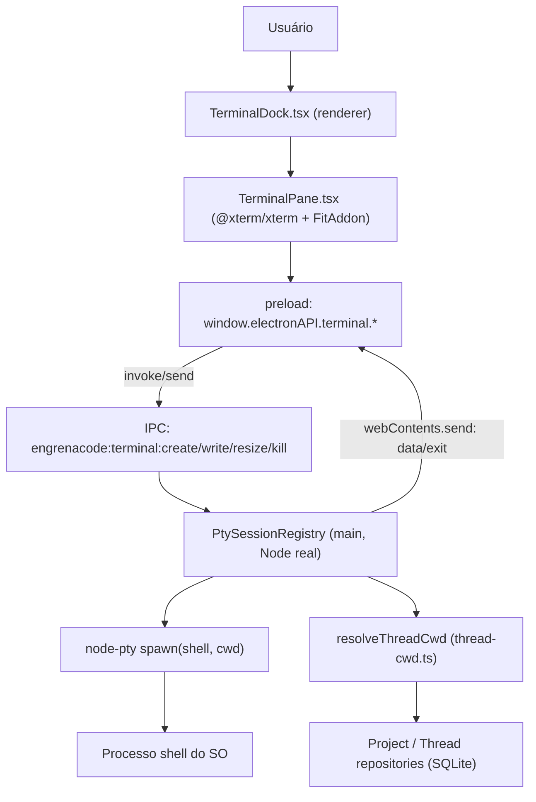

# Especificação Técnica: F26. Terminal PTY no Dock

## 1. Visão Geral Técnica

**O quê:** Um terminal real (PTY — pseudo-terminal, não um emulador de saída de texto) embutido no EngrenaCode, aberto a partir de um dock inferior expansível com múltiplas abas por projeto. Cada aba spawna um processo de shell do sistema operacional via `node-pty`, rodando no processo main do Electron (Node real, com acesso nativo ao SO), e faz streaming bidirecional de dados (stdin/stdout do shell) para o renderer via IPC. O frontend renderiza esse stream com `@xterm/xterm`, já presente no bundle mas ainda não conectado a nenhum componente real.

**Por quê:** O EngrenaCode é uma IDE local-first para orquestração de agentes; usuários frequentemente precisam rodar comandos ad-hoc (instalar dependências, inspecionar o repo, rodar um script) sem sair do app. Um terminal real — não uma reimplementação de shell — é o único jeito de cobrir esse caso sem recriar todo o ecossistema de ferramentas de linha de comando do SO.

**Escopo:** O PRD não define blocos `Escopo Central`/`Adições ao Escopo Completo` para F26 — a spec cobre a feature inteira: processo PTY real, múltiplas abas por projeto, cwd resolvida (projeto ou worktree da thread ativa), e os dois tratamentos de erro do PRD (shell ausente, processo morto inesperadamente).

**Nível de complexidade:** `médio`, com peso deslocado para o topo da faixa por causa de três fatores que a contagem de endpoints não captura: (1) processo nativo real controlado pelo main process, não um serviço HTTP/CRUD; (2) canal IPC bidirecional e streaming (comando + evento), não request/response único; (3) superfície de segurança nova — primeiro ponto do app onde o processo main spawna um shell interativo com os privilégios completos do usuário do SO.

**UI da feature:** `docs/F26-terminal-pty-dock/ui.md` e `copy.md` **ainda não existem** (confirmado — nenhum processo de design rodou para esta feature ainda). Esta spec documenta apenas o contrato de dados/estado (IPC, estado de abas, ciclo de vida de sessão) que a UI final vai consumir; não inventa anatomia de dock, layout de abas ou texto literal. Ver Seção 3.3 (Assumptions) e o plano (fase de fechamento) para a pendência explícita.

## 2. Impacto na Arquitetura

**Componentes afetados:**
- `src/services/terminal/pty-session-registry.ts` (novo) — registro em memória de sessões PTY no processo main
- `src/services/terminal/shell-resolver.ts` (novo) — resolução do shell padrão do SO
- `src/services/runner/thread-cwd.ts` (reutilizado, sem mudança) — `resolveThreadCwd(thread, project)`
- `src/main/index.ts` (modificado) — handlers IPC `engrenacode:terminal:*`
- `src/preload/index.ts` (modificado) — namespace `terminal` no `contextBridge`
- `src/renderer/theme/xterm-theme.ts` (sem mudança de lógica — primeiro consumidor real)
- `src/renderer/hooks/useTerminalDock.ts` (novo)
- `src/renderer/components/workspace/TerminalDock.tsx` (novo)
- `src/renderer/components/workspace/TerminalPane.tsx` (novo)
- `src/renderer/screens/PrincipalScreen.tsx` (modificado — encaixa o dock no layout do Workspace)



## 3. Decisões Técnicas

### 3.1 Herdadas do brief / docs canônicos

Padrões herdados de `docs/_shared/codebase-patterns.md` (Camada 1 + Camada 2) e de `docs/F03-workspace/spec.md`, `docs/F01.1-design-system/spec.md`. Especificamente:
- Convenção de canal IPC `engrenacode:<domínio>:<ação>` (confirmada em `src/preload/index.ts` e `src/main/index.ts`: `engrenacode:vault:*`, `engrenacode:dialog:open-folder`, `engrenacode:shell:open-external`)
- `resolveThreadCwd(thread, project)` como único ponto de resolução de cwd (`src/services/runner/thread-cwd.ts`), já usado por dispatch/delegate/git-handler
- `xtermThemeFromCssVars()` (`src/renderer/theme/xterm-theme.ts`) como fonte de tema do terminal, construída a partir das CSS vars do Design Lock (F01.1) e `fontFamily.mono` (JetBrains Mono)
- `@xterm/xterm` + `@xterm/addon-fit` já são dependências instaladas (não precisam ser adicionadas)
- Ausência de Zod no projeto — validação manual tipada, códigos de erro estáveis em `snake_case` (`shell_not_found`, `session_not_found`, etc.)

Desvios desta feature: nenhum.

### 3.2 Específicas da feature

| Decisão | Abordagem Escolhida | Alternativa Considerada | Trade-off |
|---------|---------------------|--------------------------|-----------|
| Pacote de PTY nativo | `node-pty` (fork mantido pela Microsoft, usado pelo VS Code; ConPTY nativo no Windows) | `@homebridge/node-pty-prebuilt-multiarch` (binários prebuilt, sem toolchain de build local) | `node-pty` exige rebuild nativo contra o ABI do Electron (toolchain local ou `@electron/rebuild`), mas é a dependência com trilha de atualização de segurança mais previsível e é a que o ecossistema Electron mais testa |
| Canal de streaming main→renderer | IPC dedicado `engrenacode:terminal:*` (per Writer Contract desta rodada) | Reaproveitar `ws-hub.ts` com um `threadId` sintético (opção levantada no brief, não fixada pelo Research) | `ws-hub.ts` é escopado a uma thread real (`Map<threadId, Set<WebSocket>>`); o terminal não é amarrado a uma thread — pode abrir com só um projeto selecionado, sem thread ativa — então um IPC dedicado evita forçar um `threadId` sintético dentro de um mecanismo desenhado para outra coisa |
| Persistência de sessão | Nenhuma — `Map` em memória no processo main, sem SQLite/vault | Persistir estado de abas (não o processo) em SQLite para restaurar layout ao reabrir o app | PRD é explícito: "processo do terminal morre quando a aba fecha ou o app fecha"; persistir o processo é impossível (PTY não sobrevive a restart do SO/app) e persistir só o layout de abas foi descartado para não sugerir uma sessão que não existe mais |
| Resolução do shell padrão | Windows: `process.env.COMSPEC` (fallback `cmd.exe`); POSIX: `process.env.SHELL` (fallback `/bin/bash`) | Hardcode de um único shell cross-platform (ex.: sempre `bash`) | Mais branches de plataforma, mas é o que o PRD pede ("rodando o shell padrão do SO do usuário") — hardcode romperia esse critério em Windows |

### 3.3 Assumptions / Auto-Aceitar

| Assumption | Origem | Pode sobrescrever? |
|------------|--------|---------------------|
| Nova dependência de produção `node-pty` (não existe hoje no repo) | Auto-Aceitar: "Feature exige nova tecnologia não presente no codebase" — análogo ao precedente já aceito no PRD para F27 (STT, lib nova) | sim |
| Rebuild nativo pós-`pnpm install` (ABI do Electron 43 difere do Node do sistema) precisa de passo dedicado (`@electron/rebuild` ou `electron-builder install-app-deps`) | Auto-Aceitar: consequência direta de introduzir `node-pty`; nenhum precedente de módulo nativo existia no repo até agora | sim |
| IPC dedicado `engrenacode:terminal:*`, processo PTY no main (Node real), streaming via IPC | Writer Contract desta rodada (arquitetura fixada, não é decisão do writer) | não — decisão de arquitetura já fixada para este lote |
| Terminal roda com os mesmos privilégios do usuário do SO, sem sandbox adicional do EngrenaCode | PRD, citado literalmente: *"Terminal roda com os mesmos privilégios do usuário do SO — sem sandbox adicional do EngrenaCode (mesma superfície de risco de abrir um terminal do sistema operacional diretamente); documentado como tal na UI"* (Seção 6, F26 Capacidades) e reforçado em Seção 7 Fora de Escopo | não — decisão de produto já fechada no PRD, é um limite de design deliberado, não uma lacuna a preencher |
| cwd de cada sessão sempre via `resolveThreadCwd(thread, project)` (`thread-cwd.ts`), nunca recalculada localmente | Writer Contract desta rodada | não — reuso é mandatório para não divergir de F03/F13 sobre onde o processo roda |
| `ui.md`/`copy.md` ainda não escritos para esta feature — spec cobre só contrato de dados/estado, sem anatomia final de dock/abas nem strings literais | `ui.md`/`copy.md` ausentes (confirmado no brief, Seção 5) | sim — vira obrigatório assim que o processo de design rodar |
| Atalho de teclado padrão para abrir/fechar o dock: `Ctrl+\`` (backtick), seguindo convenção comum de terminais integrados (VS Code, iTerm) | PRD pede "atalho de teclado" sem especificar a tecla — Auto-Aceitar: "Especificações PRD parciais" | sim |
| Estado de abas (quais estão abertas, ordem, aba ativa) não persiste entre reinícios do app — cada abertura do EngrenaCode começa com o dock fechado e zero abas | PRD não especifica; Auto-Aceitar: "Descrição muito vaga" — best-practice: já que o processo em si não sobrevive a restart, persistir metadados de abas sem processo vivo criaria estado inconsistente | sim |

## 4. Visão Geral de Componentes

**Frontend:**

| Caminho do Arquivo | Novo/Modificado | Propósito | Responsabilidades-Chave |
|---------------------|-------------------|-----------|---------------------------|
| `src/renderer/components/workspace/TerminalDock.tsx` | Novo | Dock inferior expansível com barra de abas | Expand/collapse, lista de abas do projeto ativo, atalho de teclado global, botão "nova aba" |
| `src/renderer/components/workspace/TerminalPane.tsx` | Novo | Uma aba/sessão de terminal | Monta `@xterm/xterm` + `FitAddon`, aplica `xtermThemeFromCssVars()`, encaminha keystrokes via IPC, renderiza chunks recebidos, exibe estados de erro (`shell_not_found`) e "Sessão encerrada" |
| `src/renderer/hooks/useTerminalDock.ts` | Novo | Estado de abas por projeto e ciclo de vida IPC | Criar/fechar/reabrir aba, assinar eventos `data`/`exit` por `sessionId`, expor ações para `TerminalDock`/`TerminalPane` |
| `src/renderer/theme/xterm-theme.ts` | Modificado (conectado, sem mudança de lógica) | Fonte de tema do terminal | Primeiro consumidor real de `xtermThemeFromCssVars()` — o comentário do arquivo já previa isso ("Consumers (F03) should call this after theme is applied") |
| `src/renderer/screens/PrincipalScreen.tsx` | Modificado | Encaixe do dock no layout do Workspace | Adiciona `TerminalDock` ao layout existente (`grid-cols-[280px_1fr_280px]`), ao lado — não substituindo — o painel principal |

**Main process (Electron):**

| Caminho do Arquivo | Novo/Modificado | Propósito | Responsabilidades-Chave |
|---------------------|-------------------|-----------|---------------------------|
| `src/services/terminal/pty-session-registry.ts` | Novo | Registro em memória de sessões PTY | `Map<sessionId, PtySession>`; spawn/write/resize/kill via `node-pty`; propaga `data`/`exit` distinguindo encerramento esperado (kill pedido pelo usuário) de inesperado (crash) |
| `src/services/terminal/shell-resolver.ts` | Novo | Resolve o shell padrão do SO | Windows: `COMSPEC`/`cmd.exe`; POSIX: `SHELL`/`/bin/bash`; retorna erro `shell_not_found` quando nenhum candidato existe no disco |
| `src/main/index.ts` | Modificado | Registro dos handlers IPC de terminal | `ipcMain.handle` para `create`/`kill`, `ipcMain.on` para `write`/`resize`, `mainWindow.webContents.send` para `data`/`exit` — mesmo padrão já usado pelos handlers de vault/dialog/shell neste arquivo |
| `src/preload/index.ts` | Modificado | Bridge `terminal` no `contextBridge` | Namespace `terminal` espelhando a convenção existente (`vault`, `dialog`, `shell`): `create`/`write`/`resize`/`kill` via `invoke`/`send`, `onData`/`onExit` via `ipcRenderer.on` |
| `src/services/runner/thread-cwd.ts` | Reutilizado (sem mudança) | Resolução de cwd | `resolveThreadCwd(thread, project)` chamado pelo registry ao criar sessão — nunca reimplementado localmente |

**Banco de Dados:** Nenhuma tabela nova. Ver Seção 6 — sessões PTY são efêmeras e vivem só em memória no processo main.

## 5. Contratos de API

F26 não expõe endpoints HTTP — toda a superfície é IPC main↔renderer, seguindo o mesmo padrão de `engrenacode:vault:*` já documentado em `docs/F01-vault-e-sessao-local/spec.md` ("Comportamento pós-unlock (não-HTTP)"). Os canais abaixo compõem o contrato completo de F26.

### Canal: Criar sessão

- **Nome:** `engrenacode:terminal:create`
- **Direção:** `renderer → main`, via `ipcRenderer.invoke` (request/response)
- **Autenticação:** nenhuma — feature roda inteiramente local, sem vault/sessão HTTP envolvida

**Payload de requisição:**

| Campo | Tipo | Obrigatório | Validação | Descrição |
|-------|------|--------------|-----------|-----------|
| `projectId` | `string` | Sim | projeto deve existir | Projeto dono da aba |
| `threadId` | `string \| null` | Não | thread deve pertencer ao `projectId`, quando informada | Thread ativa no momento da criação — usada para resolver worktree via `resolveThreadCwd` |
| `cols` | `number` | Sim | inteiro > 0 | Colunas iniciais (de `FitAddon`) |
| `rows` | `number` | Sim | inteiro > 0 | Linhas iniciais (de `FitAddon`) |

**Exemplo de Requisição:**
```json
{
  "projectId": "8f2c1e40-...",
  "threadId": "b91a7d02-...",
  "cols": 120,
  "rows": 32
}
```

**Resposta (Sucesso):**

| Campo | Tipo | Descrição |
|-------|------|-----------|
| `sessionId` | `string` (uuid) | Identificador da sessão criada — usado em todos os canais seguintes |
| `shell` | `string` | Caminho do shell resolvido e spawado |
| `cwd` | `string` | cwd efetivo (resultado de `resolveThreadCwd` ou `project.path`) |

**Exemplo de Resposta:**
```json
{
  "sessionId": "c4e9a710-...",
  "shell": "C:\\Windows\\System32\\cmd.exe",
  "cwd": "C:\\Users\\Me\\Code\\repos\\meu-projeto"
}
```

**Códigos de Erro:**

| Código | Canal | Descrição |
|--------|-------|-----------|
| `project_not_found` | resposta de `create` | `projectId` não existe |
| `thread_not_found` | resposta de `create` | `threadId` informado não pertence ao `projectId` |
| `shell_not_found` | resposta de `create` | Nenhum shell resolvido existe no disco — spawn nem é tentado |

### Canal: Enviar teclas

- **Nome:** `engrenacode:terminal:write`
- **Direção:** `renderer → main`, via `ipcRenderer.send` (fire-and-forget, sem resposta — igual latência de um terminal real)

| Campo | Tipo | Obrigatório | Descrição |
|-------|------|--------------|-----------|
| `sessionId` | `string` | Sim | Sessão alvo |
| `data` | `string` | Sim | Bytes digitados/colados, repassados ao stdin do PTY sem transformação |

`sessionId` desconhecido: descartado silenciosamente no registry (sem erro visível — a aba já teria recebido `exit` antes disso).

### Canal: Redimensionar

- **Nome:** `engrenacode:terminal:resize`
- **Direção:** `renderer → main`, via `ipcRenderer.send`

| Campo | Tipo | Obrigatório | Descrição |
|-------|------|--------------|-----------|
| `sessionId` | `string` | Sim | Sessão alvo |
| `cols` | `number` | Sim | Novas colunas (de `FitAddon`, ex.: no resize da janela ou do dock) |
| `rows` | `number` | Sim | Novas linhas |

### Canal: Encerrar sessão

- **Nome:** `engrenacode:terminal:kill`
- **Direção:** `renderer → main`, via `ipcRenderer.invoke`

**Payload:** `{ "sessionId": "c4e9a710-..." }`

**Resposta (Sucesso):** `{ "ok": true }`

**Códigos de Erro:**

| Código | Canal | Descrição |
|--------|-------|-----------|
| `session_not_found` | resposta de `kill` | `sessionId` já não existe no registry (idempotente do ponto de vista do usuário — a aba já foi fechada) |

### Canal: Dados recebidos (evento)

- **Nome:** `engrenacode:terminal:data`
- **Direção:** `main → renderer`, via `mainWindow.webContents.send` + `ipcRenderer.on`

```json
{ "sessionId": "c4e9a710-...", "chunk": "$ " }
```

O renderer roteia `chunk` para o `TerminalPane` cujo `sessionId` corresponde; `TerminalPane` escreve direto no buffer do `@xterm/xterm`.

### Canal: Sessão encerrada (evento)

- **Nome:** `engrenacode:terminal:exit`
- **Direção:** `main → renderer`, via `mainWindow.webContents.send` + `ipcRenderer.on`

| Campo | Tipo | Descrição |
|-------|------|-----------|
| `sessionId` | `string` | Sessão que encerrou |
| `exitCode` | `number` | Código de saída do processo |
| `signal` | `number \| null` | Sinal do SO, quando aplicável |
| `expected` | `boolean` | `true` quando o encerramento veio de um `kill` pedido pelo usuário (fechar aba); `false` quando o processo morreu sozinho — distingue "aba fechou normalmente" de "Sessão encerrada" (PRD, Tratamento de Erros) |

```json
{ "sessionId": "c4e9a710-...", "exitCode": 1, "signal": null, "expected": false }
```

## 6. Modelo de Dados

F26 **não cria tabelas SQLite**. Sessões PTY são efêmeras por design (ver 3.2 "Persistência de sessão") — o único "modelo de dados" é o registro em memória mantido pelo processo main, perdido a cada restart do app.

**Registro em memória: `PtySession`** (dentro do `Map` de `src/services/terminal/pty-session-registry.ts`)

| Campo | Tipo | Descrição |
|-------|------|-----------|
| `sessionId` | `string` (uuid) | Chave do `Map`; gerado na criação |
| `pty` | `IPty` (instância `node-pty`) | Referência ao processo nativo — nunca serializado, nunca cruza o IPC |
| `projectId` | `string` | Projeto dono da aba |
| `threadId` | `string \| null` | Thread usada para resolver cwd no momento da criação |
| `cwd` | `string` | Resultado de `resolveThreadCwd(thread, project)` ou `project.path` |
| `shell` | `string` | Caminho do shell resolvido (`shell-resolver.ts`) |
| `cols` / `rows` | `number` | Dimensões atuais, atualizadas por `resize` |
| `createdAt` | `number` | Epoch ms |

**Notas Cross-Database:** não aplicável — sem schema relacional nesta feature.

## 7. Estratégia de Testes

### 7.1 Unitário / Integração

**Estrutura de Arquivo de Teste:**

| Arquivo de Teste | Tipo de Teste | Alvo | Objetivo de Cobertura |
|--------------------|-----------------|------|--------------------------|
| `src/services/terminal/pty-session-registry.test.ts` | Integração (processo real de vida curta) | `pty-session-registry` | 80% |
| `src/services/terminal/shell-resolver.test.ts` | Unitário | `shell-resolver` | 90% |

**Funções de teste:**

| Função de Teste | Descrição | Assertions |
|--------------------|-----------|-------------|
| `test_create_session_uses_resolved_cwd` | Cria sessão com `threadId` de thread em modo worktree | `pty.spawn` chamado com `cwd === resolveThreadCwd(thread, project)`, não `project.path` |
| `test_create_session_project_not_found` | `projectId` inexistente | Retorna `{ error: { code: 'project_not_found' } }`, nenhum processo spawado |
| `test_create_session_shell_not_found` | `shell-resolver` retorna candidato inexistente | Retorna `{ error: { code: 'shell_not_found' } }`, nenhuma sessão registrada no `Map` |
| `test_write_forwards_keystrokes` | Grava `data` numa sessão viva | stdin do processo real recebe os bytes (fluxo eco via comando trivial do shell) |
| `test_kill_terminates_process_and_emits_expected_exit` | `kill` via handler | Evento `exit` emitido com `expected: true`; sessão removida do `Map` |
| `test_unexpected_exit_marks_not_expected` | Processo morre sem passar por `kill` (finalizado externamente no teste) | Evento `exit` emitido com `expected: false` |
| `test_resize_updates_dimensions` | `resize` numa sessão ativa | `pty.resize` chamado com os novos `cols`/`rows`; registro em memória atualizado |
| `test_windows_uses_comspec_or_cmd_fallback` | `process.platform = 'win32'`, `COMSPEC` mockado | Retorna `COMSPEC` quando setado; `cmd.exe` como fallback |
| `test_posix_uses_shell_env_or_bash_fallback` | `process.platform = 'linux'`/`'darwin'`, `SHELL` mockado | Retorna `SHELL` quando setado; `/bin/bash` como fallback |

### 7.2 Smoke / Aceitação manual

| # | Passo | Resultado esperado |
|---|-------|----------------------|
| 1 | Selecionar um projeto ativo, acionar o atalho de teclado do dock | Dock inferior abre e uma aba nova mostra o prompt do shell na cwd do projeto |
| 2 | Digitar um comando que imprime o diretório atual e pressionar Enter | Saída mostra exatamente a cwd do projeto (ou do worktree, quando a thread ativa estiver em modo worktree) |
| 3 | Abrir uma 2ª aba no mesmo projeto, rodar um comando só nela | As duas sessões são independentes — o comando não aparece na 1ª aba |
| 4 | Fechar uma aba | O processo do shell correspondente encerra (verificar fora do app, ex.: gerenciador de processos do SO) |
| 5 | Forçar `shell-resolver` a não encontrar nenhum shell (ambiente sem `COMSPEC`/`SHELL` válido) | Erro `shell_not_found` aparece no lugar do terminal na aba; resto do app continua responsivo |
| 6 | Matar o processo do shell por fora do app (ex.: Gerenciador de Tarefas) | Aba muda para "Sessão encerrada" com botão de reabrir; reabrir cria uma sessão nova na mesma cwd |
| 7 | Alternar para uma thread com `executionMode='worktree'` já criado e abrir nova aba | cwd da nova sessão é o `worktreePath`, não o `project.path` |

### 7.3 Cross-feature

| Critério | Status | Nota |
|----------|--------|------|
| F01.1: tokens de superfície e mono JetBrains usados pelo terminal | ready | `xterm-theme.ts` já implementado e consome `design-tokens.ts`; F26 é o primeiro consumidor real |
| F03: cwd do projeto/thread ativo | ready | `resolveThreadCwd` já implementado e usado por dispatch/git-handler; F26 reutiliza sem mudança |
| F13: worktree da thread ativa refletido na cwd do terminal | ready | `worktreePath` já persistido em `threads`; consumido via `resolveThreadCwd`, sem lógica nova |
| Consumo de saída de F26 por outra feature do PRD | n/a | Confirmado pelo brief — F26 não tem bloco Provê; nenhuma feature consome dados desta superfície nesta versão |
