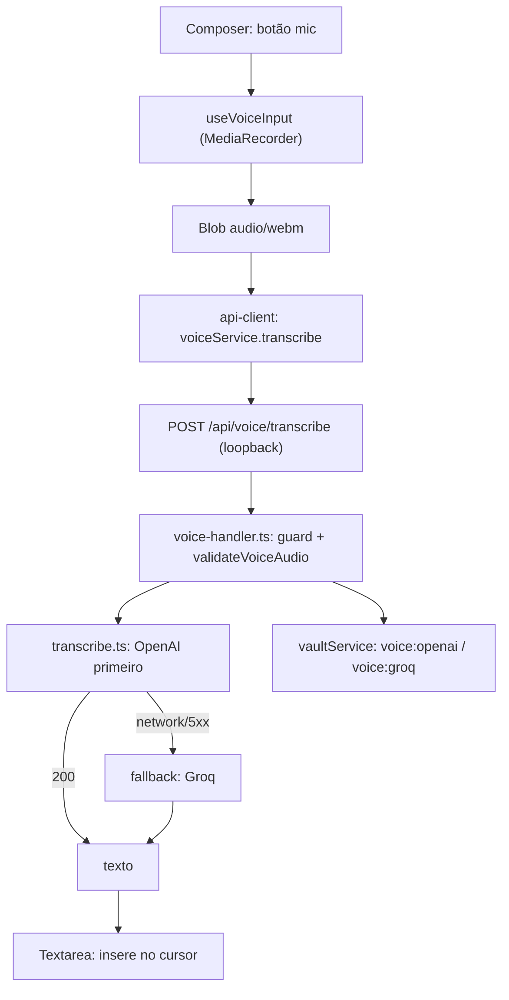

# Spec Técnica: F27. Ditado por Voz (STT)

**Escopo:** PRD sem blocos Central/Completo — feature inteira (§5 Consome, §6 Capacidades/Experiência/Tratamento de Erros, §9 ACs + cross-feature com F16).

## 1. Visão Geral Técnica

**O quê:** Botão de microfone no composer do Workspace grava áudio do usuário, envia para transcrição via provider externo (OpenAI Whisper, com fallback automático para Groq) e insere o texto transcrito no textarea como rascunho editável — nunca dispara envio automático.

**Por quê:** O composer (F16) só aceita texto digitado ou colado. Ditado reduz fricção de entrada sem abrir mão da revisão humana antes de enviar (mesmo princípio de F21 AskUserQuestion: a IA nunca age sem confirmação explícita do usuário nesse ponto).

**Escopo:**
- **Incluído:** captura de áudio no renderer (`MediaRecorder`, API de browser padrão), upload para endpoint loopback dedicado, transcrição server-side via OpenAI Whisper com fallback para Groq, inserção no cursor do textarea, card de configuração das duas keys, estados de erro/permissão do PRD §6.
- **Excluído:** TTS (PRD §7); STT local do SO (PRD menciona como alternativa, mas sem CLI/binário local disponível no ambiente — adiado, ver Assumptions 3.3); comandos de voz / controle por voz além de ditado; qualquer providers de voz além de OpenAI/Groq.

`docs/F27-ditado-por-voz/ui.md` e `docs/F27-ditado-por-voz/copy.md` já existem (fonte LionCodeLabs, adaptados) e são a fonte de verdade de anatomia, estados visuais e strings literais — esta spec cita ids de copy (`voice.*`) e não redescreve layout/tokens.

## 2. Impacto na Arquitetura

**Componentes afetados:**
- `src/services/voice/voice-audio.ts` (novo) — validação de payload de áudio
- `src/services/voice/transcribe.ts` (novo) — orquestra OpenAI→Groq com fallback
- `src/services/http/voice-handler.ts` (novo) — `POST /api/voice/transcribe`
- `src/services/http/config-handler.ts` (modificado) — `POST /api/config/voice/keys/save` + `computeConfigStatus()` ganha campo `voice`
- `src/services/http/unlock-handler.ts` (modificado) — roteia prefixo `/api/voice/`
- `src/main/index.ts` (modificado) — `session.setPermissionRequestHandler` para `'media'`
- `src/renderer/hooks/useVoiceInput.ts` (novo) — state machine de gravação/transcrição
- `src/renderer/components/workspace/voiceInput.logic.ts` (novo) — regras puras (título do mic por estado, inserção no cursor, mapeamento de erro)
- `src/renderer/components/workspace/TaskComposer.tsx` (modificado) — monta botão mic antes do clipe de imagens
- `src/renderer/screens/ConfiguracaoScreen.tsx` (modificado) — card "Ditado por voz (transcrição)"
- `src/renderer/services/api-client.ts` (modificado) — nova função de serviço para `voice/transcribe` + `voice/keys/save`



## 3. Decisões Técnicas

### 3.1 Herdadas do codebase

Sem brief de Modo Lote (feature single). Padrões observados no repo e seguidos sem desvio:
- Vault: `vaultService.getSecret`/`setSecret` por namespace de string (`docs/F01-vault-e-sessao-local/spec.md`)
- HTTP loopback: `guard()` de `_transport.ts` (423 `vault_locked` antes de 401 `unauthorized`) em todo handler novo
- Roteamento por prefixo em `unlock-handler.ts` — todo prefixo novo precisa de linha própria (lição do bug real de F25: rota nova nunca chegava ao handler porque o roteador de nível superior não a listava)
- Payload binário grande via JSON base64, não multipart bruto — mesmo padrão de `composer-images.ts` (F16), que já sobe imagens de até 4 MiB assim sob o `MAX_BODY_BYTES` de 32 MiB de `_transport.ts`
- Driver HTTP a provider externo com key do vault, nunca exposta ao renderer — mesmo padrão de `glm-driver.ts`/`grok-driver.ts` (`ProviderError` tipado, distinção `provider_auth_error` vs `provider_network_error`)
- Regra de negócio extraída para `*.logic.ts` puro e testável, hook cuida só de efeito colateral — mesmo padrão de `askUserQuestion.logic.ts`/`composer.logic.ts`

### 3.2 Específicas da feature

| Decisão | Abordagem Escolhida | Alternativa Considerada | Trade-off |
|---------|---------------------|--------------------------|-----------|
| Onde roda a chamada HTTP ao provider STT | Server-side (loopback), renderer só sobe o áudio | Renderer chama OpenAI/Groq direto | Direto exporia a key fora do vault/main — quebra o invariante já estabelecido para todo provider (F09/F10/F23) |
| Namespace de key no vault | `voice:openai` / `voice:groq` | Reusar `keys:openai`/`keys:groq` | `keys:*` hoje sempre significa "provider de turno" (`ThreadProvider`); reusar colidiria semanticamente se um provider de chat OpenAI real for adicionado depois |
| Endpoint de salvar as keys | `POST /api/config/voice/keys/save` dedicado | Estender `handleKeysSave` existente | `handleKeysSave` é 1:1 com namespace `keys:*`; misturar namespace `voice:*` ali quebraria essa correspondência |
| Transporte do áudio | JSON `{ audioBase64, mimeType }`, mesmo padrão de imagens do F16 | `multipart/form-data` bruto no loopback | `_transport.ts` (`readBody`) já assume corpo texto/JSON; multipart bruto exigiria um segundo caminho de parsing binário no transport compartilhado só para esta feature |
| Ordem/fallback entre providers | OpenAI primeiro; fallback pro Groq só em erro de rede/5xx; erro de auth (401/403) não faz fallback | Usuário escolhe explicitamente o provider | Fallback automático cobre o caso comum (uma key indisponível/instável) sem exigir configuração extra na UI; erro de auth é sinal de key errada, não de instabilidade — fallback esconderia o problema real |
| Modelos/endpoints default | OpenAI `whisper-1` em `/v1/audio/transcriptions`; Groq `whisper-large-v3-turbo` em `/openai/v1/audio/transcriptions` (compat OpenAI) | — | Ambos documentados publicamente; mesma ressalva de confiança já aplicada a `glm-driver.ts`/`grok-driver.ts` (endpoint não confirmado contra conta real nesta spec) |
| Limite de gravação | 120s (auto-stop + transcreve), `audio/webm;codecs=opus`, sem cap de tamanho separado | Sem limite de duração | 120s de opus fica bem abaixo do limite de 25 MB da OpenAI; protege contra gravação esquecida ligada |
| Permissão de microfone no Electron | `session.setPermissionRequestHandler` liberando `'media'` só pra origem da janela principal do próprio app | Não tratar (deixar Electron negar por padrão) | Electron nega `getUserMedia` por padrão em app empacotado sem handler explícito — sem isso o botão nunca funcionaria fora de dev |
| Status de key pro composer | Estender `GET /api/config/status` com campo `voice: {openai, groq}` | Novo `GET /api/config/voice/status` dedicado | Composer já teria que fazer uma segunda chamada de status só pra isso; reusar o endpoint existente é consistente com como `keys`/`providers` já alimentam disponibilidade hoje |
| Card de configuração | Save único em lote (2 campos, 1 CTA "Salvar chaves"), sem "Testar conexão" | `ProviderKeyTestCard` com teste por provider (padrão F23) | Nem PRD nem `ui.md` pedem teste de conexão pro STT — o card documentado tem só "Salvar chaves"/"Salvando..."/sucesso; adicionar teste seria escopo não pedido |

### 3.3 Assumptions

| Assumption | Origem | Pode sobrescrever? |
|------------|--------|---------------------|
| STT local do SO fora de escopo desta spec | Entrevista (pergunta 8) — PRD menciona como alternativa, `ui.md` já sinalizava lacuna TODO | sim |
| Texto de erro final unificado em `voice.error.transcribe` = "Não foi possível transcrever. Tente novamente." (literal do PRD §6), descartando a variante do hook fonte | Entrevista (pergunta 9) | sim |
| Inserção do texto transcrito na posição do cursor do textarea (não sempre no fim) | Entrevista (pergunta 10) | sim |
| Endpoints/modelos OpenAI/Groq não confirmados contra conta real nesta spec (mesma ressalva já registrada em F23) | Pesquisa pública, sem credencial disponível nesta sessão | sim |
| `ui.md`/`copy.md` já existem — usados como fonte de verdade sem alteração; só as duas lacunas próprias deles (STT local, unificação de string) foram resolvidas acima | `docs/F27-ditado-por-voz/{ui,copy}.md` | sim |

## 4. Visão Geral de Componentes

**Backend:**

| Caminho do Arquivo | Novo/Modificado | Propósito | Responsabilidades-Chave |
|---------------------|------------------|-----------|--------------------------|
| `src/services/voice/voice-audio.ts` | Novo | Validação de payload de áudio | MIME allowlist, estimativa de tamanho a partir do base64 (mesmo cálculo de `composer-images.ts`), sem decodificar o buffer inteiro pra validar |
| `src/services/voice/transcribe.ts` | Novo | Cliente STT com fallback | Chama OpenAI; em erro de rede/5xx com Groq key presente, tenta Groq; erro de auth nunca faz fallback; erro tipado (`VoiceTranscribeError`) |
| `src/services/voice/transcribe.test.ts` | Novo | Cobertura do orquestrador | Casos de sucesso/fallback/erro (ver §7.1) |
| `src/services/http/voice-handler.ts` | Novo | `POST /api/voice/transcribe` | `guard()`, decodifica base64, valida áudio, chama `transcribe.ts`, mapeia erros |
| `src/services/http/config-handler.ts` | Modificado | Save de keys STT + status | `handleVoiceKeysSave` (namespace `voice:*`); `ConfigStatus.voice = {openai, groq}` em `computeConfigStatus()` |
| `src/services/http/unlock-handler.ts` | Modificado | Roteamento | Nova linha `req.url?.startsWith('/api/voice/')` → `handleVoiceRequest` (mesmo guard 423/401 herdado de dentro do handler, não do roteador) |
| `src/main/index.ts` | Modificado | Permissão de mídia | `session.defaultSession.setPermissionRequestHandler` liberando `'media'` só quando `webContents === mainWindow.webContents` |

**Frontend:**

| Caminho do Arquivo | Novo/Modificado | Propósito | Responsabilidades-Chave |
|---------------------|------------------|-----------|--------------------------|
| `src/renderer/components/workspace/voiceInput.logic.ts` | Novo | Regras puras | `resolveMicTitle(state, keyReady, errorMessage)` (tabela de estados do `ui.md`), `insertAtCursor(value, selectionStart, selectionEnd, insertText)`, `mapTranscribeErrorCode(code)` → id de copy |
| `src/renderer/components/workspace/voiceInput.logic.test.ts` | Novo | Cobertura das regras puras | Ver §7.1 |
| `src/renderer/hooks/useVoiceInput.ts` | Novo | State machine + efeitos | Ciclo `MediaRecorder` (start/stop/cancel), timer de gravação, listener global de `Esc`, chama `voiceService.transcribe`, delega texto/decisões a `voiceInput.logic.ts` |
| `src/renderer/components/workspace/TaskComposer.tsx` | Modificado | Monta o botão mic | Insere mic antes de `ComposerImageAttachments` (anatomia `ui.md` §A); passa `state`/`title`/`onClick` do hook |
| `src/renderer/screens/ConfiguracaoScreen.tsx` | Modificado | Card STT | Novo componente local `VoiceKeysCard` (padrão `KeysCard`: 2 campos, 1 CTA "Salvar chaves", sem teste de conexão) |
| `src/renderer/screens/configuracaoScreen.logic.ts` | Modificado (se aplicável) | Validação client-side dos campos | Mesmo nível de `baseChecks` de `provider-keys.ts` (não vazio ao editar) — sem chamada de rede |
| `src/renderer/services/api-client.ts` | Modificado | Serviço HTTP | `voiceService.transcribe(audioBase64, mimeType)`, `voiceService.saveKeys({openai?, groq?})` |

Sem migração SQLite — nenhuma tabela nova; keys vivem só no vault, texto transcrito nunca é persistido (só passa pelo textarea do composer).

## 5. Contratos de API

### Endpoint: Salvar keys de transcrição

- **Método:** POST
- **Caminho:** `/api/config/voice/keys/save`
- **Autenticação:** `guard()` — 423 `vault_locked`, 401 `unauthorized`

**Requisição:**

| Campo | Tipo | Obrigatório | Validação | Descrição |
|-------|------|--------------|-----------|-----------|
| `openai` | `string` | Não | mesmo `baseChecks` de `provider-keys.ts` (vazio = não altera); sem prefixo obrigatório (OpenAI não documenta um estável) | Key OpenAI |
| `groq` | `string` | Não | idem; sem prefixo obrigatório | Key Groq |

**Exemplo de Requisição:**
```json
{ "openai": "sk-proj-...", "groq": "" }
```

**Resposta (Sucesso — 200):**

| Campo | Tipo | Descrição |
|-------|------|-----------|
| `saved` | `boolean` | Sempre `true` em sucesso |
| `voice.openai` | `boolean` | Key OpenAI presente após o save |
| `voice.groq` | `boolean` | Key Groq presente após o save |
| `message` | `string` | `voice.config.success` |

**Exemplo de Resposta:**
```json
{ "saved": true, "voice": { "openai": true, "groq": false }, "message": "Chaves de transcrição salvas no cofre." }
```

**Códigos de Erro:**

| Código | Status HTTP | Descrição |
|--------|-------------|-----------|
| `vault_locked` | 423 | Cofre travado |
| `unauthorized` | 401 | Sessão inválida |
| `invalid_request` | 400 | Corpo malformado ou campo com tipo errado |
| `validation_error` | 400 | Campo com espaço em branco ou curto demais (mesmo `baseChecks`) |

### Endpoint: Transcrever áudio

- **Método:** POST
- **Caminho:** `/api/voice/transcribe`
- **Autenticação:** `guard()` — 423 `vault_locked`, 401 `unauthorized`

**Requisição:**

| Campo | Tipo | Obrigatório | Validação | Descrição |
|-------|------|--------------|-----------|-----------|
| `audioBase64` | `string` | Sim | não vazio; ≤ 8 MiB decodificado (`estimateBase64ByteLength`, mesmo cálculo de `composer-images.ts`) | Áudio gravado, base64 |
| `mimeType` | `string` | Sim | `audio/webm` \| `audio/webm;codecs=opus` | MIME do blob gravado |

**Exemplo de Requisição:**
```json
{ "audioBase64": "GkXfo...", "mimeType": "audio/webm;codecs=opus" }
```

**Resposta (Sucesso — 200):**

| Campo | Tipo | Descrição |
|-------|------|-----------|
| `text` | `string` | Texto transcrito |
| `provider` | `string` | `"openai"` \| `"groq"` — qual respondeu (indica se houve fallback) |

**Exemplo de Resposta:**
```json
{ "text": "adicionar validação no formulário de login", "provider": "openai" }
```

**Códigos de Erro:**

| Código | Status HTTP | Descrição |
|--------|-------------|-----------|
| `vault_locked` | 423 | Cofre travado |
| `unauthorized` | 401 | Sessão inválida |
| `invalid_request` | 400 | Corpo malformado ou campos ausentes/tipo errado |
| `audio_type_invalid` | 400 | MIME fora da allowlist |
| `audio_too_large` | 400 | Acima de 8 MiB decodificado |
| `audio_empty` | 400 | `audioBase64` vazio |
| `voice_key_missing` | 400 | Nem `voice:openai` nem `voice:groq` configuradas |
| `voice_auth_error` | 401 | Provider tentado rejeitou a key (sem fallback) |
| `voice_upstream_error` | 502 | Ambos providers falharam (ou único configurado falhou) por erro de rede/5xx |

## 6. Modelo de Dados

Sem tabela nova. Keys vivem no vault existente (`vaultService`) sob os namespaces `voice:openai` / `voice:groq` — mesmo mecanismo de `keys:claude`/`keys:glm`/etc., sem schema adicional. Texto transcrito não é persistido: sai do endpoint e vai direto pro estado do textarea no renderer.

## 7. Estratégia de Testes

### 7.1 Unitário / Integração

| Arquivo de Teste | Tipo | Alvo |
|-------------------|------|------|
| `src/services/voice/voice-audio.test.ts` | Unitário | MIME allowlist, estimativa de tamanho, vazio |
| `src/services/voice/transcribe.test.ts` | Unitário | fallback OpenAI→Groq, auth sem fallback, ambos ausentes |
| `src/services/http/voice-handler.test.ts` | Integração | guard 423/401, validação de payload, mapeamento de erro end-to-end |
| `src/services/http/config-handler.test.ts` (extensão) | Integração | save de keys STT, `computeConfigStatus().voice` |
| `src/services/http/unlock-handler.test.ts` (extensão) | Integração | regressão: `/api/voice/*` chega no handler certo com vault travado → 423 (não 404) |
| `src/renderer/components/workspace/voiceInput.logic.test.ts` | Unitário | título do mic por estado, inserção no cursor, mapeamento de erro→id de copy |

| Função de Teste | Assertions |
|-------------------|------------|
| `audio_rejects_type_outside_allowlist` | `audio_type_invalid` pra MIME fora de `audio/webm`/`audio/webm;codecs=opus` |
| `audio_rejects_over_8mib` | `audio_too_large` sem decodificar o buffer inteiro |
| `audio_rejects_empty_base64` | `audio_empty` |
| `transcribe_openai_success` | retorna texto + `provider:"openai"`, nenhuma chamada ao Groq |
| `transcribe_openai_network_error_falls_back_groq` | Groq chamado, retorna `provider:"groq"` |
| `transcribe_openai_auth_error_no_fallback` | `voice_auth_error`, Groq nunca chamado mesmo com key presente |
| `transcribe_no_key_configured` | `voice_key_missing` sem nenhuma chamada de rede |
| `transcribe_only_groq_configured_skips_openai` | chama Groq direto, sem tentativa OpenAI prévia |
| `voice_handler_guard_vault_locked` | 423 antes de checar token de sessão (mesma ordem do guard já usada em toda rota) |
| `voice_handler_maps_transcribe_error_to_502` | `voice_upstream_error` quando ambos falham |
| `config_handler_saves_voice_keys_partial` | salvar só `openai` não apaga `groq` já salvo (merge, mesmo comportamento de `handleKeysSave`) |
| `unlock_handler_forwards_voice_prefix_when_locked` | `/api/voice/transcribe` com vault travado devolve 423 (regressão do bug real de roteamento do F25) |
| `resolve_mic_title_matches_ui_states` | cada estado da tabela de `ui.md` (`idle`, `configLoading`, `!keyReady`, `recording`, `transcribing`, `error`) mapeia pro título exato do `copy.md` |
| `insert_at_cursor_preserves_surrounding_text` | inserção no meio de um texto existente não sobrescreve o resto |

### 7.2 Smoke / Aceitação manual

| # | Passo | Resultado esperado |
|---|-------|---------------------|
| 1 | Sem key OpenAI/Groq salva, abrir Workspace | Mic disabled, `title` = `voice.title.noKey` |
| 2 | Salvar key OpenAI válida em `#configuracao` (card Ditado por voz) | Mic habilita sem precisar recarregar a tela |
| 3 | Clicar mic → permitir microfone do SO → falar → clicar de novo pra parar | Timer conta durante gravação; spinner durante transcrição; texto aparece no textarea na posição do cursor; nada é enviado sozinho |
| 4 | Gravando, apertar `Esc` | Gravação cancela sem chamar o endpoint de transcrição; nenhum texto inserido |
| 5 | Key OpenAI inválida salva (provider devolve 401) | Alert vermelho com `voice.error.transcribe` ("Não foi possível transcrever. Tente novamente."); áudio gravado não se perde — clicar mic de novo permite nova tentativa |
| 6 | Permissão de microfone do SO negada no primeiro clique | `voice.error.permissionDenied`; CTA reflete estado `error` |
| 7 | Light/dark do botão mic (composer) e do card STT (Configuração) | Bate com `docs/F27-ditado-por-voz/ui/{composer-mic-referencia,config-stt-keys-referencia}.png`; tokens do Design Lock, sem hex solto, sem Lion* |

### 7.3 Cross-feature

| Critério | Status | Nota |
|----------|--------|------|
| Transcrição insere no mesmo campo do composer consumido por F16 | ready | AC PRD §9 — F16 já implementado |
| Tokens de superfície do composer (F01.1) | ready | Já implementado |
| Composer/thread ativa (F03) | ready | Já implementado |
| STT local do SO (PRD menciona como alternativa) | deferred | Ver Assumptions 3.3 — sem CLI local disponível |
