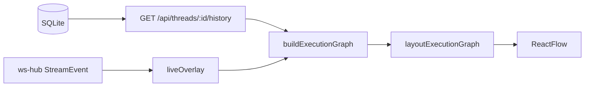

# F29. Monitor de execução (grafo) — Especificação Técnica

**Feature:** F29 Monitor de execução  
**Complexidade:** médio  
**Escopo:** aba Grafo no workspace (`#principal`) para a thread selecionada  
**UI:** `ui.md` / `copy.md` desta pasta  
**Última atualização:** 2026-08-11

---

## 1. Visão Geral Técnica

**O quê:** Projetar a execução da thread selecionada (agente principal, subagents delegados, batches paralelos F18 e estágios de pipeline F22) como grafo interativo com React Flow (`@xyflow/react`), alimentado pelo histórico HTTP existente e pelos eventos WebSocket já tipados.

**Por quê:** A timeline do chat e o card de Subagents mostram eventos em lista; o usuário precisa de uma projeção espacial pai→filho para acompanhar delegações e pipelines em curso.

**Princípio:** React Flow é **projeção**, nunca fonte de verdade. Estado real continua em `subagent_runs`, `tool_calls`, `pipelines`/`pipeline_stages` (SQLite) + WS.

**Escopo — Incluído:**

- Dependência `@xyflow/react` (v12); layout em camadas como função pura (sem ELK.js)
- Funções puras `buildExecutionGraph` / `applyLiveEvent` / `layoutExecutionGraph` com testes Vitest
- Aba `graph` no centro do workspace (irmão de history/diff), lazy-loaded
- Nós customizados (root / subagent / stage / batch) e arestas animadas SVG
- Inspector ao clicar na aresta
- Popular `pipeline_stages.subagent_run_id` em `runStage` (gap herdado de F22)

**Escopo — Excluído:**

- ELK.js, Zustand, Framer Motion
- Streaming de `tool_call.*` do filho no WS do pai (próximo passo; nó-folha mostra `actionCount`, não o detalhe interno)
- Grafo global multi-thread / dashboard
- Edição do grafo pelo usuário (só observação)

**Consome:** F03 (workspace/WS/history), F15 (subagent_runs + correlação), F18 (`parallelBatchId`), F22 (pipeline/stages).  
**Provê:** aba Grafo + projeção live da execução da thread.

---

## 2. Impacto na Arquitetura

| Área | Caminhos | Papel |
|------|----------|-------|
| Lógica pura | `src/renderer/components/workspace/graph/executionGraph.logic.ts` | Modelo + layout + overlay |
| UI grafo | `…/graph/{ExecutionGraphPanel,AgentNode,MessageEdge,MessageInspector}.tsx` | React Flow + tokens |
| Workspace | `usePrincipalWorkspace.ts`, `PrincipalScreen.tsx` | `ThreadTab`, overlay live, container sem scroll |
| CSS | `src/renderer/index.css` | `@import '@xyflow/react/dist/style.css'` |
| Pipeline | `pipeline-runner.ts`, `delegate.ts` | `childThreadId` no result → `subagent_run_id` |
| WS mirror | `ws-client.ts` | tipar `parallelBatchId` em `subagent.*` (já no server) |

---

## 3. Decisões Técnicas

1. **Nós = agentes, não tools.** Tool calls comuns viram contador no nó root; `call_subagent` vira aresta + nó filho.
2. **Profundidade máx. 2** (filho sem `--mcp-config`). Layout em camadas horizontais basta.
3. **Overlay otimista** em `subagent.start` (mesmo espírito das bolhas otimistas): o nó aparece antes do refetch de history assentar.
4. **Lazy + Suspense** no painel para o workspace não pagar o bundle do React Flow em quem nunca abre a aba.
5. **Animação SVG nativa** (`animateMotion`) com respeito a `prefers-reduced-motion`.
6. **`DelegationResult.childThreadId`** opcional: quando o run foi criado, o pipeline-runner grava em `pipeline_stages.subagent_run_id`.

---

## 4. Modelo de dados (projeção)

### ExecutionNode

| kind | id | Campos principais |
|------|----|-------------------|
| `root` | `root:{threadId}` | label (provider/model), state, toolCount, elapsedMs |
| `subagent` | `subagent:{childThreadId}` | name, status, actionCount, durationMs, parallelBatchId |
| `stage` | `stage:{pipelineStage.id}` | stageId, subagentName, status, subagentRunId |
| `batch` | `batch:{parallelBatchId}` | childCount, status agregado |

### ExecutionEdge

`id`, `source`, `target`, `kind` (`delegate` | `stage` | `batch-member` | `return`), `label` (task), `status`, `startedAt`, `endedAt`, `task`, `returnText`.

Correlação `root → subagent`: reutilizar `correlateSubagentRuns` (F15). Pipeline: `root → stage → subagent` quando `subagentRunId` presente; senão só `root → stage`.

---

## 5. Eventos live (`applyLiveEvent`)

| Evento | Efeito no overlay |
|--------|-------------------|
| `subagent.start` | Upsert nó subagent `running` (+ batch se `parallelBatchId`) |
| `subagent.result` | Atualiza status/duração; marca aresta de retorno |
| `pipeline.state` / `pipeline.stage` | Upsert nós stage; status conforme `phase` |
| `tool_call.start` / `result` | Incrementa contador de tools no root (não cria nó) |
| `state.change` | Atualiza state do root |

History refetch continua a ser a fonte canónica; overlay só cobre o gap até o refetch.

---

## 6. Critérios de aceitação

1. Com thread selecionada, aba **Grafo** renderiza nó root; com ≥1 `subagent_runs`, mostra filho(s) e aresta(s).
2. Durante `subagent.start`, o nó filho aparece sem refresh manual (overlay ou refetch).
3. Pipeline com stages popula nós stage; após fix, `subagent_run_id` liga stage→run.
4. Clique na aresta abre inspector (from/to, horário, duração, status, task, retorno).
5. Light/dark via `useTheme().resolvedTheme` + tokens do Design Lock; sem hex solto.
6. `tsc -b` e `pnpm test` verdes; smoke E2E com screenshots em `smoke/`.

---

## 7. Próximo passo (fora de escopo)

Emitir `tool_call.start`/`tool_call.result` do filho no WS do pai (a partir de `delegate.ts`) para o nó-folha exibir atividade interna além de `actionCount`.
