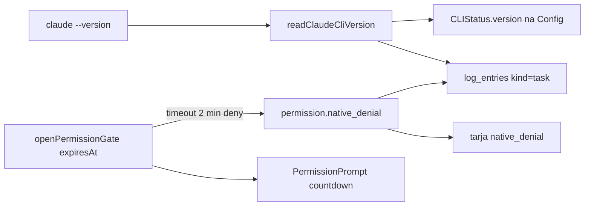

# F30. Avisos de runtime e permissão — Especificação Técnica

**Feature:** F30 Avisos de runtime e permissão  
**Complexidade:** simples  
**Escopo:** relocação do aviso de versão do Claude CLI + copy de produto no expiry do card  
**UI:** `ui.md` / `copy.md` desta pasta (deltas). Card e chips: `docs/F03-workspace/{ui,copy}.md`. Row CLI: `docs/F02-configuracao-mvp/ui.md`.  
**Última atualização:** 2026-08-18

---

## 1. Visão Geral Técnica

**O quê:** Duas superfícies que hoje misturam diagnóstico de engenharia com copy de produto. (1) O aviso D3 de versão do Claude CLI sai da tarja âmbar do chat e passa a uma caption na row Claude de `#configuracao`, com o texto longo só em `log_entries`. (2) O expiry do gate de permissão deixa de despejar um parágrafo técnico (“negou por segurança”, faixa 2.1.x) e passa a copy curta + relógio no card, enquanto o fail-closed de 2 minutos no broker permanece.

**Por quê:** A tarja do workspace é lida como falha do turno. Versão acima da faixa validada não é falha de turno (o spawn não bloqueia). O timeout do hook existe porque o EngrenaCode responde o `PreToolUse` de um CLI spawnado; Claude Code e Cursor esperam o humano sem relógio, mas aqui o processo trava se o broker não responder. O usuário precisa ver o card e um relógio, não uma aula de contrato.

**Escopo — Incluído:**

- Parar de appendar `cli.version_notice` em `mcpNotices` (e deixar de emitir o evento no WS se o único consumidor era a tarja)
- Manter `claudeCliVersionLogLine` em `log_entries` (F08 / work log)
- Caption de versão na row Claude de `#configuracao` após probe / cache quente, sem spawn em `GET /api/config/status`
- Reescrever `nativeDenialMessage` com os ids de `copy.md` (casos de produto curtos; `decisionReason*` só no log)
- Countdown no `PermissionPrompt` a partir de `gate.expiresAt` (já no wire)
- Frase `denial.never.cliCause` só quando `never-brokered` **e** a leitura de versão está fora da faixa / ilegível

**Escopo — Excluído:**

- Alterar `PERMISSION_TIMEOUT_MS` (continua `2 * 60 * 1000`)
- Classificador Auto-review / modo `auto` nativo do Claude Code / sandbox de Bash
- Tela Sobre, banner persistente global, settings nova
- Revalidar a faixa `PERMISSION_CONTRACT_*` contra 2.1.234 (é trabalho de contrato, não desta feature)
- Mudar chips: concessão no clique já é contrato F03

**Consome:** F01.1 (tokens), F02 (`#configuracao` / probe CLI), F03 (workspace, gate, tarja, `PermissionPrompt`), F08 (`log_entries`).  
**Provê:** diagnóstico de versão no lugar certo; copy de permissão expirada como evento de produto.

---

## 2. Impacto na Arquitetura

Nenhuma camada nova. O broker, o gate e `assertPermissionContract` não mudam de política.

| Área | Caminhos | Papel |
|------|----------|-------|
| Copy pura | `src/renderer/hooks/streamNotices.logic.ts` | `nativeDenialMessage`; `cliVersionNotice` deixa de alimentar a tarja |
| WS / runner | `claude-version-notice.ts`, `ws-hub.ts`, `dispatch.ts` | log permanece; emit para o chat some |
| Workspace | `usePrincipalWorkspace.ts`, `PrincipalScreen.tsx` | não appendar `cli_version` |
| Card | `PermissionPrompt.tsx` | countdown de `expiresAt` |
| Config | `config-handler.ts` (probe full), `configuracao-service.ts`, `ConfiguracaoScreen.tsx` | `CLIStatus.version?` só Claude |
| Contrato | `permission-contract.ts` | `checkClaudeCliVersion` reusado; sem mudança de MIN/MAX |
| Negação | `dispatch.ts` / payload `permission.native_denial` | campo opcional `cliVersionStatus` para `denial.never.cliCause` |



---

## 3. Decisões Técnicas

### 3.1 Herdadas

Padrões do app: `*.logic.ts` testável, copy em PT-BR, guard HTTP inalterado, `tsc -b` como gate de tipos, tarja com teto 20, gate fail-closed no broker. UI/copy desta feature: `ui.md` / `copy.md` desta pasta.

### 3.2 Específicas da feature

| Decisão | Abordagem escolhida | Alternativa | Trade-off |
|---------|---------------------|-------------|-----------|
| Onde a versão aparece | Caption na row Claude de `#configuracao` + log | Tarja do chat; tela Sobre | Quem investiga abre Config ou Registros. Quem só conversa não é interrompido. |
| Emit WS `cli.version_notice` | Parar o emit. Só log. | Emitir e filtrar no renderer | Evita evento morto e regressão se alguém re-appendar. |
| `GET /api/config/status` | Continua PATH-only. Versão entra no probe “Testar conexões” (`detectCLIFull` / resultado do test) e, se o cache de `readClaudeCliVersion` já estiver resolvido, pode ser copiada no status **sem spawn novo**. | Spawn `--version` em todo GET status | GET status alimenta Dashboard; 5 s extra no boot da tela seria regressão. |
| Timeout do gate | Manter 2 min | Esperar para sempre (Claude Code TUI) | O hook do CLI spawnado não pode ficar aberto; o relógio torna o teto visível. |
| Countdown | Cliente deriva de `expiresAt` (já no `permission.request`) | Servidor emitir ticks | Zero evento novo. Drift de relógio de poucos segundos é aceitável. |
| Copy de `decisionReason` na tarja | Fora. Só log. | Manter na tarja | A tarja vira produto; stderr/hook message continua auditável em F08. |
| Causa de versão no never-brokered | Uma frase `denial.never.cliCause` se a leitura estiver fora da faixa | Sempre citar 2.1.226–2.1.231 | Só fala de versão quando a permissão **já quebrou**. |

### 3.3 Assumptions

| Assumption | Origem | Pode sobrescrever? |
|------------|--------|--------------------|
| Concessão no clique do chip já está no working tree / F03 copy.md; F30 não reabre esse contrato | codebase + F03 | não (fora de escopo) |
| Faixa validada continua 2.1.226–2.1.231 até outro trabalho revalidar | `permission-contract.ts` | sim, feature de contrato |
| Codex/Kimi não mostram versão nesta feature | entrevista desta spec | sim |
| Não há tela Sobre; Configuração é o diagnóstico de runtime do usuário | F02 existente | sim |

---

## 4. Visão Geral de Componentes

**Frontend**

| Caminho | Novo/Modificado | Propósito |
|---------|-----------------|-----------|
| `apps/engrena-code/src/renderer/hooks/streamNotices.logic.ts` | Modificado | `nativeDenialMessage` lê ids de produto; `cliVersionNotice` / kind `cli_version` saem do caminho da tarja (função pode permanecer só se algum teste de log do renderer ainda a usar; senão apagar o branch morto) |
| `apps/engrena-code/src/renderer/hooks/streamNotices.logic.test.ts` | Modificado | Asserts nas frases de `copy.md`; teto da lista sem `cli_version`; never-brokered + `cliVersionStatus` |
| `apps/engrena-code/src/renderer/hooks/usePrincipalWorkspace.ts` | Modificado | Remover o branch `event.type === 'cli.version_notice'` |
| `apps/engrena-code/src/renderer/components/workspace/PermissionPrompt.tsx` | Modificado | Slot countdown; tick 1 s via `expiresAt` |
| `apps/engrena-code/src/renderer/screens/ConfiguracaoScreen.tsx` | Modificado | Caption de versão na `CliRow` Claude |
| `apps/engrena-code/src/renderer/services/configuracao-service.ts` | Modificado | `CLIStatusData.version?: string` e opcional `versionStatus?: 'in-range' \| 'below-min' \| 'above-max' \| 'unparseable'` |

**Backend**

| Caminho | Novo/Modificado | Propósito |
|---------|-----------------|-----------|
| `apps/engrena-code/src/services/runner/claude-version-notice.ts` | Modificado | Log sim, emit WS não |
| `apps/engrena-code/src/services/runner/claude-version-notice.test.ts` | Modificado | Assert “não emitiu”; log continua |
| `apps/engrena-code/src/services/http/config-handler.ts` | Modificado | `detectCLIFull('claude')` preenche versão via `readClaudeCliVersion` + `checkClaudeCliVersion` |
| `apps/engrena-code/src/services/http/config-handler.test.ts` | Modificado | Probe Claude devolve `version` |
| `apps/engrena-code/src/services/runner/dispatch.ts` | Modificado | Em `permission.native_denial`, anexar `cliVersionStatus` quando o cache já tiver leitura (não esperar o binário) |
| `apps/engrena-code/src/services/runner/ws-hub.ts` | Modificado | `cli.version_notice` pode permanecer no union (compat) ou sair se nenhum emit restar; native_denial ganha `cliVersionStatus?` |

**Sem migração SQLite. Sem rota HTTP nova.** Extensão de campos opcionais em payloads já existentes.

---

## 5. Contratos de API

Não há endpoint novo. Campos opcionais:

**`CLIStatus` / `CLIStatusData` (Claude only)**

```json
{
  "installed": true,
  "loggedIn": true,
  "path": "C:\\Users\\Me\\AppData\\npm\\claude.cmd",
  "version": "2.1.234",
  "versionStatus": "above-max"
}
```

- `version` ausente: UI não mostra caption (PATH-only status, cache frio, ou Codex/Kimi).
- `versionStatus` só é enviado quando `version` veio de `checkClaudeCliVersion`. `in-range` omite a segunda caption.

**`permission.native_denial` (delta)**

```json
{
  "type": "permission.native_denial",
  "toolName": "Bash",
  "code": "permission_native_denial",
  "brokerOutcome": "expired",
  "cliVersionStatus": "above-max"
}
```

`cliVersionStatus` omitido quando in-range, cache frio ou `unavailable`. Só `nativeDenialMessage` usa no caso `never-brokered`.

---

## 6. Modelo de Dados

Sem schema novo. `thread_gates.expires_at` já existe. `log_entries` kind `task` já recebe a linha longa de versão.

---

## 7. Tratamento de Erros

| Situação | Comportamento |
|----------|----------------|
| `claude --version` timeout / ausente | Cache `unavailable`. Config: sem caption. Log D3 não grava (já hoje). Turno falha pelo spawn, não por esta feature. |
| Cache frio no instante da negação nativa | `cliVersionStatus` omitido; `denial.never.cliCause` não aparece. Não bloquear o deny. |
| Relógio do cliente atrasado | Countdown pode chegar a 0 um pouco antes/depois do closeGate. O card some pelo estado do gate, não pelo 0 local. |
| Probe de Config falha | Feedback F02 existente. Não inventar erro de versão. |

---

## 8. Requisitos / regras de negócio

1. Versão fora da faixa **nunca** bloqueia turno (já D3). F30 não reabre isso.
2. Tarja do chat ≠ diagnóstico de CLI. Diagnóstico de CLI = Config caption + log.
3. Expiry continua deny fail-closed no broker. Só a copy e a visibilidade do teto mudam.
4. `nativeDenialMessage` é a única função que monta a frase da tarja de negação (R08/R09: não duplicar a partição de casos). Os literais vêm dos ids de `copy.md`.
5. Motivo cru do CLI não vai para a tarja.

## 9. Fluxos de UX

Ver `ui.md`. Resumo:

1. Usuário abre o app instalado, manda um turno Claude com CLI 2.1.234: chat sem tarja de versão; work log tem a linha técnica.
2. Usuário abre `#configuracao` e testa CLIs: vê `2.1.234` e, se fora da faixa, “Ainda não conferida nesta versão.”
3. Bash pede permissão: card com relógio. Sem clique em 2 min: card some, tarja “A permissão de Bash expirou. Peça de novo ao agente.”
4. Negação nativa sem card (`never-brokered`) e CLI fora da faixa: tarja de produto + uma frase `denial.never.cliCause`.

---

## 10. Estratégia de Testes

### Unitário

- `streamNotices.logic.test.ts`
  - `nativeDenialMessage` `after-gate-expiry` contém `denial.expiry.lead` + `advice`; **não** contém “negou por segurança”, “faixa”, “2.1.226”.
  - `after-user-denial` / `after-turn-cancel` usam os ids curtos; não mandam revisar nível de acesso no expiry.
  - `never-brokered` + `cliVersionStatus: 'above-max'` acrescenta `denial.never.cliCause`; in-range ou ausente não acrescenta.
  - `decisionReason` / `decisionReasonType` **não** entram no `message` da tarja (passam a ser só log).
  - `appendWorkspaceNotice` ainda aplica teto; fixtures deixam de misturar `cli_version` como kind de UI (ou o kind é removido).
- `claude-version-notice.test.ts`: uma vez por processo grava log; **não** chama `emit` com `cli.version_notice`.
- `config-handler.test.ts`: `detectCLIFull` / POST test CLIs para Claude inclui `version` parseada quando o reader de teste devolve stdout `2.1.234 (Claude Code)`; `GET /api/config/status` **não** exige `version` (PATH-only).
- Countdown: extrair helper puro (`remainingLabel(expiresAt, now)` → `mm:ss` \| `null`) em `PermissionPrompt` ou `permissionCountdown.logic.ts` com testes de ≤15 s / zero / futuro.

### Integração

- `dispatch.test.ts`: native_denial `expired` segue `brokerOutcome: 'expired'`; campo `cliVersionStatus` opcional não quebra payload antigo.
- Cross-feature F08: a linha `claudeCliVersionLogLine` continua sendo gravada (teste já existente em `claude-version-notice.test.ts`).

### Smoke / aceitação manual

Fluxo feliz:

1. App instalado, Claude CLI acima da faixa. Primeiro turno: **sem** tarja de versão. Work log / `#registros` tem a linha técnica.
2. `#configuracao` → Testar conexões → row Claude mostra a versão mono.
3. Thread `supervised` ou `auto-accept-edits`, pedido Bash: card com relógio; Permitir no clique executa (regressão F03).

Erros:

1. Deixar o card sem resposta até expirar: tarja curta; agente segue; pedir de novo abre card novo.
2. CLI não instalado: Config sem caption de versão (row “não instalado”).
3. Light/dark nas três superfícies (tarja, card, caption Config).

Critérios de aceitação: PRD §9 F30.

Integração cross-feature PRD: tarja F03 + log F08 + Config F02.
