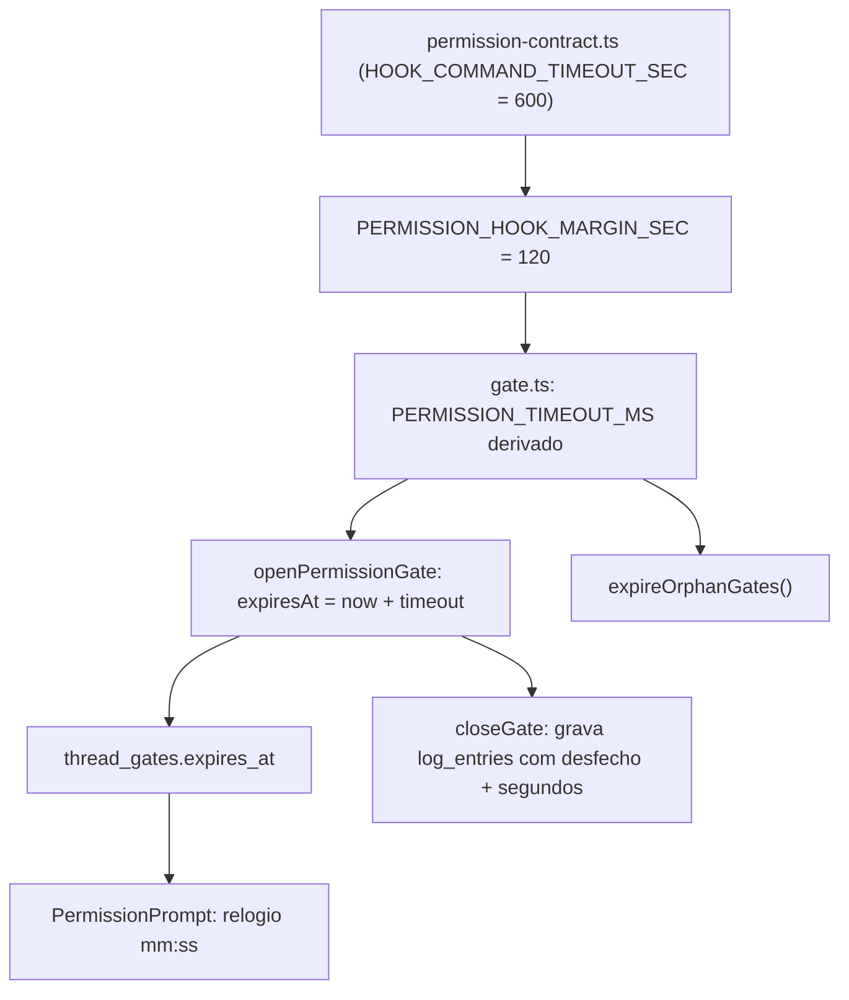

# Especificação Técnica: Prazo do pedido de permissão

**Complexidade:** simples

## 1. Visão Geral Técnica

**O quê:** trocar o literal `PERMISSION_TIMEOUT_MS = 2 * 60 * 1000` de `gate.ts` por um valor derivado do contrato do hook do Claude CLI, e instrumentar cada fechamento de gate com o tempo que ele ficou aberto.

**Por quê:** `HOOK_COMMAND_TIMEOUT_SEC = 600` (`providers/permission-contract.ts`) é o teto real: é quanto o CLI espera a resposta do hook `PreToolUse` antes de matar o processo. Nosso prazo é 120 s — cinco vezes mais apertado que a restrição, sem nada no código que ligue os dois números. O efeito medido: dos 4 gates da homologação de 2026-08-18, um expirou por `permission_timeout`, e a medição de 2026-08-19 (F31 §11.3) viu outro expirar num `cat`. A F30 pôs o relógio na tela, o que tornou o penhasco visível sem movê-lo.

**Escopo incluído:**
- Derivar o prazo do teto do hook, com margem explícita e nomeada
- Um único ponto de verdade lido por `closeGate` (expiry), `expireOrphanGates()` e pelo relógio do card
- Instrumentação: todo gate fechado grava `log_entries` com desfecho e segundos aberto
- Manter fail-closed intacto

**Escopo excluído (PRD §7):**
- Prazo configurável pelo usuário na UI — o valor deriva do contrato, não de preferência
- Notificação nativa do SO quando o card abre fora de foco (Adições ao Escopo Completo, adiado)
- Mudar o comportamento de provider sem hook (Codex, Kimi)

**UI:** `docs/F03-workspace/ui.md` e `docs/F03-workspace/copy.md` são a fonte de verdade da anatomia do card e das strings; o relógio `mm:ss` e a copy de expiry já foram especificados na F30 e não são redefinidos aqui. Esta feature muda **o número**, não a superfície.

## 2. Impacto na Arquitetura

| Componente | Caminho | Papel nesta feature |
|---|---|---|
| Contrato do hook | `src/services/runner/providers/permission-contract.ts` | Fonte do teto (`HOOK_COMMAND_TIMEOUT_SEC`) e nova casa da margem |
| Gate | `src/services/runner/gate.ts` | Passa a derivar `PERMISSION_TIMEOUT_MS`; grava o log no fechamento |
| Repositório de gates | `src/services/db/repositories/thread-gates.ts` | Fornece `createdAt`/`expiresAt` para calcular os segundos abertos |
| Card | `src/renderer/components/workspace/PermissionPrompt.tsx` + `permissionCountdown.logic.ts` | Já derivam de `expiresAt`; nada a mudar (verificação de não-regressão) |

## 3. Decisões Técnicas

### 3.1 Herdadas do brief / docs canônicos

`docs/_shared/codebase-patterns.md` não existe (lote rodado inline, sem Research). Padrões vieram da Descoberta 1.3 executada nesta sessão sobre o repo: TypeScript estrito, Vitest colocado ao lado do módulo (`*.test.ts`), SQLite via `better-sqlite3` nos repositórios, `createLogEntry` como única porta de auditoria, `pnpm --filter engrena-code exec tsc -b` como gate de tipo. Desvios desta feature: nenhum.

### 3.2 Específicas da feature

| Decisão | Abordagem escolhida | Alternativa considerada | Trade-off |
|---|---|---|---|
| De onde vem o prazo | Derivado: `(HOOK_COMMAND_TIMEOUT_SEC - PERMISSION_HOOK_MARGIN_SEC) * 1000` | Literal maior (ex.: `8 * 60 * 1000`) | O derivado não pode divergir do contrato: subir o teto do hook move o prazo sozinho. Custa uma indireção a mais na leitura |
| Tamanho da margem | 120 s | 30 s (mais prazo ao usuário) | 120 s cobre spawn do hook em Windows frio, ida e volta HTTP e gravação; margem curta troca 90 s de prazo por risco de o CLI matar o hook antes de nós fecharmos o gate — e aí o usuário concede num card que já não vale nada |
| Onde a margem mora | Junto do teto, em `permission-contract.ts` | Em `gate.ts`, ao lado do consumo | Os dois números só fazem sentido juntos; separá-los é como o drift começa |
| Instrumentação | `log_entries` no fechamento, com desfecho e segundos | Tabela/coluna nova de métrica | `log_entries` já é a porta de auditoria e já aparece em Registros; coluna nova exigiria migração para um dado que é diagnóstico, não estado |
| Provider sem hook | Fora: o prazo vale para o caminho do broker Claude | Unificar o prazo para todos os providers | Codex/Kimi não têm hook com teto; herdar um prazo derivado de um contrato que eles não usam seria número mágico com aparência de derivado |

### 3.3 Assumptions / Auto-Aceitar

| Assumption | Origem | Pode sobrescrever? |
|---|---|---|
| Margem = 120 s (prazo resultante 8 min) | Auto-Aceitar: "Especificações PRD parciais" — o PRD fixa a fórmula, o número da margem é escolha desta spec | sim |
| Desfecho gravado como `granted` \| `denied` \| `expired` | Auto-Aceitar: padrão da indústria (partição já usada em `BrokerPermissionOutcome`) | sim |
| `ui.md`/`copy.md` próprios não existem para F32 e não são necessários: a superfície é a da F30 | Auto-Aceitar: `ui.md`/`copy.md` ausentes | sim |
| Lote cross-wave rodado inline, sem Research nem writers | Desvio explícito da regra same-wave: ondas do PRD são mecânicas, não cronológicas, e F03/F08/F30 já estão implementadas | sim |

## 4. Visão Geral de Componentes

**Backend:**

| Caminho | Novo/Modificado | Propósito | Responsabilidades-chave |
|---|---|---|---|
| `src/services/runner/providers/permission-contract.ts` | Modificado | Contrato do hook | Exportar `PERMISSION_HOOK_MARGIN_SEC`; exportar `permissionGateTimeoutMs()` derivado do teto |
| `src/services/runner/gate.ts` | Modificado | Gate de permissão | `PERMISSION_TIMEOUT_MS` passa a reexportar o derivado; `closeGate` mede e registra o tempo aberto |
| `src/services/runner/gate.test.ts` | Modificado | Testes do gate | Invariante margem > 0 e prazo ≤ teto; log de fechamento nos três desfechos |
| `src/services/runner/providers/permission-contract.test.ts` | Modificado ou Novo | Testes do contrato | Provar que não existe literal de prazo fora do derivado |

**Frontend:** nenhum arquivo novo. `permissionCountdown.logic.ts` e `PermissionPrompt.tsx` já derivam de `expiresAt` e só entram como não-regressão.

**Banco de dados:** nenhuma migração. `thread_gates` já tem `created_at` e `expires_at`; os segundos abertos são calculados na hora do fechamento.

## 5. Contratos de API

Nenhum endpoint novo ou alterado. `POST /api/threads/:id/permission` e a listagem de gates continuam com o mesmo shape — só o valor de `expiresAt` muda, e ele já é absoluto no contrato existente.

## 6. Modelo de Dados

Sem mudança de schema. O registro novo entra em `log_entries` pela porta existente:

| Campo | Valor nesta feature |
|---|---|
| `kind` | `tool` |
| `event` | `Permissão de <tool>: <desfecho> após <n>s (prazo <m>s).` |
| `threadId` | thread do gate |

## 7. Estratégia de Testes

### 7.1 Unitário / Integração

| Arquivo | Tipo | Alvo |
|---|---|---|
| `src/services/runner/providers/permission-contract.test.ts` | Unitário | Derivação e invariantes |
| `src/services/runner/gate.test.ts` | Unitário/Integração | Expiry, fail-closed, log |

| Função de teste | Descrição | Assertions |
|---|---|---|
| `margem do hook é positiva e o prazo cabe no teto` | Invariante estrutural | `PERMISSION_HOOK_MARGIN_SEC > 0`; `PERMISSION_TIMEOUT_MS / 1000 + PERMISSION_HOOK_MARGIN_SEC <= HOOK_COMMAND_TIMEOUT_SEC` |
| `prazo é exatamente 8 minutos com a margem atual` | Trava o valor observável | `PERMISSION_TIMEOUT_MS === 480_000` |
| `nenhum caminho de gate tem prazo próprio` | Anti-drift | Varredura do fonte de `gate.ts` sem literal de minuto/`60 * 1000` fora do derivado |
| `gate respondido antes do prazo concede` | Caminho felizes | `decidePermission` retorna `granted`; `log_entries` tem uma linha com `granted` e segundos < prazo |
| `gate vencido nega e não libera` | Fail-closed | Estado `expired`; nenhuma decisão `allow` em nenhum caminho |
| `expireOrphanGates usa o mesmo prazo` | Um teto só | Gate criado com `expiresAt` no passado é varrido; gate dentro do prazo sobrevive |
| `fechamento grava desfecho e segundos abertos` | Instrumentação | `log_entries` contém `granted`/`denied`/`expired` e um inteiro de segundos |
| `dois gates no mesmo turno têm prazos independentes` | Isolamento | Cada `expiresAt` medido do próprio `openPermissionGate` |

### 7.2 Smoke / Aceitação manual

| # | Passo | Resultado esperado |
|---|---|---|
| 1 | Turno em `supervised` que chama `Bash`; conferir o card | Relógio abre em `08:00` e conta para baixo |
| 2 | Deixar o card 5 min sem responder, então clicar Permitir | Tool executa normalmente; nenhuma tarja de expiry |
| 3 | Abrir novo card e deixar passar de 8 min | Card sai; tarja curta da F30 ("A permissão de … expirou. Peça de novo ao agente."); turno segue com a tool negada |
| 4 | Nos últimos 15 s do relógio | Relógio em amber (não-regressão da F30), light e dark |
| 5 | Abrir Registros e filtrar pela thread | Uma linha por gate com desfecho e segundos abertos |
| 6 | Fechar o app com um card aberto e reabrir | Gate fechado, thread assentada, nenhum gate órfão na listagem |

### 7.3 Cross-feature

| Critério | Status | Nota |
|---|---|---|
| Prazo derivado alimenta relógio e copy de expiry sem número próprio | ready | F30 implementada |
| Tempo aberto de cada gate aparece em Registros com thread id navegável | ready | F08 implementada |
| Gate e fail-closed do Workspace ficam intocados | ready | F03 implementada |
| Gate aberto no boot é fechado antes da mudança de estado da thread | peer no lote | F35 — a ordem (gate primeiro, estado depois) é especificada lá |
