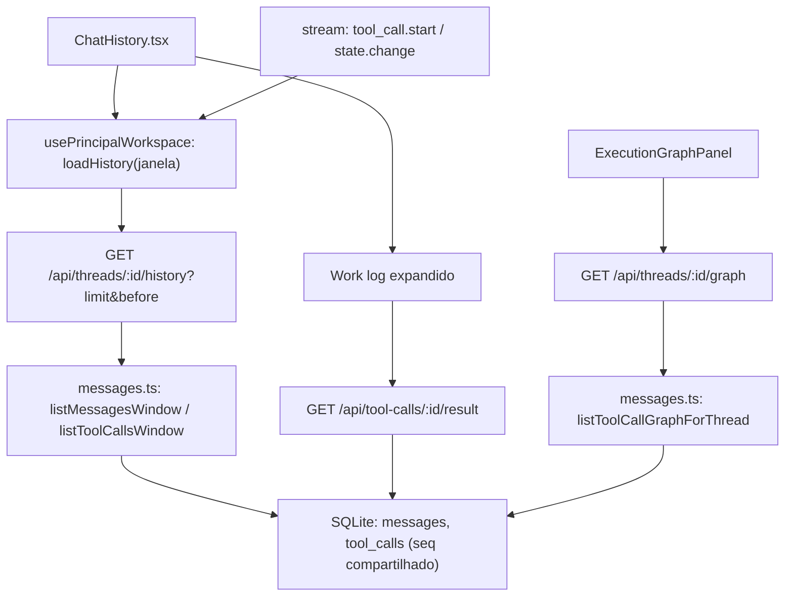

# Especificação Técnica: Histórico de chat paginado

**Complexidade:** médio

**Status:** implementada em 2026-08-19. Unitários verdes em duas rodadas; **sem smoke ao vivo** — os critérios que dependem de tela seguem abertos no PRD §9.

## 1. Visão Geral Técnica

**O quê:** transformar `GET /api/threads/:id/history` numa janela paginada com cursor, dar ao grafo de execução uma rota de projeção própria, e passar a buscar o corpo integral de um resultado de tool sob demanda.

**Por quê:** hoje `handleHistory` devolve `listMessagesForThread(threadId)` + `listToolCallsForThread(threadId)` inteiros, e nem `messages.ts:132` nem `listToolCallsForThread` têm `LIMIT`. Cada resultado de tool pode chegar a `TOOL_RESULT_MAX_CHARS = 64 KB`. Uma thread madura com algumas centenas de tool calls serializa megabytes por busca — e o chat rebusca o histórico a cada `tool_call.start` e `state.change`. O single-flight + coalesce de `loadHistory` (`usePrincipalWorkspace.ts:310`) limita a **frequência**, não o **tamanho**: o custo por busca continua proporcional ao tamanho da thread. O modo de falha é o pior possível — nada quebra, o app só fica pesado com semanas de uso, e a causa não aparece em nenhum erro.

**Escopo incluído (Escopo Central do PRD):**
- `limit` + `before` + `hasMore` + `cursor` na rota de history
- `GET /api/threads/:id/graph`: projeção de tool calls sem corpo de resultado, para a F29 não regredir
- Botão "Carregar mensagens anteriores" no topo da timeline, sem pulo de scroll
- Refetch do stream busca só a janela recente

**Escopo incluído (Adições ao Escopo Completo — mantidas por serem o outro metade do custo):**
- `resultPreview` de 2 KB na listagem + `GET /api/tool-calls/:id/result` para o corpo integral

**Escopo excluído (PRD §7):**
- Busca no histórico pelo servidor e filtro por tipo de mensagem
- Scroll infinito que carrega sozinho ao chegar no topo

**UI:** `docs/F03-workspace/ui.md` e `docs/F03-workspace/copy.md` são a fonte de verdade da timeline e das strings. Esta feature acrescenta duas affordances no topo da timeline (botão de carregar anterior, marcador de início de conversa) e uma substituição de conteúdo dentro do work log — ver §3.3, os ids de copy precisam ser adicionados ao `copy.md` da F03 antes da implementação visual.

## 2. Impacto na Arquitetura

| Componente | Caminho | Papel |
|---|---|---|
| Rota de history | `src/services/http/threads-handler.ts` | Lê `limit`/`before`, valida, devolve janela + cursor |
| Rota de grafo | `src/services/http/threads-handler.ts` | Nova rota `GRAPH_RE`, registrada nas **duas** listas |
| Rota de resultado | `src/services/http/threads-handler.ts` ou handler próprio | `GET /api/tool-calls/:id/result` |
| Repositório de mensagens | `src/services/db/repositories/messages.ts` | Consultas paginadas por `seq` (contador compartilhado) e projeção enxuta |
| Hook do workspace | `src/renderer/hooks/usePrincipalWorkspace.ts` | `loadHistory` com janela; nova ação de página anterior |
| Timeline | `src/renderer/components/workspace/ChatHistory.tsx` + `chatHistory.logic.ts` | Prepend, marcador de início, estado do botão |
| Scroll | `src/renderer/hooks/useChatScroll.ts` + `chatScroll.logic.ts` | Âncora na primeira mensagem visível ao prepender |
| Grafo | `src/renderer/components/workspace/graph/executionGraph.logic.ts` | Passa a consumir a projeção, não o history |



## 3. Decisões Técnicas

### 3.1 Herdadas do brief / docs canônicos

`docs/_shared/codebase-patterns.md` não existe (lote inline, sem Research). Padrões da Descoberta 1.3: rota nova exige registro nas **duas** listas de `threads-handler.ts` (regex + `matchesThreadsRoute`), sob pena de o request ficar pendurado sem erro; `guard()` checa `vaultService.isLocked()` (423) antes do token (401); repositórios devolvem entidades já mapeadas; testes colocados ao lado do módulo. Desvios desta feature: nenhum.

### 3.2 Específicas da feature

| Decisão | Abordagem escolhida | Alternativa considerada | Trade-off |
|---|---|---|---|
| Forma do cursor | `before=<seq>`, keyset sobre a coluna `seq` já existente | `offset` numérico | Keyset é estável sob escrita concorrente: uma mensagem nova durante a leitura não desloca a página. `offset` duplicaria ou puliria linha exatamente no caso que mais acontece aqui, thread viva |
| Tamanho da janela | 60 default, 200 máximo | 30 (mais leve) / 100 | 60 cobre a conversa recente inteira na maioria das threads sem clique, e 200 dá teto duro a quem passar parâmetro. Aceitamos que thread muito ativa exija um clique |
| Tool calls da janela | Pela mesma faixa de `seq` das mensagens da janela | Pelos `message_id` das mensagens da janela | `nextSeq` tira `MAX(seq)` de **messages e tool_calls juntas**, então `seq` é um contador único por thread e a faixa recorta as duas tabelas em sincronia. `message_id` é nullable em `tool_calls`, então chavear por ele perderia toda tool call sem mensagem associada — silenciosamente |
| Grafo | Rota própria de projeção, sem corpo de resultado | Deixar o grafo pedir `limit=999999` | Um teto disfarçado é o bug de volta. A projeção é pequena por construção (sem corpo), então serve a thread inteira sem custo |
| Corpo de resultado | Preview de 2 KB na listagem, integral sob demanda | Sempre integral | 2 KB é o que a timeline colapsada mostra; buscar 64 KB para exibir 2 KB é o desperdício. Custa um estado a mais no work log |
| Refetch do stream | Só a janela recente | Refetch da janela inteira já carregada | Custo constante é o objetivo da feature. Aceitamos que página antiga já carregada não se atualize sozinha — ela é histórico assentado |
| Reconciliação | Por `seq` | Por conteúdo, como as bolhas otimistas | `seq` é único e monotônico no servidor; conteúdo empata em mensagens repetidas ("ok", "sim") |

### 3.3 Assumptions / Auto-Aceitar

| Assumption | Origem | Pode sobrescrever? |
|---|---|---|
| Janela 60/200 e preview 2 KB | Auto-Aceitar: "Especificações PRD parciais" (o PRD fixa os números; esta spec fixa as consultas) | sim |
| `before` fora de faixa responde 400 `invalid_cursor`, nunca a thread inteira | Auto-Aceitar: padrão da indústria; recair no comportamento antigo apagaria a feature em silêncio | sim |
| Copy nova ("Carregar mensagens anteriores", "Início da conversa", "Não deu para carregar. Tentar de novo.", "Resultado completo indisponível") ainda **não** está em `docs/F03-workspace/copy.md` | Auto-Aceitar: `copy.md` incompleto para esta superfície | sim — precisa entrar no `copy.md` da F03 antes da implementação visual |
| Lote cross-wave rodado inline, sem Research nem writers | Desvio explícito da regra same-wave (ondas mecânicas; F03/F29 implementadas) | sim |

## 4. Visão Geral de Componentes

**Backend:**

| Caminho | Novo/Modificado | Propósito | Responsabilidades-chave |
|---|---|---|---|
| `src/services/db/repositories/messages.ts` | Modificado | Acesso a mensagens e tool calls | `listMessagesWindow(threadId, limit, before)`; `listToolCallsWindow(threadId, fromSeq)`; `listToolCallGraphForThread(threadId)`; `getToolCallResult(id)` |
| `src/services/http/threads-handler.ts` | Modificado | Rotas de thread | Parse e validação de `limit`/`before`; resposta com `hasMore`/`cursor`; nova `GRAPH_RE` nas duas listas |
| `src/services/http/tool-calls-handler.ts` | Novo | Corpo de resultado | `GET /api/tool-calls/:id/result` com o mesmo `guard()` e o mesmo teto de `TOOL_RESULT_MAX_CHARS` |
| `src/services/db/repositories/messages.test.ts` | Modificado | Testes de repositório | Janela, cursor, projeção |
| `src/services/http/threads-handler.test.ts` | Modificado | Testes de rota | Validação de parâmetros, shape da resposta, rota de grafo respondendo |

**Frontend:**

| Caminho | Novo/Modificado | Propósito | Responsabilidades-chave |
|---|---|---|---|
| `src/renderer/hooks/usePrincipalWorkspace.ts` | Modificado | Estado do workspace | `loadHistory` com janela; `loadOlderPage()`; merge por `seq`; nunca liga `historyLoading` no refetch de fundo |
| `src/renderer/components/workspace/chatHistory.logic.ts` | Modificado | Lógica pura da timeline | Merge de página anterior, decisão de exibir botão vs marcador de início |
| `src/renderer/components/workspace/ChatHistory.tsx` | Modificado | Timeline | Botão de carregar anterior, marcador de início, estado de erro do botão |
| `src/renderer/hooks/chatScroll.logic.ts` | Modificado | Lógica de scroll | Âncora: preservar a posição da primeira mensagem visível ao prepender |
| `src/renderer/components/workspace/graph/executionGraph.logic.ts` | Modificado | Projeção do grafo | Consumir a rota de projeção em vez do history |

**Banco de dados:** nenhuma migração e nenhum índice novo — `002_workspace_core.ts` já cria `ix_messages_thread_seq` e `ix_tool_calls_thread_seq`, os dois exatamente sobre `(thread_id, seq)`, que é o keyset desta feature.

## 5. Contratos de API

### Endpoint: janela de histórico
- **Método:** GET
- **Caminho:** `/api/threads/:id/history`
- **Autenticação:** header `x-engrenacode-session`; `guard()` com 423 antes de 401

| Campo | Tipo | Obrigatório | Validação | Descrição |
|---|---|---|---|---|
| `limit` | `integer` | Não | 1–200, default 60 | Tamanho da janela |
| `before` | `integer` | Não | `seq` positivo | Devolve o que vem antes deste `seq` |

**Resposta (200):**

| Campo | Tipo | Descrição |
|---|---|---|
| `messages` | `Message[]` | Janela em ordem `seq` ascendente |
| `toolCalls` | `ToolCall[]` | Tool calls das mensagens da janela; resultado possivelmente truncado |
| `hasMore` | `boolean` | Existe página anterior |
| `cursor` | `integer \| null` | `seq` da mensagem mais antiga devolvida; `null` quando a thread acabou |

```json
{
  "messages": [{ "id": "m_41", "seq": 41, "role": "user", "content": "roda os testes" }],
  "toolCalls": [
    {
      "id": "tc_88",
      "name": "Bash",
      "status": "done",
      "resultPreview": "PASS  src/services/runner/gate.test.ts…",
      "resultTruncated": true,
      "resultBytes": 51234
    }
  ],
  "hasMore": true,
  "cursor": 41
}
```

**Códigos de erro:**

| Código | Status | Descrição |
|---|---|---|
| `invalid_cursor` | 400 | `before` não numérico, ≤ 0, ou acima do maior `seq` da thread |
| `invalid_limit` | 400 | `limit` fora de 1–200 |
| `vault_locked` | 423 | Cofre travado |
| `unauthorized` | 401 | Sem token de sessão |
| `not_found` | 404 | Thread inexistente |

### Endpoint: projeção do grafo
- **Método:** GET
- **Caminho:** `/api/threads/:id/graph`

**Resposta (200):** `{ "nodes": [{ "id", "name", "parentToolCallId", "status", "startedAt", "endedAt" }] }` — thread inteira, sem nenhum corpo de resultado.

### Endpoint: corpo integral do resultado
- **Método:** GET
- **Caminho:** `/api/tool-calls/:id/result`

**Resposta (200):** `{ "result": "<texto>", "bytes": 51234, "truncated": false }`. `truncated` só é `true` quando o próprio resultado gravado já bateu em `TOOL_RESULT_MAX_CHARS`.

| Código | Status | Descrição |
|---|---|---|
| `not_found` | 404 | Tool call inexistente ou de thread apagada |

## 6. Modelo de Dados

Sem alteração de colunas e sem índice novo.

O que a feature explora é uma propriedade que já existe: `nextSeq(threadId)` calcula `MAX(seq)` sobre `messages` **e** `tool_calls`, então `seq` é um contador único por thread e ordena as duas tabelas no mesmo eixo. A janela é uma faixa desse eixo.

**Índices já existentes (`002_workspace_core.ts`), que sustentam o keyset:**

| Nome | Colunas | Propósito nesta feature |
|---|---|---|
| `ix_messages_thread_seq` | `thread_id, seq` | Janela e cursor de mensagens |
| `ix_tool_calls_thread_seq` | `thread_id, seq` | Tool calls da mesma faixa, e a projeção do grafo |

`tool_calls.message_id` é nullable e **não** é usado para recortar a janela — ver §3.2.

## 7. Estratégia de Testes

### 7.1 Unitário / Integração

| Arquivo | Tipo | Alvo |
|---|---|---|
| `src/services/db/repositories/messages.test.ts` | Unitário | Janela, cursor, projeção |
| `src/services/http/threads-handler.test.ts` | Integração | Rotas e validação |
| `src/services/http/tool-calls-handler.test.ts` | Integração | Corpo sob demanda |
| `src/renderer/components/workspace/chatHistory.logic.test.ts` | Unitário | Merge e affordances |
| `src/renderer/hooks/chatScroll.logic.test.ts` | Unitário | Âncora no prepend |

| Função de teste | Descrição | Assertions |
|---|---|---|
| `janela devolve as mais recentes em ordem ascendente` | Default sem parâmetro | 60 itens no máximo; último `seq` é o maior da thread |
| `cursor aponta para a mensagem mais antiga da janela` | Contrato do cursor | `cursor === messages[0].seq`; `hasMore` verdadeiro com thread maior que a janela |
| `before devolve a página anterior sem sobreposição` | Keyset | Nenhum `seq` repetido entre páginas; nenhum buraco |
| `escrita concorrente não desloca a página` | Estabilidade do keyset | Inserir mensagem nova entre duas leituras não duplica nem pula item |
| `cursor nulo no início da conversa` | Fim da paginação | `hasMore` falso; `cursor` nulo |
| `limit e before inválidos são recusados` | Validação | 400 `invalid_limit` / `invalid_cursor`; nunca 200 com a thread inteira |
| `tool calls vêm só da faixa de seq da janela` | Escopo do payload | Nenhum tool call com `seq` abaixo do cursor; tool call **sem** `message_id` na faixa continua presente |
| `resultado acima de 2 KB vem truncado com tamanho` | Payload | `resultPreview.length <= 2048`; `resultTruncated`; `resultBytes` presente |
| `corpo integral sai pela rota própria` | Sob demanda | Igual ao gravado; `truncated` só sob o teto de `TOOL_RESULT_MAX_CHARS` |
| `rota de grafo devolve a thread inteira sem corpo` | Não-regressão da F29 | Todo tool call presente; nenhuma chave de resultado no payload |
| `rota de grafo está registrada nas duas listas` | Armadilha conhecida | Request responde (não fica pendurado até o timeout do teste) |
| `custo do refetch não cresce com a thread` | Objetivo da feature | Mensagens transferidas no refetch iguais em thread de 5 e de 500 |
| `merge de página anterior preserva ordem e não duplica` | Lógica pura | Ordenação por `seq`; nenhum id repetido |
| `página anterior e refetch concorrente reconciliam` | Corrida | Estado final sem duplicata nem buraco |
| `prepend preserva a posição da primeira mensagem visível` | Scroll | Offset da âncora inalterado |
| `botão sai e marcador aparece no fim da paginação` | Affordance | Sem `hasMore`, botão ausente e marcador presente |

### 7.2 Smoke / Aceitação manual

| # | Passo | Resultado esperado |
|---|---|---|
| 1 | Abrir thread com centenas de mensagens | Mensagens recentes na tela, posicionadas no fim, sem "Carregando…" sobre a árvore inteira |
| 2 | Clicar "Carregar mensagens anteriores" | Página anterior prepende; a mensagem que estava sob o cursor do olho continua no mesmo lugar |
| 3 | Repetir até o início | Botão desaparece e o topo mostra o marcador de início de conversa |
| 4 | Expandir o work log de um resultado grande | Preview troca pelo corpo integral, sem recarregar a timeline nem fechar o work log |
| 5 | Rodar um turno com a thread aberta | Timeline atualiza; nenhuma tela de carregamento; scroll não salta ao topo |
| 6 | Abrir a aba Grafo na mesma thread | Execução completa, inclusive a parte anterior à janela do chat |
| 7 | Chamar `/history?before=abc` e `?limit=9999` | 400 `invalid_cursor` e 400 `invalid_limit` |
| 8 | Derrubar a rede e clicar em carregar anterior | Botão volta com "Não deu para carregar. Tentar de novo."; a janela já lida permanece |
| 9 | Conferir light/dark do botão e do marcador | Anatomia e strings conforme `docs/F03-workspace/ui.md` e `copy.md` **depois** de os ids novos entrarem lá |

### 7.3 Cross-feature

| Critério | Status | Nota |
|---|---|---|
| Janela e cursor alimentam `loadHistory` sem ligar `historyLoading` no refetch de fundo nem mover o scroll | ready | F03 implementada |
| Projeção sem corpo alimenta a aba Grafo com a execução completa | ready | F29 implementada |
| Reconciliação com as bolhas otimistas do composer segue por conteúdo no `GET /history` | ready | F03 — o merge por `seq` é entre páginas, não substitui a reconciliação otimista |

## 8. Desvios da spec na implementação

**Um defeito real apareceu ao implementar, e mudou o contrato do recorte.**

A spec dizia "tool calls da mesma faixa de `seq` da janela", com o piso no cursor. Implementado assim,
uma tool call com `seq` **anterior** à mensagem mais antiga da thread — o turno que chama uma tool
antes de gravar qualquer mensagem — não era alcançável por `seq >= cursor` de página nenhuma e
**sumia do histórico inteiro**. O teste de rota pegou (a listagem voltou com zero tool calls onde
havia uma).

Correção: `toolCallWindowStart(window)` devolve `0` quando não há página anterior, e o cursor só
quando há. Com isso as páginas **azulejam** o eixo de `seq`, e a faixa ganhou teto (`seq < before`)
para a página antiga não repetir o que a nova já trouxe.

**Outras diferenças em relação ao que a spec previa:**

| Previsto | Entregue | Motivo |
|---|---|---|
| `listToolCallsForMessages(messageIds)` | `listToolCallsWindow(threadId, fromSeq, beforeSeq?)` | `tool_calls.message_id` é nullable; chavear por ele perderia toda tool call sem mensagem, em silêncio |
| Índice novo `ix_tool_calls_message` | Nenhum índice novo | `ix_messages_thread_seq` e `ix_tool_calls_thread_seq` já existem e cobrem o keyset |
| `tool-calls-handler.ts` próprio | Rota dentro de `threads-handler.ts` | Mesmo `guard()` de cofre e sessão; um arquivo novo para uma rota só não pagava |
| Merge da janela pelo `mergeById` existente | `unionBySeq` novo | `mergeById` **substitui** a lista pela recebida — correto com histórico inteiro, e exatamente errado com janela: o refetch da janela recente derrubaria as páginas que o usuário acabou de carregar |
| — | `historyThreadId` no estado da timeline | Sem ele, unir por `seq` misturaria duas conversas na troca de thread. Mesma thread une, thread diferente substitui |
| — | Fetch da projeção dentro do `ExecutionGraphPanel` | O grafo lia `ws.toolCalls`, que passou a ser a janela. Sem isso a aba Grafo seria amputada sem nada indicando |
