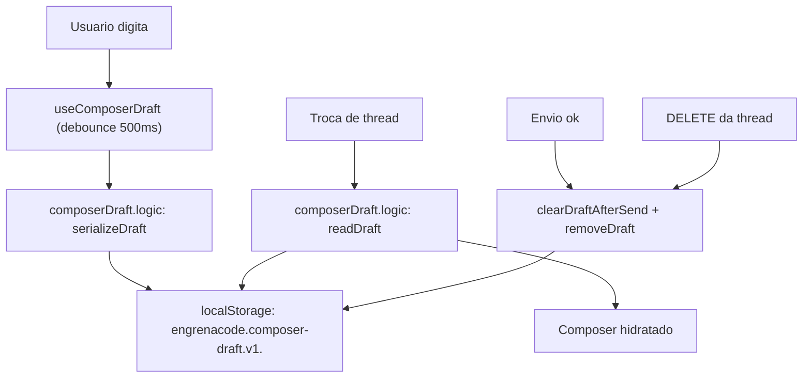

# Especificação Técnica: Rascunho persistente do composer

**Complexidade:** simples

**Status:** implementada em 2026-08-19. Unitários verdes em duas rodadas; **sem smoke ao vivo** — os critérios que dependem de tela seguem abertos no PRD §9.

## 1. Visão Geral Técnica

**O quê:** persistir o rascunho não enviado do composer por thread, em `localStorage`, seguindo a mesma convenção que a fila de mensagens já usa.

**Por quê:** assimetria concreta no repo. `messageQueue.logic.ts` serializa a fila em `localStorage` sob `QUEUE_STORAGE_PREFIX = 'engrenacode.message-queue.v1.'`; `composerDraft.logic.ts` não persiste nada — o rascunho é estado React puro, e `emptyDraft()` é o que sobra depois de um F5 ou de um restart. Um prompt longo digitado e perdido é dano de dados do ponto de vista de quem escreveu. O repo já reconhece o valor pelo outro lado: existe regra dedicada a devolver texto, imagens e anexos quando o backend recusa o envio. Mesmo valor, gatilho diferente, não coberto.

**Escopo incluído:**
- Chave versionada por thread com texto e caminhos de anexo explícito
- Contagem de imagens não guardadas, exposta ao usuário
- Tetos: 32 KB por rascunho, 20 threads com rascunho, debounce de 500 ms
- Limpeza no envio bem-sucedido, no `DELETE` da thread e por evicção

**Escopo excluído (PRD §7):**
- Sincronizar rascunho entre máquinas ou entre janelas do mesmo app
- Guardar a imagem colada em si
- Persistir model/reasoning no rascunho — eles já vivem na thread (F16)

**UI:** `docs/F03-workspace/ui.md` e `docs/F03-workspace/copy.md` são a fonte de verdade do composer. Esta feature acrescenta uma linha muted de aviso sobre imagens não guardadas; o id de copy precisa entrar no `copy.md` da F03 antes da implementação visual (§3.3).

## 2. Impacto na Arquitetura

| Componente | Caminho | Papel |
|---|---|---|
| Lógica de rascunho | `src/renderer/hooks/composerDraft.logic.ts` | Serialização, desserialização, tetos, evicção (funções puras) |
| Hook de rascunho | `src/renderer/hooks/useComposerDraft.ts` | Hidratar na troca de thread, gravar com debounce, limpar no envio |
| Composer | `src/renderer/components/workspace/TaskComposer.tsx` | Linha muted de imagens não guardadas |
| Referência de padrão | `src/renderer/hooks/messageQueue.logic.ts` | Convenção de chave e separação lógica pura / efeito |



## 3. Decisões Técnicas

### 3.1 Herdadas dos docs canônicos

O brief compartilhado que o Modo Lote usava existia mas estava stale (`git_sha` anterior à conversão monorepo, declarando-se `fresh`); o Modo Lote e o brief foram removidos em 2026-08-20. Padrões da Descoberta 1.3: lógica pura em `*.logic.ts` testada isoladamente, com o efeito (`localStorage`, React) no hook chamador — exatamente a divisão que `messageQueue.logic.ts:29` documenta; chave de storage com prefixo `engrenacode.<dominio>.v<n>.`; `client-localstorage-schema` da skill `vercel-react-best-practices` (versionar e minimizar o que vai para o storage). Desvios desta feature: nenhum.

### 3.2 Específicas da feature

| Decisão | Abordagem escolhida | Alternativa considerada | Trade-off |
|---|---|---|---|
| Onde persistir | `localStorage`, como a fila | SQLite pelo backend | O rascunho é estado de UI local e não precisa de round-trip; SQLite exigiria rota nova e migração para um dado que não é do domínio. Custa: não sincroniza entre janelas — e não deve |
| Imagens | Não persistir; guardar só a contagem | Persistir base64 | Uma captura de tela em base64 estoura a cota do storage e mataria a fila junto. A contagem é o que torna a perda honesta em vez de silenciosa |
| Model/reasoning | Fora do rascunho | Persistir junto | Já persistem na thread por F16; duplicar cria duas verdades e a do rascunho envelheceria |
| Escrita | Debounce de 500 ms | Escrever a cada tecla | Escrita síncrona por keystroke bloqueia a thread principal em rascunho grande. 500 ms perde no máximo meio segundo de digitação num crash |
| Teto por rascunho | 32 KB, acima disso não persiste | Truncar o texto | Truncar entrega um prompt mutilado que parece íntegro. Não persistir preserva o comportamento de hoje para o caso raro |
| Evicção | 20 threads, mais antiga por último toque | Sem limite | Sem limite o storage cresce para sempre e a cota estoura na fila, que é o vizinho. 20 threads cobre uso real com folga |
| Chaves separadas por thread | Uma chave por thread | Uma chave só com um mapa | Chave por thread evita reescrever todos os rascunhos a cada tecla e é o que a fila já faz |

### 3.3 Assumptions / Auto-Aceitar

| Assumption | Origem | Pode sobrescrever? |
|---|---|---|
| Debounce 500 ms, teto 32 KB, 20 threads | Auto-Aceitar: "Especificações PRD parciais" — números fixados no PRD, comportamento de borda fixado aqui | sim |
| Cursor vai para o fim do texto na hidratação | Auto-Aceitar: padrão de mercado (VS Code / Cursor restauram input não enviado com caret no fim) | sim |
| Copy da linha de imagens não guardadas ainda **não** está em `docs/F03-workspace/copy.md` | Auto-Aceitar: `copy.md` incompleto para esta superfície | sim — precisa entrar antes da implementação visual |
| Lote cross-wave rodado inline, sem Research nem writers | Desvio explícito da regra same-wave (ondas mecânicas; F03/F16 implementadas) | sim |

## 4. Visão Geral de Componentes

**Frontend:**

| Caminho | Novo/Modificado | Propósito | Responsabilidades-chave |
|---|---|---|---|
| `src/renderer/hooks/composerDraft.logic.ts` | Modificado | Lógica pura do rascunho | `DRAFT_STORAGE_PREFIX`; `serializeDraft`/`deserializeDraft` com versão; teto de 32 KB; `evictOldestDrafts` |
| `src/renderer/hooks/useComposerDraft.ts` | Modificado | Efeito | Hidratar na troca de thread, gravar com debounce, remover no envio e no DELETE |
| `src/renderer/hooks/composerDraft.logic.test.ts` | Modificado | Testes | Round-trip, tetos, evicção, entrada corrompida |
| `src/renderer/components/workspace/TaskComposer.tsx` | Modificado | Composer | Linha muted de imagens não guardadas, que sai ao primeiro toque no campo |

**Backend / Banco de dados:** nenhuma mudança.

## 5. Contratos de API

Nenhum. Feature inteiramente do renderer.

**Formato persistido** (contrato de serialização, versionado):

```json
{
  "v": 1,
  "text": "revisa o gate e me diz se o teto",
  "attachments": ["src/services/runner/gate.ts"],
  "droppedImages": 2,
  "touchedAt": 1755600000000
}
```

| Campo | Tipo | Descrição |
|---|---|---|
| `v` | `1` | Versão do schema; valor diferente descarta a chave |
| `text` | `string` | Texto não enviado |
| `attachments` | `string[]` | Caminhos de anexo explícito (nunca conteúdo de arquivo) |
| `droppedImages` | `integer` | Quantas imagens coladas não foram guardadas |
| `touchedAt` | `integer` | Epoch ms do último toque; base da evicção |

## 6. Modelo de Dados

Sem schema de banco. O único armazenamento é `localStorage`, sob `engrenacode.composer-draft.v1.<threadId>`.

## 7. Estratégia de Testes

### 7.1 Unitário / Integração

| Arquivo | Tipo | Alvo |
|---|---|---|
| `src/renderer/hooks/composerDraft.logic.test.ts` | Unitário | Serialização, tetos, evicção |

| Função de teste | Descrição | Assertions |
|---|---|---|
| `round-trip preserva texto e anexos explícitos` | Caminho felizes | Texto idêntico; anexos idênticos; nenhum conteúdo de arquivo no payload |
| `imagens não são persistidas, só contadas` | Contrato de imagem | Nenhum base64 no payload; `droppedImages` igual ao número de imagens do rascunho |
| `model e reasoning não entram no payload` | Fronteira com F16 | Chaves ausentes |
| `rascunho acima de 32 KB não é persistido` | Teto | Chave ausente no storage; retorno indica não-persistido |
| `rascunho vazio remove a chave` | Higiene | `localStorage.getItem` nulo, não string vazia |
| `evicção derruba a mais antiga por último toque` | Teto de threads | Com 21 rascunhos, sobram 20 e a de `touchedAt` menor saiu |
| `versão desconhecida é descartada` | Robustez | Retorna rascunho vazio; chave removida |
| `JSON corrompido é descartado sem lançar` | Robustez | Não lança; retorna rascunho vazio |
| `QuotaExceededError não propaga` | Robustez | Não lança; sinaliza falha de persistência ao chamador |
| `remoção no envio apaga a chave da thread e só dela` | Isolamento | Outras threads intactas |

### 7.2 Smoke / Aceitação manual

| # | Passo | Resultado esperado |
|---|---|---|
| 1 | Digitar meio prompt, anexar um arquivo por `@file`, dar F5 | Texto de volta com o caret no fim; chip do anexo de volta |
| 2 | Digitar, fechar o app pelo X, reabrir e destravar o cofre | Rascunho de volta na mesma thread |
| 3 | Colar duas imagens, digitar, dar F5 | Texto de volta; linha muted diz que 2 imagens não foram guardadas; a linha sai ao primeiro toque no campo |
| 4 | Digitar em duas threads, alternar entre elas | Cada thread mostra o próprio rascunho, sem mistura |
| 5 | Enviar a mensagem e depois reabrir a thread | Composer vazio; rascunho enviado não ressuscita |
| 6 | Apagar a thread e checar o storage | Nenhuma chave de rascunho remanescente |
| 7 | Colar um texto de ~50 KB e dar F5 | Composer abre vazio, sem erro em tela; app segue funcionando |
| 8 | Adulterar a chave no DevTools para JSON inválido e recarregar | Composer abre vazio, sem erro em tela |
| 9 | Conferir light/dark da linha muted | Anatomia e string conforme `docs/F03-workspace/ui.md` e `copy.md`, depois de o id novo entrar lá |

### 7.3 Cross-feature

| Critério | Status | Nota |
|---|---|---|
| Rascunho devolve texto e anexos explícitos ao composer | ready | F03 e F16 implementadas |
| Model/reasoning continuam vindo da thread, não do rascunho | ready | F16 implementada |
| Restauração após recusa do backend continua vindo da memória, sem conflito com o rascunho persistido | ready | F03 — regra existente de `composer.attachments`; o teste de isolamento cobre a interação |
