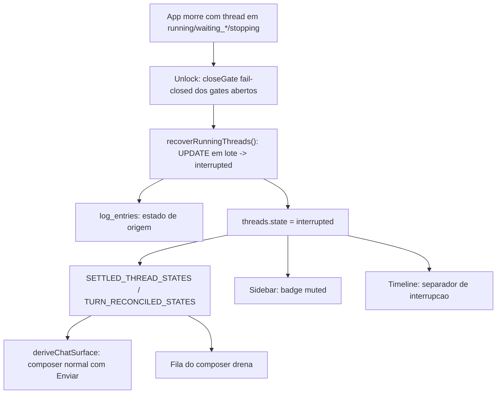

# Especificação Técnica: Estado honesto de thread interrompida

**Complexidade:** simples

**Status:** implementada em 2026-08-19. Unitários verdes em duas rodadas; **sem smoke ao vivo** — os critérios que dependem de tela seguem abertos no PRD §9.

## 1. Visão Geral Técnica

**O quê:** acrescentar `interrupted` a `ThreadState` e fazer a recuperação de boot gravá-lo em vez de `error`, com o gate fechado antes da mudança de estado e o motivo em `log_entries`.

**Por quê:** `recoverRunningThreads()` (`db/repositories/threads.ts:236`, chamada de `http/unlock-handler.ts:48`) faz `UPDATE threads SET state='error' WHERE state IN ('running','waiting_user','waiting_permission','stopping')`. A intenção está certa — nunca deixar uma thread presa em "Executando…" depois de o app morrer. O rótulo é que mente: uma conversa cortada pelo fechamento do app não falhou, foi interrompida, e o app se acusa de um defeito que não cometeu. `error` também é o rótulo da falha real de turno, então os dois casos ficam indistinguíveis na lista e no diagnóstico.

**Por que estado novo e não `cancelled`:** `cancelled` já significa "o usuário mandou parar". Reusá-lo trocaria uma mentira por outra e misturaria na sidebar duas coisas que o usuário precisa distinguir. O estado novo custa entrar nos conjuntos terminais — o que é justamente o requisito, já que a fila do composer drena em `TURN_RECONCILED_STATES` e excluir um estado terminal dali já congelou a fila uma vez neste repo.

**Escopo incluído:**
- `interrupted` em `ThreadState`, em `SETTLED_THREAD_STATES` e em `TURN_RECONCILED_STATES`
- Recuperação de boot gravando `interrupted`, em um único UPDATE em lote
- Gate aberto fechado antes da mudança de estado, ainda fail-closed
- `log_entries` com o estado de origem
- Separador na timeline e badge muted na sidebar

**Escopo excluído (PRD §7):**
- Retomar automaticamente o turno interrompido
- Reclassificar retroativamente as threads já gravadas como `error` pelo boot antigo

**UI:** `docs/F03-workspace/ui.md` e `docs/F03-workspace/copy.md` são a fonte de verdade da timeline e da sidebar. O separador e o badge são superfície nova; os ids de copy precisam entrar no `copy.md` da F03 antes da implementação visual (§3.3).

## 2. Impacto na Arquitetura

| Componente | Caminho | Papel |
|---|---|---|
| Tipo do estado | `src/services/db/repositories/threads.ts` | União `ThreadState` + `recoverRunningThreads()` |
| Recuperação no unlock | `src/services/http/unlock-handler.ts` | Ordem: fechar gates, depois assentar estados, depois registrar |
| Gate | `src/services/runner/gate.ts` | Fechamento fail-closed dos gates das threads recuperadas |
| Máquina de estado | `src/services/runner/turn-state.ts` | `interrupted` como estado terminal válido |
| Conjuntos terminais | `src/renderer/hooks/threadStream.logic.ts` | `SETTLED_THREAD_STATES` (linha 104) e `TURN_RECONCILED_STATES` (linha 121) |
| Superfície do chat | `src/renderer/components/workspace/chatSurface.logic.ts` | `deriveChatSurface` trata `interrupted` como terminal |
| Timeline e sidebar | `ChatHistory.tsx` e a lista de threads | Separador e badge muted |
| Export | `src/services/threads/thread-export.ts` | Já consome os conjuntos terminais; entra como não-regressão |

## 3. Decisões Técnicas

### 3.1 Herdadas dos docs canônicos

O brief compartilhado que o Modo Lote usava existia mas estava stale (`git_sha` anterior à conversão monorepo, declarando-se `fresh`); o Modo Lote e o brief foram removidos em 2026-08-20. Padrões da Descoberta 1.3: `turn-state.ts` é o dono único de `threads.state` fora do boot, e o boot é a exceção declarada (UPDATE em lote); `deriveChatSurface` é o único lugar que decide rótulo e visibilidade do composer, e `TaskComposer.tsx`/`ChatHistory.tsx` não reimplementam o predicado; `createLogEntry` como porta de auditoria. Desvios desta feature: nenhum.

### 3.2 Específicas da feature

| Decisão | Abordagem escolhida | Alternativa considerada | Trade-off |
|---|---|---|---|
| Rótulo do estado | `interrupted` novo | Reusar `cancelled` | `cancelled` significa "o usuário parou"; reusar mistura na sidebar dois casos que o usuário precisa separar. Custa alargar a união e todo lugar que faz `switch` exaustivo — o que é feature, não bug: o compilador aponta cada ponto que precisa decidir |
| Pertinência aos conjuntos terminais | Nos dois (`SETTLED` e `TURN_RECONCILED`) | Só em `SETTLED` | Ficar fora de `TURN_RECONCILED` congela a fila do composer — já aconteceu neste repo com `cancelled`. Sem trade-off real: é requisito |
| Ordem no boot | Gates primeiro, estado depois, log por último | Estado primeiro | Assentar o estado antes de fechar o gate deixa gate órfão apontando para thread terminal, que é exatamente o resíduo que a varredura de gate órfão existe para limpar. Sem custo |
| Registro | `log_entries` com o estado de origem | Coluna nova em `threads` | O estado de origem é diagnóstico, não estado corrente; coluna exigiria migração para um dado que só se lê em investigação |
| Threads já marcadas `error` | Não reescrever | Migração heurística | Não há como distinguir retroativamente interrupção de falha; reescrever inventaria fato. Custo: a lista fica com um passado misto por um tempo |
| Retomar o turno | Fora de escopo | Retomar via `--resume` | Retomar sozinho no boot dispara trabalho e gasto sem o usuário pedir; nomear o estado é o que resolve a mentira |

### 3.3 Assumptions / Auto-Aceitar

| Assumption | Origem | Pode sobrescrever? |
|---|---|---|
| Nome `interrupted` | Auto-Aceitar: padrão de mercado (Cursor mostra "stopped"; Claude Code distingue interrupção de falha) | sim |
| Badge muted, não destrutivo | Auto-Aceitar: padrão da indústria; `error` já ocupa o registro visual destrutivo | sim |
| Copy do separador e do badge ainda **não** está em `docs/F03-workspace/copy.md` | Auto-Aceitar: `copy.md` incompleto para esta superfície | sim — precisa entrar antes da implementação visual |
| Lote cross-wave rodado inline, sem Research nem writers | Desvio explícito da regra same-wave (ondas mecânicas; F03/F08 implementadas) | sim |

## 4. Visão Geral de Componentes

**Backend:**

| Caminho | Novo/Modificado | Propósito | Responsabilidades-chave |
|---|---|---|---|
| `src/services/db/repositories/threads.ts` | Modificado | Tipo e recuperação | `interrupted` na união; `recoverRunningThreads()` grava `interrupted` e devolve o estado de origem por thread |
| `src/services/http/unlock-handler.ts` | Modificado | Sequência de boot | Fechar gates, assentar estados, registrar origem |
| `src/services/runner/turn-state.ts` | Modificado | Máquina de estado | `interrupted` como terminal; nenhuma transição de turno vivo o produz |
| `src/services/db/repositories/threads.test.ts` | Modificado | Testes | Lote, idempotência, estado de origem |

**Frontend:**

| Caminho | Novo/Modificado | Propósito | Responsabilidades-chave |
|---|---|---|---|
| `src/renderer/hooks/threadStream.logic.ts` | Modificado | Conjuntos terminais | `interrupted` em `SETTLED_THREAD_STATES` (e portanto em `TURN_RECONCILED_STATES`) |
| `src/renderer/components/workspace/chatSurface.logic.ts` | Modificado | Superfície do chat | `interrupted` → composer normal com Enviar |
| `src/renderer/components/workspace/ChatHistory.tsx` | Modificado | Timeline | Separador de interrupção no fim do último turno |
| Lista de threads (sidebar) | Modificado | Sidebar | Badge muted para `interrupted` |

**Banco de dados:** nenhuma migração. Verificado em `002_workspace_core.ts`: `threads.state` é `TEXT NOT NULL`, sem `CHECK` listando os estados, então o valor novo é aceito sem DDL. `ix_threads_state` já existe e continua servindo a filtragem por estado.

## 5. Contratos de API

Nenhum endpoint novo. `GET /api/threads` e `GET /api/threads/:id` passam a poder devolver `state: "interrupted"`; consumidores que fazem `switch` sobre o estado precisam tratá-lo (o compilador aponta).

## 6. Modelo de Dados

| Tabela | Coluna | Mudança |
|---|---|---|
| `threads` | `state` | Valor novo aceito: `interrupted`. Sem DDL — coluna é `TEXT NOT NULL` sem `CHECK` (verificado em `002_workspace_core.ts`) |
| `log_entries` | — | Registro novo: `kind = 'task'`, `event = 'Turno interrompido no boot (estado anterior: <origem>).'` |

## 7. Estratégia de Testes

### 7.1 Unitário / Integração

| Arquivo | Tipo | Alvo |
|---|---|---|
| `src/services/db/repositories/threads.test.ts` | Integração | Recuperação de boot |
| `src/services/runner/turn-state.test.ts` | Unitário | Terminalidade |
| `src/renderer/hooks/threadStream.logic.test.ts` | Unitário | Conjuntos terminais |
| `src/renderer/components/workspace/chatSurface.logic.test.ts` | Unitário | Superfície do composer |

| Função de teste | Descrição | Assertions |
|---|---|---|
| `boot marca os quatro estados vivos como interrupted` | Recuperação | `running`, `waiting_user`, `waiting_permission`, `stopping` → `interrupted`; `idle`/`committed`/`error`/`cancelled` intocados |
| `recuperação é um UPDATE em lote` | Desempenho | Uma única execução, não um laço por thread |
| `recuperação é idempotente` | Robustez | Rodar duas vezes dá o mesmo resultado e não gera log duplicado por thread |
| `estado de origem chega ao log` | Diagnóstico | `log_entries` nomeia o estado anterior de cada thread |
| `falha de log não impede o assentamento` | Prioridade | Estado ainda vira `interrupted` |
| `gate é fechado antes da mudança de estado` | Ordem | Nenhum gate aberto apontando para thread `interrupted`; a decisão registrada é `denied` |
| `gate expirado no boot nunca vira allow` | Fail-closed | Nenhuma decisão `allow` em nenhum caminho de recuperação |
| `interrupted está nos dois conjuntos terminais` | Fila | Presente em `SETTLED_THREAD_STATES` e em `TURN_RECONCILED_STATES` |
| `fila do composer drena em interrupted` | Fila | Item enfileirado é despachado igual ao caso `cancelled` |
| `deriveChatSurface trata interrupted como terminal` | Composer | Rota de envio normal; rótulo Enviar; sem modo ocupado |
| `matriz de deriveChatSurface bate com routeComposerSend` | Regra existente | Igualdade nas combinações que incluem `interrupted` |
| `nenhuma transição de turno vivo produz interrupted` | Máquina de estado | Só a recuperação de boot o grava |
| `error segue reservado para falha real` | Separação | Falha de spawn/CLI/exceção continua gravando `error` |

### 7.2 Smoke / Aceitação manual

| # | Passo | Resultado esperado |
|---|---|---|
| 1 | Iniciar um turno longo e matar o app pelo PID no meio | Ao reabrir e destravar, a thread aparece como interrompida, com badge muted |
| 2 | Abrir essa thread | Separador dizendo que o turno foi interrompido; nenhuma tarja âmbar de falha |
| 3 | Digitar e enviar na mesma thread | Turno novo roda; nenhum passo de limpar erro |
| 4 | Repetir matando o app com um card de permissão aberto | Gate fechado, nenhum gate órfão na listagem; thread interrompida |
| 5 | Enfileirar mensagem, matar o app, reabrir | Fila drena no fim da recuperação, como em `cancelled` |
| 6 | Provocar falha real (CLI ausente) | Thread em erro, com a tarja de sempre, visualmente distinta da interrompida |
| 7 | Conferir Registros da thread interrompida | Linha nomeando o estado anterior |
| 8 | Conferir light/dark do separador e do badge | Anatomia e strings conforme `docs/F03-workspace/ui.md` e `copy.md`, depois de os ids entrarem lá |

### 7.3 Cross-feature

| Critério | Status | Nota |
|---|---|---|
| `interrupted` é lido por `deriveChatSurface` e pela sidebar como terminal | ready | F03 implementada |
| Origem da interrupção aparece em Registros | ready | F08 implementada |
| Gate aberto no boot é fechado antes da mudança de estado | peer no lote | F32 depende da mesma ordem; especificada aqui |
| Export de thread continua consistente com os conjuntos terminais | ready | `thread-export.ts` já consome `SETTLED_THREAD_STATES` |

## 8. Desvios da spec na implementação

**Uma consequência que a spec não previu, encontrada lendo o código.**

O comentário de `recoverRunningThreads` registrava que `error` era escolhido também porque alimenta
a métrica `errors` e o inbox "Precisa da sua atenção" (`dashboard.ts`). Trocar o estado mexeu nos
dois, e ignorar isso teria produzido uma regressão silenciosa: a thread interrompida **sumiria** da
inbox de quem usa a lista como fila de trabalho.

Decisão, com o custo assumido de alargar `DashboardInboxKind`:

| Superfície | Antes | Agora | Por quê |
|---|---|---|---|
| Métrica `errors` | contava thread interrompida | não conta | turno cortado pelo fechamento do app não é defeito; inflar a métrica com ele era efeito colateral do rótulo compartilhado |
| Inbox | aparecia como `error` (tier 0) | aparece como `interrupted` (tier 3, último) | nada falhou e nada está pendente de revisão — só há um turno a retomar. Sumir seria pior que o rótulo errado |

**Outras diferenças:**

| Previsto | Entregue | Motivo |
|---|---|---|
| `db.transaction(...)` | `exec('BEGIN')` / `COMMIT` / `ROLLBACK` | `DatabaseSync` (`node:sqlite`) não expõe `transaction()`; o idioma do repo é o par explícito (`subagents.ts`, `usage-events.ts`) |
| Confirmar se há `CHECK` no estado | Verificado: não há | `threads.state` é `TEXT NOT NULL` em `002_workspace_core.ts`; nenhuma migração foi necessária |
