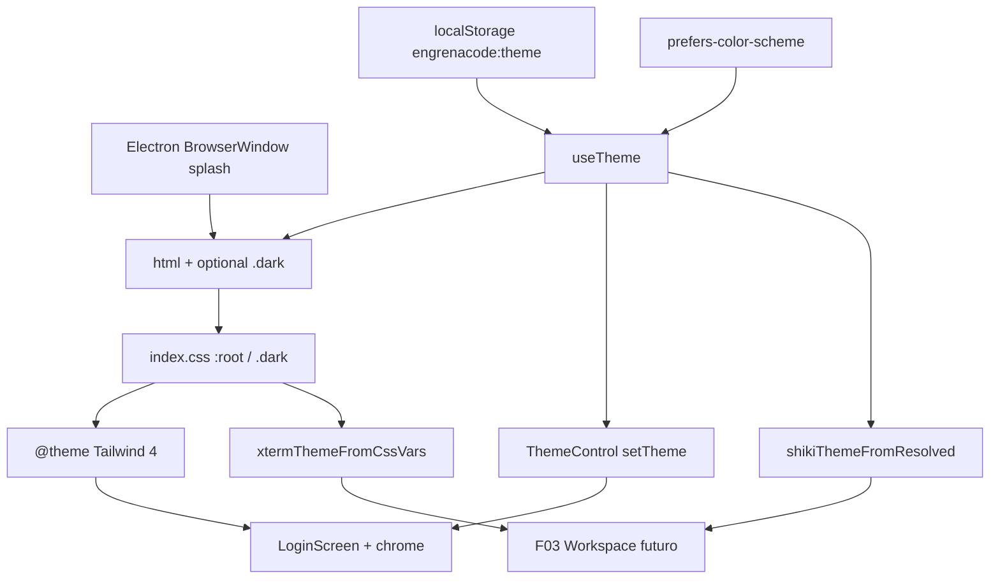

# Spec: Design System

**Complexidade:** médio  
**Fonte PRD:** `docs/PRD.md` → F01.1  
**Modo:** Escopo Central only; Adições ao Escopo Completo adiadas  
**Fonte visual:** `docs/design-system/` (Design Lock LionClaw), paths de código alinhados ao layout real `src/`

## Assumptions / Decisions

| Decisão | Origem | Escolha |
|---------|--------|---------|
| Escopo | Entrevista R1 | Central only; type scale / shadows / z-index / motion / breakpoints tokenizados = Adiado |
| Wiring Tailwind | Entrevista R2 | Tailwind 4: CSS vars canônicas + `@theme` (ou equivalente v4); sem `tailwind.config.ts` clássico; sem downgrade v3 |
| Layout de pastas | Codebase | `src/renderer/`, `src/main/` (não `packages/renderer`) |
| Shiki / xterm | Entrevista R3 | Contrato runtime + deps; sem chat, markdown de mensagem, dock, PTY |
| Controle de tema | Entrevista R4 | `useTheme` + `engrenacode:theme`; seletor mínimo em `#login` e chrome pós-unlock |
| Tipografia | Entrevista R5 | DM Sans + Figtree + JetBrains Mono; LionLabs Grotesk fora |
| Migração visual | Entrevista R6 | Infra + migrar superfícies existentes (`#login` + chrome); sem telas novas |
| `.chat-markdown` | Entrevista R7 | Adiado com UI de chat; critério só na integração F03 |
| Hexes / escalas | PRD + `docs/design-system` | Design Lock inalterado; só o mecanismo de exposição muda |
| Testes | Codebase | Sem runner ainda; cenários nomeados para aceitação manual / futuro Vitest |

---

## 1. Visão Geral Técnica

**O quê:** Fundação de estilo global do renderer EngrenaCode: tokens semânticos light/dark (Design Lock), spacing/radii/fonts, runtime de tema `light` | `dark` | `system` com persistência e anti-flash, splash do shell, padrões de superfície nas UIs já existentes, e contratos runtime Shiki/xterm para consumo futuro pelo Workspace.

**Por quê:** F02+ precisa consumir utilitários semânticos (`bg-bg`, `p-md`, `rounded-md`, …) e tema tri-modo sem reinventar palette. Tokens e paths canônicos vivem em `docs/design-system` e `src/renderer` com chave `engrenacode:theme`.

**Escopo — Incluído:**

- Contratos de saída (Provê): tokens, tema runtime, padrões de superfície (card/input/badge/modal/focus), wiring Shiki/xterm
- CSS `:root` / `.dark` com hexes do Design Lock + scrollbar
- Ponte Tailwind 4 (`@theme` mapeando utilitários às vars)
- Spacing xs–xl (4–8–16–24–40) e radii sm–lg (5–8–12)
- Fontes display/body/mono via pacotes variable (sem Grotesk)
- `useTheme` + boot anti-flash + `localStorage` `engrenacode:theme`
- Splash Electron `backgroundColor: '#0a0a0b'`
- Helpers: `resolvedTheme` → `github-light` | `github-dark`; mapa xterm a partir de `--bg`/`--fg`/`--accent`/`--border` + mono
- Seletor mínimo de tema em `#login` e chrome pós-unlock
- Migração visual de `LoginScreen` + chrome placeholder pós-unlock para tokens

**Escopo — Excluído / Adiado:**

- Type scale, shadows, z-index, motion e breakpoints custom tokenizados (Adições ao Escopo Completo)
- `.chat-markdown` e qualquer UI de chat/markdown de mensagem
- Dock de terminal, PTY, sessão xterm montada
- LionLabs Grotesk
- Storybook, MUI/Chakra/Emotion/CSS Modules
- Temas profundos além de `light` | `dark` | `system`
- Telas novas de produto (Config, Dashboard real, Workspace)
- Downgrade para Tailwind 3 / `tailwind.config.ts` clássico
- Renomeação do monorepo para `packages/*`

---

## 2. Impacto na Arquitetura



**Componentes afetados:**

| Camada | Caminho |
|--------|---------|
| CSS tokens + `@theme` | `src/renderer/index.css` |
| Theme hook | `src/renderer/hooks/useTheme.ts` (novo) |
| Theme control UI | `src/renderer/components/ThemeControl.tsx` (novo) ou inline mínimo |
| Shiki contract | `src/renderer/theme/shiki-theme.ts` (novo) |
| xterm contract | `src/renderer/theme/xterm-theme.ts` (novo) |
| Tokens TS opcionais | `src/renderer/tokens/design-tokens.ts` (novo; literais spacing/radii/fonts + reexport) |
| Boot apply | `src/renderer/main.tsx` |
| Superfícies | `src/renderer/screens/LoginScreen.tsx`, `src/renderer/App.tsx` |
| Shell splash | `src/main/index.ts` |
| Fonts | deps `@fontsource-variable/*` + imports em `main.tsx` |
| Docs alinhamento | `docs/design-system/*` (opcional na implementação: nota EngrenaCode / paths `src/`) |

---

## 3. Decisões Técnicas

| Decisão | Abordagem Escolhida | Alternativa Considerada | Trade-off |
|---------|---------------------|-------------------------|-----------|
| Ponte de utilitários | Tailwind 4 + CSS vars + `@theme` | Downgrade Tailwind 3 + `tailwind.config.ts` | Alinha ao repo; docs/PRD que citam v3 ficam desatualizados no mecanismo |
| Fonte de verdade das cores | Hexes em `:root` / `.dark` no CSS | Só módulo TS | CSS é canônico; TS/helpers leem vars ou espelham literais não-cor |
| Tema dark | Classe `.dark` em `<html>` | Só `prefers-color-scheme` | Persistência explícita light/dark/system; anti-flash controlável |
| Shiki/xterm | Helpers + deps, sem montar UI | Adiar deps até F03 | Aceite do wiring agora; F03 só consome |
| Controle UI | Componente mínimo compartilhado | Só hook sem UI | Critérios de aceite verificáveis sem tela de preferências |
| Grotesk | Fora | Incluir experimento | Menos asset; tipografia = contrato PRD |

---

## 4. Visão Geral de Componentes

### Frontend

| Caminho do Arquivo | Novo/Modificado | Propósito | Responsabilidades-Chave |
|--------------------|-----------------|-----------|-------------------------|
| `src/renderer/index.css` | Modificado | Tokens + `@theme` + anti-flash | `:root`/`.dark` hexes; spacing/radii/fonts no `@theme`; `.no-transitions`; scrollbar; body `font-body` |
| `src/renderer/hooks/useTheme.ts` | Novo | Runtime de tema | Ler/gravar `engrenacode:theme`; resolver `system`; toggle `.dark`; `setTheme`; `resolvedTheme`; fail-soft `system` |
| `src/renderer/components/ThemeControl.tsx` | Novo | Seletor mínimo | Ciclo ou select `light`/`dark`/`system`; só chama `setTheme` |
| `src/renderer/theme/shiki-theme.ts` | Novo | Contrato Shiki | `resolvedTheme` → `'github-light' \| 'github-dark'` |
| `src/renderer/theme/xterm-theme.ts` | Novo | Contrato xterm | Ler `--bg`/`--fg`/`--accent`/`--border`; tipografia mono do Design Lock |
| `src/renderer/tokens/design-tokens.ts` | Novo | Literais não-CSS | `spacing`, `radii`, `fontFamily` espelhando a spec; opcional ponte de nomes de cor |
| `src/renderer/main.tsx` | Modificado | Boot | Import fontes; apply tema antes do paint (script/módulo anti-flash) |
| `src/renderer/screens/LoginScreen.tsx` | Modificado | `#login` | Tokens + padrões input/card/focus; montar `ThemeControl` |
| `src/renderer/App.tsx` | Modificado | Chrome pós-unlock | Tokens; `ThemeControl` na barra/placeholder; remover slate/blue |

### Shell

| Caminho do Arquivo | Novo/Modificado | Propósito | Responsabilidades-Chave |
|--------------------|-----------------|-----------|-------------------------|
| `src/main/index.ts` | Modificado | Splash | `backgroundColor: '#0a0a0b'` no `BrowserWindow` |

### Backend / API / DB

Não aplicável. F01.1 não altera vault, HTTP nem SQLite.

### Dependências novas (renderer)

| Pacote | Uso |
|--------|-----|
| `@fontsource-variable/dm-sans` | display/body |
| `@fontsource-variable/figtree` | fallback display/body |
| `@fontsource-variable/jetbrains-mono` | mono |
| `shiki` | contrato de tema (sem highlighter montado obrigatório na UI) |
| `@xterm/xterm` (+ `@xterm/addon-fit` se necessário ao contrato) | tipos/API de tema; sem Terminal montado |

---

## 5. Contratos de API

Sem endpoints HTTP. Contratos desta feature são **runtime no renderer** e **shell**.

### Contrato: preferência de tema

| Campo | Tipo | Obrigatório | Validação | Descrição |
|-------|------|-------------|-----------|-----------|
| storage key | string | Sim | exatamente `engrenacode:theme` | Persistência |
| value | string | Sim | enum: `light` \| `dark` \| `system` | Preferência do usuário |
| resolved | string | Sim | `light` \| `dark` | Resultado após `system` + `prefers-color-scheme` |
| inválido/ausente | — | — | fail-soft | Tratar como `system`; não bloquear UI |

**Exemplo de valor em storage:**

```json
"dark"
```

### Contrato: Shiki theme name

| Entrada | Saída |
|---------|--------|
| `resolvedTheme === 'light'` | `"github-light"` |
| `resolvedTheme === 'dark'` | `"github-dark"` |

### Contrato: xterm theme map

| Chave xterm (lógica) | Fonte |
|----------------------|--------|
| background | `var(--bg)` resolvido |
| foreground | `var(--fg)` |
| cursor / selection (mínimo) | derivados de `--accent` / `--border` conforme helper |
| fontFamily | stack mono do Design Lock |

Consumidores (F03) importam o helper; não duplicam hexes.

### Comportamento boot / troca

1. Splash shell `#0a0a0b`.  
2. Antes do paint React: ler storage → aplicar/remover `.dark` → opcional `.no-transitions`.  
3. `setTheme(next)`: `.no-transitions` → atualizar classe → persistir → remover anti-flash.  
4. `system`: escutar `prefers-color-scheme` enquanto preferência for `system`.

---

## 6. Modelo de Dados

Sem tabelas SQLite. Persistência única:

### Artefato: `localStorage['engrenacode:theme']`

| Campo lógico | Tipo | Nullable | Default | Descrição |
|--------------|------|----------|---------|-----------|
| preferência | `light` \| `dark` \| `system` | Não (após normalização) | `system` se ausente/inválido | Escolha do usuário |

### Tokens de cor (canônicos no CSS)

| Token CSS | Light | Dark |
|-----------|-------|------|
| `--bg` | `#f7f7f8` | `#0a0a0b` |
| `--surface` | `#ffffff` | `#121214` |
| `--surface-2` | `#f1f1f3` | `#17171a` |
| `--border` | `#e2e2e6` | `#232327` |
| `--fg` | `#1a1a1d` | `#ededee` |
| `--muted` | `#6b6b73` | `#a1a1aa` |
| `--accent` | `#ff6b00` | `#ff6b00` |
| `--accent-2` | `#ff8c2e` | `#ff8c2e` |
| `--green` | `#2e9e43` | `#3fb950` |
| `--amber` | `#b07d1f` | `#d2a23a` |
| `--red` | `#cf3b3b` | `#e05555` |
| `--scrollbar-thumb` | `#c8c8d0` | `#3a3a42` |
| `--scrollbar-thumb-hover` | `#a8a8b2` | `#52525b` |

### Spacing / radii (expostos via `@theme`)

| Token | Valor |
|-------|-------|
| spacing xs–xl | 4 / 8 / 16 / 24 / 40 px |
| radii sm–lg | 5 / 8 / 12 px |

### Font stacks

| Papel | Stack |
|-------|--------|
| display / body | `"DM Sans Variable", "Figtree Variable", system-ui, sans-serif` |
| mono | `"JetBrains Mono Variable", "JetBrains Mono", "IBM Plex Mono", monospace` |

---

## 7. Estratégia de Testes

### Estrutura de Arquivo de Teste

| Arquivo de Teste | Tipo | Alvo | Objetivo |
|------------------|------|------|----------|
| `src/renderer/hooks/useTheme.test.ts` (quando houver runner) | Unitário | resolução + persistência | Preferência e fail-soft |
| `src/renderer/theme/shiki-theme.test.ts` | Unitário | helper Shiki | Mapeamento light/dark |
| `src/renderer/theme/xterm-theme.test.ts` | Unitário | helper xterm | Lê vars / fallbacks |
| Aceitação manual / Playwright futuro | E2E | `#login` + chrome | Critérios PRD §9 F01.1 |

### Funções / cenários de aceite (PRD §9 F01.1)

| Função / cenário | Descrição | Assertions |
|------------------|-----------|------------|
| `test_css_tokens_light_dark_hexes` | `:root` / `.dark` | Hexes da tabela mestra; accent/`accent-2` idênticos nos modos |
| `test_spacing_radii_utilities` | Utilitários Tailwind | `p-xs`…`p-xl` e `rounded-sm|md|lg` resolvem 4–40 e 5–12 |
| `test_theme_enum_and_system` | Runtime | Aceita só `light`/`dark`/`system`; system segue OS; dark → `.dark` em `<html>` |
| `test_storage_key_engrenacode_theme` | Persistência | Chave exatamente `engrenacode:theme` |
| `test_invalid_theme_failsoft_system` | Storage inválido/ausente | Resolve como `system`; UI sobe |
| `test_theme_switch_no_flash` | Troca | `.no-transitions` (ou duração 0) durante apply |
| `test_shell_splash_bg` | Electron | `backgroundColor` `#0a0a0b` |
| `test_shiki_theme_contract` | Helper | light→`github-light`; dark→`github-dark` |
| `test_xterm_theme_contract` | Helper | Mapa usa `--bg`/`--fg`/`--accent`/`--border` + mono |
| `test_login_chrome_use_tokens` | UI existente | `#login` e chrome sem slate/blue ad-hoc; padrões border/surface/focus |
| `test_fonts_stacks_no_grotesk` | Tipografia | display/body/mono conforme stacks; sem alias Grotesk |
| `test_no_mui_storybook_required` | Stack | Sem MUI/Chakra/Emotion/CSS Modules/Storybook obrigatório |

### Integração Cross-Feature (PRD §9 — F01.1 como provedor)

| Teste | Descrição |
|-------|-----------|
| `test_tokens_ready_for_config_surface` | Utilitários/tema disponíveis para F02 `#configuracao` (mesmo sem tela F02 nesta entrega: contrato estável documentado) |
| `test_theme_persists_across_login_and_chrome` | Preferência `engrenacode:theme` respeitada entre `#login` e chrome pós-unlock |
| `test_shiki_xterm_helpers_export_for_workspace` | Exports do contrato Shiki/xterm importáveis (F03 consumirá; sem montar chat/terminal aqui) |
| `test_chat_markdown_deferred` | Confirmar ausência de `.chat-markdown` nesta entrega; critério markdown só na integração F03 |

### Padrões de superfície (checklist visual mínimo)

| Padrão | Classes / tokens esperados nas UIs migradas |
|--------|-----------------------------------------------|
| Card / panel | `rounded-lg border border-border bg-surface p-lg` (ou equivalente tokenizado) |
| Input | `border-border bg-surface-2 text-fg` + focus accent |
| Focus | `focus-visible:ring-2 focus-visible:ring-accent` |
| Página | `bg-bg text-fg` (não `bg-slate-900`) |
