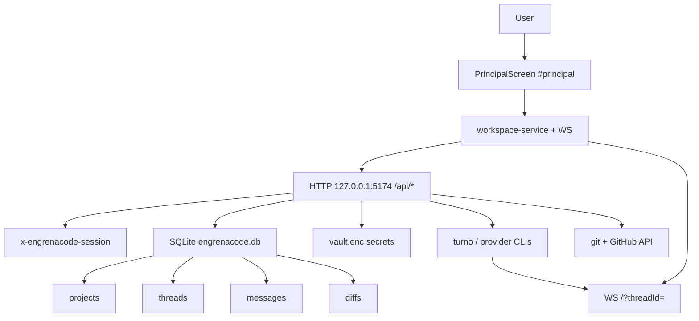

# F03. Workspace — Especificação Técnica

**Feature:** F03 Workspace  
**Complexidade:** complexo  
**Escopo:** Escopo Central (Adições Completo adiadas)  
**UI:** [`ui.md`](./ui.md)  
**Última atualização:** 2026-08-03

---

## 1. Visão Geral Técnica

**O quê:** Implementar o workspace `#principal` do EngrenaCode: cadastrar pastas locais como projetos, criar threads (Claude|Codex|Kimi + access + execution), streamar turnos via WebSocket, persistir histórico, revisar diffs **por arquivo**, commit/push/PR no GitHub com bloqueio em running, e lease `thread_busy` (1 execução longa por projeto).

**Por quê:** O produto precisa de um lugar único onde o usuário pede, revisa e promove mudanças no disco/GitHub; F01/F02 só desbloqueiam o cofre e configuram providers.

**Escopo:**

### Incluído (Escopo Central)

- UI 3 colunas `#principal` conforme [`ui.md`](./ui.md) (anatomia, copy EngrenaCode, estados)
- Projetos locais + `git init` opcional (gate antes do dispatch se sem HEAD)
- Threads: provider/modelo/access/execution; execution travado após 1º envio; provider imutável após criar
- Dispatch + follow-up + fila local quando running; cancel
- Streaming WS por `threadId`; tool calls com status; histórico persistente
- Diffs pending|accepted|rejected **por arquivo**; accept/reject por subset de paths/ids
- Git: commit, push, PR; bloqueados com thread running ou stage git
- Lease HTTP 409 `thread_busy`
- Composer gated por saúde F02 (CLI/assinatura); injeta `prompt:global` se não vazio
- PAT GitHub do vault no push/PR
- Stubs F05: contagem de skills globais + vínculos por projeto (zeros até F05); rules/subagents no turno *deferred*

### Adiado

- Contadores MCP na sidebar (após F09); chips Minimax (após F10)
- TerminalDock / CodeGraph / Memória / Pipeline / command palette completa
- CRUD completo F05–F07; `load_skill` / injeção rules / `call_subagent` reais
- F04 dashboard consumers (Provê F03 fica pronto; wiring UI dashboard deferred)

---

## 2. Impacto na Arquitetura

### Componentes afetados

| Área | Caminhos |
|------|----------|
| Renderer | `src/renderer/screens/PrincipalScreen.tsx`, hooks/workspace/*, components workspace (tree, composer, chat, diff, git, sidebars), `App.tsx` hash `#principal` |
| HTTP/WS | `src/services/http/*-handler.ts`, bootstrap em `unlock-handler` / main, novo WS upgrade na porta 5174 |
| Persistência | novo SQLite `engrenacode.db` em userData + repos |
| Vault (leitura) | `prompt:global`, `github:token`, session |
| IPC | dialog “Procurar pasta” via preload/main (browse path) |



---

## 3. Decisões Técnicas

### 3.1 Herdadas do codebase / docs canônicos

Padrões herdados de F01/F01.1/F02 e exploração do repo (sem brief `_shared` fresco):

- HTTP loopback `127.0.0.1:5174`, JSON, erros `{ error: { code, message, details? } }`
- Header `x-engrenacode-session`; marca EngrenaCode; tema `engrenacode:theme`
- Renderer em `src/renderer`; handlers em `src/services/http`
- Vitest em `src/**/*.test.ts`
- UI SDD: [`docs/F03-workspace/ui.md`](./ui.md)

Desvios desta feature: introduz **SQLite** e **WebSocket** (não presentes no greenfield hoje).

### 3.2 Específicas da feature

| Decisão | Abordagem escolhida | Alternativa | Trade-off |
|---------|---------------------|-------------|-----------|
| Persistência workspace | SQLite (`better-sqlite3`) `engrenacode.db` em userData | Só JSON files | SQL alinha legado + queries F04/F08; nova dep nativa |
| Streaming | WebSocket na mesma porta HTTP (`/?threadId=`) | SSE / poll | Menor latência; auth via protocolo/sessão |
| Accept/reject | Por arquivo (`diffIds` ou `paths`); omitido = lote | Só lote (legado UI) | Cumpre PRD; API compatível |
| Add project | Pasta sem `.git` OK; gate `git-init` antes do turno | Rejeitar não-git no add | Alinha PRD; copy modal sem `notGit` bloqueante |
| Providers MVP | Só Claude, Codex, Kimi | Catálogo legado amplo | F02 |
| Fila follow-up | localStorage `engrenacode.message-queue.v1` + drain pós-turno | Só 409 sem fila | UX da ui.md |
| F05 na UI/API | GET contagens globais + vínculos → 0/`[]` até F05 | Omitir rotas | Desbloqueia layout Ambiente sem CRUD |
| localStorage keys | Prefixo `engrenacode.*` | Manter `lioncode.*` | Marca |

### 3.3 Assumptions / recomendações aceitas

| Assumption | Origem | Pode sobrescrever? |
|------------|--------|--------------------|
| Escopo = Central only | Entrevista / recomendação skill | sim |
| Continuar sem F05–F07 implementados; F05 = contagem + vínculos stub | Entrevista | sim |
| Accept/reject por arquivo (PRD > lote legado) | Agente LionCode + PRD | sim |
| SQLite + WS como no legado | Agente LionCode + Auto-Aceitar tech nova | sim |
| UI PT-BR acentuada; `error.code` estável `thread_busy` | Agente + ui.md | sim |
| `load_skill` / rules inject / call_subagent = deferred | Entrevista F05 mínimo | sim |

Resolução das perguntas em aberto do [`ui.md`](./ui.md): ver tabela 3.2/3.3 (accept por arquivo; git init opcional; providers F02; keys `engrenacode.*`; copy PT-BR).

---

## 4. Visão Geral de Componentes

### Frontend (fonte de verdade visual: `ui.md`)

| Caminho | Novo/Mod | Propósito | Responsabilidades |
|---------|----------|-----------|-------------------|
| `src/renderer/screens/PrincipalScreen.tsx` | Novo | Tela `#principal` | Grid 3 colunas; compõe sidebars + thread + composer |
| `src/renderer/hooks/usePrincipalWorkspace.ts` | Novo | Estado elevado | seleção projeto/thread; listagens; busy |
| `src/renderer/hooks/useThreadConversation.ts` | Novo | Chat/stream | histórico, WS subscribe, deltas, tools |
| `src/renderer/hooks/useMessageQueue.ts` | Novo | Fila | persistir/editar/drenar follow-ups |
| `src/renderer/components/workspace/ProjectTree.tsx` | Novo | Sidebar esq. | árvore projetos/threads; add |
| `src/renderer/components/workspace/AddProjectModal.tsx` | Novo | Modal path | browse + validação + copy ui.md |
| `src/renderer/components/workspace/TaskComposer.tsx` | Novo | Composer | pills, send/stop, fila, git gate |
| `src/renderer/components/workspace/ChatHistory.tsx` | Novo | Aba Histórico | mensagens + tool status |
| `src/renderer/components/workspace/DiffViewer.tsx` | Novo | Aba Diff | lista por arquivo + accept/reject |
| `src/renderer/components/workspace/GitActions.tsx` | Novo | Repositório | commit/push/PR; disabled busy |
| `src/renderer/components/workspace/WorkspaceSidebar.tsx` | Novo | Sidebar dir. | Nova Thread, Ambiente (contagens stub), git |
| `src/renderer/services/workspace-service.ts` | Novo | HTTP/WS client | `/api/projects|threads|…` + WS |
| `src/renderer/App.tsx` | Mod | Hash routing | rota `#principal`; nav |

### Backend

| Caminho | Novo/Mod | Propósito |
|---------|----------|-----------|
| `src/services/db/client.ts` | Novo | better-sqlite3 + path userData |
| `src/services/db/migrations/*` | Novo | schema inicial |
| `src/services/db/repositories/{projects,threads,messages,diffs}.ts` | Novo | CRUD |
| `src/services/http/projects-handler.ts` | Novo | list/add/delete/git-init/vcs/threads list |
| `src/services/http/threads-handler.ts` | Novo | dispatch, message, history, diffs, accept, cancel, permission |
| `src/services/http/git-handler.ts` | Novo | git-text, commit, push, pr |
| `src/services/http/catalog-stub-handler.ts` | Novo | GET skills/rules/subagents counts stubs |
| `src/services/ws/thread-hub.ts` | Novo | fan-out eventos por threadId |
| `src/services/runner/turn-runner.ts` | Novo | orquestra provider CLI + lease + persist + emit |
| `src/services/http/unlock-handler.ts` | Mod | registrar rotas `/api/projects|threads|…` + upgrade WS |
| `src/main/index.ts` / preload | Mod | dialog selectDirectory |

### Banco

| Migração | Tabelas | Operação |
|----------|---------|----------|
| `001_workspace_core.sql` | `projects`, `threads`, `messages`, `tool_calls`, `diffs`, `project_leases` | CREATE |

---

## 5. Contratos de API

Autenticação: header `x-engrenacode-session` em todas as rotas abaixo (401 `unauthorized` se inválido). Prefixo `/api`.

### 5.1 Projects

**GET `/api/projects`** — lista projetos (+ flags running/diffPending resumidas).

**POST `/api/projects`**

Requisição:

| Campo | Tipo | Obrigatório | Validação |
|-------|------|-------------|-----------|
| `path` | string | sim | path existente, é diretório, legível |
| `name` | string | não | default basename |

Sucesso 201: `{ id, name, path, hasGit, hasHead }`.

Erros: `duplicate_project` 409, `not_found` 400, `not_directory` 400, `permission_denied` 400, `invalid_path` 400. **Não** exigir `.git` no add.

**DELETE `/api/projects/:id`** — 204.

**POST `/api/projects/:id/git-init`** — init + commit inicial se necessário; 200 `{ hasGit, hasHead }`.

**GET `/api/projects/:id/vcs-status`** — branch, dirty, ahead/behind (poll).

**GET `/api/projects/:id/threads`** — lista threads do projeto.

### 5.2 Dispatch / messages

**POST `/api/projects/:id/threads`** (primeiro envio / cria thread)

| Campo | Tipo | Obrigatório | Validação |
|-------|------|-------------|-----------|
| `prompt` | string | sim | non-empty, max razoável |
| `provider` | string | sim | `claude` \| `codex` \| `kimi` |
| `model` | string | sim | non-empty |
| `accessLevel` | string | sim | `supervised` \| `auto-accept-edits` \| `full-access` |
| `executionMode` | string | sim | `main` \| `worktree` |

Sucesso 201:

```json
{
  "thread": { "id": "…", "state": "running", "provider": "claude", "executionMode": "worktree" },
  "stream": { "ws": "/?threadId=…" }
}
```

Erros: `thread_busy` 409, `provider_unavailable` 400, `git_required` 400 (sem HEAD), `validation_error` 400.

**POST `/api/threads/:id/messages`** — follow-up `{ prompt }`; provider/execution já fixos; 200 + `stream.ws`; 409 `thread_busy` se running.

**GET `/api/threads/:id/history`** — mensagens + tool calls ordenados por `seq`.

**POST `/api/threads/:id/cancel`** — pede stop; estado `stopping` → idle/error.

**POST `/api/threads/:id/permission`** — Supervised: `{ decision: "allow"|"deny", requestId }`.

### 5.3 Diffs

**GET `/api/threads/:id/diffs`** — lista `{ id, path, status: pending|accepted|rejected, … }`.

**POST `/api/threads/:id/accept`**

```json
{ "action": "accept", "diffIds": ["…"] }
```

- `action`: `accept` \| `reject`
- `diffIds` ou `paths` opcional; omitido = todos `pending`
- 200 `{ applied: [], rejected: [], conflict?: { message } }`
- Grava no disco **somente** nos accepts (respeitando access level / worktree)

### 5.4 Git

Todas: 409 `thread_busy` se thread running ou lease projeto.

| Método | Path | Body (resumo) |
|--------|------|----------------|
| POST | `/api/threads/:id/git-text` | gera mensagem/branch |
| POST | `/api/threads/:id/git-commit` | `{ message? }` |
| POST | `/api/threads/:id/git-push` | — |
| POST | `/api/threads/:id/pr` | `{ title?, body? }` |

Erros git/token: `github_auth_failed` 401/400 com mensagem no fluxo git (não na config).

### 5.5 Stubs catálogo (F05 mínimo)

**GET `/api/skills/counts`** → `{ global: 0, linkedByProject: { [projectId]: 0 } }` até F05.

**GET `/api/projects/:id/skills`** → `{ items: [] }` até F05 (vínculos).

**GET `/api/projects/:id/rules`** / **`/subagents`** → `{ items: [] }` (*deferred* F06/F07; shape estável).

### 5.6 WebSocket

- Upgrade em `ws://127.0.0.1:5174/?threadId=<id>`
- Auth: token de sessão (query `session` **ou** subprotocol acordado; documentar uma opção na implementação e espelhar CORS/preload)
- Eventos (discriminated): `message.delta`, `message.done`, `tool_call.start|update|end`, `diff.ready`, `state.change`, `error`
- Ordenação por `seq` monotônico por thread

### 5.7 Erro `thread_busy`

```json
{
  "error": {
    "code": "thread_busy",
    "message": "O projeto está ocupado com outra execução. Tente novamente.",
    "details": { "threadId": "…", "ownerThreadId": "…" }
  }
}
```

UI: slot `error.threadBusy` (PT-BR) no composer/ação.

---

## 6. Modelo de Dados

SQLite `engrenacode.db` (userData). Tipos: `TEXT` ids (uuid), `INTEGER` epoch ms.

### `projects`

| Coluna | Tipo | Nullable | Descrição |
|--------|------|----------|-----------|
| `id` | TEXT | Não | PK |
| `name` | TEXT | Não | |
| `path` | TEXT | Não | absoluto, UNIQUE |
| `created_at` | INTEGER | Não | |
| `updated_at` | INTEGER | Não | |

Índice: `ux_projects_path` UNIQUE(`path`).

### `threads`

| Coluna | Tipo | Nullable | Descrição |
|--------|------|----------|-----------|
| `id` | TEXT | Não | PK |
| `project_id` | TEXT | Não | FK projects |
| `provider` | TEXT | Não | claude\|codex\|kimi |
| `model` | TEXT | Não | |
| `access_level` | TEXT | Não | |
| `execution_mode` | TEXT | Não | travado após create |
| `state` | TEXT | Não | idle\|running\|stopping\|error |
| `created_at` | INTEGER | Não | |
| `updated_at` | INTEGER | Não | |

Índices: `ix_threads_project`, `ix_threads_state`.

### `messages`

| Coluna | Tipo | Nullable | Descrição |
|--------|------|----------|-----------|
| `id` | TEXT | Não | PK |
| `thread_id` | TEXT | Não | FK |
| `role` | TEXT | Não | user\|assistant\|system |
| `content` | TEXT | Não | |
| `seq` | INTEGER | Não | |
| `created_at` | INTEGER | Não | |

### `tool_calls`

| Coluna | Tipo | Nullable | Descrição |
|--------|------|----------|-----------|
| `id` | TEXT | Não | PK |
| `thread_id` | TEXT | Não | |
| `message_id` | TEXT | Sim | |
| `name` | TEXT | Não | |
| `status` | TEXT | Não | |
| `payload_json` | TEXT | Sim | |
| `seq` | INTEGER | Não | |

### `diffs`

| Coluna | Tipo | Nullable | Descrição |
|--------|------|----------|-----------|
| `id` | TEXT | Não | PK |
| `thread_id` | TEXT | Não | |
| `path` | TEXT | Não | relativo ao repo |
| `status` | TEXT | Não | pending\|accepted\|rejected |
| `patch` | TEXT | Sim | |
| `snapshot_ref` | TEXT | Sim | |
| `updated_at` | INTEGER | Não | |

Índice: `ix_diffs_thread_status`.

### `project_leases`

| Coluna | Tipo | Nullable | Descrição |
|--------|------|----------|-----------|
| `project_id` | TEXT | Não | PK |
| `owner_thread_id` | TEXT | Não | |
| `started_at` | INTEGER | Não | |

Constraint: no máximo 1 lease por projeto (PK).

---

## 7. Estratégia de Testes

### 7.1 Unitário / Integração

| Arquivo | Tipo | Alvo |
|---------|------|------|
| `src/services/db/repositories/projects.test.ts` | Unitário | add duplicate path |
| `src/services/http/lease.test.ts` | Unitário | segundo acquire → busy |
| `src/services/http/accept-diff.test.ts` | Unitário | subset paths vs lote |
| `src/services/http/projects-handler.test.ts` | Integração leve | add sem .git OK |

| Função | Descrição | Assertions |
|--------|-----------|------------|
| `rejects_duplicate_project_path` | mesmo path | 409 `duplicate_project` |
| `lease_second_dispatch_returns_thread_busy` | 2º dispatch | 409 `thread_busy` |
| `accept_subset_only_touched_files` | `diffIds` parcial | só esses viram accepted |
| `add_project_without_git_succeeds` | pasta sem .git | 201 `hasGit:false` |
| `git_commit_blocked_when_running` | thread running | 409 |

### 7.2 Smoke / Aceitação manual

| # | Passo | Esperado |
|---|-------|----------|
| 1 | Unlock → `#principal` → Adicionar projeto | projeto na árvore |
| 2 | Nova Thread + 1º envio (Claude/Codex/Kimi logado) | thread running; stream no Histórico |
| 3 | Enter durante running | item na fila; após turno drena |
| 4 | Diff pending → Aceitar 1 arquivo → Rejeitar outro | status por arquivo; disco só no accept |
| 5 | Durante running, Commit | disabled / 409 |
| 6 | Segundo dispatch no mesmo projeto | 409 + copy thread_busy |
| 7 | Light + dark | layout 3 colunas; copy vs `ui.md` EngrenaCode |

Checklist visual: seção Aceite visual de [`ui.md`](./ui.md).

### 7.3 Cross-feature

| Critério | Status | Nota |
|----------|--------|------|
| Tokens/tema/Shiki/xterm F01.1 no Workspace | ready (ao implementar) | ui.md + F01.1 |
| Status providers F02 desabilita composer | ready | GET `/api/config/status` |
| Prompt global F02 injetado no turno | ready | vault `prompt:global` |
| Token GitHub F02 no push/PR | ready | vault no git-handler |
| Skills load_skill no turno | deferred | até F05 (stub counts only) |
| Rules injetadas no turno | deferred | até F06 |
| SubAgents call + diffs filhos | deferred | até F07 |
| Projetos/threads/diffs alimentam F04 | deferred | até F04 |
| Eventos audit F08 | deferred | até F08 |
| Preferência tema entre dashboard/config/workspace | deferred | até F04 hash trio |

### Critérios PRD §9 (aceitação F03)

- [ ] Usuário cadastra projeto, cria thread com Claude\|Codex\|Kimi, access e execution
- [ ] Execution mode trava após o primeiro envio
- [ ] Streaming, tool status e histórico persistem; follow-up enfileira com thread ocupada
- [ ] Accept/reject por arquivo; git mutável bloqueado com thread running
- [ ] Segunda execução no mesmo projeto retorna `thread_busy`
- [ ] Skills/rules/subagents no turno: *deferred* (stubs de contagem/vínculo F05); marcar integração real ao fechar F05–F07
