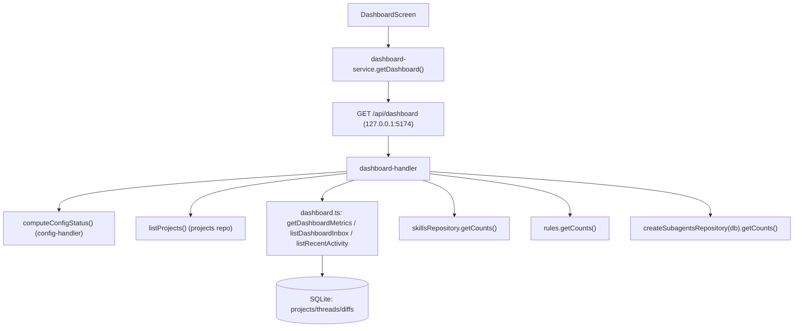

# Spec: F04. Dashboard

## 1. Visão Geral Técnica

**O quê:** Tela `#dashboard`, primeira rota pós-unlock, que agrega em uma única consulta HTTP o estado operacional do EngrenaCode: saúde da configuração (F02), contadores de projetos/threads/diffs (F03), inbox de itens que precisam de atenção, grade de projetos, resumo de catálogo (Skills/Rules/SubAgents — F05/F06/F07) e as 10 threads mais recentes. É somente leitura: não dispara turno, não aceita/rejeita diff, não faz commit/push/PR — só navega para as telas que fazem essas mutações.

**Por quê:** As demais telas (`#principal`, `#configuracao`, `#skills`, `#rules`, `#subagents`) já expõem seus próprios dados isoladamente; não existe hoje uma visão consolidada que responda "o que precisa da minha atenção agora?" sem abrir cada tela. Consolidar em uma única chamada agregada (em vez de N chamadas paralelas no client) mantém um único estado de loading/erro para a tela inteira, alinhado à linguagem de `ui.md` ("falha do fetch agregado").

**Escopo:**
- Incluído: endpoint agregador `GET /api/dashboard`; queries read-only cross-tabela (projects/threads/diffs) para métricas, inbox e atividade recente; reuso das contagens já expostas por F05/F06/F07 (`getCounts()`); reuso da saúde de config já computada por F02; tela `#dashboard` com anatomia completa de `ui.md`; refresh manual + poll 30s condicionado à visibilidade da rota.
- Excluído (fica em outras specs): contratos de dispatch de turno, accept/reject de diff, git/commit/push/PR (F03); CRUD de skills/rules/subagents (F05/F06/F07); qualquer escrita nesta tela além de navegação.
- UI: `docs/F04-dashboard/ui.md` (anatomia, tokens, estados, aceite visual) e `docs/F04-dashboard/copy.md` (strings por id) já existem e são fonte de verdade — esta spec não redefine anatomia nem copy, só o contrato de dados que os alimenta.

## 2. Impacto na Arquitetura

**Componentes afetados:**
- `src/services/db/repositories/dashboard.ts` (novo) — queries agregadas read-only.
- `src/services/db/repositories/diffs.ts` (modificado) — `countAllPending()`.
- `src/services/http/config-handler.ts` (modificado) — extrai `computeConfigStatus()` reutilizável.
- `src/services/http/dashboard-handler.ts` (novo) — router `GET /api/dashboard`.
- `src/services/http/unlock-handler.ts` (modificado) — registra a rota `/api/dashboard`.
- `src/renderer/services/dashboard-service.ts` (novo) — client HTTP + tipos.
- `src/renderer/components/MetricCard.tsx` (novo) — primitive compartilhado.
- `src/renderer/components/Skeleton.tsx` (novo) — primitive compartilhado.
- `src/renderer/screens/DashboardScreen.tsx` (novo) — tela `#dashboard`.
- `src/renderer/App.tsx` (modificado) — troca `DashboardPlaceholder` pela tela real.



## 3. Decisões Técnicas

### 3.1 Herdadas de padrões do codebase

Sem brief compartilhado (single-feature, fora de Modo Lote). Padrões observados diretamente no codebase F01–F03/F05–F07 e aplicados sem desvio:
- Servidor único `http.createServer` em `127.0.0.1:5174` (`unlock-handler.ts`), roteado por prefixo de `req.url`; cada domínio tem seu próprio `*-handler.ts` com router `async (req, res) => Promise<boolean>`.
- Guarda de auth: header `x-engrenacode-session` comparado a `vaultService.getSessionToken()`; padrão `projects-handler.ts` também checa `vaultService.isLocked()` antes (423 `vault_locked`) — dashboard segue esse padrão mais estrito, pois toda a agregação depende do cofre destravado.
- `sendJson`/`sendError` locais por handler (sem middleware compartilhado) — replicado em `dashboard-handler.ts`.
- Repositórios SQLite usam `better-sqlite3`-style `getDb().prepare(...).run/get/all()`, tabelas em snake_case mapeadas para objetos camelCase (`toThread`, `toProject`, `toDiff`).
- Screens usam objeto `COPY` local por tela com strings literais (não import de um catálogo compartilhado) — `DashboardScreen.tsx` segue o mesmo padrão, com os valores copiados 1:1 de `copy.md`.
- Client HTTP por feature em `src/renderer/services/*-service.ts` com `BASE_URL = 'http://127.0.0.1:5174'`, `headers()` injetando o session token do `localStorage`.
- F05/F06/F07 já expõem `getCounts()` nos repositórios (`skillsRepository.getCounts()`, `rules.ts getCounts()`, `subagents.ts createSubagentsRepository(db).getCounts()`) — comentados no código-fonte como preparados para F04. Reutilizados diretamente (chamada in-process, não HTTP self-call).

Desvios desta feature: nenhum.

### 3.2 Específicas da feature

| Decisão | Abordagem escolhida | Alternativa considerada | Trade-off |
|---|---|---|---|
| Forma da API | Um único `GET /api/dashboard` agregando tudo server-side | N chamadas paralelas no client (`/api/config/status` + `/api/projects` + ...) reduzidas no front | Um único round-trip e um único estado de erro/loading (alinhado a `ui.md`); em troca, o handler fica mais espesso e qualquer falha parcial de uma sub-fonte derruba a tela inteira — aceitável no MVP local-first (todas as fontes são SQLite local, sem I/O de rede externo) |
| Classificação de kind da inbox | Precedência por thread: `pendingDiff` (existe diff `status='pending'` para a thread) > `error` (`state='error'`) > `running` (`state='running'`); threads em outros estados (`idle`, `committed`, `stopping`) não entram na inbox | Um thread poderia gerar dois itens de inbox (um por diff pendente, outro por erro) | Um item por thread evita duplicar a mesma linha na lista; a tab de destino ao clicar (Diff vs Histórico) segue o `kind` resultante, conforme mapa de clique de `ui.md` |
| Ordenação/cap da inbox | Tier fixo `setupIncompleto(0) > error(1) > pendingDiff(2) > running(3)`, desempate por `updated_at DESC` dentro do tier; item `setupIncompleto` é sintético (não vem do banco) e é prependado antes do corte; lista final cortada em 20 | Ordenar só por `updated_at` cross-kind | Prioriza o que é mais urgente para o usuário agir, conforme sugestão registrada em `ui.md` § Perguntas em aberto |
| Saúde (`health.*`) para a strip de 4 dots | Deriva de `computeConfigStatus()`: `claude` = `providers.claude.available` (`ok`/`warn`); `clis` = `providers.codex.available \|\| providers.kimi.available` (`ok`/`warn`); `github` = `github.tokenPresent` (`ok`/`warn`); `prompt` = `prompt.isEmpty ? 'off' : 'ok'` | Reexpor os 3 CLIs individualmente na strip do dashboard | `ui.md` pede só 4 dots (Claude/CLIs/GitHub/prompt), não por-CLI; mantém paridade de semântica com `#configuracao` sem inflar a anatomia |
| Reuso de `computeConfigStatus()` | Extrair o corpo de `handleGetStatus` (`config-handler.ts`) para uma função exportada `computeConfigStatus(): Promise<ConfigStatus>`, chamada tanto por `GET /api/config/status` quanto por `dashboard-handler.ts` | Duplicar a lógica de detecção de CLI/keys/prompt dentro de `dashboard-handler.ts` | Elimina duplicação e drift entre as duas superfícies que mostram a mesma saúde; `handleGetStatus` vira um wrapper fino (`sendJson(res, 200, await computeConfigStatus())`) |
| Cache/agregação em memória | Nenhuma — cada `GET /api/dashboard` recalcula tudo a partir do SQLite/detecção de CLI a cada chamada | Cache com TTL de alguns segundos | Volume local-first é baixo (dezenas de projetos/threads); cache adicionaria estado a invalidar sem ganho mensurável no MVP |

### 3.3 Assumptions

| Assumption | Origem | Pode sobrescrever? |
|---|---|---|
| `health.setupIncomplete = true` quando nenhum provider de execução está disponível (`!claude.available && !codex.available && !kimi.available`) OU `!github.tokenPresent` | PRD F02/F04 não fixam critério exato; inferido da métrica de produto "≥80% conectam ≥1 provider + token GitHub em 15min" (PRD §3) | sim |
| `catalog.skills` no resumo = só contagem global (`skillsRepository.getCounts().global`), sem somar vínculos por projeto | Resposta do usuário na entrevista (recomendado) | sim |
| "Últimas 10 threads" inclui threads em qualquer `state`, inclusive `running` (pode aparecer também na inbox) | Resposta do usuário na entrevista (recomendado) | sim |
| Tile de projeto sem thread recente: clique abre `#principal` só com o projeto selecionado, sem thread; resposta não carrega `lastThreadId` por projeto | Menor risco, evita navegação surpresa para uma thread antiga; item ainda aberto em `ui.md` § Perguntas em aberto — decisão de spec técnica, não bloqueia UI | sim |
| `dashboard.projects` (grade) retorna todos os projetos cadastrados, sem paginação/corte | `ui.md` não define teto para a grade (só a inbox e a atividade recente têm cap) | sim |
| Formato de "idade relativa" (`{relativeAge}` em `copy.md`) é responsabilidade do client a partir do `updatedAt` (epoch ms) devolvido pela API — a API nunca formata string relativa | Consistente com `createdAt`/`updatedAt` crus já devolvidos por `projects`/`threads` em outras rotas | sim |

## 4. Visão Geral de Componentes

**Frontend:**

| Caminho do Arquivo | Novo/Modificado | Propósito | Responsabilidades-Chave |
|---|---|---|---|
| `src/renderer/screens/DashboardScreen.tsx` | Novo | Tela `#dashboard` | Monta a anatomia de `ui.md` (health, 4 metric cards, inbox, grade, catálogo, atividade); fetch on-mount + poll 30s pausado quando a aba está oculta/rota muda; navegação via `window.location.hash` conforme mapa de clique |
| `src/renderer/services/dashboard-service.ts` | Novo | Client HTTP | `getDashboard(): Promise<DashboardResponse>`; tipos `DashboardResponse`, `DashboardInboxItem`, `DashboardRecentItem` |
| `src/renderer/components/MetricCard.tsx` | Novo | Primitive compartilhado | Label + valor numérico grande; reutilizável por F11 (Consumo) quando implementada |
| `src/renderer/components/Skeleton.tsx` | Novo | Primitive compartilhado | Bloco `bg-surface-2` com pulse para estado `loading` |
| `src/renderer/App.tsx` | Modificado | Routing | Troca `DashboardPlaceholder` por `<DashboardScreen />` na branch `hash === '#dashboard' \|\| hash === ''` |

**Backend:**

| Caminho do Arquivo | Novo/Modificado | Propósito | Responsabilidades-Chave |
|---|---|---|---|
| `src/services/db/repositories/dashboard.ts` | Novo | Queries agregadas read-only | `getDashboardMetrics()`, `listDashboardInbox(limit)`, `listRecentActivity(limit)` |
| `src/services/db/repositories/diffs.ts` | Modificado | Contagem global | `countAllPending(): number` |
| `src/services/http/config-handler.ts` | Modificado | Reuso de saúde | Extrai `computeConfigStatus()` exportado; `handleGetStatus` vira wrapper fino |
| `src/services/http/dashboard-handler.ts` | Novo | Router HTTP | `handleDashboardRequest(req, res)`: guarda vault/session, monta e devolve `DashboardResponse` |
| `src/services/http/unlock-handler.ts` | Modificado | Wiring | Registra `req.url?.startsWith('/api/dashboard')` → `handleDashboardRequest` |

**Banco de Dados:** sem migração — todas as queries usam as tabelas `projects`, `threads`, `diffs` já criadas por `002_workspace_core.ts`; os índices existentes (`ix_threads_state`, `ix_diffs_thread_status`) já cobrem os filtros usados (ver §6).

## 5. Contratos de API

### Endpoint: Agregado do Dashboard

- **Método:** GET
- **Caminho:** `/api/dashboard`
- **Autenticação:** header `x-engrenacode-session` (mesmo padrão de `projects-handler.ts`); cofre deve estar destravado

**Requisição:** sem query params, sem body.

**Resposta (Sucesso — 200):**

| Campo | Tipo | Descrição |
|---|---|---|
| `health.claude` | `'ok' \| 'warn'` | Dot da strip — Claude disponível (assinatura logada ou key salva conforme modo) |
| `health.clis` | `'ok' \| 'warn'` | Dot — pelo menos um de Codex/Kimi disponível |
| `health.github` | `'ok' \| 'warn'` | Dot — token GitHub presente |
| `health.prompt` | `'ok' \| 'off'` | Dot — prompt global não vazio |
| `health.setupIncomplete` | `boolean` | Controla banner + item sintético `setupIncomplete` na inbox (ver §3.3) |
| `metrics.projects` | `number` | Total de projetos cadastrados |
| `metrics.running` | `number` | Threads com `state = 'running'` |
| `metrics.pendingDiffs` | `number` | Diffs com `status = 'pending'`, todas threads |
| `metrics.errors` | `number` | Threads com `state = 'error'` |
| `inbox[].kind` | `'setupIncomplete' \| 'error' \| 'pendingDiff' \| 'running'` | Ver §3.2 para regra de classificação/precedência |
| `inbox[].threadId` | `string \| null` | `null` só para o item sintético `setupIncomplete` |
| `inbox[].projectId` | `string \| null` | idem |
| `inbox[].projectName` | `string \| null` | idem |
| `inbox[].title` | `string \| null` | Título da thread (`Thread.title`) ou `null` |
| `inbox[].provider` | `string \| null` | `'claude' \| 'codex' \| 'kimi' \| 'minimax' \| null` |
| `inbox[].updatedAt` | `number \| null` | epoch ms; `null` no item sintético |
| `projects[]` | `Project[]` | Mesmo shape de `GET /api/projects` (`id`, `path`, `name`, `createdAt`, `updatedAt`) |
| `catalog.skills` | `number` | `skillsRepository.getCounts().global` |
| `catalog.rules` | `number` | `rules.getCounts().global` |
| `catalog.subagents` | `number` | `subagents.getCounts().global` |
| `recent[].threadId` | `string` | |
| `recent[].projectId` | `string` | |
| `recent[].projectName` | `string` | |
| `recent[].title` | `string \| null` | |
| `recent[].provider` | `string` | |
| `recent[].state` | `ThreadState` | `'running' \| 'idle' \| 'committed' \| 'error' \| 'stopping'` |
| `recent[].updatedAt` | `number` | epoch ms |

**Exemplo de Resposta:**
```json
{
  "health": { "claude": "ok", "clis": "warn", "github": "ok", "prompt": "ok", "setupIncomplete": false },
  "metrics": { "projects": 3, "running": 1, "pendingDiffs": 2, "errors": 1 },
  "inbox": [
    { "kind": "error", "threadId": "thr_a1", "projectId": "proj_1", "projectName": "engrena-code", "title": "Refactor vault", "provider": "claude", "updatedAt": 1738700000000 },
    { "kind": "pendingDiff", "threadId": "thr_b2", "projectId": "proj_1", "projectName": "engrena-code", "title": null, "provider": "codex", "updatedAt": 1738699000000 },
    { "kind": "running", "threadId": "thr_c3", "projectId": "proj_2", "projectName": "site-marketing", "title": "Landing hero", "provider": "kimi", "updatedAt": 1738698000000 }
  ],
  "projects": [
    { "id": "proj_1", "path": "C:\\dev\\engrena-code", "name": "engrena-code", "createdAt": 1738000000000, "updatedAt": 1738700000000 }
  ],
  "catalog": { "skills": 5, "rules": 3, "subagents": 2 },
  "recent": [
    { "threadId": "thr_a1", "projectId": "proj_1", "projectName": "engrena-code", "title": "Refactor vault", "provider": "claude", "state": "error", "updatedAt": 1738700000000 }
  ]
}
```

**Códigos de Erro:**

| Código | Status HTTP | Descrição |
|---|---|---|
| `vault_locked` | 423 | Cofre local travado — mesmo padrão de `projects-handler.ts` |
| `unauthorized` | 401 | Header de sessão ausente/inválido |
| `internal_error` | 500 | Falha inesperada ao agregar (query SQLite, detecção de CLI, etc.) — client mapeia para `error.generic`/`error.network` de `copy.md` |

## 6. Modelo de Dados

Sem novas tabelas nem colunas. Queries agregadas leem `projects`, `threads`, `diffs` (schema em `src/services/db/migrations/002_workspace_core.ts`).

**Índices reutilizados (sem migração nova):**

| Nome do Índice | Colunas | Uso pelo dashboard |
|---|---|---|
| `ix_threads_state` | `threads(state)` | `metrics.running`, `metrics.errors`, classificação `error`/`running` da inbox |
| `ix_diffs_thread_status` | `diffs(thread_id, status)` | subquery correlacionada `EXISTS (... WHERE thread_id = t.id AND status = 'pending')` usada em `metrics.pendingDiffs` e na classificação `pendingDiff` da inbox |

**Query ilustrativa — classificação e ordenação da inbox** (`dashboard.ts`, não recopiar em `plan.md`):
```sql
SELECT * FROM (
  SELECT t.id AS thread_id, t.project_id, p.name AS project_name, t.title, t.provider, t.state, t.updated_at,
    CASE
      WHEN EXISTS (SELECT 1 FROM diffs d WHERE d.thread_id = t.id AND d.status = 'pending') THEN 'pendingDiff'
      WHEN t.state = 'error' THEN 'error'
      WHEN t.state = 'running' THEN 'running'
    END AS kind
  FROM threads t
  JOIN projects p ON p.id = t.project_id
) WHERE kind IS NOT NULL
ORDER BY CASE kind WHEN 'error' THEN 0 WHEN 'pendingDiff' THEN 1 WHEN 'running' THEN 2 END, updated_at DESC
LIMIT ?
```

Volume esperado (app local-first, single-user): dezenas de projetos, poucas centenas de threads/diffs — scan completo em `diffs`/`threads` é aceitável sem índice adicional.

## 7. Estratégia de Testes

### 7.1 Unitário / Integração

| Arquivo de Teste | Tipo | Alvo | Objetivo |
|---|---|---|---|
| `src/services/db/repositories/dashboard.test.ts` | Unitário | `dashboard.ts` | Métricas, classificação e ordenação da inbox, atividade recente |
| `src/services/db/repositories/diffs.test.ts` | Unitário (extensão do arquivo existente) | `countAllPending` | Contagem global cross-thread |
| `src/services/http/dashboard-handler.test.ts` | Integração | `handleDashboardRequest` | Guardas de auth/vault, shape agregado, `setupIncomplete` |
| `src/services/http/config-handler.test.ts` | Regressão (extensão do arquivo existente) | `computeConfigStatus` | `GET /api/config/status` continua 200 com o mesmo shape após o refactor |

| Função de Teste | Descrição | Assertions |
|---|---|---|
| `getDashboardMetrics_countsAcrossAllProjects` | 2 projetos, threads mistas | `projects=2`, `running`/`errors` somam as duas |
| `listDashboardInbox_classifiesPendingDiffOverError` | Thread `state='error'` com diff `pending` | Item resultante tem `kind='pendingDiff'`, aparece uma única vez |
| `listDashboardInbox_sortsByTierThenRecency` | Itens error/pendingDiff/running com `updatedAt` variados | Ordem = tier fixo, desempate por `updatedAt desc` |
| `listDashboardInbox_respectsLimit` | 25 threads elegíveis | Retorna no máximo `limit` itens |
| `listDashboardInbox_excludesIdleAndCommitted` | Threads `idle`/`committed` sem diff pendente | Não aparecem na lista |
| `listRecentActivity_ordersByUpdatedAtDescAcrossProjects` | Threads de projetos distintos | Top N por `updatedAt desc`, inclui `running` |
| `countAllPending_sumsAcrossThreads` | Diffs pending em 2 threads diferentes | Soma correta, ignora `accepted`/`rejected` |
| `handleDashboardRequest_401WithoutSession` | Sem header | `401 unauthorized` |
| `handleDashboardRequest_423WhenVaultLocked` | Cofre travado | `423 vault_locked` |
| `handleDashboardRequest_200AggregatesAllSections` | Fixture com projeto/thread/diff/skill/rule/subagent | Shape completo: `health`, `metrics`, `inbox`, `projects`, `catalog`, `recent` |
| `handleDashboardRequest_setupIncompleteTrueWhenNoProviderNoGithub` | Nenhum provider disponível, sem token GitHub | `health.setupIncomplete === true` e item sintético presente na `inbox[0]` |
| `computeConfigStatus_matchesPreviousHandleGetStatusShape` | Fixture idêntica ao teste pré-existente de `config-handler.test.ts` | `GET /api/config/status` devolve o mesmo shape de antes do refactor |

### 7.2 Smoke / Aceitação manual

| # | Passo | Resultado esperado |
|---|---|---|
| 1 | Desbloquear cofre com pelo menos 1 projeto, 1 thread `running`, 1 diff `pending`, 1 thread `error` | App abre em `#dashboard` (não `#principal`); anatomia completa renderiza na ordem de `ui.md` |
| 2 | Clicar **Atualizar** | Botão fica disabled durante o fetch; conteúdo permanece visível (estado `refreshing`); dados atualizam |
| 3 | Clicar item de inbox `kind=pendingDiff` | Navega para `#principal` com projeto/thread corretos, aba **Diff** ativa |
| 4 | Clicar item de inbox `kind=running` | Navega para `#principal` com projeto/thread corretos, aba **Histórico** ativa |
| 5 | Clicar contador **Skills**/**Rules**/**SubAgents** no resumo de catálogo | Navega para `#skills`/`#rules`/`#subagents` respectivamente |
| 6 | Zerar projetos/threads/diffs no fixture, recarregar | `empty.projects` na grade + `empty.inbox` na inbox, sem erro |
| 7 | Derrubar o servidor local (`unlock-handler`) antes do fetch | Tela mostra `error.network` + botão **Tentar novamente** (`copy.md`) |
| 8 | Deixar `#dashboard` aberto por 30s+ | Poll dispara automaticamente sem interação; navegar para outra rota interrompe o poll (checar via log/network) |
| 9 | Conferir tema `light` e `dark` | Tokens de `ui.md` aplicados (`bg-bg`, `bg-surface`, `border-border`, `text-fg`/`text-muted`, `accent`, `amber`, `red`, `green`); nenhum hex solto |
| 10 | Conferir strings renderizadas contra `docs/F04-dashboard/copy.md` | Todos os ids com texto fechado batem literalmente; nenhum `TODO` de copy aparece em runtime |

### 7.3 Cross-feature

| Critério | Status | Nota |
|---|---|---|
| F02 alimenta saúde do Dashboard (PRD §9) | ready | `computeConfigStatus()` já implementado e testado em `config-handler.test.ts` |
| F03 alimenta cards/inbox do Dashboard com projetos/threads/diffs (PRD §9) | ready | Core de F03 implementado (197 testes verdes); smoke visual de F03 ainda pendente por conta própria, não bloqueia esta spec |
| Deep-link inbox/atividade → `#principal` com projeto+thread+aba correta | ready | Rotas de hash já existentes em `App.tsx`; F03 decide o conteúdo da aba |
| F05/F06/F07 alimentam contagens do resumo de catálogo (PRD §9) | ready | `getCounts()` já implementado e testado em cada repositório |
| Tokens/padrões de superfície F01.1 renderizam o Dashboard (PRD §9) | ready | F01.1 feito; `ui.md` já mapeia os tokens usados |
