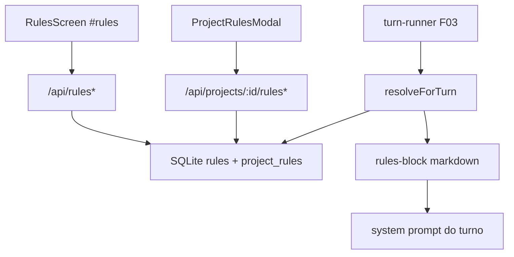

# F06. Rules — Especificação Técnica

**Feature:** F06 Rules  
**Complexidade:** médio  
**Escopo:** feature completa (PRD sem divisão Central/Completo)  
**UI:** [`ui.md`](./ui.md)  
**Última atualização:** 2026-08-03

---

## 1. Visão Geral Técnica

**O quê:** Catálogo de rules markdown (globais e por projeto) com CRUD em `#rules`, vínculo/supressão por projeto no Workspace, resolução live e injeção do bloco de rules em todo turno do agente (antes do system prompt da thread).

**Por quê:** Padrões permanentes deixam de ser colados a cada conversa; o lead controla override local sem poluir o contexto.

**Escopo:**

### Incluído

- CRUD: `name` (sem CR/LF/C0), `description?`, `content` markdown (~1 MiB prático), `category?`, `enabled`, `isGlobal`
- Unicidade global de `name`; 409 em conflito
- Não-global: só projetos com vínculo `enabled=1`
- Global: default-on em todos os projetos; override off via `project_rules.enabled=0`
- Precedência declarada no bloco: projeto > global > `CLAUDE.md`/`AGENTS.md` do repo
- Soft warning ≤ 15 rules ativas por projeto (não bloqueia)
- Soft warn tamanho (~8 KB/rule, ~16 KB agregado) — orientação UI
- Tela `#rules` + modal de projeto no F03 (Repo Harness)
- Contagens para F04 (`GET` agregado)
- Resolve interno no runner (sem endpoint público de resolve)
- Cofre travado: sem resolução no turno (401/423 nas rotas; runner não injeta)

### Adiado / fora

- Hard cap 15; drag-and-drop de `sortOrder` na UI; export/import; marketplace
- Rules com tools/provider/MCP; audit CRUD em F08
- Seed de rules default (opcional pós-MVP; não Must)

---

## 2. Impacto na Arquitetura

| Área | Caminhos |
|------|----------|
| Renderer | `RulesScreen`, `RuleFormModal`, `ProjectRulesModal`, `rules-service`, nav `#rules` em `App.tsx` |
| HTTP | `src/services/http/rules-handler.ts` registrado no server loopback |
| DB | tabelas `rules`, `project_rules` em `engrenacode.db` (migração; F03 introduz SQLite se ainda não existir) |
| Runner | `rule-registry` + `rules-block` chamados no dispatch F03 |



---

## 3. Decisões Técnicas

### 3.1 Herdadas

Padrões F01/F01.1/F02 (+ F03 SQLite/WS quando presente): sessão `x-engrenacode-session`, erros `{ error: { code, message } }`, Vitest, tokens Design Lock, marca EngrenaCode.

### 3.2 Específicas

| Decisão | Escolhida | Alternativa | Trade-off |
|---------|-----------|-------------|-----------|
| Cap ≤15 | Soft warning UI | Hard 400 | Alinha PRD “recomendação” + legado |
| Semântica `project_rules` | D1/D2: ausência de linha = global ON / local OFF | Exigir linha sempre | Menos rows; default-on global |
| Unicidade name | Global na tabela `rules` | Por escopo projeto | Simples; 409 claro |
| Resolve | Só no runner, live query | Endpoint + cache | Evita cache stale |
| Ordem bloco | Globais `name ASC` depois projeto `sort_order, name` | Só name | Precedência declarada no texto |
| Persistência | SQLite (mesmo DB F03) | Vault JSON | Escala + F04 counts |

### 3.3 Assumptions (recomendações aceitas)

| Assumption | Origem |
|------------|--------|
| Sem pergunta Central/Completo — PRD sem split | skill |
| Soft cap 15 (fecha aberto do SDD Reversa) | Auto-Aceitar + legado |
| Modelo D1/D2 e endpoints espelhando LionCodeLabs | agente limpo + legado |
| UI anatomia em `ui.md`; Design Lock tokens | CLAUDE / F01.1 |
| Wiring modal F03 pode seguir `#rules` se Workspace ainda stub | ordem Onda 2 |
| Substitui stub vazio de rules em F03 §5.5 | handoff F03 |

---

## 4. Visão Geral de Componentes

### Frontend

| Caminho | Novo/Mod | Propósito |
|---------|----------|-----------|
| `src/renderer/screens/RulesScreen.tsx` | Novo | Lista CRUD `#rules` |
| `src/renderer/components/rules/RuleFormModal.tsx` | Novo | Create/edit |
| `src/renderer/components/rules/ProjectRulesModal.tsx` | Novo | Vínculo/supressão (F03) |
| `src/renderer/components/rules/ruleForm.logic.ts` | Novo | Validação name/chars + KB warn |
| `src/renderer/services/rules-service.ts` | Novo | Cliente HTTP |
| `src/renderer/App.tsx` | Mod | Hash `#rules` + nav |

### Backend

| Caminho | Novo/Mod | Propósito |
|---------|----------|-----------|
| `src/services/db/migrations/00N_rules.sql` | Novo | `rules` + `project_rules` |
| `src/services/db/repositories/rules.ts` | Novo | CRUD + links + resolve query |
| `src/services/http/rules-handler.ts` | Novo | Rotas §5 |
| `src/services/runner/rule-registry.ts` | Novo | `resolveForTurn(projectId)` |
| `src/services/runner/rules-block.ts` | Novo | Compose markdown EngrenaCode |
| `src/services/http/unlock-handler.ts` (ou router) | Mod | Registrar `/api/rules*` |
| `src/services/runner/turn-runner.ts` | Mod | Injetar bloco quando F03 existir |

---

## 5. Contratos de API

Auth: `x-engrenacode-session`. Prefixo `/api`.

### CRUD

| Método | Path | Notas |
|--------|------|-------|
| GET | `/api/rules` | `{ rules: Rule[] }` |
| POST | `/api/rules` | body create → 201 `{ rule }` |
| PUT | `/api/rules/:id` | parcial → `{ rule }` |
| DELETE | `/api/rules/:id` | cascade `project_rules` → `{ deleted: true }` |

**Create/Update body:**

| Campo | Tipo | Obrigatório | Validação |
|-------|------|-------------|-----------|
| `name` | string | create: sim | non-empty; sem `\u0000-\u001F`/`\u007F` |
| `content` | string | create: sim | non-empty; teto prático ~1 MiB |
| `description` | string | não | |
| `category` | string | não | |
| `isGlobal` | boolean | não | default false |
| `enabled` | boolean | não | default true |

**Erros:** `validation_error` 400, `rule_not_found` 404, `rule_name_conflict` 409, `unauthorized` 401, `vault_locked` 423.

### Projeto

| Método | Path | Body | Notas |
|--------|------|------|-------|
| GET | `/api/projects/:id/rules` | — | `{ rules: RuleLinkState[] }` |
| PUT | `/api/projects/:id/rules/:ruleId` | `{ enabled?, sortOrder? }` | upsert link / suppress |
| DELETE | `/api/projects/:id/rules/:ruleId` | — | remove linha (global volta ao default-on) |

### Contagens (F04)

**GET `/api/rules/counts`** → `{ global: number, linkedByProject: Record<string, number>, activeByProject: Record<string, number> }`.

### Tipos (conceituais)

```typescript
interface Rule {
  id: string
  name: string
  description: string | null
  content: string
  category: string | null
  isGlobal: boolean
  enabled: boolean
  createdAt: number
  updatedAt: number
}

interface RuleLinkState extends Rule {
  linked: boolean      // existe row project_rules
  projectEnabled: boolean | null  // enabled da row; null se sem row
  activeForProject: boolean       // resultado após D1/D2
  sortOrder: number | null
}
```

### Resolve (interno)

Query ativa para `projectId`:

- `rules.enabled = 1` AND
- (global AND `COALESCE(project_rules.enabled, 1) = 1`) OR (não-global AND `project_rules.enabled = 1`)

Compose: se zero → `null` (não injeta). Senão bloco:

```markdown
## Regras do dono (EngrenaCode Rules)
Precedência: projeto > global > CLAUDE.md/AGENTS.md do repositório > convenções gerais.
--- rule: <name> [global|projeto] ---
<content sanitizado>
--- fim das regras ---
```

Injetar **antes** do system prompt da thread / prompt global F02, em todo turno do projeto.

---

## 6. Modelo de Dados

### `rules`

| Coluna | Tipo | Nullable | Padrão | Descrição |
|--------|------|----------|--------|-----------|
| `id` | TEXT | Não | — | PK |
| `name` | TEXT | Não | — | UNIQUE |
| `description` | TEXT | Sim | — | |
| `content` | TEXT | Não | — | markdown |
| `category` | TEXT | Sim | — | |
| `is_global` | INTEGER | Não | 0 | 0/1 |
| `enabled` | INTEGER | Não | 1 | kill-switch |
| `created_at` | INTEGER | Não | — | epoch ms |
| `updated_at` | INTEGER | Não | — | epoch ms |

Índice: `ux_rules_name` UNIQUE(`name`).

### `project_rules`

| Coluna | Tipo | Nullable | Descrição |
|--------|------|----------|-----------|
| `project_id` | TEXT | Não | PK composta; FK projects ON DELETE CASCADE |
| `rule_id` | TEXT | Não | PK composta; FK rules ON DELETE CASCADE |
| `enabled` | INTEGER | Não | ver D1/D2 |
| `sort_order` | INTEGER | Não | default 0 |

---

## 7. Estratégia de Testes

### 7.1 Unitário / Integração

| Arquivo | Alvo |
|---------|------|
| `src/services/db/repositories/rules.test.ts` | CRUD, conflict, D1/D2 resolve |
| `src/services/runner/rules-block.test.ts` | compose null, delimiters, sanitize |
| `src/renderer/components/rules/ruleForm.logic.test.ts` | name chars, KB warn |

| Função | Assertions |
|--------|------------|
| `rejects_name_with_crlf` | 400 `validation_error` |
| `rejects_duplicate_name` | 409 `rule_name_conflict` |
| `global_default_on_without_row` | resolve inclui global |
| `global_suppressed_when_enabled_0` | resolve exclui |
| `project_rule_requires_link_enabled` | sem row → fora |
| `compose_returns_null_when_empty` | `null` |
| `compose_uses_engrenacode_heading` | sem LionCode |

### 7.2 Smoke / Aceitação

| # | Passo | Esperado |
|---|-------|----------|
| 1 | `#rules` → Nova rule global | aparece na lista com badge Global |
| 2 | Name com Enter | erro chars; não salva |
| 3 | Name duplicado | 409 / copy conflito |
| 4 | Workspace: suprimir global no projeto | turno seguinte sem essa rule (quando runner F03) |
| 5 | Vincular rule local | entra no bloco do projeto |
| 6 | >15 ativas | aviso âmbar; save ainda ok |
| 7 | Light/dark + copy vs `ui.md` | EngrenaCode |

### 7.3 Cross-feature

| Critério | Status | Nota |
|----------|--------|------|
| Tokens F01.1 em `#rules` | ready | |
| Sessão/vault F01 | ready | |
| Bloco injetado no turno F03 | deferred | até turn-runner F03 consumir registry |
| Contagens no Dashboard F04 | deferred | até F04 |
| Modal no Workspace F03 | deferred/peer | UI modal pode aterrissar com F03 |

### Critérios PRD §9

- [ ] Rules globais e por projeto resolvem com override de supressão
- [ ] Bloco de rules aparece em todo turno com precedência projeto > global > arquivos do repo
- [ ] Name com CR/LF é rejeitado
