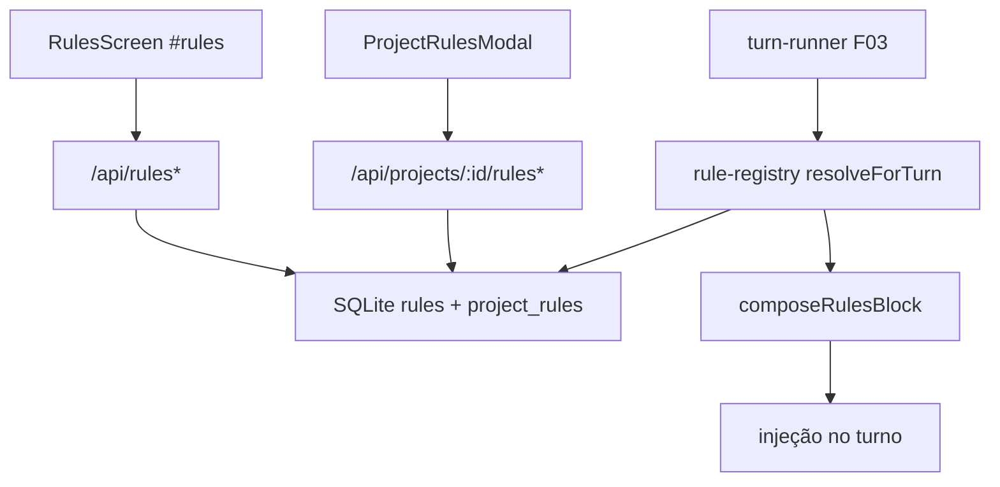

# F06. Rules — Especificação Técnica

**Feature:** F06 Rules  
**Complexidade:** médio  
**Escopo:** feature completa (PRD sem divisão Central/Completo)  
**UI:** [`ui.md`](./ui.md) · Copy: [`copy.md`](./copy.md)  
**Última atualização:** 2026-08-03

---

## 1. Visão Geral Técnica

**O quê:** Catálogo de rules markdown com CRUD em `#rules`, semântica dual por projeto (globais default-on com override de supressão; não-globais só com vínculo explícito), e entrega do bloco markdown resolvido para injeção em **todo turno** (F03).

**Por quê:** Instruções permanentes do dono entram no contexto sem o modelo precisar invocar tool; override por projeto evita poluir um repo sem abandonar a rule global.

**Escopo:**

### Incluído

- CRUD: `name` único global (sem CR/LF/controle), `description?`, `content` markdown, `category?`, `enabled`, `isGlobal`
- Não-global: só projetos com row em `project_rules`; global: todos os projetos por default, supressão via row `enabled=0` (reativar = DELETE da row)
- Soft warn UI ≤15 rules ativas/projeto; soft warn content >8 KB; soft warn agregado >16 KB; hard block content ~1 MiB (UI + server)
- Bloco `composeRulesBlock` / `RuleRegistry.resolveForTurn` para F03 (eager, não MCP tool)
- Contagens para F04 (`GET /api/rules/counts`)
- Tela `#rules` + `ProjectRulesModal` (Repo Harness F03) conforme ui.md/copy.md

### Adiado / fora

- Reorder drag-and-drop de rules (há `sort_order` no vínculo; sem `/catalog-order` nesta feature)
- Layout dos cards de contagem no Dashboard (F04 consumidor)
- Copy de UI sobre precedência vs `CLAUDE.md`/`AGENTS.md` (fica só no preamble do bloco runtime)
- Merge do conteúdo de `CLAUDE.md`/`AGENTS.md` no bloco (só mencionados na precedência textual)

---

## 2. Impacto na Arquitetura

| Área | Caminhos |
|------|----------|
| Renderer | `RulesScreen`, `RuleFormModal`, `ProjectRulesModal`, `ruleForm.logic`, `rules-service`, `#rules` em `App.tsx` |
| HTTP | `src/services/http/rules-handler.ts` |
| DB | `rules`, `project_rules` em `engrenacode.db` |
| Runner | `rule-registry` + `rules-block` consumidos pelo turn-runner F03 |



---

## 3. Decisões Técnicas

### 3.1 Herdadas

F01 sessão `x-engrenacode-session` + `vault_locked` 423; F01.1 tokens/superfícies; F02 padrões HTTP/erro envelope `{ error: { code, message } }`; SQLite alinhado a F03/F05 (INTEGER epoch ms); Vitest colocalizado; marca EngrenaCode; espelho de layout F05 (`screens/` + `components/rules/` + `services/http/` + `db/repositories/`).

### 3.2 Específicas

| Decisão | Escolhida | Alternativa | Trade-off |
|---------|-----------|-------------|-----------|
| Cap ≤15 ativas | Soft warn UI `rulesLink.warn.activeCap` | Hard 400 / omitir | PRD “recomendação”; LionCode não tinha warn de count |
| Content 8 KB | Soft warn âmbar | Hard | Custo de contexto sem bloquear edição |
| Content 1 MiB | Hard block UI+server | Só soft 8 KB (legado) | Alinha PRD “~1 MiB” + Skills; teto HTTP |
| Agregado 16 KB | Soft warn rodapé/harness | Hard | Aviso de turno gordo |
| Globais | Default-on; override = row `enabled=0`; reativar = DELETE | Upsert enabled=1 | Ausência = ativo (canônico) |
| Modal projeto | `ProjectRulesModal` dedicado | `ProjectLinkingModal` genérico | Semântica oposta a skills |
| Description | Opcional (`null`) | Obrigatória como Skills | Catálogo de rules ≠ catálogo de tool |
| sort_order | Persistido no link; sem UI reorder | `/catalog-order` | Ordem determinística no bloco |
| Precedência UI | Sem copy de CLAUDE.md/AGENTS.md | Subtítulo explícito | Runtime preamble basta |
| Copy | PT-BR acentuado (`copy.md`) | Byte-a-byte legado | Produto EngrenaCode |
| Counts | `GET /api/rules/counts` | Só agregação client | Provê F04 |

### 3.3 Assumptions

| Assumption | Origem | Pode sobrescrever? |
|------------|--------|--------------------|
| Pasta `docs/F06-rules/` (kebab PRD “Rules”) — já correta | skill sanitizar kebab | sim |
| Frontend = ui.md + copy.md (anatomia, estados, ids) | pedido usuário | não nesta spec |
| Soft cap 15 + hard 1 MiB + PT-BR + sem copy CLAUDE.md na UI | entrevista via agente LionCodeLabs + PRD | sim |
| Timestamps INTEGER epoch ms (não TEXT `datetime('now')` do legado) | padrão F05 greenfield | sim |
| Prefixo `/api` nos paths (não `/rules` bare do legado) | padrão EngrenaCode F02/F05 | não |
| Substitui stubs F03 de rules quando existirem | handoff F03 | sim |
| Wiring do bloco no runner deferred até F03 runner existir | Onda 2/3 | sim |
| Bootstrap SQLite nesta feature se ainda ausente (compartilhado F03/F05) | codebase sem `src/db/` | sim |

---

## 4. Visão Geral de Componentes

### Frontend (ui.md + copy.md)

| Caminho | Novo/Mod | Propósito |
|---------|----------|-----------|
| `src/renderer/screens/RulesScreen.tsx` | Novo | Lista CRUD `#rules` |
| `src/renderer/components/rules/RuleFormModal.tsx` | Novo | Create/edit |
| `src/renderer/components/rules/ruleForm.logic.ts` | Novo | name inválido, soft 8 KB, hard 1 MiB, agregado 16 KB |
| `src/renderer/components/rules/ProjectRulesModal.tsx` | Novo | Globais (override) + Deste projeto (vínculo); **não** `ProjectLinkingModal` |
| `src/renderer/services/rules-service.ts` | Novo | HTTP client |
| `src/renderer/App.tsx` | Mod | Hash `#rules` + nav |

Copy: importar ids de [`copy.md`](./copy.md) (`rules.*`, `rulesForm.*`, `rulesLink.*`).

### Backend

| Caminho | Novo/Mod | Propósito |
|---------|----------|-----------|
| `src/services/db/migrations/00N_rules.sql` | Novo | `rules` + `project_rules` |
| `src/services/db/repositories/rules.ts` | Novo | CRUD, link/override, `resolveForTurn` |
| `src/services/http/rules-handler.ts` | Novo | Rotas §5 |
| `src/services/runner/rule-registry.ts` | Novo | Resolve ativas do projeto |
| `src/services/runner/rules-block.ts` | Novo | `composeRulesBlock` + sanitizer de content |
| Router HTTP | Mod | Registrar `/api/rules*` e `/api/projects/:id/rules*` |

---

## 5. Contratos de API

Auth: `x-engrenacode-session`. Prefixo `/api`. Cofre travado → 423 `vault_locked` (sem resolução de rules via API).

### CRUD

| Método | Path | Notas |
|--------|------|-------|
| GET | `/api/rules` | `{ rules: Rule[] }` |
| POST | `/api/rules` | 201 `{ rule }` |
| PUT | `/api/rules/:id` | parcial `{ rule }` |
| DELETE | `/api/rules/:id` | cascade vínculos `{ deleted: true }` |

**Body create:**

| Campo | Tipo | Obrigatório | Validação |
|-------|------|-------------|-----------|
| `name` | string | sim | non-empty; UNIQUE; sem CR/LF/controle |
| `description` | string\|null | não | vazio → `null` |
| `content` | string | sim | non-empty; ≤ ~1 MiB (`1048576`) |
| `category` | string\|null | não | vazio → `null` |
| `isGlobal` | boolean | não | default `false` |
| `enabled` | boolean | não | default `true` (kill-switch global) |

**Erros:** `validation_error` / `invalid_request` 400 (name inválido, campos), `rule_not_found` 404, `rule_name_conflict` 409, `unauthorized` 401, `vault_locked` 423, `too_long` 400 se content > teto.

### Projeto (vínculo / override)

| Método | Path | Body | Semântica |
|--------|------|------|-----------|
| GET | `/api/projects/:id/rules` | — | `{ rules: RuleLinkState[] }` (omitir `content` na lista leve) |
| PUT | `/api/projects/:id/rules/:ruleId` | `{ enabled?, sortOrder? }` | Ver dual semantics abaixo |
| DELETE | `/api/projects/:id/rules/:ruleId` | — | unlink (não-global) ou limpar override (global) → `{ unlinked: boolean }` |

**Dual semantics (obrigatório):**

| `isGlobal` | PUT `enabled: false` | PUT `enabled: true` / “reativar” | DELETE |
|------------|----------------------|----------------------------------|--------|
| `true` | upsert row `enabled=0` (suprimida) | **DELETE** row (default-on canônico) | remove override |
| `false` | upsert link com `enabled` | upsert link | remove vínculo |

Ausência de row para global ⇒ **ativa** no projeto (`COALESCE(pr.enabled, 1) = 1`), desde que `rules.enabled = 1`.

### Contagens (F04)

**GET `/api/rules/counts`** → `{ global: number, activeByProject: Record<string, number> }`  
(`active` = rules que entrariam no turno: kill-switch on ∧ (global sem override off ∨ não-global linked∧enabled)).

### Tipos

```typescript
interface Rule {
  id: string
  name: string
  description: string | null
  content: string
  category: string | null
  isGlobal: boolean
  enabled: boolean
  createdAt: number
  updatedAt: number
}

interface RuleLinkState extends Omit<Rule, 'content'> {
  /** Não-global: tem row. Global: tipicamente true com override opcional. */
  linked: boolean
  /** Efetivo no projeto (após override / vínculo). */
  activeInProject: boolean
  /** Global com row enabled=0. */
  suppressedHere: boolean
  enabledInProject: boolean | null
  sortOrder: number | null
}
```

### Runtime — bloco de rules (não REST)

- `RuleRegistry.resolveForTurn(projectId)` → lista ordenada: globais ativas (`name` ASC), depois projeto (`sort_order`, `name`)
- `composeRulesBlock(rules)` → markdown com preamble EngrenaCode + delimitadores:

```text
## Regras do dono (EngrenaCode Rules)

As regras abaixo sao PERMANENTES...
Precedencia em conflito: regra de PROJETO > regra GLOBAL > instrucoes de
arquivos do repo (CLAUDE.md/AGENTS.md) > convencoes gerais.

--- rule: <name> [global|projeto] ---
<sanitized content>

--- fim das regras ---
```

- Sanitizer: remove/escapa delimitadores forjáveis no content; name já validado sem CR/LF
- Vault locked / sem sessão: turn-runner não resolve (F03); API 423
- Wiring no turn-runner: deferred até F03; contrato Provê pronto nesta feature

---

## 6. Modelo de Dados

### `rules`

| Coluna | Tipo | Nullable | Padrão | Descrição |
|--------|------|----------|--------|-----------|
| `id` | TEXT | Não | — | PK |
| `name` | TEXT | Não | — | UNIQUE |
| `description` | TEXT | Sim | — | opcional |
| `content` | TEXT | Não | — | markdown |
| `category` | TEXT | Sim | — | |
| `is_global` | INTEGER | Não | 0 | 1 = default-on |
| `enabled` | INTEGER | Não | 1 | kill-switch |
| `created_at` | INTEGER | Não | — | epoch ms |
| `updated_at` | INTEGER | Não | — | epoch ms |

### `project_rules`

| Coluna | Tipo | Nullable | Descrição |
|--------|------|----------|-----------|
| `project_id` | TEXT | Não | PK composta; FK CASCADE |
| `rule_id` | TEXT | Não | PK composta; FK CASCADE |
| `enabled` | INTEGER | Não | default 1; global: 0 = suprimida |
| `sort_order` | INTEGER | Não | default 0 |
| `created_at` | INTEGER | Não | |

**Índices:** UNIQUE(`rules.name`); `ix_project_rules_project` on `project_id`.

**Constraints:** PK `rules(id)`; PK `(project_id, rule_id)`; FKs CASCADE para `projects` e `rules` quando a tabela `projects` existir (senão migration F06 cria FK deferred / após F03 bootstrap — assumption: ordem de migração com F03/F05).

**Exemplo de migração (ilustrativo):**

```sql
CREATE TABLE rules (
  id TEXT PRIMARY KEY,
  name TEXT NOT NULL UNIQUE,
  description TEXT,
  content TEXT NOT NULL,
  category TEXT,
  is_global INTEGER NOT NULL DEFAULT 0,
  enabled INTEGER NOT NULL DEFAULT 1,
  created_at INTEGER NOT NULL,
  updated_at INTEGER NOT NULL
);

CREATE TABLE project_rules (
  project_id TEXT NOT NULL,
  rule_id TEXT NOT NULL,
  enabled INTEGER NOT NULL DEFAULT 1,
  sort_order INTEGER NOT NULL DEFAULT 0,
  created_at INTEGER NOT NULL,
  PRIMARY KEY (project_id, rule_id),
  FOREIGN KEY (rule_id) REFERENCES rules(id) ON DELETE CASCADE
);

CREATE INDEX ix_project_rules_project ON project_rules(project_id);
```

---

## 7. Estratégia de Testes

### 7.1 Unitário / Integração

| Arquivo | Alvo |
|---------|------|
| `src/services/db/repositories/rules.test.ts` | CRUD, conflict, resolve default-on, override off, unlink |
| `src/services/http/rules-handler.test.ts` | 409 name, 400 name CR/LF, 400 content too long, 423 vault |
| `src/renderer/components/rules/ruleForm.logic.test.ts` | name inválido, soft 8 KB, hard 1 MiB, agregado 16 KB |
| `src/services/runner/rules-block.test.ts` | delimitadores, ordem, sanitizer, marca EngrenaCode |

| Função | Assertions |
|--------|------------|
| `rejects_duplicate_name` | 409 `rule_name_conflict` |
| `rejects_name_with_crlf` | 400 |
| `rejects_content_over_1mib` | 400 `too_long` |
| `global_without_row_is_active` | resolve inclui |
| `global_override_off_excludes` | resolve exclui |
| `global_reenable_deletes_row` | sem row residual enabled=1 |
| `nonglobal_unlinked_excluded` | fora do turno |
| `nonglobal_linked_disabled_excluded` | fora |
| `kill_switch_excludes_everywhere` | `rules.enabled=0` fora |
| `content_soft_warn_does_not_block` | submit ok >8 KB <1 MiB |
| `compose_block_order_project_after_global` | ordem estável |
| `compose_block_brand_engrenacode` | sem LionCode |

### 7.2 Smoke / Aceitação

| # | Passo | Esperado |
|---|-------|----------|
| 1 | `#rules` → Nova rule | card na grid; copy `copy.md` |
| 2 | Name com quebra de linha | `rulesForm.error.nameInvalid`; submit bloqueado |
| 3 | Content >8 KB | aviso âmbar; salva se ≤1 MiB |
| 4 | Content >1 MiB | submit bloqueado / 400 |
| 5 | Name duplicado | `rulesForm.error.nameConflict` |
| 6 | Global + projeto: switch off | badge “suprimida aqui”; fora do agregado |
| 7 | Não-global: vincular + on | entra no agregado; harness count |
| 8 | >15 ativas no projeto | `rulesLink.warn.activeCap`; API ok |
| 9 | Agregado >16 KB | rodapé `aggregateHot` |
| 10 | Light/dark vs ui.md | EngrenaCode, sem LionCode |

### 7.3 Cross-feature

| Critério | Status | Nota |
|----------|--------|------|
| Tokens F01.1 em `#rules` | ready | |
| Sessão/vault F01 | ready | 423 sem resolução |
| Bloco injetado em todo turno F03 | deferred | até turn-runner |
| Contagens F04 | deferred | até F04 |
| Overlay no Workspace F03 | deferred/peer | harness abre modal |
| Stub F03 rules → real | ready ao implementar | |

### Critérios PRD §9

- [ ] Rules globais e por projeto resolvem com override de supressão
- [ ] Bloco de rules aparece em todo turno com precedência projeto > global > arquivos do repo
- [ ] Name com CR/LF é rejeitado
