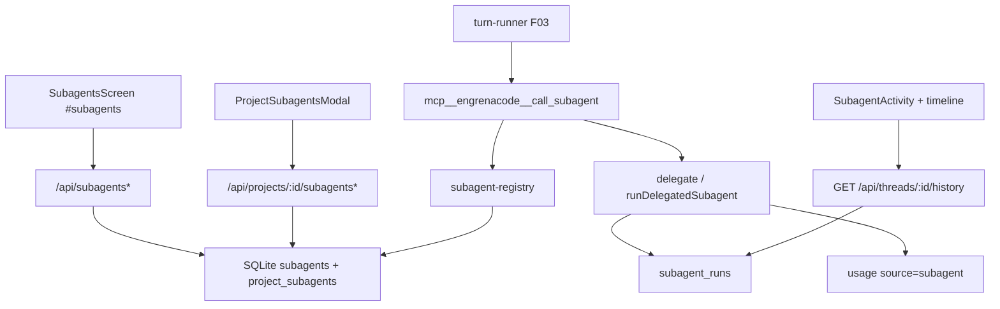

# F07. SubAgents — Especificação Técnica

**Feature:** F07 SubAgents  
**Complexidade:** complexo  
**Escopo:** feature completa (PRD sem divisão Central/Completo; pipeline/MCPs/skills-por-filho/providers extras fora)  
**UI:** [`ui.md`](./ui.md) · Copy: [`copy.md`](./copy.md)  
**Última atualização:** 2026-08-03

---

## 1. Visão Geral Técnica

**O quê:** Catálogo global de subagents com CRUD em `#subagents`, vínculo por projeto (`kind=dev` implícito), tool `mcp__engrenacode__call_subagent` para o pai delegar, runs efêmeros persistidos (sem row em `threads` para o filho), idle timeout, e superfícies de observação (sidebar activity + bloco aninhado na timeline + auditoria).

**Por quê:** O agente principal delega tarefas especializadas sem perder o fluxo de revisão unificado (diffs do filho no worktree do pai).

**Escopo:**

### Incluído

- CRUD: `name` único, `description`, `prompt` (~1 MiB hard), `provider` Claude|Codex|Kimi|inherit, `model?`, `reasoningLevel?`, `tools` (null=tudo / lista / []=nenhuma), `category?`, `idleTimeoutMinutes` (default efetivo 20; null → 20), `enabled`
- Vínculo: `project_subagents` (enabled + sort_order); catálogo do turno = linked ∧ enabled global ∧ enabled projeto; soft warn UI ≤10 vínculos
- Runtime: `call_subagent` → run persistido em `subagent_runs`; idle watchdog 20 min / hard 2 h; status `timeout` visível na sidebar **e** timeline
- Codex pai: delegação só com full-access explícito
- Contagens F04; eventos usage `source=subagent` (contrato F11; emit no completion)
- UI: `#subagents`, `ProjectSubagentsModal`, `SubagentActivity`, bloco timeline, modal audit — conforme ui.md/copy.md

### Adiado / fora

- `kind=pipeline` e motores internos (`/featdevelop`)
- Skills/MCPs no form do filho; `networkAccess`
- Providers glm/minimax/grok
- Worktree isolado / `apply_status` / isolation write-parallel
- Layout dos cards de contagem no Dashboard (F04)
- Superfície visual completa de diffs do filho no Diff tab (contrato F03; F07 garante cwd compartilhado + `generateDiffs` do pai)

---

## 2. Impacto na Arquitetura

| Área | Caminhos |
|------|----------|
| Renderer | `SubagentsScreen`, `SubagentFormModal`, `ProjectSubagentsModal`, `subagentForm.logic`, `SubagentActivity`, bloco timeline, `subagents-service`, `#subagents` |
| HTTP | `subagents-handler.ts`; `catalog-order` kind=subagents; history embute runs |
| DB | `subagents`, `project_subagents`, `subagent_runs` |
| Runner | `subagent-registry`, `delegate` / `call_subagent`, gate Codex full-access |



---

## 3. Decisões Técnicas

### 3.1 Herdadas

F01 sessão `x-engrenacode-session` + 423 `vault_locked`; F01.1 tokens; F02/F05/F06 envelope `{ error: { code, message } }`; INTEGER epoch ms; Vitest colocalizado; EngrenaCode; layout `screens/` + `components/subagents/` + `services/http/` + `db/repositories/`.

### 3.2 Específicas

| Decisão | Escolhida | Alternativa | Trade-off |
|---------|-----------|-------------|-----------|
| kind | Omitir coluna; sempre `dev` | Coluna + UI Pipeline | MVP PRD |
| Providers | Claude\|Codex\|Kimi\|inherit | + glm/minimax/grok | Escopo MVP |
| MCPs/Skills no filho | Omitir | Form legado | PRD: filho sem MCP |
| Cap ≤10 vínculos | Soft warn `subagentsLink.warn.cap` | Hard 400 | Recomendação PRD |
| Prompt 1 MiB | Hard UI+server | Só soft / sem gate | Alinha Skills |
| tools | null / [] / allowlist JSON | Só boolean | Contrato PRD |
| Idle | Default 20 min; API 1–480 ou null; hard 2 h | Só hard | PRD + legado |
| Timeout na timeline | Status `timeout` explícito | Cair em running/error | Bug legado a não copiar |
| Running copy | Sidebar `rodando…`; timeline `trabalhando…` | Unificar | Distinção de contexto (fonte) |
| Badge disabled | `desativado` (card); pills link “Habilitado/Desabilitado” | Feminino genérico | Concordância com “subagent” |
| Copy | PT-BR acentuado | Byte-a-byte legado | EngrenaCode |
| Runs | Persistidos SQLite (schema enxuto) | Só memória | Audit/replay |
| Diffs filho | Mesmo cwd; diffs no fim do turno do pai | Worktree isolado | MVP simples |
| Tool name | `mcp__engrenacode__call_subagent` | `mcp__lioncode__*` | Marca |
| Codex gate | Full-access obrigatório se há subagents ativos | Degradar silencioso | Segurança |

### 3.3 Assumptions

| Assumption | Origem | Pode sobrescrever? |
|------------|--------|--------------------|
| Pasta `docs/F07-subagents/` (kebab PRD “SubAgents”) — já correta | skill | sim |
| Frontend = ui.md + copy.md | pedido usuário | não nesta spec |
| Omit pipeline/MCPs/skills/extra providers; soft 10; hard 1 MiB; PT-BR; timeout na timeline | entrevista LionCodeLabs + PRD | sim |
| Prefixo `/api`; INTEGER ms | F05/F06 | não |
| Wiring completo no turn-runner deferred até F03 existir | Onda 2/3 | sim |
| Bootstrap SQLite se ainda ausente | codebase sem db | sim |
| Description e prompt obrigatórios (não-empty) | legado + PRD Capacidades | sim |

---

## 4. Visão Geral de Componentes

### Frontend (ui.md + copy.md)

| Caminho | Novo/Mod | Propósito |
|---------|----------|-----------|
| `src/renderer/screens/SubagentsScreen.tsx` | Novo | Lista CRUD `#subagents` |
| `src/renderer/components/subagents/SubagentFormModal.tsx` | Novo | Create/edit (sem Pipeline/MCPs/Skills/network) |
| `src/renderer/components/subagents/subagentForm.logic.ts` | Novo | Validação provider/tools; hard 1 MiB |
| `src/renderer/components/subagents/ProjectSubagentsModal.tsx` | Novo | Vínculo + reorder + soft warn ≤10 |
| `src/renderer/components/subagents/SubagentActivity.tsx` | Novo | Sidebar runs (F03 consome) |
| `src/renderer/services/subagents-service.ts` | Novo | HTTP client |
| `src/renderer/App.tsx` | Mod | Hash `#subagents` + nav |
| Bloco timeline (F03 ChatHistory) | Mod/peer | Status incl. `timeout`; copy `subagentsRun.*` |

Copy: ids [`copy.md`](./copy.md) (`subagents.*`, `subagentsForm.*`, `subagentsLink.*`, `subagentsRun.*`). Não importar bloco “Fora do Escopo Central”.

### Backend

| Caminho | Novo/Mod | Propósito |
|---------|----------|-----------|
| `src/services/db/migrations/00N_subagents.sql` | Novo | tabelas §6 |
| `src/services/db/repositories/subagents.ts` | Novo | CRUD, links, resolve, runs |
| `src/services/http/subagents-handler.ts` | Novo | Rotas §5 |
| Catalog-order handler | Mod | `kind: "subagents"` |
| `src/services/runner/subagent-registry.ts` | Novo | Catálogo do turno |
| `src/services/runner/delegate.ts` (ou equivalente) | Novo | Execução + idle/hard timeout |
| `src/services/runner/subagent-caller-gate.ts` | Novo | Codex full-access |
| Router HTTP | Mod | `/api/subagents*` |

---

## 5. Contratos de API

Auth: `x-engrenacode-session`. Prefixo `/api`. Vault locked → 423 `vault_locked`.

### CRUD

| Método | Path | Notas |
|--------|------|-------|
| GET | `/api/subagents` | `{ subagents: Subagent[] }` |
| POST | `/api/subagents` | 201 `{ subagent }` |
| PUT | `/api/subagents/:id` | parcial `{ subagent }` |
| DELETE | `/api/subagents/:id` | cascade vínculos `{ deleted: true }` |

**Body create:**

| Campo | Tipo | Obrigatório | Validação |
|-------|------|-------------|-----------|
| `name` | string | sim | non-empty; UNIQUE |
| `description` | string | sim | non-empty |
| `prompt` | string | sim | non-empty; ≤ 1048576 |
| `provider` | string | sim | `claude`\|`codex`\|`kimi`\|`inherit` |
| `model` | string\|null | não | omitido/oculto se inherit |
| `reasoningLevel` | string\|null | não | omitido se inherit / sem níveis |
| `tools` | string[]\|null | não | null=tudo; []=nenhuma; lista=allowlist |
| `category` | string\|null | não | |
| `idleTimeoutMinutes` | number\|null | não | null → default 20; senão 1..480 |
| `enabled` | boolean | não | default true |

**Erros:** `validation_error`/`invalid_request` 400, `subagent_not_found` 404, `subagent_name_conflict` 409, `too_long` 400, `unauthorized` 401, `vault_locked` 423.

### Projeto

| Método | Path | Body |
|--------|------|------|
| GET | `/api/projects/:id/subagents` | — → `SubagentLinkState[]` (omitir `prompt` na lista leve) |
| PUT | `/api/projects/:id/subagents/:subagentId` | `{ enabled?, sortOrder? }` upsert |
| DELETE | `/api/projects/:id/subagents/:subagentId` | unlink |
| PUT | `/api/projects/:id/catalog-order` | `{ kind: "subagents", items: [{ id, enabled, sortOrder }] }` (todos linked; sortOrder 0..N-1 contíguo) |

### Contagens (F04)

**GET `/api/subagents/counts`** → `{ global: number, linkedByProject: Record<string, number> }`  
(opcional `activeByProject` = linked ∧ enabled ∧ subagent.enabled).

### History (runs embutidos)

**GET `/api/threads/:id/history`** inclui `subagentRuns: SubagentRun[]` (peer F03; contrato F07 define shape).

### Tipos

```typescript
type SubagentProvider = 'claude' | 'codex' | 'kimi' | 'inherit'

interface Subagent {
  id: string
  name: string
  description: string
  prompt: string
  provider: SubagentProvider
  model: string | null
  reasoningLevel: string | null
  tools: string[] | null
  category: string | null
  idleTimeoutMinutes: number | null
  enabled: boolean
  createdAt: number
  updatedAt: number
}

interface SubagentLinkState extends Omit<Subagent, 'prompt'> {
  linked: boolean
  enabledInProject: boolean | null
  sortOrder: number | null
}

type SubagentRunStatus = 'running' | 'completed' | 'cancelled' | 'error' | 'timeout'

interface SubagentRun {
  childThreadId: string
  parentThreadId: string
  parentToolCallId: string | null
  subagentName: string
  provider: string
  model: string | null
  status: SubagentRunStatus
  text: string | null
  durationMs: number | null
  reasoningLevel: string | null
  actionCount: number
  createdAt: number
}
```

### `call_subagent` (runtime, não REST)

- Nome: `mcp__engrenacode__call_subagent`
- Input: `{ subagent: string /* enum names do catálogo */, task: string, context?: Record<string, unknown> }`
- Catálogo: linked ∧ project.enabled ∧ subagent.enabled (MVP = sempre “dev”)
- Filho: sem MCP; sem row em `threads`; edita o mesmo cwd do pai
- Codex pai sem full-access → bloqueia dispatch com mensagem clara (não degrada)
- Idle: silêncio de stream ≥ `idleTimeoutMinutes` (default 20) → `status: 'timeout'`, parcial ao pai
- Hard cap: 2 h → timeout/cancel
- Ao completar: persistir `subagent_runs` + emitir usage `source: 'subagent'` (F11)

---

## 6. Modelo de Dados

### `subagents`

| Coluna | Tipo | Nullable | Padrão | Descrição |
|--------|------|----------|--------|-----------|
| `id` | TEXT | Não | — | PK |
| `name` | TEXT | Não | — | UNIQUE |
| `description` | TEXT | Não | — | |
| `prompt` | TEXT | Não | — | system prompt |
| `provider` | TEXT | Não | `inherit` | enum app-level |
| `model` | TEXT | Sim | — | |
| `reasoning_level` | TEXT | Sim | — | |
| `tools_json` | TEXT | Sim | — | null / `[]` / JSON array |
| `idle_timeout_minutes` | INTEGER | Sim | — | null → 20 no broker |
| `category` | TEXT | Sim | — | |
| `enabled` | INTEGER | Não | 1 | |
| `created_at` | INTEGER | Não | — | epoch ms |
| `updated_at` | INTEGER | Não | — | epoch ms |

Não persistir: `kind`, `skills_json`, `mcps_json`, `network_access`.

### `project_subagents`

| Coluna | Tipo | Nullable | Descrição |
|--------|------|----------|-----------|
| `project_id` | TEXT | Não | PK composta; FK CASCADE |
| `subagent_id` | TEXT | Não | PK composta; FK CASCADE |
| `enabled` | INTEGER | Não | default 1 |
| `sort_order` | INTEGER | Não | default 0 |
| `created_at` | INTEGER | Não | |

Índice: `ix_project_subagents_project`.

### `subagent_runs`

| Coluna | Tipo | Nullable | Descrição |
|--------|------|----------|-----------|
| `child_thread_id` | TEXT | Não | PK (id lógico; sem row em threads) |
| `parent_thread_id` | TEXT | Não | FK threads CASCADE (quando existir) |
| `parent_tool_call_id` | TEXT | Sim | |
| `subagent_name` | TEXT | Não | |
| `provider` | TEXT | Não | |
| `model` | TEXT | Sim | |
| `status` | TEXT | Não | completed\|cancelled\|error\|timeout (+ running efêmero via WS) |
| `text` | TEXT | Sim | saída parcial/final |
| `usage_json` | TEXT | Sim | |
| `reasoning_level` | TEXT | Sim | |
| `duration_ms` | INTEGER | Sim | |
| `actions_json` | TEXT | Sim | cap ~50 actions |
| `action_count` | INTEGER | Não | default 0 |
| `created_at` | INTEGER | Não | |

Índice: `ix_subagent_runs_parent` on `parent_thread_id`.

Omitir colunas de workflow: `isolation`, `stage_id`, `apply_status`, `patch_*`, `retry_of`.

**Exemplo de migração (ilustrativo):**

```sql
CREATE TABLE subagents (
  id TEXT PRIMARY KEY,
  name TEXT NOT NULL UNIQUE,
  description TEXT NOT NULL,
  prompt TEXT NOT NULL,
  provider TEXT NOT NULL DEFAULT 'inherit',
  model TEXT,
  reasoning_level TEXT,
  tools_json TEXT,
  idle_timeout_minutes INTEGER,
  category TEXT,
  enabled INTEGER NOT NULL DEFAULT 1,
  created_at INTEGER NOT NULL,
  updated_at INTEGER NOT NULL
);

CREATE TABLE project_subagents (
  project_id TEXT NOT NULL,
  subagent_id TEXT NOT NULL,
  enabled INTEGER NOT NULL DEFAULT 1,
  sort_order INTEGER NOT NULL DEFAULT 0,
  created_at INTEGER NOT NULL,
  PRIMARY KEY (project_id, subagent_id),
  FOREIGN KEY (subagent_id) REFERENCES subagents(id) ON DELETE CASCADE
);

CREATE INDEX ix_project_subagents_project ON project_subagents(project_id);

CREATE TABLE subagent_runs (
  child_thread_id TEXT PRIMARY KEY,
  parent_thread_id TEXT NOT NULL,
  parent_tool_call_id TEXT,
  subagent_name TEXT NOT NULL,
  provider TEXT NOT NULL,
  model TEXT,
  status TEXT NOT NULL,
  text TEXT,
  usage_json TEXT,
  reasoning_level TEXT,
  duration_ms INTEGER,
  actions_json TEXT,
  action_count INTEGER NOT NULL DEFAULT 0,
  created_at INTEGER NOT NULL
);

CREATE INDEX ix_subagent_runs_parent ON subagent_runs(parent_thread_id);
```

---

## 7. Estratégia de Testes

### 7.1 Unitário / Integração

| Arquivo | Alvo |
|---------|------|
| `src/services/db/repositories/subagents.test.ts` | CRUD, conflict, resolve filter, link order |
| `src/services/http/subagents-handler.test.ts` | 409 name, 400 prompt too long, provider inválido, 423 |
| `src/renderer/components/subagents/subagentForm.logic.test.ts` | 1 MiB block; tools 3-state; inherit hides model |
| `src/services/runner/subagent-registry.test.ts` | exclui unlinked/disabled |
| `src/services/runner/subagent-caller-gate.test.ts` | Codex sem full-access bloqueia |
| `src/services/runner/delegate.idle.test.ts` | idle → status timeout |

| Função | Assertions |
|--------|------------|
| `rejects_duplicate_name` | 409 `subagent_name_conflict` |
| `rejects_prompt_over_1mib` | 400 `too_long` |
| `rejects_unknown_provider` | 400 |
| `resolve_excludes_unlinked` | fora do catálogo |
| `resolve_excludes_disabled_project` | fora |
| `resolve_excludes_disabled_global` | fora |
| `catalog_order_requires_contiguous` | 400 se sortOrder inválido |
| `codex_parent_without_full_access_blocks` | erro explícito |
| `idle_silence_marks_timeout` | status `timeout` |
| `tools_null_means_all` | sem restrição |
| `tools_empty_array_means_none` | allowlist vazia |

### 7.2 Smoke / Aceitação

| # | Passo | Esperado |
|---|-------|----------|
| 1 | `#subagents` → Novo Agente | card; copy `copy.md`; sem Pipeline/MCPs/Skills |
| 2 | Provider só Claude/Codex/Kimi/Herda | sem glm/minimax/grok |
| 3 | Prompt >1 MiB | submit bloqueado |
| 4 | Name duplicado | `subagentsForm.error.nameConflict` |
| 5 | Vincular + reorder no projeto | catalog-order ok |
| 6 | >10 vínculos | `subagentsLink.warn.cap`; API ok |
| 7 | call_subagent (quando runner) | run na sidebar; bloco timeline |
| 8 | Idle (ou simulado) | status `timeout` em activity **e** timeline |
| 9 | Codex pai sem full-access | delegação bloqueada com mensagem |
| 10 | Light/dark vs ui.md | EngrenaCode, sem LionCode |

### 7.3 Cross-feature

| Critério | Status | Nota |
|----------|--------|------|
| Tokens F01.1 em `#subagents` | ready | |
| Sessão/vault F01 | ready | 423 |
| call_subagent + timeline + Diffs no Workspace F03 | deferred | até turn-runner |
| Contagens F04 | deferred | |
| Usage source=subagent F11 | deferred | emit no completion |
| Stub F03 subagents → real | ready ao implementar | |

### Critérios PRD §9

- [ ] CRUD e vínculo `kind=dev` com providers Claude|Codex|Kimi|inherit
- [ ] call_subagent cria run efêmero; diffs do filho na revisão do pai
- [ ] Codex pai sem full-access não delega
- [ ] Idle timeout default 20 min encerra run visível na UI
