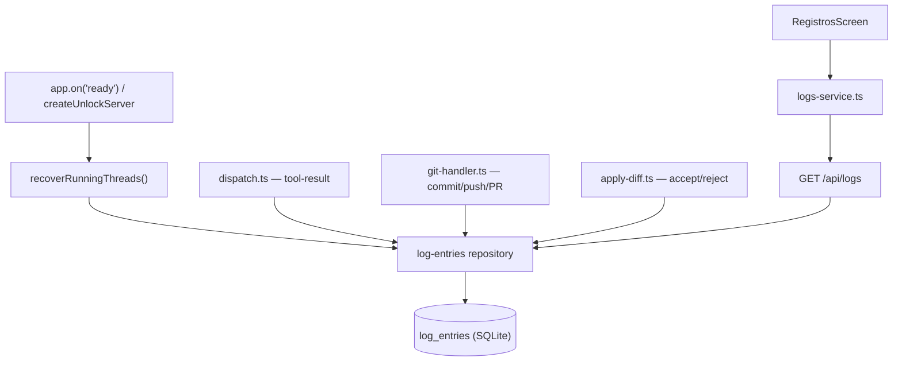

# Spec Técnica: F08. Registros

## 1. Visão Geral Técnica

**O quê:** Tela global somente leitura `#registros` sobre uma nova tabela de auditoria `log_entries`, que persiste eventos de task (recovery de boot), tool call (resultado final) e git flow (commit, push, PR, accept/reject de diff) por thread, com filtro por tipo e paginação incremental de 100 registros.

**Por quê:** F03 (Workspace) já produz esses eventos em memória/WS, mas nada os persiste de forma consultável fora da sessão ativa. F08 fecha essa lacuna com um audit log local, sem dependência de nenhum serviço externo — consistente com o resto do EngrenaCode (local-first, better-sqlite3/`node:sqlite`).

**Escopo:** PRD não define blocos `Escopo Central` / `Adições ao Escopo Completo` para F08 — spec cobre a feature inteira: schema `log_entries`, repositório, endpoint `GET /api/logs`, os 4 pontos de escrita automática (boot recovery, tool-result, git commit/push/PR, accept/reject de diff), e a tela `#registros` consumindo o endpoint. Exclui (per PRD): edição/exclusão individual de registro, export, purge automático.

**UI/Copy:** `docs/F08-registros/ui.md` (anatomia, tokens, estados, aceite visual) e `docs/F08-registros/copy.md` (catálogo de strings por id) já existem e são a fonte de verdade de UX/copy — esta spec cita ids e caminhos, nunca redescreve anatomia ou strings.

## 2. Impacto na Arquitetura

**Componentes afetados:**
- `src/services/db/migrations/003_log_entries.ts` (novo) — schema da tabela
- `src/services/db/client.ts` (modificado) — registra a migração 003
- `src/services/db/repositories/log-entries.ts` (novo) — CRUD/list de `log_entries`
- `src/services/db/repositories/threads.ts` (modificado) — reconciliação de threads `running` órfãs no boot
- `src/services/http/logs-handler.ts` (novo) — `GET /api/logs`
- `src/services/http/unlock-handler.ts` (modificado) — registra `logs-handler` + dispara a reconciliação de boot uma vez
- `src/services/runner/dispatch.ts` (modificado) — grava `kind='tool'` no `tool-result`
- `src/services/http/git-handler.ts` (modificado) — grava `kind='git'` em commit/push/PR
- `src/services/runner/apply-diff.ts` (modificado) — grava `kind='git'` em accept/reject
- `src/renderer/services/logs-service.ts` (novo) — client HTTP
- `src/renderer/components/LogTable.tsx` (novo) — filterbar + tabela + paginação (per `ui.md`)
- `src/renderer/screens/RegistrosScreen.tsx` (novo) — tela `#registros`



## 3. Decisões Técnicas

### 3.1 Herdadas dos padrões do codebase

Herdado por leitura direta do código existente (sem brief de Modo Lote — single-feature): `node:sqlite` `DatabaseSync` com migrations idempotentes registradas em `src/services/db/client.ts` (`src/services/db/migrations/002_workspace_core.ts`); repositórios como funções puras exportadas por arquivo, não classes (`diffs.ts`, `dashboard.ts`, `threads.ts`); ids prefixados por entidade (`thr_`, `diff_`); handlers HTTP com `guard()` (423 vault_locked / 401 unauthorized), `sendJson`/`sendError`, roteamento por regex registrado em `unlock-handler.ts`; renderer com `<feature>-service.ts` (fetch + header `x-engrenacode-session`) por tela. Desvios desta feature: nenhum.

### 3.2 Específicas da feature

| Decisão | Abordagem Escolhida | Alternativa Considerada | Trade-off |
|---|---|---|---|
| Tipo da coluna timestamp | `INTEGER` epoch ms (`created_at`, `Date.now()`) | `TEXT` ISO datetime (padrão da fonte LionCodeLabs) | Consistente com `diffs`/`threads`/`messages`; formatação pt-BR fica no client, igual ao resto do app |
| Escrita `kind='task'` | Só via reconciliação de boot (threads `running` órfãs após restart do app) | Log a cada início de dispatch/follow-up | Espelha fiel a fonte (decisão explícita do usuário); dispatch normal não produz `kind='task'` |
| Escrita `kind='tool'` | 1 entrada por tool call, gravada no `tool-result` (com outcome) | Gravar no `tool-start` (sem outcome) | Evita duplicar start+result; `event` sempre reflete o resultado final |
| Escopo de falha em `kind='git'` | Commit/push/accept/reject só sucesso; PR loga sucesso E falha (`GitError` de `createPullRequest`) | Só sucesso em tudo | PR é o único fluxo com falha estruturada e relevante (`pr_no_remote`, `pr_not_github`, `pr_create_failed`); commit/push/diff actions já reportam erro via response HTTP, sem necessidade de audit trail de falha |
| Ordenação da listagem | `ORDER BY created_at DESC` (mais recente primeiro) | `ASC` (igual à fonte) | PRD/`ui.md` não fixam direção; DESC é o padrão de UX para audit log (evento mais recente visível sem paginar) — ver 3.3 |
| Endpoint | `GET /api/logs` (raiz de recurso, sem `threadId` no path) | `GET /api/threads/:id/logs` | PRD é uma visão global cross-thread (`#registros` lista todas as threads); path plano casa com `/api/dashboard`, que também é global |

### 3.3 Assumptions

| Assumption | Origem | Pode sobrescrever? |
|---|---|---|
| Ordenação `created_at DESC` (mais recente primeiro) | PRD/`ui.md`/`copy.md` não especificam direção cronológica; aplicado padrão de indústria para audit log | sim |
| `registros.error.vault_locked` (copy dedicada para 423) segue sem existir — reaproveita `error.generic` no client quando a API retorna 423 | Lacuna já registrada em `copy.md` § Lacunas | sim |
| Cascade "apagar thread remove registros" coberto só por `ON DELETE CASCADE` na FK `log_entries.thread_id → threads.id`; não existe (nem é criado aqui) um fluxo de exclusão de thread — hoje só `deleteProject` cascateia (`projects → threads → log_entries`) | Investigação do codebase: sem `deleteThread` em `threads.ts` | sim |

## 4. Visão Geral de Componentes

**Backend:**

| Caminho do Arquivo | Novo/Modificado | Propósito | Responsabilidades-Chave |
|---|---|---|---|
| `src/services/db/migrations/003_log_entries.ts` | Novo | Schema `log_entries` | `CREATE TABLE` + índices |
| `src/services/db/client.ts` | Modificado | Registro de migração | Adiciona `migration003LogEntries` ao array `MIGRATIONS` |
| `src/services/db/repositories/log-entries.ts` | Novo | Acesso a dados | `createLogEntry`, `listLogEntries` (filtro `kind`/`limit`/`offset`) |
| `src/services/db/repositories/threads.ts` | Modificado | Reconciliação de boot | `recoverRunningThreads(reason)`: threads `state='running'` → `error`, retorna as afetadas |
| `src/services/http/logs-handler.ts` | Novo | Endpoint HTTP | `GET /api/logs`; valida `kind`/`limit`/`offset`; `guard()` |
| `src/services/http/unlock-handler.ts` | Modificado | Bootstrap + roteamento | Chama `recoverRunningThreads` uma vez em `createUnlockServer`; grava `log_entries` para cada thread recuperada; registra `handleLogsRequest` |
| `src/services/runner/dispatch.ts` | Modificado | Log de tool call | No branch `tool-result` de `runTurn`, após `updateToolCall`, grava `log_entries` `kind='tool'` |
| `src/services/http/git-handler.ts` | Modificado | Log de git flow | Em `handleGitCommit`/`handleGitPush`/`handlePr`, grava `log_entries` `kind='git'` (PR também em falha) |
| `src/services/runner/apply-diff.ts` | Modificado | Log de accept/reject | Após aplicar o subset em `applyDiffAction`, grava `log_entries` `kind='git'` |

**Frontend:**

| Caminho do Arquivo | Novo/Modificado | Propósito | Responsabilidades-Chave |
|---|---|---|---|
| `src/renderer/services/logs-service.ts` | Novo | Client HTTP | `getLogs({ kind?, limit?, offset? })`, tipos `LogEntry`/`LogsResponse`, segue padrão de `dashboard-service.ts` |
| `src/renderer/components/LogTable.tsx` | Novo | Composição de UI | Filterbar + tabela + skeleton/empty/error/CTA "Carregar mais", per `ui.md` §Anatomia e §Layout/tokens |
| `src/renderer/screens/RegistrosScreen.tsx` | Novo | Tela `#registros` | `AppShell` + `LogTable`; ids de copy per `docs/F08-registros/copy.md` |

**Banco de Dados:**

| Arquivo de Migração | Tabelas Afetadas | Operação | Notas |
|---|---|---|---|
| `003_log_entries.ts` | `log_entries` | CREATE | FK `thread_id → threads(id) ON DELETE CASCADE`; `CHECK (kind IN ('task','tool','git'))` |

## 5. Contratos de API

**Endpoint: Listar registros de auditoria**
- **Método:** GET
- **Caminho:** `/api/logs`
- **Autenticação:** header `x-engrenacode-session` (sessão de vault desbloqueado) — mesmo `guard()` de `dashboard-handler.ts`/`git-handler.ts`

**Requisição (query string):**

| Campo | Tipo | Obrigatório | Validação | Descrição |
|---|---|---|---|---|
| `kind` | `string` | Não | enum `task` \| `tool` \| `git` | Filtra por categoria; omitido = todas |
| `limit` | `integer` | Não | inteiro ≥ 0; default `100` | Tamanho de página (`PAGE_SIZE` per `ui.md`) |
| `offset` | `integer` | Não | inteiro ≥ 0; default `0` | Deslocamento para paginação incremental |

**Exemplo de Requisição:**
```
GET /api/logs?kind=git&limit=100&offset=0
x-engrenacode-session: <token>
```

**Resposta (Sucesso — 200):**

| Campo | Tipo | Descrição |
|---|---|---|
| `entries` | `array` | Lista de `log_entries`, ordenada `created_at DESC` |
| `entries[].id` | `string` | `log_<uuid>` |
| `entries[].threadId` | `string` | FK para `threads.id` |
| `entries[].kind` | `string` | `task` \| `tool` \| `git` |
| `entries[].event` | `string` | Descrição crua do evento (renderizada literal, sem paráfrase no client) |
| `entries[].createdAt` | `integer` | Epoch ms |

**Exemplo de Resposta:**
```json
{
  "entries": [
    {
      "id": "log_9f2c1e40-...",
      "threadId": "thr_7ab21e40-...",
      "kind": "git",
      "event": "Commit a1b2c3d criado na branch 'main': fix bug",
      "createdAt": 1737590000000
    }
  ]
}
```

`entries.length === limit` na resposta é o sinal de `hasMore` (mesma regra descrita em `ui.md` § Estados; sem campo `total` dedicado — segue o padrão da fonte, que também não expõe contagem total).

**Códigos de Erro:**

| Código | Status HTTP | Descrição |
|---|---|---|
| `vault_locked` | 423 | Cofre travado (`guard()`) |
| `unauthorized` | 401 | Sessão inválida/ausente (`guard()`) |
| `validation_error` | 400 | `kind` fora do enum, ou `limit`/`offset` não inteiro/negativo |
| `internal_error` | 500 | Erro não tratado |

## 6. Modelo de Dados

**Tabela: `log_entries`**

| Coluna | Tipo | Nullable | Padrão | Descrição |
|---|---|---|---|---|
| `id` | `TEXT` | Não | — | PK, `log_<uuid>` |
| `thread_id` | `TEXT` | Não | — | FK `threads(id)` |
| `kind` | `TEXT` | Não | — | `CHECK (kind IN ('task','tool','git'))` |
| `event` | `TEXT` | Não | — | Descrição crua do evento |
| `created_at` | `INTEGER` | Não | — | Epoch ms (`Date.now()`), setado pelo repositório na escrita |

**Índices:**

| Nome do Índice | Colunas | Tipo | Propósito |
|---|---|---|---|
| `ix_log_entries_thread_id` | `thread_id` | btree | Cascade lookup / consulta por thread |
| `ix_log_entries_kind_created_at` | `(kind, created_at)` | btree | Filtro por `kind` + `ORDER BY created_at DESC` com paginação |

**Constraints:**

| Constraint | Tipo | Definição | Propósito |
|---|---|---|---|
| `pk_log_entries` | PRIMARY KEY | `id` | Identificador único |
| `fk_log_entries_thread` | FOREIGN KEY | `thread_id REFERENCES threads(id) ON DELETE CASCADE` | "Apagar thread remove registros" (PRD) |
| `ck_log_entries_kind` | CHECK | `kind IN ('task','tool','git')` | Integridade de enum (SQLite sem tipo ENUM nativo) |

**Exemplo de Migração:**
```sql
CREATE TABLE IF NOT EXISTS log_entries (
  id TEXT PRIMARY KEY,
  thread_id TEXT NOT NULL REFERENCES threads(id) ON DELETE CASCADE,
  kind TEXT NOT NULL CHECK (kind IN ('task','tool','git')),
  event TEXT NOT NULL,
  created_at INTEGER NOT NULL
);

CREATE INDEX IF NOT EXISTS ix_log_entries_thread_id ON log_entries(thread_id);
CREATE INDEX IF NOT EXISTS ix_log_entries_kind_created_at ON log_entries(kind, created_at);
```

## 7. Estratégia de Testes

### 7.1 Unitário / Integração

| Arquivo de Teste | Tipo de Teste | Alvo | Objetivo de Cobertura |
|---|---|---|---|
| `src/services/db/repositories/log-entries.test.ts` | Unitário | `log-entries.ts` | Create/list/filtro/paginação/ordenação/cascade |
| `src/services/db/repositories/threads.test.ts` | Unitário (extensão) | `recoverRunningThreads` | Threads `running`→`error`; threads não-`running` intactas |
| `src/services/http/logs-handler.test.ts` | Integração | `GET /api/logs` | 200 com/sem filtro, paginação, 400 validação, 423/401 guard |
| `src/services/runner/dispatch.test.ts` | Unitário (extensão) | `runTurn` | `tool-result` grava `log_entries` `kind='tool'` com `event` contendo nome+status |
| `src/services/http/git-handler.test.ts` | Integração (extensão) | commit/push/PR | Sucesso grava `kind='git'`; falha de PR (`GitError`) também grava `kind='git'` |
| `src/services/runner/apply-diff.test.ts` | Unitário (extensão) | `applyDiffAction` | Accept e reject cada um grava 1 `log_entries` `kind='git'` |
| `src/services/http/unlock-handler.test.ts` | Integração (extensão, se existir; senão novo) | boot recovery | `createUnlockServer` reconcilia threads `running` órfãs 1x e grava `log_entries` `kind='task'` |

Funções principais a testar em `log-entries.test.ts`: `createLogEntry` (grava e retorna registro completo), `listLogEntries` sem filtro (retorna todas, `DESC`), `listLogEntries({ kind })` (só a categoria pedida), `listLogEntries({ limit, offset })` (fatia correta), cascade (deletar o projeto pai da thread remove os `log_entries` associados).

### 7.2 Smoke / Aceitação manual

| # | Passo | Resultado esperado |
|---|---|---|
| 1 | Rodar um turno completo em uma thread (dispatch → tool call → diff → commit → push → PR) | `GET /api/logs` retorna entradas `tool` (por tool call) e `git` (commit/push/PR), mais recentes primeiro |
| 2 | Aceitar e depois rejeitar diffs em threads separadas | Cada ação gera 1 `log_entries` `kind='git'` com `event` descrevendo a ação |
| 3 | Reiniciar o app com uma thread presa em `state='running'` (matar o processo no meio de um turno) | No próximo boot, thread vira `error` e aparece 1 `log_entries` `kind='task'` com o motivo do restart |
| 4 | Abrir `#registros`, trocar filtro Todos → Tasks → Tool calls → Git flow | Lista recarrega por tipo; tabela e chips batem com `ui.md` §Layout/tokens e `copy.md` |
| 5 | Cofre travado, acessar `#registros` | 423 do endpoint; UI redireciona ao login (per `ui.md` §Estados `vaultLocked`) |
| 6 | Banco sem nenhum registro vs filtro sem match | `empty.none` vs `empty.filtered` (`copy.md`), distintos |
| 7 | Mais de 100 registros na thread/kind | CTA "Carregar mais" aparece; clique busca próxima página sem duplicar linhas |
| 8 | Conferir tela em light/dark contra `docs/F08-registros/ui/registros-referencia.png` | Bate com a referência; tokens de `ui.md` sem hex solto |

### 7.3 Cross-feature

| Critério | Status | Nota |
|---|---|---|
| Eventos task/tool/git gerados no Workspace (F03) aparecem em Registros (F08) com thread id navegável | ready | F03 já feito (core); wiring desta spec cobre tool/git; task cobre só boot recovery (ver 3.2) |
| Tokens/tema/padrões de superfície de F01.1 renderizam Registros (F08) | ready | F01.1 feito; `RegistrosScreen`/`LogTable` consomem tokens per `ui.md` |
| Clique no thread id abre a thread no workspace (F03) | ready | F03 tem a tela `#principal`; navegação exata (`#principal?thread=` vs rota dedicada) é decisão de implementação da UI, não desta spec — ver `ui.md` §Perguntas em aberto |
