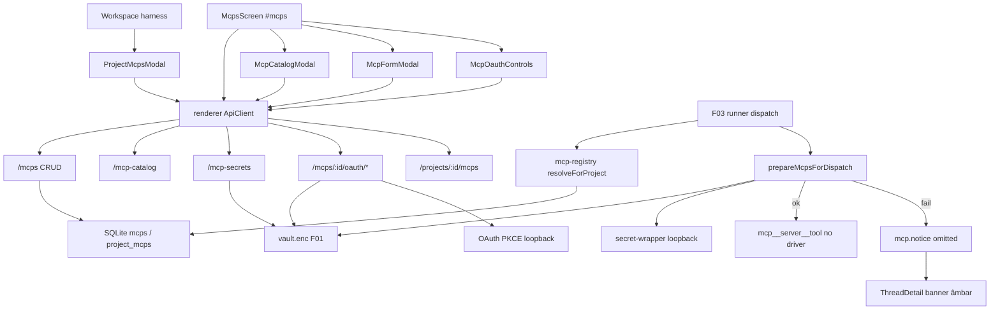

# Spec: MCPs (`#mcps`)

**Feature:** F09-mcps  
**Complexidade:** complexo  
**Fonte PRD:** `docs/prd-engrenacode.md` → F09  
**UI:** [`ui.md`](./ui.md) · Copy: [`copy.md`](./copy.md)  
**Modo:** spec alvo EngrenaCode (contratos `engrenacode`); legado LionCodeLabs = baseline de comportamento + gaps explícitos  
**Última atualização:** 2026-08-05

## Assumptions / Decisions

| Decisão | Origem | Escolha |
|---------|--------|---------|
| Nome reservado do broker | PRD F09 | `engrenacode` (legado: `lioncode`) |
| Secrets | PRD + F01 | Refs no vault; GET `/mcp-secrets` só nomes; valores nunca em SQLite/HTTP |
| Secret em header stdio/http | PRD + rotas | Rejeitar `{secretRef}` em headers (400); só literais / `oauthRef` interno |
| OAuth | PRD + `mcp/oauth.ts` | PKCE + callback loopback; status público no DB; tokens só no vault |
| Converter para OAuth | UI + migration 017 | Opt-in explícito; nunca migração silenciosa de installs por key |
| Soft cap vínculos | PRD | ≤ 8 por projeto = recomendação; **sem** hard-block na fonte (gap UI) |
| Omit no resolve | PRD | MCP entra em `omitted[]` com reason; emite `mcp.notice`; turno continua |
| HTTPS remoto | PRD | HTTPS obrigatório em URL remota; HTTP só loopback — destino; fonte valida em OAuth metadata; create/update de URL custom = gap a fechar |
| Branding | F01 | Header `X-EngrenaCode-Session`; erros de rede com EngrenaCode |
| Copy UI | `copy.md` | Importar ids; não reinventar no código |

---

## 1. Visão Geral Técnica

**O quê:** Catálogo e CRUD de MCP servers externos (presets first-party + custom), secrets no vault (F01), OAuth PKCE loopback, vínculo por projeto (F03), e resolução no dispatch do turno: tools `mcp__<server>__<tool>` quando resolvido; omit + aviso âmbar quando secret/OAuth falha.

**Por quê:** Integrar tools externas (GitHub, Linear, Slack, …) no mesmo fluxo de agente sem abortar o turno por credencial faltando; credenciais sensíveis fora do SQLite.

**Escopo — Incluído (Central):**

- UI `#mcps` + catálogo + form + OAuth no card + overlay de vínculo (ver [`ui.md`](./ui.md))
- CRUD global `mcps` + vínculo `project_mcps`
- Catálogo estático ~14 presets; install cria def com `preset_id`
- Secrets namespace vault `mcpSecrets`; secret-wrapper loopback no runner para stdio com segredo
- OAuth: start / status / disconnect / convert / client_id manual
- Resolve no dispatch → `ResolvedMcpDef` ou `omitted` + `mcp.notice`
- Harness row “MCPs” + banner de omissão na thread (F03 consome)

**Escopo — Excluído:**

- Marketplace de terceiros sem curadoria
- MCPs no subagent filho (MVP / F07: filho sem MCP)
- Contagens/layout do Dashboard F04 (só contrato de status omitido/âmbar)
- Renomeação de pastas do monorepo / pacotes `mcp-servers/*`
- Export/purge de tokens OAuth fora do disconnect

---

## 2. Impacto na Arquitetura



**Componentes afetados (legado → destino):**

| Camada | Caminho |
|--------|---------|
| UI | `McpsScreen.tsx`, `McpFormModal`, `McpCatalogModal`, `McpOauthControls`, `ProjectMcpsModal`, `mcpForm.logic` |
| Harness / turno | `WorkspaceSidebar.tsx`, `PrincipalScreen.tsx`, `ThreadDetail.tsx` |
| API client | `packages/renderer/src/api/client.ts` |
| Rotas | `routes/mcps.ts`, `mcp-catalog.ts`, `mcp-secrets.ts`, `mcp-oauth.ts` |
| Domínio | `mcp/catalog.ts`, `mcp/oauth.ts`, `db/repositories/mcps.ts` |
| Runner | `runner/mcp-registry.ts`, `runner/mcp-secrets.ts`, `runner/dispatch.ts` |
| Shared | `shared/src/mcp.ts` |
| Migrations | `013_mcps`, `014_mcp_catalog_vault`, `017_mcp_oauth` |
| Servers first-party | `mcp-servers/*` + `lioncode-secret-wrapper` |

---

## 3. Decisões Técnicas

| Decisão | Abordagem escolhida | Alternativa | Trade-off |
|---------|---------------------|-------------|-----------|
| Persistência de def | SQLite `mcps` + JSON env/headers como `McpConfigValue` | Só arquivo TOML no repo | UI/CRUD unificado; segredos fora do DB |
| Segredo stdio | Wrapper loopback + token file | Passar secret no argv/env do spawn | Evita vazamento em `--mcp-config`/ps |
| OAuth tokens | Vault + status durável em coluna | Tokens no SQLite | Alinha F01; status público sem vazar token |
| Falha de resolve | Omit + notice; turno segue | Abortar turno | UX resiliente; tools parciais |
| Soft cap 8 | Só PRD / orientação | Hard 422 no link | Fonte não bloqueia; destino pode adicionar warn UI |
| Nome reservado | `engrenacode` no destino | Manter `lioncode` | Alinha broker/tool prefix ao produto |

---

## 4. Visão Geral de Componentes

### Backend

| Caminho | Propósito | Responsabilidades-chave |
|---------|-----------|-------------------------|
| `routes/mcps.ts` | CRUD + vínculo projeto | Validar name/transport/env/headers; 409 conflito/reservado; CASCADE unlink |
| `routes/mcp-catalog.ts` | List/install presets | 14 presets; install sem placeholder no vault; 409 se já instalado |
| `routes/mcp-secrets.ts` | CRUD keys vault | GET só `keys`; PUT/DELETE; 423 se vault locked |
| `routes/mcp-oauth.ts` | Flow OAuth | start/status/disconnect/convert/client; 423 vault; 400 se não-oauth |
| `mcp/catalog.ts` | Dados estáticos | Templates spawn + `secretKeys` + `remoteUrl` OAuth |
| `mcp/oauth.ts` | PKCE + loopback | Guard HTTPS (http só loopback) em metadata; tokens → vault |
| `runner/mcp-registry.ts` | Resolve vínculos | `linked + enabled + mcp.enabled` → `McpDefWithRefs` |
| `runner/mcp-secrets.ts` | SecretResolver | secretRef/oauthRef → valor ou omit; wrapper stdio |
| `runner/dispatch.ts` | Entrega no turno | `mcp.notice` + filter Codex; tools no driver |

### Frontend

| Caminho | Propósito |
|---------|-----------|
| `McpsScreen.tsx` | Lista global `#mcps` |
| `McpFormModal.tsx` | Create/edit + vault fields |
| `McpCatalogModal.tsx` | Install presets |
| `McpOauthControls.tsx` | Connect / poll / client_id |
| `ProjectMcpsModal.tsx` | Vínculo + badges credencial |
| `mcpForm.logic.ts` | Regex name, parse env/headers, avisos Codex |

### Banco de Dados

| Migration | Tabelas / colunas | Notas |
|-----------|-------------------|-------|
| 013 | `mcps`, `project_mcps`; `subagents.mcps_json` | UNIQUE(name); CASCADE |
| 014 | `mcps.preset_id` | Semântica `McpConfigValue` em JSON |
| 017 | `auth_mode`, `oauth_status`, `oauth_client_json` | Tokens **não** nestas colunas |

Secrets OAuth e `mcpSecrets` vivem no **vault** (F01), não em claro no SQLite.

---

## 5. Contratos de API

Autenticação: rotas protegidas exigem cofre desbloqueado + `X-EngrenaCode-Session` (F01).

### 5.1 CRUD global

| Método | Path | Sucesso | Erros principais |
|--------|------|---------|------------------|
| `POST` | `/mcps` | `{ mcp }` | 400 validação; 409 `mcp_name_conflict` (nome/`engrenacode`) |
| `GET` | `/mcps` | `{ mcps: Mcp[] }` | 423 vault_locked |
| `PUT` | `/mcps/:id` | `{ mcp }` | 404; 400; 409 |
| `DELETE` | `/mcps/:id` | `{ deleted: true }` | 404 |

**Name:** `^[a-z0-9][a-z0-9_-]*$`; reservado destino: `engrenacode`.  
**Transport:** `stdio` ⇒ `command` não-vazio; `http`\|`sse` ⇒ `url` não-vazia.  
**Env keys:** `^[A-Za-z_][A-Za-z0-9_]*$`.  
**Headers:** chave não-vazia sem CR/LF; `{secretRef}` → 400.  
**URL remota (destino PRD):** scheme `https:`; `http:` só se host loopback (`127.0.0.1` / `localhost`). Gap: create/update na fonte ainda não espelha o guard do OAuth metadata — fechar na convergência.

### 5.2 Vínculo por projeto

| Método | Path | Sucesso | Erros |
|--------|------|---------|-------|
| `GET` | `/projects/:id/mcps` | `{ mcps: McpLinkState[] }` | 404 projeto; load error |
| `PUT` | `/projects/:id/mcps/:mcpId` | vínculo upsert (`enabled`, `sortOrder`) | 404 mcp |
| `DELETE` | `/projects/:id/mcps/:mcpId` | `{ unlinked: true }` | — |

Soft cap ≤ 8: **não** retorna 422 na fonte; UI pode warning (ver `copy.md` lacuna).

### 5.3 Catálogo

| Método | Path | Sucesso | Erros |
|--------|------|---------|-------|
| `GET` | `/mcp-catalog` | `{ presets }` | — |
| `POST` | `/mcp-catalog/:presetId/install` | `{ mcp }` | 400 preset desconhecido; 409 já instalado; 423 vault |

Install OAuth: def nasce `authMode: 'oauth'` (UI mostra Conectar).  
Install por key: env com `{secretRef}` sem criar key no vault; UI abre form edit.

### 5.4 Secrets

| Método | Path | Sucesso | Erros |
|--------|------|---------|-------|
| `GET` | `/mcp-secrets` | `{ keys: string[] }` | 423 |
| `PUT` | `/mcp-secrets/:key` | `{ saved: true }` | 400 value vazio; 423 |
| `DELETE` | `/mcp-secrets/:key` | `{ deleted }` | 423 |

Nunca ecoar `value` em response.

### 5.5 OAuth

| Método | Path | Comportamento |
|--------|------|---------------|
| `POST` | `/mcps/:id/oauth/start` | PKCE; abre browser; devolve `authorizeUrl`; 409 flow ativo; 423 vault |
| `GET` | `/mcps/:id/oauth/status` | Status (inclui `pending` só em memória) |
| `POST` | `/mcps/:id/oauth/disconnect` | Apaga tokens vault; status disconnected |
| `POST` | `/mcps/:id/oauth/convert` | Opt-in key→OAuth do preset irmão |
| `PUT` | `/mcps/:id/oauth/client` | `client_id` manual (`needs-client-id`) |

Falha de connect (UI): preferir copy PRD `Não foi possível conectar. Tente novamente.` quando API sem message.

### 5.6 Evento de turno

```ts
{
  type: 'mcp.notice',
  threadId: string,
  code: 'mcp-omitted' | 'mcp-oauth-needs-reauth',
  mcpName: string,
  reason: McpOmissionReason,
  message: string // "MCP '{name}' fora deste turno: {action}."
}
```

**Reasons → action (copy):** `vault_locked` | `missing_secret` | `header_secret_ref` | `server_dist_missing` | `wrapper_unavailable` | `oauth_unavailable` | `codex_auth_required` | `unsupported_transport` — ver [`copy.md`](./copy.md) `mcpsTurn.*`.

---

## 6. Modelo de Dados (resumo)

**`mcps`:** id, name (UNIQUE), description, transport, command, args_json, env_json, url, headers_json, category, enabled, preset_id, auth_mode, oauth_status, oauth_client_json, timestamps.

**`project_mcps`:** (project_id, mcp_id) PK, enabled, sort_order.

**Vault:** `mcpSecrets[key]`; tokens OAuth por mcpId (estrutura interna F01/oauth).

**Tool naming no ambiente do agente:** `mcp__<server>__<tool>` onde `<server>` = `mcps.name` (destino: broker interno `engrenacode`).

---

## 7. Fluxos principais

### 7.1 Install do catálogo → secret → vínculo → turno

1. Usuário abre `#mcps` → “Adicionar do catálogo” → Instalar.  
2. Se key-mode: form edit → Gravar secrets no cofre.  
3. Se OAuth: Conectar → PKCE loopback → status `connected`.  
4. No Workspace: Repo Harness → MCPs → Ativo neste projeto.  
5. Próximo turno: registry resolve → prepareMcps → tools no driver **ou** `mcp.notice`.

### 7.2 Secret ausente / OAuth expirado

1. Resolve detecta `missing_secret` ou `oauth_unavailable`.  
2. MCP vai para `omitted[]`; demais MCPs seguem.  
3. UI: banner âmbar; overlay pode mostrar “requer credencial”; harness pode mostrar incompatível (capability).  
4. Turno **não** aborta.

### 7.3 Codex + MCP

- Aviso UI permanente (form + overlay): Full access explícito; sem bypass.  
- HTTP sem bearer OAuth no Codex → omit `codex_auth_required`.

---

## 8. Critérios de Aceitação (técnicos)

Espelho PRD F09 + contratos desta spec:

- [ ] Preset e custom (stdio/http/sse) salvam; nome inválido / `engrenacode` rejeitados (400/409)
- [ ] HTTPS obrigatório em remoto; HTTP não-loopback rejeitado (destino; fechar gap create/update se ausente)
- [ ] Secret ausente omite MCP sem abortar o turno; OAuth Connect funciona em server suportado
- [ ] Tools `mcp__…` disponíveis no turno quando vinculado e resolvido
- [ ] GET `/mcp-secrets` nunca devolve valores; headers com `vault:` rejeitados
- [ ] Converter para OAuth só via ação explícita
- [ ] `mcp.notice` sanitizado chega ao renderer; banner dispensável
- [ ] Cross-feature: vault F01 + vínculo F03 → tools ou omitted com reason
- [ ] UI/copy conforme [`ui.md`](./ui.md) / [`copy.md`](./copy.md)

---

## 9. Gaps legado → destino

| Gap | Fonte | Destino |
|-----|-------|---------|
| Nome reservado | `lioncode` | `engrenacode` |
| Marca em erros de rede | LionCode | EngrenaCode |
| Validação HTTPS em create/update URL | Parcial (OAuth metadata + presets) | Validar toda URL http/sse no CRUD |
| Soft-warn ≤ 8 vínculos | Ausente | Opcional UI (`mcpsLink.warn.softCap8`) |
| `preset.notes` no catálogo | Não renderiza | Decidir se exibe (pergunta em `ui.md`) |
| Subagent `mcps_json` | Existe no legado | Fora Central F07/F09 MVP (filho sem MCP) |

---

## 10. Relacionados

| Doc | Papel |
|-----|-------|
| [`ui.md`](./ui.md) | Screen Design Doc |
| [`copy.md`](./copy.md) | Microcopy |
| `docs/F01-vault-e-sessao-local/spec.md` | Vault / sessão |
| `docs/F03-workspace/spec.md` | Dispatch, harness, thread |
| `docs/prd-engrenacode.md` | Histórias e aceite produto |
| `shared/src/mcp.ts` | DTOs canônicos |
