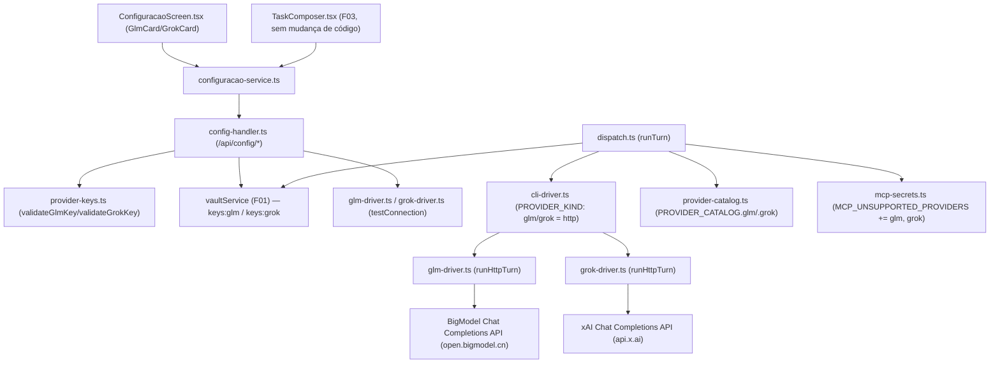

# Spec Técnica: F23. Providers GLM e Grok

## 1. Visão Geral Técnica

**O quê:** Dois novos providers de thread (GLM da Zhipu AI/BigModel, Grok da xAI) integrados ao mesmo mecanismo já usado por Minimax em F10: `ThreadProvider` ganha `'glm'` e `'grok'`, um driver HTTP dedicado por provider substitui o spawn de CLI, e dois novos cards em `#configuracao` guardam a key no vault com validação de formato e um "Testar conexão" real contra o endpoint do provider — capacidade que os cards de Codex/Minimax de F10 não têm hoje.

**Por quê:** `ThreadProvider` (`src/services/db/repositories/threads.ts:4`) é um union fechado que só sabe resolver Claude/Codex/Kimi/Minimax; GLM e Grok não têm CLI (mesmo caso de Minimax), então o caminho de execução precisa de mais dois drivers HTTP OpenAI-compatible. A diferença central em relação a F10 é que o PRD exige teste de conexão real (não só validação de formato) para os dois novos providers — hoje só o card do Claude tem essa capacidade (`claude-probe.ts`), via `spawn` do CLI; GLM/Grok não têm CLI, então o probe precisa ser feito via HTTP, reaproveitando o próprio driver de turno com um prompt mínimo.

**Escopo:** PRD não define blocos Escopo Central / Adições ao Escopo Completo para F23 (`docs/PRD.md:921-944`) — escopo é a feature inteira (Consome/Provê/Capacidades/Experiência/Tratamento de Erros).

**Incluído:**
- Vault: 2 novos secrets (`keys:glm`, `keys:grok`), mesmo namespace `keys:<provider>` de F10
- `ThreadProvider` += `'glm' | 'grok'`; dois drivers HTTP novos (`glm-driver.ts`, `grok-driver.ts`), cada um com `runHttpTurn` (turno) e `testConnection` (probe de "Testar conexão")
- Resolução de key/billing mode/catálogo/roteamento CLI-vs-HTTP estendidos para os dois novos providers (ver Seção 4, todos os pontos de switch fechados sobre `ThreadProvider`)
- Endpoints: extensão de `POST /api/config/keys/save` e `GET /api/config/status` para os dois novos campos; dois endpoints novos de teste de conexão (`POST /api/config/glm/test`, `POST /api/config/grok/test`)
- `usage_events`/custo seguem o pipeline genérico de F11 (`cost_source='table'` até haver preço cadastrado em `model_pricing` para `(glm, <modelo>)` / `(grok, <modelo>)` — nenhum código novo, é dado, não schema)

**UI/copy — lacuna registrada:** `docs/F23-providers-glm-grok/ui.md` e `copy.md` **ainda não existem** (confirmado no brief `docs/_shared/codebase-patterns.md` §5). Esta spec descreve o contrato de dados/estado que a UI vai consumir (dois cards novos, campo de key + "Testar conexão", mesmo grupo visual do card "API keys dos providers" de F10) e não define anatomia final nem strings — isso é pré-requisito do processo de design (`CLAUDE.md` → "Design · Processo") antes da implementação visual.

**Excluído:** assinatura CLI para GLM/Grok (PRD explícito: só modo API key); tool-calling/loop de `tool_use` para os dois (mesma exclusão de Minimax em F10 — nenhum precedente de execução HTTP com tools no runner); troca de provider mid-thread (fora de escopo do PRD, nota `docs/PRD.md:1044`); cadastro de preço em `model_pricing` para os dois providers (fora do PRD F23 — é operação de dados via a tela de Consumo de F11, não código).

## 2. Impacto na Arquitetura



## 3. Decisões Técnicas

### 3.1 Herdadas do brief / docs canônicos

Padrões herdados de `docs/_shared/codebase-patterns.md` e de `docs/F10-api-keys-providers/spec.md` (precedente direto — F10 fez exatamente esta integração para Minimax).

Desvios desta feature:
- O brief cita 3 pontos de switch fechados sobre `ThreadProvider` (resolução de key, billing mode, picker do composer). A exploração delta desta spec encontrou **mais quatro** pontos de switch/`Record<ThreadProvider,...>` exaustivos que o TypeScript força a atualizar, todos seguindo o mesmo padrão "adicionar entrada, sem lógica condicional nova": `PROVIDER_KIND`/`BINARY_BY_PROVIDER` em `cli-driver.ts`, `PROVIDER_CATALOG` em `provider-catalog.ts`, `PROVIDER_LABEL` em `ComposerModelControls.tsx`, e o array runtime `PROVIDERS` em `threads-handler.ts` (validação de `POST /api/threads`, sem equivalente `Record` compilado). Listados na Seção 4.
- `TaskComposer.tsx` **não precisa de nenhuma mudança de código**: a leitura de disponibilidade (`configStatus.providers[provider]`) e multimodalidade (`composerCatalog.providers[provider].multimodal`) já é genérica sobre `ThreadProvider` desde F10 — cobrir GLM/Grok é automático assim que `ConfigStatus`/`ComposerCatalog` (tipos, não componente) forem estendidos. Isso também resolve a experiência do PRD ("picker lista GLM/Grok quando a key é válida"): o picker sempre lista todos os providers do catálogo estático (`Object.keys(catalog.providers)`, `ComposerModelControls.tsx:76`); "disponível quando a key é válida" é o aviso inline de `providerUnavailable` que já existe, não uma filtragem da lista — mesmo comportamento hoje observável para Codex/Minimax sem key.
- F10 não tem "Testar conexão" real para Codex/Minimax (só para Claude, via `spawn` de CLI). F23 introduz o primeiro probe HTTP do projeto — ver Decisão 3.2.

### 3.2 Específicas da feature

| Decisão | Abordagem Escolhida | Alternativa Considerada | Trade-off |
|---------|---------------------|--------------------------|-----------|
| Estrutura dos drivers HTTP | Dois arquivos, `glm-driver.ts` e `grok-driver.ts`, cada um espelhando a forma de `minimax-driver.ts` (`runHttpTurn(input): Promise<ProviderTurnResult>`, `setFetchForTesting`/`resetFetchForTesting` injetáveis) | Um único `openai-compat-driver.ts` parametrizado por config (endpoint/modelo/header) reutilizado pelos dois | Arquivo único economiza duplicação, mas os três drivers HTTP existentes no projeto (Minimax incluso) já seguem o padrão "um arquivo por provider" com pequenas divergências de payload/erro; manter o padrão observado evita introduzir uma abstração nova sem um terceiro consumidor comprovado ainda |
| "Testar conexão" para GLM/Grok | Cada driver exporta também `testConnection(apiKey): Promise<{success:boolean; detail:string}>`, que chama o próprio `runHttpTurn` internamente com um prompt mínimo fixo (mesmo texto de sondagem de `claude-probe.ts`: "Responda apenas com a palavra: pong") e mapeia o resultado/erro para `{success, detail}`, distinguindo por `ProviderError.code`: `provider_key_missing`→sem key salva, HTTP 401/403 do driver→key inválida, `provider_network_error`→falha de rede (mensagem distinta, PRD Tratamento de Erros), qualquer outro→erro genérico do provider | Módulo de probe HTTP genérico e compartilhado (`provider-http-probe.ts`) parametrizado, análogo à alternativa dos drivers | Acoplar o teste ao próprio `runHttpTurn` evita duplicar parsing de resposta/erro (um único caminho testado cobre turno real e probe); custo é que o probe consome uma chamada real de API (mínima) em vez de um `HEAD`/endpoint de status dedicado — aceitável pois nenhum dos dois providers documenta publicamente um endpoint de "ping" sem custo de token |
| Distinção 401/403 (key inválida) no driver HTTP | `runHttpTurn`/`testConnection` capturam `res.status` antes de lançar `provider_turn_error` genérico e lançam um código dedicado `provider_auth_error` quando `status===401 \|\| status===403`, novo em relação ao `ProviderError` genérico de `minimax-driver.ts` | Reusar `provider_turn_error` genérico e inferir "key inválida" só pela mensagem (`res.statusText`) | `minimax-driver.ts` nunca precisou distinguir isso porque não há "Testar conexão" para Minimax; PRD F23 exige explicitamente diferenciar "key inválida" de "falha de rede" na UI — um código dedicado é mais robusto que parsing de string |
| Dois cards standalone (`GlmCard`, `GrokCard`) em vez de duas linhas na `KeysCard` existente | Cards próprios, cada um com campo de key (reveal, mesmo `Field.tsx` de F10) + botão "Testar conexão" próprio, análogos estruturalmente ao `ClaudeCard` (mistura de card single-purpose + probe) mas com o campo mascarado de `KeysCard` | Adicionar `glm`/`grok` como mais duas linhas em `KeysCard` (reuso total do componente) | PRD Capacidades pede "Testar conexão" por provider — `KeysCard` hoje é "salvar todas as linhas de uma vez", sem teste por linha; replicar esse grupo para dois providers com testes individuais quebraria a UX de salvamento em lote das 3 linhas existentes. Cards standalone isolam o novo comportamento sem alterar o contrato de `KeysCard`/Codex/Minimax |
| Persistência da key testada | "Testar conexão" sempre lê a key já salva no vault (`vaultService.getSecret('keys:glm'|'keys:grok')`), nunca o valor do campo ainda não salvo — mesmo contrato do `claude-probe.ts` (testa `keys:claude`, não o draft da UI) | Testar o valor digitado no campo antes de salvar | Consistência com o único probe existente no projeto; exige que o usuário salve antes de testar, o que já é comunicado implicitamente pelo botão "Testar conexão" ficar ao lado do badge de "configurada/não configurada" |
| `MCP_UNSUPPORTED_PROVIDERS` (`mcp-secrets.ts`) | GLM e Grok entram no mesmo `Set` que hoje só tem `'minimax'` — nenhum `--mcp-config`/loop de tool_use para os dois | Habilitar MCP para GLM/Grok já que ambos são "OpenAI-compatible" (poderiam suportar `tools` no payload) | PRD não pede tools/MCP para os dois; `glm-driver.ts`/`grok-driver.ts` seguem o mesmo modelo texto-only de `minimax-driver.ts` (Decisão herdada de F10 §3.2, "Tool-use para Minimax"), sem precedente de parsing de `tool_calls` no runner atual |
| Catálogo (`provider-catalog.ts`) | `multimodal: false`, `reasoningLevels: []`, `defaultReasoningLevel: null` para os dois — mesmo perfil de Minimax | Multimodal `true` (ambas APIs públicas suportam visão em alguns modelos) | PRD F23 não menciona anexos de imagem nem reasoning para GLM/Grok; alinhar ao perfil mais restrito e já testado (Minimax) evita implementar um caminho de imagem sem capacidade descrita — pode ser revisitado como follow-up se o PRD for estendido |

### 3.3 Assumptions / Auto-Aceitar

| Assumption | Origem | Pode sobrescrever? |
|------------|--------|--------------------|
| Escopo = feature completa (sem divisão Central/Completo) | PRD sem blocos de escopo para F23 | sim |
| `ui.md`/`copy.md` ainda não escritos para F23 — spec cobre só contrato de dados/estado, sem anatomia/copy finais | Passo 1.5b / brief §5 confirma ausência | sim |
| Sem key real de GLM nem de Grok disponível nesta sessão de escrita — toda a Estratégia de Testes (7.1) usa mock HTTP (`setFetchForTesting`, mesmo padrão de `minimax-driver.test.ts`); o smoke E2E contra o endpoint real (7.2, item marcado) fica **pendente de credencial do usuário**, não bloqueante para o restante da implementação | Instrução explícita desta rodada (Política de Auto-Aceitar do lote) | sim — assim que o usuário configurar uma key real |
| Endpoint GLM: `POST https://open.bigmodel.cn/api/paas/v4/chat/completions`, payload OpenAI-compatible (`messages[]` role/content, `choices[0].message.content`, `usage.prompt_tokens`/`completion_tokens`) | Pesquisa pública (BigModel/Zhipu AI Open Platform) — sem doc oficial verificada em ambiente com acesso à conta; mesmo nível de confiança que `minimax-driver.ts` já assume para a Minimax Chat Completion API | sim — confirmar/ajustar payload exato ao implementar com credencial válida |
| Endpoint Grok: `POST https://api.x.ai/v1/chat/completions`, payload OpenAI-compatible idêntico em forma ao de GLM/Minimax | Pesquisa pública (xAI Docs) — mesma ressalva de confiança acima | sim |
| Prefixo de validação Grok: chaves começam com `xai-` (confirmado publicamente, mesmo padrão de checagem de prefixo que `validateClaudeKey`/`validateCodexKey`) | Pesquisa pública (xAI Docs / apideck) | sim |
| Prefixo de validação GLM: **sem prefixo fixo documentado publicamente** (formato observado é tipicamente `<id>.<secret>`, mas não é garantido); `validateGlmKey` usa o mesmo validador "loose" de `validateMinimaxKey` (só espaço + tamanho mínimo, sem checagem de prefixo) | Pesquisa pública inconclusiva sobre um prefixo estável; precedente `validateMinimaxKey` já cobre esse caso ("sem prefixo documentado") | sim — se a Zhipu documentar um prefixo estável, adicionar checagem específica |
| Modelos default: `glm-4-plus` (GLM) e `grok-4` (Grok), sem reasoning levels, `multimodal:false` para os dois | Sem doc oficial fixada nesta sessão; mesmo tratamento de incerteza que `MINIMAX_MODEL_DEFAULT` em `minimax-driver.ts` ("a confirmar contra a doc oficial durante o rollout") | sim |
| Dois cards standalone (`GlmCard`/`GrokCard`) em vez de estender `KeysCard` | PRD Capacidades pede "Testar conexão" por provider, que `KeysCard` não modela hoje (ver Decisão 3.2) | sim — o processo de design (`ui.md`) pode decidir por outra composição visual, desde que o contrato de dados abaixo seja respeitado |
| `MCP_UNSUPPORTED_PROVIDERS` += `'glm'`, `'grok'` (sem tool-use) | Mesmo modelo de Minimax (F10 §3.2, decisão herdada) — PRD F23 não pede tools/MCP | sim |
| Nenhuma migração de banco — `threads.provider`/`usage_events.provider`/`model_pricing.provider` já são `TEXT` livre sem `CHECK` (mesma constatação de F10 §4) | Confirmado via `src/services/db/migrations/002_workspace_core.ts`, `005_consumo.ts`, `006_usage_source_textgen.ts` | não aplicável — é fato do schema, não decisão |

## 4. Visão Geral de Componentes

**Frontend:**

| Caminho do Arquivo | Novo/Modificado | Propósito | Responsabilidades-Chave |
|---------------------|------------------|-----------|--------------------------|
| `src/renderer/screens/ConfiguracaoScreen.tsx` | Modificado | Dois novos sub-componentes `GlmCard`/`GrokCard` (mesmo grupo visual do bloco "API keys dos providers" de F10) | Campo de key com reveal (reuso de `Field.tsx`), botão "Salvar chave" (reusa `saveProviderKeys` com um único campo), botão "Testar conexão" próprio por card com estado de loading/feedback |
| `src/renderer/services/configuracao-service.ts` | Modificado | `ProviderKeyName` += `'glm' \| 'grok'`; `ConfigStatus.keys`/`.providers` += `glm`/`grok`; novas funções `testGlm()`/`testGrok()` chamando os endpoints novos | Tipos espelham a resposta estendida do handler |
| `src/renderer/components/workspace/ComposerModelControls.tsx` | Modificado | `PROVIDER_LABEL` += `glm: 'GLM'`, `grok: 'Grok'` (`Record<ThreadProvider,string>` exaustivo — TS já obriga a entrada) | Sem outra mudança — picker/reasoning já são genéricos sobre `ThreadProvider` |
| `src/renderer/services/threads-service.ts` | Modificado | `ThreadProvider` += `'glm' \| 'grok'` (linha 27, espelha o tipo do backend) | Mantém o contrato de tipos frontend/backend em sincronia |
| `src/renderer/components/workspace/TaskComposer.tsx` | Nenhuma mudança | — | Já genérico sobre `ThreadProvider` desde F10 (ver Decisão 3.1); confirmação, não implementação |

**Backend:**

| Caminho do Arquivo | Novo/Modificado | Propósito | Responsabilidades-Chave |
|---------------------|------------------|-----------|--------------------------|
| `src/services/db/repositories/threads.ts` | Modificado | `ThreadProvider` += `'glm' \| 'grok'` (linha 4) | Sem migração — coluna `provider TEXT NOT NULL` sem CHECK (Assumption 3.3) |
| `src/services/vault/provider-keys.ts` | Modificado | `validateGlmKey`, `validateGrokKey` — mesmo shape `ProviderKeyValidation` de `validateMinimaxKey`/`validateCodexKey` | Grok: checa prefixo `xai-`; GLM: validador loose (mesmo nível de `validateMinimaxKey`) |
| `src/services/runner/provider-resolution.ts` | Modificado | `resolveProviderApiKey`/`resolveBillingMode` ganham branches `glm`/`grok`: sempre lê `keys:glm`/`keys:grok` do vault, billing mode sempre `'api-key'` (mesmo tratamento de Minimax, sem toggle assinatura↔key) | Reaproveita a função existente, sem nova assinatura |
| `src/services/runner/providers/cli-driver.ts` | Modificado | `PROVIDER_KIND.glm='http'`, `PROVIDER_KIND.grok='http'`; roteamento delega a `glm-driver.ts`/`grok-driver.ts` no mesmo branch que já existe para Minimax (`runCliTurn`, linha 245) | Nenhuma mudança estrutural — só mais dois casos no `Record` exaustivo e no `if` de roteamento |
| `src/services/runner/providers/glm-driver.ts` | Novo | `runHttpTurn(input)` (turno) + `testConnection(apiKey)` (probe) contra a BigModel Chat Completions API | Espelha `minimax-driver.ts`: `ProviderError` por código (`provider_key_missing`, `image_not_supported`, `provider_network_error`, `provider_auth_error`, `provider_turn_error`), `setFetchForTesting`/`resetFetchForTesting` injetáveis |
| `src/services/runner/providers/grok-driver.ts` | Novo | `runHttpTurn(input)` + `testConnection(apiKey)` contra a xAI Chat Completions API | Mesma forma de `glm-driver.ts`, endpoint/modelo/prefixo de key distintos |
| `src/services/runner/providers/provider-catalog.ts` | Modificado | `PROVIDER_CATALOG.glm`/`.grok` (modelo default, sem reasoning, `multimodal:false`) | `Record<ThreadProvider,...>` exaustivo — TS obriga as duas entradas |
| `src/services/runner/mcp-secrets.ts` | Modificado | `MCP_UNSUPPORTED_PROVIDERS` += `'glm'`, `'grok'` | Sem `--mcp-config`/loop de tools para os dois (Decisão 3.2) |
| `src/services/http/threads-handler.ts` | Modificado | `PROVIDERS` (linha 25) += `'glm'`, `'grok'`; mensagem de erro de validação atualizada | Guarda de `POST /api/threads` |
| `src/services/http/config-handler.ts` | Modificado | `ConfigStatus.keys`/`.providers` += `glm`/`grok`; `handleKeysSave` aceita campos `glm`/`grok` (mesmo merge/preserve); dois novos handlers `handleGlmTest`/`handleGrokTest` delegando a `glm-driver.testConnection`/`grok-driver.testConnection`; router += `POST /api/config/glm/test`, `POST /api/config/grok/test` | `computeConfigStatus` ganha `providers.glm.available = keys.glm`, `providers.grok.available = keys.grok` (mesmo padrão de `providers.minimax`) |

**Banco de Dados:** nenhuma migração. `threads.provider`, `usage_events.provider` e `model_pricing.provider` já são `TEXT` livre sem enum/CHECK a nível SQL (confirmado em `002_workspace_core.ts`, `005_consumo.ts`, `006_usage_source_textgen.ts`); a validação de provider continua só em TypeScript (`ThreadProvider` union) + array runtime (`threads-handler.ts`). Cadastro de preço para `(glm, <modelo>)`/`(grok, <modelo>)` em `model_pricing` é operação de dados via a tela de Consumo (F11), fora do escopo de código de F23 — até lá, `resolveTurnCost` retorna `costUsd:null, costSource:'table'` para os dois (mesmo comportamento hoje sem preço cadastrado).

## 5. Contratos de API

Todas as rotas abaixo caem em `handleConfigRequest`, já roteado por prefixo `/api/config/` em `unlock-handler.ts` — nenhuma mudança de roteamento fora de `config-handler.ts`. Auth: header `x-engrenacode-session` em todas.

### Endpoint: Salvar keys dos providers (extensão)

- **Método:** POST
- **Caminho:** `/api/config/keys/save` (existente, `config-handler.ts:320`)
- **Autenticação:** `x-engrenacode-session`

**Requisição** (campos novos; os 3 existentes — `claude`/`codex`/`minimax` — inalterados):

| Campo | Tipo | Obrigatório | Validação | Descrição |
|-------|------|-------------|-----------|-----------|
| `glm` | `string` | Não | vazio preserva; senão sem espaços, ≥8 chars, sem prefixo obrigatório (`validateGlmKey`) | Key GLM/BigModel |
| `grok` | `string` | Não | vazio preserva; senão `xai-`, sem espaços, ≥8 chars (`validateGrokKey`) | Key Grok/xAI |

```json
{ "glm": "abcdef01234.5678secretpart", "grok": "xai-abcdef0123456789" }
```

**Resposta (200):** mesmo shape existente, `keys` ganha `glm`/`grok`:

```json
{
  "saved": true,
  "keys": { "claude": true, "codex": false, "minimax": true, "glm": true, "grok": false },
  "message": "Chaves salvas localmente (não validadas com o provider)."
}
```

**Códigos de Erro:** inalterados (`unauthorized` 401, `invalid_json` 400, `validation_error` 400 com `details.glm`/`details.grok`, `internal_error` 500).

### Endpoint: Status de configuração (extensão)

- **Método:** GET
- **Caminho:** `/api/config/status` (existente)
- **Autenticação:** `x-engrenacode-session`

**Resposta (200) — campos novos:**

| Campo | Tipo | Descrição |
|-------|------|-----------|
| `keys.glm` | `boolean` | presença de `keys:glm` |
| `keys.grok` | `boolean` | presença de `keys:grok` |
| `providers.glm.available` | `boolean` | `keys.glm===true` (sem CLI, mesmo padrão de `providers.minimax`) |
| `providers.grok.available` | `boolean` | `keys.grok===true` |
| `providers.glm.reason` | `string?` | presente só quando `available===false` (ex.: "GLM sem key salva — configure em #configuracao.") |
| `providers.grok.reason` | `string?` | idem, Grok |

```json
{
  "keys": { "claude": true, "codex": false, "minimax": false, "glm": true, "grok": false },
  "providers": {
    "glm": { "available": true },
    "grok": { "available": false, "reason": "Grok sem key salva — configure em #configuracao." }
  }
}
```

### Endpoint: Testar conexão do GLM

- **Método:** POST
- **Caminho:** `/api/config/glm/test` (novo)
- **Autenticação:** `x-engrenacode-session`

**Requisição:** corpo vazio — testa a key já persistida em `keys:glm`.

**Resposta (200):**

| Campo | Tipo | Descrição |
|-------|------|-----------|
| `success` | `boolean` | `true` quando a chamada de teste respondeu com conteúdo válido |
| `detail` | `string` | mensagem de resultado (sucesso, key ausente, key inválida, ou falha de rede — três mensagens distintas) |

```json
{ "success": false, "detail": "Falha de rede ao testar a conexão com o GLM. Verifique sua internet e tente novamente." }
```

**Códigos de Erro:** sempre 200 com `success:false` no corpo (mesmo padrão de `handleClaudeTest` — nunca propaga status HTTP do provider externo como status HTTP da resposta local); `401 unauthorized` só na falta/invalidade da sessão local.

### Endpoint: Testar conexão do Grok

- **Método:** POST
- **Caminho:** `/api/config/grok/test` (novo)
- **Autenticação:** `x-engrenacode-session`

Mesmo contrato do endpoint acima, testando `keys:grok` via `grok-driver.testConnection`.

## 6. Modelo de Dados

Nenhuma migração necessária. `ThreadProvider`, `usage_events.provider` e `model_pricing.provider` continuam colunas/tipos `TEXT` livres (ver Seção 4, Banco de Dados). Nenhuma tabela, índice ou constraint novos.

## 7. Estratégia de Testes

### 7.1 Unitário / Integração

**Estrutura de Arquivo de Teste:**

| Arquivo de Teste | Tipo de Teste | Alvo | Objetivo de Cobertura |
|-------------------|----------------|------|--------------------------|
| `src/services/vault/provider-keys.test.ts` (extensão) | Unitário | `validateGlmKey`, `validateGrokKey` | Todos os branches de validação |
| `src/services/runner/providers/glm-driver.test.ts` (novo) | Unitário | `runHttpTurn`, `testConnection` (`glm-driver.ts`) | Todos os `ProviderError.code` + caminho feliz |
| `src/services/runner/providers/grok-driver.test.ts` (novo) | Unitário | `runHttpTurn`, `testConnection` (`grok-driver.ts`) | Todos os `ProviderError.code` + caminho feliz |
| `src/services/runner/providers/provider-catalog.test.ts` (extensão) | Unitário | `PROVIDER_CATALOG.glm`/`.grok` | Consistência default/multimodal, mesmo padrão das asserções existentes |
| `src/services/runner/provider-resolution.test.ts` (novo) | Unitário | `resolveProviderApiKey`, `resolveBillingMode` para `glm`/`grok` | Key ausente → `undefined`; key presente → valor do vault; billing mode sempre `'api-key'` |
| `src/services/http/config-handler.test.ts` (extensão) | Integração (HTTP real via `http.createServer`, padrão do arquivo) | `handleKeysSave` (campos `glm`/`grok`), `handleGlmTest`, `handleGrokTest`, `computeConfigStatus` | Save com merge/preserve; teste 200 com `success:true/false` nos 3 casos de erro (key ausente, key inválida, rede) |
| `src/services/http/threads-handler.test.ts` (extensão) | Integração | `POST /api/threads` com `provider:'glm'`/`'grok'` | Aceita os dois; rejeita valores fora do array `PROVIDERS` |

**Funções de teste (novas, `glm-driver.test.ts` — `grok-driver.test.ts` espelha os mesmos casos trocando o provider):**

| Função de Teste | Descrição | Assertions |
|-------------------|-----------|-------------|
| `throws provider_key_missing when no api key is present` | `runHttpTurn` sem `apiKey` | rejeita com `{code:'provider_key_missing'}` |
| `sends the Authorization header and resolves the response text` | Mock `setFetchForTesting` retornando 200 + `choices[0].message.content` | `result.text` igual ao mock; header `Authorization: Bearer <key>` |
| `throws provider_auth_error on 401/403 response` | Mock retornando status 401 | rejeita com `{code:'provider_auth_error'}` (usado por `testConnection`) |
| `throws provider_network_error when fetch rejects` | Mock lança `Error('ECONNREFUSED')` | rejeita com `{code:'provider_network_error'}` |
| `throws provider_turn_error on other non-2xx response` | Mock retornando 500 | rejeita com `ProviderError` código `provider_turn_error` |
| `extracts usage from the response (OpenAI-compat shape)` | Mock com `usage.prompt_tokens`/`completion_tokens` | `result.usage` populado, `cacheReadTokens`/`cacheCreationTokens` `null` |
| `testConnection returns success:true on 2xx` | Mock 200 válido | `{success:true}`, `detail` de sucesso |
| `testConnection returns a distinct message for provider_auth_error vs provider_network_error` | Dois mocks (401 vs fetch-throw) | `detail` diferente entre os dois casos (PRD Tratamento de Erros) |
| `testConnection returns key-missing message when no key is saved` | `apiKey` ausente | `{success:false}`, `detail` de key ausente, sem chamar `fetchImpl` |

Se o codebase já tem runner de testes (Vitest, confirmado no brief) — nenhum bootstrap necessário.

### 7.2 Smoke / Aceitação manual

Fluxo feliz + erros, executável sem ler código. Item 5 fica **pendente de credencial real do usuário** (Assumption 3.3) — não bloqueia o fechamento das fases de código/testes unitários.

| # | Passo | Resultado esperado |
|---|-------|----------------------|
| 1 | Abrir `#configuracao`, ver os dois cards novos (GLM, Grok) no mesmo grupo visual do bloco de keys de F10 | Cards visíveis, campo vazio, badge "não configurada" |
| 2 | Digitar uma key GLM sem prefixo `xai-` reconhecível e sem espaços, salvar | Save aceito (validador loose de GLM não exige prefixo) |
| 3 | Digitar uma key Grok que não começa com `xai-`, salvar | Erro específico exibido no card, nada salvo |
| 4 | Após salvar uma key (qualquer uma), clicar "Testar conexão" **sem** acesso à internet | `detail` de falha de rede, distinto da mensagem de key inválida |
| 5 | *(pendente de credencial real)* Com uma key GLM/Grok real salva, clicar "Testar conexão" | `success:true`, provider aparece com `providers.glm.available`/`.grok.available = true` |
| 6 | Abrir o composer, abrir o picker de provider | GLM e Grok aparecem na lista (mesmo picker, sempre lista o catálogo estático) |
| 7 | Selecionar GLM/Grok no picker sem key salva | Aviso inline "Provider indisponível" com o motivo (`providers.glm.reason`/`.grok.reason`) — thread não pode ser enviada |
| 8 | Remover a key de um provider com threads antigas daquele provider, abrir uma thread antiga | Thread abre em modo somente leitura (mesmo comportamento hoje para provider indisponível — sem código novo, comportamento herdado) |

### 7.3 Cross-feature

| Critério | Status | Nota |
|----------|--------|------|
| GLM/Grok (F23) aparecem como `ThreadProvider` disponível no Workspace (F03) quando a key de F02/F10 é válida | ready | F03 (Workspace/dispatch) já é genérico sobre `ThreadProvider`; nenhuma mudança em `dispatch.ts` além do que a Seção 4 já lista |
| `usage_events` do turno GLM/Grok agregam corretamente na tela de Consumo (F11) | ready | `usage-events.ts`/`pricing.ts` já são genéricos por `(provider, model)` — sem código novo |
| Key removida com threads antigas naquele provider → threads antigas ficam somente leitura | ready | Comportamento herdado de F10 (provider indisponível), sem lógica nova específica de GLM/Grok |
| Troca de provider mid-thread não é afetada por GLM/Grok | deferred até F16 (fora de escopo, confirmado no PRD) | Nenhuma ação necessária em F23 |
