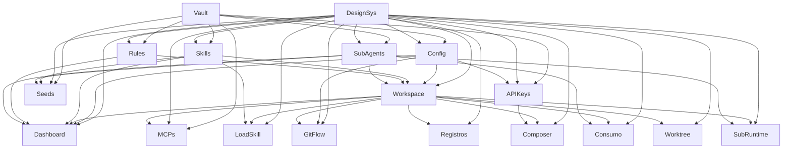

# EngrenaCode

## 1. Sumário Executivo

O EngrenaCode é o produto da Lukse: uma IDE desktop local-first (Electron) para desenvolvedores que já usam agentes de IA no trabalho real. Em vez de improvisar no terminal a cada sessão, o usuário configura providers e credenciais uma vez, abre o repositório local e orquestra agentes (Claude, Codex, Kimi no MVP; Minimax via API key na 1.0) com histórico, revisão de diffs arquivo a arquivo e fluxo GitHub (commit, push, PR) na mesma tela.

O público é single-user local: o dono da máquina. Personas primárias são o desenvolvedor solo/freelancer e o pleno em time pequeno que quer velocidade com controle; persona secundária é o tech lead que curadoria skills, rules e subagents como padrão da casa, sem RBAC nem multi-tenant no produto.

O valor central é sair de “perguntei e copiei/colei” para “pedi, revisei o diff, aceitei ou rejeitei e segui no mesmo fluxo”, com catálogo reutilizável (skills, rules, subagents), dashboard operacional multi-projeto, audit log (Registros), MCPs e consumo estimado de tokens/custo. A versão 1.2 fecha gaps de paridade com o produto legado (skills sob demanda de verdade, worktree real, git/PR com texto por IA, subagents runtime comprovado, composer com modelo/reasoning/@file/imagens e seeds de onboarding). Nada do código do usuário passa por servidor da Lukse: o app roda no loopback com cofre cifrado local.

## 2. Problema e Oportunidade

### O Problema

**Trabalho espalhado entre terminal, editor e Git**
- Conversa num lugar, diff noutro, commit noutro
- Contexto do repositório é reexplicado a cada sessão
- Tempo perdido em copy/paste e troca de janelas
- Maior risco de aceitar mudança sem revisão estruturada

**Setup repetitivo de providers e credenciais**
- Login de Claude/Codex/Kimi refeito ou esquecido entre máquinas
- Token GitHub e prompt base sem lugar único e confiável
- Onboarding lento: minutos perdidos antes do primeiro turno útil
- Falhas de auth descobertas só no meio da tarefa

**Falta de visibilidade do que está rodando ou pendente**
- Scroll do terminal esconde threads ativas e erros
- Diffs pendentes esquecidos em projetos paralelos
- Sem visão agregada multi-repo do estado operacional
- Decisões de “continuar ou parar” sem painel único

**Instruções e especialistas reinventados a cada conversa**
- Padrões de código, review e PR colados de novo
- Tarefas grandes estouram contexto num agente só
- Sem delegação controlada para especialistas
- Lead técnico não tem catálogo local para padronizar o harness

**Integrações e custo opacos (pós-MVP)**
- Tools externas (Slack, Linear, etc.) fora do fluxo do agente
- Sem trilha auditável de tasks, tools e git
- Tokens e custo estimados invisíveis até a fatura do provider

### A Oportunidade

| Problema | Como o EngrenaCode resolve |
|----------|----------------------------|
| Trabalho espalhado | Workspace amarra projeto, threads, streaming, diffs e GitHub na mesma UI |
| Setup repetitivo | Config central: vault, auth Claude, CLIs, prompt global, token GitHub (API keys na 1.0) |
| Falta de visibilidade | Dashboard com saúde da config, inbox de atenção e atalhos para o workspace |
| Instruções reinventadas | Skills sob demanda, rules permanentes, subagents delegáveis com revisão unificada |
| Integrações e custo opacos | Registros + MCPs (1.0) e Consumo com preços editáveis e custo congelado (1.1) |
| Gaps pós-migração (catálogo sem runtime, worktree fantasma, git/PR incompleto, composer pobre) | Versão 1.2 (F12–F17): load_skill real, worktree isolado, git flow + textgen, subagents E2E, composer avançado, seeds |

Diferencial: local-first, multi-provider por assinatura/CLI no MVP, revisão de diffs como gate obrigatório antes do disco. Ondas 1–4 entregaram o núcleo F01–F11; a 1.2 fecha a paridade operacional com o legado sem abrir ainda pipeline/memory/codegraph/voz (permanecem no §7).

## 3. Público-Alvo

### Usuários Primários

**Rafa — desenvolvedor solo / freelancer**
- Alterna 2–4 projetos por semana e providers conforme cliente
- Precisa abrir o repo certo rápido, revisar diff e não refazer login
- Usa o EngrenaCode como centro de comando, não como terminal solto

**Marina — desenvolvedora plena em startup pequena**
- Entrega feature com IA diariamente, sozinha ou em par
- Precisa de histórico, dashboard de pendências e controle antes do push
- Prioriza velocidade com supervisão (`supervised` / `auto-accept-edits`), não autonomia cega

**Leo — tech lead / sênior (persona secundária)**
- Mesmo produto single-user; investe em skills, rules e subagents do padrão da casa
- Não administra time dentro do app (sem RBAC); compartilha artefatos fora (repo/markdown)
- Uso mais curador do que operacional

### Perfil Comportamental

Já usa agente de IA em repositórios reais; prefere app local com cofre; aceita configurar CLI/assinatura; quer ver e decidir diffs antes de commit/PR; não espera SaaS colaborativo nesta fase.

## 4. Objetivos

### Objetivos do Produto

**Adotar o workspace como lugar principal de trabalho (MVP)**
- Migrar o fluxo diário do terminal solto para o EngrenaCode

**Completar setup sem abandono (MVP)**
- Levar o usuário do unlock ao primeiro provider + GitHub em minutos

**Tornar o catálogo hábito (MVP)**
- Skills, rules e subagents usados de fato nas threads, não só cadastrados

**Integrar além do chat puro (1.0)**
- Registros auditáveis, MCPs no turno e API keys quando a assinatura não basta

**Tornar o consumo decidível (1.1)**
- Tokens e custo estimado visíveis para ajustar provider/modelo com informação

**Fechar a paridade operacional pós-migração (1.2)**
- Skills carregam content sob demanda; worktree isola de verdade; git/PR e composer recuperam o nível do legado; subagents delegam com prova E2E

### Métricas de Sucesso

| Objetivo | Métrica | Condição de medição |
|----------|---------|---------------------|
| Workspace como lugar principal | ≥ 70% das sessões ativas com ≥ 1 thread concluída (mensagem enviada + diff revisado ou turno finalizado) | Primeiros 30 dias de uso ativo (≥ 3 dias distintos na semana) |
| Setup sem abandono | ≥ 80% dos que desbloqueiam o cofre conectam ≥ 1 provider (Claude, Codex ou Kimi) + token GitHub em ≤ 15 minutos | Funil de onboarding nos primeiros 7 dias após instalação |
| Catálogo como hábito | Usuários com ≥ 3 skills ou rules usam catálogo em ≥ 50% das threads | Dias 15–45 após o primeiro projeto cadastrado |
| Integração 1.0 | ≥ 40% dos ativos semanais com ≥ 1 MCP vinculado e ≥ 1 registro consultado ou gerado por semana | Semanas 4–8 após release 1.0 (usuários com ≥ 2 projetos) |
| Consumo 1.1 | ≥ 60% dos que gastam tokens abrem Consumo ≥ 1×/semana; ≥ 30% desses ajustam provider/modelo ou pausam thread após ver custo | Primeiros 30 dias pós-1.1, contas com ≥ 10 turnos no período |
| Paridade 1.2 | ≥ 50% das threads com skill vinculada disparam ≥ 1 `load_skill`; ≥ 30% dos commits pelo app usam texto gerado por IA; ≥ 1 delegação `call_subagent` bem-sucedida por usuário ativo/semana | Primeiros 30 dias pós-1.2, contas com ≥ 5 turnos no período |

## 5. Histórias de Usuário

### F01. Vault e Sessão Local
- Como usuário, quero criar uma senha de cofre no primeiro uso para proteger credenciais em repouso
- Como usuário, quero desbloquear o app com workspace e senha para obter sessão local e acessar rotas protegidas
- Como sistema, quero bloquear rotas protegidas quando o cofre estiver travado para impedir uso sem unlock

### F01.1 Design System
- Como usuário, quero escolher tema claro, escuro ou seguir o sistema para trabalhar com o contraste que prefiro
- Como usuário, quero que minha escolha de tema persista entre aberturas do app para não reconfigurar a cada sessão
- Como usuário, quero que a troca de tema e o boot não pisquem cores erradas para a experiência parecer estável
- Como desenvolvedor de UI, quero tokens semânticos (bg/surface/fg/accent/status) e escalas de spacing/radii fixas para telas novas ficarem consistentes sem hexes soltos
- Como usuário do chat, quero código destacado (Shiki light/dark) e markdown com tipografia/cores do sistema para ler respostas com hierarquia clara
- Como sistema, quero splash do shell alinhado ao fundo dark `#0a0a0b` para o boot Electron não flashar branco

### F02. Configuração MVP
- Como usuário, quero autenticar o Claude por assinatura (Claude Code) e testar a conexão para garantir que o provider responde
- Como usuário, quero ver o status das CLIs Claude, Codex e Kimi (instalado/logado) e testar conexões em lote
- Como usuário, quero editar, restaurar ou desligar o system prompt global do harness para padronizar todos os turnos
- Como usuário, quero salvar um Personal Access Token do GitHub com validação de formato para commit, push e PR

### F03. Workspace
- Como usuário, quero cadastrar uma pasta local como projeto e criar threads com provider, modelo, access level e execution mode
- Como usuário, quero enviar mensagens com streaming, ver tool calls e histórico persistente, e enfileirar follow-up se a thread estiver ocupada
- Como usuário, quero aceitar ou rejeitar diffs arquivo a arquivo antes que mudanças entrem no disco
- Como usuário, quero fazer commit, push e abrir PR no GitHub a partir do workspace, bloqueados enquanto a thread estiver running
- Como sistema, quero impedir uma segunda execução longa no mesmo projeto (lease) retornando thread_busy

### F04. Dashboard
- Como usuário, quero ver a saúde da configuração (Claude, CLIs, GitHub, prompt global) na primeira tela após o unlock
- Como usuário, quero uma inbox do que precisa de atenção (running, diff pendente, erro, setup incompleto) para agir em segundos
- Como usuário, quero clicar numa thread com diff pendente e cair no workspace já na aba Diff
- Como usuário, quero ver contadores de skills, rules e subagents e ir às telas de catálogo

### F05. Skills
- Como usuário, quero criar, editar, excluir e habilitar skills globais em markdown
- Como usuário, quero vincular skills a um projeto e ordená-las no harness do repo
- Como sistema, quero expor o catálogo de skills ao agente e entregar o content via load_skill sob demanda

### F06. Rules
- Como usuário, quero criar rules globais ou por projeto e suprimir uma rule global em um projeto específico
- Como usuário, quero que rules ativas sejam injetadas em todo turno com precedência projeto > global > arquivos do repo
- Como lead técnico, quero manter ≤ 15 rules ativas por projeto para não poluir o contexto

### F07. SubAgents
- Como usuário, quero cadastrar subagents com prompt, provider (Claude, Codex, Kimi ou inherit), modelo e allowlist de tools
- Como usuário, quero vincular subagents do tipo dev a um projeto para o agente principal poder delegar
- Como usuário, quero ver runs de subagents aninhados na timeline e revisar os diffs dos filhos na mesma revisão do pai

### F08. Registros
- Como usuário, quero consultar um audit log local de eventos task, tool e git com filtro e paginação
- Como usuário, quero clicar no id da thread de um registro e abrir essa thread no workspace
- Como sistema, quero gravar automaticamente eventos de dispatch, tools relevantes e fluxo git sem entrada manual

### F09. MCPs
- Como usuário, quero adicionar MCPs do catálogo first-party ou criar custom (stdio, http, sse) e vinculá-los a projetos
- Como usuário, quero preencher secrets no vault e conectar OAuth em servers remotos para as tools ficarem disponíveis no turno
- Como sistema, quero omitir MCPs com secret ausente ou OAuth expirado sem abortar o turno inteiro

### F10. API Keys dos Providers
- Como usuário, quero alternar Claude entre assinatura e API key e salvar keys de Claude, Codex e Minimax no cofre
- Como usuário, quero testar a conexão Claude em modo API key e ver o provider Minimax disponível nas threads
- Como sistema, quero preservar a key anterior em save parcial vazio e só cobrar modo API key quando eu escolher explicitamente

### F11. Consumo
- Como usuário, quero ver tokens e custo estimado por período com drill-down projeto → thread → evento
- Como usuário, quero editar preços por modelo (USD por milhão de tokens) e cadastrar modelos observados sem preço
- Como usuário, quero ver o share de custo de subagents separado do agente principal
- Como sistema, quero congelar cost_usd no fim do turno (sdk ou table) sem reescrever eventos já precificados ao editar a tabela

### F12. Runtime de Skills (load_skill)
- Como sistema, quero registrar a tool `load_skill` no turno para o agente carregar o markdown da skill sob demanda
- Como usuário, quero que só skills vinculadas e habilitadas no projeto sejam carregáveis naquele turno
- Como sistema, quero que o snapshot do catálogo congele no início do turno para uma edição mid-turn não alterar o content já anunciado

### F13. Isolamento Worktree
- Como usuário, quero escolher execution mode `worktree` e ter o agente escrever numa árvore git isolada, não no working tree principal
- Como sistema, quero criar o worktree no primeiro envio, persistir `worktreePath` na thread e usá-lo em dispatch, diffs e git
- Como usuário, quero ver falha clara se a criação do worktree for impossível (repo sujo sem HEAD, path ocupado, git ausente)

### F14. Fluxo Git Completo
- Como usuário, quero Commit, Commit & push e Commit, push & PR na mesma superfície do workspace
- Como usuário, quero gerar a mensagem de commit e o título/corpo do PR com IA no provider da thread, com edição manual antes de confirmar
- Como usuário, quero abrir o PR no browser após sucesso e ver erro acionável se faltar token GitHub

### F15. Runtime de SubAgents
- Como usuário, quero que o agente pai invoque `call_subagent` de verdade e veja o run na timeline com status, duração e idle timeout
- Como usuário, quero revisar diffs do filho na mesma aba Diff do pai
- Como sistema, quero gravar usage_event source=subagent para o share aparecer em Consumo após delegação real

### F16. Composer Avançado
- Como usuário, quero escolher modelo e reasoning level na thread (provider permanece imutável após o primeiro envio)
- Como usuário, quero mencionar arquivos com `@` para anexar caminhos ao prompt
- Como usuário, quero anexar imagens ao composer nos providers que suportam multimodal

### F17. Catálogo Seed de Onboarding
- Como usuário novo, quero encontrar um conjunto inicial de skills e subagents já cadastrados após o primeiro unlock
- Como lead técnico, quero poder editar, desabilitar ou excluir qualquer seed como item normal do catálogo
- Como sistema, quero aplicar seeds no máximo uma vez por cofre (idempotente; não sobrescrever customizações)

### F01. Vault e Sessão Local

**Provê:**
- Armazenamento cifrado de segredos e credenciais de providers/integrações (usado por F02, F09, F10)

**Capacidades:**
- Cofre cifrado em disco; credenciais nunca no SQLite em claro
- Unlock com workspace (identificador local não vazio) + senha não vazia
- Após 5 falhas consecutivas: backoff até 60s com botão bloqueado
- Sem recuperação de senha: esquecer a senha implica recriar o workspace/credenciais
- Rotas protegidas exigem cofre desbloqueado; surface pública limitada ao unlock

**Experiência:**
- Gate `#login` no boot → submit → unlock HTTP → token via IPC → navegação ao destino
- Botão desabilitado se faltar campo, durante submit ou em backoff
- Mensagens: “Workspace ou senha inválidos.”; “O cofre local está danificado ou ilegível…”; “Muitas tentativas. Tente novamente em Xs.”; “Verifique se o EngrenaCode está em execução.”

**Tratamento de Erros:**
- Credenciais inválidas → mensagem genérica (sem revelar qual campo falhou)
- Cofre corrompido → orientar backup/recriação
- Server local indisponível → “Verifique se o EngrenaCode está em execução.”
- Travamento durante uso → retorno imediato ao gate; 423/401 nas APIs

### F01.1 Design System

Fundação de estilo global do renderer EngrenaCode (herança visual Design Lock). Não é feature de fluxo de negócio.

**Provê:**
- Tokens semânticos de cor light/dark, spacing, radii e famílias tipográficas para todas as UIs do renderer (usado por F02, F03, F04, F05, F06, F07, F08, F09, F10, F11, F12, F13, F14, F15, F16, F17)
- Runtime de tema `light` | `dark` | `system` com persistência e anti-flash (usado por F02, F03, F04)
- Padrões de superfície (card, input, badge, modal, focus, markdown chat) e wiring Shiki/xterm ao tema (usado por F03, F16)

**Escopo Central:**
- Paleta flat, spacing/radii travados, tipografia base, tema tri-modo, splash anti-flash, padrões de superfície e syntax highlight alinhado ao tema

**Adições ao Escopo Completo:**
- Type scale, shadows, z-index e motion tokenizados; breakpoints desktop formalizados (hoje Tailwind default)

**Capacidades:**
- Cores semânticas (sem escala 50–900): `bg`, `surface`, `surface-2`, `border`, `fg`, `muted`, `accent`, `accent-2`, `green`, `amber`, `red` + scrollbar
- Light: bg `#f7f7f8`, surface `#ffffff`, surface-2 `#f1f1f3`, border `#e2e2e6`, fg `#1a1a1d`, muted `#6b6b73`
- Dark (travado): bg `#0a0a0b`, surface `#121214`, surface-2 `#17171a`, border `#232327`, fg `#ededee`, muted `#a1a1aa`
- Accent idêntico nos dois modos: `#ff6b00`; accent-2 `#ff8c2e`
- Status: green light `#2e9e43` / dark `#3fb950`; amber `#b07d1f` / `#d2a23a`; red `#cf3b3b` / `#e05555`
- Scrollbar thumb light `#c8c8d0` / dark `#3a3a42`; hover `#a8a8b2` / `#52525b`
- Spacing: xs 4px, sm 8px, md 16px, lg 24px, xl 40px
- Radii: sm 5px, md 8px, lg 12px
- Fontes display/body: DM Sans Variable → Figtree Variable → system-ui; mono: JetBrains Mono Variable → JetBrains Mono → IBM Plex Mono
- Tema runtime: exatamente `light` | `dark` | `system`; `darkMode: class`; classe `.dark` em `<html>`
- Persistência: `localStorage` chave `engrenacode:theme`
- Anti-flash: `.no-transitions` na troca; splash do shell `#0a0a0b`
- Shiki: `github-light` / `github-dark` conforme tema resolvido; xterm lê `--bg`, `--fg`, `--accent`, `--border` + JetBrains Mono
- Stack: Tailwind 3 + CSS variables + React no renderer; sem MUI, Chakra, Emotion, CSS Modules ou Storybook obrigatório
- Experimento Grotesk: experimento reversível (alias de DM Sans/Figtree); não sobrescreve mono; não é identidade tipográfica definitiva do produto
- Fora do Design Lock (não contrato central): cores de diff/provider brands, overlay `bg-black/50`, CSS de `_reversa_docs`, palette do mascote satélite

**Experiência:**
- Boot → splash `#0a0a0b` → leitura de `engrenacode:theme` → se `system`, resolve via `prefers-color-scheme` → aplica/remove `.dark`
- Preferência inválida ou ausente: fail-soft para `system` (sem bloquear a UI)
- Troca de tema: suprime transições (`.no-transitions`, duração 0s), aplica tokens, remove a classe de anti-flash, persiste a escolha
- Superfícies tipadas: card `rounded-lg border border-border bg-surface p-lg`; input com `border-border` / `focus:border-accent`; badge accent `bg-accent/20 font-mono text-accent`; modal `z-50` + `bg-surface shadow-lg`; focus `focus-visible:ring-2 focus-visible:ring-accent`; markdown via `.chat-markdown`
- Utilitários canônicos: `bg-bg`, `bg-surface`, `text-fg`, `text-muted`, `border-border`, `bg-accent`, `ring-accent`, `p-md`/`p-lg`, `rounded-sm|md|lg`, `font-display`/`font-body`/`font-mono`

### F02. Configuração MVP

**Consome:**
- F01: armazenamento cifrado para gravar/ler status sensível e segredos de configuração
- F01.1: tokens semânticos, tema runtime e padrões de superfície para a tela `#configuracao`

**Provê:**
- Status de providers CLI (Claude assinatura, Codex, Kimi), prompt global e flag de token GitHub (usado por F03, F04)
- Texto do system prompt global do harness (usado por F03)

**Escopo Central:**
- Auth Claude por assinatura, status/teste das 3 CLIs, prompt global, token GitHub

**Adições ao Escopo Completo:**
- Caminho manual de binário quando auto-detecção falhar; avisos de performance para prompt > 8–10k caracteres

**Capacidades:**
- Providers MVP: Claude, Codex, Kimi (sem GLM, Grok, Minimax nesta feature)
- Claude: detecta login Claude Code (`~/.claude.json` / `~/.claude`); “Testar conexão” com turno mínimo
- CLIs: instalado/não, logado/não; “Testar conexões” → “Teste concluído: X/3 CLIs logados.”
- Prompt global: salvar custom, restaurar padrão EngrenaCode, esvaziar para desligar injeção; vale no próximo turno
- GitHub PAT: sem espaços; ≥ 8 chars; prefixos `ghp_`, `github_pat_`, `gho_`, `ghu_`, `ghs_`, `ghr_`; escopos recomendados `repo` e `workflow`; save sem ping ao GitHub

**Experiência:**
- Tela `#configuracao` só com cofre aberto
- Cards: Claude, CLIs, Prompt global, GitHub
- Feedbacks: “✓ Usando a assinatura…”, “Assinatura selecionada, mas não detectei login…”, “Prompt global salvo…”, “Token salvo localmente (não validado com o GitHub).”

**Tratamento de Erros:**
- Assinatura sem login → orientar `claude` no terminal
- Rate limit no teste → mensagem de limite com retry
- Formato de token inválido → “Formato inválido. Esperado: ghp_… ou github_pat_…”
- Falha ao carregar paths das CLIs → bloquear save e pedir “Testar conexões”

### F03. Workspace

**Consome:**
- F01.1: tokens, tema resolvido, padrões de superfície, Shiki/xterm e markdown chat
- F02: status de providers e prompt global; token GitHub quando houver push/PR
- F05: catálogo e content de skills vinculadas ao projeto
- F06: bloco de rules resolvidas para o turno
- F07: definições de subagents vinculados para call_subagent

**Provê:**
- Projetos, threads (estado, provider, model, diffs pendentes, executionMode/worktreePath) e atividade recente (usado por F04, F08, F11, F12, F13, F14, F15, F16)
- Eventos de dispatch, tools e git para audit log (usado por F08, F14)
- Usage por turno agent/subagent (usado por F11, F15)
- Contexto de thread (provider, model, reasoning, cwd) para textgen git (usado por F14)

**Escopo Central:**
- Projetos, threads, chat streaming, diffs accept/reject, git básico GitHub, lease 1 execução/projeto, integração com skills/rules/subagents no turno

**Adições ao Escopo Completo:**
- Contadores de MCPs na sidebar (só após F09); chips de provider Minimax (após F10)

**Capacidades:**
- Projetos: pasta local; `git init` opcional se não for repo; sem teto duro (orientação 10–15 repos ativos)
- Thread: 1 provider entre Claude, Codex, Kimi; access levels `supervised` | `auto-accept-edits` | `full-access`; execution mode `main` | `worktree` travado no primeiro envio
- 1 thread running por projeto; conflito → 409 `thread_busy`
- Diffs: pending | accepted | rejected por arquivo
- Git mutável bloqueado com thread running
- Codex como pai de subagent exige `full-access` explícito

**Experiência:**
- `#principal`: sidebar projetos/threads, histórico streaming, aba Diff, composer
- Tool calls com status explícito; follow-up enfileirável
- Diffs dos subagents na mesma revisão do pai

**Tratamento de Erros:**
- Provider indisponível → composer desabilitado com motivo (“Codex não logado”, etc.)
- thread_busy → mensagem clara de projeto ocupado
- Falha de push/PR por token → erro no fluxo git (não no save da config)
- Turno com erro → thread `error` visível no dashboard

### F04. Dashboard

**Consome:**
- F01.1: tokens semânticos, tema e padrões de superfície para cards e inbox
- F02: saúde da config (Claude, CLIs, GitHub, prompt)
- F03: projetos, threads running/error, diffs pendentes, atividade recente
- F05: contagem de skills globais e vínculos
- F06: contagem de rules
- F07: contagem de subagents

**Capacidades:**
- Primeira tela pós-unlock: `#dashboard` (separada do workspace)
- Widgets: saúde config; 4 cards (projetos, running, diffs pendentes, erros); inbox ≤ 20 itens; grade de projetos; resumo de catálogo; últimas 10 threads
- Refresh ao abrir + botão Atualizar; opcional a cada 30s com tela visível
- Não dispara turno, não aceita diff, não faz commit/PR

**Experiência:**
- Clique em inbox → workspace com projeto/thread; diff pendente abre aba Diff; running abre Histórico
- “Completar configuração” → `#configuracao`
- Empty: “Adicione um projeto…”, “Nada pendente…”, banner de setup incompleto

### F05. Skills

**Consome:**
- F01.1: tokens e padrões de superfície para a tela `#skills`

**Provê:**
- Catálogo (nome, description) e content carregável via load_skill, com vínculo por projeto (usado por F03, F12)
- Contagens para o dashboard (usado por F04)
- Itens seedáveis no primeiro unlock (usado por F17)

**Capacidades:**
- CRUD global: name único, description (~200 chars orientação), content markdown (teto prático ~1 MiB), category opcional, enabled
- Vínculo por projeto com enabled e ordem; trigger MVP apenas `auto`
- Recomendação ≤ 30 skills vinculadas por projeto
- Skill não executa código; só orienta o agente

**Experiência:**
- Tela `#skills` para CRUD; vínculo no modal Repo Harness do workspace
- Agente vê catálogo e chama `load_skill` sob demanda

**Tratamento de Erros:**
- Name duplicado → erro de conflito
- Content acima do limite de body → rejeição no save
- Skill desvinculada → ausente do catálogo do turno

### F06. Rules

**Consome:**
- F01.1: tokens e padrões de superfície para a tela `#rules`

**Provê:**
- Bloco markdown de rules do dono (globais e por projeto, com override) para injeção em todo turno (usado por F03)
- Contagens para o dashboard (usado por F04)

**Capacidades:**
- CRUD: name sem CR/LF, content markdown (~1 MiB prático), enabled, isGlobal
- Não-global: só projetos vinculados; global: todos, com override off por projeto
- Precedência: rule de projeto > rule global > CLAUDE.md/AGENTS.md do repo
- Recomendação ≤ 15 rules ativas por projeto (globais + locais)

**Experiência:**
- Tela `#rules`; vínculo/supressão no Workspace
- Injeção inline antes do system prompt da thread, em todo turno

**Tratamento de Erros:**
- Name inválido/duplicado → rejeição
- Cofre travado → sem resolução de rules no turno

### F07. SubAgents

**Consome:**
- F01.1: tokens e padrões de superfície para a tela `#subagents` e timeline

**Provê:**
- Definições e runs efêmeros invocáveis (call_subagent), timeline aninhada e diffs do filho na revisão do pai (usado por F03, F15)
- Eventos de usage source=subagent (usado por F11, F15)
- Contagens para o dashboard (usado por F04)
- Itens seedáveis no primeiro unlock (usado por F17)

**Capacidades:**
- CRUD: name, description, prompt (~1 MiB), provider Claude|Codex|Kimi|inherit, model, reasoningLevel, tools (null=tudo / lista / []=restrito extremo), category, idleTimeoutMinutes default 20
- Vínculo: só `kind=dev` no MVP; ≤ 10 vinculados por projeto (recomendação)
- Filho sem MCP no MVP; sem row em `threads`
- Codex pai só delega com full-access

**Experiência:**
- Tela `#subagents`; card “Subagents” na sidebar do workspace (runs, status, duração)
- Delegação via `call_subagent`; resultado volta ao pai

**Tratamento de Erros:**
- Name duplicado → conflito
- Timeout de idle → run encerrado com status visível
- Provider do filho indisponível → falha da delegação com mensagem no pai

### F08. Registros

**Consome:**
- F01.1: tokens e padrões de superfície para a tela `#registros`
- F03: eventos de task (dispatch), tool e git (accept/reject, commit, push, PR) e ids de thread

**Capacidades:**
- Tela `#registros` somente leitura sobre `log_entries`
- Campos: timestamp, tipo (`task`|`tool`|`git`), evento, thread id
- Paginação 100/página; filtro Todos / Tasks / Tool calls / Git flow
- Cascade: apagar thread remove registros; sem edit/delete individual; sem export na 1.0; sem purge automático

**Experiência:**
- Clique no thread id → workspace com a thread
- Empty: “Nenhum registro ainda” vs “Nenhum registro para este filtro”

**Tratamento de Erros:**
- Cofre travado → lista vazia / 423
- Falha de load → “Não foi possível carregar os registros.” + Tentar novamente

### F09. MCPs

**Consome:**
- F01: vault para secrets e tokens OAuth
- F01.1: tokens e padrões de superfície para a UI de MCPs
- F03: vínculo por projeto e injeção de tools no turno

**Provê:**
- Tools `mcp__<server>__<tool>` no ambiente do agente quando vinculado e resolvido (usado por F03)
- Status omitido/âmbar quando secret/OAuth falha (usado por F03, F04)

**Capacidades:**
- Catálogo first-party (~14 presets) + CRUD custom
- Nome `^[a-z0-9][a-z0-9_-]*$`; `engrenacode` reservado
- Transports: stdio, http, sse; HTTPS obrigatório em remoto; HTTP só loopback
- Secrets: refs no vault; secret em header stdio rejeitado; secret-wrapper loopback; GET só nomes de chaves
- OAuth PKCE loopback; status público no DB; tokens só no vault
- ≤ 8 MCPs vinculados por projeto (recomendação); Codex MCP exige full-access (aviso UI)
- Falha de resolve → MCP em omitted[] com reason; turno continua

**Experiência:**
- `#mcps` para catálogo; vínculo no Workspace; pills de status no workspace
- Connect OAuth / Converter para OAuth opt-in

**Tratamento de Erros:**
- Nome inválido/duplicado → 422/409
- Secret ausente → omitido + pill âmbar
- OAuth falhou → “Não foi possível conectar. Tente novamente.”
- URL http externa → rejeitada na validação

### F10. API Keys dos Providers

**Consome:**
- F01: armazenamento cifrado no vault
- F01.1: tokens e padrões de superfície para cards de API key
- F02: superfície de configuração e cards de provider

**Provê:**
- Credenciais resolvíveis para Claude (modo API key), Codex (alternativa ao login) e Minimax (usado por F03)

**Capacidades:**
- Toggle Claude Assinatura ↔ API key; key não vence assinatura sozinha
- Prefixos: Claude `sk-ant-`; Codex `sk-` / `sk-codex-`; Minimax validator loose
- Sem espaços; ≥ 8 chars; save parcial vazio preserva key anterior
- Save sem validar remotamente; teste Claude via “Testar conexão”; Minimax valida no primeiro turno
- Minimax disponível como provider de thread na 1.0

**Experiência:**
- Bloco “API keys dos providers” em `#configuracao`
- Composer mostra indisponível com motivo se faltar key no modo certo

**Tratamento de Erros:**
- Modo API key sem key → “Nenhuma key salva: os turnos vão falhar”
- Formato inválido → mensagem de prefixo esperado
- Teste/turno falho → distinguir rate limit vs credencial inválida quando possível

### F11. Consumo

**Consome:**
- F01.1: tokens e padrões de superfície para a tela Consumo
- F03: usage_events de turnos do agente (project, thread, turnId, tokens, billing mode)
- F07: usage_events source=subagent com nome e custo separado

**Capacidades:**
- Tela `#consumo`; períodos 7 dias / 30 dias / Tudo
- Totais: input, output, cache read/write, total tokens, custo USD (ou — se incompleto)
- Flags parcial (⚠) e aproximado (~); 3 cards por billing mode (assinatura estimada, API key, token plan)
- Drill-down: projeto → thread (share subagents) → evento (paginação 100, limit máx. 500)
- Preços editáveis USD/MTok; recalculateNullCosts só em `cost_source=table` AND `cost_usd IS NULL`
- Congelamento no fim do turno: Claude com custo SDK → `cost_source=sdk`; demais → `table` ou null
- Sem fatura real, budget, export, repricing de eventos já precificados

**Experiência:**
- Banner “Modelos observados sem preço” com cadastro rápido
- Empty states honestos; erro → “Não foi possível carregar os dados.” + retry

**Tratamento de Erros:**
- Cofre travado → bloqueia leitura
- Falha de API → mensagem + Tentar novamente
- Eventos sem preço → totais parciais, nunca custo inventado

### F12. Runtime de Skills (load_skill)

**Consome:**
- F01.1: tokens e padrões de superfície para banners/erros de skill no workspace
- F03: ciclo de dispatch do turno e ambiente de tools/MCP do agente
- F05: snapshot de catálogo (nome, description) e content das skills vinculadas e habilitadas

**Provê:**
- Tool `load_skill` (namespace MCP interno `engrenacode`) que devolve o markdown da skill sob demanda (usado por F03)

**Capacidades:**
- No início do turno, se o projeto tiver ≥ 1 skill vinculada e habilitada: registrar tool `mcp__engrenacode__load_skill` (ou nome estável documentado) além do bloco de catálogo no system prompt
- Input: `name` (string); só resolve nomes presentes no snapshot do turno
- Output: content markdown integral da skill; nome desconhecido → erro de tool legível (“Skill não encontrada neste projeto”)
- Snapshot imutável durante o turno (editar skill mid-turn não altera content já anunciado)
- Skill nunca executa código; só orienta
- Providers sem suporte a MCP de tools do harness: degradar documentado (ex.: Codex via bloco inline já existente ou omissão com `mcp.notice`); Claude/Minimax usam a tool
- Compactação opcional do tool result no histórico (stub após entrega ao modelo) para não estourar contexto em skills grandes (~1 MiB)

**Experiência:**
- Usuário vincula skills no Repo Harness; no turno o agente vê a lista e chama `load_skill` quando precisar do content
- Tool call aparece no histórico com status sucesso/erro
- Banner ou notice se o provider do turno não puder expor a tool (turno continua)

**Tratamento de Erros:**
- Skill não vinculada / nome inválido → erro de tool, turno segue
- Snapshot vazio → tool não registrada; sem catálogo no prompt
- Falha do MCP interno → notice âmbar; turno não aborta só por isso

### F13. Isolamento Worktree

**Consome:**
- F01.1: tokens e mensagens de erro no composer/workspace
- F03: thread com `executionMode`, dispatch, diffs, lease e git

**Provê:**
- `worktreePath` persistido na thread e usado como cwd de agent/subagent/diffs/git quando `executionMode=worktree` (usado por F03, F15)

**Capacidades:**
- No primeiro envio com `executionMode=worktree`: criar `git worktree` sob diretório controlado do app (ex.: userData/worktrees/<projectId>/<threadId>) em branch `engrenacode/<threadId>` (ou equivalente estável)
- Persistir `worktreePath` na thread; travar `executionMode` como hoje
- Todos os writes do agente, accept/reject e git da thread usam esse path
- `executionMode=main` continua no `project.path` (sem criar worktree)
- Limpeza: ao apagar thread, remover worktree e branch associada quando seguro (working tree limpa); se sujo, reter e avisar
- Sem write-parallel de filhos em worktrees separados nesta feature (continua §7)

**Experiência:**
- Composer: opção Worktree só antes do 1º envio; após criar, badge “Worktree” na thread
- Falha na criação → mensagem específica e thread não fica running no path principal por engano

**Tratamento de Erros:**
- Repo sem HEAD / não-git → “Inicialize o Git antes de usar Worktree.”
- Path ocupado / `git worktree` falhou → “Não foi possível criar o worktree: {motivo}.”
- Cleanup parcial → log + aviso; não apagar dados do projeto principal

### F14. Fluxo Git Completo

**Consome:**
- F01.1: tokens e padrões de superfície para `GitActions` e diálogos
- F02: token GitHub para push/PR
- F03: thread (provider, model, estado), diffs aceitos, vcs-status, lease git

**Provê:**
- Ações Commit / Commit & push / Commit, push & PR com subject/body editáveis (usado por F03)
- Eventos git de PR sucesso/falha para Registros (usado por F08)

**Capacidades:**
- Superfície única no workspace com três ações: Commit; Commit & push; Commit, push & PR
- Textgen: botão “Gerar com IA” preenche subject (≤ 72 chars orientação) e, para PR, title + body markdown; usa o provider/model da thread; custo vira usage_event do projeto/thread
- Usuário sempre edita/confirma antes de executar; never auto-commit sem confirmação
- PR: branch atual → default branch do remote; título padrão se textgen falhar: `EngrenaCode: {thread.title|thread.id}`
- Bloqueio com thread `running`/`stopping`; exige token GitHub para push/PR
- Abrir URL do PR no browser após sucesso
- Sem multi-VCS (só GitHub) nesta feature

**Experiência:**
- Campo de mensagem + Gerar com IA + três botões; estados “Commitando…”, “Pushando…”, “Abrindo PR…”
- Sucesso PR → link “Ver PR”; falha de credencial → “Configure o token do GitHub em Configuração.”

**Tratamento de Erros:**
- Sem token → erro acionável apontando `#configuracao`
- Textgen falhou → manter campos editáveis; mensagem “Não foi possível gerar o texto. Escreva manualmente.”
- Push/PR rejeitado pelo remote → exibir stderr resumido; não marcar commit local como falho se o commit já criou

### F15. Runtime de SubAgents

**Consome:**
- F01.1: tokens para timeline, badges de status e idle
- F03: dispatch do pai, DiffViewer, lease, WS events
- F07: definições vinculadas `kind=dev`, gate Codex full-access, idleTimeoutMinutes

**Provê:**
- Runs efêmeros comprovados com resultado no pai, status idle/timeout e diffs do filho na revisão unificada (usado por F03)
- usage_events source=subagent com share > 0 após delegação real (usado por F11)

**Capacidades:**
- `call_subagent` via MCP interno já previsto: executa filho depth=1, sem row em `threads`, sem MCP do usuário no filho nesta versão
- Diffs do filho entram na mesma lista pending do pai (mesmo thread id de revisão)
- Idle timeout default 20 min (configurável na definição); hard-stop encerra run com status `timeout`
- Timeline: status `running` | `completed` | `error` | `timeout`, duração, nome, provider/model
- Smoke E2E obrigatório contra binário real (claude ou codex) com ≥ 1 delegação bem-sucedida documentada
- Sem write-parallel / merge-tree / `kind=pipeline` (permanecem §7)

**Experiência:**
- Card Subagents na sidebar atualiza ao vivo; clique abre audit do run
- Timeout → badge âmbar “Timeout (idle)” visível sem refresh manual

**Tratamento de Erros:**
- Gate Codex sem full-access → falha da tool no pai com mensagem existente
- Provider do filho indisponível → erro na delegação; pai continua
- Idle timeout → run `timeout`; pai recebe resultado de falha estruturado

### F16. Composer Avançado

**Consome:**
- F01.1: tokens, markdown e superfícies do composer
- F03: thread, follow-up, fila, access level, execution mode
- F10: disponibilidade de providers/modelos (incl. Minimax)

**Provê:**
- Prompt enriquecido com paths `@file` e imagens anexadas; model/reasoning atualizados no follow-up (usado por F03)

**Capacidades:**
- Provider continua imutável após criar a thread (sem multi-provider mid-thread)
- Modelo e reasoning level editáveis entre turnos (e no 1º envio); catálogo por provider (Claude/Codex/Kimi/Minimax) com defaults seguros
- `@` abre menu de arquivos do projeto (limit 50 resultados, debounce ≥ 150 ms); insere path relativo no texto
- Imagens: até 5 por mensagem, ≤ 4 MiB cada, tipos `image/png` | `image/jpeg` | `image/webp` | `image/gif`; só habilitado se o provider da thread declarar suporte multimodal; caso contrário CTA desabilitado com motivo
- Sem voz/STT, sem slash commands, sem command palette nesta feature

**Experiência:**
- Controles de modelo/reasoning ao lado do provider (provider locked com tooltip)
- Mention menu e thumbnails de imagem acima do textarea; Enter envia; imagens sobem com a mensagem

**Tratamento de Erros:**
- Arquivo `@` fora do projeto → não inserir; toast “Arquivo fora do projeto.”
- Imagem acima do limite / tipo inválido → rejeição com mensagem específica
- Provider sem multimodal → botão de anexo desabilitado

### F17. Catálogo Seed de Onboarding

**Consome:**
- F01: momento de unlock / cofre criado para disparo idempotente
- F01.1: (sem UI dedicada obrigatória; items aparecem nas telas F05/F07)
- F05: schema e repositório de skills
- F07: schema e repositório de subagents `kind=dev`

**Provê:**
- Conjunto inicial editável de skills e subagents no catálogo global (usado por F05, F07, F04 via contagens)

**Capacidades:**
- Seeds versionados no app: ≥ 8 e ≤ 20 skills; ≥ 5 e ≤ 12 subagents `kind=dev` (subconjunto curado do legado, marca EngrenaCode)
- Aplicação idempotente: chave `seeds:catalog:v1` (ou migração) no vault/SQLite; roda no máximo uma vez por cofre
- Não vincular automaticamente a projetos; usuário vincula no Repo Harness
- Não sobrescrever se name já existir (skip)
- Usuário pode editar/desabilitar/excluir seeds como itens normais

**Experiência:**
- Após primeiro unlock (ou migração), `#skills` e `#subagents` já listam os seeds
- Sem wizard modal obrigatório; empty state deixa de ser o único caminho

**Tratamento de Erros:**
- Falha parcial ao inserir seed → log; continua com os demais; não bloqueia unlock
- Re-unlock → não duplica

## 7. Fora de Escopo

### Pipelines e automação avançada
- Feature pipeline (`/featdevelop`) e feature build (`/featbuild`)
- Comandos slash avançados (`/spec`, workflows, feature-pipeline, feature-build)
- Subagents `kind=pipeline`, write paralelo com worktree/merge-tree de filhos, workflows multi-estágio

### Memória e CodeGraph
- Memory (`journal.md` / `memory.md`), dreaming
- Indexação CodeGraph e tools `repo_graph_*`

### Terminal, voz e mídia
- Terminal PTY no dock, ditado por voz (STT), TTS (Cartesia/ElevenLabs)
- (Anexos de imagem no composer entram em F16; voz continua fora)

### Providers e VCS além do roadmap
- Grok e GLM como produto nesta versão; troca de **provider** no meio da thread (modelo/reasoning mid-thread entram em F16 com provider travado)
- GitLab/Bitbucket/Azure DevOps como fluxo de PR de produto (foco GitHub)
- OAuth VCS além de PAT GitHub

### Cloud e colaboração
- Multi-tenant, RBAC, sync nuvem, conta Lukse remota, API SaaS pública, colaboração em tempo real
- Marketplace de skills/MCPs de terceiros sem curadoria

### Consumo e registros além do corte
- Fatura real dos providers, budget/alertas/projeção, export CSV/PDF, UsageLimits como feature de produto
- Export/purge de audit log, edição/apagar registro individual

### IDE completa e distribuição
- File explorer rico tipo IDE, command palette avançada
- Temas profundos / packs / custom themes além do tri-modo `light` | `dark` | `system` (o tri-modo entra em F01.1)
- Type scale, shadows, z-index e motion tokenizados além do Escopo Central de F01.1
- Storybook, MUI/Chakra e design-system package separado
- Clientes mobile/web; instaladores store como entrega comercial (dev local ok)

## 8. Grafo de Dependências

| # | Feature | Prioridade | Dependências |
|---|---------|------------|--------------|
| F01 | Vault e Sessão Local | 1 | Nenhuma |
| F01.1 | Design System | 1 | Nenhuma |
| F02 | Configuração MVP | 1 | F01, F01.1 |
| F05 | Skills | 1 | F01, F01.1 |
| F06 | Rules | 1 | F01, F01.1 |
| F07 | SubAgents | 1 | F01, F01.1 |
| F03 | Workspace | 1 | F01.1, F02, F05, F06, F07 |
| F04 | Dashboard | 1 | F01.1, F02, F03, F05, F06, F07 |
| F10 | API Keys dos Providers | 1 | F01, F01.1, F02 |
| F08 | Registros | 1 | F01.1, F03 |
| F09 | MCPs | 1 | F01, F01.1, F03 |
| F11 | Consumo | 2 | F01.1, F03, F07 |
| F17 | Catálogo Seed de Onboarding | 2 | F01, F01.1, F05, F07 |
| F12 | Runtime de Skills (load_skill) | 1 | F01.1, F03, F05 |
| F13 | Isolamento Worktree | 1 | F01.1, F03 |
| F14 | Fluxo Git Completo | 1 | F01.1, F02, F03 |
| F15 | Runtime de SubAgents | 1 | F01.1, F03, F07 |
| F16 | Composer Avançado | 2 | F01.1, F03, F10 |

### Features de Fundação
Estas features configuram infraestrutura compartilhada do projeto. Em um projeto greenfield devem ser implementadas sequencialmente antes ou junto de qualquer feature que dependa delas:
- **F01 Vault e Sessão Local** — scaffolding do app Electron (shell, server loopback, IPC), cofre cifrado e sessão
- **F01.1 Design System** — tokens CSS/Tailwind, tipografia, spacing/radii, tema tri-modo e padrões de superfície do renderer
- **F02 Configuração MVP** — wiring de credenciais/providers, prompt global e GitHub sobre o vault

### Ondas de Execução
Features dentro da mesma onda podem ser construídas em paralelo. Uma onda começa apenas após toda feature em ondas anteriores estar completa.

**Nota:** Features de fundação (veja "Features de Fundação" acima) não podem rodar em paralelo em um projeto greenfield mesmo aparecendo juntas em uma onda — elas compartilham arquivos de scaffolding e devem ser implementadas sequencialmente até a base estar no lugar.

- **Onda 1**: F01, F01.1
- **Onda 2**: F02, F05, F06, F07
- **Onda 3**: F03, F10, F17
- **Onda 4**: F04, F08, F09, F11, F12, F13, F14, F15, F16

Release gates de produto (independentes do paralelismo mecânico): MVP = F01, F01.1, F02–F07 + F04; Versão 1.0 = F08–F10; Versão 1.1 = F11; **Versão 1.2 = F12–F17**. Ondas 1–4 com F01–F11 já entregues no repo; o backlog ativo da 1.2 é F12–F17 (F17 mecanicamente na Onda 3; F12–F16 na Onda 4). Na Onda 1, F01 e F01.1 (fundação) serializam. Na Onda 2, F02 (fundação) serializa antes de F05–F07.

### Níveis de Prioridade
- **1** = Essencial — produto não funciona sem
- **2** = Importante — adição significativa de valor
- **3** = Desejável — melhoria incremental

## 9. Critérios de Aceitação

> Status operacional por feature: [`docs/PROGRESS.md`](./PROGRESS.md). Marcar `[x]` aqui ao fechar a feature no repo. Auditoria de gaps: [`docs/AUDIT-PRD-S9-MIGRATION.md`](./AUDIT-PRD-S9-MIGRATION.md).

### F01. Vault e Sessão Local
- [x] Primeiro uso cria cofre com senha e exige unlock nas aberturas seguintes
- [x] Unlock com workspace+senha válidos emite sessão e libera rotas protegidas
- [x] Senha inválida mostra mensagem genérica e não revela qual campo falhou
- [x] Após 5 falhas, botão fica bloqueado com backoff visível (até 60s)
- [x] Cofre travado bloqueia APIs protegidas (401/423) e devolve ao gate

### F01.1 Design System
- [x] Tokens CSS `:root` / `.dark` cobrem bg, surface, surface-2, border, fg, muted, accent, accent-2, green, amber, red com os hexes light/dark da tabela mestra (accent `#ff6b00` e accent-2 `#ff8c2e` idênticos nos dois modos)
- [x] Spacing `xs|sm|md|lg|xl` = 4|8|16|24|40 px e radii `sm|md|lg` = 5|8|12 px expostos aos utilitários Tailwind
- [x] Tema runtime aceita exatamente `light` | `dark` | `system`; `system` segue `prefers-color-scheme`; dark aplica `.dark` em `<html>`
- [x] Preferência persiste em `localStorage` sob a chave `engrenacode:theme`
- [x] Preferência ausente ou inválida faz fail-soft para `system` sem bloquear a UI
- [x] Troca de tema aplica anti-flash (`.no-transitions` / duração 0s) sem flash perceptível
- [x] Shell splash usa `#0a0a0b` (paridade dark `--bg`)
- [x] Shiki usa `github-light` / `github-dark` conforme tema resolvido; xterm consome `--bg`, `--fg`, `--accent`, `--border` + mono JetBrains
- [x] Superfícies recorrentes (card, input, badge, modal, focus) usam os padrões de classes/tokens documentados
- [x] Stack tipográfica display/body e mono conforme tokens; monospace não é sobrescrita pelo experimento Grotesk
- [x] Não há dependência de MUI/Chakra/Emotion/CSS Modules nem Storybook obrigatório para cumprir F01.1

### F02. Configuração MVP
- [x] Card Claude detecta assinatura e “Testar conexão” distingue sucesso, sem login e rate limit
- [x] Card CLIs lista Claude, Codex e Kimi com instalado/logado e teste X/3
- [x] Prompt global salva, restaura padrão e desliga com feedbacks específicos
- [x] Token GitHub rejeita espaços, curto demais e prefixo inválido; aceita `ghp_` / `github_pat_` válidos
- [x] Sem bloco de API keys nesta feature (fica em F10)

### F03. Workspace
- [x] Usuário cadastra projeto, cria thread com Claude|Codex|Kimi, access level e execution mode
- [x] Execution mode trava após o primeiro envio
- [x] Streaming, tool status e histórico persistem; follow-up enfileira com thread ocupada
- [x] Accept/reject por arquivo; git mutável bloqueado com thread running
- [x] Segunda execução no mesmo projeto retorna thread_busy
- [x] Skills, rules e subagents vinculados participam do turno conforme F05–F07 (rules + load_skill F12 ok; `call_subagent` E2E confirmado real em F15)

### F04. Dashboard
- [x] Pós-unlock abre `#dashboard` com saúde de config e 4 cards numéricos
- [x] Inbox lista running, diff pendente, erro e setup incompleto (≤ 20 visíveis)
- [x] Clique em diff pendente abre workspace na aba Diff
- [x] Contadores de catálogo navegam para `#skills`, `#rules`, `#subagents`
- [x] Dashboard não aceita diff nem dispara turno

### F05. Skills
- [x] CRUD global com name único; conflito rejeitado
- [x] Vínculo por projeto controla presença no catálogo do turno
- [x] load_skill entrega content sob demanda; skill não roda sozinha (runtime F12)

### F06. Rules
- [x] Rules globais e por projeto resolvem com override de supressão
- [x] Bloco de rules aparece em todo turno com precedência projeto > global > arquivos do repo
- [x] Name com CR/LF é rejeitado

### F07. SubAgents
- [x] CRUD e vínculo `kind=dev` com providers Claude|Codex|Kimi|inherit
- [x] call_subagent cria run efêmero; diffs do filho na revisão do pai (confirmado real em F15)
- [x] Codex pai sem full-access não delega
- [ ] Idle timeout default 20 min encerra run com status visível na UI — lógica real coberta (`delegate.idle.test.ts`); tom âmbar no código; não exercitado ao vivo em F15 (ver `docs/PROGRESS.md`)

### F08. Registros
- [x] Eventos task/tool/git aparecem automaticamente após uso do workspace
- [x] Filtro e paginação 100/página funcionam; empty states distintos
- [x] Clique no thread id abre a thread no workspace
- [x] UI não permite editar/apagar registro individual nem exportar

### F09. MCPs
- [x] Preset e custom (stdio/http/sse) salvam; nome inválido/`engrenacode` rejeitados
- [x] HTTPS obrigatório em remoto; HTTP não-loopback rejeitado
- [x] Secret ausente omite MCP sem abortar o turno; OAuth Connect funciona em server suportado (ambas as metades verificadas ponta a ponta — OAuth live confirmado contra Linear em 2026-08-05, ver `PROGRESS.md`)
- [x] Tools `mcp__…` disponíveis no turno quando vinculado e resolvido

### F10. API Keys dos Providers
- [x] Toggle Claude assinatura ↔ API key; key não sobrescreve assinatura sem escolha explícita
- [x] Keys Claude/Codex/Minimax validam formato mínimo; save vazio preserva anterior
- [x] Minimax aparece como provider de thread quando key válida
- [x] Modo API key sem key bloqueia/avisar turnos conforme mensagem definida

### F11. Consumo
- [x] Todo turno válido agent/subagent gera usage_event ligado a project/thread/turnId
- [x] Drill-down projeto → thread → evento; share subagents > 0 após delegação (confirmado real em F15 — 55.5%)
- [x] Claude com custo SDK grava `cost_source=sdk`; demais usam `table` ou null
- [x] Editar preço preenche só nulls de table; eventos sdk e já precificados intactos
- [x] Flags parcial/aproximado visíveis; empty e erro de load cobertos

### F12. Runtime de Skills (load_skill)
- [x] Com skills vinculadas, o turno registra tool `load_skill` e o agente obtém o markdown sob demanda
- [x] Nome ausente do snapshot devolve erro de tool; skill desvinculada não carrega
- [x] Snapshot congela no início do turno; edição mid-turn não altera content já anunciado
- [x] Skill não executa código; providers sem tool degradam com notice sem abortar o turno

### F13. Isolamento Worktree
- [x] Primeiro envio com `executionMode=worktree` cria worktree real e persiste `worktreePath`
- [x] Dispatch, diffs e git da thread usam `worktreePath`; `main` continua em `project.path`
- [ ] Falha de criação não executa o turno no path principal por engano; mensagem específica — pass unitário/integração (`dispatch.test.ts`); não exercitado via UI real (gate de F03 bloqueia envio de projetos sem HEAD antes do código de F13 rodar)
- [x] Apagar thread limpa worktree quando seguro; caso sujo, retém e avisa

### F14. Fluxo Git Completo
- [x] UI expõe Commit, Commit & push e Commit, push & PR bloqueados com thread running
- [x] “Gerar com IA” preenche subject (e title/body de PR) via provider da thread; usuário edita antes de confirmar
- [ ] PR sucesso devolve URL abrível; ausência de token GitHub aponta para Configuração — token ausente confirmado ao vivo + unitário (`git-handler.test.ts`); sucesso de PR real contra o GitHub não exercitado nesta rodada (ação externa/irreversível fora do escopo automático — contrato coberto por teste HTTP com axios mockado, ver `docs/PROGRESS.md`)
- [x] Falha de textgen não impede commit manual

### F15. Runtime de SubAgents
- [x] `call_subagent` contra binário real cria run efêmero; resultado volta ao pai
- [x] Diffs do filho aparecem na mesma revisão Diff do pai
- [ ] Idle timeout (default 20 min) encerra run com status `timeout` visível na UI — lógica real coberta (`delegate.idle.test.ts`, tom âmbar no código); não exercitado ao vivo contra o binário nesta rodada (forçar 20+ min de silêncio real não agrega confiança além do teste — ver `docs/PROGRESS.md`)
- [x] Delegação real gera usage_event source=subagent com share > 0 em Consumo

### F16. Composer Avançado
- [x] Modelo e reasoning editáveis no follow-up; provider permanece imutável após o primeiro envio
- [x] `@` lista arquivos do projeto e insere path relativo; fora do projeto é rejeitado
- [x] Até 5 imagens ≤ 4 MiB nos tipos permitidos quando o provider é multimodal; senão CTA desabilitado com motivo
- [x] Anexos e menções seguem no prompt do turno e aparecem no histórico

### F17. Catálogo Seed de Onboarding
- [ ] Primeiro unlock (ou migração) insere o pacote de seeds sem duplicar em re-unlock
- [ ] Contagens em `#skills` / `#subagents` / Dashboard refletem os seeds
- [ ] Name já existente é skipped; usuário edita/desabilita/exclui seeds como itens normais
- [ ] Seeds não vinculam projetos automaticamente

### Integração Cross-Feature
- [x] Tokens/tema/padrões de superfície de F01.1 renderizam a tela `#configuracao` (F02) sem hexes fora do Design Lock
- [x] Tokens, tema resolvido, Shiki/xterm e markdown chat de F01.1 alimentam o Workspace (F03)
- [x] Tokens e padrões de superfície de F01.1 renderizam Dashboard (F04), Skills (F05), Rules (F06), SubAgents (F07), Registros (F08), MCPs (F09), cards de API key (F10) e Consumo (F11)
- [ ] Preferência `engrenacode:theme` (F01.1) persiste e é respeitada ao navegar entre `#dashboard`, `#configuracao` e `#workspace`
- [x] Status de providers/prompt/GitHub de F02 alimenta saúde do Dashboard (F04) e disponibilidade do Workspace (F03)
- [x] Prompt global de F02 é injetado nos turnos do Workspace (F03) a partir do próximo turno após salvar
- [x] Catálogo e content de Skills (F05) fluem para o turno do Workspace via load_skill (F12)
- [x] Bloco de Rules (F06) resolvido por projeto é injetado em todo turno do Workspace
- [x] SubAgents (F07) delegados no Workspace devolvem resultado ao pai e diffs na mesma revisão (F15)
- [x] Projetos/threads/diffs de F03 alimentam cards e inbox do Dashboard (F04)
- [x] Contagens de F05/F06/F07 aparecem no resumo de catálogo do Dashboard (F04)
- [x] Eventos task/tool/git gerados no Workspace (F03) aparecem em Registros (F08) com thread id navegável
- [x] Secrets/OAuth do vault (F01) + vínculo no Workspace (F03) tornam tools MCP (F09) disponíveis ou omitted com reason
- [x] API keys (F10) tornam Claude modo key / Codex key / Minimax resolvíveis no Workspace (F03)
- [x] usage_events do Workspace (F03) e de SubAgents (F07/F15) agregam corretamente na tela Consumo (F11)
- [x] Tool `load_skill` (F12) entrega content das skills vinculadas (F05) no dispatch do Workspace (F03)
- [x] WorktreePath (F13) isola cwd de dispatch/diffs/git do Workspace (F03) quando executionMode=worktree
- [x] GitActions (F14) consome token GitHub (F02) e estado da thread (F03) para Commit/push/PR com textgen
- [x] Composer (F16) envia model/reasoning/@file/imagens no follow-up do Workspace (F03)
- [ ] Seeds (F17) aparecem nas contagens do Dashboard (F04) e nas telas F05/F07 após o primeiro unlock (F01)
