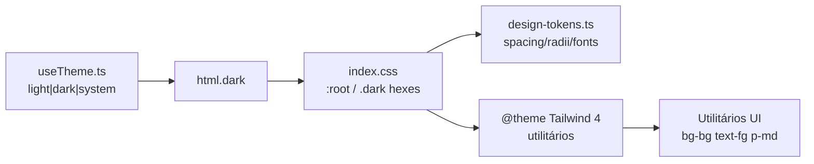

# Design System — EngrenaCode (Design Lock)

Documento consolidado do sistema visual do renderer. Artefatos detalhados:

| Arquivo | Conteúdo |
| ------- | -------- |
| [color-palette.md](./color-palette.md) | Paleta light/dark, status, satélites |
| [typography.md](./typography.md) | Fontes, escala observada |
| [spacing.md](./spacing.md) | Espaçamento, radius, layout, z/shadow |
| [tokens.md](./tokens.md) | Tabela mestra CSS ↔ Tailwind |

## Resumo executivo

EngrenaCode UI vive em **`src/renderer`**: Tailwind 4 + CSS variables + React.  
Não há MUI/Chakra/Emotion/CSS Modules. O **Design Lock** trava hexes do tema escuro e a ponte de tokens.

### Arquitetura de tokens

### Princípios extraídos 🟢

1. **Cores semânticas flat** (bg / surface / fg / accent / status), não escala 50–900.
2. **Accent laranja** `#ff6b00` / `#ff8c2e` idêntico em light e dark.
3. **Dark hexes travados** (comentário "não alterar" no CSS).
4. **Spacing 4–8–16–24–40** e **radius 5–8–12** literais no TS.
5. **Tema tri-modo** com persistência `engrenacode:theme` e anti-flash (módulo + `.no-transitions` + splash Electron).

### Componentes / superfícies tipadas pelo sistema

Não há design-system package separado (Storybook ausente). Componentes consomem utilitários diretamente.

Padrões recorrentes 🟡:

| Padrão | Classes / tokens |
| ------ | ---------------- |
| Card / panel | `rounded-lg border border-border bg-surface p-lg` |
| Input | `rounded-sm|md border border-border bg-surface-2 text-fg focus:border-accent ring-accent` |
| Badge accent | `rounded-full bg-accent/20 font-mono text-accent` |
| Badge status | `bg-amber/[0.14] text-amber` / `bg-red/[0.13] text-red` |
| Modal | `fixed inset-0 z-50 bg-black/50` + `rounded-lg border bg-surface shadow-lg` |
| Focus | `focus-visible:ring-2 focus-visible:ring-accent` |
| Markdown chat | `.chat-markdown` adiado (integração F03) |

### Syntax highlight / terminal

| Superfície | Tema | Confiança |
| ---------- | ---- | --------- |
| Shiki (contrato) | `github-light` / `github-dark` via `resolvedTheme` | 🟢 |
| xterm (contrato) | lê `--bg`, `--fg`, `--accent`, `--border` + JetBrains Mono | 🟢 |

### Shell (fora do token module)

`src/main/index.ts` → `backgroundColor: '#0a0a0b'` (dark `--bg`).

### Inventário de confiança

| Categoria | Tokens | Confiança |
| --------- | ------ | --------- |
| Cores UI (11 + scrollbar) | documentados | 🟢 |
| Spacing (5) | documentados | 🟢 |
| Radii (3) | documentados | 🟢 |
| Font families (3) | documentados | 🟢 |
| Theme runtime | documentado | 🟢 |
| Type scale / shadows / z-index | ausentes como tokens (Adiado) | 🔴 |
| experimento Grotesk | fora do Escopo Central F01.1 | 🟢 |
| Brand satélite | palette própria | 🟢 |

## Como regenerar / validar

1. Abrir `src/renderer/index.css` e conferir `:root` / `.dark` + `@theme`.
2. Abrir `src/renderer/tokens/design-tokens.ts`.
3. Conferir `src/renderer/hooks/useTheme.ts` (`engrenacode:theme`).
4. Smoke: trocar tema no `ThemeControl` de `#login` / chrome e inspecionar `<html class="dark">`.
